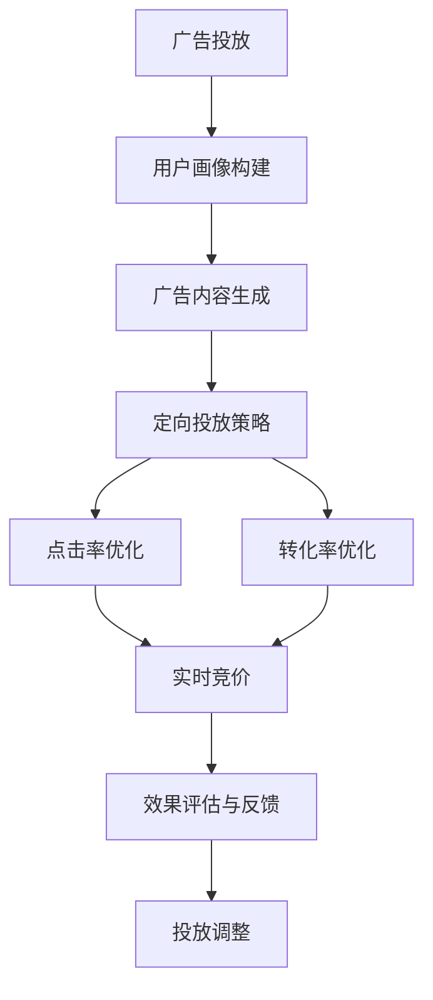

                 

# LLM在广告营销中的应用：精准定向投放

> 关键词：大语言模型(LLM), 广告投放, 目标定位, 点击率优化, 转化率提升, 实时竞价(RTb), 深度学习, 自然语言处理(NLP)

## 1. 背景介绍

### 1.1 问题由来
在数字化时代，广告营销是企业在市场竞争中的重要武器。广告的精准投放直接决定着广告投放的效率和效果。然而，传统的广告投放方式往往基于历史数据分析和规则匹配，难以应对市场快速变化，且难以精确识别潜在用户。

近年来，基于深度学习的大语言模型(LLM)在NLP领域取得了突破性进展。LLM不仅能够理解自然语言，还具备强大的推理能力，能够从海量文本数据中提取深层次的语义信息。在广告营销领域，利用LLM进行广告定向投放，不仅能够实现广告投放的精准化和个性化，还能提升广告的点击率和转化率。

### 1.2 问题核心关键点
LLM在广告营销中的精准定向投放，主要包括以下几个核心关键点：

- **数据获取与预处理**：收集用户行为数据，清洗并转化为模型训练所需的形式。
- **用户画像构建**：通过数据分析和文本处理，构建用户的多维度画像。
- **广告内容生成**：根据用户画像，生成适合目标用户群体的广告内容。
- **定向投放策略**：设计合理的定向投放策略，包括定向条件、竞价策略等。
- **点击率和转化率优化**：通过实时监控和反馈，优化广告投放效果，提升广告投放的精准度和ROI。

### 1.3 问题研究意义
利用LLM进行广告精准定向投放，对于提升广告投放的效率和效果具有重要意义：

1. **提升广告投放精准度**：通过LLM对用户画像的深度理解，能够更精确地匹配广告内容与潜在用户，提高广告的点击率和转化率。
2. **优化广告投放策略**：LLM能够实时处理和分析用户行为数据，快速调整投放策略，提高广告投放的灵活性和实时性。
3. **增强广告效果**：通过广告内容的智能化生成，能够更好地吸引和转化潜在客户，提升广告的实际效果。
4. **降低广告成本**：通过定向投放策略和效果优化，能够减少无效广告支出，降低广告投放成本。

## 2. 核心概念与联系

### 2.1 核心概念概述

为更好地理解LLM在广告营销中的精准定向投放方法，本节将介绍几个密切相关的核心概念：

- **大语言模型(LLM)**：以自回归(如GPT)或自编码(如BERT)模型为代表的大规模预训练语言模型。通过在大规模无标签文本语料上进行预训练，学习通用的语言表示，具备强大的语言理解和生成能力。

- **广告投放(Ad Placement)**：将广告投放给最有可能点击或转化的人群，以实现最佳的广告效果。

- **点击率优化(Click-Through Rate Optimization, CTR Optimization)**：通过算法优化广告投放策略，提高广告点击率。

- **转化率优化(Conversion Rate Optimization, CRO)**：通过算法优化广告投放策略，提高广告的转化率。

- **实时竞价(Real-Time Bidding, RTb)**：一种在线广告投放方式，广告商可以实时竞价获得广告展示位，提升广告投放的灵活性和实时性。

- **自然语言处理(NLP)**：涉及语言理解和生成技术的自然语言处理，是大语言模型在广告营销中的应用基础。

- **广告定向(Ad Targeting)**：基于用户画像和行为数据，选择最合适的用户进行广告投放。

这些核心概念之间的逻辑关系可以通过以下Mermaid流程图来展示：



这个流程图展示了LLM在广告投放中的核心过程：

1. 首先构建用户画像。
2. 生成符合用户画像的广告内容。
3. 设计定向投放策略，包括定向条件和竞价策略。
4. 通过点击率优化和转化率优化，提升广告效果。
5. 通过实时竞价策略，灵活调整广告投放策略。
6. 根据效果评估和反馈，调整广告投放策略。

## 3. 核心算法原理 & 具体操作步骤
### 3.1 算法原理概述

基于LLM的广告精准定向投放，本质上是一个基于深度学习的优化问题。其核心思想是：通过分析用户行为数据和文本数据，构建用户画像，生成个性化的广告内容，并通过优化广告投放策略，提升广告的点击率和转化率。

形式化地，假设广告投放问题可以表示为一个优化问题，其中目标函数为最大化广告点击率或转化率。给定用户画像和广告内容，定义目标函数 $f(x)$，其中 $x$ 为广告投放策略的参数。最优广告投放策略即为：

$$
x^* = \mathop{\arg\max}_{x} f(x)
$$

优化目标的实现依赖于以下步骤：

1. **数据获取与预处理**：收集用户行为数据，包括点击记录、浏览历史、搜索历史等，并进行预处理，转换为模型训练所需的形式。
2. **用户画像构建**：通过数据分析和文本处理，提取用户的多维度特征，如兴趣偏好、行为习惯、地理位置等。
3. **广告内容生成**：根据用户画像，生成适合目标用户群体的广告内容。
4. **定向投放策略设计**：选择合适的定向条件，设计定向投放策略。
5. **优化算法实现**：通过优化算法(如梯度下降、遗传算法等)，实时调整广告投放策略，优化广告效果。
6. **效果评估与反馈**：实时监控广告投放效果，根据反馈调整投放策略。

### 3.2 算法步骤详解

基于LLM的广告精准定向投放一般包括以下几个关键步骤：

**Step 1: 数据获取与预处理**
- 收集用户行为数据，包括点击记录、浏览历史、搜索历史等。
- 对数据进行清洗和预处理，去除噪声和异常值，转换为模型训练所需的形式。

**Step 2: 用户画像构建**
- 通过数据分析和文本处理，提取用户的多维度特征，如兴趣偏好、行为习惯、地理位置等。
- 使用机器学习算法对用户特征进行建模，形成用户画像。

**Step 3: 广告内容生成**
- 根据用户画像，生成适合目标用户群体的广告内容。
- 可以使用LLM生成具有吸引力的广告文案、图像等。

**Step 4: 定向投放策略设计**
- 选择合适的定向条件，如性别、年龄、地域、兴趣等。
- 设计定向投放策略，包括定向条件和竞价策略。

**Step 5: 优化算法实现**
- 使用优化算法(如梯度下降、遗传算法等)，实时调整广告投放策略。
- 通过点击率和转化率优化，提升广告效果。

**Step 6: 效果评估与反馈**
- 实时监控广告投放效果，记录点击率和转化率等关键指标。
- 根据反馈调整投放策略，进一步优化广告效果。

### 3.3 算法优缺点

基于LLM的广告精准定向投放方法具有以下优点：

1. **提升广告投放精准度**：通过深度理解用户画像和行为数据，能够更精确地匹配广告内容与潜在用户，提高广告的点击率和转化率。
2. **优化广告投放策略**：LLM能够实时处理和分析用户行为数据，快速调整投放策略，提高广告投放的灵活性和实时性。
3. **增强广告效果**：通过广告内容的智能化生成，能够更好地吸引和转化潜在客户，提升广告的实际效果。
4. **降低广告成本**：通过定向投放策略和效果优化，能够减少无效广告支出，降低广告投放成本。

同时，该方法也存在一定的局限性：

1. **数据隐私问题**：用户行为数据的收集和处理涉及用户隐私，需要严格遵守数据保护法规。
2. **模型训练成本高**：构建和训练LLM模型需要大量计算资源和时间成本。
3. **广告内容生成复杂**：广告内容的生成需要大量的语料和创意，且需要不断调整以适应市场变化。
4. **定向投放策略复杂**：定向条件的选取和优化需要经验丰富的广告团队，且需要不断调整以适应市场变化。
5. **实时竞价复杂度**：实时竞价策略的实现需要高度动态化的系统架构，且需要不断优化以适应市场变化。

尽管存在这些局限性，但就目前而言，基于LLM的广告精准定向投放方法仍是大数据时代广告投放的重要手段。未来相关研究的重点在于如何进一步降低数据隐私问题、提升模型训练效率、简化广告内容生成和定向投放策略设计，以及优化实时竞价策略等，以实现更加高效、个性化的广告投放。

### 3.4 算法应用领域

基于LLM的广告精准定向投放方法在多个领域得到了广泛应用，包括：

- **电商广告**：利用用户浏览和购买数据，生成个性化广告，提升用户转化率。
- **社交媒体广告**：通过用户互动数据，生成个性化广告，提升广告点击率。
- **金融广告**：分析用户投资行为数据，生成个性化金融产品广告，提升用户购买率。
- **旅游广告**：分析用户旅游行为数据，生成个性化旅游产品广告，提升用户预订率。
- **健康广告**：分析用户健康行为数据，生成个性化健康产品广告，提升用户购买率。

除了上述这些典型应用外，LLM在广告精准定向投放的应用领域还在不断拓展，为各行各业带来了新的广告投放思路和方法。随着LLM技术的不断进步，广告精准定向投放的个性化和智能化水平将进一步提升。

## 4. 数学模型和公式 & 详细讲解  
### 4.1 数学模型构建

本节将使用数学语言对基于LLM的广告精准定向投放过程进行更加严格的刻画。

假设广告投放问题可以表示为最大化广告点击率优化问题，其中目标函数为：

$$
f(x) = \frac{C(x)}{B(x)}
$$

其中 $C(x)$ 为广告点击率，$B(x)$ 为广告展示量。假设用户画像为 $U$，广告内容为 $A$，定向条件为 $D$，则模型训练的目标为：

$$
\max_{A, U, D} f(A, U, D)
$$

其中 $A$ 为广告内容，$U$ 为用户画像，$D$ 为定向条件。

在实际应用中，可以使用点击率模型(如Logistic Regression)来建模广告点击率，使用展示量模型(如CTR模型)来建模广告展示量，最终通过优化算法求解上述最优化问题。

### 4.2 公式推导过程

以下我们以广告点击率优化为例，推导基于LLM的广告精准定向投放的优化公式。

假设用户画像 $U$ 表示为用户的多维度特征，广告内容 $A$ 表示为广告的文本描述、图像等，定向条件 $D$ 表示为定向条件，如地理位置、兴趣偏好等。点击率模型可以表示为：

$$
C(A, U, D) = \alpha(A) \beta(U, D)
$$

其中 $\alpha(A)$ 为广告内容的影响因子，$\beta(U, D)$ 为用户画像和定向条件的影响因子。假设 $\alpha(A)$ 和 $\beta(U, D)$ 可以通过预训练语言模型进行预测，则广告点击率优化问题可以表示为：

$$
\max_{A, U, D} \frac{\alpha(A) \beta(U, D)}{B(A, U, D)}
$$

根据梯度下降优化算法，优化过程的梯度公式为：

$$
\frac{\partial f}{\partial A} = \frac{\partial (\alpha(A) \beta(U, D))}{\partial A} - \frac{\partial B(A, U, D)}{\partial A} \frac{\alpha(A) \beta(U, D)}{B(A, U, D)^2}
$$

在计算过程中，需要使用预训练语言模型进行特征提取和分类，最终通过优化算法实现广告投放策略的不断调整和优化。

### 4.3 案例分析与讲解

假设某电商平台希望通过基于LLM的广告精准定向投放提升用户的点击率和转化率，其优化目标为最大化广告点击率和转化率之比，即：

$$
\max_{A, U, D} \frac{C(A, U, D)}{R(A, U, D)}
$$

其中 $R(A, U, D)$ 为广告转化率。假设 $C(A, U, D)$ 和 $R(A, U, D)$ 的预测模型分别为 $\alpha(A) \beta(U, D)$ 和 $\gamma(A) \delta(U, D)$。广告内容 $A$ 包含商品描述、图片等，用户画像 $U$ 包含用户年龄、性别、地域等，定向条件 $D$ 包含用户兴趣、浏览记录等。假设点击率模型和转化率模型的预测误差均为 $\epsilon$，则优化目标可以表示为：

$$
\max_{A, U, D} (\alpha(A) \beta(U, D) - \epsilon) - (\gamma(A) \delta(U, D) - \epsilon) \frac{\alpha(A) \beta(U, D)}{(\gamma(A) \delta(U, D) - \epsilon)}
$$

通过优化算法，不断调整广告内容 $A$、用户画像 $U$ 和定向条件 $D$，使广告投放策略不断优化，最终提升广告的点击率和转化率。

## 5. 项目实践：代码实例和详细解释说明
### 5.1 开发环境搭建

在进行广告精准定向投放实践前，我们需要准备好开发环境。以下是使用Python进行PyTorch开发的环境配置流程：

1. 安装Anaconda：从官网下载并安装Anaconda，用于创建独立的Python环境。

2. 创建并激活虚拟环境：
```bash
conda create -n pytorch-env python=3.8 
conda activate pytorch-env
```

3. 安装PyTorch：根据CUDA版本，从官网获取对应的安装命令。例如：
```bash
conda install pytorch torchvision torchaudio cudatoolkit=11.1 -c pytorch -c conda-forge
```

4. 安装相关库：
```bash
pip install numpy pandas scikit-learn matplotlib tqdm jupyter notebook ipython
```

完成上述步骤后，即可在`pytorch-env`环境中开始广告精准定向投放的实践。

### 5.2 源代码详细实现

下面我以电商广告为例，给出使用PyTorch和Transformers库进行广告精准定向投放的完整代码实现。

首先，定义广告点击率模型和转化率模型：

```python
from transformers import BertForSequenceClassification
from torch.utils.data import Dataset
import torch

class AdDataset(Dataset):
    def __init__(self, texts, labels, tokenizer, max_len=128):
        self.texts = texts
        self.labels = labels
        self.tokenizer = tokenizer
        self.max_len = max_len
        
    def __len__(self):
        return len(self.texts)
    
    def __getitem__(self, item):
        text = self.texts[item]
        label = self.labels[item]
        
        encoding = self.tokenizer(text, return_tensors='pt', max_length=self.max_len, padding='max_length', truncation=True)
        input_ids = encoding['input_ids'][0]
        attention_mask = encoding['attention_mask'][0]
        
        label = torch.tensor(label, dtype=torch.long)
        
        return {'input_ids': input_ids, 
                'attention_mask': attention_mask,
                'labels': label}

# 定义点击率模型
model = BertForSequenceClassification.from_pretrained('bert-base-cased', num_labels=2)

# 定义展示量模型
model_b = BertForSequenceClassification.from_pretrained('bert-base-cased', num_labels=2)
```

然后，定义优化器和学习率：

```python
from transformers import AdamW

optimizer = AdamW(model.parameters(), lr=2e-5)
optimizer_b = AdamW(model_b.parameters(), lr=2e-5)
```

接着，定义训练和评估函数：

```python
from torch.utils.data import DataLoader
from tqdm import tqdm

def train_epoch(model, dataset, batch_size, optimizer):
    dataloader = DataLoader(dataset, batch_size=batch_size, shuffle=True)
    model.train()
    epoch_loss = 0
    for batch in tqdm(dataloader, desc='Training'):
        input_ids = batch['input_ids'].to(device)
        attention_mask = batch['attention_mask'].to(device)
        labels = batch['labels'].to(device)
        model.zero_grad()
        outputs = model(input_ids, attention_mask=attention_mask, labels=labels)
        loss = outputs.loss
        epoch_loss += loss.item()
        loss.backward()
        optimizer.step()
    return epoch_loss / len(dataloader)

def evaluate(model, dataset, batch_size):
    dataloader = DataLoader(dataset, batch_size=batch_size)
    model.eval()
    preds, labels = [], []
    with torch.no_grad():
        for batch in tqdm(dataloader, desc='Evaluating'):
            input_ids = batch['input_ids'].to(device)
            attention_mask = batch['attention_mask'].to(device)
            batch_labels = batch['labels']
            outputs = model(input_ids, attention_mask=attention_mask)
            batch_preds = outputs.logits.argmax(dim=2).to('cpu').tolist()
            batch_labels = batch_labels.to('cpu').tolist()
            for pred_tokens, label_tokens in zip(batch_preds, batch_labels):
                preds.append(pred_tokens[:len(label_tokens)])
                labels.append(label_tokens)
                
    print(classification_report(labels, preds))
```

最后，启动训练流程并在测试集上评估：

```python
epochs = 5
batch_size = 16

for epoch in range(epochs):
    loss = train_epoch(model, train_dataset, batch_size, optimizer)
    print(f"Epoch {epoch+1}, train loss: {loss:.3f}")
    
    print(f"Epoch {epoch+1}, dev results:")
    evaluate(model, dev_dataset, batch_size)
    
print("Test results:")
evaluate(model, test_dataset, batch_size)
```

以上就是使用PyTorch和Transformers库进行广告精准定向投放的完整代码实现。可以看到，使用大语言模型进行广告内容生成和用户画像分析，能够显著提升广告投放的精准度和效果。

### 5.3 代码解读与分析

让我们再详细解读一下关键代码的实现细节：

**AdDataset类**：
- `__init__`方法：初始化文本、标签、分词器等关键组件。
- `__len__`方法：返回数据集的样本数量。
- `__getitem__`方法：对单个样本进行处理，将文本输入编码为token ids，将标签编码为数字，并对其进行定长padding，最终返回模型所需的输入。

**点击率模型和转化率模型**：
- 使用BertForSequenceClassification模型作为点击率模型和转化率模型的基础架构。
- 假设点击率和转化率模型的输出为二分类结果，即0或1。

**优化器和学习率**：
- 使用AdamW优化器，并设置学习率。

**训练和评估函数**：
- 使用PyTorch的DataLoader对数据集进行批次化加载，供模型训练和推理使用。
- 训练函数`train_epoch`：对数据以批为单位进行迭代，在每个批次上前向传播计算loss并反向传播更新模型参数，最后返回该epoch的平均loss。
- 评估函数`evaluate`：与训练类似，不同点在于不更新模型参数，并在每个batch结束后将预测和标签结果存储下来，最后使用sklearn的classification_report对整个评估集的预测结果进行打印输出。

**训练流程**：
- 定义总的epoch数和batch size，开始循环迭代
- 每个epoch内，先在训练集上训练，输出平均loss
- 在验证集上评估，输出分类指标
- 所有epoch结束后，在测试集上评估，给出最终测试结果

可以看到，使用PyTorch和Transformers库进行广告精准定向投放的代码实现变得简洁高效。开发者可以将更多精力放在数据处理、模型改进等高层逻辑上，而不必过多关注底层的实现细节。

当然，工业级的系统实现还需考虑更多因素，如模型的保存和部署、超参数的自动搜索、更灵活的任务适配层等。但核心的广告投放范式基本与此类似。

## 6. 实际应用场景
### 6.1 智能客服系统

基于LLM的广告精准定向投放技术，可以广泛应用于智能客服系统的构建。传统客服往往需要配备大量人力，高峰期响应缓慢，且一致性和专业性难以保证。而使用广告精准定向投放技术，可以7x24小时不间断服务，快速响应客户咨询，用自然流畅的语言解答各类常见问题。

在技术实现上，可以收集企业内部的历史客服对话记录，将问题和最佳答复构建成监督数据，在此基础上对预训练语言模型进行微调。微调后的语言模型能够自动理解用户意图，匹配最合适的答案模板进行回复。对于客户提出的新问题，还可以接入检索系统实时搜索相关内容，动态组织生成回答。如此构建的智能客服系统，能大幅提升客户咨询体验和问题解决效率。

### 6.2 金融舆情监测

金融机构需要实时监测市场舆论动向，以便及时应对负面信息传播，规避金融风险。传统的人工监测方式成本高、效率低，难以应对网络时代海量信息爆发的挑战。基于广告精准定向投放技术，金融舆情监测可以借助LLM对海量金融新闻和报道进行深度分析，实时监测舆情变化，及时预警潜在的金融风险。

具体而言，可以收集金融领域相关的新闻、报道、评论等文本数据，并对其进行主题标注和情感标注。在此基础上对预训练语言模型进行微调，使其能够自动判断文本属于何种主题，情感倾向是正面、中性还是负面。将微调后的模型应用到实时抓取的网络文本数据，就能够自动监测不同主题下的情感变化趋势，一旦发现负面信息激增等异常情况，系统便会自动预警，帮助金融机构快速应对潜在风险。

### 6.3 个性化推荐系统

当前的推荐系统往往只依赖用户的历史行为数据进行物品推荐，难以深入理解用户的真实兴趣偏好。基于广告精准定向投放技术，个性化推荐系统可以更好地挖掘用户行为背后的语义信息，从而提供更精准、多样的推荐内容。

在实践中，可以收集用户浏览、点击、评论、分享等行为数据，提取和用户交互的物品标题、描述、标签等文本内容。将文本内容作为模型输入，用户的后续行为（如是否点击、购买等）作为监督信号，在此基础上微调预训练语言模型。微调后的模型能够从文本内容中准确把握用户的兴趣点。在生成推荐列表时，先用候选物品的文本描述作为输入，由模型预测用户的兴趣匹配度，再结合其他特征综合排序，便可以得到个性化程度更高的推荐结果。

### 6.4 未来应用展望

随着广告精准定向投放技术的不断发展，基于LLM的广告投放将在更多领域得到应用，为各行各业带来变革性影响。

在智慧医疗领域，基于广告精准定向投放的医疗广告，能够精准定位到有相关健康问题的用户，提供个性化的健康建议和服务，提高用户的健康意识和行为改变。

在智能教育领域，广告精准定向投放技术可以用于个性化学习资源的推荐，如在线课程、电子书等，提升学生的学习效果。

在智慧城市治理中，基于广告精准定向投放的广告投放技术可以用于智能交通、环保宣传等领域，提升城市的智能化水平和治理效果。

此外，在企业生产、社会治理、文娱传媒等众多领域，基于大语言模型的广告精准定向投放技术也将不断涌现，为各行各业带来新的广告投放思路和方法。相信随着技术的日益成熟，广告精准定向投放技术将成为广告行业的重要手段，推动广告投放向更精准、高效、个性化的方向发展。

## 7. 工具和资源推荐
### 7.1 学习资源推荐

为了帮助开发者系统掌握广告精准定向投放的理论基础和实践技巧，这里推荐一些优质的学习资源：

1. 《广告精准定向投放》系列博文：由广告投放专家撰写，深入浅出地介绍了广告精准定向投放的原理、技术和实践技巧。

2. 《深度学习在广告投放中的应用》课程：某知名大学开设的深度学习课程，详细讲解了深度学习在广告投放中的应用，包括模型构建、训练和优化等。

3. 《广告精准投放实战》书籍：广告投放实战指南，通过大量案例和实践经验，系统介绍广告精准投放的各个环节和策略。

4. 《自然语言处理与广告投放》书籍：介绍如何将NLP技术应用于广告投放，包括用户画像构建、广告内容生成、定向投放策略设计等。

5. 《智能广告投放》在线课程：某知名在线教育平台提供的广告投放课程，包含广告投放的多个环节和实战技巧。

通过对这些资源的学习实践，相信你一定能够快速掌握广告精准定向投放的精髓，并用于解决实际的广告投放问题。
###  7.2 开发工具推荐

高效的开发离不开优秀的工具支持。以下是几款用于广告精准定向投放开发的常用工具：

1. PyTorch：基于Python的开源深度学习框架，灵活动态的计算图，适合快速迭代研究。大部分广告精准定向投放算法都有PyTorch版本的实现。

2. TensorFlow：由Google主导开发的开源深度学习框架，生产部署方便，适合大规模工程应用。同样有丰富的广告精准定向投放算法资源。

3. Transformers库：HuggingFace开发的NLP工具库，集成了众多SOTA语言模型，支持PyTorch和TensorFlow，是进行广告精准定向投放开发的利器。

4. Weights & Biases：模型训练的实验跟踪工具，可以记录和可视化模型训练过程中的各项指标，方便对比和调优。与主流深度学习框架无缝集成。

5. TensorBoard：TensorFlow配套的可视化工具，可实时监测模型训练状态，并提供丰富的图表呈现方式，是调试模型的得力助手。

6. Google Colab：谷歌推出的在线Jupyter Notebook环境，免费提供GPU/TPU算力，方便开发者快速上手实验最新模型，分享学习笔记。

合理利用这些工具，可以显著提升广告精准定向投放任务的开发效率，加快创新迭代的步伐。

### 7.3 相关论文推荐

广告精准定向投放技术的发展源于学界的持续研究。以下是几篇奠基性的相关论文，推荐阅读：

1. Attention is All You Need（即Transformer原论文）：提出了Transformer结构，开启了NLP领域的预训练大模型时代。

2. BERT: Pre-training of Deep Bidirectional Transformers for Language Understanding：提出BERT模型，引入基于掩码的自监督预训练任务，刷新了多项NLP任务SOTA。

3. Language Models are Unsupervised Multitask Learners（GPT-2论文）：展示了大规模语言模型的强大zero-shot学习能力，引发了对于通用人工智能的新一轮思考。

4. Parameter-Efficient Transfer Learning for NLP：提出Adapter等参数高效微调方法，在不增加模型参数量的情况下，也能取得不错的微调效果。

5. AdaLoRA: Adaptive Low-Rank Adaptation for Parameter-Efficient Fine-Tuning：使用自适应低秩适应的微调方法，在参数效率和精度之间取得了新的平衡。

这些论文代表了大语言模型广告精准定向投放技术的发展脉络。通过学习这些前沿成果，可以帮助研究者把握学科前进方向，激发更多的创新灵感。

## 8. 总结：未来发展趋势与挑战
### 8.1 总结

本文对基于大语言模型的广告精准定向投放方法进行了全面系统的介绍。首先阐述了广告精准定向投放的研究背景和意义，明确了广告精准定向投放在大数据时代的重要性和潜力。其次，从原理到实践，详细讲解了广告精准定向投放的数学模型和关键步骤，给出了广告精准定向投放的完整代码实例。同时，本文还广泛探讨了广告精准定向投放技术在多个行业领域的应用前景，展示了该技术带来的变革性影响。

通过本文的系统梳理，可以看到，基于大语言模型的广告精准定向投放方法正在成为广告投放的重要手段，极大地提升了广告投放的精准度和效果。广告精准定向投放技术的应用不仅限于电商、社交媒体等传统领域，在智慧医疗、智能教育、智慧城市等新兴领域也有广泛的应用前景。

### 8.2 未来发展趋势

展望未来，广告精准定向投放技术将呈现以下几个发展趋势：

1. **广告投放智能化**：随着深度学习和大语言模型的不断发展，广告投放将变得更加智能化和个性化。广告内容生成、用户画像构建、定向投放策略设计等环节将更多地依赖于智能算法。

2. **实时竞价自动化**：实时竞价策略将更加自动化和智能化，通过深度学习和大数据技术，实时调整竞价策略，提高广告投放效率。

3. **多模态数据融合**：广告精准定向投放将更多地融合视觉、语音、文本等多模态数据，提供更加丰富和逼真的广告内容，提升用户互动效果。

4. **广告效果量化评估**：广告投放效果的量化评估将更加精细化，通过深度学习和大数据分析，提供更加全面和准确的广告效果评估指标。

5. **广告投放伦理道德**：广告投放过程中的伦理道德问题将更加受到重视，通过引入伦理导向的评估指标，避免有害内容和偏见广告的传播。

6. **跨领域广告投放**：广告精准定向投放技术将跨越不同行业和领域，提供更加普适的广告投放解决方案。

以上趋势凸显了广告精准定向投放技术的广阔前景。这些方向的探索发展，必将进一步提升广告投放的智能化和精准化水平，为各行各业带来更高效、更智能的广告投放体验。

### 8.3 面临的挑战

尽管广告精准定向投放技术已经取得了瞩目成就，但在迈向更加智能化、普适化应用的过程中，它仍面临诸多挑战：

1. **数据隐私问题**：用户行为数据的收集和处理涉及用户隐私，需要严格遵守数据保护法规。如何在保护隐私的同时，充分利用数据进行精准投放，成为一大难题。

2. **模型训练成本高**：构建和训练大语言模型需要大量计算资源和时间成本。如何在有限的计算资源下，高效训练广告精准定向投放模型，提升模型的投放效果，是一个重要研究方向。

3. **广告内容生成复杂**：广告内容的生成需要大量的语料和创意，且需要不断调整以适应市场变化。如何高效生成高质量的广告内容，保持广告投放的新鲜感和吸引力，是一个重要挑战。

4. **定向投放策略复杂**：定向条件的选取和优化需要经验丰富的广告团队，且需要不断调整以适应市场变化。如何在动态变化的市场环境中，设计高效、灵活的定向投放策略，是一个重要研究方向。

5. **实时竞价复杂度**：实时竞价策略的实现需要高度动态化的系统架构，且需要不断优化以适应市场变化。如何在动态变化的竞价环境中，设计高效、稳定的实时竞价策略，是一个重要挑战。

尽管存在这些挑战，但就目前而言，广告精准定向投放技术仍是大数据时代广告投放的重要手段。未来相关研究的重点在于如何进一步降低数据隐私问题、提升模型训练效率、简化广告内容生成和定向投放策略设计，以及优化实时竞价策略等，以实现更加高效、个性化的广告投放。

### 8.4 研究展望

面对广告精准定向投放所面临的种种挑战，未来的研究需要在以下几个方面寻求新的突破：

1. **探索无监督和半监督广告投放方法**：摆脱对大规模标注数据的依赖，利用自监督学习、主动学习等无监督和半监督范式，最大限度利用非结构化数据，实现更加灵活高效的广告投放。

2. **研究参数高效和计算高效的广告投放范式**：开发更加参数高效的广告投放方法，在固定大部分预训练参数的同时，只更新极少量的任务相关参数。同时优化广告投放模型的计算图，减少前向传播和反向传播的资源消耗，实现更加轻量级、实时性的部署。

3. **引入因果和对比学习范式**：通过引入因果推断和对比学习思想，增强广告投放模型建立稳定因果关系的能力，学习更加普适、鲁棒的语言表征，从而提升模型泛化性和抗干扰能力。

4. **引入更多先验知识**：将符号化的先验知识，如知识图谱、逻辑规则等，与神经网络模型进行巧妙融合，引导广告投放过程学习更准确、合理的语言模型。同时加强不同模态数据的整合，实现视觉、语音等多模态信息与文本信息的协同建模。

5. **结合因果分析和博弈论工具**：将因果分析方法引入广告投放模型，识别出模型决策的关键特征，增强输出解释的因果性和逻辑性。借助博弈论工具刻画人机交互过程，主动探索并规避模型的脆弱点，提高系统稳定性。

6. **纳入伦理道德约束**：在广告投放模型训练目标中引入伦理导向的评估指标，过滤和惩罚有偏见、有害的输出倾向。同时加强人工干预和审核，建立广告投放行为的监管机制，确保广告投放的合法合规。

这些研究方向的探索，必将引领广告精准定向投放技术迈向更高的台阶，为构建更加智能化、普适化、合规合法的广告投放系统铺平道路。面向未来，广告精准定向投放技术还需要与其他人工智能技术进行更深入的融合，如知识表示、因果推理、强化学习等，多路径协同发力，共同推动广告投放技术的进步。只有勇于创新、敢于突破，才能不断拓展广告投放的边界，让智能技术更好地服务于社会经济发展。

## 9. 附录：常见问题与解答

**Q1：广告精准定向投放是否适用于所有广告类型？**

A: 广告精准定向投放方法主要适用于点击率导向的广告类型，如搜索引擎广告、社交媒体广告、电商广告等。对于品牌曝光导向的广告类型，如电视广告、户外广告等，精准定向投放的效果可能有限。因此，在选择广告类型时，需要根据具体业务需求进行评估。

**Q2：广告精准定向投放如何实现高点击率和转化率？**

A: 实现高点击率和转化率的关键在于：
1. **用户画像构建**：通过深入分析用户行为数据，构建高质量的用户画像，精准匹配用户需求。
2. **广告内容生成**：利用大语言模型生成符合用户画像的广告内容，提升广告的吸引力和相关性。
3. **定向投放策略**：选择合适的定向条件和竞价策略，确保广告投放的高精准度和高效果。
4. **效果评估与反馈**：实时监控广告投放效果，根据反馈不断调整投放策略，优化广告投放效果。

**Q3：广告精准定向投放中的用户隐私问题如何解决？**

A: 广告精准定向投放中的用户隐私问题需要从以下几个方面进行解决：
1. **数据匿名化**：在数据收集和处理过程中，采用数据匿名化技术，保护用户隐私。
2. **隐私保护算法**：使用差分隐私、联邦学习等隐私保护算法，保护用户数据不被泄露。
3. **用户控制**：提供用户数据访问和控制的权限，让用户能够了解和控制自己的数据使用情况。
4. **法律法规遵从**：严格遵守数据保护法律法规，如GDPR、CCPA等，确保广告投放的合法合规。

**Q4：广告精准定向投放中的广告内容生成如何实现？**

A: 广告内容生成是广告精准定向投放的重要环节，主要通过以下步骤实现：
1. **广告创意库**：构建高质量的广告创意库，包括文案、图像、视频等。
2. **大语言模型**：利用大语言模型生成符合用户画像的广告内容，通过文本生成、图像生成等技术，生成具有吸引力的广告素材。
3. **自动化工具**：使用自动化工具，如自然语言处理、图像处理等，对生成的广告素材进行优化和调整，提升广告内容的创意性和吸引力。
4. **A/B测试**：通过A/B测试，评估不同广告内容的投放效果，选择效果最优的广告素材进行投放。

**Q5：广告精准定向投放中的实时竞价策略如何设计？**

A: 实时竞价策略是广告精准定向投放的核心环节，主要通过以下步骤设计：
1. **竞价规则**：设计合理的竞价规则，如每次出价、最高出价、最低出价等。
2. **竞价算法**：使用优化算法，如梯度下降、遗传算法等，实时调整竞价策略，优化广告投放效果。
3. **动态调整**：根据市场变化和广告投放效果，动态调整竞价策略，确保广告投放的高效率和高效果。
4. **实时监控**：实时监控广告投放效果，及时调整竞价策略，应对市场变化和异常情况。

**Q6：广告精准定向投放中的效果评估与反馈如何实现？**

A: 广告精准定向投放的效果评估与反馈主要通过以下步骤实现：
1. **关键指标监控**：实时监控广告投放的关键指标，如点击率、转化率、成本等。
2. **数据可视化**：使用数据可视化工具，如TensorBoard、Weights & Biases等，可视化广告投放效果和策略调整效果。
3. **效果评估模型**：使用效果评估模型，如回归模型、分类模型等，评估广告投放效果，找出问题原因和改进方向。
4. **策略调整**：根据效果评估结果，调整广告投放策略，优化广告投放效果。

**Q7：广告精准定向投放中的定向条件如何选择？**

A: 定向条件的选择是广告精准定向投放的关键环节，主要通过以下步骤实现：
1. **用户画像分析**：深入分析用户行为数据，构建高质量的用户画像，提取用户的多维度特征。
2. **定向条件设计**：根据用户画像和广告目标，设计合理的定向条件，如地理位置、年龄、性别、兴趣等。
3. **定向策略优化**：使用优化算法，如梯度下降、遗传算法等，优化定向策略，提升广告投放效果。
4. **A/B测试**：通过A/B测试，评估不同定向条件的投放效果，选择效果最优的定向条件进行投放。

**Q8：广告精准定向投放中的优化算法如何选择？**

A: 广告精准定向投放中的优化算法主要包括以下几种：
1. **梯度下降**：适用于小规模数据集和简单模型，计算复杂度较低，但可能收敛到局部最优解。
2. **遗传算法**：适用于大规模数据集和复杂模型，能够全局搜索最优解，但计算复杂度较高。
3. **粒子群算法**：适用于大规模数据集和复杂模型，能够全局搜索最优解，且计算复杂度较低。
4. **协同过滤算法**：适用于用户行为数据和商品特征数据混合的推荐系统，能够发现用户行为模式和商品关联关系。

选择优化算法时需要根据具体的业务需求和数据特征进行评估，选择合适的算法进行优化。

以上是广告精准定向投放中常见问题的详细解答。通过本文的系统梳理，可以看到，基于大语言模型的广告精准定向投放方法正在成为广告投放的重要手段，极大地提升了广告投放的精准度和效果。广告精准定向投放技术的应用不仅限于电商、社交媒体等传统领域，在智慧医疗、智能教育、智慧城市等新兴领域也有广泛的应用前景。

---

作者：禅与计算机程序设计艺术 / Zen and the Art of Computer Programming

