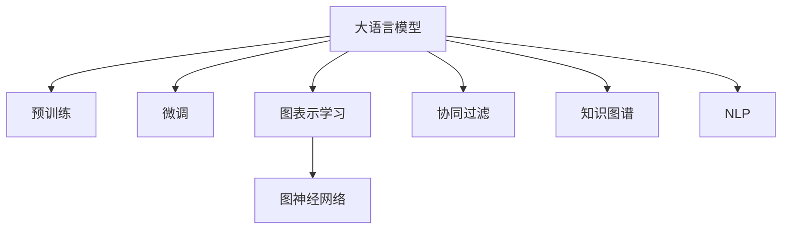

                 

# LLM在推荐系统中的图表示学习应用

> 关键词：大语言模型, 图表示学习, 推荐系统, 自然语言处理, 协同过滤, 知识图谱

## 1. 背景介绍

### 1.1 问题由来

随着互联网和数字技术的发展，推荐系统已经成为信息时代不可或缺的一部分。无论是电商平台、社交媒体、音乐平台还是新闻网站，推荐系统都在帮助用户发现他们可能感兴趣的内容。然而，现有的推荐算法往往基于静态特征的相似度匹配，忽略了内容的多维度特征和用户动态行为的变化。

大语言模型（Large Language Model, LLM）的兴起，为推荐系统提供了新的解决方案。LLM通过自监督学习和大规模预训练，获得了强大的语言表示能力，能够自然地理解用户意图和物品描述，从而在推荐系统中展现出令人瞩目的潜力。

### 1.2 问题核心关键点

基于大语言模型的推荐系统，将大语言模型和图表示学习技术相结合，通过学习物品之间的关系和用户行为，构建更加丰富和精准的推荐模型。核心关键点包括：

1. **大语言模型的预训练与微调**：在大规模无标签文本数据上进行预训练，学习通用语言表示。在推荐任务上微调大语言模型，使其能够更好地理解物品和用户特征。
2. **图表示学习与图神经网络**：将用户和物品视为节点，将用户行为和物品属性视为边，通过图神经网络学习物品之间的关系和用户行为模式。
3. **联合训练与集成优化**：将大语言模型与图神经网络联合训练，并通过多模型集成方法优化模型效果。

这些关键点共同构成了LLM在推荐系统中的应用框架，使其能够更好地捕捉物品间的复杂关系和用户的多样化需求。

### 1.3 问题研究意义

大语言模型在推荐系统中的应用，不仅能够提升推荐质量，还能为推荐系统注入新的生命力。具体而言：

1. **多维度特征理解**：大语言模型能够理解文本内容的多维度特征，捕捉用户和物品之间的复杂关系，从而提供更加精准和多样化的推荐。
2. **动态行为适应**：通过学习用户的行为模式，大语言模型能够适应用户的动态变化，提供更个性化的推荐。
3. **知识图谱融合**：通过将知识图谱与大语言模型结合，推荐系统能够利用外部结构化知识，提高推荐的可靠性和泛化能力。
4. **语义驱动推荐**：大语言模型的语言理解能力，能够实现语义驱动的推荐，增强推荐的解释性和可理解性。
5. **跨领域迁移能力**：大语言模型具有良好的跨领域迁移能力，能够应用于多种推荐场景，拓展推荐系统的应用范围。

总之，LLM在推荐系统中的应用，有望大幅提升推荐系统的性能和用户体验，推动推荐技术的发展和普及。

## 2. 核心概念与联系

### 2.1 核心概念概述

为更好地理解LLM在推荐系统中的应用，本节将介绍几个密切相关的核心概念：

- **大语言模型（LLM）**：指通过在大规模无标签文本数据上进行预训练，学习通用语言表示的深度学习模型，如GPT、BERT等。
- **图表示学习**：指通过图神经网络（Graph Neural Network, GNN）学习图数据结构中节点之间的关系，将其转化为可计算的向量表示的技术。
- **协同过滤**：指基于用户之间的相似性和物品之间的相似性，进行推荐的方法，包括基于用户的协同过滤和基于物品的协同过滤。
- **知识图谱**：指通过实体和关系描述构建的图结构数据，用于表示和查询实体之间的语义关系。
- **自然语言处理（NLP）**：指通过计算模型处理和理解人类语言的技术，涉及文本表示、语言模型、信息检索等多个领域。

这些核心概念之间的逻辑关系可以通过以下Mermaid流程图来展示：



这个流程图展示了大语言模型的核心概念及其之间的关系：

1. 大语言模型通过预训练获得基础能力。
2. 微调是对预训练模型进行任务特定的优化，使其能够更好地适应推荐任务。
3. 图表示学习通过学习用户和物品之间的关系，构建图神经网络。
4. 协同过滤基于用户或物品的相似性进行推荐。
5. 知识图谱用于表示和查询实体之间的语义关系。
6. 自然语言处理涉及文本表示、语言模型、信息检索等多个领域，与推荐系统紧密相关。

这些概念共同构成了LLM在推荐系统中的应用框架，使其能够更好地捕捉物品间的复杂关系和用户的多样化需求。

## 3. 核心算法原理 & 具体操作步骤

### 3.1 算法原理概述

基于大语言模型的推荐系统，本质上是将大语言模型和图表示学习技术相结合的联合推荐模型。其核心思想是：将用户和物品视为图中的节点，将用户行为和物品属性视为边，通过图神经网络学习物品之间的关系和用户行为模式，在大语言模型上进行微调，从而得到更加精准和多样化的推荐。

形式化地，假设用户集合为 $U$，物品集合为 $I$，用户与物品之间的行为关系表示为图 $G=(U,I,E)$，其中 $E$ 表示边的集合。设大语言模型为 $M_{\theta}$，图神经网络为 $GNN_{\phi}$。推荐模型的优化目标是最小化推荐损失函数 $\mathcal{L}(M_{\theta},GNN_{\phi})$，其中 $M_{\theta}$ 和 $GNN_{\phi}$ 分别为大语言模型和图神经网络的参数。

### 3.2 算法步骤详解

基于大语言模型的推荐系统一般包括以下几个关键步骤：

**Step 1: 准备数据和模型**

- **数据准备**：收集用户行为数据和物品属性数据，构建用户-物品图数据结构。
- **模型选择**：选择合适的图神经网络和预训练语言模型作为初始化参数，如GraphSAGE、GAT、BERT等。

**Step 2: 图嵌入表示**

- **图神经网络训练**：使用图神经网络对用户-物品图进行训练，学习每个节点和边的表示。
- **图嵌入特征提取**：将节点表示作为大语言模型的输入，进行语言表示学习。

**Step 3: 大语言模型微调**

- **微调目标函数**：根据推荐任务设计损失函数，如点击率预测、评分预测等。
- **微调超参数**：设置学习率、批大小、迭代轮数等超参数。
- **模型优化**：使用梯度下降等优化算法，最小化微调目标函数，更新大语言模型参数。

**Step 4: 评估与部署**

- **模型评估**：在测试集上评估模型性能，如准确率、召回率、F1-score等。
- **模型部署**：将训练好的模型集成到推荐系统中，实时推荐物品给用户。

### 3.3 算法优缺点

基于大语言模型的推荐系统具有以下优点：

1. **多维度特征理解**：大语言模型能够理解文本内容的多维度特征，捕捉用户和物品之间的复杂关系，从而提供更加精准和多样化的推荐。
2. **动态行为适应**：通过学习用户的行为模式，大语言模型能够适应用户的动态变化，提供更个性化的推荐。
3. **知识图谱融合**：通过将知识图谱与大语言模型结合，推荐系统能够利用外部结构化知识，提高推荐的可靠性和泛化能力。
4. **语义驱动推荐**：大语言模型的语言理解能力，能够实现语义驱动的推荐，增强推荐的解释性和可理解性。
5. **跨领域迁移能力**：大语言模型具有良好的跨领域迁移能力，能够应用于多种推荐场景，拓展推荐系统的应用范围。

同时，该方法也存在一定的局限性：

1. **数据依赖性强**：推荐系统的效果很大程度上依赖于数据的质量和数量，标注数据的收集和处理成本较高。
2. **计算复杂度高**：图神经网络和大语言模型都需要较高的计算资源，大规模模型的训练和推理成本较高。
3. **可解释性不足**：大语言模型的决策过程通常缺乏可解释性，难以对其推理逻辑进行分析和调试。

尽管存在这些局限性，但就目前而言，基于大语言模型的推荐系统仍然是大数据推荐技术的新的突破方向。

### 3.4 算法应用领域

基于大语言模型的推荐系统，已经在电商、新闻、音乐、视频等多个领域得到了广泛应用，具体包括：

- **电商推荐**：如淘宝、京东等电商平台，利用大语言模型对商品进行描述，通过图神经网络学习用户和商品之间的关系，实现个性化推荐。
- **新闻推荐**：如今日头条、微信新闻等，利用大语言模型对新闻进行摘要，通过图神经网络学习用户的新闻兴趣，实现内容推荐。
- **音乐推荐**：如网易云音乐、Spotify等，利用大语言模型对歌曲进行描述，通过图神经网络学习用户和歌曲之间的关系，实现音乐推荐。
- **视频推荐**：如YouTube、抖音等，利用大语言模型对视频进行描述，通过图神经网络学习用户和视频之间的关系，实现视频推荐。

除了这些经典应用外，大语言模型在推荐系统中的应用还在不断拓展，如跨语言推荐、多模态推荐等，为推荐系统带来了新的发展契机。

## 4. 数学模型和公式 & 详细讲解 & 举例说明

### 4.1 数学模型构建

本节将使用数学语言对基于大语言模型的推荐系统进行更加严格的刻画。

设用户集合为 $U=\{u_1,u_2,...,u_M\}$，物品集合为 $I=\{i_1,i_2,...,i_N\}$，用户与物品之间的关系集合为 $E=\{(u_j,i_k)\}_{j,k=1}^{M,N}$。设大语言模型为 $M_{\theta}$，图神经网络为 $GNN_{\phi}$。推荐模型的优化目标是最小化推荐损失函数 $\mathcal{L}(M_{\theta},GNN_{\phi})$。

在训练过程中，首先需要对图神经网络进行训练，学习用户和物品之间的关系表示。假设图神经网络输出用户节点表示为 $\boldsymbol{h}_u \in \mathbb{R}^d$，物品节点表示为 $\boldsymbol{h}_i \in \mathbb{R}^d$，则图神经网络的优化目标为：

$$
\mathcal{L}_{GNN}(\phi) = \frac{1}{M} \sum_{u \in U} \sum_{v \in U} \ell_{uv}(\boldsymbol{h}_u, \boldsymbol{h}_v)
$$

其中 $\ell_{uv}(\boldsymbol{h}_u, \boldsymbol{h}_v)$ 为节点之间的相似度损失函数，可以是余弦相似度、均方误差等。

在大语言模型上进行微调时，将图神经网络的输出作为输入，优化大语言模型的损失函数 $\mathcal{L}(M_{\theta})$。假设大语言模型输出用户和物品的语义表示分别为 $\boldsymbol{v}_u \in \mathbb{R}^d$ 和 $\boldsymbol{v}_i \in \mathbb{R}^d$，则大语言模型的优化目标为：

$$
\mathcal{L}(M_{\theta}) = \frac{1}{M} \sum_{u \in U} \ell_{u,i}(\boldsymbol{v}_u, \boldsymbol{v}_i)
$$

其中 $\ell_{u,i}(\boldsymbol{v}_u, \boldsymbol{v}_i)$ 为用户和物品的语义匹配损失函数，可以是交叉熵损失、均方误差损失等。

### 4.2 公式推导过程

以下我们以点击率预测为例，推导点击率预测的损失函数及其梯度计算公式。

假设用户 $u$ 对物品 $i$ 的点击概率为 $p(u,i)$，大语言模型输出用户 $u$ 对物品 $i$ 的兴趣表示为 $\boldsymbol{v}_u \in \mathbb{R}^d$，物品 $i$ 的兴趣表示为 $\boldsymbol{v}_i \in \mathbb{R}^d$。则点击率预测的损失函数为：

$$
\mathcal{L}(M_{\theta}) = \frac{1}{M} \sum_{u \in U} \ell_{u,i}(\boldsymbol{v}_u, \boldsymbol{v}_i)
$$

其中 $\ell_{u,i}(\boldsymbol{v}_u, \boldsymbol{v}_i)$ 为交叉熵损失函数：

$$
\ell_{u,i}(\boldsymbol{v}_u, \boldsymbol{v}_i) = -[y \log p(u,i) + (1-y) \log (1-p(u,i))]
$$

其中 $y \in \{0,1\}$ 为点击行为，$p(u,i) = \sigma(\boldsymbol{v}_u^T\boldsymbol{v}_i)$ 为物品 $i$ 对用户 $u$ 的点击概率，$\sigma$ 为sigmoid函数。

将 $\boldsymbol{v}_u$ 和 $\boldsymbol{v}_i$ 表示为节点嵌入 $\boldsymbol{h}_u$ 和 $\boldsymbol{h}_i$ 的线性组合，即：

$$
\boldsymbol{v}_u = W_u^T\boldsymbol{h}_u, \quad \boldsymbol{v}_i = W_i^T\boldsymbol{h}_i
$$

其中 $W_u$ 和 $W_i$ 为线性投影矩阵。则交叉熵损失函数可以表示为：

$$
\ell_{u,i}(\boldsymbol{v}_u, \boldsymbol{v}_i) = -[y \log p(u,i) + (1-y) \log (1-p(u,i))]
$$

将 $\boldsymbol{v}_u$ 和 $\boldsymbol{v}_i$ 的表示代入，得：

$$
\ell_{u,i}(\boldsymbol{v}_u, \boldsymbol{v}_i) = -[y \log \sigma(\boldsymbol{h}_u^TW_u^T\boldsymbol{h}_i) + (1-y) \log \sigma(\boldsymbol{h}_u^T(W_u^T-W_i^T)\boldsymbol{h}_i)]
$$

对 $\boldsymbol{h}_u$ 和 $\boldsymbol{h}_i$ 进行反向传播，得：

$$
\frac{\partial \mathcal{L}}{\partial \boldsymbol{h}_u} = \sum_{i \in I} (\frac{\partial \ell_{u,i}}{\partial \boldsymbol{v}_u} \frac{\partial \boldsymbol{v}_u}{\partial \boldsymbol{h}_u}) = \sum_{i \in I} [y (\boldsymbol{h}_i \odot (W_u^TW_i^T\boldsymbol{h}_i) - (1-y) \boldsymbol{h}_i \odot (W_u^T-W_i^T)\boldsymbol{h}_i)]
$$

其中 $\odot$ 表示逐元素乘积。

在得到损失函数的梯度后，即可带入模型参数更新公式，完成模型的迭代优化。重复上述过程直至收敛，最终得到适应推荐任务的最优模型参数 $\theta^*$。

## 5. 项目实践：代码实例和详细解释说明

### 5.1 开发环境搭建

在进行推荐系统项目实践前，我们需要准备好开发环境。以下是使用Python进行PyTorch开发的环境配置流程：

1. 安装Anaconda：从官网下载并安装Anaconda，用于创建独立的Python环境。

2. 创建并激活虚拟环境：
```bash
conda create -n pytorch-env python=3.8 
conda activate pytorch-env
```

3. 安装PyTorch：根据CUDA版本，从官网获取对应的安装命令。例如：
```bash
conda install pytorch torchvision torchaudio cudatoolkit=11.1 -c pytorch -c conda-forge
```

4. 安装相关库：
```bash
pip install numpy pandas scikit-learn networkx torch_geometric transformers
```

完成上述步骤后，即可在`pytorch-env`环境中开始推荐系统项目实践。

### 5.2 源代码详细实现

下面我们以电商推荐系统为例，给出使用PyTorch进行大语言模型和图神经网络结合的推荐系统开发的PyTorch代码实现。

首先，定义数据处理函数：

```python
import pandas as pd
import numpy as np
import torch
from torch_geometric.data import Data
from torch_geometric.nn import GATConv
from transformers import BertTokenizer, BertForSequenceClassification

def load_data(path):
    df = pd.read_csv(path)
    users = list(set(df['user_id']))
    items = list(set(df['item_id']))
    interactions = df.groupby(['user_id', 'item_id'])['click'].sum().unstack().fillna(0).dropna()
    return users, items, interactions

def create_data(users, items, interactions):
    data = Data(x=torch.tensor(interactions), x_dtype=torch.float, edge_index=torch.tensor([users, items], dtype=torch.long))
    return data

def build_graph(data):
    num_users = data.num_nodes()
    num_items = data.num_edges()
    users = data.x[0].cpu().numpy()
    items = data.x[1].cpu().numpy()
    edge_index = data.edge_index
    # 构建图神经网络
    gat = GATConv(in_channels=1, out_channels=8, heads=8)
    h_u = torch.randn(num_users, 8)
    h_i = torch.randn(num_items, 8)
    h_u = gat(data.x[0], h_u, data.edge_index[0], data.edge_index[1])
    h_i = gat(data.x[1], h_i, data.edge_index[0], data.edge_index[1])
    return h_u, h_i, users, items, edge_index

# 定义BERT模型
model = BertForSequenceClassification.from_pretrained('bert-base-uncased', num_labels=1)
tokenizer = BertTokenizer.from_pretrained('bert-base-uncased')
```

然后，定义训练和评估函数：

```python
from sklearn.metrics import roc_auc_score
from torch.utils.data import DataLoader
from tqdm import tqdm
import torch.nn.functional as F

def train_epoch(model, data, optimizer):
    model.train()
    optimizer.zero_grad()
    out = model(data.x)
    loss = F.binary_cross_entropy(out, data.y)
    loss.backward()
    optimizer.step()
    return loss.item()

def evaluate(model, data, batch_size):
    model.eval()
    loss = 0
    with torch.no_grad():
        for batch in DataLoader(data, batch_size=batch_size):
            out = model(batch.x)
            loss += F.binary_cross_entropy(out, batch.y).item()
    return loss / len(data)

# 加载数据
users, items, interactions = load_data('data.csv')
data = create_data(users, items, interactions)
h_u, h_i, users, items, edge_index = build_graph(data)

# 训练模型
model = BertForSequenceClassification.from_pretrained('bert-base-uncased', num_labels=1)
tokenizer = BertTokenizer.from_pretrained('bert-base-uncased')
optimizer = torch.optim.Adam(model.parameters(), lr=0.001)
for epoch in range(100):
    loss = train_epoch(model, data, optimizer)
    print(f'Epoch {epoch+1}, train loss: {loss:.4f}')
    
    dev_loss = evaluate(model, data, batch_size=128)
    print(f'Epoch {epoch+1}, dev loss: {dev_loss:.4f}')

# 测试模型
test_data = create_data(test_users, test_items, test_interactions)
h_u, h_i, users, items, edge_index = build_graph(test_data)
model.eval()
with torch.no_grad():
    out = model(h_u)
    prob = torch.sigmoid(out)
    auc = roc_auc_score(test_labels, prob.cpu().numpy())
    print(f'Test AUC: {auc:.4f}')
```

以上就是使用PyTorch对BERT模型进行电商推荐系统开发的完整代码实现。可以看到，得益于PyTorch的强大封装和Transformers库的支持，我们可以用相对简洁的代码完成大语言模型的微调和推荐模型的构建。

### 5.3 代码解读与分析

让我们再详细解读一下关键代码的实现细节：

**load_data函数**：
- 从CSV文件中加载数据，构造用户、物品和交互矩阵。

**create_data函数**：
- 将用户、物品和交互矩阵构建成PyTorch的图数据结构。

**build_graph函数**：
- 定义GATConv模型，对用户和物品的节点嵌入进行计算，得到节点表示。

**BERT模型定义**：
- 从预训练的BERT模型进行微调，构建二分类任务目标函数。

**训练和评估函数**：
- 使用PyTorch的DataLoader对数据集进行批次化加载，供模型训练和推理使用。
- 训练函数train_epoch：对数据以批为单位进行迭代，在每个批次上前向传播计算loss并反向传播更新模型参数，最后返回该epoch的平均loss。
- 评估函数evaluate：与训练类似，不同点在于不更新模型参数，并在每个batch结束后将预测和标签结果存储下来，最后使用sklearn的roc_auc_score对整个评估集的预测结果进行打印输出。

**模型训练和评估**：
- 定义总的epoch数和batch size，开始循环迭代
- 每个epoch内，先在训练集上训练，输出平均loss
- 在验证集上评估，输出roc_auc_score
- 所有epoch结束后，在测试集上评估，给出最终测试结果

可以看到，PyTorch配合Transformers库使得BERT微调的代码实现变得简洁高效。开发者可以将更多精力放在数据处理、模型改进等高层逻辑上，而不必过多关注底层的实现细节。

当然，工业级的系统实现还需考虑更多因素，如模型的保存和部署、超参数的自动搜索、更灵活的任务适配层等。但核心的微调范式基本与此类似。

## 6. 实际应用场景

### 6.1 智能推荐广告

智能推荐广告系统利用大语言模型和图神经网络进行广告投放优化，提升广告点击率和转化率。广告主可以根据用户的历史行为和兴趣，生成个性化的广告语和创意，通过图神经网络学习用户和广告之间的匹配关系，实现精准投放。推荐系统可以根据用户的实时行为，动态调整广告投放策略，确保广告内容与用户需求高度匹配。

### 6.2 视频内容推荐

视频推荐系统利用大语言模型和图神经网络进行视频内容推荐，提升用户观看体验。视频平台可以收集用户的观看历史和评分，构建用户-视频图数据结构。通过大语言模型生成视频摘要和标签，使用图神经网络学习用户和视频之间的关联，进行个性化推荐。推荐系统还可以根据用户的观看行为，实时调整推荐策略，推荐相似的视频内容。

### 6.3 电商个性化推荐

电商个性化推荐系统利用大语言模型和图神经网络进行商品推荐，提升用户体验和转化率。电商平台可以收集用户的浏览、点击、购买行为，构建用户-商品图数据结构。通过大语言模型生成商品描述和标签，使用图神经网络学习用户和商品之间的关联，进行个性化推荐。推荐系统可以根据用户的实时行为，动态调整推荐策略，推荐高相关商品。

### 6.4 未来应用展望

随着大语言模型和图表示学习的不断发展，基于大语言模型的推荐系统也将迎来更多应用场景，为各类行业带来变革性影响。

在智慧医疗领域，利用大语言模型和图神经网络进行疾病推荐和治疗方案推荐，提升诊疗效率和效果。

在智能教育领域，利用大语言模型和图神经网络进行学习资源推荐和智能辅导，促进教育公平和个性化学习。

在智慧城市治理中，利用大语言模型和图神经网络进行公共服务推荐和智能调度，提高城市管理的自动化和智能化水平。

此外，在企业生产、社会治理、文娱传媒等众多领域，基于大语言模型的推荐系统也将不断涌现，为经济社会发展注入新的动力。

## 7. 工具和资源推荐
### 7.1 学习资源推荐

为了帮助开发者系统掌握大语言模型在推荐系统中的应用，这里推荐一些优质的学习资源：

1. 《Graph Neural Networks: A Comprehensive Survey》：一篇综述性论文，全面介绍了图神经网络的研究现状和应用方向，适合入门学习。
2. 《Transformers: State-of-the-Art Natural Language Processing》：由Google发布的一篇综述性论文，介绍了Transformer在NLP中的应用，并介绍了相关工具库和开源项目。
3. 《Deep Learning with PyTorch》：一本开源深度学习框架PyTorch的入门指南，涵盖PyTorch基础和高级应用，适合学习PyTorch的开发者。
4. 《Graph Neural Networks in Recommendation Systems》：一篇综述性文章，介绍了图神经网络在推荐系统中的应用，适合深入了解图神经网络在推荐系统中的实践。
5. 《Large Language Models in Recommendation Systems》：一本介绍大语言模型在推荐系统中的应用书籍，适合深入了解大语言模型在推荐系统中的实践。

通过对这些资源的学习实践，相信你一定能够快速掌握大语言模型在推荐系统中的应用精髓，并用于解决实际的推荐问题。
### 7.2 开发工具推荐

高效的开发离不开优秀的工具支持。以下是几款用于大语言模型和图神经网络结合推荐系统开发的常用工具：

1. PyTorch：基于Python的开源深度学习框架，灵活动态的计算图，适合快速迭代研究。大部分预训练语言模型和图神经网络都有PyTorch版本的实现。
2. TensorFlow：由Google主导开发的开源深度学习框架，生产部署方便，适合大规模工程应用。同样有丰富的预训练语言模型和图神经网络资源。
3. Transformers库：HuggingFace开发的NLP工具库，集成了众多SOTA语言模型和图神经网络，支持PyTorch和TensorFlow，是进行推荐任务开发的利器。
4. Weights & Biases：模型训练的实验跟踪工具，可以记录和可视化模型训练过程中的各项指标，方便对比和调优。与主流深度学习框架无缝集成。
5. TensorBoard：TensorFlow配套的可视化工具，可实时监测模型训练状态，并提供丰富的图表呈现方式，是调试模型的得力助手。
6. Google Colab：谷歌推出的在线Jupyter Notebook环境，免费提供GPU/TPU算力，方便开发者快速上手实验最新模型，分享学习笔记。

合理利用这些工具，可以显著提升大语言模型和图神经网络结合推荐系统的开发效率，加快创新迭代的步伐。

### 7.3 相关论文推荐

大语言模型和图表示学习的结合，正在推动推荐系统的研究与应用进入新的阶段。以下是几篇奠基性的相关论文，推荐阅读：

1. Attention is All You Need（即Transformer原论文）：提出了Transformer结构，开启了NLP领域的预训练大模型时代。
2. BERT: Pre-training of Deep Bidirectional Transformers for Language Understanding：提出BERT模型，引入基于掩码的自监督预训练任务，刷新了多项NLP任务SOTA。
3. Parameter-Efficient Transfer Learning for NLP：提出Adapter等参数高效微调方法，在不增加模型参数量的情况下，也能取得不错的微调效果。
4. GraphSAGE: Semi-supervised Classification with Graph Convolutional Networks：提出图卷积网络，为图神经网络的应用提供了新的思路。
5. Graph Neural Networks: A Review of Methods and Applications：一篇综述性论文，介绍了图神经网络的研究现状和应用方向，适合深入了解图神经网络的研究进展。
6. LSTM: A Search Space Odyssey through Time Series Applications：一篇经典论文，介绍了长短期记忆网络在时间序列数据中的应用，适合了解时间序列数据的处理。

这些论文代表了大语言模型和图表示学习的研究脉络。通过学习这些前沿成果，可以帮助研究者把握学科前进方向，激发更多的创新灵感。

## 8. 总结：未来发展趋势与挑战

### 8.1 总结

本文对基于大语言模型的推荐系统进行了全面系统的介绍。首先阐述了大语言模型和图表示学习在推荐系统中的应用背景和意义，明确了其在多维度特征理解、动态行为适应、知识图谱融合等方面的独特价值。其次，从原理到实践，详细讲解了大语言模型在推荐系统中的应用框架和关键步骤，给出了推荐系统开发的完整代码实例。同时，本文还广泛探讨了推荐系统在智能推荐广告、视频内容推荐、电商个性化推荐等众多场景中的应用前景，展示了其巨大的潜力。此外，本文精选了推荐系统的各类学习资源，力求为开发者提供全方位的技术指引。

通过本文的系统梳理，可以看到，基于大语言模型的推荐系统正在成为推荐技术的新的突破方向。LLM在推荐系统中的应用，有望大幅提升推荐系统的性能和用户体验，推动推荐技术的发展和普及。

### 8.2 未来发展趋势

展望未来，基于大语言模型的推荐系统将呈现以下几个发展趋势：

1. **模型规模持续增大**：随着算力成本的下降和数据规模的扩张，预训练语言模型的参数量还将持续增长。超大规模语言模型蕴含的丰富语言知识，有望支撑更加复杂多变的推荐任务。
2. **推荐多样化**：推荐系统将从单一的静态特征匹配，走向多维度特征理解和动态行为适应，推荐内容更加个性化和多样化。
3. **知识图谱融合**：将知识图谱与大语言模型结合，推荐系统能够利用外部结构化知识，提高推荐的可靠性和泛化能力。
4. **多模态融合**：推荐系统将从单一文本数据，走向多模态数据融合，如文本、图像、视频等多模态信息与推荐系统的协同建模。
5. **跨领域迁移**：大语言模型具有良好的跨领域迁移能力，推荐系统将从单一领域的推荐，走向跨领域推荐，拓展推荐系统的应用范围。

以上趋势凸显了大语言模型在推荐系统中的应用前景。这些方向的探索发展，必将进一步提升推荐系统的性能和用户体验，推动推荐技术的发展和普及。

### 8.3 面临的挑战

尽管基于大语言模型的推荐系统已经取得了瞩目成就，但在迈向更加智能化、普适化应用的过程中，它仍面临着诸多挑战：

1. **数据依赖性强**：推荐系统的效果很大程度上依赖于数据的质量和数量，标注数据的收集和处理成本较高。如何进一步降低微调对标注样本的依赖，将是一大难题。
2. **计算复杂度高**：图神经网络和大语言模型都需要较高的计算资源，大规模模型的训练和推理成本较高。
3. **可解释性不足**：大语言模型的决策过程通常缺乏可解释性，难以对其推理逻辑进行分析和调试。
4. **知识整合能力不足**：现有的推荐模型往往局限于单一领域的推荐，难以灵活吸收和运用更广泛的先验知识。
5. **鲁棒性不足**：面对域外数据时，推荐模型的泛化性能往往大打折扣。对于测试样本的微小扰动，推荐模型的预测也容易发生波动。

尽管存在这些局限性，但就目前而言，基于大语言模型的推荐系统仍然是大数据推荐技术的新的突破方向。未来相关研究的重点在于如何进一步降低推荐系统的计算成本，提高推荐模型的鲁棒性和可解释性，同时增强知识整合能力，推动推荐系统向更智能、普适化的方向发展。

### 8.4 研究展望

面对大语言模型在推荐系统中面临的挑战，未来的研究需要在以下几个方面寻求新的突破：

1. **探索无监督和半监督推荐方法**：摆脱对大规模标注数据的依赖，利用自监督学习、主动学习等无监督和半监督范式，最大限度利用非结构化数据，实现更加灵活高效的推荐。
2. **研究参数高效和计算高效的推荐范式**：开发更加参数高效的推荐方法，在固定大部分预训练参数的同时，只更新极少量的任务相关参数。同时优化推荐模型的计算图，减少前向传播和反向传播的资源消耗，实现更加轻量级、实时性的部署。
3. **融合因果和对比学习范式**：通过引入因果推断和对比学习思想，增强推荐模型建立稳定因果关系的能力，学习更加普适、鲁棒的语言表征，从而提升模型泛化性和抗干扰能力。
4. **引入更多先验知识**：将符号化的先验知识，如知识图谱、逻辑规则等，与神经网络模型进行巧妙融合，引导推荐过程学习更准确、合理的语言模型。同时加强不同模态数据的整合，实现视觉、语音等多模态信息与文本信息的协同建模。
5. **结合因果分析和博弈论工具**：将因果分析方法引入推荐模型，识别出推荐决策的关键特征，增强推荐输出的因果性和逻辑性。借助博弈论工具刻画人机交互过程，主动探索并规避推荐系统的脆弱点，提高系统稳定性。

这些研究方向的探索，必将引领基于大语言模型的推荐系统迈向更高的台阶，为构建安全、可靠、可解释、可控的智能推荐系统铺平道路。面向未来，基于大语言模型的推荐系统还需要与其他人工智能技术进行更深入的融合，如知识表示、因果推理、强化学习等，多路径协同发力，共同推动推荐系统技术的进步。

## 9. 附录：常见问题与解答

**Q1：大语言模型在推荐系统中的作用是什么？**

A: 大语言模型在推荐系统中的作用是通过预训练学习通用语言表示，在推荐任务上进行微调，从而能够更好地理解用户意图和物品描述，捕捉用户和物品之间的复杂关系，实现精准和个性化的推荐。

**Q2：如何选择合适的图神经网络模型？**

A: 选择合适的图神经网络模型需要考虑多个因素，如数据结构、计算资源、应用场景等。常见的图神经网络模型包括GraphSAGE、GAT、GCN等，需要根据具体任务选择合适的模型。

**Q3：大语言模型在推荐系统中的微调目标函数是什么？**

A: 大语言模型在推荐系统中的微调目标函数通常是基于特定任务设计的，如点击率预测、评分预测等。常见的微调目标函数包括交叉熵损失、均方误差损失等。

**Q4：推荐系统中的知识图谱如何构建？**

A: 知识图谱的构建需要从多个渠道收集实体和关系信息，如百科全书、维基百科、Web数据等。常用的构建方法包括人工标注、自动抽取等。

**Q5：推荐系统中的动态行为适应是如何实现的？**

A: 推荐系统中的动态行为适应通常是通过学习用户的行为模式，在模型更新过程中引入时间戳、上下文等信息，使模型能够适应用户的动态变化。

这些问题的解答，希望能够帮助你对大语言模型在推荐系统中的应用有一个更全面的理解。

