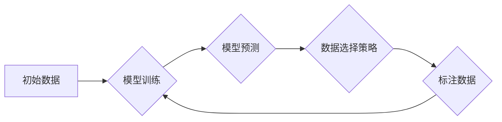

> Active Learning, 数据标注, 模型训练, 策略选择, 算法原理, 代码实例, Python

## 1. 背景介绍

在机器学习领域，高质量的标注数据是模型训练的关键要素。然而，人工标注数据成本高昂且耗时，这成为了机器学习应用的瓶颈之一。Active Learning (主动学习) 作为一种数据高效的机器学习方法，旨在通过智能地选择需要标注的数据点，最大限度地提高模型训练效率和准确性。

传统的监督学习方法需要大量的标注数据才能达到良好的性能，而主动学习则通过选择最具代表性和信息性的数据点进行标注，从而减少标注数据量，同时保持甚至提高模型性能。

## 2. 核心概念与联系

Active Learning 的核心思想是：

* **数据选择策略:**  主动学习算法的核心是选择哪些数据点需要进行标注。不同的策略会选择不同的数据点，例如：不确定性最大化、边界样本选择、多样性最大化等。
* **模型训练:**  选择好的数据点进行标注后，将这些标注数据与原始数据一起用于模型训练。
* **迭代循环:**  主动学习是一个迭代的过程，模型训练完成后，再次选择需要标注的数据点，并重复上述步骤，直到达到预设的性能目标或标注预算。

**Mermaid 流程图:**



## 3. 核心算法原理 & 具体操作步骤

### 3.1  算法原理概述

Active Learning 的核心算法原理是通过选择模型预测不确定性最大的数据点进行标注。

* **不确定性度量:**  常用的不确定性度量方法包括：
    * **概率分布宽度:**  模型预测结果的概率分布越宽，不确定性越大。
    * **熵:**  概率分布的熵越大，不确定性越大。
    * **最大最小值:**  模型预测结果的最大值和最小值之间的差值越大，不确定性越大。

* **数据选择策略:**  根据不确定性度量，选择不确定性最大的数据点进行标注。

### 3.2  算法步骤详解

1. **初始化:**  准备初始数据集，并训练一个初始模型。
2. **数据选择:**  使用数据选择策略，从未标注的数据集中选择需要标注的数据点。
3. **标注数据:**  人工标注选择的数据点。
4. **模型更新:**  将标注数据与原始数据一起用于模型训练，更新模型参数。
5. **迭代:**  重复步骤 2-4，直到达到预设的性能目标或标注预算。

### 3.3  算法优缺点

**优点:**

* **数据效率:**  减少标注数据量，降低标注成本。
* **模型性能:**  在有限的标注数据下，可以获得更好的模型性能。

**缺点:**

* **策略选择:**  不同的数据选择策略会影响模型性能，需要根据具体任务选择合适的策略。
* **标注成本:**  虽然减少了标注数据量，但仍然需要人工标注部分数据点。

### 3.4  算法应用领域

Active Learning 广泛应用于以下领域:

* **图像识别:**  图像分类、目标检测、图像分割等。
* **自然语言处理:**  文本分类、情感分析、机器翻译等。
* **语音识别:**  语音转文本、语音命令识别等。
* **医疗诊断:**  疾病诊断、影像分析等。

## 4. 数学模型和公式 & 详细讲解 & 举例说明

### 4.1  数学模型构建

假设我们有一个数据集 D = {(x1, y1), (x2, y2), ..., (xn, yn)}，其中 xi 是输入特征，yi 是对应的标签。

Active Learning 的目标是选择一个子集 S ⊆ D，使得模型在 S 上的训练性能达到最佳。

### 4.2  公式推导过程

常用的不确定性度量方法之一是概率分布宽度。假设模型对数据点 xi 的预测概率分布为 P(y|xi)，则概率分布宽度可以定义为：

$$
W(xi) = \sqrt{\sum_{y} P(y|xi)^2 (y - \hat{y}(xi))^2}
$$

其中，$\hat{y}(xi)$ 是模型对数据点 xi 的预测标签。

### 4.3  案例分析与讲解

假设我们有一个图像分类任务，需要将图像分类为猫和狗。

使用 Active Learning 算法，我们可以选择概率分布宽度最大的图像进行标注。例如，如果模型对某个图像的预测概率分布为：

* 猫: 0.4
* 狗: 0.6

则该图像的概率分布宽度较大，表明模型对该图像的分类不确定性较大。因此，我们可以选择该图像进行人工标注。

## 5. 项目实践：代码实例和详细解释说明

### 5.1  开发环境搭建

* Python 3.x
* scikit-learn
* numpy
* matplotlib

### 5.2  源代码详细实现

```python
from sklearn.datasets import make_classification
from sklearn.model_selection import train_test_split
from sklearn.linear_model import LogisticRegression
from sklearn.metrics import accuracy_score

# 生成合成数据集
X, y = make_classification(n_samples=1000, n_features=20, random_state=42)

# 将数据分成训练集和测试集
X_train, X_test, y_train, y_test = train_test_split(X, y, test_size=0.2, random_state=42)

# 初始化模型
model = LogisticRegression()

# 定义数据选择策略
def select_data(model, X_unlabeled, y_unlabeled):
    # 计算模型预测的不确定性
    probabilities = model.predict_proba(X_unlabeled)
    uncertainties = 1 - np.max(probabilities, axis=1)
    # 选择不确定性最大的数据点
    selected_indices = np.argsort(uncertainties)[::-1]
    return X_unlabeled[selected_indices], y_unlabeled[selected_indices]

# Active Learning 迭代过程
for i in range(5):
    # 选择需要标注的数据点
    X_selected, y_selected = select_data(model, X_train, y_train)

    # 人工标注数据点
    # ...

    # 更新模型
    model.fit(X_train, y_train)

    # 评估模型性能
    y_pred = model.predict(X_test)
    accuracy = accuracy_score(y_test, y_pred)
    print(f"Iteration {i+1}, Accuracy: {accuracy:.4f}")
```

### 5.3  代码解读与分析

* 代码首先生成一个合成数据集，并将其分成训练集和测试集。
* 然后，初始化一个 LogisticRegression 模型。
* 定义一个 `select_data` 函数，用于选择需要标注的数据点。该函数计算模型预测的不确定性，并选择不确定性最大的数据点。
* 最后，使用 Active Learning 算法迭代训练模型，每次迭代选择需要标注的数据点，并更新模型参数。

### 5.4  运行结果展示

运行代码后，会输出每个迭代的模型准确率。随着迭代次数的增加，模型准确率会逐渐提高。

## 6. 实际应用场景

Active Learning 在实际应用场景中具有广泛的应用前景。

* **医疗诊断:**  Active Learning 可以用于选择需要进一步检查的患者，提高诊断效率和准确性。
* **金融风险评估:**  Active Learning 可以用于选择需要进行风险评估的客户，降低金融风险。
* **自动驾驶:**  Active Learning 可以用于选择需要进行标注的驾驶场景，提高自动驾驶系统的安全性。

### 6.4  未来应用展望

随着人工智能技术的不断发展，Active Learning 将在更多领域得到应用。

* **个性化推荐:**  Active Learning 可以用于选择需要进行个性化推荐的用户，提高推荐系统的准确性。
* **自然语言理解:**  Active Learning 可以用于选择需要进行标注的文本数据，提高自然语言理解模型的性能。
* **机器学习自动化:**  Active Learning 可以用于自动选择需要进行标注的数据点，降低机器学习开发成本。

## 7. 工具和资源推荐

### 7.1  学习资源推荐

* **书籍:**
    * Active Learning: A Survey
    * Active Learning for Machine Learning

* **论文:**
    * Active Learning for Classification
    * Active Learning for Regression

### 7.2  开发工具推荐

* **scikit-learn:**  Python 机器学习库，提供多种 Active Learning 算法实现。
* **PyTorch:**  深度学习框架，支持 Active Learning 的应用。
* **TensorFlow:**  深度学习框架，支持 Active Learning 的应用。

### 7.3  相关论文推荐

* **Active Learning for Text Classification**
* **Active Learning for Image Segmentation**
* **Active Learning for Natural Language Understanding**

## 8. 总结：未来发展趋势与挑战

### 8.1  研究成果总结

Active Learning 作为一种数据高效的机器学习方法，取得了显著的成果。

* **数据效率:**  Active Learning 可以显著减少标注数据量，降低标注成本。
* **模型性能:**  在有限的标注数据下，Active Learning 可以获得更好的模型性能。

### 8.2  未来发展趋势

* **理论研究:**  深入研究 Active Learning 的理论基础，探索更有效的算法和策略。
* **算法创新:**  开发新的 Active Learning 算法，提高算法的效率和鲁棒性。
* **应用拓展:**  将 Active Learning 应用于更多领域，例如个性化推荐、自然语言理解等。

### 8.3  面临的挑战

* **数据选择策略:**  不同的数据选择策略会影响模型性能，需要根据具体任务选择合适的策略。
* **标注成本:**  虽然减少了标注数据量，但仍然需要人工标注部分数据点。
* **模型复杂度:**  一些 Active Learning 算法的模型复杂度较高，需要更多的计算资源。

### 8.4  研究展望

未来，Active Learning 将继续是一个重要的研究方向。

* **探索更有效的算法和策略:**  开发更智能的数据选择策略，提高算法的效率和鲁棒性。
* **研究 Active Learning 与其他机器学习方法的结合:**  将 Active Learning 与其他机器学习方法结合，例如迁移学习、联邦学习等，提高模型性能。
* **推动 Active Learning 的实际应用:**  将 Active Learning 应用于更多领域，解决实际问题。

## 9. 附录：常见问题与解答

* **什么是 Active Learning?**

Active Learning 是一种数据高效的机器学习方法，通过智能地选择需要标注的数据点，最大限度地提高模型训练效率和准确性。

* **Active Learning 的优势是什么?**

Active Learning 的优势在于：

* 数据效率:  减少标注数据量，降低标注成本。
* 模型性能:  在有限的标注数据下，可以获得更好的模型性能。

* **Active Learning 的应用场景有哪些?**

Active Learning 广泛应用于以下领域:

* 图像识别
* 自然语言处理
* 语音识别
* 医疗诊断

* **如何选择 Active Learning 的数据选择策略?**

不同的数据选择策略会影响模型性能，需要根据具体任务选择合适的策略。常见的策略包括：

* 不确定性最大化
* 边界样本选择
* 多样性最大化

作者：禅与计算机程序设计艺术 / Zen and the Art of Computer Programming


<end_of_turn>