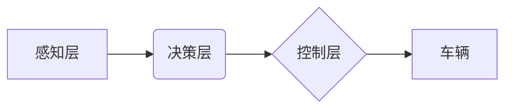

> 自动驾驶, 深度学习, 计算机视觉, 强化学习, 决策控制,  传感器融合,  安全保障

## 1. 背景介绍

自动驾驶技术作为人工智能领域最具前沿性和应用价值的研究方向之一，近年来取得了显著进展。从早期基于规则的控制系统到如今深度学习驱动的智能驾驶，自动驾驶技术经历了从模仿人类驾驶到实现机器自主决策的演进。

Andrej Karpathy，一位享誉全球的计算机视觉和深度学习专家，在自动驾驶技术领域做出了重要贡献。他曾担任特斯拉人工智能总监，领导了特斯拉 Autopilot 系统的开发，并发表了许多关于自动驾驶技术的学术论文和公开演讲。

本文将从 Andrej Karpathy 的研究成果出发，探讨自动驾驶技术的最新进展，分析其核心概念、算法原理、技术挑战以及未来发展趋势。

## 2. 核心概念与联系

自动驾驶系统本质上是一个复杂的感知、决策和控制系统，其核心概念包括：

* **感知:** 通过传感器获取周围环境信息，包括摄像头、雷达、激光雷达等。
* **决策:** 基于感知到的环境信息，做出驾驶决策，例如转向、加速、减速等。
* **控制:** 将决策转化为实际的车辆控制指令，控制车辆的运动。

**自动驾驶系统架构**



## 3. 核心算法原理 & 具体操作步骤

### 3.1  算法原理概述

自动驾驶系统的核心算法主要包括：

* **计算机视觉:** 用于识别道路、车辆、行人等物体，并进行场景理解。
* **深度学习:** 用于训练感知、决策和控制模型，提高系统的准确性和鲁棒性。
* **强化学习:** 用于训练车辆在复杂环境下进行决策，并学习最佳驾驶策略。

### 3.2  算法步骤详解

**计算机视觉算法步骤:**

1. **图像预处理:** 对获取的图像进行预处理，例如调整亮度、对比度等。
2. **目标检测:** 使用深度学习模型检测图像中的目标，例如车辆、行人、交通信号灯等。
3. **目标跟踪:** 对检测到的目标进行跟踪，跟踪目标在图像中的运动轨迹。
4. **场景理解:** 基于目标检测和跟踪结果，对场景进行理解，例如识别道路类型、交通规则等。

**深度学习算法步骤:**

1. **数据收集:** 收集大量驾驶场景数据，包括图像、视频、传感器数据等。
2. **数据预处理:** 对数据进行预处理，例如标注目标、数据增强等。
3. **模型训练:** 使用深度学习模型训练感知、决策和控制模型，例如卷积神经网络、循环神经网络等。
4. **模型评估:** 使用测试数据评估模型的性能，例如准确率、召回率等。

**强化学习算法步骤:**

1. **环境建模:** 建立模拟驾驶环境，模拟车辆与周围环境的交互。
2. **奖励函数设计:** 设计奖励函数，奖励车辆执行正确的驾驶行为，惩罚错误的行为。
3. **策略学习:** 使用强化学习算法训练车辆的驾驶策略，使车辆能够在环境中获得最大奖励。

### 3.3  算法优缺点

**计算机视觉算法:**

* **优点:** 能够识别和理解复杂的视觉场景，提供丰富的环境信息。
* **缺点:** 对光照、天气等环境变化敏感，识别精度可能受限。

**深度学习算法:**

* **优点:** 能够学习复杂的非线性关系，具有强大的泛化能力。
* **缺点:** 需要大量数据进行训练，训练时间长，模型解释性差。

**强化学习算法:**

* **优点:** 能够学习最优的驾驶策略，适应复杂环境。
* **缺点:** 训练过程复杂，需要大量的计算资源，安全性和可靠性需要进一步提高。

### 3.4  算法应用领域

自动驾驶算法广泛应用于：

* **自动驾驶汽车:** 实现车辆的自主驾驶功能。
* **无人机:** 实现无人机的自主飞行和任务执行。
* **机器人:** 实现机器人的自主导航和环境感知。

## 4. 数学模型和公式 & 详细讲解 & 举例说明

### 4.1  数学模型构建

自动驾驶系统的数学模型通常基于以下几个方面：

* **运动学模型:** 描述车辆运动状态和运动规律，例如位置、速度、加速度等。
* **动力学模型:** 描述车辆动力特性，例如牵引力、制动力等。
* **环境模型:** 描述周围环境的几何结构、道路类型、交通规则等。

### 4.2  公式推导过程

**运动学模型:**

车辆的运动状态可以用以下公式描述：

$$
\begin{aligned}
\dot{x} &= v \cos(\theta) \\
\dot{y} &= v \sin(\theta) \\
\dot{\theta} &= \omega
\end{aligned}
$$

其中：

* $x$, $y$ 为车辆坐标
* $v$ 为车辆速度
* $\theta$ 为车辆方向角
* $\omega$ 为车辆角速度

**动力学模型:**

车辆的动力学特性可以用以下公式描述：

$$
F = m a
$$

其中：

* $F$ 为车辆受力
* $m$ 为车辆质量
* $a$ 为车辆加速度

### 4.3  案例分析与讲解

**案例:**

假设一辆汽车以 20 m/s 的速度行驶，方向角为 45 度，需要转向 90 度。

**分析:**

可以使用运动学模型和动力学模型计算车辆转向所需的加速度和时间。

**讲解:**

通过分析车辆的运动学和动力学特性，可以设计合理的转向策略，确保车辆安全地完成转向操作。

## 5. 项目实践：代码实例和详细解释说明

### 5.1  开发环境搭建

自动驾驶项目开发环境通常包括：

* **操作系统:** Linux 或 Windows
* **编程语言:** Python 或 C++
* **深度学习框架:** TensorFlow 或 PyTorch
* **仿真平台:** Gazebo 或 CARLA

### 5.2  源代码详细实现

以下是一个简单的自动驾驶车辆控制代码示例，使用 Python 和 TensorFlow 框架实现：

```python
import tensorflow as tf

# 定义神经网络模型
model = tf.keras.models.Sequential([
    tf.keras.layers.Dense(128, activation='relu', input_shape=(10,)),
    tf.keras.layers.Dense(64, activation='relu'),
    tf.keras.layers.Dense(3)
])

# 训练模型
model.compile(optimizer='adam', loss='mse')
model.fit(X_train, y_train, epochs=10)

# 使用模型进行预测
predictions = model.predict(X_test)
```

### 5.3  代码解读与分析

* **模型定义:** 使用 TensorFlow 框架定义一个简单的多层感知机模型，输入为车辆传感器数据，输出为控制指令。
* **模型训练:** 使用 Adam 优化器和均方误差损失函数训练模型，训练数据为车辆行驶场景下的传感器数据和控制指令。
* **模型预测:** 使用训练好的模型对新的传感器数据进行预测，得到车辆控制指令。

### 5.4  运行结果展示

训练好的模型可以用于控制自动驾驶车辆，使其在模拟环境中完成驾驶任务。

## 6. 实际应用场景

自动驾驶技术在以下场景中得到应用：

* **自动驾驶汽车:** 实现车辆的自主驾驶功能，提高交通效率和安全性。
* **无人配送:** 实现无人驾驶车辆进行货物配送，降低物流成本。
* **智能交通:** 实现交通信号灯的智能控制，优化交通流量。

### 6.4  未来应用展望

自动驾驶技术未来将应用于更广泛的场景，例如：

* **自动驾驶飞机:** 实现飞机的自主飞行，提高航空安全性和效率。
* **自动驾驶船舶:** 实现船舶的自主航行，降低航运成本。
* **自动驾驶机器人:** 实现机器人自主导航和任务执行，提高生产效率。

## 7. 工具和资源推荐

### 7.1  学习资源推荐

* **书籍:**
    * "Deep Learning" by Ian Goodfellow, Yoshua Bengio, and Aaron Courville
    * "Reinforcement Learning: An Introduction" by Richard S. Sutton and Andrew G. Barto
* **在线课程:**
    * Coursera: Deep Learning Specialization
    * Udacity: Self-Driving Car Engineer Nanodegree

### 7.2  开发工具推荐

* **仿真平台:** Gazebo, CARLA
* **深度学习框架:** TensorFlow, PyTorch
* **编程语言:** Python, C++

### 7.3  相关论文推荐

* "End to End Learning for Self-Driving Cars" by Bojarski et al.
* "Learning to Drive in a Simulator" by Schulman et al.
* "Attention Is All You Need" by Vaswani et al.

## 8. 总结：未来发展趋势与挑战

### 8.1  研究成果总结

自动驾驶技术近年来取得了显著进展，深度学习、强化学习等算法在感知、决策和控制方面取得了突破。

### 8.2  未来发展趋势

* **更安全的自动驾驶系统:** 提高自动驾驶系统的安全性是未来发展的重要方向，需要解决传感器融合、决策鲁棒性、安全保障等问题。
* **更智能的自动驾驶系统:** 提升自动驾驶系统的智能化水平，使其能够更好地理解复杂环境，做出更合理的决策。
* **更广泛的自动驾驶应用:** 自动驾驶技术将应用于更多场景，例如无人配送、智能交通等。

### 8.3  面临的挑战

* **数据获取和标注:** 自动驾驶系统需要大量的数据进行训练，数据获取和标注成本高。
* **算法复杂度:** 自动驾驶算法复杂度高，需要强大的计算能力。
* **法律法规:** 自动驾驶技术的法律法规尚不完善，需要制定相应的法律法规。

### 8.4  研究展望

未来，自动驾驶技术将继续朝着更安全、更智能、更广泛的方向发展，为人类社会带来更多便利和福祉。

## 9. 附录：常见问题与解答

**常见问题:**

* 自动驾驶汽车真的安全吗？
* 自动驾驶汽车会取代人类驾驶员吗？
* 自动驾驶汽车的成本是多少？

**解答:**

* 自动驾驶汽车的安全性正在不断提高，但仍存在一些风险。
* 自动驾驶汽车不会完全取代人类驾驶员，而是会与人类驾驶员协同工作。
* 自动驾驶汽车的成本目前较高，但随着技术的进步和规模化生产，成本将会降低。


作者：禅与计算机程序设计艺术 / Zen and the Art of Computer Programming 
<end_of_turn>