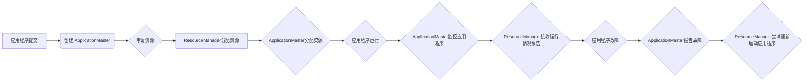

> ApplicationMaster, YARN, 资源管理, 调度算法, 代码实例, 容器化, 大数据

## 1. 背景介绍

随着大数据时代的到来，海量数据的处理和分析成为越来越重要的课题。分布式计算框架，例如 Apache Hadoop 和 Apache Spark，应运而生，为处理海量数据提供了强大的处理能力。然而，这些框架的复杂性和管理难度也随之增加。为了简化集群管理和应用程序部署，Apache YARN（Yet Another Resource Negotiator）应运而生，它提供了一个统一的资源管理和调度平台，让应用程序可以更轻松地运行在集群中。

ApplicationMaster（简称 AM）是 YARN 中应用程序的核心组件，它负责与 YARN 资源管理器（ResourceManager，简称 RM）交互，申请和管理应用程序所需的资源，并协调应用程序的运行。理解 ApplicationMaster 的原理和工作机制对于开发和管理大数据应用程序至关重要。

## 2. 核心概念与联系

ApplicationMaster 作为 YARN 中应用程序的核心组件，其工作原理与 YARN 资源管理系统密切相关。

**2.1 YARN 架构**

YARN 架构主要由以下几个核心组件组成：

* **ResourceManager (RM):** 负责管理整个集群的资源，包括节点、CPU、内存等。它负责分配资源给应用程序，并监控应用程序的运行状态。
* **NodeManager (NM):** 运行在每个节点上，负责管理节点上的资源和应用程序容器。它接收 RM 的资源分配指令，并启动、监控和终止应用程序容器。
* **ApplicationMaster (AM):** 应用程序的控制中心，负责与 RM 交互申请资源，协调应用程序的运行，并监控应用程序的健康状态。

**2.2 ApplicationMaster 的职责**

ApplicationMaster 的主要职责包括：

* **申请资源:** AM 向 RM 申请应用程序所需的资源，包括 CPU、内存、磁盘空间等。
* **资源管理:** AM 负责管理应用程序分配到的资源，并根据应用程序的需要动态调整资源分配。
* **应用程序调度:** AM 负责调度应用程序的各个任务，并将其分配到不同的节点上运行。
* **应用程序监控:** AM 负责监控应用程序的运行状态，并及时处理应用程序的故障。

**2.3 ApplicationMaster 与 YARN 的交互流程**

ApplicationMaster 与 YARN 的交互流程如下：

1. 应用程序提交到 YARN 时，YARN 会创建一个 ApplicationMaster 实例。
2. ApplicationMaster 向 ResourceManager 申请资源。
3. ResourceManager 根据资源可用情况分配资源给 ApplicationMaster。
4. ApplicationMaster 将资源分配给应用程序的各个任务。
5. ApplicationMaster 监控应用程序的运行状态，并向 ResourceManager 报告应用程序的运行情况。
6. 如果应用程序出现故障，ApplicationMaster 会向 ResourceManager 报告故障信息，并尝试重新启动应用程序。

**2.4 Mermaid 流程图**



## 3. 核心算法原理 & 具体操作步骤

### 3.1  算法原理概述

ApplicationMaster 的核心算法主要包括资源申请、资源分配和任务调度。

* **资源申请:** AM 会根据应用程序的资源需求向 RM 申请资源。资源申请策略通常考虑应用程序的优先级、资源类型和可用资源情况。
* **资源分配:** RM 会根据 AM 的申请请求和集群的资源可用情况分配资源给 AM。资源分配策略通常考虑资源的均衡分配、应用程序的优先级和资源的类型。
* **任务调度:** AM 会根据应用程序的拓扑结构和资源分配情况，将应用程序的任务分配到不同的节点上运行。任务调度策略通常考虑任务的依赖关系、节点的资源情况和任务的执行时间。

### 3.2  算法步骤详解

**3.2.1 资源申请**

1. AM 收集应用程序的资源需求信息。
2. AM 根据应用程序的优先级和资源类型，选择合适的资源申请策略。
3. AM 向 RM 发送资源申请请求，包含应用程序的资源需求信息和优先级。
4. RM 根据资源可用情况和应用程序的优先级，决定是否批准 AM 的资源申请请求。

**3.2.2 资源分配**

1. RM 收到 AM 的资源申请请求后，会根据资源分配策略，选择合适的资源分配给 AM。
2. RM 将分配的资源信息发送给 AM。
3. AM 接收资源分配信息后，会将资源分配给应用程序的各个任务。

**3.2.3 任务调度**

1. AM 收集应用程序的拓扑结构和资源分配情况。
2. AM 根据任务调度策略，将应用程序的任务分配到不同的节点上运行。
3. AM 将任务分配信息发送给 NodeManager。
4. NodeManager 接收任务分配信息后，会启动应用程序的各个任务。

### 3.3  算法优缺点

**优点:**

* **资源利用率高:** 通过资源申请、资源分配和任务调度，可以有效地利用集群的资源。
* **应用程序弹性:** 可以根据应用程序的资源需求动态调整资源分配，提高应用程序的弹性。
* **故障恢复能力强:** 如果应用程序出现故障，AM 可以向 RM 报告故障信息，并尝试重新启动应用程序，提高应用程序的故障恢复能力。

**缺点:**

* **复杂度高:** AM 的算法实现比较复杂，需要对 YARN 的架构和资源管理机制有深入的了解。
* **性能瓶颈:** AM 的资源申请和任务调度过程可能会成为性能瓶颈，需要进行优化。

### 3.4  算法应用领域

ApplicationMaster 的算法原理和技术可以应用于各种大数据处理场景，例如：

* **数据分析:** 处理海量数据进行分析和挖掘。
* **机器学习:** 训练和部署机器学习模型。
* **实时数据处理:** 处理实时数据流，进行实时分析和决策。
* **云计算:** 管理和调度云计算资源。

## 4. 数学模型和公式 & 详细讲解 & 举例说明

### 4.1  数学模型构建

ApplicationMaster 的资源申请和任务调度可以抽象为一个资源分配问题，可以使用数学模型来描述和解决。

**4.1.1 资源需求矩阵:**

设应用程序的资源需求为 $R = (r_{1}, r_{2}, ..., r_{n})$, 其中 $r_{i}$ 表示应用程序对第 $i$ 种资源的需求量。

**4.1.2 资源可用矩阵:**

设集群的资源可用情况为 $A = (a_{1}, a_{2}, ..., a_{m})$, 其中 $a_{j}$ 表示集群对第 $j$ 种资源的可用量。

**4.1.3 资源分配矩阵:**

设资源分配矩阵为 $X = (x_{ij})$, 其中 $x_{ij}$ 表示应用程序对第 $j$ 种资源的分配量。

### 4.2  公式推导过程

**目标函数:**

最大化应用程序的资源利用率，即最大化资源分配矩阵的元素之和：

$$
\max \sum_{i=1}^{n} \sum_{j=1}^{m} x_{ij}
$$

**约束条件:**

* 应用程序对资源的需求满足：

$$
\sum_{j=1}^{m} x_{ij} \leq r_{i} \quad (i = 1, 2, ..., n)
$$

* 集群的资源可用情况满足：

$$
\sum_{i=1}^{n} x_{ij} \leq a_{j} \quad (j = 1, 2, ..., m)
$$

### 4.3  案例分析与讲解

假设应用程序对 CPU 和内存的需求分别为 2 个和 4 GB，集群的 CPU 和内存的可用量分别为 10 个和 20 GB。

根据上述公式，我们可以构建一个线性规划模型，并使用线性规划算法求解资源分配矩阵。

## 5. 项目实践：代码实例和详细解释说明

### 5.1  开发环境搭建

* **操作系统:** Linux (Ubuntu, CentOS 等)
* **JDK:** Java Development Kit (JDK 8 或以上)
* **Maven:** Build tool
* **YARN:** Apache YARN 集群

### 5.2  源代码详细实现

```java
// ApplicationMaster 类
public class ApplicationMaster {

    private ResourceManager rm;
    private ApplicationId appId;
    private ResourceRequest resourceRequest;

    public ApplicationMaster(ResourceManager rm, ApplicationId appId, ResourceRequest resourceRequest) {
        this.rm = rm;
        this.appId = appId;
        this.resourceRequest = resourceRequest;
    }

    public void run() {
        // 申请资源
        Resource allocatedResource = rm.allocateResource(appId, resourceRequest);

        // 分配资源给任务
        // ...

        // 监控应用程序运行状态
        // ...
    }
}

// ResourceRequest 类
public class ResourceRequest {
    private int numCpus;
    private long memory;

    public ResourceRequest(int numCpus, long memory) {
        this.numCpus = numCpus;
        this.memory = memory;
    }

    // ...
}
```

### 5.3  代码解读与分析

* **ApplicationMaster 类:** 负责与 ResourceManager 交互，申请资源，分配资源给任务，并监控应用程序的运行状态。
* **ResourceRequest 类:** 定义了应用程序对资源的需求信息，包括 CPU 数量和内存大小。
* **run() 方法:** 应用程序的主循环，包含申请资源、分配资源给任务和监控应用程序运行状态等操作。

### 5.4  运行结果展示

运行应用程序后，ApplicationMaster 会向 ResourceManager 申请资源，ResourceManager 会根据资源可用情况分配资源给 ApplicationMaster。ApplicationMaster 会将资源分配给应用程序的各个任务，并监控应用程序的运行状态。

## 6. 实际应用场景

ApplicationMaster 的应用场景非常广泛，例如：

* **大数据处理:** 在 Hadoop 和 Spark 等大数据处理框架中，ApplicationMaster 负责管理应用程序的资源分配和任务调度，提高大数据处理的效率和性能。
* **机器学习:** 在机器学习框架中，ApplicationMaster 负责管理模型训练和部署的资源分配，提高机器学习模型的训练速度和部署效率。
* **云计算:** 在云计算平台中，ApplicationMaster 负责管理云计算资源的分配和调度，提高云计算资源的利用率和效率。

### 6.4  未来应用展望

随着大数据和云计算的发展，ApplicationMaster 的应用场景将会更加广泛。未来，ApplicationMaster 可能会有以下发展趋势：

* **更智能的资源管理:** 利用机器学习等技术，实现更智能的资源分配和调度，提高资源利用率和应用程序性能。
* **更强大的故障恢复能力:** 通过分布式部署和容错机制，提高 ApplicationMaster 的故障恢复能力，确保应用程序的稳定运行。
* **更易于使用的开发体验:** 提供更易于使用的开发工具和框架，降低开发人员开发和部署应用程序的难度。

## 7. 工具和资源推荐

### 7.1  学习资源推荐

* **Apache YARN 官方文档:** https://hadoop.apache.org/docs/current/hadoop-yarn/
* **YARN 入门教程:** https://www.tutorialspoint.com/hadoop/hadoop_yarn.htm
* **大数据技术博客:** https://www.databricks.com/blog/

### 7.2  开发工具推荐

* **Eclipse:** https://www.eclipse.org/
* **IntelliJ IDEA:** https://www.jetbrains.com/idea/
* **Maven:** https://maven.apache.org/

### 7.3  相关论文推荐

* **YARN: Yet Another Resource Negotiator**
* **Resource Management in Apache Hadoop**
* **ApplicationMaster: The Heart of YARN**

## 8. 总结：未来发展趋势与挑战

### 8.1  研究成果