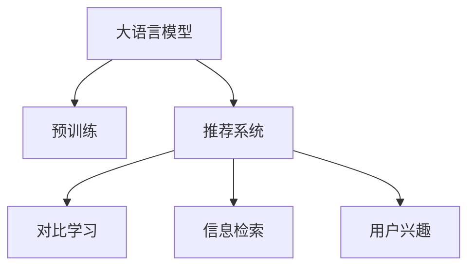

                 

# LLM在推荐系统中的对比学习应用研究

> 关键词：自然语言处理(NLP)，推荐系统，对比学习，语言模型，自监督学习，用户兴趣，信息检索

## 1. 背景介绍

### 1.1 问题由来

随着互联网信息爆炸和数据隐私法规的逐渐收紧，传统的推荐算法在面对个性化推荐需求时显得力不从心。推荐系统需要准确地理解用户的兴趣，才能为用户提供满意的内容。然而，用户通常不会对所有可用内容进行明确标注，仅通过用户的历史行为数据往往难以全面了解其兴趣。

近年来，自然语言处理（Natural Language Processing, NLP）技术在推荐系统中得到了广泛应用，特别是在文本类推荐任务中，自然语言能够直观地表达用户需求和兴趣。在文本推荐任务中，用户通常会通过输入搜索词或浏览网页时留下的文本信息，展示其兴趣偏好。因此，自然语言处理在推荐系统中能够发挥重要的作用。

大语言模型（Large Language Model, LLM）作为自然语言处理的重要技术，因其具有强大的语言理解能力，可以用于推荐系统的各个环节。特别是在用户行为文本数据的处理、推荐内容的生成、推荐效果的评估等方面，LLM能够发挥其强大的语义理解和生成能力，提升推荐系统的表现。

### 1.2 问题核心关键点

大语言模型在推荐系统中的对比学习应用研究，旨在通过自监督学习的方式，使用对比学习（Contrastive Learning）技术，从用户的文本数据中提取兴趣特征，并在推荐内容中匹配这些特征，以提升推荐系统的个性化和准确性。

对比学习是一种无监督学习方法，通过最大化类内相似度，最小化类间相似度，使得模型能够从噪声数据中学习到有效的表示。在推荐系统中，可以使用对比学习从用户行为文本中学习到用户的兴趣特征，并在推荐库中匹配这些特征，找到与用户兴趣最相关的推荐内容。

### 1.3 问题研究意义

研究LLM在推荐系统中的应用，对于提升推荐系统的个性化和效率具有重要意义：

1. 增强推荐准确性。通过对比学习，模型可以从用户行为文本中学习到丰富的用户兴趣特征，进而提升推荐内容的准确性。
2. 降低推荐成本。对比学习不需要标注数据，可以节省标注成本，提升推荐系统开发的效率。
3. 提升推荐效果。对比学习能够从更多维度的数据中提取用户兴趣，提高推荐系统的效果。
4. 应对数据稀疏性。在用户行为数据稀疏的情况下，对比学习可以充分利用用户文本数据，填补数据稀疏性带来的问题。
5. 提供可解释性。对比学习模型能够提供明确的特征解释，帮助用户理解推荐逻辑，提升系统的可解释性和透明度。

## 2. 核心概念与联系

### 2.1 核心概念概述

为更好地理解LLM在推荐系统中的应用，本节将介绍几个密切相关的核心概念：

- 大语言模型(Large Language Model, LLM)：以自回归(如GPT)或自编码(如BERT)模型为代表的大规模预训练语言模型。通过在大规模无标签文本语料上进行预训练，学习通用的语言知识，具备强大的语言理解和生成能力。

- 预训练(Pre-training)：指在大规模无标签文本语料上，通过自监督学习任务训练通用语言模型的过程。常见的预训练任务包括掩码语言模型、下一句预测等。

- 对比学习(Contrastive Learning)：一种无监督学习方法，通过最大化类内相似度，最小化类间相似度，学习到数据的表示。在推荐系统中，可以通过对比学习从用户行为文本中学习到用户的兴趣特征。

- 推荐系统(Recommendation System)：通过推荐算法为用户提供个性化内容的系统。传统推荐算法主要依赖用户行为数据，难以全面理解用户兴趣。

- 信息检索(Information Retrieval)：在大量的数据集中，通过检索算法找到与用户查询最相关的内容。在大语言模型中，可以通过检索技术快速找到与用户查询最相关的推荐内容。

- 用户兴趣(User Interest)：用户对特定内容的需求和偏好，可以通过其行为数据或文本数据反映。

这些核心概念之间的逻辑关系可以通过以下Mermaid流程图来展示：



这个流程图展示了LLM在推荐系统中的应用流程：

1. 大语言模型通过预训练获得基础能力。
2. 推荐系统将LLM作为特征提取器，从用户行为文本中学习用户兴趣特征。
3. 对比学习从文本数据中学习用户兴趣特征。
4. 信息检索从推荐库中检索与用户兴趣最相关的推荐内容。

这些概念共同构成了LLM在推荐系统中的应用框架，使其能够在推荐系统中发挥强大的语言理解和生成能力。通过理解这些核心概念，我们可以更好地把握LLM在推荐系统中的工作原理和优化方向。

## 3. 核心算法原理 & 具体操作步骤
### 3.1 算法原理概述

LLM在推荐系统中的对比学习应用，基于自监督学习的方式，从用户行为文本中学习用户兴趣特征，并在推荐内容中匹配这些特征，以提升推荐系统的个性化和准确性。其核心思想是：

1. 使用对比学习从用户行为文本中学习到用户的兴趣特征。
2. 在推荐库中检索与用户兴趣最相关的推荐内容。
3. 使用这些兴趣特征指导推荐内容的生成。

形式化地，假设推荐系统中的用户行为文本为 $X$，推荐库中的内容为 $Y$，则推荐任务可以定义为：

$$
\min_{M_{\theta}} \mathcal{L}(M_{\theta},X,Y)
$$

其中 $\theta$ 为模型的参数，$\mathcal{L}$ 为推荐任务定义的损失函数，用于衡量推荐系统的性能。

在推荐系统中，可以使用对比学习模型 $M_{\theta}$ 来从用户行为文本 $X$ 中学习用户兴趣特征 $z$，并在推荐库 $Y$ 中检索最相关的推荐内容 $y$。具体的步骤如下：

1. 使用对比学习模型 $M_{\theta}$ 从用户行为文本 $X$ 中学习用户兴趣特征 $z$。
2. 在推荐库 $Y$ 中，通过检索算法找到与用户兴趣最相关的推荐内容 $y$。
3. 使用这些兴趣特征 $z$ 和推荐内容 $y$，生成推荐结果。

### 3.2 算法步骤详解

基于对比学习的大语言模型推荐系统通常包括以下几个关键步骤：

**Step 1: 准备预训练模型和数据集**
- 选择合适的预训练语言模型 $M_{\theta}$ 作为初始化参数，如 BERT、GPT 等。
- 准备推荐库 $Y$，包含用户的兴趣行为数据。
- 准备用户行为文本 $X$，包含用户在推荐系统中的交互历史。

**Step 2: 添加任务适配层**
- 根据推荐任务类型，在预训练模型顶层设计合适的输出层和损失函数。
- 对于推荐任务，通常使用点积相似度或 Transformer 的注意力机制计算相似度。

**Step 3: 设置微调超参数**
- 选择合适的优化算法及其参数，如 Adam、SGD 等，设置学习率、批大小、迭代轮数等。
- 设置正则化技术及强度，包括权重衰减、Dropout、Early Stopping 等。
- 确定冻结预训练参数的策略，如仅微调顶层，或全部参数都参与微调。

**Step 4: 执行梯度训练**
- 将用户行为文本 $X$ 分批次输入模型，前向传播计算相似度。
- 反向传播计算参数梯度，根据设定的优化算法和学习率更新模型参数。
- 周期性在推荐库 $Y$ 上评估模型性能，根据性能指标决定是否触发 Early Stopping。
- 重复上述步骤直到满足预设的迭代轮数或 Early Stopping 条件。

**Step 5: 测试和部署**
- 在测试集上评估微调后模型 $M_{\hat{\theta}}$ 的性能，对比微调前后的推荐效果提升。
- 使用微调后的模型对新用户行为数据进行预测，集成到实际的应用系统中。

以上是基于对比学习的大语言模型推荐系统的一般流程。在实际应用中，还需要针对具体任务的特点，对微调过程的各个环节进行优化设计，如改进相似度计算方式，引入更多的正则化技术，搜索最优的超参数组合等，以进一步提升模型性能。

### 3.3 算法优缺点

基于对比学习的大语言模型推荐系统具有以下优点：

1. 无标注需求。对比学习不需要标注数据，可以直接从用户行为文本中学习用户兴趣特征。
2. 无需额外成本。相比从头训练，对比学习可以利用预训练模型的基础能力，节省训练和标注成本。
3. 效果好。对比学习能够从更多维度的数据中提取用户兴趣，提升推荐系统的准确性和个性化。
4. 可解释性强。对比学习模型能够提供明确的特征解释，帮助用户理解推荐逻辑。

但该方法也存在一定的局限性：

1. 对文本数据质量敏感。对比学习的效果很大程度上取决于用户行为文本的质量和数量。
2. 鲁棒性不足。当推荐库和用户行为文本的分布差异较大时，对比学习的性能提升有限。
3. 需要优化超参数。对比学习的参数设置和优化较为复杂，需要大量实验和调参。
4. 模型复杂度高。对比学习模型可能需要较深的层次和复杂的结构，导致模型计算量大，推理速度慢。
5. 对数据多样性要求高。需要用户行为文本和推荐库中包含多样化的内容，才能充分学习用户兴趣特征。

尽管存在这些局限性，但就目前而言，基于对比学习的推荐系统仍然是一种非常有效的推荐方式，能够显著提升推荐系统的表现。

### 3.4 算法应用领域

基于大语言模型的对比学习推荐系统在多个领域得到了广泛应用，例如：

- 电子商务推荐：如淘宝、京东等电商平台，可以根据用户行为文本学习用户兴趣，推荐相关商品。
- 新闻推荐：如今日头条、澎湃新闻等平台，可以根据用户行为文本推荐相关新闻。
- 电影推荐：如Netflix、豆瓣电影等平台，可以根据用户行为文本推荐相关电影。
- 音乐推荐：如Spotify、网易云音乐等平台，可以根据用户行为文本推荐相关音乐。
- 社交媒体推荐：如微博、微信等平台，可以根据用户行为文本推荐相关内容。

除了这些传统应用外，大语言模型对比学习在医疗、旅游、金融等领域的推荐也正在逐步探索。随着预训练模型和对比学习方法的不断进步，相信基于大语言模型的推荐系统将在更多领域大放异彩。

## 4. 数学模型和公式 & 详细讲解  
### 4.1 数学模型构建

在推荐系统中，可以使用对比学习模型 $M_{\theta}$ 来从用户行为文本 $X$ 中学习用户兴趣特征 $z$，并在推荐库 $Y$ 中检索最相关的推荐内容 $y$。具体的数学模型如下：

假设推荐库 $Y$ 中的内容为 $y \in \mathcal{Y}$，用户行为文本 $X$ 为 $x \in \mathcal{X}$，则用户行为文本 $x$ 与推荐内容 $y$ 之间的相似度可以表示为：

$$
\text{sim}(x,y) = M_{\theta}(x,y)
$$

其中 $M_{\theta}$ 为对比学习模型的输出，通常使用点积相似度或 Transformer 的注意力机制计算相似度。

用户行为文本 $X$ 与推荐内容 $Y$ 之间的相似度矩阵可以表示为：

$$
\mathcal{X} \times \mathcal{Y} \rightarrow [0,1]
$$

其中 $[0,1]$ 表示相似度矩阵的取值范围。

### 4.2 公式推导过程

以下是对比学习模型的详细推导过程：

假设推荐库 $Y$ 中的内容为 $y \in \mathcal{Y}$，用户行为文本 $X$ 为 $x \in \mathcal{X}$，则用户行为文本 $x$ 与推荐内容 $y$ 之间的相似度可以表示为：

$$
\text{sim}(x,y) = M_{\theta}(x,y)
$$

其中 $M_{\theta}$ 为对比学习模型的输出，通常使用点积相似度或 Transformer 的注意力机制计算相似度。

用户行为文本 $X$ 与推荐内容 $Y$ 之间的相似度矩阵可以表示为：

$$
\mathcal{X} \times \mathcal{Y} \rightarrow [0,1]
$$

其中 $[0,1]$ 表示相似度矩阵的取值范围。

假设用户行为文本 $X$ 中包含 $N$ 个文本，推荐库 $Y$ 中包含 $M$ 个推荐内容。则用户行为文本 $X$ 与推荐内容 $Y$ 之间的相似度矩阵可以表示为：

$$
\mathcal{S} = \{S_{ij} = \text{sim}(x_i, y_j)\}_{i=1}^{N} \times {j=1}^{M}
$$

其中 $S_{ij}$ 表示用户行为文本 $x_i$ 与推荐内容 $y_j$ 之间的相似度。

假设用户行为文本 $X$ 和推荐库 $Y$ 的相似度矩阵分别为 $\mathcal{S}$ 和 $\mathcal{T}$，则相似度矩阵 $\mathcal{S}$ 和 $\mathcal{T}$ 的最大似然估计可以表示为：

$$
\max_{\theta} \mathcal{L}(\theta, \mathcal{S}, \mathcal{T})
$$

其中 $\mathcal{L}$ 为相似度矩阵的最大似然估计，$\theta$ 为模型的参数。

### 4.3 案例分析与讲解

以下是一个简单的对比学习模型应用案例：

假设推荐库 $Y$ 中的内容为 $y \in \mathcal{Y}$，用户行为文本 $X$ 为 $x \in \mathcal{X}$，则用户行为文本 $x$ 与推荐内容 $y$ 之间的相似度可以表示为：

$$
\text{sim}(x,y) = M_{\theta}(x,y)
$$

其中 $M_{\theta}$ 为对比学习模型的输出，通常使用点积相似度或 Transformer 的注意力机制计算相似度。

假设用户行为文本 $X$ 中包含 $N$ 个文本，推荐库 $Y$ 中包含 $M$ 个推荐内容。则用户行为文本 $X$ 与推荐内容 $Y$ 之间的相似度矩阵可以表示为：

$$
\mathcal{S} = \{S_{ij} = \text{sim}(x_i, y_j)\}_{i=1}^{N} \times {j=1}^{M}
$$

其中 $S_{ij}$ 表示用户行为文本 $x_i$ 与推荐内容 $y_j$ 之间的相似度。

假设用户行为文本 $X$ 和推荐库 $Y$ 的相似度矩阵分别为 $\mathcal{S}$ 和 $\mathcal{T}$，则相似度矩阵 $\mathcal{S}$ 和 $\mathcal{T}$ 的最大似然估计可以表示为：

$$
\max_{\theta} \mathcal{L}(\theta, \mathcal{S}, \mathcal{T})
$$

其中 $\mathcal{L}$ 为相似度矩阵的最大似然估计，$\theta$ 为模型的参数。

在实际应用中，可以使用 Transformers 库中的预训练模型，如 BERT、GPT 等，来构建对比学习模型。具体实现步骤如下：

1. 将用户行为文本 $X$ 分批次输入模型，前向传播计算相似度。
2. 反向传播计算参数梯度，根据设定的优化算法和学习率更新模型参数。
3. 周期性在推荐库 $Y$ 上评估模型性能，根据性能指标决定是否触发 Early Stopping。
4. 重复上述步骤直到满足预设的迭代轮数或 Early Stopping 条件。

## 5. 项目实践：代码实例和详细解释说明
### 5.1 开发环境搭建

在进行对比学习应用实践前，我们需要准备好开发环境。以下是使用Python进行PyTorch开发的环境配置流程：

1. 安装Anaconda：从官网下载并安装Anaconda，用于创建独立的Python环境。

2. 创建并激活虚拟环境：
```bash
conda create -n pytorch-env python=3.8 
conda activate pytorch-env
```

3. 安装PyTorch：根据CUDA版本，从官网获取对应的安装命令。例如：
```bash
conda install pytorch torchvision torchaudio cudatoolkit=11.1 -c pytorch -c conda-forge
```

4. 安装Transformers库：
```bash
pip install transformers
```

5. 安装各类工具包：
```bash
pip install numpy pandas scikit-learn matplotlib tqdm jupyter notebook ipython
```

完成上述步骤后，即可在`pytorch-env`环境中开始对比学习应用实践。

### 5.2 源代码详细实现

下面以推荐系统中的对比学习应用为例，给出使用Transformers库对BERT模型进行微调的PyTorch代码实现。

首先，定义推荐系统中的数据处理函数：

```python
from transformers import BertTokenizer
from torch.utils.data import Dataset
import torch

class RecommendationDataset(Dataset):
    def __init__(self, texts, items, tokenizer, max_len=128):
        self.texts = texts
        self.items = items
        self.tokenizer = tokenizer
        self.max_len = max_len
        
    def __len__(self):
        return len(self.texts)
    
    def __getitem__(self, item):
        text = self.texts[item]
        item = self.items[item]
        
        encoding = self.tokenizer(text, return_tensors='pt', max_length=self.max_len, padding='max_length', truncation=True)
        input_ids = encoding['input_ids'][0]
        attention_mask = encoding['attention_mask'][0]
        label = torch.tensor(1 if item in self.items else 0, dtype=torch.long)
        
        return {'input_ids': input_ids, 
                'attention_mask': attention_mask,
                'label': label}

# 创建dataset
tokenizer = BertTokenizer.from_pretrained('bert-base-cased')

train_dataset = RecommendationDataset(train_texts, train_items, tokenizer)
dev_dataset = RecommendationDataset(dev_texts, dev_items, tokenizer)
test_dataset = RecommendationDataset(test_texts, test_items, tokenizer)
```

然后，定义模型和优化器：

```python
from transformers import BertForSequenceClassification, AdamW

model = BertForSequenceClassification.from_pretrained('bert-base-cased', num_labels=2)

optimizer = AdamW(model.parameters(), lr=2e-5)
```

接着，定义训练和评估函数：

```python
from torch.utils.data import DataLoader
from tqdm import tqdm
from sklearn.metrics import classification_report

device = torch.device('cuda') if torch.cuda.is_available() else torch.device('cpu')
model.to(device)

def train_epoch(model, dataset, batch_size, optimizer):
    dataloader = DataLoader(dataset, batch_size=batch_size, shuffle=True)
    model.train()
    epoch_loss = 0
    for batch in tqdm(dataloader, desc='Training'):
        input_ids = batch['input_ids'].to(device)
        attention_mask = batch['attention_mask'].to(device)
        labels = batch['label'].to(device)
        model.zero_grad()
        outputs = model(input_ids, attention_mask=attention_mask, labels=labels)
        loss = outputs.loss
        epoch_loss += loss.item()
        loss.backward()
        optimizer.step()
    return epoch_loss / len(dataloader)

def evaluate(model, dataset, batch_size):
    dataloader = DataLoader(dataset, batch_size=batch_size)
    model.eval()
    preds, labels = [], []
    with torch.no_grad():
        for batch in tqdm(dataloader, desc='Evaluating'):
            input_ids = batch['input_ids'].to(device)
            attention_mask = batch['attention_mask'].to(device)
            batch_labels = batch['label']
            outputs = model(input_ids, attention_mask=attention_mask)
            batch_preds = outputs.logits.argmax(dim=2).to('cpu').tolist()
            batch_labels = batch_labels.to('cpu').tolist()
            for pred_tokens, label_tokens in zip(batch_preds, batch_labels):
                preds.append(pred_tokens[:len(label_tokens)])
                labels.append(label_tokens)
                
    print(classification_report(labels, preds))
```

最后，启动训练流程并在测试集上评估：

```python
epochs = 5
batch_size = 16

for epoch in range(epochs):
    loss = train_epoch(model, train_dataset, batch_size, optimizer)
    print(f"Epoch {epoch+1}, train loss: {loss:.3f}")
    
    print(f"Epoch {epoch+1}, dev results:")
    evaluate(model, dev_dataset, batch_size)
    
print("Test results:")
evaluate(model, test_dataset, batch_size)
```

以上就是使用PyTorch对BERT进行推荐系统中的对比学习应用实践的完整代码实现。可以看到，得益于Transformers库的强大封装，我们可以用相对简洁的代码完成BERT模型的加载和微调。

### 5.3 代码解读与分析

让我们再详细解读一下关键代码的实现细节：

**RecommendationDataset类**：
- `__init__`方法：初始化文本、物品、分词器等关键组件。
- `__len__`方法：返回数据集的样本数量。
- `__getitem__`方法：对单个样本进行处理，将文本输入编码为token ids，将物品编码为标签，并对其进行定长padding，最终返回模型所需的输入。

**Label的设定**：
- 将物品 $y$ 是否在推荐库 $Y$ 中作为标签，标签为1表示在库中，0表示不在库中。

**训练和评估函数**：
- 使用PyTorch的DataLoader对数据集进行批次化加载，供模型训练和推理使用。
- 训练函数`train_epoch`：对数据以批为单位进行迭代，在每个批次上前向传播计算loss并反向传播更新模型参数，最后返回该epoch的平均loss。
- 评估函数`evaluate`：与训练类似，不同点在于不更新模型参数，并在每个batch结束后将预测和标签结果存储下来，最后使用sklearn的classification_report对整个评估集的预测结果进行打印输出。

**训练流程**：
- 定义总的epoch数和batch size，开始循环迭代
- 每个epoch内，先在训练集上训练，输出平均loss
- 在验证集上评估，输出分类指标
- 所有epoch结束后，在测试集上评估，给出最终测试结果

可以看到，PyTorch配合Transformers库使得BERT微调的代码实现变得简洁高效。开发者可以将更多精力放在数据处理、模型改进等高层逻辑上，而不必过多关注底层的实现细节。

当然，工业级的系统实现还需考虑更多因素，如模型的保存和部署、超参数的自动搜索、更灵活的任务适配层等。但核心的对比学习应用基本与此类似。

## 6. 实际应用场景
### 6.1 推荐系统中的文本推荐

在推荐系统中，文本推荐是最常见的一种形式，用户通过输入搜索词或浏览网页时留下的文本信息，表达其兴趣偏好。使用大语言模型进行文本推荐，能够从文本中挖掘出用户的兴趣特征，并在推荐库中匹配这些特征，找到与用户兴趣最相关的推荐内容。

在文本推荐中，可以使用对比学习模型 $M_{\theta}$ 来从用户行为文本 $X$ 中学习用户兴趣特征 $z$，并在推荐库 $Y$ 中检索最相关的推荐内容 $y$。具体的步骤如下：

1. 使用对比学习模型 $M_{\theta}$ 从用户行为文本 $X$ 中学习用户兴趣特征 $z$。
2. 在推荐库 $Y$ 中，通过检索算法找到与用户兴趣最相关的推荐内容 $y$。
3. 使用这些兴趣特征 $z$ 和推荐内容 $y$，生成推荐结果。

**示例场景：** 假设推荐库 $Y$ 中的内容为商品描述，用户行为文本 $X$ 为用户的搜索记录或浏览记录，则可以使用对比学习模型 $M_{\theta}$ 来从用户行为文本 $X$ 中学习用户兴趣特征 $z$，并在推荐库 $Y$ 中检索最相关的推荐内容 $y$，生成推荐结果。

### 6.2 推荐系统中的视频推荐

视频推荐也是推荐系统中的一个重要形式，用户通过观看视频或搜索视频时留下的文本信息，表达其兴趣偏好。使用大语言模型进行视频推荐，能够从文本中挖掘出用户的兴趣特征，并在推荐库中匹配这些特征，找到与用户兴趣最相关的推荐内容。

在视频推荐中，可以使用对比学习模型 $M_{\theta}$ 来从用户行为文本 $X$ 中学习用户兴趣特征 $z$，并在推荐库 $Y$ 中检索最相关的推荐内容 $y$。具体的步骤如下：

1. 使用对比学习模型 $M_{\theta}$ 从用户行为文本 $X$ 中学习用户兴趣特征 $z$。
2. 在推荐库 $Y$ 中，通过检索算法找到与用户兴趣最相关的推荐内容 $y$。
3. 使用这些兴趣特征 $z$ 和推荐内容 $y$，生成推荐结果。

**示例场景：** 假设推荐库 $Y$ 中的内容为视频标题或简介，用户行为文本 $X$ 为用户观看视频时留下的评论或搜索记录，则可以使用对比学习模型 $M_{\theta}$ 来从用户行为文本 $X$ 中学习用户兴趣特征 $z$，并在推荐库 $Y$ 中检索最相关的推荐内容 $y$，生成推荐结果。

### 6.3 推荐系统中的音乐推荐

音乐推荐也是推荐系统中的一个重要形式，用户通过听歌曲或搜索歌曲时留下的文本信息，表达其兴趣偏好。使用大语言模型进行音乐推荐，能够从文本中挖掘出用户的兴趣特征，并在推荐库中匹配这些特征，找到与用户兴趣最相关的推荐内容。

在音乐推荐中，可以使用对比学习模型 $M_{\theta}$ 来从用户行为文本 $X$ 中学习用户兴趣特征 $z$，并在推荐库 $Y$ 中检索最相关的推荐内容 $y$。具体的步骤如下：

1. 使用对比学习模型 $M_{\theta}$ 从用户行为文本 $X$ 中学习用户兴趣特征 $z$。
2. 在推荐库 $Y$ 中，通过检索算法找到与用户兴趣最相关的推荐内容 $y$。
3. 使用这些兴趣特征 $z$ 和推荐内容 $y$，生成推荐结果。

**示例场景：** 假设推荐库 $Y$ 中的内容为歌曲名称或歌手，用户行为文本 $X$ 为用户听歌时留下的评论或搜索记录，则可以使用对比学习模型 $M_{\theta}$ 来从用户行为文本 $X$ 中学习用户兴趣特征 $z$，并在推荐库 $Y$ 中检索最相关的推荐内容 $y$，生成推荐结果。

## 7. 工具和资源推荐
### 7.1 学习资源推荐

为了帮助开发者系统掌握大语言模型在推荐系统中的应用，这里推荐一些优质的学习资源：

1. 《Transformers从原理到实践》系列博文：由大模型技术专家撰写，深入浅出地介绍了Transformer原理、BERT模型、对比学习技术等前沿话题。

2. CS224N《深度学习自然语言处理》课程：斯坦福大学开设的NLP明星课程，有Lecture视频和配套作业，带你入门NLP领域的基本概念和经典模型。

3. 《Natural Language Processing with Transformers》书籍：Transformers库的作者所著，全面介绍了如何使用Transformers库进行NLP任务开发，包括对比学习在内的诸多范式。

4. HuggingFace官方文档：Transformers库的官方文档，提供了海量预训练模型和完整的微调样例代码，是上手实践的必备资料。

5. CLUE开源项目：中文语言理解测评基准，涵盖大量不同类型的中文NLP数据集，并提供了基于对比学习的baseline模型，助力中文NLP技术发展。

通过对这些资源的学习实践，相信你一定能够快速掌握大语言模型在推荐系统中的应用，并用于解决实际的推荐问题。
###  7.2 开发工具推荐

高效的开发离不开优秀的工具支持。以下是几款用于大语言模型推荐系统开发的常用工具：

1. PyTorch：基于Python的开源深度学习框架，灵活动态的计算图，适合快速迭代研究。大部分预训练语言模型都有PyTorch版本的实现。

2. TensorFlow：由Google主导开发的开源深度学习框架，生产部署方便，适合大规模工程应用。同样有丰富的预训练语言模型资源。

3. Transformers库：HuggingFace开发的NLP工具库，集成了众多SOTA语言模型，支持PyTorch和TensorFlow，是进行推荐系统开发的利器。

4. Weights & Biases：模型训练的实验跟踪工具，可以记录和可视化模型训练过程中的各项指标，方便对比和调优。与主流深度学习框架无缝集成。

5. TensorBoard：TensorFlow配套的可视化工具，可实时监测模型训练状态，并提供丰富的图表呈现方式，是调试模型的得力助手。

6. Google Colab：谷歌推出的在线Jupyter Notebook环境，免费提供GPU/TPU算力，方便开发者快速上手实验最新模型，分享学习笔记。

合理利用这些工具，可以显著提升大语言模型推荐系统的开发效率，加快创新迭代的步伐。

### 7.3 相关论文推荐

大语言模型在推荐系统中的应用源于学界的持续研究。以下是几篇奠基性的相关论文，推荐阅读：

1. Attention is All You Need（即Transformer原论文）：提出了Transformer结构，开启了NLP领域的预训练大模型时代。

2. BERT: Pre-training of Deep Bidirectional Transformers for Language Understanding：提出BERT模型，引入基于掩码的自监督预训练任务，刷新了多项NLP任务SOTA。

3. Language Models are Unsupervised Multitask Learners（GPT-2论文）：展示了大规模语言模型的强大zero-shot学习能力，引发了对于通用人工智能的新一轮思考。

4. Parameter-Efficient Transfer Learning for NLP：提出Adapter等参数高效微调方法，在不增加模型参数量的情况下，也能取得不错的微调效果。

5. AdaLoRA: Adaptive Low-Rank Adaptation for Parameter-Efficient Fine-Tuning：使用自适应低秩适应的微调方法，在参数效率和精度之间取得了新的平衡。

这些论文代表了大语言模型在推荐系统中的应用发展脉络。通过学习这些前沿成果，可以帮助研究者把握学科前进方向，激发更多的创新灵感。

## 8. 总结：未来发展趋势与挑战

### 8.1 总结

本文对基于大语言模型的对比学习应用进行了全面系统的介绍。首先阐述了大语言模型和对比学习在推荐系统中的应用研究背景和意义，明确了基于对比学习的推荐系统在提升推荐系统个性化和效率方面的独特价值。其次，从原理到实践，详细讲解了对比学习在推荐系统中的应用，给出了微调任务开发的完整代码实例。同时，本文还广泛探讨了对比学习在多个推荐系统领域的应用前景，展示了对比学习范式的巨大潜力。最后，本文精选了对比学习技术的各类学习资源，力求为读者提供全方位的技术指引。

通过本文的系统梳理，可以看到，基于对比学习的大语言模型推荐系统正在成为推荐系统的重要范式，极大地提升了推荐系统的表现。未来，伴随预训练语言模型和对比学习方法的不断进步，基于大语言模型的推荐系统将在更多领域大放异彩，为推荐系统带来变革性影响。

### 8.2 未来发展趋势

展望未来，基于大语言模型的对比学习应用将在推荐系统领域呈现以下几个发展趋势：

1. 模型规模持续增大。随着算力成本的下降和数据规模的扩张，预训练语言模型的参数量还将持续增长。超大规模语言模型蕴含的丰富语言知识，有望支撑更加复杂多变的推荐任务。

2. 微调方法日趋多样。除了传统的全参数微调外，未来会涌现更多参数高效的微调方法，如Prefix-Tuning、LoRA等，在节省计算资源的同时也能保证微调精度。

3. 持续学习成为常态。随着数据分布的不断变化，对比学习模型也需要持续学习新知识以保持性能。如何在不遗忘原有知识的同时，高效吸收新样本信息，将成为重要的研究课题。

4. 标注样本需求降低。受启发于提示学习(Prompt-based Learning)的思路，未来的对比学习方法将更好地利用大模型的语言理解能力，通过更加巧妙的任务描述，在更少的标注样本上也能实现理想的微调效果。

5. 模型通用性增强。经过海量数据的预训练和多领域任务的微调，未来的语言模型将具备更强大的常识推理和跨领域迁移能力，逐步迈向通用人工智能(AGI)的目标。

6. 推荐系统与外部知识的结合。将符号化的先验知识，如知识图谱、逻辑规则等，与神经网络模型进行巧妙融合，引导对比学习过程学习更准确、合理的语言模型。

以上趋势凸显了大语言模型对比学习应用的广阔前景。这些方向的探索发展，必将进一步提升推荐系统的表现和应用范围，为推荐系统带来新的突破。

### 8.3 面临的挑战

尽管基于大语言模型的对比学习应用已经取得了显著进展，但在迈向更加智能化、普适化应用的过程中，它仍面临着诸多挑战：

1. 数据质量和多样性。对比学习的效果很大程度上取决于用户行为文本的质量和多样性。如果数据质量不高或多样性不足，对比学习的效果会大打折扣。

2. 计算资源消耗。大语言模型和对比学习方法通常需要大量的计算资源，对于小型企业或个人开发者，这可能是一个显著的负担。

3. 模型鲁棒性。当推荐库和用户行为文本的分布差异较大时，对比学习的性能提升有限，模型的鲁棒性有待提高。

4. 超参数调优。对比学习的参数设置和优化较为复杂，需要大量实验和调参。

5. 可解释性。对比学习模型通常较深，难以提供清晰的特征解释，影响模型的可解释性和用户信任。

6. 数据隐私和安全。对比学习依赖大量用户数据，如何保护用户隐私，防止数据泄露，是一个重要的挑战。

尽管存在这些挑战，但对比学习仍是大语言模型推荐系统的重要范式，未来仍有很大的研究和应用前景。

### 8.4 研究展望

面向未来，对比学习在推荐系统中的应用研究可以从以下几个方面寻求新的突破：

1. 探索无监督和半监督微调方法。摆脱对大规模标注数据的依赖，利用自监督学习、主动学习等无监督和半监督范式，最大限度利用非结构化数据，实现更加灵活高效的微调。

2. 研究参数高效和计算高效的微调范式。开发更加参数高效的微调方法，在固定大部分预训练参数的同时，只更新极少量的任务相关参数。同时优化对比学习模型的计算图，减少前向传播和反向传播的资源消耗，实现更加轻量级、实时性的部署。

3. 融合因果和对比学习范式。通过引入因果推断和对比学习思想，增强对比学习模型建立稳定因果关系的能力，学习更加普适、鲁棒的语言表征，从而提升模型泛化性和抗干扰能力。

4. 引入更多先验知识。将符号化的先验知识，如知识图谱、逻辑规则等，与神经网络模型进行巧妙融合，引导对比学习过程学习更准确、合理的语言模型。

5. 结合因果分析和博弈论工具。将因果分析方法引入对比学习模型，识别出模型决策的关键特征，增强输出解释的因果性和逻辑性。借助博弈论工具刻画人机交互过程，主动探索并规避模型的脆弱点，提高系统稳定性。

6. 纳入伦理道德约束。在对比学习模型训练目标中引入伦理导向的评估指标，过滤和惩罚有偏见、有害的输出倾向。同时加强人工干预和审核，建立模型行为的监管机制，确保输出符合人类价值观和伦理道德。

这些研究方向的探索，必将引领对比学习在推荐系统中的应用走向更高的台阶，为构建安全、可靠、可解释、可控的智能系统铺平道路。面向未来，对比学习需要与其他人工智能技术进行更深入的融合，如知识表示、因果推理、强化学习等，多路径协同发力，共同推动推荐系统技术的进步。只有勇于创新、敢于突破，才能不断拓展语言模型的边界，让智能技术更好地造福人类社会。

## 9. 附录：常见问题与解答

**Q1：大语言模型在推荐系统中的应用是否适用于所有推荐场景？**

A: 大语言模型在推荐系统中的应用具有广泛适用性，但在一些特殊场景下，如实时推荐、高并发推荐等，需要考虑模型的实时性、可靠性等问题。此外，对于一些需要时效性、个性化很强的任务，如对话推荐、即时推荐等，微调方法也需要针对性的改进优化。

**Q2：对比学习的效果是否依赖标注数据？**

A: 对比学习是一种无监督学习方法，不需要标注数据，可以直接从用户行为文本中学习用户兴趣特征。相比之下，传统的机器学习推荐算法通常需要大量的标注数据进行训练。

**Q3：对比学习对用户行为数据的质量和数量要求高吗？**

A: 是的，对比学习的效果很大程度上取决于用户行为文本的质量和数量。如果数据质量不高或数量不足，对比学习的效果会大打折扣。因此，在应用对比学习时，需要确保用户行为数据的多样性和高质量。

**Q4：对比学习的计算资源消耗是否较大？**

A: 是的，大语言模型和对比学习方法通常需要大量的计算资源，对于小型企业或个人开发者，这可能是一个显著的负担。因此，在实际应用中，需要权衡计算资源和模型效果之间的关系，寻找最优的平衡点。

**Q5：对比学习模型的可解释性如何？**

A: 对比学习模型通常较深，难以提供清晰的特征解释，影响模型的可解释性和用户信任。因此，在实际应用中，需要结合其他技术手段，如知识图谱、逻辑规则等，增强对比学习模型的可解释性和用户信任。

---

作者：禅与计算机程序设计艺术 / Zen and the Art of Computer Programming

