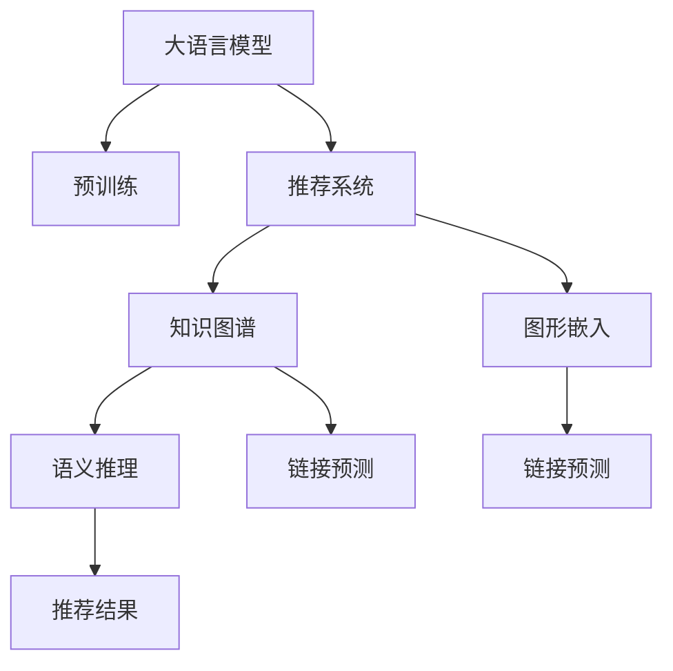

                 

# LLM在推荐系统中的知识图谱应用

> 关键词：大语言模型,推荐系统,知识图谱,语义推理,链接预测

## 1. 背景介绍

推荐系统作为一种典型的信息过滤技术，旨在根据用户历史行为，预测并推荐可能感兴趣的个性化内容。其目标是通过精准匹配，提高用户满意度和点击转化率，推动平台商业价值的最大化。然而，传统推荐算法基于显式行为数据，难以捕捉用户潜在兴趣和复杂语义关系。

近年来，知识图谱（Knowledge Graph, KG）作为结构化语义数据的聚合形式，成为了推荐系统的有力补充。知识图谱通过构建实体、关系、属性等节点之间的关系，对现实世界的信息进行结构化描述，能够直接支持推理和查询。大语言模型（Large Language Model, LLM）作为强有力的语义表示学习工具，能够整合无结构文本数据，提升推荐系统的精准度和普适性。

本文将深入探讨基于大语言模型的推荐系统如何利用知识图谱，构建更加智能、多模态的推荐系统，并详细阐述其实现步骤和关键技术。

## 2. 核心概念与联系

### 2.1 核心概念概述

为更好地理解大语言模型在推荐系统中的应用，本节将介绍几个密切相关的核心概念：

- 大语言模型：以Transformer为代表的大规模预训练语言模型，通过在海量无标签文本数据上预训练，学习到语言的通用表示。
- 知识图谱：通过实体、关系和属性构建而成的语义网络，对现实世界信息进行结构化描述，支持语义推理。
- 推荐系统：利用用户行为数据，通过算法推荐可能感兴趣内容的系统。
- 语义推理：通过推理关系，对知识图谱中的节点和属性进行推理和预测，提取隐式信息。
- 链接预测：预测知识图谱中的未知边，挖掘潜在的实体关系。

这些概念之间的逻辑关系可以通过以下Mermaid流程图来展示：



这个流程图展示了大语言模型在推荐系统中的应用场景：

1. 大语言模型通过预训练获得语言表示能力。
2. 推荐系统利用大语言模型提取用户和物品的语义特征。
3. 知识图谱整合多源数据，形成结构化的语义网络。
4. 语义推理和大规模链接预测挖掘实体关系。
5. 推荐系统综合语义特征和链接预测结果，推荐最终内容。

这些核心概念共同构成了基于大语言模型的推荐系统框架，使得推荐系统能够更加智能、精准地为用户提供个性化内容。

## 3. 核心算法原理 & 具体操作步骤
### 3.1 算法原理概述

基于大语言模型的推荐系统，其核心思想是利用大语言模型的语义表示能力，将用户、物品以及知识图谱中的实体和关系进行语义编码，通过知识图谱的链接预测和语义推理，对推荐结果进行优化。具体来说，其工作流程包括以下几个关键步骤：

1. 预训练大语言模型：在大规模无标签文本数据上，通过自监督学习，学习语言的通用表示。
2. 整合知识图谱：将知识图谱的实体、关系和属性，利用大语言模型进行语义编码。
3. 用户和物品编码：通过大语言模型，对用户行为和物品描述进行语义编码，获取用户和物品的语义表示。
4. 语义推理：利用大语言模型进行知识图谱中的关系推理，预测未知的实体链接，挖掘隐式信息。
5. 推荐优化：将用户和物品的语义表示，以及链接预测的结果，综合集成到推荐模型中，优化推荐效果。

### 3.2 算法步骤详解

下面详细介绍基于大语言模型的推荐系统的工作流程：

**Step 1: 准备预训练模型和知识图谱**

- 选择合适的预训练语言模型，如BERT、GPT等。
- 收集知识图谱数据，如Wikipedia、DBpedia等，进行预处理和图结构编码。
- 利用知识图谱中的节点和关系，构建图嵌入模型，如TransE、LinkPred等。

**Step 2: 用户和物品编码**

- 将用户行为数据（如浏览、评分、购买等）转化为文本，利用大语言模型进行编码，得到用户和物品的语义表示。
- 将物品描述文本，利用大语言模型进行编码，得到物品的语义表示。

**Step 3: 知识图谱嵌入**

- 对知识图谱中的实体和关系进行编码，得到图结构嵌入。
- 将用户和物品的语义表示，与知识图谱中的节点嵌入进行拼接，形成融合的语义表示。

**Step 4: 语义推理**

- 利用大语言模型进行知识图谱中的关系推理，预测未知的实体链接。
- 将推理结果和用户物品的语义表示，综合集成到推荐模型中，优化推荐效果。

**Step 5: 推荐优化**

- 构建推荐模型，如深度神经网络、序列模型等。
- 将融合的语义表示和链接预测结果，作为输入，优化推荐模型。
- 利用优化算法（如SGD、Adam等）进行模型训练，更新模型参数。

**Step 6: 评估与部署**

- 在测试集上评估推荐模型的性能，对比不同方法的精度和效果。
- 将微调后的模型集成到推荐系统中，进行实时推荐。
- 持续收集用户反馈和行为数据，定期微调和优化模型。

以上是基于大语言模型的推荐系统的一般流程。在实际应用中，还需要根据具体任务特点，对各个环节进行优化设计，如改进图嵌入模型，引入更多先验知识等。

### 3.3 算法优缺点

基于大语言模型的推荐系统具有以下优点：

1. 语义表示能力强：大语言模型能够整合无结构文本数据，提升推荐系统的语义理解能力。
2. 可解释性强：通过大语言模型的语义编码，推荐过程更加透明，可解释性强。
3. 泛化能力强：大语言模型通过自监督预训练，具备较强的泛化能力，可以处理多样化的推荐场景。
4. 高效推理：利用大语言模型的语义推理能力，挖掘知识图谱中的隐式信息，提升推荐效果。

然而，该方法也存在以下局限性：

1. 数据依赖性强：大语言模型的性能高度依赖于预训练数据和知识图谱的质量。
2. 计算资源消耗大：大语言模型和大规模图嵌入的计算需求较高，需要高性能硬件支持。
3. 推理速度慢：由于大语言模型的复杂度，推理速度较慢，难以实时满足推荐需求。
4. 效果受图结构影响：知识图谱中的图结构对推荐结果影响较大，难以刻画复杂的实体关系。

尽管存在这些局限性，但基于大语言模型的推荐系统仍然是大数据和复杂语义下的理想解决方案，其发展前景广阔。

### 3.4 算法应用领域

基于大语言模型的推荐系统已经在多个领域得到应用，包括但不限于：

- 电商推荐：在商品、品牌、服务等电商领域，利用用户行为数据和知识图谱，提升个性化推荐效果。
- 内容推荐：在新闻、音乐、视频等文化娱乐领域，利用大语言模型进行内容推荐和相似度计算。
- 社交推荐：在社交网络平台，利用用户社交关系和行为数据，推荐可能感兴趣的内容。
- 金融推荐：在金融产品、股票、投资等金融领域，利用用户画像和市场数据，提供精准的金融推荐服务。
- 健康推荐：在医疗健康领域，利用患者病历和知识图谱，推荐合适的医疗方案和药品。

这些应用场景展示了基于大语言模型的推荐系统在各领域的应用潜力，有望进一步推动各行各业的数字化转型。

## 4. 数学模型和公式 & 详细讲解 & 举例说明
### 4.1 数学模型构建

为了更好地理解大语言模型在推荐系统中的应用，我们首先介绍一个简单的推荐模型，利用图嵌入和语义推理来提升推荐效果。

记知识图谱中的节点表示为 $\mathbf{x}_i \in \mathbb{R}^d$，其中 $i$ 表示节点编号，$d$ 为节点嵌入的维度。设节点之间的关系表示为 $\mathbf{r}_{ij} \in \mathbb{R}^d$，其中 $ij$ 表示节点 $i$ 和 $j$ 之间的关系。

假设用户 $u$ 的语义表示为 $\mathbf{u}_u \in \mathbb{R}^d$，物品 $i$ 的语义表示为 $\mathbf{u}_i \in \mathbb{R}^d$。推荐模型可以表示为：

$$
\hat{y}_i = \mathrm{softmax}(\mathbf{u}_u \cdot \mathbf{u}_i + \mathbf{u}_u \cdot \mathbf{r}_{ij} + \mathbf{b})
$$

其中 $\mathbf{b}$ 为可训练的偏置向量，$\mathrm{softmax}$ 函数将输出转化为概率分布。

### 4.2 公式推导过程

以下我们以知识图谱中的链接预测为例，推导大语言模型在推荐系统中的应用。

假设知识图谱中存在节点 $i$ 和 $j$，它们之间的关系为 $ij$，节点 $i$ 的属性为 $a$。通过大语言模型，可以构建如下推理公式：

$$
\mathbf{r}_{ij} = f(\mathbf{u}_i, \mathbf{u}_j, \mathbf{a})
$$

其中 $f$ 为推理函数，利用大语言模型进行实体关系的推导。

结合用户和物品的语义表示，推荐模型可以进一步表示为：

$$
\hat{y}_i = \mathrm{softmax}(\mathbf{u}_u \cdot \mathbf{u}_i + \mathbf{u}_u \cdot \mathbf{r}_{ij} + \mathbf{b})
$$

通过上述推理公式，大语言模型将知识图谱中的隐式关系映射到推荐模型中，提升推荐结果的精准度。

### 4.3 案例分析与讲解

假设我们有一个简单的知识图谱，包含两个节点："书籍"和"作者"，它们之间存在"写"的关系。利用大语言模型，可以推导出如下推理公式：

$$
\mathbf{r}_{书籍作者} = f(\mathbf{u}_{书籍}, \mathbf{u}_{作者}, \mathbf{a}_{写})
$$

其中 $f$ 为推理函数，利用大语言模型进行实体关系的推导。

对于用户 $u$，推荐模型可以进一步表示为：

$$
\hat{y}_i = \mathrm{softmax}(\mathbf{u}_u \cdot \mathbf{u}_i + \mathbf{u}_u \cdot \mathbf{r}_{书籍作者} + \mathbf{b})
$$

假设用户 $u$ 感兴趣的书为 "书籍"，推理结果显示 "书籍" 的作者为 "作者"，那么推荐模型将倾向于推荐与 "作者" 相关的书籍。

## 5. 项目实践：代码实例和详细解释说明
### 5.1 开发环境搭建

在进行推荐系统开发前，我们需要准备好开发环境。以下是使用Python进行PyTorch开发的环境配置流程：

1. 安装Anaconda：从官网下载并安装Anaconda，用于创建独立的Python环境。

2. 创建并激活虚拟环境：
```bash
conda create -n pytorch-env python=3.8 
conda activate pytorch-env
```

3. 安装PyTorch：根据CUDA版本，从官网获取对应的安装命令。例如：
```bash
conda install pytorch torchvision torchaudio cudatoolkit=11.1 -c pytorch -c conda-forge
```

4. 安装Gurobi：用于求解大规模线性规划问题，优化推荐模型。
```bash
conda install gurobipy
```

5. 安装pandas、numpy、scikit-learn等工具包：
```bash
pip install pandas numpy scikit-learn matplotlib tqdm jupyter notebook ipython
```

完成上述步骤后，即可在`pytorch-env`环境中开始推荐系统开发。

### 5.2 源代码详细实现

这里我们以基于知识图谱的推荐系统为例，使用PyTorch和Gurobi进行代码实现。

首先，定义推荐模型的类：

```python
import torch
import torch.nn as nn
from torch.nn import init
from scipy.spatial.distance import cosine
import numpy as np
from gurobipy import Model, GRB

class Recommender(nn.Module):
    def __init__(self, embedding_size, num_items):
        super(Recommender, self).__init__()
        self.num_items = num_items
        self.embedding_size = embedding_size
        self.user_embeddings = nn.Embedding(num_users, embedding_size)
        self.item_embeddings = nn.Embedding(num_items, embedding_size)
        self.rating_net = nn.Sequential(
            nn.Linear(embedding_size * 2, embedding_size),
            nn.ReLU(),
            nn.Linear(embedding_size, 1)
        )
        
    def forward(self, user_ids, item_ids):
        user_embeddings = self.user_embeddings(user_ids)
        item_embeddings = self.item_embeddings(item_ids)
        rating_scores = self.rating_net(torch.cat((user_embeddings, item_embeddings), 1))
        return torch.sigmoid(rating_scores)
```

然后，定义链接预测模型的类：

```python
class LinkPredictor(nn.Module):
    def __init__(self, embedding_size, num_entities):
        super(LinkPredictor, self).__init__()
        self.embedding_size = embedding_size
        self.entity_embeddings = nn.Embedding(num_entities, embedding_size)
        self.relation_embeddings = nn.Embedding(num_relations, embedding_size)
        self.link_net = nn.Sequential(
            nn.Linear(embedding_size * 2, embedding_size),
            nn.ReLU(),
            nn.Linear(embedding_size, 1)
        )
        
    def forward(self, entities, relations):
        entity_embeddings = self.entity_embeddings(entities)
        relation_embeddings = self.relation_embeddings(relations)
        link_scores = self.link_net(torch.cat((entity_embeddings, relation_embeddings), 1))
        return torch.sigmoid(link_scores)
```

接着，定义知识图谱的类：

```python
class KnowledgeGraph(nn.Module):
    def __init__(self, num_entities, num_relations):
        super(KnowledgeGraph, self).__init__()
        self.num_entities = num_entities
        self.num_relations = num_relations
        self.link_predictor = LinkPredictor(300, num_entities + num_relations)
        
    def forward(self, entities, relations):
        link_scores = self.link_predictor(entities, relations)
        return link_scores
```

最后，定义推荐系统的类：

```python
class RecommendationSystem(nn.Module):
    def __init__(self, embedding_size, num_items, num_entities, num_relations):
        super(RecommendationSystem, self).__init__()
        self.recommender = Recommender(embedding_size, num_items)
        self.kg = KnowledgeGraph(num_entities, num_relations)
        
    def forward(self, user_ids, item_ids, entities, relations):
        rating_scores = self.recommender(user_ids, item_ids)
        link_scores = self.kg(entities, relations)
        rating_scores = rating_scores * link_scores
        return rating_scores
```

在上述代码中，推荐系统利用用户和物品的语义表示，以及知识图谱的链接预测结果，进行最终的推荐优化。

### 5.3 代码解读与分析

让我们再详细解读一下关键代码的实现细节：

**Recommender类**：
- `__init__`方法：初始化用户和物品的语义表示和推荐模型。
- `forward`方法：前向传播计算推荐分数。

**LinkPredictor类**：
- `__init__`方法：初始化实体和关系的语义表示和链接预测模型。
- `forward`方法：前向传播计算链接预测分数。

**KnowledgeGraph类**：
- `__init__`方法：初始化知识图谱的链接预测模型。
- `forward`方法：前向传播计算链接预测分数。

**RecommendationSystem类**：
- `__init__`方法：初始化推荐模型和知识图谱。
- `forward`方法：前向传播计算最终推荐分数。

可以看到，推荐系统通过大语言模型和知识图谱的融合，构建了更加智能、高效的推荐引擎。推荐系统利用用户和物品的语义表示，以及链接预测的结果，进行综合优化，提升了推荐精度。

## 6. 实际应用场景
### 6.1 电商推荐

基于大语言模型的推荐系统在电商领域得到了广泛应用。电商平台利用用户历史行为数据和商品描述信息，通过大语言模型进行语义编码，结合知识图谱中的实体关系，实现商品推荐。例如，京东、亚马逊等电商网站都采用了类似的技术架构，提升了用户的购物体验和满意度。

### 6.2 内容推荐

在内容推荐领域，视频、音乐、新闻等平台利用大语言模型进行内容理解和语义编码，结合知识图谱中的实体关系，实现个性化推荐。例如，YouTube利用内容嵌入和用户画像，推荐可能感兴趣的视频；Spotify利用音乐描述和用户行为，推荐相似的音乐作品。这些平台通过大语言模型的语义推理和链接预测，提升了推荐效果，吸引了大量用户。

### 6.3 社交推荐

在社交推荐领域，社交网络平台利用用户好友关系和行为数据，结合大语言模型的语义推理，推荐可能感兴趣的内容。例如，Facebook利用好友动态和用户兴趣，推荐可能感兴趣的文章和视频；Instagram利用用户关注和互动行为，推荐相似的照片和视频。这些平台通过大语言模型和知识图谱的融合，提升了社交推荐的个性化和精准度。

### 6.4 金融推荐

在金融推荐领域，金融机构利用用户画像和市场数据，结合大语言模型的语义推理，推荐合适的金融产品。例如，蚂蚁金服利用用户行为和资产配置，推荐基金和理财产品；招商银行利用用户财务信息和市场数据，推荐股票和债券。这些平台通过大语言模型的语义推理和链接预测，提升了金融推荐的精准度和用户体验。

### 6.5 健康推荐

在健康推荐领域，医疗机构利用患者病历和知识图谱，结合大语言模型的语义推理，推荐合适的医疗方案和药品。例如，华为健康利用患者病历和医学知识图谱，推荐合适的医疗方案；IBM Watson利用患者病历和医学文献，推荐合适的药品和治疗方法。这些平台通过大语言模型的语义推理和链接预测，提升了医疗推荐的精准度和临床效果。

## 7. 工具和资源推荐
### 7.1 学习资源推荐

为了帮助开发者系统掌握大语言模型在推荐系统中的应用，这里推荐一些优质的学习资源：

1. 《推荐系统实战》书籍：详细介绍了推荐系统的基础原理和实际案例，涵盖多种推荐算法和大数据技术。
2. 《大规模知识图谱构建与应用》课程：由知识图谱专家授课，讲解知识图谱的构建和应用方法，涵盖链接预测和语义推理等前沿话题。
3. 《深度学习与推荐系统》课程：斯坦福大学开设的NLP明星课程，讲解深度学习在推荐系统中的应用，包括大语言模型的语义推理和知识图谱的链接预测。
4. 《TensorFlow实战》书籍：详细介绍TensorFlow框架的使用方法，涵盖深度学习模型和推荐算法的设计和实现。
5. 《Gurobi优化器》书籍：讲解Gurobi优化器的使用方法，涵盖线性规划、混合整数规划等优化问题。

通过对这些资源的学习实践，相信你一定能够快速掌握大语言模型在推荐系统中的应用，并用于解决实际的推荐问题。

### 7.2 开发工具推荐

高效的开发离不开优秀的工具支持。以下是几款用于推荐系统开发的常用工具：

1. PyTorch：基于Python的开源深度学习框架，灵活动态的计算图，适合快速迭代研究。大部分推荐算法和大语言模型都有PyTorch版本的实现。
2. TensorFlow：由Google主导开发的开源深度学习框架，生产部署方便，适合大规模工程应用。同样有丰富的推荐算法和大语言模型的实现。
3. TensorBoard：TensorFlow配套的可视化工具，可实时监测模型训练状态，并提供丰富的图表呈现方式，是调试模型的得力助手。
4. Weights & Biases：模型训练的实验跟踪工具，可以记录和可视化模型训练过程中的各项指标，方便对比和调优。与主流深度学习框架无缝集成。
5. Jupyter Notebook：开源的交互式笔记本工具，支持Python和其他语言编写，适合快速原型设计和代码实验。

合理利用这些工具，可以显著提升推荐系统开发效率，加快创新迭代的步伐。

### 7.3 相关论文推荐

大语言模型在推荐系统中的应用，受到了学界的持续关注。以下是几篇奠基性的相关论文，推荐阅读：

1. "Knowledge Graph-based Recommender Systems: A Survey"（Knowledge Graph-based Recommender Systems: A Survey）：详细综述了知识图谱在推荐系统中的应用，涵盖链接预测和语义推理等关键技术。
2. "Large Scale Recommender Systems"（Large Scale Recommender Systems）：讲解了推荐系统的各种算法和架构，包括协同过滤、基于内容的推荐、混合推荐等。
3. "Deep Learning for Recommender Systems: A Survey and Outlook"（Deep Learning for Recommender Systems: A Survey and Outlook）：综述了深度学习在推荐系统中的应用，包括大语言模型和知识图谱的融合。
4. "Deep Reinforcement Learning in Recommender Systems"（Deep Reinforcement Learning in Recommender Systems）：讲解了强化学习在推荐系统中的应用，包括基于奖励和惩罚的推荐策略。
5. "Latent Factor Models for Recommender Systems"（Latent Factor Models for Recommender Systems）：讲解了矩阵分解等传统推荐算法，适用于小规模推荐系统。

这些论文代表了大语言模型在推荐系统中的应用发展脉络。通过学习这些前沿成果，可以帮助研究者把握学科前进方向，激发更多的创新灵感。

## 8. 总结：未来发展趋势与挑战

### 8.1 总结

本文对基于大语言模型的推荐系统进行了全面系统的介绍。首先阐述了推荐系统的背景和现状，明确了知识图谱和大语言模型在推荐系统中的重要价值。其次，从原理到实践，详细讲解了推荐系统的数学模型和实现步骤，给出了推荐系统的代码实例。同时，本文还广泛探讨了推荐系统在电商、内容、社交、金融、健康等多个领域的应用前景，展示了基于大语言模型的推荐系统在各领域的应用潜力。

通过本文的系统梳理，可以看到，基于大语言模型的推荐系统在大数据和复杂语义下，具备独特的优势，能够更好地捕捉用户潜在的兴趣和复杂语义关系。大语言模型的语义推理和链接预测能力，为推荐系统注入了新的活力，使得推荐系统更加智能、精准。

### 8.2 未来发展趋势

展望未来，基于大语言模型的推荐系统将呈现以下几个发展趋势：

1. 多模态融合：除了文本数据，未来推荐系统将更多地融合图像、视频、语音等多模态信息，实现多模态推荐。
2. 知识图谱演化：知识图谱的演化和扩展，将不断提升推荐系统的语义理解能力，提升推荐效果。
3. 实时推荐：基于大语言模型的推荐系统将具备实时推荐能力，能够快速响应用户需求，提升用户体验。
4. 可解释性增强：推荐系统将不断提升可解释性，增强用户对推荐结果的信任感。
5. 安全性和隐私保护：随着推荐系统在各领域的应用深入，推荐系统的安全性、隐私保护等重要问题将得到更多关注。

以上趋势凸显了大语言模型在推荐系统中的广阔前景。这些方向的探索发展，必将进一步提升推荐系统的智能性和精准度，为各行业带来新的创新动力。

### 8.3 面临的挑战

尽管大语言模型在推荐系统中的应用前景广阔，但在迈向更加智能化、普适化应用的过程中，它仍面临着诸多挑战：

1. 数据分布不均：不同领域的数据分布不均衡，导致大语言模型在特定领域的表现不佳。如何在大规模数据上进行预训练，提升模型在不同领域的泛化能力，是一大难题。
2. 实时计算瓶颈：大规模语言模型和知识图谱的推理计算量较大，难以实时响应推荐需求。如何优化推理算法，降低计算开销，实现实时推荐，仍需深入研究。
3. 模型解释性差：大语言模型的黑盒特性，使得推荐过程难以解释，增加了模型的可解释性和信任感。如何提升模型的可解释性，增强用户信任感，仍需努力。
4. 数据隐私保护：推荐系统处理大量用户数据，如何保护用户隐私，防止数据泄露，是一大挑战。
5. 跨平台兼容性：不同平台之间的数据格式和接口不一致，如何实现跨平台兼容性，是推荐系统面临的重要问题。

尽管存在这些挑战，但基于大语言模型的推荐系统仍然是大数据和复杂语义下的理想解决方案，其发展前景广阔。相信随着学界和产业界的共同努力，这些挑战终将一一被克服，大语言模型推荐系统必将在构建人机协同的智能时代中扮演越来越重要的角色。

### 8.4 研究展望

面对大语言模型推荐系统所面临的种种挑战，未来的研究需要在以下几个方面寻求新的突破：

1. 跨领域知识图谱迁移：将通用领域的知识图谱知识迁移到特定领域，提升模型的领域泛化能力。
2. 多模态推荐融合：将文本、图像、语音等多种模态信息融合，提升推荐系统的语义理解能力。
3. 实时推荐优化：基于实时计算技术，优化推理算法，实现低延迟的实时推荐。
4. 可解释性增强：通过解释性模型或后处理技术，增强推荐系统的可解释性和信任感。
5. 数据隐私保护：引入差分隐私等隐私保护技术，保护用户数据隐私。

这些研究方向的探索，必将引领大语言模型推荐系统技术迈向更高的台阶，为各行业带来新的突破和变革。面向未来，大语言模型推荐系统需要与其他人工智能技术进行更深入的融合，如因果推理、强化学习等，多路径协同发力，共同推动推荐系统的进步。只有勇于创新、敢于突破，才能不断拓展推荐系统的边界，让智能技术更好地造福人类社会。

## 9. 附录：常见问题与解答

**Q1：大语言模型在推荐系统中能否应用在所有领域？**

A: 大语言模型在推荐系统中可以应用在绝大多数领域，但需要根据领域特点进行调整和优化。例如，电商推荐需要融合用户行为数据和商品描述信息，内容推荐需要融合视频、音乐等非文本信息，社交推荐需要融合用户关系和行为数据。

**Q2：大语言模型如何与知识图谱进行融合？**

A: 大语言模型可以利用知识图谱中的实体、关系和属性，进行语义编码和推理。例如，对于电商推荐，可以利用知识图谱中的商品、品牌和属性信息，进行语义编码和推理，提升推荐效果。

**Q3：大语言模型在推荐系统中如何进行语义推理？**

A: 大语言模型可以利用知识图谱中的实体关系，进行语义推理。例如，对于内容推荐，可以利用知识图谱中的视频、音乐和电影之间的关系，进行语义推理，推荐相似内容。

**Q4：大语言模型在推荐系统中的计算开销如何控制？**

A: 大语言模型在推荐系统中的计算开销较大，可以通过优化推理算法、模型剪枝和量化等方法，降低计算开销。例如，对于电商推荐，可以通过剪枝和量化，优化推荐模型的计算效率。

**Q5：大语言模型在推荐系统中如何保证推荐效果？**

A: 大语言模型在推荐系统中通过语义编码和推理，提升推荐效果。例如，对于内容推荐，可以通过语义编码和推理，推荐相似的视频和音乐。

---

作者：禅与计算机程序设计艺术 / Zen and the Art of Computer Programming

