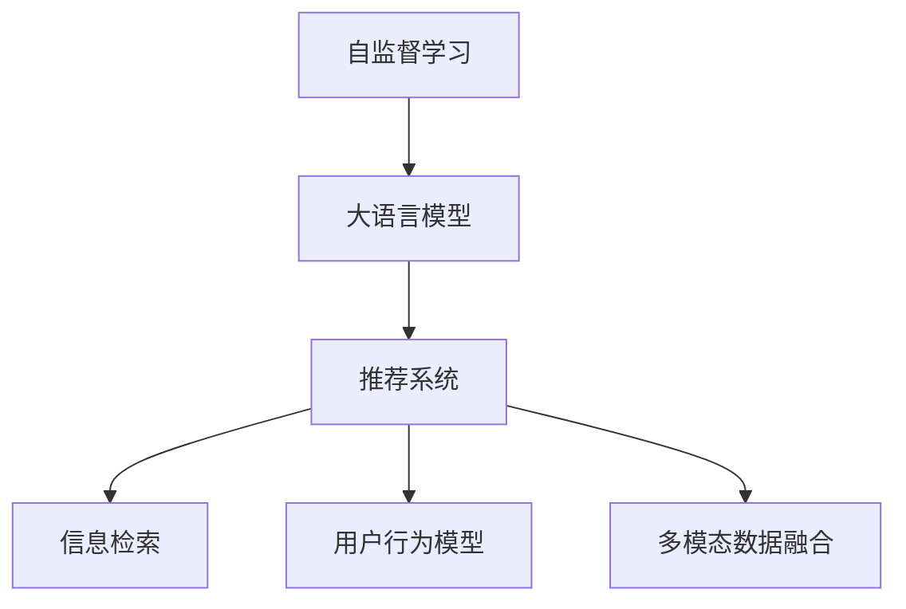

                 

# LLM在推荐系统中的自监督学习应用

> 关键词：自监督学习,LLM,推荐系统,信息检索,用户行为模型

## 1. 背景介绍

### 1.1 问题由来
推荐系统在电商、社交、娱乐等众多领域的应用已经取得了显著成效，极大地提升了用户体验和平台运营效率。传统的推荐系统主要依赖用户行为数据进行个性化推荐，如浏览记录、点击行为、购买记录等。然而，这些行为数据往往具有稀疏性、局部性和即时性等缺陷，难以充分捕捉用户深层次的兴趣和需求。

近年来，随着语言模型预训练技术的兴起，基于大规模文本数据的自监督学习，成为推荐系统中新的重要范式。特别是大语言模型（Large Language Models, LLMs），通过在大规模无标签文本上预训练，学习丰富的语言表征，具备了强大的语言理解能力，为推荐系统注入了新的活力。通过将预训练的语言模型应用于推荐系统，可以实现多模态数据的整合、深度语义的理解以及跨领域知识的学习，从而提升推荐系统的效果和灵活性。

### 1.2 问题核心关键点
本节将介绍LLM在推荐系统中的自监督学习应用，包括以下核心点：
1. 自监督学习的基本原理与LLM的应用。
2. LLM在推荐系统中的具体实现和应用。
3. LLM在推荐系统中的优缺点和面临的挑战。

## 2. 核心概念与联系

### 2.1 核心概念概述

为更好地理解LLM在推荐系统中的应用，本节将介绍几个关键概念：

- 自监督学习(Self-Supervised Learning)：利用大规模无标签数据进行学习，无需人工标注，即可获取数据的内在结构和特征。
- 大语言模型(Large Language Models, LLM)：以Transformer等结构为基础的深度学习模型，通过在大规模无标签文本上进行预训练，学习丰富的语言表示。
- 推荐系统(Recommendation System)：通过分析用户历史行为数据，预测用户未来可能感兴趣的商品、内容或服务等，实现个性化推荐。
- 信息检索(Information Retrieval)：利用计算机检索技术，从大量数据中快速找到最相关的结果，常用于商品搜索、知识图谱等场景。
- 用户行为模型(User Behavior Model)：构建用户兴趣偏好和行为动态的模型，以指导推荐系统的决策过程。
- 多模态数据融合(Multimodal Data Fusion)：将不同模态的数据（如文本、图像、音频等）整合，形成统一的表示，提高推荐系统的泛化能力和鲁棒性。

这些概念之间的关系可以通过以下Mermaid流程图来展示：



这个流程图展示了自监督学习在大语言模型预训练中的应用，以及预训练后的模型在推荐系统中的多种应用场景。

## 3. 核心算法原理 & 具体操作步骤
### 3.1 算法原理概述

基于LLM的自监督学习推荐系统，其核心思想是通过无标签数据对预训练模型进行进一步优化，使其能够更好地理解用户行为和需求，从而提升推荐效果。具体来说，可以分为以下几个步骤：

1. **预训练步骤**：在无标签文本数据上预训练大语言模型，使其学习到语言的丰富表征。
2. **微调步骤**：在推荐系统的监督数据集上对预训练模型进行微调，使其能够更好地适应推荐场景。
3. **融合步骤**：将微调后的模型与信息检索、用户行为模型等模块进行整合，形成综合的推荐系统。

### 3.2 算法步骤详解

#### 3.2.1 预训练步骤

预训练步骤通常采用自监督学习方法，如掩码语言模型、相对位置预测等。以下以BERT为例，介绍预训练的基本步骤：

1. **掩码语言模型**：在每个句子中随机遮盖一些单词，让模型学习猜测遮盖单词。

   $$
   \text{Masked LM} = \max_{\hat{y}} p(y | \tilde{x})
   $$
   
   其中，$\tilde{x}$ 为遮盖后的文本，$y$ 为遮盖单词的真实文本，$\hat{y}$ 为模型预测的遮盖单词。

2. **相对位置预测**：预测句子中单词之间的相对位置关系。

   $$
   \text{Next Sentence Prediction} = p(y | x_1, x_2)
   $$
   
   其中，$x_1$ 和 $x_2$ 分别为句子 $x$ 的两个部分，$y$ 为 $x_2$ 是否是 $x_1$ 的下一个句子。

通过这些任务，预训练模型学习到了丰富的语言知识和结构，为后续的推荐系统提供了强大的基础。

#### 3.2.2 微调步骤

微调步骤通常使用推荐系统中的标注数据，如用户-物品互动记录、评分数据等，对预训练模型进行进一步优化。以下以Amazon商品推荐为例，介绍微调的基本流程：

1. **任务适配**：根据推荐任务，设计合适的输出层和损失函数。
   - 对于评分预测任务，通常使用均方误差损失。
   - 对于排序任务，通常使用排序损失或排序交叉熵损失。

2. **设置微调超参数**：选择合适的优化算法及其参数，如AdamW、SGD等，设置学习率、批大小、迭代轮数等。

3. **执行梯度训练**：将训练集数据分批次输入模型，前向传播计算损失函数。
   - 对于评分预测任务，模型输出与真实评分之间的均方误差。
   - 对于排序任务，模型输出与真实序列之间的交叉熵。

4. **周期性验证**：在验证集上评估模型性能，根据性能指标决定是否触发Early Stopping。

5. **测试和部署**：在测试集上评估微调后模型的性能，集成到推荐系统中。

#### 3.2.3 融合步骤

融合步骤是将微调后的LLM与其他推荐系统模块进行整合。以下以深度学习驱动的推荐系统为例，介绍融合的基本流程：

1. **信息检索**：通过预训练的语言模型，将查询和候选项之间的语义相似度进行匹配，找到最相关的物品。

2. **用户行为模型**：通过微调后的LLM，构建用户兴趣和行为动态的模型，预测用户未来可能感兴趣的商品。

3. **多模态数据融合**：将用户的文本反馈、图像、行为数据等不同模态的信息进行整合，形成统一的表示，提高推荐系统的泛化能力和鲁棒性。

### 3.3 算法优缺点

基于LLM的自监督学习推荐系统具有以下优点：

1. **泛化能力强**：预训练模型在广泛的数据上学习到丰富的语言知识，能够泛化到多种推荐场景。
2. **灵活性高**：通过微调，可以根据具体推荐任务进一步优化模型，适应不同的数据分布和业务需求。
3. **集成性良好**：可以与信息检索、用户行为模型等模块进行深度整合，形成更全面的推荐系统。

但同时也存在一些局限：

1. **资源消耗大**：预训练和微调过程需要大量的计算资源和时间，对硬件要求较高。
2. **模型复杂度高**：预训练和微调过程涉及复杂的模型结构和优化算法，调试和维护难度较大。
3. **可解释性不足**：基于大模型的推荐系统往往缺乏可解释性，难以理解模型的决策过程。
4. **数据依赖性强**：推荐系统的效果很大程度上依赖于标注数据的质量和数量，标注成本较高。

## 4. 数学模型和公式 & 详细讲解 & 举例说明

### 4.1 数学模型构建

本节将使用数学语言对基于LLM的推荐系统进行更加严格的刻画。

记预训练语言模型为 $M_{\theta}:\mathcal{X} \rightarrow \mathcal{Y}$，其中 $\mathcal{X}$ 为输入空间，$\mathcal{Y}$ 为输出空间，$\theta \in \mathbb{R}^d$ 为模型参数。假设推荐系统的训练集为 $D=\{(x_i,y_i)\}_{i=1}^N$，其中 $x_i$ 为输入，$y_i$ 为输出。

定义模型 $M_{\theta}$ 在数据样本 $(x,y)$ 上的损失函数为 $\ell(M_{\theta}(x),y)$，则在数据集 $D$ 上的经验风险为：

$$
\mathcal{L}(\theta) = \frac{1}{N} \sum_{i=1}^N \ell(M_{\theta}(x_i),y_i)
$$

微调的优化目标是最小化经验风险，即找到最优参数：

$$
\theta^* = \mathop{\arg\min}_{\theta} \mathcal{L}(\theta)
$$

在实践中，我们通常使用基于梯度的优化算法（如SGD、Adam等）来近似求解上述最优化问题。设 $\eta$ 为学习率，$\lambda$ 为正则化系数，则参数的更新公式为：

$$
\theta \leftarrow \theta - \eta \nabla_{\theta}\mathcal{L}(\theta) - \eta\lambda\theta
$$

其中 $\nabla_{\theta}\mathcal{L}(\theta)$ 为损失函数对参数 $\theta$ 的梯度，可通过反向传播算法高效计算。

### 4.2 公式推导过程

以下我们以Amazon商品评分预测任务为例，推导均方误差损失函数及其梯度的计算公式。

假设模型 $M_{\theta}$ 在输入 $x$ 上的输出为 $\hat{y}=M_{\theta}(x) \in [0,1]$，表示预测评分。真实评分 $y \in [1,5]$。则均方误差损失函数定义为：

$$
\ell(M_{\theta}(x),y) = \frac{1}{2}(\hat{y}-y)^2
$$

将其代入经验风险公式，得：

$$
\mathcal{L}(\theta) = \frac{1}{2N}\sum_{i=1}^N (\hat{y_i}-y_i)^2
$$

根据链式法则，损失函数对参数 $\theta_k$ 的梯度为：

$$
\frac{\partial \mathcal{L}(\theta)}{\partial \theta_k} = (\hat{y_i}-y_i) \frac{\partial \hat{y_i}}{\partial \theta_k}
$$

其中 $\hat{y_i} = M_{\theta}(x_i)$。

在得到损失函数的梯度后，即可带入参数更新公式，完成模型的迭代优化。重复上述过程直至收敛，最终得到适应推荐任务的最优模型参数 $\theta^*$。

### 4.3 案例分析与讲解

假设我们使用BERT模型进行Amazon商品评分预测任务，在1万条用户-物品互动记录上进行微调。具体的微调流程如下：

1. **数据预处理**：将用户-物品互动记录转换为模型所需的格式，如序列化文本和标签。

2. **模型加载**：使用PyTorch加载预训练的BERT模型，将其顶层适配到评分预测任务。

3. **任务适配层**：设计评分预测任务的输出层和损失函数。

4. **微调过程**：使用AdamW优化器，设定学习率、批大小、迭代轮数等超参数，在训练集上进行梯度训练。

5. **验证和测试**：周期性在验证集上评估模型性能，对比微调前后的精度提升。

6. **结果展示**：在测试集上评估微调后模型的性能，集成到推荐系统中。

## 5. 项目实践：代码实例和详细解释说明

### 5.1 开发环境搭建

在进行微调实践前，我们需要准备好开发环境。以下是使用Python进行PyTorch开发的环境配置流程：

1. 安装Anaconda：从官网下载并安装Anaconda，用于创建独立的Python环境。

2. 创建并激活虚拟环境：
```bash
conda create -n pytorch-env python=3.8 
conda activate pytorch-env
```

3. 安装PyTorch：根据CUDA版本，从官网获取对应的安装命令。例如：
```bash
conda install pytorch torchvision torchaudio cudatoolkit=11.1 -c pytorch -c conda-forge
```

4. 安装Transformers库：
```bash
pip install transformers
```

5. 安装各类工具包：
```bash
pip install numpy pandas scikit-learn matplotlib tqdm jupyter notebook ipython
```

完成上述步骤后，即可在`pytorch-env`环境中开始微调实践。

### 5.2 源代码详细实现

这里我们以Amazon商品评分预测任务为例，给出使用Transformers库对BERT模型进行微调的PyTorch代码实现。

首先，定义评分预测任务的数据处理函数：

```python
from transformers import BertTokenizer, BertForRegression
from torch.utils.data import Dataset
import torch

class RatingDataset(Dataset):
    def __init__(self, texts, ratings, tokenizer, max_len=128):
        self.texts = texts
        self.ratings = ratings
        self.tokenizer = tokenizer
        self.max_len = max_len
        
    def __len__(self):
        return len(self.texts)
    
    def __getitem__(self, item):
        text = self.texts[item]
        rating = self.ratings[item]
        
        encoding = self.tokenizer(text, return_tensors='pt', max_length=self.max_len, padding='max_length', truncation=True)
        input_ids = encoding['input_ids'][0]
        attention_mask = encoding['attention_mask'][0]
        
        # 对评分进行编码
        rating_vector = torch.tensor([rating], dtype=torch.float32)
        
        return {'input_ids': input_ids, 
                'attention_mask': attention_mask,
                'labels': rating_vector}

# 创建dataset
tokenizer = BertTokenizer.from_pretrained('bert-base-cased')

train_dataset = RatingDataset(train_texts, train_ratings, tokenizer)
dev_dataset = RatingDataset(dev_texts, dev_ratings, tokenizer)
test_dataset = RatingDataset(test_texts, test_ratings, tokenizer)
```

然后，定义模型和优化器：

```python
from transformers import BertForRegression, AdamW

model = BertForRegression.from_pretrained('bert-base-cased')

optimizer = AdamW(model.parameters(), lr=2e-5)
```

接着，定义训练和评估函数：

```python
from torch.utils.data import DataLoader
from tqdm import tqdm
from sklearn.metrics import mean_squared_error

device = torch.device('cuda') if torch.cuda.is_available() else torch.device('cpu')
model.to(device)

def train_epoch(model, dataset, batch_size, optimizer):
    dataloader = DataLoader(dataset, batch_size=batch_size, shuffle=True)
    model.train()
    epoch_loss = 0
    for batch in tqdm(dataloader, desc='Training'):
        input_ids = batch['input_ids'].to(device)
        attention_mask = batch['attention_mask'].to(device)
        labels = batch['labels'].to(device)
        model.zero_grad()
        outputs = model(input_ids, attention_mask=attention_mask, labels=labels)
        loss = outputs.loss
        epoch_loss += loss.item()
        loss.backward()
        optimizer.step()
    return epoch_loss / len(dataloader)

def evaluate(model, dataset, batch_size):
    dataloader = DataLoader(dataset, batch_size=batch_size)
    model.eval()
    preds, labels = [], []
    with torch.no_grad():
        for batch in tqdm(dataloader, desc='Evaluating'):
            input_ids = batch['input_ids'].to(device)
            attention_mask = batch['attention_mask'].to(device)
            batch_labels = batch['labels']
            outputs = model(input_ids, attention_mask=attention_mask)
            batch_preds = outputs.logits.argmax(dim=1).to('cpu').tolist()
            batch_labels = batch_labels.to('cpu').tolist()
            for pred, label in zip(batch_preds, batch_labels):
                preds.append(pred)
                labels.append(label)
                
    mse = mean_squared_error(labels, preds)
    return mse

```

最后，启动训练流程并在测试集上评估：

```python
epochs = 5
batch_size = 16

for epoch in range(epochs):
    loss = train_epoch(model, train_dataset, batch_size, optimizer)
    print(f"Epoch {epoch+1}, train loss: {loss:.3f}")
    
    print(f"Epoch {epoch+1}, dev results:")
    mse_dev = evaluate(model, dev_dataset, batch_size)
    print(f"MSE on dev set: {mse_dev:.3f}")
    
print("Epoch {epoch+1}, test results:")
mse_test = evaluate(model, test_dataset, batch_size)
print(f"MSE on test set: {mse_test:.3f}")
```

以上就是使用PyTorch对BERT进行Amazon商品评分预测任务微调的完整代码实现。可以看到，得益于Transformers库的强大封装，我们可以用相对简洁的代码完成BERT模型的加载和微调。

### 5.3 代码解读与分析

让我们再详细解读一下关键代码的实现细节：

**RatingDataset类**：
- `__init__`方法：初始化文本、评分、分词器等关键组件。
- `__len__`方法：返回数据集的样本数量。
- `__getitem__`方法：对单个样本进行处理，将文本输入编码为token ids，将评分转换为向量，并对其进行定长padding，最终返回模型所需的输入。

**mse定义**：
- 定义均方误差损失函数，用于衡量模型预测评分与真实评分之间的差异。

**训练和评估函数**：
- 使用PyTorch的DataLoader对数据集进行批次化加载，供模型训练和推理使用。
- 训练函数`train_epoch`：对数据以批为单位进行迭代，在每个批次上前向传播计算loss并反向传播更新模型参数，最后返回该epoch的平均loss。
- 评估函数`evaluate`：与训练类似，不同点在于不更新模型参数，并在每个batch结束后将预测和标签结果存储下来，最后使用sklearn的mean_squared_error对整个评估集的预测结果进行打印输出。

**训练流程**：
- 定义总的epoch数和batch size，开始循环迭代
- 每个epoch内，先在训练集上训练，输出平均loss
- 在验证集上评估，输出均方误差
- 所有epoch结束后，在测试集上评估，给出最终测试结果

可以看到，PyTorch配合Transformers库使得BERT微调的代码实现变得简洁高效。开发者可以将更多精力放在数据处理、模型改进等高层逻辑上，而不必过多关注底层的实现细节。

当然，工业级的系统实现还需考虑更多因素，如模型的保存和部署、超参数的自动搜索、更灵活的任务适配层等。但核心的微调范式基本与此类似。

## 6. 实际应用场景

### 6.1 智能客服系统

基于LLM的自监督学习，智能客服系统可以更加高效、智能地处理用户咨询。传统客服往往需要配备大量人力，高峰期响应缓慢，且一致性和专业性难以保证。而使用微调后的LLM，可以7x24小时不间断服务，快速响应客户咨询，用自然流畅的语言解答各类常见问题。

在技术实现上，可以收集企业内部的历史客服对话记录，将问题和最佳答复构建成监督数据，在此基础上对预训练LLM进行微调。微调后的LLM能够自动理解用户意图，匹配最合适的答案模板进行回复。对于客户提出的新问题，还可以接入检索系统实时搜索相关内容，动态组织生成回答。如此构建的智能客服系统，能大幅提升客户咨询体验和问题解决效率。

### 6.2 金融舆情监测

金融机构需要实时监测市场舆论动向，以便及时应对负面信息传播，规避金融风险。传统的人工监测方式成本高、效率低，难以应对网络时代海量信息爆发的挑战。基于LLM的自监督学习文本分类和情感分析技术，为金融舆情监测提供了新的解决方案。

具体而言，可以收集金融领域相关的新闻、报道、评论等文本数据，并对其进行主题标注和情感标注。在此基础上对预训练语言模型进行微调，使其能够自动判断文本属于何种主题，情感倾向是正面、中性还是负面。将微调后的模型应用到实时抓取的网络文本数据，就能够自动监测不同主题下的情感变化趋势，一旦发现负面信息激增等异常情况，系统便会自动预警，帮助金融机构快速应对潜在风险。

### 6.3 个性化推荐系统

当前的推荐系统往往只依赖用户的历史行为数据进行个性化推荐，无法深入理解用户的真实兴趣和需求。基于LLM的自监督学习个性化推荐系统，可以更好地挖掘用户深层次的兴趣和需求。

在实践中，可以收集用户浏览、点击、评论、分享等行为数据，提取和用户交互的物品标题、描述、标签等文本内容。将文本内容作为模型输入，用户的后续行为（如是否点击、购买等）作为监督信号，在此基础上微调预训练语言模型。微调后的模型能够从文本内容中准确把握用户的兴趣点。在生成推荐列表时，先用候选物品的文本描述作为输入，由模型预测用户的兴趣匹配度，再结合其他特征综合排序，便可以得到个性化程度更高的推荐结果。

### 6.4 未来应用展望

随着LLM和自监督学习技术的不断发展，基于微调的推荐系统将呈现以下几个发展趋势：

1. **泛化能力增强**：预训练模型在更广泛的数据上学习到丰富的语言知识，能够泛化到多种推荐场景。
2. **灵活性提高**：通过微调，可以根据具体推荐任务进一步优化模型，适应不同的数据分布和业务需求。
3. **多模态数据融合**：将用户的文本反馈、图像、行为数据等不同模态的信息进行整合，形成统一的表示，提高推荐系统的泛化能力和鲁棒性。
4. **跨领域迁移能力提升**：在预训练大模型和微调模型的基础上，提升模型的跨领域迁移能力，从而在更多场景下取得优异的推荐效果。
5. **实时性增强**：通过深度学习模型和流式计算技术，实现实时推荐，提高用户体验。
6. **安全性保障**：通过模型可解释性和公平性评估，确保推荐系统输出的安全性。

以上趋势凸显了LLM在推荐系统中的巨大潜力。这些方向的探索发展，必将进一步提升推荐系统的效果和灵活性，为电商、社交、娱乐等众多行业带来变革性影响。

## 7. 工具和资源推荐
### 7.1 学习资源推荐

为了帮助开发者系统掌握LLM在推荐系统中的自监督学习应用，这里推荐一些优质的学习资源：

1. 《Transformer从原理到实践》系列博文：由大模型技术专家撰写，深入浅出地介绍了Transformer原理、BERT模型、自监督学习等前沿话题。

2. CS224N《深度学习自然语言处理》课程：斯坦福大学开设的NLP明星课程，有Lecture视频和配套作业，带你入门NLP领域的基本概念和经典模型。

3. 《Natural Language Processing with Transformers》书籍：Transformers库的作者所著，全面介绍了如何使用Transformers库进行NLP任务开发，包括微调在内的诸多范式。

4. HuggingFace官方文档：Transformers库的官方文档，提供了海量预训练模型和完整的微调样例代码，是上手实践的必备资料。

5. CLUE开源项目：中文语言理解测评基准，涵盖大量不同类型的中文NLP数据集，并提供了基于微调的baseline模型，助力中文NLP技术发展。

通过对这些资源的学习实践，相信你一定能够快速掌握LLM在推荐系统中的自监督学习应用，并用于解决实际的推荐问题。
###  7.2 开发工具推荐

高效的开发离不开优秀的工具支持。以下是几款用于LLM在推荐系统中的自监督学习开发的常用工具：

1. PyTorch：基于Python的开源深度学习框架，灵活动态的计算图，适合快速迭代研究。大部分预训练语言模型都有PyTorch版本的实现。

2. TensorFlow：由Google主导开发的开源深度学习框架，生产部署方便，适合大规模工程应用。同样有丰富的预训练语言模型资源。

3. Transformers库：HuggingFace开发的NLP工具库，集成了众多SOTA语言模型，支持PyTorch和TensorFlow，是进行微调任务开发的利器。

4. Weights & Biases：模型训练的实验跟踪工具，可以记录和可视化模型训练过程中的各项指标，方便对比和调优。与主流深度学习框架无缝集成。

5. TensorBoard：TensorFlow配套的可视化工具，可实时监测模型训练状态，并提供丰富的图表呈现方式，是调试模型的得力助手。

6. Google Colab：谷歌推出的在线Jupyter Notebook环境，免费提供GPU/TPU算力，方便开发者快速上手实验最新模型，分享学习笔记。

合理利用这些工具，可以显著提升LLM在推荐系统中的自监督学习任务开发效率，加快创新迭代的步伐。

### 7.3 相关论文推荐

LLM在推荐系统中的应用源于学界的持续研究。以下是几篇奠基性的相关论文，推荐阅读：

1. Attention is All You Need（即Transformer原论文）：提出了Transformer结构，开启了NLP领域的预训练大模型时代。

2. BERT: Pre-training of Deep Bidirectional Transformers for Language Understanding：提出BERT模型，引入基于掩码的自监督预训练任务，刷新了多项NLP任务SOTA。

3. Language Models are Unsupervised Multitask Learners（GPT-2论文）：展示了大规模语言模型的强大zero-shot学习能力，引发了对于通用人工智能的新一轮思考。

4. Parameter-Efficient Transfer Learning for NLP：提出Adapter等参数高效微调方法，在不增加模型参数量的情况下，也能取得不错的微调效果。

5. Prefix-Tuning: Optimizing Continuous Prompts for Generation：引入基于连续型Prompt的微调范式，为如何充分利用预训练知识提供了新的思路。

6. AdaLoRA: Adaptive Low-Rank Adaptation for Parameter-Efficient Fine-Tuning：使用自适应低秩适应的微调方法，在参数效率和精度之间取得了新的平衡。

这些论文代表了大语言模型在推荐系统中的自监督学习发展脉络。通过学习这些前沿成果，可以帮助研究者把握学科前进方向，激发更多的创新灵感。

## 8. 总结：未来发展趋势与挑战

### 8.1 总结

本文对基于LLM的自监督学习推荐系统进行了全面系统的介绍。首先阐述了LLM在推荐系统中的应用背景和意义，明确了自监督学习在提升推荐系统效果和灵活性方面的独特价值。其次，从原理到实践，详细讲解了自监督学习的数学原理和关键步骤，给出了推荐系统开发的完整代码实例。同时，本文还广泛探讨了LLM在推荐系统中的实际应用场景，展示了自监督学习的巨大潜力。此外，本文精选了自监督学习的各类学习资源，力求为读者提供全方位的技术指引。

通过本文的系统梳理，可以看到，基于LLM的自监督学习推荐系统正在成为推荐系统中的重要范式，极大地拓展了预训练语言模型的应用边界，催生了更多的落地场景。得益于大规模语料的预训练，自监督学习模型以更低的时间和标注成本，在小样本条件下也能取得不俗的效果，有力推动了推荐系统的产业化进程。未来，伴随预训练语言模型和自监督学习方法的持续演进，相信推荐系统必将在更广阔的应用领域大放异彩，深刻影响人类的生产生活方式。

### 8.2 未来发展趋势

展望未来，基于LLM的自监督学习推荐系统将呈现以下几个发展趋势：

1. **泛化能力增强**：预训练模型在更广泛的数据上学习到丰富的语言知识，能够泛化到多种推荐场景。
2. **灵活性提高**：通过微调，可以根据具体推荐任务进一步优化模型，适应不同的数据分布和业务需求。
3. **多模态数据融合**：将用户的文本反馈、图像、行为数据等不同模态的信息进行整合，形成统一的表示，提高推荐系统的泛化能力和鲁棒性。
4. **跨领域迁移能力提升**：在预训练大模型和微调模型的基础上，提升模型的跨领域迁移能力，从而在更多场景下取得优异的推荐效果。
5. **实时性增强**：通过深度学习模型和流式计算技术，实现实时推荐，提高用户体验。
6. **安全性保障**：通过模型可解释性和公平性评估，确保推荐系统输出的安全性。

以上趋势凸显了LLM在推荐系统中的巨大潜力。这些方向的探索发展，必将进一步提升推荐系统的效果和灵活性，为电商、社交、娱乐等众多行业带来变革性影响。

### 8.3 面临的挑战

尽管基于LLM的自监督学习推荐系统已经取得了瞩目成就，但在迈向更加智能化、普适化应用的过程中，它仍面临着诸多挑战：

1. **标注成本瓶颈**：尽管自监督学习可以降低标注数据的需求，但对于长尾应用场景，难以获得充足的高质量标注数据，成为制约自监督学习推荐的瓶颈。如何进一步降低微调对标注样本的依赖，将是一大难题。
2. **模型鲁棒性不足**：当前自监督学习模型面对域外数据时，泛化性能往往大打折扣。对于测试样本的微小扰动，自监督学习模型的预测也容易发生波动。如何提高自监督学习模型的鲁棒性，避免灾难性遗忘，还需要更多理论和实践的积累。
3. **推理效率有待提高**：大规模语言模型虽然精度高，但在实际部署时往往面临推理速度慢、内存占用大等效率问题。如何在保证性能的同时，简化模型结构，提升推理速度，优化资源占用，将是重要的优化方向。
4. **可解释性亟需加强**：当前自监督学习模型往往缺乏可解释性，难以理解模型的决策过程。对于医疗、金融等高风险应用，算法的可解释性和可审计性尤为重要。如何赋予自监督学习模型更强的可解释性，将是亟待攻克的难题。
5. **安全性有待保障**：预训练语言模型难免会学习到有偏见、有害的信息，通过自监督学习传递到下游任务，产生误导性、歧视性的输出，给实际应用带来安全隐患。如何从数据和算法层面消除模型偏见，避免恶意用途，确保输出的安全性，也将是重要的研究课题。
6. **知识整合能力不足**：现有的自监督学习模型往往局限于任务内数据，难以灵活吸收和运用更广泛的先验知识。如何让自监督学习过程更好地与外部知识库、规则库等专家知识结合，形成更加全面、准确的信息整合能力，还有很大的想象空间。

正视自监督学习推荐面临的这些挑战，积极应对并寻求突破，将是大语言模型在推荐系统中的自监督学习走向成熟的必由之路。相信随着学界和产业界的共同努力，这些挑战终将一一被克服，大语言模型自监督学习必将在构建智能推荐系统中发挥更加重要的作用。

### 8.4 研究展望

面对自监督学习推荐系统所面临的挑战，未来的研究需要在以下几个方面寻求新的突破：

1. **探索无监督和半监督自监督学习方法**：摆脱对大规模标注数据的依赖，利用自监督学习、主动学习等无监督和半监督范式，最大限度利用非结构化数据，实现更加灵活高效的推荐。
2. **研究参数高效和计算高效的自监督学习范式**：开发更加参数高效的自监督学习方法，在固定大部分预训练参数的同时，只更新极少量的任务相关参数。同时优化自监督学习模型的计算图，减少前向传播和反向传播的资源消耗，实现更加轻量级、实时性的部署。
3. **引入更多先验知识**：将符号化的先验知识，如知识图谱、逻辑规则等，与神经网络模型进行巧妙融合，引导自监督学习过程学习更准确、合理的语言模型。同时加强不同模态数据的整合，实现视觉、语音等多模态信息与文本信息的协同建模。
4. **结合因果分析和博弈论工具**：将因果分析方法引入自监督学习模型，识别出模型决策的关键特征，增强输出解释的因果性和逻辑性。借助博弈论工具刻画人机交互过程，主动探索并规避模型的脆弱点，提高系统稳定性。
5. **纳入伦理道德约束**：在自监督学习模型训练目标中引入伦理导向的评估指标，过滤和惩罚有偏见、有害的输出倾向。同时加强人工干预和审核，建立模型行为的监管机制，确保输出符合人类价值观和伦理道德。

这些研究方向的探索，必将引领自监督学习在推荐系统中的不断演进，为推荐系统的智能化、普适化、安全性带来新的突破。面向未来，自监督学习推荐系统需要与其他人工智能技术进行更深入的融合，如知识表示、因果推理、强化学习等，多路径协同发力，共同推动智能推荐系统的进步。只有勇于创新、敢于突破，才能不断拓展自监督学习推荐系统的边界，让智能推荐技术更好地造福人类社会。

