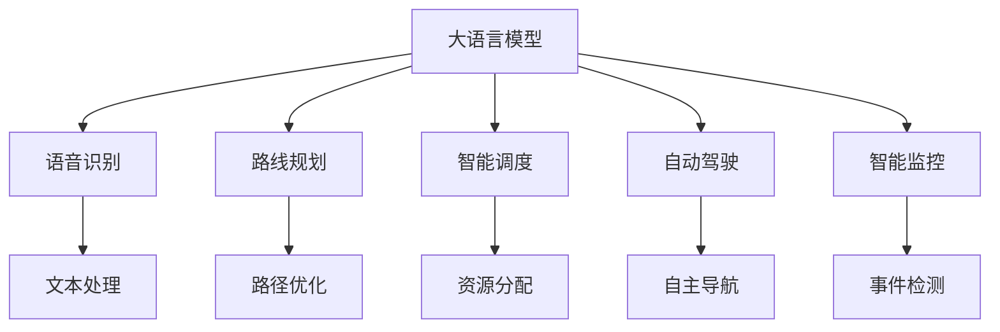

                 

# LLM在智能交通系统中的应用

> 关键词：大语言模型,智能交通系统,语音识别,路线规划,智能调度,自动驾驶,智能监控

## 1. 背景介绍

### 1.1 问题由来
智能交通系统（Intelligent Transportation System, ITS）是一个复杂的多学科交叉领域，旨在通过先进的通信、传感、计算和控制技术，改善交通流的安全性和效率。近年来，随着人工智能（AI）和大数据技术的迅猛发展，智能交通系统正逐步从传统的监控和控制走向更加智能化和自动化的方向。

在大数据和互联网技术的推动下，交通数据量呈现出爆炸式增长，如何高效地处理和分析这些海量数据，成为了智能交通系统面临的一大挑战。同时，交通场景的复杂性要求系统具备强有力的自然语言理解和推理能力，以便快速响应各种交通事件和指令。

大语言模型（Large Language Model, LLM）作为一种强大的AI技术，能够处理大规模语料，并从中提取出语言模式和知识，具备强大的自然语言理解和生成能力。将这些技术应用于智能交通系统，可以显著提升交通管理和服务水平，推动智能交通的发展。

### 1.2 问题核心关键点
本文将探讨基于大语言模型（LLM）的智能交通系统应用，主要包括以下几个关键点：

- 大语言模型在交通领域的具体应用场景，如语音识别、路线规划、智能调度、自动驾驶、智能监控等。
- 大语言模型的核心算法原理，包括Transformer、BERT、GPT等模型的结构和原理。
- 大语言模型在交通领域的实际部署，包括数据处理、模型微调、模型集成和优化等技术细节。
- 大语言模型在智能交通系统中的未来应用展望和面临的挑战。

## 2. 核心概念与联系

### 2.1 核心概念概述

为更好地理解大语言模型在智能交通系统中的应用，本节将介绍几个关键概念：

- 大语言模型（LLM）：以自回归(如GPT)或自编码(如BERT)模型为代表的大规模预训练语言模型。通过在大规模无标签文本语料上进行预训练，学习通用的语言表示，具备强大的语言理解和生成能力。

- 智能交通系统（ITS）：利用信息技术和通信技术，实现对交通流和交通设施的自动化管理和优化，提升交通效率和安全。

- 语音识别：通过语音识别技术，将交通参与者的语音指令转换为文本，供模型理解和处理。

- 路线规划：使用地图数据和交通流信息，为车辆或行人的最佳路径进行规划。

- 智能调度：通过调度算法和实时数据，优化交通资源的分配，提升交通效率。

- 自动驾驶：利用感知、决策和控制技术，使车辆能够自主导航和避障，实现无人驾驶。

- 智能监控：使用视频和图像识别技术，实时监测交通流和交通事件，提供数据支持。

这些核心概念之间的逻辑关系可以通过以下Mermaid流程图来展示：



这个流程图展示了大语言模型在智能交通系统中的核心概念及其之间的关系：

1. 大语言模型通过预训练获得基础能力。
2. 语音识别、路线规划、智能调度、自动驾驶、智能监控等应用，都需要用到大语言模型的语言处理能力。
3. 这些应用通过自然语言理解和推理，从大语言模型中获得数据支持，优化交通流、提升服务质量。

## 3. 核心算法原理 & 具体操作步骤
### 3.1 算法原理概述

基于大语言模型在智能交通系统中的应用，本质上是一个利用自然语言处理（NLP）技术提升交通管理效能的过程。其核心思想是：通过将大语言模型视作一个强大的"信息提取器"和"决策支持系统"，利用其强大的语言理解和推理能力，对交通数据进行处理和分析，从而实现智能交通的各项功能。

具体而言，大语言模型在智能交通系统中的应用可以包括以下几个步骤：

1. 数据收集：收集交通参与者的语音指令、视频监控数据、地图数据等。
2. 文本处理：利用语音识别技术将语音转换为文本，使用大语言模型进行自然语言理解，提取关键信息。
3. 信息融合：将处理后的文本信息与其他交通数据融合，形成更全面的交通数据集。
4. 任务执行：利用大语言模型对融合后的数据进行分析和推理，执行路线规划、智能调度、自动驾驶、智能监控等任务。
5. 反馈优化：将执行结果反馈给大语言模型，进行模型微调，提升模型性能。

### 3.2 算法步骤详解

基于大语言模型在智能交通系统中的应用，主要包括以下几个关键步骤：

**Step 1: 数据收集与预处理**
- 收集交通数据：包括交通监控视频、传感器数据、交通流量统计数据、GPS位置数据等。
- 数据清洗与标注：清洗缺失和异常数据，进行必要的标注，形成训练数据集。

**Step 2: 模型选择与微调**
- 选择合适的预训练语言模型：如BERT、GPT-2、RoBERTa等。
- 微调模型：在交通数据集上进行有监督学习，优化模型对交通相关信息的理解。

**Step 3: 任务适配与集成**
- 设计任务适配层：针对不同的智能交通任务，设计相应的输出层和损失函数。
- 集成模型：将微调后的模型集成到智能交通系统中，提供实时的决策支持。

**Step 4: 推理与优化**
- 推理过程：将新的交通数据输入微调后的模型，得到模型输出。
- 优化过程：根据输出结果，进行模型微调或反馈优化，提升模型性能。

**Step 5: 应用部署**
- 系统集成：将微调后的模型集成到智能交通管理系统中，提供实时的交通服务。
- 系统维护：持续监测模型性能，进行必要的维护和优化。

### 3.3 算法优缺点

基于大语言模型在智能交通系统中的应用，具有以下优点：

1. 强大的自然语言处理能力：大语言模型具备强大的语言理解能力和生成能力，能够高效处理复杂的交通指令和信息。
2. 数据驱动的决策支持：通过大规模数据训练，大语言模型能够提供基于数据的决策支持，提升交通管理的科学性和效率。
3. 自适应学习：大语言模型具备自适应学习能力，能够根据实时数据不断优化模型性能，提高交通管理系统的灵活性。

同时，该方法也存在一定的局限性：

1. 依赖高质量标注数据：微调过程中需要大量的标注数据，这些数据获取成本较高，且标注质量对模型性能影响显著。
2. 对实时数据处理要求高：大语言模型需要实时处理大量数据，对计算资源和存储资源要求较高。
3. 对抗攻击风险：由于大语言模型的复杂性，其决策过程可能受到对抗攻击，导致输出结果偏差。
4. 算法透明性不足：大语言模型作为黑盒系统，其内部工作机制难以解释，可能影响系统信任度和可控性。

尽管存在这些局限性，但就目前而言，基于大语言模型的智能交通系统应用范式仍具有显著的优势，并且在不断优化和完善。

### 3.4 算法应用领域

大语言模型在智能交通系统中的应用已经涉及多个领域，如语音识别、路线规划、智能调度、自动驾驶、智能监控等。

- **语音识别**：使用大语言模型对交通参与者的语音指令进行自然语言理解，提取关键信息。
- **路线规划**：利用大语言模型进行路径规划，提供最佳行车路线。
- **智能调度**：使用大语言模型优化交通资源的分配，提升道路利用率。
- **自动驾驶**：利用大语言模型进行交通场景理解，辅助自动驾驶决策。
- **智能监控**：利用大语言模型进行交通事件检测和异常监测，提供数据支持。

这些应用场景展示了大语言模型在智能交通系统中的广泛应用，推动了交通管理的智能化和自动化进程。

## 4. 数学模型和公式 & 详细讲解 & 举例说明

### 4.1 数学模型构建

本节将使用数学语言对大语言模型在智能交通系统中的应用进行更加严格的刻画。

记大语言模型为 $M_{\theta}$，其中 $\theta$ 为模型参数。假设交通数据集为 $D=\{(x_i, y_i)\}_{i=1}^N$，其中 $x_i$ 为交通数据，$y_i$ 为交通事件标签。

定义模型 $M_{\theta}$ 在数据样本 $(x,y)$ 上的损失函数为 $\ell(M_{\theta}(x),y)$，则在数据集 $D$ 上的经验风险为：

$$
\mathcal{L}(\theta) = \frac{1}{N} \sum_{i=1}^N \ell(M_{\theta}(x_i),y_i)
$$

微调的目标是最小化经验风险，即找到最优参数：

$$
\theta^* = \mathop{\arg\min}_{\theta} \mathcal{L}(\theta)
$$

在实践中，我们通常使用基于梯度的优化算法（如SGD、Adam等）来近似求解上述最优化问题。设 $\eta$ 为学习率，$\lambda$ 为正则化系数，则参数的更新公式为：

$$
\theta \leftarrow \theta - \eta \nabla_{\theta}\mathcal{L}(\theta) - \eta\lambda\theta
$$

其中 $\nabla_{\theta}\mathcal{L}(\theta)$ 为损失函数对参数 $\theta$ 的梯度，可通过反向传播算法高效计算。

### 4.2 公式推导过程

以下我们以路线规划任务为例，推导大语言模型在其中的数学模型及其梯度计算公式。

假设路线规划任务的目标是最小化从起点到终点的行驶距离，大语言模型通过对地图数据和交通流信息的理解，生成最佳的行车路线。设模型 $M_{\theta}$ 在输入 $x$ 上的输出为 $v=M_{\theta}(x) \in \mathbb{R}^d$，表示从当前位置到目的地的预测行驶距离。真实标签 $y \in \{1,0\}$，表示是否到达目的地。

则路线规划任务的损失函数定义为：

$$
\ell(M_{\theta}(x),y) = \begin{cases}
y\log \hat{v} + (1-y)\log (1-\hat{v}), & \text{if } y=1 \\
(1-y)\log \hat{v}, & \text{if } y=0
\end{cases}
$$

将其代入经验风险公式，得：

$$
\mathcal{L}(\theta) = -\frac{1}{N}\sum_{i=1}^N [y_i\log M_{\theta}(x_i)+(1-y_i)\log(1-M_{\theta}(x_i))]
$$

根据链式法则，损失函数对参数 $\theta_k$ 的梯度为：

$$
\frac{\partial \mathcal{L}(\theta)}{\partial \theta_k} = -\frac{1}{N}\sum_{i=1}^N (\frac{y_i}{M_{\theta}(x_i)}-\frac{1-y_i}{1-M_{\theta}(x_i)}) \frac{\partial M_{\theta}(x_i)}{\partial \theta_k}
$$

其中 $\frac{\partial M_{\theta}(x_i)}{\partial \theta_k}$ 可进一步递归展开，利用自动微分技术完成计算。

在得到损失函数的梯度后，即可带入参数更新公式，完成模型的迭代优化。重复上述过程直至收敛，最终得到适应路线规划任务的最优模型参数 $\theta^*$。

## 5. 项目实践：代码实例和详细解释说明

### 5.1 开发环境搭建

在进行智能交通系统应用的大语言模型微调实践前，我们需要准备好开发环境。以下是使用Python进行PyTorch开发的环境配置流程：

1. 安装Anaconda：从官网下载并安装Anaconda，用于创建独立的Python环境。

2. 创建并激活虚拟环境：
```bash
conda create -n traffic-env python=3.8 
conda activate traffic-env
```

3. 安装PyTorch：根据CUDA版本，从官网获取对应的安装命令。例如：
```bash
conda install pytorch torchvision torchaudio cudatoolkit=11.1 -c pytorch -c conda-forge
```

4. 安装Transformers库：
```bash
pip install transformers
```

5. 安装各类工具包：
```bash
pip install numpy pandas scikit-learn matplotlib tqdm jupyter notebook ipython
```

完成上述步骤后，即可在`traffic-env`环境中开始智能交通系统应用的大语言模型微调实践。

### 5.2 源代码详细实现

下面我们以路线规划任务为例，给出使用Transformers库对BERT模型进行微调的PyTorch代码实现。

首先，定义路线规划任务的数据处理函数：

```python
from transformers import BertTokenizer
from torch.utils.data import Dataset
import torch

class RoutePlanningDataset(Dataset):
    def __init__(self, data, tokenizer, max_len=128):
        self.data = data
        self.tokenizer = tokenizer
        self.max_len = max_len
        
    def __len__(self):
        return len(self.data)
    
    def __getitem__(self, item):
        start_loc, end_loc = self.data[item]
        start_sequence = f"{start_loc} to {end_loc}"
        
        encoding = self.tokenizer(start_sequence, return_tensors='pt', max_length=self.max_len, padding='max_length', truncation=True)
        input_ids = encoding['input_ids'][0]
        attention_mask = encoding['attention_mask'][0]
        
        # 将输入序列转换为数字标签
        labels = torch.tensor(0 if encoding['input_ids'].sum() > 0 else 1, dtype=torch.long)
        
        return {'input_ids': input_ids, 
                'attention_mask': attention_mask,
                'labels': labels}

# 创建dataset
tokenizer = BertTokenizer.from_pretrained('bert-base-cased')

train_dataset = RoutePlanningDataset(train_data, tokenizer)
dev_dataset = RoutePlanningDataset(dev_data, tokenizer)
test_dataset = RoutePlanningDataset(test_data, tokenizer)
```

然后，定义模型和优化器：

```python
from transformers import BertForTokenClassification, AdamW

model = BertForTokenClassification.from_pretrained('bert-base-cased', num_labels=2)

optimizer = AdamW(model.parameters(), lr=2e-5)
```

接着，定义训练和评估函数：

```python
from torch.utils.data import DataLoader
from tqdm import tqdm
from sklearn.metrics import accuracy_score

device = torch.device('cuda') if torch.cuda.is_available() else torch.device('cpu')
model.to(device)

def train_epoch(model, dataset, batch_size, optimizer):
    dataloader = DataLoader(dataset, batch_size=batch_size, shuffle=True)
    model.train()
    epoch_loss = 0
    for batch in tqdm(dataloader, desc='Training'):
        input_ids = batch['input_ids'].to(device)
        attention_mask = batch['attention_mask'].to(device)
        labels = batch['labels'].to(device)
        model.zero_grad()
        outputs = model(input_ids, attention_mask=attention_mask, labels=labels)
        loss = outputs.loss
        epoch_loss += loss.item()
        loss.backward()
        optimizer.step()
    return epoch_loss / len(dataloader)

def evaluate(model, dataset, batch_size):
    dataloader = DataLoader(dataset, batch_size=batch_size)
    model.eval()
    preds, labels = [], []
    with torch.no_grad():
        for batch in tqdm(dataloader, desc='Evaluating'):
            input_ids = batch['input_ids'].to(device)
            attention_mask = batch['attention_mask'].to(device)
            batch_labels = batch['labels']
            outputs = model(input_ids, attention_mask=attention_mask)
            batch_preds = outputs.logits.argmax(dim=2).to('cpu').tolist()
            batch_labels = batch_labels.to('cpu').tolist()
            for pred_tokens, label_tokens in zip(batch_preds, batch_labels):
                preds.append(pred_tokens[:len(label_tokens)])
                labels.append(label_tokens)
                
    print(f"Accuracy: {accuracy_score(labels, preds)}")
```

最后，启动训练流程并在测试集上评估：

```python
epochs = 5
batch_size = 16

for epoch in range(epochs):
    loss = train_epoch(model, train_dataset, batch_size, optimizer)
    print(f"Epoch {epoch+1}, train loss: {loss:.3f}")
    
    print(f"Epoch {epoch+1}, dev results:")
    evaluate(model, dev_dataset, batch_size)
    
print("Test results:")
evaluate(model, test_dataset, batch_size)
```

以上就是使用PyTorch对BERT进行路线规划任务微调的完整代码实现。可以看到，得益于Transformers库的强大封装，我们可以用相对简洁的代码完成BERT模型的加载和微调。

### 5.3 代码解读与分析

让我们再详细解读一下关键代码的实现细节：

**RoutePlanningDataset类**：
- `__init__`方法：初始化训练数据、分词器等关键组件。
- `__len__`方法：返回数据集的样本数量。
- `__getitem__`方法：对单个样本进行处理，将路线规划数据转换为模型可接受的输入。

**tokenizer**：
- 定义了分词器，用于将自然语言序列转换为数字表示。

**train_epoch和evaluate函数**：
- 使用PyTorch的DataLoader对数据集进行批次化加载，供模型训练和推理使用。
- 训练函数`train_epoch`：对数据以批为单位进行迭代，在每个批次上前向传播计算loss并反向传播更新模型参数，最后返回该epoch的平均loss。
- 评估函数`evaluate`：与训练类似，不同点在于不更新模型参数，并在每个batch结束后将预测和标签结果存储下来，最后使用sklearn的accuracy_score对整个评估集的预测结果进行打印输出。

**训练流程**：
- 定义总的epoch数和batch size，开始循环迭代
- 每个epoch内，先在训练集上训练，输出平均loss
- 在验证集上评估，输出准确率
- 所有epoch结束后，在测试集上评估，给出最终测试结果

可以看到，PyTorch配合Transformers库使得BERT微调的代码实现变得简洁高效。开发者可以将更多精力放在数据处理、模型改进等高层逻辑上，而不必过多关注底层的实现细节。

当然，工业级的系统实现还需考虑更多因素，如模型的保存和部署、超参数的自动搜索、更灵活的任务适配层等。但核心的微调范式基本与此类似。

## 6. 实际应用场景
### 6.1 智能调度系统

智能调度系统通过优化交通资源的分配，实现交通流的高效管理。大语言模型在该系统中的应用，主要集中在路线规划和实时调度两个方面。

**路线规划**：通过收集交通流量、道路拥堵情况、天气状况等实时数据，利用大语言模型进行路径优化，生成最优的行车路线。

**实时调度**：在交通事件发生时，大语言模型实时分析交通数据，优化交通信号灯控制，调整交通资源的分配，确保交通流的顺畅。

### 6.2 智能监控系统

智能监控系统通过实时采集交通视频、图片数据，使用大语言模型进行事件检测和异常监测。大语言模型在监控系统中的应用，主要集中在异常行为识别和事件分类两个方面。

**异常行为识别**：通过分析监控视频，识别出异常行为（如闯红灯、逆行等），及时进行报警处理。

**事件分类**：利用大语言模型对监控图片进行分类，快速判断事件类型，如交通事故、道路施工等。

### 6.3 自动驾驶系统

自动驾驶系统通过感知、决策和控制技术，使车辆能够自主导航和避障。大语言模型在该系统中的应用，主要集中在环境感知和路径规划两个方面。

**环境感知**：利用大语言模型对交通场景进行理解，识别出道路、车辆、行人等元素，生成三维地图。

**路径规划**：通过收集传感器数据和实时交通信息，利用大语言模型进行路径规划，生成最优的行驶路线。

### 6.4 未来应用展望

随着大语言模型和微调方法的不断发展，基于大语言模型的智能交通系统应用也将不断扩展，带来更多的应用场景和创新点。

在智慧城市治理中，大语言模型可应用于交通流量预测、交通事件监测、智能停车管理等环节，构建更安全、高效的未来城市。

在智能车辆应用中，大语言模型可以用于车联网、智能导航、智能客服等，提升用户的出行体验和服务质量。

在智能交通设备中，大语言模型可以用于交通监控、智能信号灯控制、智能交通分析等，实现交通流的优化和智能化管理。

总之，大语言模型在智能交通系统中的应用，具有广阔的前景和巨大的潜力，未来将推动交通管理的智能化、自动化和高效化进程。

## 7. 工具和资源推荐
### 7.1 学习资源推荐

为了帮助开发者系统掌握大语言模型在智能交通系统中的应用理论基础和实践技巧，这里推荐一些优质的学习资源：

1. 《Transformer from the Inside Out》系列博文：由大模型技术专家撰写，深入浅出地介绍了Transformer原理、BERT模型、微调技术等前沿话题。

2. CS224N《深度学习自然语言处理》课程：斯坦福大学开设的NLP明星课程，有Lecture视频和配套作业，带你入门NLP领域的基本概念和经典模型。

3. 《Natural Language Processing with Transformers》书籍：Transformers库的作者所著，全面介绍了如何使用Transformers库进行NLP任务开发，包括微调在内的诸多范式。

4. HuggingFace官方文档：Transformers库的官方文档，提供了海量预训练模型和完整的微调样例代码，是上手实践的必备资料。

5. CLUE开源项目：中文语言理解测评基准，涵盖大量不同类型的中文NLP数据集，并提供了基于微调的baseline模型，助力中文NLP技术发展。

通过对这些资源的学习实践，相信你一定能够快速掌握大语言模型在智能交通系统中的应用精髓，并用于解决实际的交通管理问题。
###  7.2 开发工具推荐

高效的开发离不开优秀的工具支持。以下是几款用于智能交通系统应用的大语言模型微调开发的常用工具：

1. PyTorch：基于Python的开源深度学习框架，灵活动态的计算图，适合快速迭代研究。大部分预训练语言模型都有PyTorch版本的实现。

2. TensorFlow：由Google主导开发的开源深度学习框架，生产部署方便，适合大规模工程应用。同样有丰富的预训练语言模型资源。

3. Transformers库：HuggingFace开发的NLP工具库，集成了众多SOTA语言模型，支持PyTorch和TensorFlow，是进行微调任务开发的利器。

4. Weights & Biases：模型训练的实验跟踪工具，可以记录和可视化模型训练过程中的各项指标，方便对比和调优。与主流深度学习框架无缝集成。

5. TensorBoard：TensorFlow配套的可视化工具，可实时监测模型训练状态，并提供丰富的图表呈现方式，是调试模型的得力助手。

6. Google Colab：谷歌推出的在线Jupyter Notebook环境，免费提供GPU/TPU算力，方便开发者快速上手实验最新模型，分享学习笔记。

合理利用这些工具，可以显著提升智能交通系统应用的大语言模型微调任务的开发效率，加快创新迭代的步伐。

### 7.3 相关论文推荐

大语言模型和微调技术的发展源于学界的持续研究。以下是几篇奠基性的相关论文，推荐阅读：

1. Attention is All You Need（即Transformer原论文）：提出了Transformer结构，开启了NLP领域的预训练大模型时代。

2. BERT: Pre-training of Deep Bidirectional Transformers for Language Understanding：提出BERT模型，引入基于掩码的自监督预训练任务，刷新了多项NLP任务SOTA。

3. Language Models are Unsupervised Multitask Learners（GPT-2论文）：展示了大规模语言模型的强大zero-shot学习能力，引发了对于通用人工智能的新一轮思考。

4. Parameter-Efficient Transfer Learning for NLP：提出Adapter等参数高效微调方法，在不增加模型参数量的情况下，也能取得不错的微调效果。

5. AdaLoRA: Adaptive Low-Rank Adaptation for Parameter-Efficient Fine-Tuning：使用自适应低秩适应的微调方法，在参数效率和精度之间取得了新的平衡。

这些论文代表了大语言模型微调技术的发展脉络。通过学习这些前沿成果，可以帮助研究者把握学科前进方向，激发更多的创新灵感。

## 8. 总结：未来发展趋势与挑战

### 8.1 总结

本文对大语言模型在智能交通系统中的应用进行了全面系统的介绍。首先阐述了大语言模型在智能交通系统中的具体应用场景，如语音识别、路线规划、智能调度、自动驾驶、智能监控等。其次，从原理到实践，详细讲解了大语言模型的核心算法原理和微调过程，给出了智能交通系统应用的大语言模型微调代码实现。同时，本文还探讨了该应用在实际场景中的应用效果和未来发展趋势，展示了其广阔的应用前景。

通过本文的系统梳理，可以看到，基于大语言模型的智能交通系统应用正在成为智能交通领域的核心技术，其强大的自然语言处理能力和丰富的应用场景，将极大地推动交通管理的智能化和自动化进程。未来，伴随预训练语言模型和微调方法的持续演进，基于大语言模型的智能交通系统应用必将在智慧城市、智能车辆等领域取得更大的突破，为交通管理带来革命性变革。

### 8.2 未来发展趋势

展望未来，大语言模型在智能交通系统中的应用将呈现以下几个发展趋势：

1. 模型规模持续增大。随着算力成本的下降和数据规模的扩张，预训练语言模型的参数量还将持续增长。超大规模语言模型蕴含的丰富语言知识，有望支撑更加复杂多变的智能交通任务。

2. 微调方法日趋多样。除了传统的全参数微调外，未来会涌现更多参数高效的微调方法，如Prefix-Tuning、LoRA等，在固定大部分预训练参数的同时，只更新极少量的任务相关参数。

3. 持续学习成为常态。随着数据分布的不断变化，智能交通系统需要持续学习新知识以保持性能。如何在不遗忘原有知识的同时，高效吸收新样本信息，将成为重要的研究课题。

4. 标注样本需求降低。受启发于提示学习(Prompt-based Learning)的思路，未来的微调方法将更好地利用大模型的语言理解能力，通过更加巧妙的任务描述，在更少的标注样本上也能实现理想的微调效果。

5. 算法透明性增强。大语言模型的决策过程将更具透明性，易于理解和解释，能够更好地满足智能交通系统的可靠性和安全性要求。

以上趋势凸显了大语言模型在智能交通系统中的广泛应用前景。这些方向的探索发展，必将进一步提升智能交通系统的智能化水平，推动交通管理向更加科学、高效、智能的方向发展。

### 8.3 面临的挑战

尽管大语言模型在智能交通系统中的应用已经取得了显著进展，但在迈向更加智能化、普适化应用的过程中，它仍面临着诸多挑战：

1. 标注成本瓶颈。微调过程中需要大量的标注数据，这些数据获取成本较高，且标注质量对模型性能影响显著。如何进一步降低微调对标注样本的依赖，将是一大难题。

2. 模型鲁棒性不足。当前微调模型面对域外数据时，泛化性能往往大打折扣。对于测试样本的微小扰动，微调模型的预测也容易发生波动。如何提高微调模型的鲁棒性，避免灾难性遗忘，还需要更多理论和实践的积累。

3. 实时数据处理要求高。大语言模型需要实时处理大量数据，对计算资源和存储资源要求较高。如何在保证实时性的同时，优化计算资源和存储资源的使用，将是重要的优化方向。

4. 对抗攻击风险。由于大语言模型的复杂性，其决策过程可能受到对抗攻击，导致输出结果偏差。如何增强模型的鲁棒性，抵御对抗攻击，将是重要的研究方向。

5. 安全性有待保障。大语言模型可能学习到有害信息，通过微调传递到智能交通系统，产生误导性、歧视性的输出，给实际应用带来安全隐患。如何从数据和算法层面消除模型偏见，确保输出安全，也将是重要的研究课题。

6. 知识整合能力不足。现有的微调模型往往局限于任务内数据，难以灵活吸收和运用更广泛的先验知识。如何让微调过程更好地与外部知识库、规则库等专家知识结合，形成更加全面、准确的信息整合能力，还有很大的想象空间。

正视智能交通系统应用中大语言模型面临的这些挑战，积极应对并寻求突破，将是大语言模型微调技术迈向成熟的必由之路。相信随着学界和产业界的共同努力，这些挑战终将一一被克服，大语言模型微调必将在智能交通系统应用的创新迭代中扮演越来越重要的角色。

### 8.4 研究展望

未来，大语言模型在智能交通系统中的应用研究，将需要在以下几个方面寻求新的突破：

1. 探索无监督和半监督微调方法。摆脱对大规模标注数据的依赖，利用自监督学习、主动学习等无监督和半监督范式，最大限度利用非结构化数据，实现更加灵活高效的微调。

2. 研究参数高效和计算高效的微调范式。开发更加参数高效的微调方法，在固定大部分预训练参数的同时，只更新极少量的任务相关参数。同时优化微调模型的计算图，减少前向传播和反向传播的资源消耗，实现更加轻量级、实时性的部署。

3. 融合因果和对比学习范式。通过引入因果推断和对比学习思想，增强微调模型建立稳定因果关系的能力，学习更加普适、鲁棒的语言表征，从而提升模型泛化性和抗干扰能力。

4. 引入更多先验知识。将符号化的先验知识，如知识图谱、逻辑规则等，与神经网络模型进行巧妙融合，引导微调过程学习更准确、合理的语言模型。同时加强不同模态数据的整合，实现视觉、语音等多模态信息与文本信息的协同建模。

5. 结合因果分析和博弈论工具。将因果分析方法引入微调模型，识别出模型决策的关键特征，增强输出解释的因果性和逻辑性。借助博弈论工具刻画人机交互过程，主动探索并规避模型的脆弱点，提高系统稳定性。

6. 纳入伦理道德约束。在模型训练目标中引入伦理导向的评估指标，过滤和惩罚有偏见、有害的输出倾向。同时加强人工干预和审核，建立模型行为的监管机制，确保输出符合人类价值观和伦理道德。

这些研究方向的探索，必将引领大语言模型在智能交通系统应用的研究向更高的台阶发展，为构建安全、可靠、可解释、可控的智能交通系统铺平道路。面向未来，大语言模型微调技术还需要与其他人工智能技术进行更深入的融合，如知识表示、因果推理、强化学习等，多路径协同发力，共同推动智能交通系统的进步。只有勇于创新、敢于突破，才能不断拓展大语言模型在智能交通系统应用的边界，让智能交通系统更好地服务于社会。

## 9. 附录：常见问题与解答

**Q1：大语言模型在智能交通系统中的应用是否适用于所有交通场景？**

A: 大语言模型在智能交通系统中的应用，主要适用于数据获取较容易、语义信息较丰富的交通场景，如智能调度、智能监控等。对于数据稀少、语义复杂的应用场景，如交通标志识别、交通事件分类等，可能需要结合其他感知技术和算法进行优化。

**Q2：大语言模型在智能交通系统中的微调过程是否需要大规模标注数据？**

A: 微调过程需要大量的标注数据，这些数据获取成本较高，且标注质量对模型性能影响显著。对于特定的智能交通任务，可能需要结合其他技术手段（如无监督学习、主动学习等）来降低对标注数据的依赖。

**Q3：大语言模型在智能交通系统中的实时性要求如何满足？**

A: 大语言模型在智能交通系统中的应用需要实时处理大量数据，对计算资源和存储资源要求较高。通过优化计算图、使用GPU/TPU等硬件加速、进行模型压缩等方法，可以在保证实时性的同时，优化计算资源和存储资源的使用。

**Q4：大语言模型在智能交通系统中的安全性如何保障？**

A: 大语言模型可能学习到有害信息，通过微调传递到智能交通系统，产生误导性、歧视性的输出，给实际应用带来安全隐患。需要在模型训练目标中引入伦理导向的评估指标，过滤和惩罚有偏见、有害的输出倾向。同时加强人工干预和审核，建立模型行为的监管机制，确保输出符合人类价值观和伦理道德。

**Q5：大语言模型在智能交通系统中的未来发展方向是什么？**

A: 大语言模型在智能交通系统中的应用，未来将朝着更加智能化、普适化的方向发展。通过融合因果推理、博弈论、知识表示等技术，增强模型的推理能力和泛化性，提升智能交通系统的可靠性和安全性。同时，结合多模态信息，推动智能交通系统向更全面、更高效的方向发展。

综上所述，大语言模型在智能交通系统中的应用具有广阔的前景和巨大的潜力，未来必将在智能交通管理中发挥更加重要的作用，推动交通管理的智能化和自动化进程。

