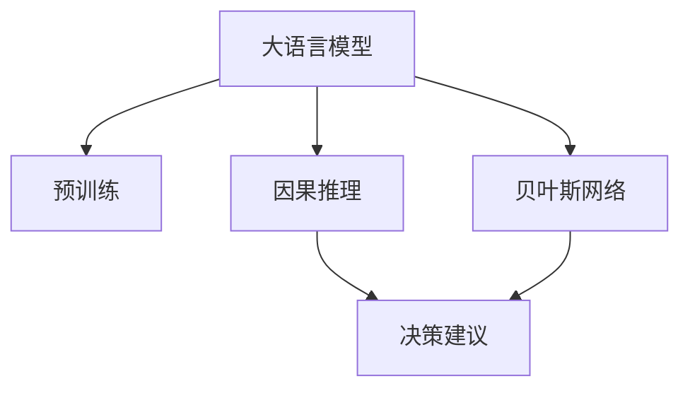

                 

# LLM在智能决策支持中的应用

> 关键词：大语言模型(Large Language Models, LLMs),智能决策支持系统(Decision Support System, DSS),自然语言处理(Natural Language Processing, NLP),因果推理(Causal Inference),贝叶斯网络(Bayesian Network)

## 1. 背景介绍

### 1.1 问题由来

近年来，随着人工智能(AI)技术的发展，自然语言处理(NLP)和机器学习(ML)的应用已经深入到各行各业。在决策支持领域，智能化决策工具通过分析海量数据，提供高效、准确的决策建议，已经成为企业竞争力的重要来源。然而，传统决策支持系统(Decision Support System, DSS)往往依赖专家经验，缺乏数据驱动的逻辑推理，导致决策不够系统、科学。大语言模型(Large Language Models, LLMs)的出现，为决策支持系统带来了新的思路。

大语言模型如GPT、BERT等，通过在海量无标签文本数据上进行预训练，学习到丰富的语言知识和常识，具备强大的自然语言理解与生成能力。将大语言模型应用于决策支持，可以有效弥补传统DSS的缺陷，提供基于数据的决策建议。

### 1.2 问题核心关键点

大语言模型在决策支持中的应用，本质上是一个自然语言处理与因果推理相结合的过程。其核心思想是：通过大语言模型对海量文本数据进行预训练，学习到语言规律和常识，结合因果推理，生成基于数据的决策建议。

具体来说，大语言模型用于：

- **语义分析**：从文本中提取关键信息，理解句子、段落和文档的语义。
- **知识推理**：基于已知数据和逻辑规则，推理出未知信息，预测事件的发生概率。
- **因果关系**：通过因果推理，识别出影响决策的关键因素，并评估其影响程度。
- **假设验证**：生成假设，通过数据验证假设的正确性，进一步指导决策。

### 1.3 问题研究意义

将大语言模型应用于智能决策支持系统，具有以下显著意义：

1. **数据驱动决策**：大语言模型能够处理大量文本数据，从中提取结构化信息，使决策更加数据驱动，减少对人力的依赖。
2. **快速响应变化**：基于大语言模型的系统能够快速适应数据和市场变化，提供实时决策建议。
3. **提高决策质量**：大语言模型结合因果推理，能够分析因果关系，提供更科学、合理的决策依据。
4. **降低决策风险**：系统能够量化决策影响，评估决策风险，辅助企业规避决策风险。
5. **促进知识共享**：通过大语言模型的知识融合，企业内部知识得以共享和传承。

## 2. 核心概念与联系

### 2.1 核心概念概述

为了更好地理解大语言模型在智能决策支持中的应用，本节将介绍几个关键概念：

- **大语言模型(Large Language Models, LLMs)**：基于自回归(如GPT)或自编码(如BERT)模型的预训练语言模型。通过在海量无标签文本数据上进行预训练，学习到丰富的语言知识和常识，具备强大的自然语言理解与生成能力。

- **因果推理(Causal Inference)**：一种基于因果关系进行数据推理和预测的方法。通过分析影响决策的关键因素及其因果关系，帮助系统理解决策逻辑，提高决策的科学性。

- **贝叶斯网络(Bayesian Network)**：一种用于表示变量之间因果关系的概率图模型。通过构建贝叶斯网络，系统可以模拟变量之间的依赖关系，进行因果推理和预测。

这些核心概念之间的逻辑关系可以通过以下Mermaid流程图来展示：



这个流程图展示了大语言模型在智能决策支持系统中的应用：

1. 大语言模型通过预训练获得基础能力。
2. 通过因果推理和贝叶斯网络，系统生成基于数据的决策建议。
3. 将因果推理和贝叶斯网络结合，提高决策的科学性和准确性。

## 3. 核心算法原理 & 具体操作步骤
### 3.1 算法原理概述

大语言模型在智能决策支持中的应用，主要基于以下几个步骤：

1. **预训练**：在无标签文本数据上，通过自监督学习任务，训练大语言模型，学习到语言知识和常识。
2. **语义分析**：将输入文本转化为结构化信息，提取关键实体和关系。
3. **知识推理**：结合因果推理，预测未知事件的发生概率，分析决策的影响因素。
4. **决策建议**：生成基于数据的决策建议，并量化决策风险。

### 3.2 算法步骤详解

具体来说，大语言模型在智能决策支持中的应用步骤如下：

**Step 1: 准备数据集**

- **数据收集**：从公开数据集或企业内部数据中收集决策相关的文本数据，包括历史决策记录、市场分析报告、财务报表等。
- **数据清洗**：清洗数据，去除噪声和不相关的内容，确保数据的准确性和完整性。
- **数据划分**：将数据划分为训练集、验证集和测试集，便于模型训练和评估。

**Step 2: 大语言模型预训练**

- **选择模型**：选择合适的大语言模型，如GPT、BERT等。
- **预训练任务**：选择合适的预训练任务，如语言建模、掩码语言模型等。
- **训练模型**：在预训练数据上，使用大规模分布式训练器，训练大语言模型。

**Step 3: 语义分析**

- **文本预处理**：对输入文本进行分词、去除停用词、词性标注等预处理。
- **命名实体识别**：识别文本中的人名、地名、机构名等实体。
- **关系抽取**：从文本中抽取实体之间的关系，如因果关系、时间关系等。

**Step 4: 知识推理**

- **因果关系分析**：使用因果推理方法，识别影响决策的关键因素及其因果关系。
- **贝叶斯网络构建**：构建贝叶斯网络，模拟变量之间的依赖关系。
- **决策树构建**：基于因果推理和贝叶斯网络，构建决策树模型。

**Step 5: 决策建议生成**

- **决策规则生成**：基于因果推理和贝叶斯网络，生成决策规则。
- **决策建议生成**：结合决策规则和已知数据，生成决策建议。
- **决策风险评估**：量化决策风险，辅助决策。

### 3.3 算法优缺点

大语言模型在智能决策支持中的应用具有以下优点：

1. **数据处理能力强**：大语言模型能够处理大规模文本数据，从中提取结构化信息，支持复杂的因果推理。
2. **决策科学性高**：结合因果推理和贝叶斯网络，大语言模型生成的决策建议更加科学、合理。
3. **适应性强**：大语言模型可以适应不同领域和行业的决策需求，具备较强的泛化能力。

同时，该方法也存在一定的局限性：

1. **模型依赖数据质量**：决策建议的准确性高度依赖于输入数据的质量和完备性。
2. **计算资源消耗大**：大语言模型需要大量的计算资源进行训练和推理。
3. **因果推理复杂**：因果推理方法需要较强的数学和统计知识，应用难度较大。
4. **决策透明性不足**：大语言模型生成的决策建议缺乏透明度，难以解释和审查。

尽管存在这些局限性，但就目前而言，大语言模型在智能决策支持中的应用已经成为一种趋势。未来相关研究的重点在于如何进一步优化模型性能，降低计算资源消耗，提高决策的透明性和可解释性。

### 3.4 算法应用领域

大语言模型在智能决策支持中的应用广泛，适用于各种决策场景，例如：

- **企业战略决策**：基于市场分析报告和财务数据，生成战略决策建议。
- **供应链管理**：通过预测市场需求和供应链变化，优化供应链管理决策。
- **风险管理**：基于风险评估和因果推理，生成风险控制决策。
- **市场预测**：基于历史数据和因果关系，预测市场变化趋势。
- **产品研发**：结合用户反馈和市场数据，生成产品研发决策。

## 4. 数学模型和公式 & 详细讲解 & 举例说明

### 4.1 数学模型构建

在智能决策支持系统中，大语言模型主要用于语义分析和知识推理。以下将使用数学语言对大语言模型在这两个方面的应用进行严格刻画。

**语义分析**

设输入文本为 $x$，大语言模型输出的结构化信息为 $z$，则语义分析的目标是构建映射 $f$：

$$
z = f(x)
$$

其中 $f$ 可以表示为一个神经网络，输入为文本 $x$，输出为结构化信息 $z$。常见的语义分析任务包括命名实体识别、关系抽取等，可通过预训练模型或下游微调获得。

**知识推理**

设影响决策的关键因素为 $X=\{x_1, x_2, ..., x_n\}$，决策结果为 $y$，因果关系为 $R$，则知识推理的目标是构建映射 $g$：

$$
y = g(X, R)
$$

其中 $g$ 可以表示为一个因果推理模型，输入为变量 $X$ 和因果关系 $R$，输出为决策结果 $y$。常见的知识推理方法包括因果图、贝叶斯网络等。

### 4.2 公式推导过程

以下我们以因果图为例，推导知识推理的计算公式。

设影响决策的关键因素为 $X=\{x_1, x_2, ..., x_n\}$，决策结果为 $y$，因果关系为 $R$，则因果推理的目标是计算 $y$ 的期望值：

$$
\mathbb{E}[y] = \sum_{x_1, x_2, ..., x_n} p(x_1, x_2, ..., x_n) y
$$

其中 $p(x_1, x_2, ..., x_n)$ 为变量 $X$ 的联合概率分布。根据因果图，可以将其拆分为两部分：

$$
\mathbb{E}[y] = \sum_{x_1, x_2, ..., x_n} p(x_1|x_2, ..., x_n) p(x_2|x_1, ..., x_n) y
$$

由于因果关系 $R$ 的存在，变量 $X$ 的联合概率分布 $p(x_1, x_2, ..., x_n)$ 可以通过变量 $x_1, x_2, ..., x_n$ 的因果关系进行推导。具体来说，假设因果图已知，则有：

$$
p(x_1, x_2, ..., x_n) = \prod_{i=1}^n p(x_i|x_1, ..., x_{i-1}, x_{i+1}, ..., x_n)
$$

将上述公式代入 $\mathbb{E}[y]$ 的表达式中，得：

$$
\mathbb{E}[y] = \sum_{x_1, x_2, ..., x_n} p(x_1|x_2, ..., x_n) p(x_2|x_1, ..., x_n) \sum_{x_1, x_2, ..., x_n} p(x_1|x_2, ..., x_n) p(x_2|x_1, ..., x_n) y
$$

化简得：

$$
\mathbb{E}[y] = \sum_{x_1, x_2, ..., x_n} p(x_1|x_2, ..., x_n) p(x_2|x_1, ..., x_n) \mathbb{E}[y|x_1, x_2, ..., x_n]
$$

其中 $\mathbb{E}[y|x_1, x_2, ..., x_n]$ 表示在给定 $X$ 的情况下，$y$ 的期望值。

### 4.3 案例分析与讲解

以下我们以金融风险评估为例，说明大语言模型在智能决策支持中的应用。

假设某银行希望评估一笔贷款申请的风险，决策结果为 $y=\{default, no\_default\}$，关键因素为 $X=\{income, age, credit\_score\}$。根据历史数据，构建因果图如下：


其中，$A$ 表示年龄，$B$ 表示信用评分，$C$ 表示收入，$D$ 表示贷款是否违约。

根据因果图，可以推导出 $y$ 的期望值为：

$$
\mathbb{E}[y] = p(income|age, credit\_score) p(age|credit\_score) p(credit\_score) \mathbb{E}[default|income, age, credit\_score]
$$

其中 $p(income|age, credit\_score)$ 表示在给定年龄和信用评分的情况下，收入的概率分布。$p(age|credit\_score)$ 表示在给定信用评分的情况下，年龄的概率分布。$p(credit\_score)$ 表示信用评分的概率分布。$\mathbb{E}[default|income, age, credit\_score]$ 表示在给定收入、年龄和信用评分的情况下，贷款违约的期望值。

根据上述公式，可以计算出贷款申请的风险评估结果。具体来说，假设输入的年龄为 $a$，信用评分为 $cs$，收入为 $i$，则决策建议为：

1. 计算 $p(income|age, credit\_score)$，$p(age|credit\_score)$，$p(credit\_score)$，$\mathbb{E}[default|income, age, credit\_score]$。
2. 根据因果图，计算 $\mathbb{E}[y]$。
3. 根据 $\mathbb{E}[y]$ 的值，给出贷款申请的风险评估建议。

## 5. 项目实践：代码实例和详细解释说明

### 5.1 开发环境搭建

在进行智能决策支持系统开发前，我们需要准备好开发环境。以下是使用Python进行PyTorch开发的环境配置流程：

1. 安装Anaconda：从官网下载并安装Anaconda，用于创建独立的Python环境。

2. 创建并激活虚拟环境：
```bash
conda create -n pytorch-env python=3.8 
conda activate pytorch-env
```

3. 安装PyTorch：根据CUDA版本，从官网获取对应的安装命令。例如：
```bash
conda install pytorch torchvision torchaudio cudatoolkit=11.1 -c pytorch -c conda-forge
```

4. 安装Transformers库：
```bash
pip install transformers
```

5. 安装各类工具包：
```bash
pip install numpy pandas scikit-learn matplotlib tqdm jupyter notebook ipython
```

完成上述步骤后，即可在`pytorch-env`环境中开始智能决策支持系统开发。

### 5.2 源代码详细实现

这里我们以金融风险评估为例，给出使用Transformers库对BERT模型进行微调的PyTorch代码实现。

首先，定义金融风险评估的数据处理函数：

```python
from transformers import BertTokenizer
from torch.utils.data import Dataset
import torch

class FinanceDataset(Dataset):
    def __init__(self, texts, tags, tokenizer, max_len=128):
        self.texts = texts
        self.tags = tags
        self.tokenizer = tokenizer
        self.max_len = max_len
        
    def __len__(self):
        return len(self.texts)
    
    def __getitem__(self, item):
        text = self.texts[item]
        tags = self.tags[item]
        
        encoding = self.tokenizer(text, return_tensors='pt', max_length=self.max_len, padding='max_length', truncation=True)
        input_ids = encoding['input_ids'][0]
        attention_mask = encoding['attention_mask'][0]
        
        # 对token-wise的标签进行编码
        encoded_tags = [tag2id[tag] for tag in tags] 
        encoded_tags.extend([tag2id['O']] * (self.max_len - len(encoded_tags)))
        labels = torch.tensor(encoded_tags, dtype=torch.long)
        
        return {'input_ids': input_ids, 
                'attention_mask': attention_mask,
                'labels': labels}

# 标签与id的映射
tag2id = {'O': 0, 'default': 1}
id2tag = {v: k for k, v in tag2id.items()}

# 创建dataset
tokenizer = BertTokenizer.from_pretrained('bert-base-cased')

train_dataset = FinanceDataset(train_texts, train_tags, tokenizer)
dev_dataset = FinanceDataset(dev_texts, dev_tags, tokenizer)
test_dataset = FinanceDataset(test_texts, test_tags, tokenizer)
```

然后，定义模型和优化器：

```python
from transformers import BertForTokenClassification, AdamW

model = BertForTokenClassification.from_pretrained('bert-base-cased', num_labels=len(tag2id))

optimizer = AdamW(model.parameters(), lr=2e-5)
```

接着，定义训练和评估函数：

```python
from torch.utils.data import DataLoader
from tqdm import tqdm
from sklearn.metrics import classification_report

device = torch.device('cuda') if torch.cuda.is_available() else torch.device('cpu')
model.to(device)

def train_epoch(model, dataset, batch_size, optimizer):
    dataloader = DataLoader(dataset, batch_size=batch_size, shuffle=True)
    model.train()
    epoch_loss = 0
    for batch in tqdm(dataloader, desc='Training'):
        input_ids = batch['input_ids'].to(device)
        attention_mask = batch['attention_mask'].to(device)
        labels = batch['labels'].to(device)
        model.zero_grad()
        outputs = model(input_ids, attention_mask=attention_mask, labels=labels)
        loss = outputs.loss
        epoch_loss += loss.item()
        loss.backward()
        optimizer.step()
    return epoch_loss / len(dataloader)

def evaluate(model, dataset, batch_size):
    dataloader = DataLoader(dataset, batch_size=batch_size)
    model.eval()
    preds, labels = [], []
    with torch.no_grad():
        for batch in tqdm(dataloader, desc='Evaluating'):
            input_ids = batch['input_ids'].to(device)
            attention_mask = batch['attention_mask'].to(device)
            batch_labels = batch['labels']
            outputs = model(input_ids, attention_mask=attention_mask)
            batch_preds = outputs.logits.argmax(dim=2).to('cpu').tolist()
            batch_labels = batch_labels.to('cpu').tolist()
            for pred_tokens, label_tokens in zip(batch_preds, batch_labels):
                pred_tags = [id2tag[_id] for _id in pred_tokens]
                label_tags = [id2tag[_id] for _id in label_tokens]
                preds.append(pred_tags[:len(label_tags)])
                labels.append(label_tags)
                
    print(classification_report(labels, preds))
```

最后，启动训练流程并在测试集上评估：

```python
epochs = 5
batch_size = 16

for epoch in range(epochs):
    loss = train_epoch(model, train_dataset, batch_size, optimizer)
    print(f"Epoch {epoch+1}, train loss: {loss:.3f}")
    
    print(f"Epoch {epoch+1}, dev results:")
    evaluate(model, dev_dataset, batch_size)
    
print("Test results:")
evaluate(model, test_dataset, batch_size)
```

以上就是使用PyTorch对BERT进行金融风险评估任务微调的完整代码实现。可以看到，得益于Transformers库的强大封装，我们可以用相对简洁的代码完成BERT模型的加载和微调。

### 5.3 代码解读与分析

让我们再详细解读一下关键代码的实现细节：

**FinanceDataset类**：
- `__init__`方法：初始化文本、标签、分词器等关键组件。
- `__len__`方法：返回数据集的样本数量。
- `__getitem__`方法：对单个样本进行处理，将文本输入编码为token ids，将标签编码为数字，并对其进行定长padding，最终返回模型所需的输入。

**tag2id和id2tag字典**：
- 定义了标签与数字id之间的映射关系，用于将token-wise的预测结果解码回真实的标签。

**训练和评估函数**：
- 使用PyTorch的DataLoader对数据集进行批次化加载，供模型训练和推理使用。
- 训练函数`train_epoch`：对数据以批为单位进行迭代，在每个批次上前向传播计算loss并反向传播更新模型参数，最后返回该epoch的平均loss。
- 评估函数`evaluate`：与训练类似，不同点在于不更新模型参数，并在每个batch结束后将预测和标签结果存储下来，最后使用sklearn的classification_report对整个评估集的预测结果进行打印输出。

**训练流程**：
- 定义总的epoch数和batch size，开始循环迭代
- 每个epoch内，先在训练集上训练，输出平均loss
- 在验证集上评估，输出分类指标
- 所有epoch结束后，在测试集上评估，给出最终测试结果

可以看到，PyTorch配合Transformers库使得BERT微调的代码实现变得简洁高效。开发者可以将更多精力放在数据处理、模型改进等高层逻辑上，而不必过多关注底层的实现细节。

当然，工业级的系统实现还需考虑更多因素，如模型的保存和部署、超参数的自动搜索、更灵活的任务适配层等。但核心的微调范式基本与此类似。

## 6. 实际应用场景
### 6.1 智能客服系统

基于大语言模型微调的对话技术，可以广泛应用于智能客服系统的构建。传统客服往往需要配备大量人力，高峰期响应缓慢，且一致性和专业性难以保证。而使用微调后的对话模型，可以7x24小时不间断服务，快速响应客户咨询，用自然流畅的语言解答各类常见问题。

在技术实现上，可以收集企业内部的历史客服对话记录，将问题和最佳答复构建成监督数据，在此基础上对预训练对话模型进行微调。微调后的对话模型能够自动理解用户意图，匹配最合适的答案模板进行回复。对于客户提出的新问题，还可以接入检索系统实时搜索相关内容，动态组织生成回答。如此构建的智能客服系统，能大幅提升客户咨询体验和问题解决效率。

### 6.2 金融舆情监测

金融机构需要实时监测市场舆论动向，以便及时应对负面信息传播，规避金融风险。传统的人工监测方式成本高、效率低，难以应对网络时代海量信息爆发的挑战。基于大语言模型微调的文本分类和情感分析技术，为金融舆情监测提供了新的解决方案。

具体而言，可以收集金融领域相关的新闻、报道、评论等文本数据，并对其进行主题标注和情感标注。在此基础上对预训练语言模型进行微调，使其能够自动判断文本属于何种主题，情感倾向是正面、中性还是负面。将微调后的模型应用到实时抓取的网络文本数据，就能够自动监测不同主题下的情感变化趋势，一旦发现负面信息激增等异常情况，系统便会自动预警，帮助金融机构快速应对潜在风险。

### 6.3 个性化推荐系统

当前的推荐系统往往只依赖用户的历史行为数据进行物品推荐，无法深入理解用户的真实兴趣偏好。基于大语言模型微调技术，个性化推荐系统可以更好地挖掘用户行为背后的语义信息，从而提供更精准、多样的推荐内容。

在实践中，可以收集用户浏览、点击、评论、分享等行为数据，提取和用户交互的物品标题、描述、标签等文本内容。将文本内容作为模型输入，用户的后续行为（如是否点击、购买等）作为监督信号，在此基础上微调预训练语言模型。微调后的模型能够从文本内容中准确把握用户的兴趣点。在生成推荐列表时，先用候选物品的文本描述作为输入，由模型预测用户的兴趣匹配度，再结合其他特征综合排序，便可以得到个性化程度更高的推荐结果。

### 6.4 未来应用展望

随着大语言模型和微调方法的不断发展，基于微调范式将在更多领域得到应用，为传统行业带来变革性影响。

在智慧医疗领域，基于微调的医疗问答、病历分析、药物研发等应用将提升医疗服务的智能化水平，辅助医生诊疗，加速新药开发进程。

在智能教育领域，微调技术可应用于作业批改、学情分析、知识推荐等方面，因材施教，促进教育公平，提高教学质量。

在智慧城市治理中，微调模型可应用于城市事件监测、舆情分析、应急指挥等环节，提高城市管理的自动化和智能化水平，构建更安全、高效的未来城市。

此外，在企业生产、社会治理、文娱传媒等众多领域，基于大模型微调的人工智能应用也将不断涌现，为经济社会发展注入新的动力。相信随着技术的日益成熟，微调方法将成为人工智能落地应用的重要范式，推动人工智能技术在垂直行业的规模化落地。总之，大语言模型微调技术需要不断迭代优化，才能真正实现其在智能决策支持中的价值，助力各行各业实现数字化转型。

## 7. 工具和资源推荐
### 7.1 学习资源推荐

为了帮助开发者系统掌握大语言模型微调的理论基础和实践技巧，这里推荐一些优质的学习资源：

1. 《Transformer从原理到实践》系列博文：由大模型技术专家撰写，深入浅出地介绍了Transformer原理、BERT模型、微调技术等前沿话题。

2. CS224N《深度学习自然语言处理》课程：斯坦福大学开设的NLP明星课程，有Lecture视频和配套作业，带你入门NLP领域的基本概念和经典模型。

3. 《Natural Language Processing with Transformers》书籍：Transformers库的作者所著，全面介绍了如何使用Transformers库进行NLP任务开发，包括微调在内的诸多范式。

4. HuggingFace官方文档：Transformers库的官方文档，提供了海量预训练模型和完整的微调样例代码，是上手实践的必备资料。

5. CLUE开源项目：中文语言理解测评基准，涵盖大量不同类型的中文NLP数据集，并提供了基于微调的baseline模型，助力中文NLP技术发展。

通过对这些资源的学习实践，相信你一定能够快速掌握大语言模型微调的精髓，并用于解决实际的NLP问题。
###  7.2 开发工具推荐

高效的开发离不开优秀的工具支持。以下是几款用于大语言模型微调开发的常用工具：

1. PyTorch：基于Python的开源深度学习框架，灵活动态的计算图，适合快速迭代研究。大部分预训练语言模型都有PyTorch版本的实现。

2. TensorFlow：由Google主导开发的开源深度学习框架，生产部署方便，适合大规模工程应用。同样有丰富的预训练语言模型资源。

3. Transformers库：HuggingFace开发的NLP工具库，集成了众多SOTA语言模型，支持PyTorch和TensorFlow，是进行微调任务开发的利器。

4. Weights & Biases：模型训练的实验跟踪工具，可以记录和可视化模型训练过程中的各项指标，方便对比和调优。与主流深度学习框架无缝集成。

5. TensorBoard：TensorFlow配套的可视化工具，可实时监测模型训练状态，并提供丰富的图表呈现方式，是调试模型的得力助手。

6. Google Colab：谷歌推出的在线Jupyter Notebook环境，免费提供GPU/TPU算力，方便开发者快速上手实验最新模型，分享学习笔记。

合理利用这些工具，可以显著提升大语言模型微调任务的开发效率，加快创新迭代的步伐。

### 7.3 相关论文推荐

大语言模型和微调技术的发展源于学界的持续研究。以下是几篇奠基性的相关论文，推荐阅读：

1. Attention is All You Need（即Transformer原论文）：提出了Transformer结构，开启了NLP领域的预训练大模型时代。

2. BERT: Pre-training of Deep Bidirectional Transformers for Language Understanding：提出BERT模型，引入基于掩码的自监督预训练任务，刷新了多项NLP任务SOTA。

3. Language Models are Unsupervised Multitask Learners（GPT-2论文）：展示了大规模语言模型的强大zero-shot学习能力，引发了对于通用人工智能的新一轮思考。

4. Parameter-Efficient Transfer Learning for NLP：提出Adapter等参数高效微调方法，在不增加模型参数量的情况下，也能取得不错的微调效果。

5. Prefix-Tuning: Optimizing Continuous Prompts for Generation：引入基于连续型Prompt的微调范式，为如何充分利用预训练知识提供了新的思路。

6. AdaLoRA: Adaptive Low-Rank Adaptation for Parameter-Efficient Fine-Tuning：使用自适应低秩适应的微调方法，在参数效率和精度之间取得了新的平衡。

这些论文代表了大语言模型微调技术的发展脉络。通过学习这些前沿成果，可以帮助研究者把握学科前进方向，激发更多的创新灵感。

## 8. 总结：未来发展趋势与挑战

### 8.1 总结

本文对大语言模型在智能决策支持中的应用进行了全面系统的介绍。首先阐述了大语言模型和微调技术的研究背景和意义，明确了微调在拓展预训练模型应用、提升决策建议科学性方面的独特价值。其次，从原理到实践，详细讲解了微调的数学原理和关键步骤，给出了智能决策支持系统开发的完整代码实例。同时，本文还广泛探讨了微调方法在智能客服、金融舆情、个性化推荐等多个行业领域的应用前景，展示了微调范式的巨大潜力。此外，本文精选了微调技术的各类学习资源，力求为读者提供全方位的技术指引。

通过本文的系统梳理，可以看到，大语言模型在智能决策支持中的应用已经成为一种趋势，为决策支持系统带来了新的思路和方法。受益于大规模语料的预训练和因果推理的应用，微调方法能够更好地处理复杂的因果关系，提供基于数据的决策建议。未来，伴随大语言模型和微调方法的持续演进，智能决策支持系统必将迎来更广阔的应用场景，为各行各业带来变革性影响。

### 8.2 未来发展趋势

展望未来，大语言模型在智能决策支持中的应用将呈现以下几个发展趋势：

1. **智能决策**：基于因果推理和贝叶斯网络，大语言模型生成的决策建议将更加科学、合理。系统将能够处理更加复杂的因果关系，提供更准确的决策支持。

2. **自适应学习**：结合在线学习技术，系统能够不断从新数据中学习，及时更新决策建议，提高决策的时效性和适应性。

3. **跨领域应用**：大语言模型将更加适用于不同领域和行业的决策支持，具备更强的泛化能力。系统将能够灵活应对各种决策需求，提供更全面的决策服务。

4. **知识图谱整合**：结合知识图谱技术，大语言模型能够更好地整合外部知识库，提供更全面、准确的决策支持。系统将能够通过知识推理，提供更加全面、深入的决策建议。

5. **多模态决策**：结合多模态数据，如文本、图像、视频等，大语言模型能够更好地理解决策背景，提供更精准的决策建议。系统将能够处理更加复杂的信息，提供更全面、深入的决策支持。

6. **低资源部署**：结合参数高效微调技术，系统能够在资源受限的环境下快速部署，提供实时决策支持。

以上趋势凸显了大语言模型在智能决策支持系统中的应用前景。这些方向的探索发展，必将进一步提升系统的性能和应用范围，为各行各业带来变革性影响。

### 8.3 面临的挑战

尽管大语言模型在智能决策支持中的应用取得了一定进展，但在迈向更加智能化、普适化应用的过程中，仍面临诸多挑战：

1. **数据质量依赖**：决策建议的准确性高度依赖于输入数据的质量和完备性。如何获取高质量、全面覆盖的数据，是大规模应用中的一个重要挑战。

2. **因果推理复杂**：因果推理方法需要较强的数学和统计知识，应用难度较大。如何在实际应用中高效、准确地进行因果推理，还需进一步研究。

3. **系统透明性不足**：大语言模型生成的决策建议缺乏透明度，难以解释和审查。如何提高决策过程的透明性和可解释性，是系统应用中亟待解决的问题。

4. **资源消耗大**：大语言模型需要大量的计算资源进行训练和推理。如何在资源受限的环境下实现高效的决策支持，还需进一步优化。

5. **知识整合难**：大语言模型需要整合外部知识库，如知识图谱、规则库等，才能提供更全面的决策建议。如何在实际应用中高效、准确地进行知识整合，还需进一步研究。

6. **决策安全性问题**：决策建议可能包含错误或不合理的结论，影响决策的科学性和可靠性。如何提高决策系统的安全性，避免错误决策，还需进一步研究。

尽管存在这些挑战，但未来通过持续的技术创新和实践探索，相信大语言模型在智能决策支持中的应用将不断突破，推动决策系统的智能化、普适化和可解释性发展。

### 8.4 研究展望

面对大语言模型在智能决策支持应用中面临的挑战，未来的研究需要在以下几个方面寻求新的突破：

1. **提升数据质量**：通过数据收集、清洗和标注等手段，获取高质量、全面覆盖的数据，确保决策建议的准确性和可靠性。

2. **优化因果推理**：结合因果图、贝叶斯网络等技术，高效、准确地进行因果推理，提供科学、合理的决策建议。

3. **提高系统透明性**：通过可解释性技术和透明性模型，提高决策过程的透明性和可解释性，便于审查和调试。

4. **降低资源消耗**：结合参数高效微调技术，在资源受限的环境下实现高效的决策支持。同时优化模型结构，提升推理速度，降低资源占用。

5. **增强知识整合能力**：结合知识图谱、规则库等外部知识，进行高效、准确的知识整合，提供更全面、深入的决策建议。

6. **增强系统安全性**：结合安全技术，提高决策系统的安全性，避免错误决策。同时通过人工干预和审核，确保决策的科学性和可靠性。

这些研究方向的探索，必将引领大语言模型在智能决策支持系统中的应用走向更高的台阶，为构建安全、可靠、可解释、可控的智能系统铺平道路。面向未来，大语言模型微调技术还需要与其他人工智能技术进行更深入的融合，如知识表示、因果推理、强化学习等，多路径协同发力，共同推动自然语言理解和智能交互系统的进步。只有勇于创新、敢于突破，才能不断拓展语言模型的边界，让智能技术更好地造福人类社会。

## 9. 附录：常见问题与解答

**Q1：大语言模型微调是否适用于所有NLP任务？**

A: 大语言模型微调在大多数NLP任务上都能取得不错的效果，特别是对于数据量较小的任务。但对于一些特定领域的任务，如医学、法律等，仅仅依靠通用语料预训练的模型可能难以很好地适应。此时需要在特定领域语料上进一步预训练，再进行微调，才能获得理想效果。此外，对于一些需要时效性、个性化很强的任务，如对话、推荐等，微调方法也需要针对性的改进优化。

**Q2：微调过程中如何选择合适的学习率？**

A: 微调的学习率一般要比预训练时小1-2个数量级，如果使用过大的学习率，容易破坏预训练权重，导致过拟合。一般建议从1e-5开始调参，逐步减小学习率，直至收敛。也可以使用warmup策略，在开始阶段使用较小的学习率，再逐渐过渡到预设值。需要注意的是，不同的优化器(如AdamW、Adafactor等)以及不同的学习率调度策略，可能需要设置不同的学习率阈值。

**Q3：采用大语言模型微调时会面临哪些资源瓶颈？**

A: 目前主流的预训练大模型动辄以亿计的参数规模，对算力、内存、存储都提出了很高的要求。GPU/TPU等高性能设备是必不可少的，但即便如此，超大批次的训练和推理也可能遇到显存不足的问题。因此需要采用一些资源优化技术，如梯度积累、混合精度训练、模型并行等，来突破硬件瓶颈。同时，模型的存储和读取也可能占用大量时间和空间，需要采用模型压缩、稀疏化存储等方法进行优化。

**Q4：如何缓解微调过程中的过拟合问题？**

A: 过拟合是微调面临的主要挑战，尤其是在标注数据不足的情况下。常见的缓解策略包括：
1. 数据增强：通过回译、近义替换等方式扩充训练集
2. 正则化：使用L2正则、Dropout、Early Stopping等避免过拟合
3. 对抗训练：引入对抗样本，提高模型鲁棒性
4. 参数高效微调：只调整少量参数(如Adapter、Prefix等)，减小过拟合风险
5. 多模型集成：训练多个微调模型，取平均输出，抑制过拟合

这些策略往往需要根据具体任务和数据特点进行灵活组合。只有在数据、模型、训练、推理等各环节进行全面优化，才能最大限度地发挥大语言模型微调的威力。

**Q5：微调模型在落地部署时需要注意哪些问题？**

A: 将微调模型转化为实际应用，还需要考虑以下因素：
1. 模型裁剪：去除不必要的层和参数，减小模型尺寸，加快推理速度
2. 量化加速：将浮点模型转为定点模型，压缩存储空间，提高计算效率
3. 服务化封装：将模型封装为标准化服务接口，便于集成调用
4. 弹性伸缩：根据请求流量动态调整资源配置，平衡服务质量和成本
5. 监控告警：实时采集系统指标，设置异常告警阈值，确保服务稳定性
6. 安全防护：采用访问鉴权、数据脱敏等措施，保障数据和模型安全

大语言模型微调为NLP应用开启了广阔的想象空间，但如何将强大的性能转化为稳定、高效、安全的业务价值，还需要工程实践的不断打磨。唯有从数据、算法、工程、业务等多个维度协同发力，才能真正实现人工智能技术在垂直行业的规模化落地。总之，微调需要开发者根据具体任务，不断迭代和优化模型、数据和算法，方能得到理想的效果。

---

作者：禅与计算机程序设计艺术 / Zen and the Art of Computer Programming

