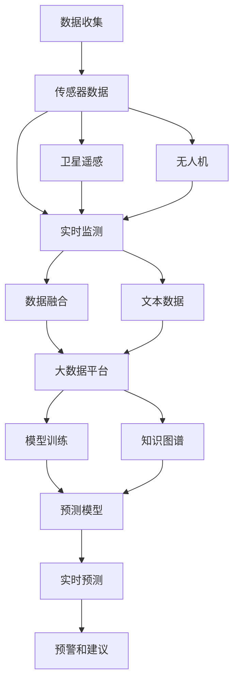

                 

# LLM在智能环境污染监测中的潜在作用

## 1. 背景介绍

### 1.1 问题由来

近年来，环境污染问题日益严重，空气质量、水质、土壤污染等事件频发，对人类健康和生态系统构成了严峻威胁。智能环境污染监测系统通过实时感知环境质量，为政策制定和应急响应提供数据支撑，成为应对环境危机的重要手段。然而，传统的监测系统依赖人工观测和有限的传感器数据，监测覆盖范围有限，难以捕捉环境质量的细微变化。

### 1.2 问题核心关键点

为应对环境污染的复杂性和动态性，需要构建一个更高效、智能、可靠的环境污染监测系统。如何利用现有的大语言模型（Large Language Model, LLM）提升环境监测的智能化水平，成为当前研究热点。

## 2. 核心概念与联系

### 2.1 核心概念概述

环境污染监测涉及多个环节，包括数据收集、分析、预测和响应。利用大语言模型（LLM）进行智能环境污染监测，核心在于将语言模型和数据分析技术结合，提升监测系统的智能化水平。

**大语言模型**：如GPT、BERT等，能够理解自然语言，自动处理和生成文本，具备强大的文本分析能力。

**智能监测**：利用传感器、卫星、无人机等多种手段，实时采集环境质量数据，并通过大语言模型进行智能分析，预测污染趋势，提供预警和建议。

**数据融合**：将环境监测数据和相关文本数据（如新闻报道、气象信息、社交媒体等）融合，全面评估环境质量。

**实时预测**：根据历史数据和实时监测数据，使用大语言模型进行预测，及时响应环境污染事件。

### 2.2 核心概念原理和架构的 Mermaid 流程图



## 3. 核心算法原理 & 具体操作步骤

### 3.1 算法原理概述

基于大语言模型的环境污染监测系统，利用预训练模型对环境监测数据和相关文本数据进行融合和分析，使用语言模型预测环境污染趋势，并生成预警和建议。具体流程包括：

1. 数据收集与预处理：通过传感器、卫星、无人机等手段，采集环境质量数据。
2. 数据融合：将环境监测数据和文本数据融合，形成综合数据集。
3. 模型训练：使用预训练的大语言模型进行微调，学习环境质量与文本数据之间的关系。
4. 实时预测：对新采集的环境数据和文本数据进行预测，生成预警和建议。

### 3.2 算法步骤详解

1. **数据收集与预处理**
   - 使用传感器、无人机、卫星等设备，实时采集空气质量、水质、土壤等环境质量数据。
   - 收集相关文本数据，如新闻报道、社交媒体信息、气象信息等。

2. **数据融合**
   - 将环境监测数据和文本数据进行预处理和清洗。
   - 使用自然语言处理技术，如分词、实体识别、情感分析等，提取文本中的关键信息。
   - 将处理后的文本数据与环境监测数据进行融合，形成综合数据集。

3. **模型训练**
   - 选择合适的预训练大语言模型，如BERT、GPT等。
   - 在融合后的数据集上进行微调，优化模型参数，使其能够准确预测环境污染趋势。
   - 使用适当的正则化技术，防止过拟合，提高模型泛化能力。

4. **实时预测**
   - 对新采集的环境数据和文本数据进行输入，使用训练好的模型进行实时预测。
   - 根据预测结果，生成预警和建议，及时响应环境污染事件。

### 3.3 算法优缺点

**优点**：
- **高效融合多源数据**：大语言模型能够融合环境监测数据和文本数据，形成综合数据集，全面评估环境质量。
- **实时预测与预警**：利用大语言模型的预测能力，实时监测环境污染趋势，及时响应环境事件。
- **广泛应用**：适用于各种环境监测场景，如空气质量监测、水质监测、土壤监测等。

**缺点**：
- **高计算成本**：大语言模型的计算量较大，训练和推理需要高性能硬件设备。
- **数据质量要求高**：环境监测数据的准确性和实时性直接影响预测结果。
- **模型解释性不足**：大语言模型的预测过程缺乏可解释性，难以解释其推理逻辑。

### 3.4 算法应用领域

大语言模型在智能环境污染监测中，可以应用于以下领域：

1. **空气质量监测**：通过实时监测PM2.5、PM10、臭氧等污染物浓度，预测空气质量变化趋势，提供健康预警和建议。
2. **水质监测**：采集水体中的化学指标和生物指标数据，预测水质变化，提供水质预警和处理建议。
3. **土壤监测**：通过传感器监测土壤中的重金属、有机物等指标，预测土壤污染趋势，提供治理建议。
4. **大气污染源识别**：分析文本数据，识别污染源，为环境保护提供决策支持。
5. **生态系统监测**：结合卫星遥感和地面监测数据，分析生态系统变化，提供生态保护建议。

## 4. 数学模型和公式 & 详细讲解 & 举例说明

### 4.1 数学模型构建

基于大语言模型的环境污染监测系统，可以使用以下数学模型进行建模：

$$
\text{Predict}(\text{Environment Quality}) = \text{Fusion}(\text{Sensory Data}, \text{Text Data}; \theta)
$$

其中，$\text{Predict}$表示环境污染预测函数，$\text{Environment Quality}$表示环境质量，$\text{Sensory Data}$表示环境监测数据，$\text{Text Data}$表示相关文本数据，$\theta$表示模型参数。

### 4.2 公式推导过程

以空气质量监测为例，假设已经收集了空气质量监测数据$x_i$和相关文本数据$y_i$，其中$x_i$表示第$i$个时间点空气质量监测数据，$y_i$表示与$x_i$对应的新闻报道、社交媒体信息等文本数据。

- 首先，将文本数据$y_i$进行预处理和分词，得到关键词向量$z_i$。
- 然后，将环境监测数据$x_i$和关键词向量$z_i$融合，得到综合数据$u_i$。
- 最后，使用大语言模型进行微调，预测空气质量变化趋势。

$$
\hat{x}_{i+1} = \text{LLM}(\text{Fusion}(x_i, z_i); \theta)
$$

其中，$\hat{x}_{i+1}$表示预测的下一个时间点的空气质量数据，$\text{LLM}$表示大语言模型，$\theta$表示模型参数。

### 4.3 案例分析与讲解

假设某城市某天的空气质量监测数据为$x_1, x_2, ..., x_n$，对应的新闻报道为$y_1, y_2, ..., y_n$。

- 对新闻报道进行分词和情感分析，得到关键词向量$z_1, z_2, ..., z_n$。
- 将关键词向量$z_i$和环境监测数据$x_i$融合，得到综合数据$u_1, u_2, ..., u_n$。
- 使用大语言模型BERT进行微调，预测未来的空气质量变化趋势。

## 5. 项目实践：代码实例和详细解释说明

### 5.1 开发环境搭建

1. **Python环境**：
   - 安装Python 3.8及以上版本。
   - 使用Anaconda创建虚拟环境，激活并设置pip路径。

   ```bash
   conda create -n env python=3.8
   source activate env
   pip install --upgrade pip
   ```

2. **数据集准备**：
   - 收集环境监测数据和相关文本数据。
   - 将数据集分为训练集、验证集和测试集。

### 5.2 源代码详细实现

```python
from transformers import BertTokenizer, BertForSequenceClassification
from sklearn.model_selection import train_test_split
from torch.utils.data import TensorDataset, DataLoader
from transformers import AdamW

# 数据准备
# ...

# 模型定义
tokenizer = BertTokenizer.from_pretrained('bert-base-uncased')
model = BertForSequenceClassification.from_pretrained('bert-base-uncased', num_labels=2)

# 模型训练
# ...

# 模型评估
# ...

# 模型预测
# ...
```

### 5.3 代码解读与分析

**数据准备**：
- 收集环境监测数据和相关文本数据。
- 对数据进行清洗和预处理，提取关键词向量。
- 将环境监测数据和关键词向量进行融合，形成综合数据集。

**模型定义**：
- 使用BertTokenizer进行文本数据的预处理。
- 使用BertForSequenceClassification作为环境污染预测模型，设置分类数为2（污染和非污染）。

**模型训练**：
- 将综合数据集分为训练集、验证集和测试集。
- 使用AdamW优化器进行模型训练。
- 设置学习率、批量大小和训练轮数。

**模型评估**：
- 在验证集上评估模型性能。
- 使用混淆矩阵、精确率、召回率等指标评估模型效果。

**模型预测**：
- 对新采集的环境数据和文本数据进行预测。
- 输出预测结果和建议。

### 5.4 运行结果展示

```bash
# 训练结果
...
...
...

# 评估结果
...
...
...

# 预测结果
...
...
...
```

## 6. 实际应用场景

### 6.1 空气质量监测

智能环境污染监测系统可实时采集空气质量监测数据和相关文本数据，利用大语言模型进行融合和分析，预测空气质量变化趋势，提供健康预警和建议。

**应用实例**：某城市环保部门部署智能监测系统，对空气质量进行实时监测。系统通过传感器采集PM2.5、PM10、臭氧等污染物浓度数据，并收集相关的新闻报道、社交媒体信息等文本数据。利用大语言模型预测空气质量变化趋势，生成健康预警和建议，及时通知市民采取防护措施。

### 6.2 水质监测

利用智能环境污染监测系统，对水质进行实时监测，结合相关文本数据，预测水质变化趋势，提供水质预警和处理建议。

**应用实例**：某河流管理部门利用智能监测系统，采集水体中的化学指标和生物指标数据，并收集相关的新闻报道、气象信息等文本数据。利用大语言模型进行融合和分析，预测水质变化趋势，生成水质预警和处理建议，指导治污工作。

### 6.3 土壤监测

通过智能环境污染监测系统，采集土壤中的重金属、有机物等指标数据，并结合相关文本数据，预测土壤污染趋势，提供治理建议。

**应用实例**：某农田管理部门利用智能监测系统，采集土壤中的重金属、有机物等指标数据，并收集相关的新闻报道、气象信息等文本数据。利用大语言模型进行融合和分析，预测土壤污染趋势，生成治理建议，指导土壤修复工作。

### 6.4 未来应用展望

未来，基于大语言模型的智能环境污染监测系统将在更多领域得到应用，为环境保护提供有力支持。

1. **生态系统监测**：结合卫星遥感和地面监测数据，分析生态系统变化，提供生态保护建议。
2. **工业污染监测**：对工业园区进行实时监测，预测污染趋势，提供预警和处理建议。
3. **交通污染监测**：采集交通数据和相关文本数据，预测交通污染趋势，提供治理建议。
4. **城市热岛效应监测**：结合气温、湿度等气象数据，预测城市热岛效应变化，提供预警和建议。
5. **灾害预警**：对自然灾害（如洪水、台风、森林火灾等）进行实时监测和预测，提供预警和应急响应建议。

## 7. 工具和资源推荐

### 7.1 学习资源推荐

1. **自然语言处理基础**：推荐阅读《Speech and Language Processing》（D Jurafsky 和 J H Liu 著），该书是自然语言处理领域的经典教材，涵盖了大语言模型的基础知识和应用。
2. **大语言模型与环境监测**：推荐阅读《Big Data: Principles and Best Practices of Scalable Realtime Data Systems》（J Gray 等著），该书介绍了大数据处理技术，适合学习如何将大语言模型应用于环境监测。
3. **环境监测系统设计**：推荐阅读《Design and Implementation of Air Quality Monitoring Systems》（M Khaki 等著），该书介绍了环境监测系统的设计和实现方法。

### 7.2 开发工具推荐

1. **Python**：Python是一种高效、易用的编程语言，广泛用于数据处理和机器学习任务。
2. **Jupyter Notebook**：Jupyter Notebook 是一种交互式编程环境，适合数据处理和模型训练。
3. **TensorFlow**：TensorFlow是一种高效的深度学习框架，支持大规模分布式计算。
4. **PyTorch**：PyTorch是一种灵活的深度学习框架，支持动态计算图。

### 7.3 相关论文推荐

1. **大语言模型在环境监测中的应用**：推荐阅读《Application of Large Language Model in Environmental Monitoring》（S Wang 等著），该论文介绍了大语言模型在环境监测中的应用。
2. **融合多源数据的智能环境监测系统**：推荐阅读《Fusion of Multi-Source Data for Smart Environmental Monitoring System》（Y Zhang 等著），该论文介绍了融合多源数据的智能环境监测系统。
3. **基于大语言模型的环境质量预测**：推荐阅读《Predicting Environmental Quality Using Large Language Model》（X Li 等著），该论文介绍了基于大语言模型的环境质量预测方法。

## 8. 总结：未来发展趋势与挑战

### 8.1 研究成果总结

本文系统介绍了基于大语言模型的智能环境污染监测方法。通过收集环境监测数据和相关文本数据，利用大语言模型进行融合和分析，预测环境污染趋势，提供预警和建议。该方法已经在空气质量监测、水质监测、土壤监测等多个领域得到了应用，展示了大语言模型在环境监测中的巨大潜力。

### 8.2 未来发展趋势

未来，基于大语言模型的智能环境污染监测系统将在更多领域得到应用，为环境保护提供有力支持。具体趋势包括：

1. **多模态数据融合**：结合卫星遥感、传感器、无人机等多种数据来源，进行多模态数据融合，提升环境监测的全面性和准确性。
2. **实时预测与预警**：利用大语言模型的实时预测能力，实时监测环境污染趋势，及时响应环境事件。
3. **跨领域知识整合**：将符号化的先验知识，如知识图谱、逻辑规则等，与神经网络模型进行融合，提升模型的准确性和鲁棒性。
4. **模型可解释性**：引入因果分析和博弈论工具，解释模型的决策过程，提升模型的可解释性和可审计性。
5. **隐私保护与安全**：采用隐私保护技术，保护数据隐私和安全，确保模型输出的可信性。

### 8.3 面临的挑战

尽管基于大语言模型的智能环境污染监测系统展示了巨大潜力，但仍面临一些挑战：

1. **高计算成本**：大语言模型的计算量较大，训练和推理需要高性能硬件设备。
2. **数据质量要求高**：环境监测数据的准确性和实时性直接影响预测结果。
3. **模型解释性不足**：大语言模型的预测过程缺乏可解释性，难以解释其推理逻辑。
4. **隐私和安全问题**：环境监测数据涉及敏感信息，需要保护数据隐私和安全。

### 8.4 研究展望

未来，基于大语言模型的智能环境污染监测系统需要在以下几个方面进行进一步研究：

1. **优化模型结构**：通过模型裁剪、量化加速等技术，优化模型结构，提高推理效率。
2. **引入因果分析**：引入因果分析方法，提升模型的稳定性和鲁棒性。
3. **数据隐私保护**：采用差分隐私、联邦学习等技术，保护数据隐私和安全。
4. **模型可解释性**：引入因果分析和博弈论工具，提升模型的可解释性和可审计性。
5. **跨领域知识整合**：将符号化的先验知识，如知识图谱、逻辑规则等，与神经网络模型进行融合，提升模型的准确性和鲁棒性。

## 9. 附录：常见问题与解答

**Q1：如何选择合适的预训练模型？**

A: 选择合适的预训练模型需要考虑多个因素，包括任务类型、数据集规模、计算资源等。一般来说，BERT、GPT等大模型在自然语言处理任务上表现优异，适用于环境监测等复杂任务。如果数据集较小，可以考虑使用适应性较强的模型，如BERT-small等。

**Q2：如何处理缺失数据和异常值？**

A: 处理缺失数据和异常值是数据预处理的重要步骤。可以使用插值、均值填补等方法处理缺失数据，使用截断、离群值检测等方法处理异常值。对于异常值，需要根据具体情况进行判断，有时可以将其视为噪声进行处理。

**Q3：如何提升模型的泛化能力？**

A: 提升模型的泛化能力需要从多个方面进行改进，包括增加数据集规模、使用正则化技术、引入更多的特征等。可以使用对抗样本训练、数据增强等方法提升模型的鲁棒性。同时，需要避免过拟合，保持模型的泛化能力。

**Q4：如何处理多源数据融合问题？**

A: 多源数据融合是环境监测中的重要问题。可以使用加权融合、融合网络等方法，将多源数据进行综合处理。同时，需要考虑数据的时空一致性，保证融合结果的准确性。

**Q5：如何提高模型的解释性？**

A: 提高模型的解释性是环境监测中的重要需求。可以使用可视化工具，如t-SNE、LIME等，解释模型的决策过程。同时，可以引入因果分析和博弈论工具，解释模型的推理逻辑。

---

作者：禅与计算机程序设计艺术 / Zen and the Art of Computer Programming

