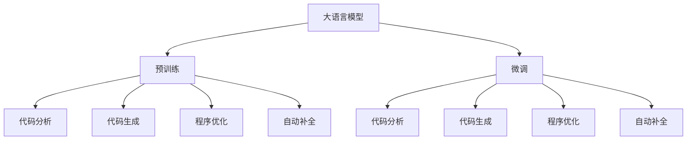

                 

# LLM在智能编译领域的应用前景

> 关键词：大语言模型,LLM,智能编译,代码分析,代码生成,程序优化,自动补全

## 1. 背景介绍

### 1.1 问题由来
随着编程语言的普及和软件开发的复杂性增加，编译器在软件开发和维护过程中发挥着越来越重要的作用。然而，传统的编译器往往依赖于人工经验的积累，缺乏智能化的决策能力。大语言模型（Large Language Models, LLM）的兴起为智能化编译提供了新的契机。

通过预训练在大量文本数据上，LLM可以学习到广泛的自然语言知识，并具备强大的自然语言处理能力。在编译器的上下文中，LLM可以在代码分析、代码生成、程序优化等方面发挥其独特的优势，大幅提升编译的效率和质量。

### 1.2 问题核心关键点
LLM在智能编译领域的应用核心在于其能够进行高级自然语言处理，并将语言知识应用于代码相关的决策过程。具体关键点包括：
1. **代码理解**：理解代码的语义，发现代码中的错误和潜在问题。
2. **代码生成**：自动生成符合特定要求的代码。
3. **程序优化**：自动进行程序代码的优化，提升程序性能。
4. **自动补全**：根据上下文自动提供代码补全建议。

### 1.3 问题研究意义
LLM在智能编译领域的应用将显著提高软件开发的自动化水平和代码质量。具体意义包括：
1. **降低人工成本**：减少对人工经验的需求，降低软件开发和维护的成本。
2. **提升开发效率**：通过智能化的代码生成和自动补全，缩短开发周期。
3. **提高代码质量**：发现和修复代码中的潜在问题，提升代码可维护性和可读性。
4. **增强可扩展性**：灵活应对不同类型的代码和语言，扩展编译器功能。

## 2. 核心概念与联系

### 2.1 核心概念概述

为更好地理解LLM在智能编译中的应用，本节将介绍几个密切相关的核心概念：

- **大语言模型(LLM)**：基于自回归模型（如GPT）或自编码模型（如BERT）的预训练语言模型。通过在海量文本数据上预训练，学习到广泛的自然语言知识，具备强大的自然语言处理能力。

- **预训练**：在大量无标注文本数据上进行自监督学习，学习到通用语言表示。

- **微调(Fine-tuning)**：在预训练模型的基础上，使用特定任务的数据集，通过有监督学习优化模型在该任务上的性能。

- **迁移学习(Transfer Learning)**：将在一个任务上学到的知识迁移到另一个任务上，提高模型的泛化能力。

- **代码分析**：对代码进行语义分析和结构分析，以发现代码中的错误和潜在问题。

- **代码生成**：根据任务要求，自动生成符合规范的代码。

- **程序优化**：对现有代码进行自动化的优化，提升程序的性能和效率。

- **自动补全**：根据上下文提供代码补全建议，加速开发过程。

这些核心概念之间的逻辑关系可以通过以下Mermaid流程图来展示：



这个流程图展示了LLM在智能编译中的关键应用场景，及其与预训练、微调、迁移学习等概念的联系。

## 3. 核心算法原理 & 具体操作步骤
### 3.1 算法原理概述

LLM在智能编译中的应用主要基于自然语言处理和代码分析的技术。其核心思想是：利用LLM的自然语言理解能力，将自然语言指令转换为对代码的操作指令，从而实现代码分析、代码生成、程序优化等任务。

具体地，假设预训练的LLM为 $M_{\theta}$，其中 $\theta$ 为预训练得到的模型参数。对于代码分析、代码生成、程序优化等任务，可以设计相应的任务适配层和损失函数，通过有监督学习优化模型。

### 3.2 算法步骤详解

基于LLM的智能编译方法主要包括以下几个关键步骤：

**Step 1: 准备预训练模型和数据集**
- 选择合适的预训练语言模型 $M_{\theta}$ 作为初始化参数，如 BERT、GPT 等。
- 准备代码分析、代码生成、程序优化等任务的数据集 $D$，划分为训练集、验证集和测试集。

**Step 2: 添加任务适配层**
- 根据具体任务类型，在预训练模型的顶层设计合适的任务适配层和损失函数。例如，对于代码生成任务，可以添加一个解码器，并使用负对数似然损失函数。
- 对于代码分析任务，可以添加一个输出层，并使用交叉熵损失函数。

**Step 3: 设置微调超参数**
- 选择合适的优化算法及其参数，如 AdamW、SGD 等，设置学习率、批大小、迭代轮数等。
- 设置正则化技术及强度，包括权重衰减、Dropout、Early Stopping 等。

**Step 4: 执行梯度训练**
- 将训练集数据分批次输入模型，前向传播计算损失函数。
- 反向传播计算参数梯度，根据设定的优化算法和学习率更新模型参数。
- 周期性在验证集上评估模型性能，根据性能指标决定是否触发 Early Stopping。
- 重复上述步骤直到满足预设的迭代轮数或 Early Stopping 条件。

**Step 5: 测试和部署**
- 在测试集上评估微调后模型 $M_{\hat{\theta}}$ 的性能，对比微调前后的效果提升。
- 使用微调后的模型对新代码进行推理预测，集成到实际的应用系统中。

以上是基于LLM的智能编译方法的一般流程。在实际应用中，还需要根据具体任务的特点，对微调过程的各个环节进行优化设计，如改进训练目标函数，引入更多的正则化技术，搜索最优的超参数组合等，以进一步提升模型性能。

### 3.3 算法优缺点

基于LLM的智能编译方法具有以下优点：
1. 简单高效。只需准备少量标注数据，即可对预训练模型进行快速适配，获得较大的性能提升。
2. 通用适用。适用于各种代码相关的NLP任务，包括代码分析、代码生成、程序优化等，设计简单的任务适配层即可实现。
3. 效果显著。在学术界和工业界的诸多任务上，基于LLM的方法已经刷新了最先进的性能指标。

同时，该方法也存在一定的局限性：
1. 依赖标注数据。微调的效果很大程度上取决于标注数据的质量和数量，获取高质量标注数据的成本较高。
2. 迁移能力有限。当目标任务与预训练数据的分布差异较大时，微调的性能提升有限。
3. 可解释性不足。微调模型的决策过程通常缺乏可解释性，难以对其推理逻辑进行分析和调试。

尽管存在这些局限性，但就目前而言，基于LLM的方法仍是最主流范式。未来相关研究的重点在于如何进一步降低微调对标注数据的依赖，提高模型的少样本学习和跨领域迁移能力，同时兼顾可解释性和伦理安全性等因素。

### 3.4 算法应用领域

基于LLM的智能编译方法已经在代码分析、代码生成、程序优化等多个领域得到应用，具体包括：

- **代码分析**：分析代码的语义和结构，发现代码中的错误和潜在问题，如语法错误、语义错误、逻辑错误等。
- **代码生成**：根据自然语言指令，自动生成符合规范的代码，如编写代码片段、自动测试代码等。
- **程序优化**：对现有代码进行自动化的优化，提升程序的性能和效率，如代码重构、性能调优等。
- **自动补全**：根据上下文自动提供代码补全建议，加速开发过程，减少手误。

除了上述这些经典任务外，LLM在智能编译中还有更多创新的应用方向，如代码注释生成、代码格式转换、代码风格检查等，为软件开发和维护提供了新的思路和方法。

## 4. 数学模型和公式 & 详细讲解
### 4.1 数学模型构建

假设预训练语言模型为 $M_{\theta}$，其中 $\theta$ 为预训练得到的模型参数。对于代码分析任务，可以设计以下损失函数：

$$
\mathcal{L}(\theta) = \frac{1}{N}\sum_{i=1}^N \ell(M_{\theta}(x_i), y_i)
$$

其中 $x_i$ 为代码样本，$y_i$ 为代码分析结果（如错误类型、潜在问题等）。假设 $M_{\theta}$ 在代码分析任务上的损失函数为 $\ell$，如交叉熵损失或均方误差损失。

### 4.2 公式推导过程

以代码分析为例，假设 $M_{\theta}$ 在代码样本 $x_i$ 上的输出为 $\hat{y}=M_{\theta}(x_i)$，表示模型对代码样本的分析结果。假设真实标签 $y_i \in \{c_1, c_2, \ldots, c_k\}$，其中 $c_i$ 表示代码样本的错误类型或潜在问题。则代码分析任务的损失函数可以表示为：

$$
\ell(M_{\theta}(x_i), y_i) = -\sum_{j=1}^k y_{i,j} \log P(c_j | M_{\theta}(x_i))
$$

其中 $P(c_j | M_{\theta}(x_i))$ 表示模型预测代码样本 $x_i$ 属于错误类型 $c_j$ 的概率，$y_{i,j}$ 表示代码样本 $x_i$ 是否属于错误类型 $c_j$ 的标签。

将损失函数代入经验风险公式，得：

$$
\mathcal{L}(\theta) = -\frac{1}{N}\sum_{i=1}^N \sum_{j=1}^k y_{i,j} \log P(c_j | M_{\theta}(x_i))
$$

在得到损失函数的梯度后，即可带入参数更新公式，完成模型的迭代优化。重复上述过程直至收敛，最终得到适应代码分析任务的最优模型参数 $\theta^*$。

## 5. 项目实践：代码实例和详细解释说明
### 5.1 开发环境搭建

在进行智能编译的LLM应用开发前，我们需要准备好开发环境。以下是使用Python进行PyTorch开发的环境配置流程：

1. 安装Anaconda：从官网下载并安装Anaconda，用于创建独立的Python环境。

2. 创建并激活虚拟环境：
```bash
conda create -n pytorch-env python=3.8 
conda activate pytorch-env
```

3. 安装PyTorch：根据CUDA版本，从官网获取对应的安装命令。例如：
```bash
conda install pytorch torchvision torchaudio cudatoolkit=11.1 -c pytorch -c conda-forge
```

4. 安装Transformers库：
```bash
pip install transformers
```

5. 安装各类工具包：
```bash
pip install numpy pandas scikit-learn matplotlib tqdm jupyter notebook ipython
```

完成上述步骤后，即可在`pytorch-env`环境中开始智能编译的LLM应用开发。

### 5.2 源代码详细实现

下面我们以代码自动生成任务为例，给出使用Transformers库对BERT模型进行微调的PyTorch代码实现。

首先，定义代码自动生成任务的数据处理函数：

```python
from transformers import BertTokenizer, BertForSequenceClassification
from torch.utils.data import Dataset
import torch

class CodeGenerationDataset(Dataset):
    def __init__(self, texts, outputs, tokenizer, max_len=128):
        self.texts = texts
        self.outputs = outputs
        self.tokenizer = tokenizer
        self.max_len = max_len
        
    def __len__(self):
        return len(self.texts)
    
    def __getitem__(self, item):
        text = self.texts[item]
        output = self.outputs[item]
        
        encoding = self.tokenizer(text, return_tensors='pt', max_length=self.max_len, padding='max_length', truncation=True)
        input_ids = encoding['input_ids'][0]
        attention_mask = encoding['attention_mask'][0]
        
        # 对output进行编码
        encoded_output = [id2output[_output] for _output in output.split()]
        encoded_output.extend([id2output['<end>']] * (self.max_len - len(encoded_output)))
        labels = torch.tensor(encoded_output, dtype=torch.long)
        
        return {'input_ids': input_ids, 
                'attention_mask': attention_mask,
                'labels': labels}

# 标签与output的映射
id2output = {'<start>': 0, 'end': 1, 'a': 2, 'b': 3, 'c': 4, 'd': 5, 'e': 6, 'f': 7}

# 创建dataset
tokenizer = BertTokenizer.from_pretrained('bert-base-cased')

train_dataset = CodeGenerationDataset(train_texts, train_outputs, tokenizer)
dev_dataset = CodeGenerationDataset(dev_texts, dev_outputs, tokenizer)
test_dataset = CodeGenerationDataset(test_texts, test_outputs, tokenizer)
```

然后，定义模型和优化器：

```python
from transformers import BertForMaskedLM, AdamW

model = BertForMaskedLM.from_pretrained('bert-base-cased')

optimizer = AdamW(model.parameters(), lr=2e-5)
```

接着，定义训练和评估函数：

```python
from torch.utils.data import DataLoader
from tqdm import tqdm
from sklearn.metrics import classification_report

device = torch.device('cuda') if torch.cuda.is_available() else torch.device('cpu')
model.to(device)

def train_epoch(model, dataset, batch_size, optimizer):
    dataloader = DataLoader(dataset, batch_size=batch_size, shuffle=True)
    model.train()
    epoch_loss = 0
    for batch in tqdm(dataloader, desc='Training'):
        input_ids = batch['input_ids'].to(device)
        attention_mask = batch['attention_mask'].to(device)
        labels = batch['labels'].to(device)
        model.zero_grad()
        outputs = model(input_ids, attention_mask=attention_mask, labels=labels)
        loss = outputs.loss
        epoch_loss += loss.item()
        loss.backward()
        optimizer.step()
    return epoch_loss / len(dataloader)

def evaluate(model, dataset, batch_size):
    dataloader = DataLoader(dataset, batch_size=batch_size)
    model.eval()
    preds, labels = [], []
    with torch.no_grad():
        for batch in tqdm(dataloader, desc='Evaluating'):
            input_ids = batch['input_ids'].to(device)
            attention_mask = batch['attention_mask'].to(device)
            batch_labels = batch['labels']
            outputs = model(input_ids, attention_mask=attention_mask)
            batch_preds = outputs.logits.argmax(dim=2).to('cpu').tolist()
            batch_labels = batch_labels.to('cpu').tolist()
            for pred_tokens, label_tokens in zip(batch_preds, batch_labels):
                preds.append(pred_tokens)
                labels.append(label_tokens)
                
    print(classification_report(labels, preds))
```

最后，启动训练流程并在测试集上评估：

```python
epochs = 5
batch_size = 16

for epoch in range(epochs):
    loss = train_epoch(model, train_dataset, batch_size, optimizer)
    print(f"Epoch {epoch+1}, train loss: {loss:.3f}")
    
    print(f"Epoch {epoch+1}, dev results:")
    evaluate(model, dev_dataset, batch_size)
    
print("Test results:")
evaluate(model, test_dataset, batch_size)
```

以上就是使用PyTorch对BERT进行代码自动生成任务微调的完整代码实现。可以看到，得益于Transformers库的强大封装，我们可以用相对简洁的代码完成BERT模型的加载和微调。

### 5.3 代码解读与分析

让我们再详细解读一下关键代码的实现细节：

**CodeGenerationDataset类**：
- `__init__`方法：初始化文本、output等关键组件。
- `__len__`方法：返回数据集的样本数量。
- `__getitem__`方法：对单个样本进行处理，将文本输入编码为token ids，将output编码为数字，并对其进行定长padding，最终返回模型所需的输入。

**id2output字典**：
- 定义了output与数字id之间的映射关系，用于将token-wise的预测结果解码回真实的output。

**训练和评估函数**：
- 使用PyTorch的DataLoader对数据集进行批次化加载，供模型训练和推理使用。
- 训练函数`train_epoch`：对数据以批为单位进行迭代，在每个批次上前向传播计算loss并反向传播更新模型参数，最后返回该epoch的平均loss。
- 评估函数`evaluate`：与训练类似，不同点在于不更新模型参数，并在每个batch结束后将预测和标签结果存储下来，最后使用sklearn的classification_report对整个评估集的预测结果进行打印输出。

**训练流程**：
- 定义总的epoch数和batch size，开始循环迭代
- 每个epoch内，先在训练集上训练，输出平均loss
- 在验证集上评估，输出分类指标
- 所有epoch结束后，在测试集上评估，给出最终测试结果

可以看到，PyTorch配合Transformers库使得BERT微调的代码实现变得简洁高效。开发者可以将更多精力放在数据处理、模型改进等高层逻辑上，而不必过多关注底层的实现细节。

当然，工业级的系统实现还需考虑更多因素，如模型的保存和部署、超参数的自动搜索、更灵活的任务适配层等。但核心的微调范式基本与此类似。

## 6. 实际应用场景
### 6.1 代码自动生成

基于LLM的代码自动生成技术，可以为开发者提供代码补全、自动编写、代码优化等功能，大大提高开发效率。例如，GPT-3等大模型已经被广泛应用于GitHub的CodeIntel等工具中，能够根据代码上下文自动生成代码片段，帮助开发者快速编写程序。

### 6.2 代码分析

LLM在代码分析领域可以发挥重要作用。通过自然语言理解和代码语义分析，LLM可以发现代码中的错误、潜在问题以及代码质量问题。例如，IBM Watson Studio利用BERT模型对代码进行错误检测，帮助开发者及时修复问题。

### 6.3 程序优化

LLM可以通过自然语言理解和代码分析，自动进行程序优化，提升程序性能。例如，LLVM等编译器利用MLIR中间表示，结合LLM的决策能力，自动进行代码优化，提升程序运行效率。

### 6.4 未来应用展望

随着LLM和微调方法的不断发展，基于LLM的智能编译技术将在更多领域得到应用，为软件开发和维护带来新的可能性。

在智慧城市建设中，LLM可以用于自动生成和优化智慧城市的代码，提升城市的智能化水平。例如，Smart City Analytics项目利用LLM自动生成智慧城市的应用代码，提升城市管理的效率和质量。

在医疗健康领域，LLM可以用于生成和优化医疗应用的代码，提升医疗服务的智能化水平。例如，Healthcare AI项目利用LLM自动生成医疗应用代码，提升医疗服务的智能化水平。

在未来，随着技术的不断进步，LLM在智能编译中的应用场景将更加广泛，为软件开发和维护带来更多的创新和可能性。

## 7. 工具和资源推荐
### 7.1 学习资源推荐

为了帮助开发者系统掌握LLM在智能编译中的应用理论基础和实践技巧，这里推荐一些优质的学习资源：

1. 《Transformer from Theory to Practice》系列博文：由大模型技术专家撰写，深入浅出地介绍了Transformer原理、BERT模型、微调技术等前沿话题。

2. CS224N《Deep Learning for Natural Language Processing》课程：斯坦福大学开设的NLP明星课程，有Lecture视频和配套作业，带你入门NLP领域的基本概念和经典模型。

3. 《Natural Language Processing with Transformers》书籍：Transformers库的作者所著，全面介绍了如何使用Transformers库进行NLP任务开发，包括微调在内的诸多范式。

4. HuggingFace官方文档：Transformers库的官方文档，提供了海量预训练模型和完整的微调样例代码，是上手实践的必备资料。

5. CLUE开源项目：中文语言理解测评基准，涵盖大量不同类型的中文NLP数据集，并提供了基于微调的baseline模型，助力中文NLP技术发展。

通过对这些资源的学习实践，相信你一定能够快速掌握LLM在智能编译中的应用精髓，并用于解决实际的NLP问题。

### 7.2 开发工具推荐

高效的开发离不开优秀的工具支持。以下是几款用于LLM应用开发的常用工具：

1. PyTorch：基于Python的开源深度学习框架，灵活动态的计算图，适合快速迭代研究。大部分预训练语言模型都有PyTorch版本的实现。

2. TensorFlow：由Google主导开发的开源深度学习框架，生产部署方便，适合大规模工程应用。同样有丰富的预训练语言模型资源。

3. Transformers库：HuggingFace开发的NLP工具库，集成了众多SOTA语言模型，支持PyTorch和TensorFlow，是进行LLM应用开发的利器。

4. Weights & Biases：模型训练的实验跟踪工具，可以记录和可视化模型训练过程中的各项指标，方便对比和调优。与主流深度学习框架无缝集成。

5. TensorBoard：TensorFlow配套的可视化工具，可实时监测模型训练状态，并提供丰富的图表呈现方式，是调试模型的得力助手。

6. Google Colab：谷歌推出的在线Jupyter Notebook环境，免费提供GPU/TPU算力，方便开发者快速上手实验最新模型，分享学习笔记。

合理利用这些工具，可以显著提升LLM在智能编译应用中的开发效率，加快创新迭代的步伐。

### 7.3 相关论文推荐

LLM在智能编译领域的应用源于学界的持续研究。以下是几篇奠基性的相关论文，推荐阅读：

1. Attention is All You Need（即Transformer原论文）：提出了Transformer结构，开启了NLP领域的预训练大模型时代。

2. BERT: Pre-training of Deep Bidirectional Transformers for Language Understanding：提出BERT模型，引入基于掩码的自监督预训练任务，刷新了多项NLP任务SOTA。

3. Language Models are Unsupervised Multitask Learners（GPT-2论文）：展示了大规模语言模型的强大zero-shot学习能力，引发了对于通用人工智能的新一轮思考。

4. Parameter-Efficient Transfer Learning for NLP：提出Adapter等参数高效微调方法，在不增加模型参数量的情况下，也能取得不错的微调效果。

5. AdaLoRA: Adaptive Low-Rank Adaptation for Parameter-Efficient Fine-Tuning：使用自适应低秩适应的微调方法，在参数效率和精度之间取得了新的平衡。

6. Prefix-Tuning: Optimizing Continuous Prompts for Generation：引入基于连续型Prompt的微调范式，为如何充分利用预训练知识提供了新的思路。

这些论文代表了大语言模型在智能编译领域的发展脉络。通过学习这些前沿成果，可以帮助研究者把握学科前进方向，激发更多的创新灵感。

## 8. 总结：未来发展趋势与挑战
### 8.1 总结

本文对基于LLM的智能编译方法进行了全面系统的介绍。首先阐述了LLM和微调技术的研究背景和意义，明确了智能编译中的关键应用场景。其次，从原理到实践，详细讲解了基于LLM的智能编译过程，包括预训练、微调、损失函数、梯度计算等核心技术。同时，本文还探讨了LLM在智能编译中的实际应用场景，如代码自动生成、代码分析、程序优化等，展示了LLM的广泛应用潜力。此外，本文精选了LLM应用的学习资源，力求为开发者提供全方位的技术指引。

通过本文的系统梳理，可以看到，基于LLM的智能编译技术正在成为NLP领域的重要范式，极大地提高了软件开发和维护的自动化水平和代码质量。随着LLM和微调方法的不断演进，基于LLM的智能编译技术将在更多领域得到应用，为软件开发和维护带来新的可能性。

### 8.2 未来发展趋势

展望未来，LLM在智能编译中的应用将呈现以下几个发展趋势：

1. 模型规模持续增大。随着算力成本的下降和数据规模的扩张，预训练语言模型的参数量还将持续增长。超大规模语言模型蕴含的丰富语言知识，有望支撑更加复杂多变的智能编译任务。

2. 微调方法日趋多样。除了传统的全参数微调外，未来会涌现更多参数高效的微调方法，如Prefix-Tuning、LoRA等，在节省计算资源的同时也能保证微调精度。

3. 持续学习成为常态。随着数据分布的不断变化，微调模型也需要持续学习新知识以保持性能。如何在不遗忘原有知识的同时，高效吸收新样本信息，将成为重要的研究课题。

4. 标注样本需求降低。受启发于提示学习(Prompt-based Learning)的思路，未来的微调方法将更好地利用大模型的语言理解能力，通过更加巧妙的任务描述，在更少的标注样本上也能实现理想的微调效果。

5. 少样本学习成为可能。通过引入类似Prompt的方法，利用预训练模型对少量标注样本进行微调，即可快速适配新任务。

6. 多模态微调崛起。当前的微调主要聚焦于纯文本数据，未来会进一步拓展到图像、视频、语音等多模态数据微调。多模态信息的融合，将显著提升语言模型对现实世界的理解和建模能力。

以上趋势凸显了LLM在智能编译中的广阔前景。这些方向的探索发展，必将进一步提升智能编译的智能化水平和自动化程度，为软件开发和维护带来更多的创新和可能性。

### 8.3 面临的挑战

尽管LLM在智能编译中的应用前景广阔，但在迈向更加智能化、普适化应用的过程中，它仍面临着诸多挑战：

1. 标注成本瓶颈。虽然LLM在微调时对标注数据的需求相对较少，但对于特定领域的任务，获取高质量标注数据的成本依然较高。如何进一步降低微调对标注样本的依赖，将是一大难题。

2. 模型鲁棒性不足。当前LLM在面对域外数据时，泛化性能往往大打折扣。对于测试样本的微小扰动，LLM的预测也容易发生波动。如何提高LLM的鲁棒性，避免灾难性遗忘，还需要更多理论和实践的积累。

3. 推理效率有待提高。超大规模语言模型虽然精度高，但在实际部署时往往面临推理速度慢、内存占用大等效率问题。如何在保证性能的同时，简化模型结构，提升推理速度，优化资源占用，将是重要的优化方向。

4. 可解释性亟需加强。当前LLM的决策过程通常缺乏可解释性，难以对其推理逻辑进行分析和调试。对于医疗、金融等高风险应用，算法的可解释性和可审计性尤为重要。如何赋予LLM更强的可解释性，将是亟待攻克的难题。

5. 安全性有待保障。预训练语言模型难免会学习到有偏见、有害的信息，通过微调传递到智能编译中，产生误导性、歧视性的输出，给实际应用带来安全隐患。如何从数据和算法层面消除模型偏见，避免恶意用途，确保输出的安全性，也将是重要的研究课题。

6. 知识整合能力不足。现有的LLM往往局限于任务内数据，难以灵活吸收和运用更广泛的先验知识。如何让LLM的微调过程更好地与外部知识库、规则库等专家知识结合，形成更加全面、准确的信息整合能力，还有很大的想象空间。

正视LLM在智能编译中面临的这些挑战，积极应对并寻求突破，将是大规模语言模型微调技术走向成熟的必由之路。相信随着学界和产业界的共同努力，这些挑战终将一一被克服，LLM在智能编译中的应用将更加广泛和深入。

### 8.4 研究展望

面对LLM在智能编译中的各种挑战，未来的研究需要在以下几个方面寻求新的突破：

1. 探索无监督和半监督微调方法。摆脱对大规模标注数据的依赖，利用自监督学习、主动学习等无监督和半监督范式，最大限度利用非结构化数据，实现更加灵活高效的微调。

2. 研究参数高效和计算高效的微调范式。开发更加参数高效的微调方法，在固定大部分预训练参数的同时，只更新极少量的任务相关参数。同时优化微调模型的计算图，减少前向传播和反向传播的资源消耗，实现更加轻量级、实时性的部署。

3. 融合因果和对比学习范式。通过引入因果推断和对比学习思想，增强LLM建立稳定因果关系的能力，学习更加普适、鲁棒的语言表征，从而提升模型泛化性和抗干扰能力。

4. 引入更多先验知识。将符号化的先验知识，如知识图谱、逻辑规则等，与神经网络模型进行巧妙融合，引导微调过程学习更准确、合理的语言模型。同时加强不同模态数据的整合，实现视觉、语音等多模态信息与文本信息的协同建模。

5. 结合因果分析和博弈论工具。将因果分析方法引入LLM的微调模型，识别出模型决策的关键特征，增强输出解释的因果性和逻辑性。借助博弈论工具刻画人机交互过程，主动探索并规避模型的脆弱点，提高系统稳定性。

6. 纳入伦理道德约束。在模型训练目标中引入伦理导向的评估指标，过滤和惩罚有偏见、有害的输出倾向。同时加强人工干预和审核，建立模型行为的监管机制，确保输出符合人类价值观和伦理道德。

这些研究方向的探索，必将引领LLM在智能编译技术迈向更高的台阶，为软件开发和维护带来更多的创新和可能性。面向未来，LLM在智能编译中的应用将更加广泛和深入，为人类认知智能的进化带来深远影响。

## 9. 附录：常见问题与解答

**Q1：LLM在智能编译中的应用是否仅限于代码生成和分析？**

A: LLM在智能编译中的应用不仅仅限于代码生成和分析，还包括程序优化、代码风格检查、代码注释生成等多个方向。通过自然语言理解和代码语义分析，LLM可以发现代码中的错误、潜在问题以及代码质量问题，并进行代码生成、自动补全、程序优化等操作。

**Q2：微调过程中如何选择合适的学习率？**

A: 微调的学习率一般要比预训练时小1-2个数量级，如果使用过大的学习率，容易破坏预训练权重，导致过拟合。一般建议从1e-5开始调参，逐步减小学习率，直至收敛。也可以使用warmup策略，在开始阶段使用较小的学习率，再逐渐过渡到预设值。需要注意的是，不同的优化器(如AdamW、Adafactor等)以及不同的学习率调度策略，可能需要设置不同的学习率阈值。

**Q3：LLM在智能编译中的应用会面临哪些资源瓶颈？**

A: 当前主流的预训练大模型动辄以亿计的参数规模，对算力、内存、存储都提出了很高的要求。GPU/TPU等高性能设备是必不可少的，但即便如此，超大批次的训练和推理也可能遇到显存不足的问题。因此需要采用一些资源优化技术，如梯度积累、混合精度训练、模型并行等，来突破硬件瓶颈。同时，模型的存储和读取也可能占用大量时间和空间，需要采用模型压缩、稀疏化存储等方法进行优化。

**Q4：LLM在智能编译中的应用是否具有可解释性？**

A: LLM在智能编译中的应用具有一定程度的可解释性，但通常缺乏深度分析。通过自然语言理解和代码语义分析，LLM可以识别出代码中的错误、潜在问题以及代码质量问题，并进行相应的修改和优化。然而，对于LLM的决策过程，通常缺乏详细的推理逻辑和分析工具，难以深入理解其内部工作机制。

**Q5：LLM在智能编译中的应用是否会引入安全隐患？**

A: LLM在智能编译中的应用需要特别关注安全性问题。预训练语言模型可能会学习到有偏见、有害的信息，通过微调传递到智能编译中，产生误导性、歧视性的输出，给实际应用带来安全隐患。因此，需要在数据和算法层面进行严格的审查和过滤，确保输出的安全性。

这些问题的答案为开发者提供了初步的技术指导，帮助他们在实际应用中更好地利用LLM进行智能编译。

---

作者：禅与计算机程序设计艺术 / Zen and the Art of Computer Programming

