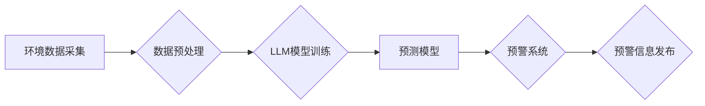

> Large Language Model (LLM), 环境监测, 预测, 预警系统, 机器学习, 自然语言处理, 数据分析

## 1. 背景介绍

随着全球气候变化和环境污染问题日益严峻，环境监测已成为保障生态安全和可持续发展的重要任务。传统环境监测方法通常依赖于人工采集和分析数据，效率低下，且难以应对大规模、实时监测的需求。近年来，人工智能技术，特别是大型语言模型 (LLM) 的快速发展，为环境监测领域带来了新的机遇。

LLM 拥有强大的文本理解、生成和推理能力，能够从海量环境数据中提取关键信息，识别模式和趋势，并进行预测和预警。本文将探讨 LLM 在环境监测中的应用，重点介绍其在预测和预警系统中的潜力和挑战。

## 2. 核心概念与联系

### 2.1 环境监测

环境监测是指对环境质量进行系统性的调查、测量、分析和评价，以了解环境状况、变化趋势和潜在风险。环境监测的目标是为环境保护、资源管理和公共健康提供科学依据。

### 2.2 预测与预警系统

预测与预警系统是指利用数据分析、机器学习等技术，对未来环境事件进行预测和预警，以帮助人们提前采取措施，减少环境风险和损失。

### 2.3 LLM在环境监测中的应用

LLM 可以通过以下方式应用于环境监测：

* **数据分析和提取:** LLM 可以从海量环境数据中提取关键信息，例如气温、湿度、污染物浓度等，并进行分类、聚类和关联分析。
* **模式识别和趋势预测:** LLM 可以识别环境数据中的模式和趋势，并利用这些信息进行未来环境事件的预测，例如空气污染、水污染、自然灾害等。
* **预警系统构建:** LLM 可以根据预测结果，构建预警系统，及时向相关人员发出预警信息，帮助他们采取应对措施。
* **自然语言交互:** LLM 可以与人类进行自然语言交互，例如回答环境问题、提供环境信息、指导环境监测工作等。

**Mermaid 流程图**



## 3. 核心算法原理 & 具体操作步骤

### 3.1  算法原理概述

LLM 在环境监测中的应用主要基于以下核心算法：

* **自然语言处理 (NLP):** 用于处理环境数据中的文本信息，例如气象预报、新闻报道、科学文献等。
* **机器学习 (ML):** 用于从环境数据中学习模式和趋势，并构建预测模型。
* **深度学习 (DL):** 用于训练更复杂的 LLMs，提高其预测精度和泛化能力。

### 3.2  算法步骤详解

LLM 在环境监测中的应用流程可以概括为以下步骤：

1. **数据采集:** 收集各种环境数据，例如气象数据、水质数据、土壤数据、卫星遥感数据等。
2. **数据预处理:** 对收集到的数据进行清洗、转换、格式化等处理，使其适合 LLMs 的训练和使用。
3. **模型训练:** 利用机器学习和深度学习算法，训练 LLMs，使其能够从环境数据中学习模式和趋势。
4. **模型评估:** 对训练好的模型进行评估，测试其预测精度和泛化能力。
5. **部署与应用:** 将训练好的模型部署到实际环境中，用于预测和预警环境事件。

### 3.3  算法优缺点

**优点:**

* **强大的文本理解能力:** LLM 可以理解和处理复杂的自然语言文本，例如气象预报、新闻报道、科学文献等。
* **高效的模式识别:** LLM 可以从海量环境数据中识别模式和趋势，并进行预测。
* **可扩展性强:** LLM 可以根据需要扩展模型规模和训练数据，提高预测精度和泛化能力。

**缺点:**

* **数据依赖性强:** LLM 的性能取决于训练数据的质量和数量。
* **解释性差:** LLM 的预测结果难以解释，难以理解模型是如何做出预测的。
* **计算资源需求高:** 训练大型 LLMs 需要大量的计算资源。

### 3.4  算法应用领域

LLM 在环境监测领域的应用领域广泛，包括：

* **空气质量预测:** 预测空气污染水平，预警空气质量恶化事件。
* **水质监测:** 预测水污染水平，预警水质恶化事件。
* **自然灾害预警:** 预测洪水、地震、火灾等自然灾害，预警灾害风险。
* **生态系统监测:** 监测生态系统变化趋势，预警生态系统退化风险。

## 4. 数学模型和公式 & 详细讲解 & 举例说明

### 4.1  数学模型构建

LLM 的训练过程本质上是一个优化问题，目标是找到一个模型参数，使得模型在训练数据上的预测性能达到最佳。常用的数学模型包括：

* **线性回归:** 用于预测连续变量，例如气温、湿度等。
* **逻辑回归:** 用于预测分类变量，例如空气质量等级、水质等级等。
* **支持向量机 (SVM):** 用于分类和回归问题，具有较好的泛化能力。
* **神经网络:** 用于处理复杂数据，具有强大的学习能力。

### 4.2  公式推导过程

例如，线性回归模型的预测公式为：

$$y = \beta_0 + \beta_1x_1 + \beta_2x_2 + ... + \beta_nx_n + \epsilon$$

其中：

* $y$ 是预测值
* $\beta_0, \beta_1, ..., \beta_n$ 是模型参数
* $x_1, x_2, ..., x_n$ 是输入特征
* $\epsilon$ 是误差项

模型参数可以通过最小化误差函数来求解，常用的误差函数包括均方误差 (MSE) 和交叉熵损失 (Cross-Entropy Loss)。

### 4.3  案例分析与讲解

例如，可以使用线性回归模型预测某地未来一周的气温。

* 输入特征包括历史气温、湿度、风速等数据。
* 模型参数可以通过训练数据求解。
* 预测结果可以用于制定天气预报和相关决策。

## 5. 项目实践：代码实例和详细解释说明

### 5.1  开发环境搭建

* 操作系统: Ubuntu 20.04
* Python 版本: 3.8
* 必要的库: TensorFlow, PyTorch, scikit-learn, NLTK

### 5.2  源代码详细实现

```python
# 导入必要的库
import tensorflow as tf
from sklearn.model_selection import train_test_split
from sklearn.metrics import mean_squared_error

# 加载环境数据
data = load_data()

# 数据预处理
X = data[['temperature', 'humidity', 'wind_speed']]
y = data['pollution_level']

# 将数据分成训练集和测试集
X_train, X_test, y_train, y_test = train_test_split(X, y, test_size=0.2)

# 创建线性回归模型
model = tf.keras.Sequential([
    tf.keras.layers.Dense(64, activation='relu', input_shape=(3,)),
    tf.keras.layers.Dense(32, activation='relu'),
    tf.keras.layers.Dense(1)
])

# 编译模型
model.compile(optimizer='adam', loss='mse')

# 训练模型
model.fit(X_train, y_train, epochs=100)

# 评估模型
y_pred = model.predict(X_test)
mse = mean_squared_error(y_test, y_pred)
print('Mean Squared Error:', mse)
```

### 5.3  代码解读与分析

* 代码首先导入必要的库，然后加载环境数据。
* 数据预处理步骤包括特征选择和数据分割。
* 创建线性回归模型，并使用 Adam 优化器和均方误差损失函数进行训练。
* 训练完成后，使用测试集评估模型性能。

### 5.4  运行结果展示

运行结果将显示模型的均方误差，可以用来评估模型的预测精度。

## 6. 实际应用场景

### 6.1  空气质量预测

LLM 可以从历史气象数据、污染物排放数据、交通流量数据等多种数据源中学习，预测未来空气质量水平。

### 6.2  水质监测

LLM 可以从水质监测数据、水文数据、工业排放数据等多种数据源中学习，预测未来水质水平，预警水质污染事件。

### 6.3  自然灾害预警

LLM 可以从气象数据、地震数据、地质数据等多种数据源中学习，预测未来自然灾害风险，预警灾害发生区域。

### 6.4  未来应用展望

LLM 在环境监测领域的应用前景广阔，未来可能在以下方面得到进一步发展：

* **更精准的预测:** 利用更先进的机器学习算法和更丰富的训练数据，提高预测精度。
* **更细粒度的监测:** 利用传感器网络和边缘计算技术，实现更细粒度的环境监测。
* **更智能的预警:** 利用自然语言处理技术，构建更智能的预警系统，能够根据不同用户的需求提供个性化的预警信息。
* **更可持续的环境管理:** 利用 LLM 辅助环境管理决策，实现更可持续的环境保护。

## 7. 工具和资源推荐

### 7.1  学习资源推荐

* **书籍:**
    * Deep Learning by Ian Goodfellow, Yoshua Bengio, and Aaron Courville
    * Natural Language Processing with Python by Steven Bird, Ewan Klein, and Edward Loper
* **在线课程:**
    * Coursera: Machine Learning by Andrew Ng
    * Udacity: Deep Learning Nanodegree
* **博客和论坛:**
    * Towards Data Science
    * Machine Learning Mastery

### 7.2  开发工具推荐

* **Python:** 广泛使用的编程语言，拥有丰富的机器学习和深度学习库。
* **TensorFlow:** 开源深度学习框架，支持多种硬件平台。
* **PyTorch:** 开源深度学习框架，以其灵活性和易用性而闻名。
* **scikit-learn:** 开源机器学习库，提供各种算法和工具。

### 7.3  相关论文推荐

* **BERT: Pre-training of Deep Bidirectional Transformers for Language Understanding**
* **GPT-3: Language Models are Few-Shot Learners**
* **Attention Is All You Need**

## 8. 总结：未来发展趋势与挑战

### 8.1  研究成果总结

LLM 在环境监测领域的应用取得了显著进展，能够有效地预测和预警环境事件，为环境保护和可持续发展提供了新的思路和方法。

### 8.2  未来发展趋势

未来，LLM 在环境监测领域的应用将朝着以下方向发展：

* **更精准的预测:** 利用更先进的机器学习算法和更丰富的训练数据，提高预测精度。
* **更细粒度的监测:** 利用传感器网络和边缘计算技术，实现更细粒度的环境监测。
* **更智能的预警:** 利用自然语言处理技术，构建更智能的预警系统，能够根据不同用户的需求提供个性化的预警信息。
* **更可持续的环境管理:** 利用 LLM 辅助环境管理决策，实现更可持续的环境保护。

### 8.3  面临的挑战

LLM 在环境监测领域的应用也面临一些挑战：

* **数据质量:** LLM 的性能取决于训练数据的质量和数量，环境数据往往存在噪声、缺失和不一致性等问题。
* **模型解释性:** LLM 的预测结果难以解释，难以理解模型是如何做出预测的。
* **计算资源需求:** 训练大型 LLMs 需要大量的计算资源。

### 