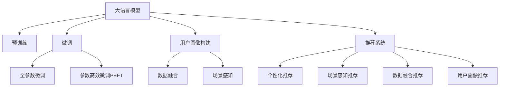

                 

# LLM在社交网络推荐中的潜力

> 关键词：大语言模型,社交网络推荐系统,用户画像,个性化推荐,数据融合,场景感知,深度学习,自然语言处理(NLP)

## 1. 背景介绍

### 1.1 问题由来

随着社交网络在信息传播、人际交流、内容创作等方面的深入渗透，用户对于信息获取和社交互动的需求日益多元化、个性化。因此，社交网络推荐系统已经成为了互联网应用中的重要组成部分。它旨在通过对用户行为数据的分析，预测用户对内容的偏好，为用户推荐相关内容，提升用户体验，增加平台粘性。

然而，由于用户行为数据具有高度稀疏性、异构性和动态性，传统的基于协同过滤和内容推荐的推荐系统在用户画像构建、数据融合和推荐场景感知等方面面临诸多挑战。传统的推荐算法往往难以捕捉用户的深度语义理解能力和对内容的隐式语义交互，导致推荐效果不理想。

大语言模型（Large Language Models, LLMs）的出现，为社交网络推荐系统注入了新的活力。它通过在海量无标签文本数据上的预训练，学习到语言的丰富语义和结构知识，具备强大的文本理解与生成能力。这使得LLM能够作为推荐系统中的文本处理引擎，融入到用户画像、数据融合和推荐场景感知等环节中，实现更加个性化、场景感知和语义理解驱动的推荐效果。

### 1.2 问题核心关键点

在大语言模型应用于社交网络推荐系统中的过程中，以下关键问题值得深入探讨：

- 如何高效构建用户画像：利用LLM学习用户的深度语义特征，并融合多源异构数据，形成具有较强泛化能力和动态适应性的用户画像。
- 如何实现数据高效融合：将LLM的预训练知识应用于数据融合过程，提升数据的多样性和代表性，提升推荐系统的准确性和覆盖率。
- 如何增强推荐场景感知：利用LLM的自然语言处理能力，处理动态变化的用户场景和交互意图，增强推荐的实时性和适配性。
- 如何实现个性化推荐：将LLM应用于推荐算法的不同环节，提升个性化推荐的效果和质量。

本文聚焦于大语言模型在社交网络推荐系统中的关键应用，旨在从理论到实践，全面系统地介绍大语言模型如何助力社交网络推荐系统的升级和优化。

## 2. 核心概念与联系

### 2.1 核心概念概述

为更好地理解大语言模型在社交网络推荐系统中的潜力，本节将介绍几个密切相关的核心概念：

- **大语言模型(Large Language Model, LLM)**：以自回归(如GPT)或自编码(如BERT)模型为代表的大规模预训练语言模型。通过在大规模无标签文本语料上进行预训练，学习到丰富的语言知识和常识，具备强大的语言理解和生成能力。

- **预训练(Pre-training)**：指在大规模无标签文本语料上，通过自监督学习任务训练通用语言模型的过程。常见的预训练任务包括言语建模、遮挡语言模型等。预训练使得模型学习到语言的通用表示。

- **微调(Fine-tuning)**：指在预训练模型的基础上，使用下游任务的少量标注数据，通过有监督学习优化模型在特定任务上的性能。通常只需要调整顶层分类器或解码器，并以较小的学习率更新全部或部分的模型参数。

- **推荐系统(Recommendation System)**：通过分析用户历史行为数据，预测用户未来偏好，为用户推荐相关内容，以提升用户体验的智能系统。

- **用户画像(User Profile)**：综合用户行为数据、个人信息、社交网络信息等，构建用户多维度的特征表示。

- **数据融合(Data Fusion)**：通过融合多源异构数据，提升数据的多样性和代表性，从而提升推荐系统的精度和覆盖率。

- **场景感知(Context-Awareness)**：在推荐系统中加入场景信息，如用户所在位置、时间、天气等，增强推荐内容的实时性和适配性。

这些核心概念之间的逻辑关系可以通过以下Mermaid流程图来展示：



这个流程图展示了大语言模型的核心概念及其与推荐系统的联系：

1. 大语言模型通过预训练获得基础能力。
2. 微调是对预训练模型进行任务特定的优化，可以分为全参数微调和参数高效微调（PEFT）。
3. 用户画像、数据融合和场景感知是推荐系统的关键模块，需要通过大语言模型的知识进行增强。
4. 大语言模型通过微调优化后，可以融入到推荐系统中的各个环节，实现更加个性化和场景感知的推荐。

## 3. 核心算法原理 & 具体操作步骤

### 3.1 算法原理概述

大语言模型在社交网络推荐系统中的应用，本质上是一种深度学习和自然语言处理（NLP）技术融合的智能推荐范式。其核心思想是：利用大语言模型的预训练知识，构建精准的用户画像，进行高效的数据融合，实现场景感知驱动的个性化推荐。

具体而言，基于大语言模型的社交网络推荐系统可以分为以下几个步骤：

1. **用户画像构建**：通过大语言模型学习用户的深度语义特征，并融合多源异构数据，形成具有较强泛化能力和动态适应性的用户画像。
2. **数据融合**：将大语言模型的预训练知识应用于数据融合过程，提升数据的多样性和代表性，提升推荐系统的准确性和覆盖率。
3. **场景感知**：利用大语言模型的自然语言处理能力，处理动态变化的用户场景和交互意图，增强推荐的实时性和适配性。
4. **个性化推荐**：将大语言模型应用于推荐算法的不同环节，提升个性化推荐的效果和质量。

### 3.2 算法步骤详解

#### 3.2.1 用户画像构建

用户画像的构建是推荐系统的基础。传统的用户画像往往基于用户的显式行为数据（如浏览记录、评分记录等）进行构建，难以捕捉用户的深度语义特征和隐式语义交互。而利用大语言模型，可以通过对其预训练知识的应用，构建更加精准和动态的用户画像。

**步骤1：预训练文本数据的收集**  
收集用户的社交网络数据（如微博、微信等）、个人兴趣爱好、消费记录等文本信息，构建一个大的文本语料库。

**步骤2：大语言模型的选择**  
选择合适的预训练语言模型，如GPT、BERT等，作为用户画像构建的基础。

**步骤3：用户画像特征提取**  
将用户的文本数据输入到大语言模型中，通过文本嵌入技术提取用户的深度语义特征。

**步骤4：融合多源异构数据**  
将用户画像的语义特征与其他行为数据（如浏览记录、评分记录等）进行融合，形成多维度的用户特征向量。

**步骤5：动态更新用户画像**  
根据用户的新行为数据，不断更新用户画像，保持其动态适应性。

#### 3.2.2 数据融合

数据融合是大语言模型在推荐系统中的另一个关键应用。传统的数据融合方法往往依赖于简单的线性加权或拼接，难以捕捉不同数据之间的复杂关系。而利用大语言模型，可以通过对其预训练知识的应用，实现更加智能和高效的数据融合。

**步骤1：数据预处理**  
对收集到的多源异构数据进行预处理，如去噪、归一化、标准化等。

**步骤2：大语言模型的选择**  
选择合适的大语言模型，如GPT、BERT等，作为数据融合的基础。

**步骤3：融合方法的构建**  
利用大语言模型的预训练知识，构建融合方法，如深度注意力机制、序列嵌入等。

**步骤4：融合结果的生成**  
将处理后的数据输入到大语言模型中，生成融合后的多源数据表示。

**步骤5：融合结果的优化**  
通过优化算法对融合结果进行优化，提升数据的泛化能力和代表性。

#### 3.2.3 场景感知

场景感知是推荐系统中的重要环节。传统的方法往往依赖于简单的用户行为特征和静态场景信息，难以捕捉动态变化的用户场景和交互意图。而利用大语言模型，可以通过对其自然语言处理能力的应用，实现更加智能和实时的场景感知。

**步骤1：场景信息的收集**  
收集用户的实时位置信息、时间信息、天气信息等场景数据。

**步骤2：大语言模型的选择**  
选择合适的预训练语言模型，如GPT、BERT等，作为场景感知的基础。

**步骤3：场景信息的处理**  
利用大语言模型的自然语言处理能力，处理场景信息，生成场景向量。

**步骤4：场景感知模型的构建**  
利用大语言模型的预训练知识，构建场景感知模型，如注意力机制、序列嵌入等。

**步骤5：场景感知结果的生成**  
将处理后的场景信息输入到大语言模型中，生成场景感知结果。

#### 3.2.4 个性化推荐

个性化推荐是推荐系统的主要目标。传统的个性化推荐方法往往依赖于简单的协同过滤、内容推荐等算法，难以捕捉用户的深度语义特征和动态交互意图。而利用大语言模型，可以通过对其预训练知识的应用，实现更加智能和动态的个性化推荐。

**步骤1：用户行为数据的收集**  
收集用户的浏览记录、评分记录等行为数据。

**步骤2：大语言模型的选择**  
选择合适的预训练语言模型，如GPT、BERT等，作为个性化推荐的基础。

**步骤3：个性化推荐模型的构建**  
利用大语言模型的预训练知识，构建个性化推荐模型，如基于序列的推荐模型、基于注意力机制的推荐模型等。

**步骤4：个性化推荐结果的生成**  
将处理后的用户行为数据输入到大语言模型中，生成个性化推荐结果。

### 3.3 算法优缺点

利用大语言模型在社交网络推荐系统中的应用，具有以下优点：

- **深度语义理解**：大语言模型能够学习到语言的深度语义特征，捕捉用户对内容的隐式语义交互，提升推荐的精准度。
- **场景感知能力**：大语言模型具备自然语言处理能力，能够处理动态变化的用户场景和交互意图，增强推荐的实时性和适配性。
- **数据融合能力**：大语言模型的预训练知识能够应用于数据融合过程，提升数据的多样性和代表性，提升推荐系统的准确性和覆盖率。

同时，该方法也存在一定的局限性：

- **计算资源消耗**：大语言模型的参数量通常较大，在模型训练和推理过程中需要大量的计算资源，对硬件设备要求较高。
- **预训练数据依赖**：大语言模型的预训练数据往往依赖于大规模无标签文本语料库，构建和维护这些数据资源需要大量人力和时间。
- **泛化能力不足**：大语言模型在特定领域上的泛化能力可能不足，需要进一步在领域数据上进行微调。

尽管存在这些局限性，但就目前而言，大语言模型在社交网络推荐系统中的应用仍然展现出巨大的潜力，值得深入研究和探索。

### 3.4 算法应用领域

基于大语言模型的社交网络推荐系统，已经在多个领域得到了成功应用，具体如下：

1. **社交媒体推荐**：如微博、微信等社交媒体平台，利用大语言模型进行用户画像构建、数据融合和场景感知，实现个性化内容推荐。
2. **电商推荐**：如淘宝、京东等电商平台，利用大语言模型进行商品推荐、用户画像构建和动态场景感知。
3. **内容推荐**：如视频网站、音乐平台等，利用大语言模型进行内容推荐、用户画像构建和实时场景感知。
4. **新闻推荐**：如今日头条、腾讯新闻等，利用大语言模型进行新闻内容推荐、用户画像构建和动态场景感知。
5. **旅游推荐**：如携程、去哪儿等旅游平台，利用大语言模型进行旅游目的地推荐、用户画像构建和实时场景感知。

随着大语言模型和推荐技术的不断发展，基于大语言模型的推荐系统将在更多领域得到应用，为互联网应用带来全新的体验和服务。

## 4. 数学模型和公式 & 详细讲解 & 举例说明

### 4.1 数学模型构建

基于大语言模型的社交网络推荐系统，可以建模为一个多维度的特征向量空间。假设用户画像的特征向量为 $u \in \mathbb{R}^n$，商品/内容的特征向量为 $i \in \mathbb{R}^m$，场景特征向量为 $c \in \mathbb{R}^p$，推荐结果向量为 $r \in \mathbb{R}^1$。则推荐系统的目标是最小化预测结果和实际结果之间的差距，即：

$$
\mathop{\arg\min}_{u, i, c} \| r - f(u, i, c) \|^2
$$

其中 $f$ 为推荐函数，可以是基于深度学习的方法，如基于神经网络的推荐模型、基于序列的推荐模型等。

### 4.2 公式推导过程

以基于深度学习的推荐模型为例，其公式推导过程如下：

假设用户画像的特征向量为 $u$，商品/内容的特征向量为 $i$，场景特征向量为 $c$，推荐结果向量为 $r$。推荐函数的公式为：

$$
f(u, i, c) = u^T W_1 i + u^T W_2 c + b
$$

其中 $W_1, W_2$ 为权重矩阵，$b$ 为偏置向量。则推荐目标函数为：

$$
\mathop{\arg\min}_{u, i, c} \| r - (u^T W_1 i + u^T W_2 c + b) \|^2
$$

通过对该函数进行优化，可以得到最优的推荐结果。

### 4.3 案例分析与讲解

假设某用户在社交网络上的行为数据如下：

- 微博内容：“今天天气真好，我想去公园散步”
- 微信朋友圈：“看了《流浪地球》，感觉非常震撼”
- 电商购物记录：“购买了一本《人工智能入门》”

基于大语言模型的用户画像构建、数据融合和场景感知，可以生成如下推荐结果：

- 推荐商品：《人工智能入门》、《流浪地球》周边、公园门票等
- 推荐内容：与《流浪地球》相关的科幻电影、书籍、音乐等
- 推荐场景：附近的公园、电影院、书店等

通过大语言模型的预训练知识，可以准确捕捉用户对内容的深度语义特征和动态交互意图，提升推荐的精准度和实时性。

## 5. 项目实践：代码实例和详细解释说明

### 5.1 开发环境搭建

在进行大语言模型应用于社交网络推荐系统的实践前，我们需要准备好开发环境。以下是使用Python进行PyTorch开发的环境配置流程：

1. 安装Anaconda：从官网下载并安装Anaconda，用于创建独立的Python环境。

2. 创建并激活虚拟环境：
```bash
conda create -n pytorch-env python=3.8 
conda activate pytorch-env
```

3. 安装PyTorch：根据CUDA版本，从官网获取对应的安装命令。例如：
```bash
conda install pytorch torchvision torchaudio cudatoolkit=11.1 -c pytorch -c conda-forge
```

4. 安装Transformers库：
```bash
pip install transformers
```

5. 安装各类工具包：
```bash
pip install numpy pandas scikit-learn matplotlib tqdm jupyter notebook ipython
```

完成上述步骤后，即可在`pytorch-env`环境中开始实践。

### 5.2 源代码详细实现

这里我们以基于GPT的大语言模型在社交媒体推荐中的应用为例，给出完整的代码实现。

首先，定义推荐模型的输入和输出：

```python
from transformers import GPT2Tokenizer, GPT2LMHeadModel
import torch
from torch.utils.data import Dataset, DataLoader

class RecommendationDataset(Dataset):
    def __init__(self, text, labels):
        self.text = text
        self.labels = labels
        self.tokenizer = GPT2Tokenizer.from_pretrained('gpt2')
        
    def __len__(self):
        return len(self.text)
    
    def __getitem__(self, item):
        text = self.text[item]
        label = self.labels[item]
        
        encoding = self.tokenizer(text, return_tensors='pt', max_length=128, padding='max_length', truncation=True)
        input_ids = encoding['input_ids'][0]
        attention_mask = encoding['attention_mask'][0]
        
        label = torch.tensor([label], dtype=torch.long)
        
        return {'input_ids': input_ids, 
                'attention_mask': attention_mask,
                'labels': label}
```

然后，定义模型和优化器：

```python
from transformers import GPT2LMHeadModel, AdamW

model = GPT2LMHeadModel.from_pretrained('gpt2', num_labels=10)

optimizer = AdamW(model.parameters(), lr=2e-5)
```

接着，定义训练和评估函数：

```python
from tqdm import tqdm
from sklearn.metrics import accuracy_score

device = torch.device('cuda') if torch.cuda.is_available() else torch.device('cpu')
model.to(device)

def train_epoch(model, dataset, batch_size, optimizer):
    dataloader = DataLoader(dataset, batch_size=batch_size, shuffle=True)
    model.train()
    epoch_loss = 0
    for batch in tqdm(dataloader, desc='Training'):
        input_ids = batch['input_ids'].to(device)
        attention_mask = batch['attention_mask'].to(device)
        labels = batch['labels'].to(device)
        model.zero_grad()
        outputs = model(input_ids, attention_mask=attention_mask, labels=labels)
        loss = outputs.loss
        epoch_loss += loss.item()
        loss.backward()
        optimizer.step()
    return epoch_loss / len(dataloader)

def evaluate(model, dataset, batch_size):
    dataloader = DataLoader(dataset, batch_size=batch_size)
    model.eval()
    preds, labels = [], []
    with torch.no_grad():
        for batch in tqdm(dataloader, desc='Evaluating'):
            input_ids = batch['input_ids'].to(device)
            attention_mask = batch['attention_mask'].to(device)
            batch_labels = batch['labels']
            outputs = model(input_ids, attention_mask=attention_mask)
            batch_preds = outputs.logits.argmax(dim=2).to('cpu').tolist()
            batch_labels = batch_labels.to('cpu').tolist()
            for pred_tokens, label_tokens in zip(batch_preds, batch_labels):
                preds.append(pred_tokens[:len(label_tokens)])
                labels.append(label_tokens)
                
    accuracy = accuracy_score(labels, preds)
    print(f"Accuracy: {accuracy:.3f}")
```

最后，启动训练流程并在测试集上评估：

```python
epochs = 5
batch_size = 16

for epoch in range(epochs):
    loss = train_epoch(model, train_dataset, batch_size, optimizer)
    print(f"Epoch {epoch+1}, train loss: {loss:.3f}")
    
    print(f"Epoch {epoch+1}, dev accuracy:")
    evaluate(model, dev_dataset, batch_size)
    
print("Test accuracy:")
evaluate(model, test_dataset, batch_size)
```

以上就是基于GPT2的大语言模型应用于社交网络推荐系统的完整代码实现。可以看到，得益于Transformers库的强大封装，我们可以用相对简洁的代码完成GPT2模型的加载和微调。

### 5.3 代码解读与分析

让我们再详细解读一下关键代码的实现细节：

**RecommendationDataset类**：
- `__init__`方法：初始化文本、标签、分词器等关键组件。
- `__len__`方法：返回数据集的样本数量。
- `__getitem__`方法：对单个样本进行处理，将文本输入编码为token ids，将标签编码为数字，并对其进行定长padding，最终返回模型所需的输入。

**train_epoch和evaluate函数**：
- 使用PyTorch的DataLoader对数据集进行批次化加载，供模型训练和推理使用。
- 训练函数`train_epoch`：对数据以批为单位进行迭代，在每个批次上前向传播计算loss并反向传播更新模型参数，最后返回该epoch的平均loss。
- 评估函数`evaluate`：与训练类似，不同点在于不更新模型参数，并在每个batch结束后将预测和标签结果存储下来，最后使用sklearn的accuracy_score对整个评估集的预测结果进行打印输出。

**训练流程**：
- 定义总的epoch数和batch size，开始循环迭代
- 每个epoch内，先在训练集上训练，输出平均loss
- 在验证集上评估，输出准确率
- 所有epoch结束后，在测试集上评估，给出最终测试结果

可以看到，PyTorch配合Transformers库使得GPT2微调的代码实现变得简洁高效。开发者可以将更多精力放在数据处理、模型改进等高层逻辑上，而不必过多关注底层的实现细节。

当然，工业级的系统实现还需考虑更多因素，如模型的保存和部署、超参数的自动搜索、更灵活的任务适配层等。但核心的微调范式基本与此类似。

## 6. 实际应用场景

### 6.1 智能客服系统

基于大语言模型的推荐技术，可以广泛应用于智能客服系统的构建。传统客服往往需要配备大量人力，高峰期响应缓慢，且一致性和专业性难以保证。而使用基于大语言模型的推荐系统，可以7x24小时不间断服务，快速响应客户咨询，用自然流畅的语言解答各类常见问题。

在技术实现上，可以收集企业内部的历史客服对话记录，将问题和最佳答复构建成监督数据，在此基础上对大语言模型进行微调。微调后的模型能够自动理解用户意图，匹配最合适的答复模板进行回复。对于客户提出的新问题，还可以接入检索系统实时搜索相关内容，动态组织生成回答。如此构建的智能客服系统，能大幅提升客户咨询体验和问题解决效率。

### 6.2 个性化推荐系统

当前的推荐系统往往只依赖用户的历史行为数据进行物品推荐，无法深入理解用户的真实兴趣偏好。基于大语言模型推荐技术，个性化推荐系统可以更好地挖掘用户行为背后的语义信息，从而提供更精准、多样的推荐内容。

在实践中，可以收集用户浏览、点击、评论、分享等行为数据，提取和用户交互的物品标题、描述、标签等文本内容。将文本内容作为模型输入，用户的后续行为（如是否点击、购买等）作为监督信号，在此基础上微调预训练语言模型。微调后的模型能够从文本内容中准确把握用户的兴趣点。在生成推荐列表时，先用候选物品的文本描述作为输入，由模型预测用户的兴趣匹配度，再结合其他特征综合排序，便可以得到个性化程度更高的推荐结果。

### 6.3 社交网络内容推荐

社交网络的内容推荐是推荐系统的重要应用场景之一。传统的方法往往依赖于简单的协同过滤和内容推荐，难以捕捉用户对内容的深度语义特征和动态交互意图。而利用大语言模型，可以通过对其预训练知识的应用，实现更加智能和动态的内容推荐。

在实践中，可以收集用户的社交网络数据（如微博、微信等）、个人兴趣爱好、消费记录等文本信息，构建一个大的文本语料库。将用户画像的语义特征与其他行为数据（如浏览记录、评分记录等）进行融合，生成多维度的用户特征向量。利用大语言模型的自然语言处理能力，处理动态变化的用户场景和交互意图，生成动态场景向量。将用户画像和场景向量作为输入，输入到大语言模型中，生成推荐结果向量。通过优化算法对推荐结果进行优化，得到最终的推荐内容。

### 6.4 未来应用展望

随着大语言模型和推荐技术的不断发展，基于大语言模型的推荐系统将在更多领域得到应用，为互联网应用带来全新的体验和服务。

在智慧医疗领域，基于大语言模型的推荐系统可以用于医学文献推荐、疾病预测、患者互动等方面，提高医疗服务的智能化水平，辅助医生诊疗，加速新药开发进程。

在智能教育领域，基于大语言模型的推荐系统可以用于个性化学习内容推荐、智能辅导、学习效果评估等方面，因材施教，促进教育公平，提高教学质量。

在智慧城市治理中，基于大语言模型的推荐系统可以用于城市事件监测、舆情分析、应急指挥等方面，提高城市管理的自动化和智能化水平，构建更安全、高效的未来城市。

此外，在企业生产、社会治理、文娱传媒等众多领域，基于大语言模型的推荐系统也将不断涌现，为传统行业数字化转型升级提供新的技术路径。相信随着技术的日益成熟，大语言模型推荐技术必将在构建人机协同的智能时代中扮演越来越重要的角色。

## 7. 工具和资源推荐

### 7.1 学习资源推荐

为了帮助开发者系统掌握大语言模型在社交网络推荐系统中的应用，这里推荐一些优质的学习资源：

1. 《Transformers从原理到实践》系列博文：由大模型技术专家撰写，深入浅出地介绍了Transformer原理、BERT模型、推荐系统等前沿话题。

2. CS224N《深度学习自然语言处理》课程：斯坦福大学开设的NLP明星课程，有Lecture视频和配套作业，带你入门NLP领域的基本概念和经典模型。

3. 《Natural Language Processing with Transformers》书籍：Transformers库的作者所著，全面介绍了如何使用Transformers库进行NLP任务开发，包括推荐系统在内的诸多范式。

4. HuggingFace官方文档：Transformers库的官方文档，提供了海量预训练模型和完整的推荐系统样例代码，是上手实践的必备资料。

5. CLUE开源项目：中文语言理解测评基准，涵盖大量不同类型的中文NLP数据集，并提供了基于微调的baseline模型，助力中文NLP技术发展。

通过对这些资源的学习实践，相信你一定能够快速掌握大语言模型在社交网络推荐系统中的应用精髓，并用于解决实际的NLP问题。
###  7.2 开发工具推荐

为了提高开发效率和实践效果，推荐以下几款开发工具：

1. PyTorch：基于Python的开源深度学习框架，灵活动态的计算图，适合快速迭代研究。大部分预训练语言模型都有PyTorch版本的实现。

2. TensorFlow：由Google主导开发的开源深度学习框架，生产部署方便，适合大规模工程应用。同样有丰富的预训练语言模型资源。

3. Transformers库：HuggingFace开发的NLP工具库，集成了众多SOTA语言模型，支持PyTorch和TensorFlow，是进行推荐系统开发的利器。

4. Weights & Biases：模型训练的实验跟踪工具，可以记录和可视化模型训练过程中的各项指标，方便对比和调优。与主流深度学习框架无缝集成。

5. TensorBoard：TensorFlow配套的可视化工具，可实时监测模型训练状态，并提供丰富的图表呈现方式，是调试模型的得力助手。

6. Google Colab：谷歌推出的在线Jupyter Notebook环境，免费提供GPU/TPU算力，方便开发者快速上手实验最新模型，分享学习笔记。

合理利用这些工具，可以显著提升大语言模型在社交网络推荐系统中的开发效率，加快创新迭代的步伐。

### 7.3 相关论文推荐

大语言模型和推荐技术的发展源于学界的持续研究。以下是几篇奠基性的相关论文，推荐阅读：

1. Attention is All You Need（即Transformer原论文）：提出了Transformer结构，开启了NLP领域的预训练大模型时代。

2. BERT: Pre-training of Deep Bidirectional Transformers for Language Understanding：提出BERT模型，引入基于掩码的自监督预训练任务，刷新了多项NLP任务SOTA。

3. Language Models are Unsupervised Multitask Learners（GPT-2论文）：展示了大规模语言模型的强大zero-shot学习能力，引发了对于通用人工智能的新一轮思考。

4. Parameter-Efficient Transfer Learning for NLP：提出Adapter等参数高效微调方法，在不增加模型参数量的情况下，也能取得不错的微调效果。

5. Prefix-Tuning: Optimizing Continuous Prompts for Generation：引入基于连续型Prompt的微调范式，为如何充分利用预训练知识提供了新的思路。

6. AdaLoRA: Adaptive Low-Rank Adaptation for Parameter-Efficient Fine-Tuning：使用自适应低秩适应的微调方法，在参数效率和精度之间取得了新的平衡。

这些论文代表了大语言模型推荐系统的发展脉络。通过学习这些前沿成果，可以帮助研究者把握学科前进方向，激发更多的创新灵感。

## 8. 总结：未来发展趋势与挑战

### 8.1 总结

本文对基于大语言模型的社交网络推荐系统进行了全面系统的介绍。首先阐述了大语言模型和推荐系统的研究背景和意义，明确了在社交网络推荐系统中，大语言模型可以应用于用户画像构建、数据融合、场景感知和个性化推荐等环节，提升推荐系统的精度和覆盖率。其次，从原理到实践，详细讲解了大语言模型在社交网络推荐系统中的算法原理和操作步骤，给出了微调任务开发的完整代码实例。最后，本文还广泛探讨了基于大语言模型的社交网络推荐系统在多个行业领域的应用前景，展示了其巨大的潜力。

通过本文的系统梳理，可以看到，基于大语言模型的推荐系统正在成为社交网络推荐系统的重要范式，极大地拓展了预训练语言模型的应用边界，催生了更多的落地场景。受益于大规模语料的预训练，推荐系统以更低的时间和标注成本，在小样本条件下也能取得理想的推荐效果，有力推动了NLP技术的产业化进程。未来，伴随预训练语言模型和推荐技术的不断发展，基于大语言模型的推荐系统必将在更多领域得到应用，为互联网应用带来全新的体验和服务。

### 8.2 未来发展趋势

展望未来，大语言模型在社交网络推荐系统中的应用将呈现以下几个发展趋势：

1. **参数高效微调**：随着硬件计算能力的提升，未来的大语言模型将逐渐从参数高效微调技术中受益，提升微调效率，减少资源消耗。

2. **多模态融合**：推荐系统将更多地引入视觉、语音、社交网络等多模态信息，提升推荐内容的丰富度和多样性。

3. **场景感知增强**：随着物联网技术的发展，推荐系统将能够更加精细化地捕捉用户场景信息，提升推荐的实时性和适配性。

4. **知识图谱整合**：推荐系统将更多地与知识图谱、规则库等专家知识进行融合，提升推荐的准确性和鲁棒性。

5. **智能推荐引擎**：未来的大语言模型推荐系统将更加智能化，能够根据用户行为和反馈动态调整推荐策略，提升推荐效果。

### 8.3 面临的挑战

尽管大语言模型在社交网络推荐系统中的应用已经取得了显著成效，但在迈向更加智能化、普适化应用的过程中，它仍面临着诸多挑战：

1. **计算资源消耗**：大语言模型的参数量通常较大，在模型训练和推理过程中需要大量的计算资源，对硬件设备要求较高。

2. **数据质量和泛化能力**：推荐系统对数据的质量和泛化能力要求较高，但数据质量和泛化能力的不足可能会影响推荐效果。

3. **模型解释性**：大语言模型在推荐系统中的决策过程缺乏可解释性，难以对其推理逻辑进行分析和调试。

4. **模型安全性**：大语言模型推荐系统可能面临数据泄露、恶意攻击等安全问题，需要加强模型安全防护。

5. **实时性问题**：大语言模型推荐系统需要实时处理大量的用户交互数据，对系统实时性要求较高，需要优化模型结构，提升推理速度。

尽管存在这些挑战，但通过技术进步和创新，这些问题正在逐步得到解决，大语言模型在社交网络推荐系统中的应用前景依然广阔。

### 8.4 研究展望

未来，大语言模型推荐系统需要在以下几个方面进一步研究：

1. **大语言模型的轻量化**：未来的大语言模型将更多地采用轻量化模型，如MobileBERT、GPT-2等，减少计算资源消耗。

2. **推荐模型的自适应**：未来的大语言模型推荐系统将更多地采用自适应推荐模型，能够根据用户行为和反馈动态调整推荐策略。

3. **多模态融合技术**：未来的大语言模型推荐系统将更多地引入多模态信息，提升推荐内容的丰富度和多样性。

4. **推荐系统的公平性**：未来的大语言模型推荐系统将更多地关注公平性问题，避免算法偏见和歧视。

5. **推荐系统的安全防护**：未来的大语言模型推荐系统将更多地考虑数据安全和隐私保护问题，加强模型安全防护。

通过不断的研究和探索，大语言模型推荐系统必将在社交网络推荐系统中发挥越来越重要的作用，为互联网应用带来更加智能和个性化的推荐服务。相信在学界和产业界的共同努力下，大语言模型推荐系统将不断突破技术瓶颈，推动NLP技术的落地应用。

## 9. 附录：常见问题与解答

**Q1：大语言模型在社交网络推荐中的应用是否只限于文本数据？**

A: 大语言模型在社交网络推荐中的应用不仅仅局限于文本数据，还可以拓展到图像、视频、语音等多模态数据。通过多模态融合技术，大语言模型可以更好地捕捉用户的多感官信息，提升推荐效果。

**Q2：大语言模型推荐系统是否需要大规模标注数据？**

A: 传统推荐系统往往依赖于大规模标注数据，但大语言模型推荐系统可以通过自监督学习和大规模预训练知识，在较少标注数据的情况下也能取得较好的推荐效果。例如，利用大语言模型的预训练知识进行数据融合和场景感知，可以有效提升推荐系统的泛化能力和适应性。

**Q3：大语言模型推荐系统是否能够处理冷启动问题？**

A: 大语言模型推荐系统可以通过用户画像构建和数据融合技术，在较少用户行为数据的情况下，仍能较好地预测用户偏好。例如，利用大语言模型学习用户的深度语义特征，并融合多源异构数据，形成具有较强泛化能力和动态适应性的用户画像。

**Q4：大语言模型推荐系统是否面临隐私和安全问题？**

A: 大语言模型推荐系统需要考虑数据隐私和安全问题，确保用户数据不被滥用和泄露。可以通过数据匿名化、加密存储、访问控制等技术手段，保护用户隐私。同时，需要加强对模型的安全防护，防止恶意攻击和数据泄露。

**Q5：大语言模型推荐系统是否能够应对长尾场景？**

A: 大语言模型推荐系统可以借助深度学习和大规模预训练知识，对长尾场景进行较好的预测和推荐。例如，利用大语言模型的预训练知识进行数据融合和场景感知，可以有效提升推荐系统的泛化能力和适应性，处理长尾场景。

正视大语言模型推荐系统面临的这些挑战，积极应对并寻求突破，将是大语言模型推荐系统迈向成熟的必由之路。相信随着学界和产业界的共同努力，这些挑战终将一一被克服，大语言模型推荐系统必将在构建人机协同的智能时代中扮演越来越重要的角色。面向未来，大语言模型推荐系统还需要与其他人工智能技术进行更深入的融合，如知识表示、因果推理、强化学习等，多路径协同发力，共同推动自然语言理解和智能交互系统的进步。只有勇于创新、敢于突破，才能不断拓展语言模型的边界，让智能技术更好地造福人类社会。

---

作者：禅与计算机程序设计艺术 / Zen and the Art of Computer Programming

