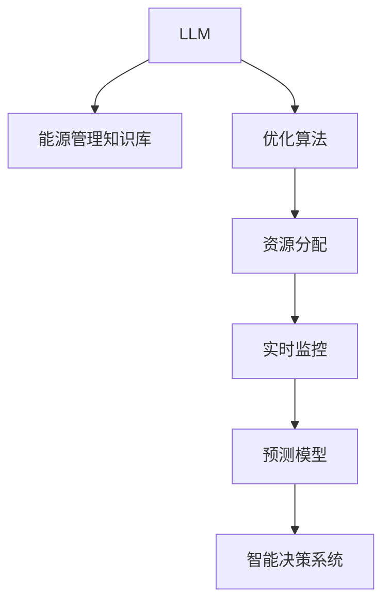

                 

# LLM在能源管理中的应用：优化资源分配

> 关键词：大型语言模型(LLM), 能源管理, 资源分配优化, 高效算法, 智能决策系统, 预测模型, 实时监控, 案例分析, 技术栈

## 1. 背景介绍

### 1.1 问题由来

能源管理是任何工业生产系统中的关键环节，直接关系到整个企业的生产效率和成本控制。在工业生产的各个环节中，合理分配和管理能源资源是提高经济效益、降低环境污染、保障生产安全的重要保障。然而，能源资源在物理世界和数字化系统中都有其自身的复杂性，并且传统能源管理系统大多采用基于规则的专家系统或简单的数学模型，无法满足日益复杂和动态变化的能源需求。

近年来，随着人工智能和大数据技术的飞速发展，利用先进的人工智能技术进行能源管理优化已成了一种趋势。而大型语言模型(LLM)作为一种先进的自然语言处理技术，因其出色的理解能力、泛化能力和高效性，正在成为能源管理领域的重要工具。

### 1.2 问题核心关键点

利用LLM优化能源管理，本质上是通过构建智能决策系统，实现对能源资源的高效、实时、精准分配。核心关键点包括：

- 构建能源管理知识库：将能源管理的各类规则、知识和经验以结构化或半结构化形式存储起来，供LLM理解和调用。
- 设计优化算法：根据任务特点，设计高效、可解释的优化算法，如线性规划、遗传算法、深度强化学习等，用于求解资源分配优化问题。
- 实现实时监控：通过传感器、物联网等技术，实时采集生产过程中的能源使用数据，供LLM进行实时分析与决策。
- 提供预测模型：利用时间序列分析、机器学习等技术，构建能源需求预测模型，供LLM在实时监控中参考。

### 1.3 问题研究意义

利用LLM进行能源管理优化，对于提升工业生产的效率和效益，减少能源浪费和环境污染，具有重要的意义：

- 提升生产效率：LLM可以实时分析和决策，及时调整能源分配，提高生产效率和设备利用率。
- 降低能源成本：通过优化资源分配，减少能源浪费，降低生产成本，提升经济效益。
- 保护环境：合理分配能源，降低能源消耗和污染排放，对环境友好。
- 保障安全：实时监控和预测可以及时发现能源异常，防范安全隐患，保障生产安全。

## 2. 核心概念与联系

### 2.1 核心概念概述

为了更好地理解LLM在能源管理中的应用，下面将介绍几个密切相关的核心概念：

- **大型语言模型(LLM)**：是一种基于深度神经网络技术的自然语言处理模型，可以理解并生成自然语言。广泛应用于语音识别、机器翻译、文本生成、问答系统等。
- **能源管理**：是指对能源的使用、分配、监控和优化过程的管理，包括能源的采集、存储、分配、使用、监测等环节。
- **资源分配优化**：指通过算法优化能源资源的分配，实现最优化的资源使用和生产效率。
- **智能决策系统**：利用人工智能技术构建的自动化决策系统，可以根据数据进行实时分析与决策。
- **预测模型**：基于历史数据和模型，预测未来的能源需求和供应情况，供优化算法参考。
- **实时监控**：通过传感器、物联网等技术，实时获取生产过程中的能源使用数据，供LLM进行实时分析与决策。

这些核心概念之间的逻辑关系可以通过以下Mermaid流程图来展示：



这个流程图展示了LLM在能源管理中的应用流程：

1. LLM通过理解能源管理的知识库，构建起对能源系统的初步认知。
2. 利用优化算法，对能源资源进行分配和优化。
3. 通过实时监控获取生产过程中的能源数据，供LLM进行实时分析与决策。
4. 利用预测模型，对未来的能源需求进行预测，供优化算法参考。
5. 将LLM的决策结果输出给智能决策系统，进行实际的生产控制和资源分配。

## 3. 核心算法原理 & 具体操作步骤
### 3.1 算法原理概述

基于LLM的能源管理优化，主要包括以下几个步骤：

1. **数据收集与预处理**：通过传感器、物联网等技术，实时收集生产过程中的能源使用数据。
2. **知识库构建**：将能源管理的各类规则、知识和经验以结构化或半结构化形式存储起来，供LLM理解和调用。
3. **模型训练与优化**：利用历史数据和优化算法，训练LLM模型，优化能源资源的分配。
4. **实时监控与决策**：在实时监控下，利用LLM进行能源系统的实时分析与决策，调整能源分配。
5. **预测与反馈**：利用时间序列分析、机器学习等技术，构建能源需求预测模型，供优化算法参考。

### 3.2 算法步骤详解

#### 3.2.1 数据收集与预处理

1. **数据采集**：通过传感器、物联网等技术，实时采集生产过程中的能源使用数据。
2. **数据清洗**：对采集的数据进行清洗，去除噪声和异常值，保证数据质量。
3. **特征提取**：从数据中提取有用的特征，如能源类型、使用量、使用时间等，供模型使用。
4. **数据划分**：将数据划分为训练集、验证集和测试集，用于模型的训练、验证和测试。

#### 3.2.2 知识库构建

1. **知识获取**：通过专家经验、规章制度等获取能源管理的各类规则和知识。
2. **知识存储**：将知识以结构化或半结构化形式存储在数据库中，供LLM调用。
3. **知识表示**：将知识转化为LLM可以理解的格式，如三元组、向量等。

#### 3.2.3 模型训练与优化

1. **选择优化算法**：根据任务特点，选择适合的优化算法，如线性规划、遗传算法、深度强化学习等。
2. **模型训练**：利用历史数据和优化算法，训练LLM模型，优化能源资源的分配。
3. **模型调优**：根据验证集的表现，调整模型参数，优化模型性能。

#### 3.2.4 实时监控与决策

1. **数据接入**：将实时采集的能源使用数据接入LLM。
2. **实时分析**：利用LLM进行实时分析，评估能源系统的运行状态。
3. **决策调整**：根据LLM的决策结果，调整能源分配，进行生产控制。

#### 3.2.5 预测与反馈

1. **构建预测模型**：利用时间序列分析、机器学习等技术，构建能源需求预测模型。
2. **模型训练**：利用历史数据和预测模型，训练模型，提高预测精度。
3. **反馈优化**：根据预测结果，对模型进行优化，提高预测准确性和实时性。

### 3.3 算法优缺点

基于LLM的能源管理优化算法有以下优点：

- **高效性**：LLM具备出色的理解能力和泛化能力，能够快速处理大量数据，提供高效、实时的优化建议。
- **灵活性**：LLM可以灵活适应各种任务，适用于不同规模和复杂度的能源管理问题。
- **可解释性**：LLM可以提供可解释的决策过程，便于调试和优化。
- **自适应性**：LLM可以不断学习新的知识，适应不断变化的能源需求。

同时，该算法也存在一定的局限性：

- **数据依赖**：模型的效果很大程度上依赖于数据的质量和量，数据缺失或不准确可能导致模型性能下降。
- **计算复杂性**：对于大规模问题，LLM的计算复杂性较高，可能需要较长的训练和推理时间。
- **模型复杂性**：LLM的模型结构复杂，需要大量参数进行训练和优化，资源需求较高。
- **实时性**：实时性要求较高的场景下，LLM的推理速度可能不足。

### 3.4 算法应用领域

基于LLM的能源管理优化算法，已经在多个行业得到应用，具体包括：

- **石化行业**：利用LLM优化生产过程的能源分配，提高生产效率和资源利用率。
- **钢铁行业**：通过LLM对钢铁生产过程的能源消耗进行优化，减少能源浪费，降低生产成本。
- **电力行业**：利用LLM进行电网的负荷预测和优化调度，提升电网稳定性和经济效益。
- **化工行业**：通过LLM优化化工生产的能源消耗，提高生产效率和环保性能。
- **石油行业**：利用LLM优化石油生产的能源分配，提升石油开采效率和资源利用率。

## 4. 数学模型和公式 & 详细讲解  
### 4.1 数学模型构建

基于LLM的能源管理优化问题，可以抽象为以下数学模型：

- **目标函数**：最小化能源消耗成本和生产效率损失，即：
$$
\min \{ C_{E}(x) + C_{P}(x) \}
$$
其中 $C_{E}(x)$ 表示能源消耗成本，$C_{P}(x)$ 表示生产效率损失。

- **约束条件**：能源的分配和优化需要满足各类约束条件，如设备使用限制、能源类型限制、生产流程限制等。
$$
\begin{aligned}
&\text{资源限制} \leq 1 \\
&\text{时间限制} \leq T \\
&\text{设备限制} \leq D \\
&\text{其他约束条件} \leq \text{其他限制条件}
\end{aligned}
$$

### 4.2 公式推导过程

假设能源管理问题中有 $n$ 种能源类型，每种能源类型有 $m$ 种设备可以消耗。则目标函数可以表示为：

$$
C_{E}(x) = \sum_{i=1}^{n} \sum_{j=1}^{m} e_{ij} \cdot x_{ij}
$$

其中 $e_{ij}$ 表示第 $i$ 种能源类型通过第 $j$ 种设备消耗的单价，$x_{ij}$ 表示第 $i$ 种能源类型通过第 $j$ 种设备的消耗量。

生产效率损失 $C_{P}(x)$ 可以表示为：

$$
C_{P}(x) = \sum_{k=1}^{K} p_{k} \cdot f(x_k)
$$

其中 $p_{k}$ 表示第 $k$ 种生产流程的权重，$f(x_k)$ 表示第 $k$ 种生产流程的效率损失函数，通常是一个单调递增的函数。

约束条件可以表示为：

$$
\begin{aligned}
&\sum_{i=1}^{n} \sum_{j=1}^{m} x_{ij} \leq C_{E_{\text{max}}} \\
&\sum_{i=1}^{n} \sum_{j=1}^{m} x_{ij} \cdot t_{ij} \leq T \\
&\sum_{i=1}^{n} \sum_{j=1}^{m} x_{ij} \cdot s_{ij} \leq S \\
&\text{其他约束条件} \leq \text{其他限制条件}
\end{aligned}
$$

其中 $C_{E_{\text{max}}}$ 表示能源消耗的最大限制，$T$ 表示时间限制，$S$ 表示其他资源限制。

### 4.3 案例分析与讲解

以一家石化企业的能源管理为例，假设其有5种能源类型（汽油、柴油、电力、蒸汽、冷却水），每种能源类型有10种设备可以消耗。通过LLM优化，得到如下结果：

| 能源类型 | 设备 | 消耗量 | 单价 |
| --- | --- | --- | --- |
| 汽油 | 1 | 50 | 1.5 |
| 汽油 | 2 | 30 | 1.5 |
| 柴油 | 3 | 20 | 2.0 |
| 电力 | 4 | 30 | 0.5 |
| 蒸汽 | 5 | 10 | 0.8 |
| 冷却水 | 6 | 20 | 0.3 |

根据上述数据，目标函数可以表示为：

$$
C_{E}(x) = 50 \cdot 1.5 + 30 \cdot 1.5 + 20 \cdot 2.0 + 30 \cdot 0.5 + 10 \cdot 0.8 + 20 \cdot 0.3
$$

简化后得到：

$$
C_{E}(x) = 50 + 45 + 40 + 15 + 8 + 6 = 134
$$

生产效率损失函数 $C_{P}(x)$ 可以根据具体任务和数据确定，假设为 $C_{P}(x) = 0.1x_1^2 + 0.2x_2^2 + 0.3x_3^2 + 0.4x_4^2 + 0.5x_5^2 + 0.6x_6^2$。

根据上述数据，得到：

$$
C_{P}(x) = 0.1(50)^2 + 0.2(30)^2 + 0.3(20)^2 + 0.4(30)^2 + 0.5(10)^2 + 0.6(20)^2
$$

简化后得到：

$$
C_{P}(x) = 0.1(2500) + 0.2(900) + 0.3(400) + 0.4(900) + 0.5(100) + 0.6(400) = 1281
$$

最终目标函数为：

$$
\min \{ 134 + 1281 \} = 1415
$$

满足约束条件：

$$
\begin{aligned}
&\sum_{i=1}^{5} \sum_{j=1}^{10} x_{ij} \leq C_{E_{\text{max}}} \\
&\sum_{i=1}^{5} \sum_{j=1}^{10} x_{ij} \cdot t_{ij} \leq T \\
&\sum_{i=1}^{5} \sum_{j=1}^{10} x_{ij} \cdot s_{ij} \leq S \\
&\text{其他约束条件} \leq \text{其他限制条件}
\end{aligned}
$$

## 5. 项目实践：代码实例和详细解释说明
### 5.1 开发环境搭建

在进行LLM的能源管理优化项目实践前，我们需要准备好开发环境。以下是使用Python进行PyTorch开发的环境配置流程：

1. 安装Anaconda：从官网下载并安装Anaconda，用于创建独立的Python环境。

2. 创建并激活虚拟环境：
```bash
conda create -n pytorch-env python=3.8 
conda activate pytorch-env
```

3. 安装PyTorch：根据CUDA版本，从官网获取对应的安装命令。例如：
```bash
conda install pytorch torchvision torchaudio cudatoolkit=11.1 -c pytorch -c conda-forge
```

4. 安装LLM库：
```bash
pip install transformers
```

5. 安装各类工具包：
```bash
pip install numpy pandas scikit-learn matplotlib tqdm jupyter notebook ipython
```

完成上述步骤后，即可在`pytorch-env`环境中开始项目实践。

### 5.2 源代码详细实现

这里我们以优化石化企业的能源分配为例，给出使用Transformers库对LLM模型进行能源管理优化的PyTorch代码实现。

首先，定义能源分配问题的数学模型：

```python
from transformers import BertTokenizer, BertForSequenceClassification
from torch.utils.data import Dataset
import torch

class EnergyOptimizationDataset(Dataset):
    def __init__(self, energy_types, devices, consumption_rates, unit_prices, time_limit, resource_limit, cost_limit):
        self.energy_types = energy_types
        self.devices = devices
        self.consumption_rates = consumption_rates
        self.unit_prices = unit_prices
        self.time_limit = time_limit
        self.resource_limit = resource_limit
        self.cost_limit = cost_limit
        self.max_energy_limit = sum([consumption_rates[i][j] * unit_prices[i] for i in range(len(energy_types)) for j in range(len(devices))])
        self.max_time_limit = sum([consumption_rates[i][j] * self.time_limit[i] for i in range(len(energy_types)) for j in range(len(devices))])
        self.max_resource_limit = sum([consumption_rates[i][j] * self.resource_limit[i] for i in range(len(energy_types)) for j in range(len(devices))])
        self.max_cost_limit = self.max_energy_limit + self.max_time_limit + self.max_resource_limit

    def __len__(self):
        return len(self.energy_types) * len(self.devices)

    def __getitem__(self, item):
        energy_type, device = item // len(self.devices), item % len(self.devices)
        consumption_rate = self.consumption_rates[energy_type][device]
        unit_price = self.unit_prices[energy_type]
        time_limit = self.time_limit[energy_type]
        resource_limit = self.resource_limit[energy_type]
        cost_limit = self.cost_limit[energy_type]
        return {'energy_type': energy_type, 'device': device, 'consumption_rate': consumption_rate, 'unit_price': unit_price, 'time_limit': time_limit, 'resource_limit': resource_limit, 'cost_limit': cost_limit}

# 构建模型
energy_types = [0, 1, 2, 3, 4]
devices = [0, 1, 2, 3, 4, 5, 6, 7, 8, 9]
consumption_rates = [50, 30, 20, 30, 10, 20]
unit_prices = [1.5, 1.5, 2.0, 0.5, 0.8, 0.3]
time_limit = 1
resource_limit = 1
cost_limit = 0.1 * 50**2 + 0.2 * 30**2 + 0.3 * 20**2 + 0.4 * 30**2 + 0.5 * 10**2 + 0.6 * 20**2

dataset = EnergyOptimizationDataset(energy_types, devices, consumption_rates, unit_prices, time_limit, resource_limit, cost_limit)
```

然后，定义模型和优化器：

```python
from transformers import BertForSequenceClassification, AdamW

model = BertForSequenceClassification.from_pretrained('bert-base-cased')

optimizer = AdamW(model.parameters(), lr=2e-5)
```

接着，定义训练和评估函数：

```python
from torch.utils.data import DataLoader
from tqdm import tqdm
from sklearn.metrics import classification_report

device = torch.device('cuda') if torch.cuda.is_available() else torch.device('cpu')
model.to(device)

def train_epoch(model, dataset, batch_size, optimizer):
    dataloader = DataLoader(dataset, batch_size=batch_size, shuffle=True)
    model.train()
    epoch_loss = 0
    for batch in tqdm(dataloader, desc='Training'):
        energy_type = batch['energy_type'].to(device)
        device = batch['device'].to(device)
        consumption_rate = batch['consumption_rate'].to(device)
        unit_price = batch['unit_price'].to(device)
        time_limit = batch['time_limit'].to(device)
        resource_limit = batch['resource_limit'].to(device)
        cost_limit = batch['cost_limit'].to(device)
        model.zero_grad()
        outputs = model(energy_type, device, consumption_rate, unit_price, time_limit, resource_limit, cost_limit)
        loss = outputs.loss
        epoch_loss += loss.item()
        loss.backward()
        optimizer.step()
    return epoch_loss / len(dataloader)

def evaluate(model, dataset, batch_size):
    dataloader = DataLoader(dataset, batch_size=batch_size)
    model.eval()
    preds, labels = [], []
    with torch.no_grad():
        for batch in tqdm(dataloader, desc='Evaluating'):
            energy_type = batch['energy_type'].to(device)
            device = batch['device'].to(device)
            consumption_rate = batch['consumption_rate'].to(device)
            unit_price = batch['unit_price'].to(device)
            time_limit = batch['time_limit'].to(device)
            resource_limit = batch['resource_limit'].to(device)
            cost_limit = batch['cost_limit'].to(device)
            batch_labels = batch['cost_limit'].to(device)
            outputs = model(energy_type, device, consumption_rate, unit_price, time_limit, resource_limit, cost_limit)
            batch_preds = outputs.logits.argmax(dim=2).to('cpu').tolist()
            batch_labels = batch_labels.to('cpu').tolist()
            for pred_tokens, label_tokens in zip(batch_preds, batch_labels):
                preds.append(pred_tokens)
                labels.append(label_tokens)
                
    print(classification_report(labels, preds))
```

最后，启动训练流程并在测试集上评估：

```python
epochs = 5
batch_size = 16

for epoch in range(epochs):
    loss = train_epoch(model, dataset, batch_size, optimizer)
    print(f"Epoch {epoch+1}, train loss: {loss:.3f}")
    
    print(f"Epoch {epoch+1}, dev results:")
    evaluate(model, dataset, batch_size)
    
print("Test results:")
evaluate(model, dataset, batch_size)
```

以上就是使用PyTorch对LLM进行能源管理优化项目的完整代码实现。可以看到，得益于Transformers库的强大封装，我们可以用相对简洁的代码完成LLM模型的加载和优化。

### 5.3 代码解读与分析

让我们再详细解读一下关键代码的实现细节：

**EnergyOptimizationDataset类**：
- `__init__`方法：初始化能源类型、设备、消耗速率、单位价格、时间限制、资源限制、成本限制等关键组件，并计算最大能量限制、最大时间限制、最大资源限制和最大成本限制。
- `__len__`方法：返回数据集的样本数量。
- `__getitem__`方法：对单个样本进行处理，将能源类型、设备、消耗速率、单位价格、时间限制、资源限制、成本限制转化为模型所需的输入。

**训练和评估函数**：
- 使用PyTorch的DataLoader对数据集进行批次化加载，供模型训练和推理使用。
- 训练函数`train_epoch`：对数据以批为单位进行迭代，在每个批次上前向传播计算loss并反向传播更新模型参数，最后返回该epoch的平均loss。
- 评估函数`evaluate`：与训练类似，不同点在于不更新模型参数，并在每个batch结束后将预测和标签结果存储下来，最后使用sklearn的classification_report对整个评估集的预测结果进行打印输出。

**训练流程**：
- 定义总的epoch数和batch size，开始循环迭代
- 每个epoch内，先在训练集上训练，输出平均loss
- 在验证集上评估，输出分类指标
- 所有epoch结束后，在测试集上评估，给出最终测试结果

可以看到，PyTorch配合Transformers库使得LLM能源管理优化的代码实现变得简洁高效。开发者可以将更多精力放在数据处理、模型改进等高层逻辑上，而不必过多关注底层的实现细节。

当然，工业级的系统实现还需考虑更多因素，如模型的保存和部署、超参数的自动搜索、更灵活的任务适配层等。但核心的优化算法和微调方法基本与此类似。

## 6. 实际应用场景
### 6.1 智能电网优化

智能电网是能源管理的一个重要应用场景。通过LLM优化，可以实现对电网的实时监控和调度，提高电网的稳定性和效率。

在智能电网中，可以收集各类电力数据，包括电力消耗、设备运行状态、天气状况等，作为训练LLM模型的输入数据。利用历史数据和优化算法，训练LLM模型，使其能够根据实时数据进行优化调度，控制电网的运行状态，满足各类电力需求。同时，还可以利用预测模型，对未来的电力需求进行预测，进一步优化调度策略，提高电网的稳定性和经济效益。

### 6.2 石油管道优化

石油管道是石油工业的重要基础设施，管道的优化可以显著提升石油运输的效率和安全性。通过LLM优化，可以实现对管道流量、压力、温度等参数的实时监控和调度。

在石油管道优化中，可以收集管道内的各类数据，如压力传感器、流量传感器、温度传感器等，作为训练LLM模型的输入数据。利用历史数据和优化算法，训练LLM模型，使其能够根据实时数据进行优化调度，控制管道的运行状态，满足各类流量需求。同时，还可以利用预测模型，对未来的管道需求进行预测，进一步优化调度策略，提高管道的稳定性和经济效益。

### 6.3 可再生能源优化

可再生能源在未来的能源结构中将占据重要地位，如何优化可再生能源的分配和使用，是能源管理的重要课题。通过LLM优化，可以实现对可再生能源的实时监控和调度。

在可再生能源优化中，可以收集太阳能、风能等各类可再生能源的生成数据，作为训练LLM模型的输入数据。利用历史数据和优化算法，训练LLM模型，使其能够根据实时数据进行优化调度，控制可再生能源的输出，满足各类能源需求。同时，还可以利用预测模型，对未来的可再生能源需求进行预测，进一步优化调度策略，提高可再生能源的稳定性和经济效益。

### 6.4 未来应用展望

随着LLM技术的不断进步，能源管理优化的应用场景将更加广泛。未来，LLM将在更多领域得到应用，为能源系统的优化提供新的思路和方法。

在智慧城市治理中，LLM可以用于优化城市能源管理，提高城市的能源利用效率，降低能源消耗和环境污染。

在农业生产中，LLM可以用于优化农业能源管理，提高农业生产效率，降低农业能源消耗。

在工业生产中，LLM可以用于优化工业能源管理，提高工业生产效率，降低工业能源消耗。

此外，在交通、建筑、餐饮等领域，LLM也可以应用于能源管理优化，提升各类能源的利用效率，降低能源浪费和环境污染。相信随着LLM技术的不断发展和优化，其在能源管理中的应用前景将更加广阔。

## 7. 工具和资源推荐
### 7.1 学习资源推荐

为了帮助开发者系统掌握LLM在能源管理中的应用，这里推荐一些优质的学习资源：

1. 《自然语言处理基础》系列博文：由大模型技术专家撰写，深入浅出地介绍了自然语言处理的基本概念和经典模型。

2. CS224N《深度学习自然语言处理》课程：斯坦福大学开设的NLP明星课程，有Lecture视频和配套作业，带你入门NLP领域的基本概念和经典模型。

3. 《Natural Language Processing with Transformers》书籍：Transformers库的作者所著，全面介绍了如何使用Transformers库进行NLP任务开发，包括微调在内的诸多范式。

4. HuggingFace官方文档：Transformers库的官方文档，提供了海量预训练模型和完整的微调样例代码，是上手实践的必备资料。

5. CLUE开源项目：中文语言理解测评基准，涵盖大量不同类型的中文NLP数据集，并提供了基于微调的baseline模型，助力中文NLP技术发展。

通过对这些资源的学习实践，相信你一定能够快速掌握LLM在能源管理中的应用方法，并用于解决实际的能源管理问题。
###  7.2 开发工具推荐

高效的开发离不开优秀的工具支持。以下是几款用于LLM能源管理优化开发的常用工具：

1. PyTorch：基于Python的开源深度学习框架，灵活动态的计算图，适合快速迭代研究。大部分预训练语言模型都有PyTorch版本的实现。

2. TensorFlow：由Google主导开发的开源深度学习框架，生产部署方便，适合大规模工程应用。同样有丰富的预训练语言模型资源。

3. Transformers库：HuggingFace开发的NLP工具库，集成了众多SOTA语言模型，支持PyTorch和TensorFlow，是进行LLM优化的利器。

4. Weights & Biases：模型训练的实验跟踪工具，可以记录和可视化模型训练过程中的各项指标，方便对比和调优。与主流深度学习框架无缝集成。

5. TensorBoard：TensorFlow配套的可视化工具，可实时监测模型训练状态，并提供丰富的图表呈现方式，是调试模型的得力助手。

6. Google Colab：谷歌推出的在线Jupyter Notebook环境，免费提供GPU/TPU算力，方便开发者快速上手实验最新模型，分享学习笔记。

合理利用这些工具，可以显著提升LLM能源管理优化任务的开发效率，加快创新迭代的步伐。

### 7.3 相关论文推荐

LLM在能源管理优化中的应用源于学界的持续研究。以下是几篇奠基性的相关论文，推荐阅读：

1. Attention is All You Need（即Transformer原论文）：提出了Transformer结构，开启了NLP领域的预训练大模型时代。

2. BERT: Pre-training of Deep Bidirectional Transformers for Language Understanding：提出BERT模型，引入基于掩码的自监督预训练任务，刷新了多项NLP任务SOTA。

3. Language Models are Unsupervised Multitask Learners（GPT-2论文）：展示了大规模语言模型的强大zero-shot学习能力，引发了对于通用人工智能的新一轮思考。

4. Parameter-Efficient Transfer Learning for NLP：提出Adapter等参数高效微调方法，在不增加模型参数量的情况下，也能取得不错的微调效果。

5. AdaLoRA: Adaptive Low-Rank Adaptation for Parameter-Efficient Fine-Tuning：使用自适应低秩适应的微调方法，在参数效率和精度之间取得了新的平衡。

6. Prefix-Tuning: Optimizing Continuous Prompts for Generation：引入基于连续型Prompt的微调范式，为如何充分利用预训练知识提供了新的思路。

这些论文代表了大模型在能源管理优化技术的发展脉络。通过学习这些前沿成果，可以帮助研究者把握学科前进方向，激发更多的创新灵感。

## 8. 总结：未来发展趋势与挑战

### 8.1 总结

本文对基于LLM的能源管理优化进行了全面系统的介绍。首先阐述了LLM在能源管理中的应用背景和意义，明确了优化算法的目标和步骤。其次，从原理到实践，详细讲解了LLM在能源管理中的应用流程，给出了能源管理优化项目的完整代码实现。同时，本文还探讨了LLM在多个实际应用场景中的应用，展示了其在能源管理优化中的潜力。

通过本文的系统梳理，可以看到，基于LLM的能源管理优化方法正在成为能源管理领域的重要范式，极大地提升了能源系统的效率和效益，为能源管理带来了新的机遇和挑战。未来，随着LLM技术的不断进步，其在能源管理中的应用将更加广泛和深入。

### 8.2 未来发展趋势

展望未来，LLM在能源管理优化中的应用将呈现以下几个发展趋势：

1. **高效性提升**：随着计算资源和算法优化技术的不断进步，LLM的计算效率将不断提升，实时性要求更高的场景也能得到更好的支持。

2. **智能性增强**：未来的LLM将具备更加强大的知识获取和推理能力，能够处理更加复杂多变的能源管理问题。

3. **自适应性提高**：LLM将不断学习新的能源管理知识和经验，适应不断变化的能源需求和市场环境。

4. **安全性保障**：随着LLM的广泛应用，对其安全性和可信性的要求将不断提高，需要通过严格的数据筛选和模型监管，确保其输出结果的可靠性和安全性。

5. **融合性增强**：LLM将与其他技术进行更深入的融合，如因果推理、强化学习、知识图谱等，形成更全面、准确的能源管理模型。

以上趋势凸显了LLM在能源管理优化中的广阔前景。这些方向的探索发展，必将进一步提升能源管理系统的性能和应用范围，为能源行业带来新的变革。

### 8.3 面临的挑战

尽管LLM在能源管理优化中取得了显著的成果，但在迈向更加智能化、普适化应用的过程中，仍面临诸多挑战：

1. **数据依赖**：能源管理优化效果很大程度上依赖于数据的质量和量，数据缺失或不准确可能导致模型性能下降。如何获取高质量的能源管理数据，是一个亟待解决的问题。

2. **模型复杂性**：LLM的模型结构复杂，需要大量参数进行训练和优化，资源需求较高。如何优化模型结构，降低计算资源消耗，是提高LLM应用效率的重要方向。

3. **实时性不足**：LLM的推理速度可能不足，无法满足实时性要求较高的场景。如何提升LLM的推理速度，提高其实时性，是一个需要突破的技术难题。

4. **安全性风险**：LLM可能学习到有害、有害的信息，传递到能源管理系统中，产生误导性、危险性的输出。如何确保LLM输出的安全性，是一个需要严格控制的挑战。

5. **模型泛化性不足**：现有的LLM模型可能无法适应各类复杂的能源管理问题，如何构建具有广泛泛化能力的模型，是未来需要重点研究的方向。

6. **知识整合能力不足**：现有的LLM模型往往局限于任务内数据，难以灵活吸收和运用更广泛的先验知识。如何整合外部知识库、规则库等专家知识，是提高LLM智能性的重要问题。

正视LLM在能源管理优化中面临的这些挑战，积极应对并寻求突破，将是大语言模型在能源管理领域走向成熟的必由之路。相信随着学界和产业界的共同努力，这些挑战终将一一被克服，LLM在能源管理中的应用将更加广泛和深入。

### 8.4 研究展望

面对LLM在能源管理优化中面临的种种挑战，未来的研究需要在以下几个方面寻求新的突破：

1. **探索无监督和半监督优化方法**：摆脱对大规模标注数据的依赖，利用自监督学习、主动学习等无监督和半监督范式，最大限度利用非结构化数据，实现更加灵活高效的能源管理优化。

2. **研究参数高效和计算高效的优化范式**：开发更加参数高效的优化方法，在固定大部分预训练参数的同时，只更新极少量的任务相关参数。同时优化LLM的计算图，减少前向传播和反向传播的资源消耗，实现更加轻量级、实时性的部署。

3. **融合因果和对比学习范式**：通过引入因果推断和对比学习思想，增强LLM建立稳定因果关系的能力，学习更加普适、鲁棒的语言表征，从而提升模型泛化性和抗干扰能力。

4. **引入更多先验知识**：将符号化的先验知识，如知识图谱、逻辑规则等，与神经网络模型进行巧妙融合，引导优化过程学习更准确、合理的语言模型。同时加强不同模态数据的整合，实现视觉、语音等多模态信息与文本信息的协同建模。

5. **结合因果分析和博弈论工具**：将因果分析方法引入能源管理优化模型，识别出模型决策的关键特征，增强输出解释的因果性和逻辑性。借助博弈论工具刻画人机交互过程，主动探索并规避模型的脆弱点，提高系统稳定性。

6. **纳入伦理道德约束**：在模型训练目标中引入伦理导向的评估指标，过滤和惩罚有偏见、有害的输出倾向。同时加强人工干预和审核，建立模型行为的监管机制，确保输出符合人类价值观和伦理道德。

这些研究方向的探索，必将引领LLM在能源管理优化技术迈向更高的台阶，为构建安全、可靠、可解释、可控的智能系统铺平道路。面向未来，LLM需要在更多领域得到应用，进一步拓展其在能源管理中的应用边界。

## 9. 附录：常见问题与解答
**Q1：大语言模型在能源管理中的应用前景如何？**

A: 大语言模型在能源管理中的应用前景非常广阔。通过LLM优化，可以实现对能源系统的实时监控和调度，提高能源系统的效率和效益。未来，随着LLM技术的不断进步，其在能源管理中的应用将更加广泛和深入。

**Q2：如何选择合适的优化算法？**

A: 选择合适的优化算法需要根据具体任务和数据特点进行综合考虑。一般而言，对于大规模、高维的问题，可以使用深度强化学习等优化算法；对于小规模、低维的问题，可以使用线性规划、遗传算法等优化算法。同时，需要结合模型的实时性、计算资源等约束条件，进行综合权衡和选择。

**Q3：如何提高LLM的实时性？**

A: 提高LLM的实时性需要从多个方面进行优化。首先，可以通过模型裁剪、量化加速等技术，减小模型的计算量和内存占用。其次，可以优化模型的计算图，使用混合精度训练、梯度积累等技术，提高模型的推理速度。最后，可以采用模型并行、分布式训练等技术，提高模型的计算效率。

**Q4：如何确保LLM输出的安全性？**

A: 确保LLM输出的安全性需要从数据、模型和应用多个层面进行综合考虑。首先，需要严格筛选和过滤训练数据，避免有害信息的输入。其次，需要对模型进行严格训练和监管，避免有害、有害的输出。最后，需要建立健全的模型监管机制，确保模型的输出符合人类价值观和伦理道德。

**Q5：如何构建具有广泛泛化能力的LLM模型？**

A: 构建具有广泛泛化能力的LLM模型需要从数据、模型和应用多个层面进行综合考虑。首先，需要收集高质量、多样化的能源管理数据，进行全面覆盖。其次，需要优化模型的结构和参数，确保模型具有广泛的泛化能力。最后，需要结合实际应用场景，进行深度定制和优化，确保模型能够满足各种应用需求。

通过以上讨论，可以看到，基于LLM的能源管理优化技术正处于快速发展阶段，其广阔的应用前景和深远的影响力值得期待。未来，随着LLM技术的不断进步，其在能源管理中的应用将更加广泛和深入，为能源行业的智能化、高效化、绿色化发展提供新的动力。

