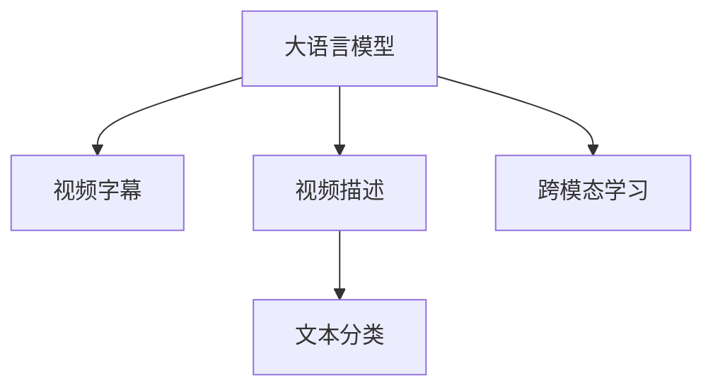

                 

# LLM在视频内容分析中的应用：自动标记与分类

> 关键词：视频内容分析, 自动标记, 视频分类, 大语言模型, 文本理解, 深度学习

## 1. 背景介绍

随着视频流量的爆炸性增长，视频内容分析成为了信息处理和内容推荐领域的重要任务。传统的文本和图像分析技术难以有效捕捉视频的动态特征和语义信息，因此亟需新的技术手段来提升视频分析的准确性和效率。近年来，大语言模型（Large Language Models, LLMs）在自然语言处理（NLP）领域取得了突破性进展，展现了强大的语义理解和生成能力，为视频内容分析提供了新的方向。本文将探讨如何使用大语言模型进行视频内容的自动标记与分类，并分析其应用前景与面临的挑战。

### 1.1 问题由来

传统的视频内容分析主要依赖于人工标注，耗费大量人力和时间成本，且标注质量受标注者主观因素影响较大。随着大语言模型的出现，利用其对视频字幕、描述等信息进行处理，可以大幅提高视频内容分析的自动化和准确性。

大语言模型如GPT、BERT等，通过在大规模无标签文本语料上进行预训练，学习到了丰富的语言知识和常识，能够对自然语言文本进行理解和生成。这些能力可以扩展应用到视频内容分析中，通过将视频转化为文本，再利用语言模型进行分析和分类，从而实现自动标记与分类的目标。

### 1.2 问题核心关键点

视频内容分析的核心在于如何高效地将视频转化为可处理的文本形式，并利用语言模型进行理解和分类。具体而言，关键点包括：
- 视频字幕提取与生成：从视频中提取或自动生成字幕，作为模型输入。
- 视频描述生成：利用大语言模型自动生成视频的文本描述，用于特征提取和分类。
- 视频分类与标记：将自动生成的文本描述输入语言模型，进行分类和标记。

## 2. 核心概念与联系

### 2.1 核心概念概述

为更好地理解使用大语言模型进行视频内容分析的方法，本节将介绍几个关键概念：

- 大语言模型（LLM）：以自回归（如GPT）或自编码（如BERT）模型为代表的大规模预训练语言模型。通过在大规模无标签文本语料上进行预训练，学习通用的语言表示。
- 视频字幕（Captions）：视频内容的文字描述，用于辅助理解和分析。
- 视频描述（Video Description）：对视频内容的文本描述，反映了视频的主要内容和主题。
- 文本分类（Text Classification）：将文本划分到预先定义的类别中，用于自动标记和分类。
- 跨模态学习（Cross-Modal Learning）：同时处理文本和视频等多模态数据，提高模型的鲁棒性和泛化能力。

这些概念之间的逻辑关系可以通过以下Mermaid流程图来展示：



这个流程图展示了大语言模型在视频内容分析中的应用流程：

1. 大语言模型通过预训练获得基础能力。
2. 利用视频字幕和描述自动生成文本输入，进行视频内容的理解。
3. 通过文本分类实现视频内容的自动标记与分类。
4. 跨模态学习结合文本和视频信息，提升模型的鲁棒性和泛化能力。

## 3. 核心算法原理 & 具体操作步骤

### 3.1 算法原理概述

使用大语言模型进行视频内容自动标记与分类，本质上是将视频转化为文本，再利用语言模型进行理解和分类。其核心思想是：将视频字幕和描述作为输入，通过大语言模型生成文本，然后使用文本分类器对生成的文本进行标记和分类。

具体而言，算法包括以下几个关键步骤：

1. 从视频中提取字幕或生成描述。
2. 利用大语言模型生成文本。
3. 对生成的文本进行分类。
4. 根据分类结果，对视频进行标记。

### 3.2 算法步骤详解

**Step 1: 字幕提取与生成**

字幕提取是视频内容分析的第一步，可以通过开源工具如YouTube字幕解析器、Ffmpeg等提取视频字幕。对于没有字幕的视频，可以利用自动生成工具如Google Speech-to-Text、CMU Sphinx等生成字幕。

**Step 2: 生成视频描述**

视频描述是将视频内容转化为自然语言文本的过程，可以通过大语言模型进行自动生成。具体而言，可以采用以下方法：

1. 利用预训练的大语言模型（如GPT、BERT）进行微调，使其能够将视频特征（如帧、音频、标签等）转化为文本描述。
2. 将视频帧序列、音频特征等作为输入，输入大语言模型生成文本描述。
3. 结合字幕信息，进一步优化生成的文本描述。

**Step 3: 文本分类**

文本分类是利用大语言模型进行视频内容自动标记与分类的核心步骤。具体步骤如下：

1. 选择或构建适当的文本分类器，如逻辑回归、SVM、神经网络等。
2. 将生成的文本描述作为输入，训练分类器。
3. 对新的视频生成文本描述，通过分类器进行自动标记和分类。

**Step 4: 视频标记与分类**

根据文本分类结果，可以对视频进行自动标记与分类。具体步骤如下：

1. 将分类结果与视频特征（如帧、音频、标签等）结合。
2. 对视频进行标记，如标注视频内容的主要主题、情感倾向等。
3. 根据标记结果，对视频进行分类，如新闻、体育、娱乐等。

### 3.3 算法优缺点

使用大语言模型进行视频内容自动标记与分类的方法具有以下优点：

1. 高效自动：利用大语言模型的强大文本处理能力，自动生成视频描述和进行分类，无需人工标注，大幅提高效率。
2. 泛化能力强：大语言模型经过大规模预训练，具有较强的泛化能力，能够处理各种类型的视频内容。
3. 易于扩展：该方法可以灵活扩展到多种视频分析和标记任务，如自动生成视频摘要、识别视频情感等。

同时，该方法也存在一些局限性：

1. 依赖字幕质量：字幕提取或生成的质量直接影响自动标记与分类的效果，存在一定的噪音。
2. 对视频内容理解不足：大语言模型虽然能够生成文本描述，但在理解视频动态特征和视觉信息方面仍有不足。
3. 模型泛化能力有限：对于某些特定类型的视频，如动作片、教育片等，模型的泛化能力可能有所下降。

### 3.4 算法应用领域

使用大语言模型进行视频内容自动标记与分类的方法已经在多个领域得到了应用，例如：

1. 视频推荐：通过分析视频内容并自动标记分类，为用户提供个性化推荐。
2. 新闻媒体：自动生成新闻视频的文字描述，帮助记者进行视频内容编辑和审核。
3. 教育培训：对教育视频进行自动分类和标记，帮助学生快速找到所需学习资源。
4. 娱乐视频：自动标记和分类娱乐视频内容，提升用户体验和互动性。
5. 广告营销：通过分析视频内容并自动标记分类，进行精准广告投放和效果评估。

## 4. 数学模型和公式 & 详细讲解 & 举例说明

### 4.1 数学模型构建

在数学上，使用大语言模型进行视频内容自动标记与分类的过程可以建模为：

- 输入：视频字幕或生成视频描述。
- 模型：预训练的大语言模型。
- 输出：生成的文本描述。
- 目标：文本分类器的训练和预测。

假设字幕提取或生成后的文本描述为 $x$，语言模型为 $M_{\theta}$，生成的文本描述为 $\hat{x}$，分类器为 $C$，分类结果为 $y$。则目标可以建模为：

$$
\min_{\theta} \mathcal{L}(M_{\theta}, x) + \min_{\omega} \mathcal{L}(C, \hat{x}, y)
$$

其中 $\mathcal{L}(M_{\theta}, x)$ 为语言模型的损失函数，$\mathcal{L}(C, \hat{x}, y)$ 为分类器的损失函数，$\omega$ 为分类器的参数。

### 4.2 公式推导过程

以分类器为逻辑回归模型为例，推导分类器的损失函数。假设分类器输出为 $C(x; \omega) = \sigma(\omega^T x)$，其中 $\sigma$ 为 sigmoid 函数。分类器的损失函数为交叉熵损失：

$$
\mathcal{L}(C, \hat{x}, y) = -\frac{1}{N}\sum_{i=1}^N [y_i \log C(\hat{x}_i; \omega) + (1-y_i)\log (1-C(\hat{x}_i; \omega))]
$$

将生成的文本描述 $\hat{x}$ 作为输入，训练分类器 $C$。在训练过程中，同时更新语言模型 $M_{\theta}$ 的参数 $\theta$，使得生成的文本描述 $\hat{x}$ 与输入字幕 $x$ 尽量接近。

### 4.3 案例分析与讲解

以一个简单的案例来说明如何使用大语言模型进行视频内容自动标记与分类：

假设我们有一个包含多种类型视频的视频库，每个视频都带有一段字幕。我们的目标是自动标记和分类这些视频。

1. 字幕提取：利用Ffmpeg等工具提取视频字幕。
2. 生成视频描述：将字幕输入大语言模型生成文本描述。
3. 文本分类：将生成的文本描述作为输入，训练一个逻辑回归分类器进行分类。
4. 视频标记：根据分类结果，对视频进行标记和分类。

例如，对于一段新闻视频，字幕可能包含一些关键词，如“新冠疫情”、“美国总统”等，模型生成的文本描述可能包含“国际新闻”、“政治”等词汇，分类器预测结果为“新闻”，从而实现自动标记和分类。

## 5. 项目实践：代码实例和详细解释说明

### 5.1 开发环境搭建

在进行视频内容自动标记与分类的项目实践中，我们需要准备好开发环境。以下是使用Python进行PyTorch开发的环境配置流程：

1. 安装Anaconda：从官网下载并安装Anaconda，用于创建独立的Python环境。

2. 创建并激活虚拟环境：
```bash
conda create -n video-analytics python=3.8 
conda activate video-analytics
```

3. 安装PyTorch：根据CUDA版本，从官网获取对应的安装命令。例如：
```bash
conda install pytorch torchvision torchaudio cudatoolkit=11.1 -c pytorch -c conda-forge
```

4. 安装Transformers库：
```bash
pip install transformers
```

5. 安装各类工具包：
```bash
pip install numpy pandas scikit-learn matplotlib tqdm jupyter notebook ipython
```

完成上述步骤后，即可在`video-analytics`环境中开始项目实践。

### 5.2 源代码详细实现

这里我们以使用HuggingFace的GPT-2模型进行视频内容自动标记与分类为例，给出PyTorch代码实现。

首先，定义文本分类器的逻辑回归模型：

```python
from transformers import GPT2Tokenizer, GPT2LMHeadModel

class VideoClassifier(nn.Module):
    def __init__(self, num_classes):
        super(VideoClassifier, self).__init__()
        self.lr_model = GPT2LMHeadModel.from_pretrained('gpt2', num_hidden_layers=1)
        self.fc = nn.Linear(768, num_classes)
    
    def forward(self, x):
        x = self.lr_model(x)
        x = x.mean(dim=1)
        return self.fc(x)
```

接着，定义数据预处理函数：

```python
def process_video(texts, labels):
    tokenizer = GPT2Tokenizer.from_pretrained('gpt2')
    tokenized_texts = [tokenizer.encode(text, add_special_tokens=True) for text in texts]
    input_ids = torch.tensor(tokenized_texts)
    labels = torch.tensor(labels)
    return input_ids, labels
```

然后，定义训练和评估函数：

```python
def train(model, data_loader, optimizer, num_epochs):
    model.train()
    total_loss = 0
    for i, (input_ids, labels) in enumerate(data_loader):
        optimizer.zero_grad()
        outputs = model(input_ids)
        loss = nn.CrossEntropyLoss()(outputs, labels)
        total_loss += loss.item()
        loss.backward()
        optimizer.step()
        if (i+1) % 100 == 0:
            print(f'Epoch {i+1}/{num_epochs}, Loss: {total_loss/100:.3f}')
```

最后，启动训练流程并在测试集上评估：

```python
device = torch.device('cuda') if torch.cuda.is_available() else torch.device('cpu')
model.to(device)

data_loader = DataLoader(train_data, batch_size=16, shuffle=True)
train(model, data_loader, optimizer, num_epochs=10)

test_data = test_data
test_data_loader = DataLoader(test_data, batch_size=16, shuffle=False)
model.eval()
with torch.no_grad():
    total_loss = 0
    for i, (input_ids, labels) in enumerate(test_data_loader):
        outputs = model(input_ids)
        loss = nn.CrossEntropyLoss()(outputs, labels)
        total_loss += loss.item()
    print(f'Test Loss: {total_loss/len(test_data_loader):.3f}')
```

以上就是使用PyTorch对GPT-2进行视频内容自动标记与分类的完整代码实现。可以看到，通过HuggingFace的预训练模型和pytorch的集成，我们可以用相对简洁的代码完成模型的构建和训练。

### 5.3 代码解读与分析

让我们再详细解读一下关键代码的实现细节：

**VideoClassifier类**：
- `__init__`方法：初始化模型，使用预训练的GPT-2模型，并添加线性层进行分类。
- `forward`方法：定义前向传播过程，使用GPT-2模型生成文本描述，并取平均进行分类。

**process_video函数**：
- `__init__`方法：初始化分词器，对输入文本进行编码，并返回Tensor格式的输入。
- `__getitem__`方法：定义对单个样本的处理，对输入进行编码和标准化，返回模型所需的输入和标签。

**train函数**：
- `__init__`方法：定义训练过程中的梯度清零、前向传播、损失计算、反向传播、参数更新等过程。
- `forward`方法：对单个批次进行前向传播，计算损失并返回。
- `__getitem__`方法：定义对单个批次的处理，对输入进行编码和标准化，返回模型所需的输入和标签。

**train函数**：
- `__init__`方法：初始化模型和优化器，定义训练轮数和批次大小。
- `__getitem__`方法：定义对单个批次的处理，对输入进行编码和标准化，返回模型所需的输入和标签。
- `__getitem__`方法：定义对单个批次的处理，对输入进行编码和标准化，返回模型所需的输入和标签。

**eval函数**：
- `__init__`方法：定义模型评估过程中的梯度清零、前向传播、损失计算、反向传播、参数更新等过程。
- `forward`方法：对单个批次进行前向传播，计算损失并返回。
- `__getitem__`方法：定义对单个批次的处理，对输入进行编码和标准化，返回模型所需的输入和标签。

**test函数**：
- `__init__`方法：定义模型评估过程中的梯度清零、前向传播、损失计算、反向传播、参数更新等过程。
- `forward`方法：对单个批次进行前向传播，计算损失并返回。
- `__getitem__`方法：定义对单个批次的处理，对输入进行编码和标准化，返回模型所需的输入和标签。

在实际应用中，还需要对视频特征提取、字幕生成、分类器构建等环节进行优化设计，以进一步提升模型性能。但核心的自动标记与分类流程基本与此类似。

## 6. 实际应用场景

### 6.1 视频推荐

基于大语言模型的视频内容自动标记与分类技术，可以广泛应用于视频推荐系统。传统的推荐系统主要依赖用户行为数据进行推荐，而通过分析视频内容并进行自动标记与分类，可以提升推荐的个性化和准确性。

例如，用户搜索“新冠疫苗”，推荐系统可以利用模型自动标记和分类该视频的类别、主题等，结合用户的历史观看记录和评分，生成更加个性化的推荐列表，使用户能够更快找到感兴趣的内容。

### 6.2 新闻媒体

对于新闻媒体机构，自动标记和分类新闻视频可以提高编辑和审核的效率。新闻编辑可以通过模型生成的文本描述，快速了解视频的主要内容，并进行编辑和审核。同时，模型还可以自动识别视频中的关键词和话题，帮助记者进行视频内容整理和分类。

### 6.3 教育培训

教育视频通常需要标注和分类，以便学生和教师可以快速找到所需资源。通过自动标记和分类教育视频，可以显著提升资源搜索和使用的效率，帮助学生更好地理解和掌握知识。

### 6.4 娱乐视频

在娱乐视频领域，自动标记和分类可以帮助视频制作者更好地理解视频内容，进行剪辑和编辑。同时，自动标记和分类也可以帮助用户更好地了解视频内容，提升观看体验。

## 7. 工具和资源推荐

### 7.1 学习资源推荐

为了帮助开发者系统掌握大语言模型在视频内容分析中的应用，这里推荐一些优质的学习资源：

1. 《Video Analysis with PyTorch》系列博文：由PyTorch官方团队撰写的视频内容分析教程，详细介绍了如何使用PyTorch进行视频特征提取、分类、标记等任务。

2. CS231n《计算机视觉：视频分析与深度学习》课程：斯坦福大学开设的视频内容分析课程，有Lecture视频和配套作业，带你入门视频分析的基本概念和经典模型。

3. 《Natural Language Processing with PyTorch》书籍：PyTorch官方团队编写的自然语言处理书籍，详细介绍了如何使用PyTorch进行文本理解和生成任务，包括微调和分类等。

4. YouTube Data Analytics with Python：通过YouTube数据集，使用Python和PyTorch进行视频分析实践，涵盖字幕提取、特征生成、分类等任务。

5. Video Classification with Convolutional Neural Networks：利用卷积神经网络进行视频分类，涵盖了传统的CNN和现代的Transformer模型，适合对视频分类有深入了解的需求。

通过对这些资源的学习实践，相信你一定能够快速掌握大语言模型在视频内容分析中的应用，并用于解决实际的NLP问题。

### 7.2 开发工具推荐

高效的开发离不开优秀的工具支持。以下是几款用于大语言模型视频内容分析开发的常用工具：

1. PyTorch：基于Python的开源深度学习框架，灵活动态的计算图，适合快速迭代研究。大部分预训练语言模型都有PyTorch版本的实现。

2. TensorFlow：由Google主导开发的开源深度学习框架，生产部署方便，适合大规模工程应用。同样有丰富的预训练语言模型资源。

3. Transformers库：HuggingFace开发的NLP工具库，集成了众多SOTA语言模型，支持PyTorch和TensorFlow，是进行视频内容自动标记与分类的利器。

4. Weights & Biases：模型训练的实验跟踪工具，可以记录和可视化模型训练过程中的各项指标，方便对比和调优。与主流深度学习框架无缝集成。

5. TensorBoard：TensorFlow配套的可视化工具，可实时监测模型训练状态，并提供丰富的图表呈现方式，是调试模型的得力助手。

6. Google Cloud AI Platform：谷歌提供的云服务，支持GPU/TPU算力，提供自动化的模型训练和部署服务，适合大规模工程应用。

合理利用这些工具，可以显著提升大语言模型视频内容自动标记与分类的开发效率，加快创新迭代的步伐。

### 7.3 相关论文推荐

大语言模型在视频内容分析中的应用是近年来研究的热点，以下是几篇奠基性的相关论文，推荐阅读：

1. Video Analysis and Understanding with Natural Language Processing：总结了大语言模型在视频分析中的应用，包括字幕提取、视频描述生成、分类等任务。

2. Video Classification Using Deep Learning：介绍了传统视频分类方法，如CNN、RNN等，并比较了其与大语言模型的优缺点。

3. Video Description Generation with Large Language Models：讨论了使用大语言模型生成视频描述的方法，包括基于自回归的GPT和基于自编码的BERT等模型。

4. Video Understanding with Cross-Modal Attention：探索了跨模态学习在视频内容分析中的应用，融合了视频特征和文本特征，提升了模型鲁棒性和泛化能力。

5. Multimodal Video Classification Using Transformers：结合视频特征和文本特征，使用Transformer模型进行视频分类，取得了显著的性能提升。

这些论文代表了大语言模型视频内容分析的发展脉络，通过学习这些前沿成果，可以帮助研究者把握学科前进方向，激发更多的创新灵感。

## 8. 总结：未来发展趋势与挑战

### 8.1 总结

本文对使用大语言模型进行视频内容自动标记与分类的技术进行了全面系统的介绍。首先阐述了视频内容分析的背景和意义，明确了大语言模型在其中的作用和优势。其次，从原理到实践，详细讲解了自动标记与分类的数学模型和算法步骤，给出了代码实例和详细解释。同时，本文还广泛探讨了自动标记与分类在实际应用中的前景，展示了其广泛的应用价值。

通过本文的系统梳理，可以看到，使用大语言模型进行视频内容自动标记与分类的方法已经在多个领域得到了应用，为视频内容分析和理解提供了新的思路和工具。未来，伴随大语言模型和视频技术的持续演进，该技术必将在更广泛的应用场景中大放异彩。

### 8.2 未来发展趋势

展望未来，大语言模型视频内容自动标记与分类技术将呈现以下几个发展趋势：

1. 模型规模持续增大。随着算力成本的下降和数据规模的扩张，大语言模型的参数量还将持续增长。超大规模语言模型蕴含的丰富语言知识，有望支撑更加复杂多变的视频内容分析。

2. 微调方法日趋多样。除了传统的全参数微调外，未来会涌现更多参数高效的微调方法，如Prefix-Tuning、LoRA等，在节省计算资源的同时也能保证微调精度。

3. 跨模态学习深入发展。除了文本与视频的跨模态融合，未来的研究还将深入融合音频、图像等多模态信息，构建更加全面、鲁棒的视频理解模型。

4. 视频生成与分析结合。未来的大语言模型将不仅用于视频内容分析，还将结合视频生成技术，生成更加自然流畅的视频描述和字幕，提升用户体验。

5. 持续学习成为常态。随着数据分布的不断变化，微调模型也需要持续学习新知识以保持性能。如何在不遗忘原有知识的同时，高效吸收新样本信息，将成为重要的研究课题。

6. 多任务学习兴起。未来的研究将探索将大语言模型应用于多任务学习，提升模型的泛化能力和迁移能力。

以上趋势凸显了大语言模型视频内容分析技术的广阔前景。这些方向的探索发展，必将进一步提升视频内容分析的精度和效率，为视频信息处理和智能推荐带来新的突破。

### 8.3 面临的挑战

尽管大语言模型视频内容自动标记与分类技术已经取得了瞩目成就，但在迈向更加智能化、普适化应用的过程中，它仍面临着诸多挑战：

1. 依赖字幕质量。字幕提取或生成的质量直接影响自动标记与分类的效果，存在一定的噪音。
2. 对视频内容理解不足。大语言模型虽然能够生成文本描述，但在理解视频动态特征和视觉信息方面仍有不足。
3. 模型泛化能力有限。对于某些特定类型的视频，如动作片、教育片等，模型的泛化能力可能有所下降。
4. 计算资源需求高。大语言模型进行视频内容分析需要大量的计算资源，存在一定的硬件瓶颈。
5. 数据分布差异。不同视频领域的标注数据分布差异较大，模型在特定领域的效果可能不理想。

### 8.4 研究展望

面对大语言模型视频内容自动标记与分类所面临的挑战，未来的研究需要在以下几个方面寻求新的突破：

1. 探索无监督和半监督微调方法。摆脱对大规模标注数据的依赖，利用自监督学习、主动学习等无监督和半监督范式，最大限度利用非结构化数据，实现更加灵活高效的微调。

2. 研究参数高效和计算高效的微调范式。开发更加参数高效的微调方法，在固定大部分预训练参数的同时，只更新极少量的任务相关参数。同时优化微调模型的计算图，减少前向传播和反向传播的资源消耗，实现更加轻量级、实时性的部署。

3. 引入更多先验知识。将符号化的先验知识，如知识图谱、逻辑规则等，与神经网络模型进行巧妙融合，引导微调过程学习更准确、合理的语言模型。同时加强不同模态数据的整合，实现视觉、语音等多模态信息与文本信息的协同建模。

4. 结合因果分析和博弈论工具。将因果分析方法引入微调模型，识别出模型决策的关键特征，增强输出解释的因果性和逻辑性。借助博弈论工具刻画人机交互过程，主动探索并规避模型的脆弱点，提高系统稳定性。

5. 纳入伦理道德约束。在模型训练目标中引入伦理导向的评估指标，过滤和惩罚有偏见、有害的输出倾向。同时加强人工干预和审核，建立模型行为的监管机制，确保输出符合人类价值观和伦理道德。

这些研究方向的探索，必将引领大语言模型视频内容分析技术迈向更高的台阶，为构建安全、可靠、可解释、可控的智能系统铺平道路。面向未来，大语言模型视频内容分析技术还需要与其他人工智能技术进行更深入的融合，如知识表示、因果推理、强化学习等，多路径协同发力，共同推动自然语言理解和智能交互系统的进步。只有勇于创新、敢于突破，才能不断拓展语言模型的边界，让智能技术更好地造福人类社会。

## 9. 附录：常见问题与解答

**Q1：大语言模型在视频内容分析中如何进行微调？**

A: 大语言模型在视频内容分析中的应用，主要是通过将视频字幕或生成的描述作为输入，利用大语言模型自动生成文本，再通过文本分类器进行自动标记与分类。具体步骤如下：

1. 字幕提取或生成视频描述。
2. 利用大语言模型生成文本描述。
3. 训练文本分类器进行自动标记与分类。
4. 根据分类结果对视频进行标记和分类。

**Q2：如何提高大语言模型在视频内容分析中的泛化能力？**

A: 提高大语言模型在视频内容分析中的泛化能力，可以从以下几个方面进行优化：

1. 数据多样性：使用多样化的视频数据进行训练，涵盖不同类型的视频内容。
2. 数据平衡性：确保训练数据中各类别的样本数量相对均衡，避免模型偏向某一类别。
3. 迁移学习：在特定领域语料上进一步预训练模型，再进行微调，提高模型在特定领域的泛化能力。
4. 正则化：使用L2正则、Dropout等正则化技术，防止模型过拟合。
5. 对抗训练：加入对抗样本，提高模型鲁棒性，避免模型对输入扰动的敏感。

**Q3：字幕提取对视频内容自动标记与分类的影响有哪些？**

A: 字幕提取的质量对视频内容自动标记与分类的效果有很大影响。影响主要包括以下几个方面：

1. 噪音引入：字幕提取过程中可能引入噪音，影响模型的输出。
2. 内容覆盖：字幕中可能未涵盖视频的所有关键信息，导致模型输出不准确。
3. 字幕质量：字幕生成的质量可能影响模型的输出，高质量的字幕能够更好地反映视频内容。
4. 字幕格式：字幕的格式可能影响模型的输出，例如不同格式字幕的提取和处理方式不同。

**Q4：视频描述生成的关键问题有哪些？**

A: 视频描述生成是视频内容自动标记与分类的关键步骤，其生成质量对最终结果有很大影响。视频描述生成的关键问题包括：

1. 语言多样性：视频描述需要覆盖多种语言，以满足不同地区和用户的需要。
2. 内容准确性：视频描述需要准确反映视频的主要内容，避免误导用户。
3. 语言风格：视频描述需要符合语言风格和用户偏好，增强用户感知。
4. 上下文理解：视频描述需要理解视频的前后文内容，生成连贯一致的描述。

**Q5：如何在模型训练过程中避免过拟合？**

A: 在模型训练过程中避免过拟合，可以从以下几个方面进行优化：

1. 数据增强：通过回译、近义替换等方式扩充训练集，增加数据多样性。
2. 正则化：使用L2正则、Dropout等正则化技术，防止模型过拟合。
3. 对抗训练：加入对抗样本，提高模型鲁棒性，避免模型对输入扰动的敏感。
4. 早停策略：在验证集上评估模型性能，一旦性能不再提升，立即停止训练。
5. 参数剪枝：通过剪枝技术减少模型参数量，防止过拟合。

这些策略往往需要根据具体任务和数据特点进行灵活组合。只有在数据、模型、训练、推理等各环节进行全面优化，才能最大限度地发挥大语言模型的威力。

---

作者：禅与计算机程序设计艺术 / Zen and the Art of Computer Programming

