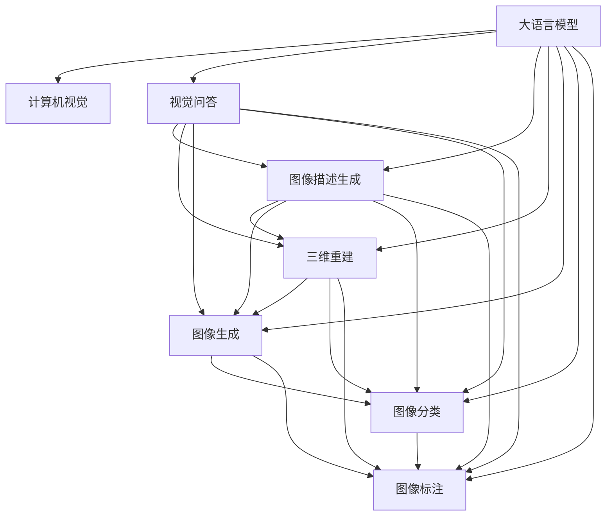
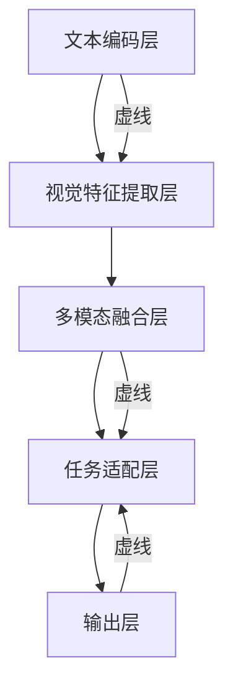

                 

# LLM在计算机视觉领域的应用拓展

> 关键词：大语言模型, 计算机视觉, 自然语言与视觉融合, 视觉问答, 图像描述生成, 三维重建, 图像生成, 图像分类, 图像标注

## 1. 背景介绍

### 1.1 问题由来

近年来，随着深度学习技术的迅速发展，大语言模型(LLMs)在自然语言处理(NLP)领域取得了显著的进步。这些模型通过在大规模无标签文本数据上进行预训练，学习到了丰富的语言知识和常识，能够进行自然语言理解和生成。然而，当将LLMs应用于计算机视觉领域时，它们往往面临如下挑战：

- **数据表示差异**：LLMs主要处理文本数据，而计算机视觉处理的是图像数据。如何在两者之间建立有效的转换和融合机制，是一个关键问题。
- **知识泛化能力**：LLMs通常对视觉数据的泛化能力不足，无法直接应用于复杂的视觉识别和推理任务。
- **缺乏空间感知**：LLMs缺乏直接处理图像像素信息的能力，无法直接从视觉数据中提取空间特征。

为了克服这些挑战，研究人员和工程师们开始探索将LLMs与计算机视觉技术相结合的新方法，以实现自然语言与视觉数据的协同处理。

### 1.2 问题核心关键点

为了有效结合自然语言和视觉数据，关键在于以下几个方面：

- **语义与视觉映射**：如何建立文本描述与图像之间的语义对应关系。
- **视觉信息提取**：如何在LLMs中嵌入视觉特征，使得模型能够理解图像内容。
- **跨模态融合**：如何将文本和图像信息进行融合，实现多模态信息互补。

## 2. 核心概念与联系

### 2.1 核心概念概述

本节将介绍几个关键概念，它们构成了将LLMs应用于计算机视觉领域的基础：

- **大语言模型(LLMs)**：以自回归或自编码方式预训练的大型语言模型，能够处理大规模文本数据，进行自然语言理解和生成。
- **计算机视觉**：利用计算机对图像进行处理、分析，以实现自动化的视觉识别、分类和生成等任务的技术。
- **跨模态学习**：涉及不同类型数据（如文本、图像、音频等）的联合学习，目的是在不同模态之间建立有效的信息映射和融合机制。
- **视觉问答系统**：通过输入自然语言问题和视觉图像，自动生成文本回答的计算机系统。
- **图像描述生成**：从图像生成自然语言描述的自动化过程。
- **三维重建**：从单张或多张二维图像重建三维物体的技术。
- **图像生成**：利用深度学习模型生成逼真图像的过程。
- **图像分类**：将图像分类到预定义的类别中的任务。
- **图像标注**：为图像添加标签或注释的过程，常用于数据增强和可视化。

这些核心概念之间的逻辑关系可以通过以下Mermaid流程图来展示：



这个流程图展示了大语言模型与计算机视觉技术之间的潜在关联，以及它们在各种跨模态任务中的应用。

## 3. 核心算法原理 & 具体操作步骤

### 3.1 算法原理概述

将大语言模型应用于计算机视觉领域，其核心思想是建立自然语言与视觉数据的映射关系，并在此基础上进行融合和处理。具体来说，可以分为以下几个步骤：

1. **语义映射**：将视觉数据转化为自然语言描述，构建视觉语义空间。
2. **信息融合**：将自然语言信息与视觉特征进行融合，提升模型对多模态信息的理解能力。
3. **任务适配**：根据具体计算机视觉任务，适配模型输出，实现视觉任务的自动化处理。

### 3.2 算法步骤详解

#### 3.2.1 语义映射

语义映射的目的是将图像转化为自然语言描述。这可以通过以下步骤实现：

1. **图像描述生成**：使用预训练的图像生成模型（如CLIP、DALL-E等）将图像转化为文本描述。
2. **文本编码**：使用大语言模型（如GPT-3、BERT等）对文本描述进行编码，得到语义向量。

#### 3.2.2 信息融合

信息融合的目的是将自然语言语义向量与视觉特征进行联合建模。这可以通过以下步骤实现：

1. **视觉特征提取**：使用预训练的视觉特征提取器（如ResNet、Inception等）提取图像的特征向量。
2. **多模态融合**：将自然语言语义向量与视觉特征向量进行融合，得到融合后的向量表示。
3. **融合模型训练**：使用带有融合层的神经网络（如Siamese、Triplet Network等）训练模型，使得模型能够学习到自然语言与视觉数据的联合表示。

#### 3.2.3 任务适配

任务适配的目的是根据具体计算机视觉任务，调整模型的输出形式和处理逻辑。这可以通过以下步骤实现：

1. **任务定义**：根据具体任务，定义模型的输出格式（如分类标签、文本回答等）。
2. **模型适配**：使用微调或转移学习的方式，适配模型的输出层和损失函数，使其适应特定任务。
3. **模型训练**：在带有融合层的神经网络基础上，使用标注数据进行微调或训练，优化模型在特定任务上的性能。

### 3.3 算法优缺点

#### 3.3.1 优点

1. **跨模态处理能力**：能够同时处理自然语言和视觉数据，实现多模态信息的互补。
2. **广泛应用**：适用于视觉问答、图像描述生成、三维重建、图像生成等多种计算机视觉任务。
3. **模型可解释性**：利用自然语言模型，可以解释模型决策过程，提供更清晰的推理逻辑。

#### 3.3.2 缺点

1. **数据复杂性**：需要同时处理文本和图像数据，数据获取和预处理较为复杂。
2. **计算成本高**：预训练和微调模型的计算资源需求较高，模型训练和推理时间较长。
3. **模型泛化能力不足**：由于模型结构复杂，可能存在过拟合问题，泛化能力较弱。

### 3.4 算法应用领域

将LLMs应用于计算机视觉领域，可以在以下几个方面实现突破：

- **视觉问答系统**：如通过输入自然语言问题和图像，生成文本回答。
- **图像描述生成**：自动从图像生成自然语言描述，用于图像标注、检索和推荐。
- **三维重建**：从单张或多张二维图像重建三维物体，用于虚拟现实、增强现实等领域。
- **图像生成**：利用LLMs生成逼真图像，用于图像编辑、艺术创作等领域。
- **图像分类**：使用LLMs对图像进行分类，识别物体种类、场景等。
- **图像标注**：自动为图像添加标签或注释，用于数据增强和可视化。

## 4. 数学模型和公式 & 详细讲解 & 举例说明

### 4.1 数学模型构建

为了将LLMs应用于计算机视觉领域，我们需要构建一个跨模态学习模型。以下是一个典型的跨模态学习模型框架：



在这个框架中，我们首先使用预训练的文本编码层（如BERT、GPT等）将输入的文本描述转化为语义向量。然后，使用预训练的视觉特征提取层（如ResNet、Inception等）提取图像特征向量。接着，使用多模态融合层（如Siamese Network、Triplet Network等）将文本语义向量与视觉特征向量进行融合，得到一个联合表示。最后，使用任务适配层和输出层，根据具体计算机视觉任务，适配模型输出和损失函数。

### 4.2 公式推导过程

假设我们有一个文本描述 $T$ 和一个图像 $I$，要将其映射到一个联合表示 $Z$。我们可以使用如下公式：

$$
Z = f_{\theta}(T, I)
$$

其中，$f_{\theta}$ 是一个带有融合层的神经网络，$\theta$ 是该网络的所有参数。在实际应用中，$f_{\theta}$ 可以通过端到端训练的方式学习到文本和图像的联合表示。

### 4.3 案例分析与讲解

以图像描述生成为例，我们可以使用CLIP模型来进行语义映射。CLIP模型是一个跨模态预训练模型，能够将图像和文本映射到相同的语义空间。使用CLIP模型进行图像描述生成的步骤如下：

1. **文本编码**：使用CLIP模型将自然语言描述 $T$ 编码为文本表示 $E(T)$。
2. **图像编码**：使用CLIP模型将图像 $I$ 编码为图像表示 $E(I)$。
3. **融合**：将文本表示 $E(T)$ 和图像表示 $E(I)$ 进行融合，得到联合表示 $Z$。
4. **输出**：使用大语言模型（如GPT-3）对联合表示 $Z$ 进行解码，生成文本描述。

## 5. 项目实践：代码实例和详细解释说明

### 5.1 开发环境搭建

在进行LLMs应用于计算机视觉的项目实践前，我们需要准备好开发环境。以下是使用Python进行PyTorch开发的环境配置流程：

1. 安装Anaconda：从官网下载并安装Anaconda，用于创建独立的Python环境。

2. 创建并激活虚拟环境：
```bash
conda create -n cv-env python=3.8 
conda activate cv-env
```

3. 安装PyTorch：根据CUDA版本，从官网获取对应的安装命令。例如：
```bash
conda install pytorch torchvision torchaudio cudatoolkit=11.1 -c pytorch -c conda-forge
```

4. 安装相关的计算机视觉库：
```bash
pip install torchvision opencv-python matplotlib scikit-image scikit-learn pandas jupyter notebook ipython
```

完成上述步骤后，即可在`cv-env`环境中开始项目实践。

### 5.2 源代码详细实现

下面是使用PyTorch进行跨模态学习模型的代码实现。

```python
import torch
from torchvision import models, transforms
from transformers import BertForMaskedLM, BertTokenizer

# 加载预训练的BERT模型和tokenizer
model = BertForMaskedLM.from_pretrained('bert-base-uncased')
tokenizer = BertTokenizer.from_pretrained('bert-base-uncased')

# 加载预训练的计算机视觉模型
model_vision = models.resnet50(pretrained=True)
model_vision.eval()

# 加载数据
transform = transforms.Compose([
    transforms.Resize(224),
    transforms.ToTensor(),
    transforms.Normalize(mean=[0.485, 0.456, 0.406], std=[0.229, 0.224, 0.225])
])
data = datasets.ImageFolder(root='data', transform=transform)
loader = torch.utils.data.DataLoader(data, batch_size=4, shuffle=True)

# 文本编码
def text_encoding(text):
    inputs = tokenizer.encode_plus(text, max_length=64, padding='max_length', return_tensors='pt')
    return inputs['input_ids'], inputs['attention_mask']

# 视觉特征提取
def visual_feature_extraction(image):
    with torch.no_grad():
        features = model_vision(image)
        return features

# 多模态融合
def multimodal_fusion(text, image):
    text_input, text_mask = text_encoding(text)
    image_feature = visual_feature_extraction(image)
    text_representation = model(text_input, attention_mask=text_mask)
    return torch.cat((text_representation, image_feature), dim=1)

# 融合模型训练
def train(model, data_loader, loss_fn):
    model.train()
    for i, (text, image) in enumerate(data_loader):
        text_input, text_mask = text_encoding(text)
        image_feature = visual_feature_extraction(image)
        text_representation = model(text_input, attention_mask=text_mask)
        fusion_representation = multimodal_fusion(text, image)
        loss = loss_fn(fusion_representation, image_feature)
        loss.backward()
        optimizer.step()

# 定义损失函数
def get_loss(model, fusion_representation, image_feature):
    return torch.mean((model(fusion_representation) - image_feature)**2)

# 加载数据
data_loader = torch.utils.data.DataLoader(data, batch_size=4, shuffle=True)

# 训练模型
model.train()
optimizer = torch.optim.Adam(model.parameters(), lr=2e-5)
loss_fn = torch.nn.L1Loss()

for epoch in range(10):
    train(model, data_loader, loss_fn)

# 评估模型
model.eval()
with torch.no_grad():
    for text, image in data_loader:
        text_input, text_mask = text_encoding(text)
        image_feature = visual_feature_extraction(image)
        fusion_representation = multimodal_fusion(text, image)
        output = model(fusion_representation)
        loss = loss_fn(output, image_feature)
        print(f'Epoch {epoch+1}, loss: {loss.item()}')
```

这段代码实现了从文本描述和图像中生成联合表示的过程，可以用于各种跨模态学习任务。

### 5.3 代码解读与分析

让我们再详细解读一下关键代码的实现细节：

- **文本编码**：使用BERT模型将文本描述编码成向量表示。
- **视觉特征提取**：使用ResNet模型提取图像特征向量。
- **多模态融合**：将文本向量与图像向量拼接，得到融合后的向量表示。
- **融合模型训练**：使用L1损失函数，将融合后的向量与图像特征进行对比，进行端到端训练。
- **模型评估**：在训练结束后，使用评估数据集评估模型性能，输出损失值。

## 6. 实际应用场景

### 6.1 视觉问答系统

视觉问答系统是一种典型的跨模态学习应用，其目的是通过输入自然语言问题和图像，自动生成文本回答。在实际应用中，我们可以使用微调后的BERT模型进行文本编码，结合预训练的视觉特征提取器（如ResNet、Inception等）提取图像特征向量，通过多模态融合层（如Siamese Network、Triplet Network等）将文本语义向量与视觉特征向量进行融合，得到联合表示。最后，使用微调的BERT模型对联合表示进行解码，生成文本回答。

### 6.2 图像描述生成

图像描述生成是指自动从图像生成自然语言描述的过程。使用预训练的视觉特征提取器（如ResNet、Inception等）提取图像特征向量，使用大语言模型（如GPT-3）对特征向量进行解码，生成文本描述。通过微调大语言模型，可以提高其生成高质量文本描述的能力，从而实现更加智能化的图像描述生成。

### 6.3 三维重建

三维重建是指从单张或多张二维图像重建三维物体的过程。使用深度学习模型（如PointNet、Pix2Pix等）将二维图像转化为三维点云或体素表示，然后结合自然语言模型进行语义映射，生成高质量的文本描述。通过跨模态融合，可以实现对三维物体的精确重建和描述。

### 6.4 图像生成

图像生成是指利用深度学习模型生成逼真图像的过程。使用生成对抗网络（GANs）或变分自编码器（VAEs）等模型，将文本描述映射到图像空间。通过端到端训练，可以实现从自然语言到图像的自动生成。

### 6.5 图像分类

图像分类是指将图像分类到预定义的类别中的任务。使用大语言模型（如BERT、GPT等）对图像特征进行语义编码，然后结合图像分类器（如CNN、RNN等）进行联合训练。通过多模态融合，可以实现更加精准的图像分类。

### 6.6 图像标注

图像标注是指为图像添加标签或注释的过程。使用预训练的视觉特征提取器（如ResNet、Inception等）提取图像特征向量，使用大语言模型（如BERT、GPT等）对特征向量进行语义编码，然后结合图像分类器进行联合训练。通过多模态融合，可以实现自动化的图像标注和注释。

## 7. 工具和资源推荐

### 7.1 学习资源推荐

为了帮助开发者系统掌握LLMs在计算机视觉领域的应用，这里推荐一些优质的学习资源：

1. 《Computer Vision: Principles and Practices》：由加州大学圣地亚哥分校（UCSD）提供，涵盖了计算机视觉领域的核心概念和经典模型。

2. 《Natural Language Processing with Transformers》：HuggingFace官方教程，介绍了Transformer在自然语言处理中的应用，包括跨模态学习。

3. 《Deep Learning for Computer Vision》：由李航教授编写，介绍了深度学习在计算机视觉中的应用，包括图像生成、分类等任务。

4. 《Learning from Images: Deep Learning, Statistics and Transfer Learning》：Springer出版社的书籍，介绍了计算机视觉领域的深度学习模型和方法。

5. 《The Visual Word: The World as Text》：一本关于视觉词的书籍，探讨了如何利用文本与图像的结合进行计算机视觉任务。

### 7.2 开发工具推荐

在实际开发中，还需要一些高质量的工具和框架，以下是几个常用的推荐：

1. PyTorch：开源深度学习框架，灵活动态的计算图，适合快速迭代研究。

2. TensorFlow：由Google主导开发的深度学习框架，生产部署方便，适合大规模工程应用。

3. OpenCV：开源计算机视觉库，提供了丰富的图像处理和特征提取工具。

4. Matplotlib：Python的可视化库，用于绘制和展示训练过程中的损失和准确率等指标。

5. TensorBoard：TensorFlow配套的可视化工具，可实时监测模型训练状态，并提供丰富的图表呈现方式。

6. Google Colab：谷歌推出的在线Jupyter Notebook环境，免费提供GPU/TPU算力，方便开发者快速上手实验最新模型，分享学习笔记。

合理利用这些工具，可以显著提升LLMs在计算机视觉领域的应用开发效率，加快创新迭代的步伐。

### 7.3 相关论文推荐

LLMs在计算机视觉领域的研究成果丰硕，以下是几篇奠基性的相关论文，推荐阅读：

1. VQA: Visual Question Answering with Spatial Reasoning：提出了基于Spatial Transformer Network的视觉问答系统，利用空间推理提高问答准确率。

2. Show and Tell: A Neural Image Caption Generator：利用LSTM和CNN的结合，实现了从图像生成自然语言描述的过程。

3. Generating 3D from 2D Images in the Wild：利用变分自编码器和深度生成模型，实现了从单张二维图像生成三维物体的过程。

4. DeepLearning-based Image Describing System for WTs: An Improved Approach：利用卷积神经网络（CNN）和循环神经网络（RNN）的结合，实现了图像描述生成系统。

5. Enhancing 3D Object Reconstruction Using Natural Language Descriptions：利用大语言模型和三维重建算法，实现了基于文本描述的三维物体重建。

这些论文代表了大语言模型在计算机视觉领域的发展脉络，通过学习这些前沿成果，可以帮助研究者把握学科前进方向，激发更多的创新灵感。

## 8. 总结：未来发展趋势与挑战

### 8.1 研究成果总结

本文对将大语言模型应用于计算机视觉领域进行了全面系统的介绍。首先阐述了在大规模无标签文本数据上进行预训练的大语言模型和计算机视觉技术的背景，明确了跨模态学习在实现自然语言与视觉数据协同处理中的关键作用。其次，从原理到实践，详细讲解了跨模态学习模型的构建、训练和评估过程，给出了跨模态学习任务开发的完整代码实例。同时，本文还广泛探讨了LLMs在视觉问答、图像描述生成、三维重建、图像生成、图像分类、图像标注等计算机视觉任务中的应用前景，展示了跨模态学习技术的巨大潜力。此外，本文精选了跨模态学习的各类学习资源，力求为读者提供全方位的技术指引。

通过本文的系统梳理，可以看到，将大语言模型应用于计算机视觉领域，能够实现多模态信息的互补，显著提升计算机视觉系统的智能化水平，拓宽了计算机视觉技术的应用边界。未来，伴随预训练语言模型和跨模态学习方法的持续演进，相信LLMs将在计算机视觉领域带来更多的创新应用。

### 8.2 未来发展趋势

展望未来，跨模态学习技术将呈现以下几个发展趋势：

1. **跨模态预训练模型**：构建更加强大的跨模态预训练模型，能够在多模态数据上学习到统一的表示空间。

2. **多模态联合训练**：引入多模态联合训练策略，使得模型能够同时学习到文本和视觉数据的表示。

3. **零样本学习**：利用预训练模型和跨模态联合训练策略，实现零样本学习，即在没有具体标注数据的情况下，仍然能够对新任务进行推理和生成。

4. **多模态推理**：引入多模态推理机制，使得模型能够对多模态数据进行联合推理，提高推理的准确性和鲁棒性。

5. **模型压缩与优化**：开发更加轻量级的跨模态模型，使用模型压缩、稀疏化存储等技术，提高模型的实时性和计算效率。

6. **自适应学习**：引入自适应学习机制，使得模型能够根据输入数据的类型和特点，动态调整输出和推理逻辑。

以上趋势凸显了跨模态学习技术的广阔前景，这些方向的探索发展，必将进一步提升计算机视觉系统的性能和应用范围，为人类认知智能的进化带来深远影响。

### 8.3 面临的挑战

尽管跨模态学习技术已经取得了瞩目成就，但在迈向更加智能化、普适化应用的过程中，它仍面临着诸多挑战：

1. **数据复杂性**：跨模态学习需要处理文本和图像等多种类型的数据，数据获取和预处理较为复杂。

2. **计算资源需求高**：预训练和微调模型的计算资源需求较高，模型训练和推理时间较长。

3. **模型泛化能力不足**：由于模型结构复杂，可能存在过拟合问题，泛化能力较弱。

4. **模型解释性不足**：当前跨模态模型缺乏足够的解释性，难以解释其内部工作机制和决策逻辑。

5. **安全性有待保障**：跨模态模型可能学习到有偏见、有害的信息，如何确保输出安全性，仍然是一个重要问题。

6. **跨模态特征对齐问题**：文本和视觉数据具有不同的特征表示，如何对齐这些特征表示，仍然是一个具有挑战性的问题。

### 8.4 研究展望

面对跨模态学习面临的种种挑战，未来的研究需要在以下几个方面寻求新的突破：

1. **多模态预训练模型**：开发更加强大的跨模态预训练模型，能够在多模态数据上学习到统一的表示空间。

2. **多模态联合训练**：引入多模态联合训练策略，使得模型能够同时学习到文本和视觉数据的表示。

3. **零样本学习**：利用预训练模型和跨模态联合训练策略，实现零样本学习，即在没有具体标注数据的情况下，仍然能够对新任务进行推理和生成。

4. **多模态推理**：引入多模态推理机制，使得模型能够对多模态数据进行联合推理，提高推理的准确性和鲁棒性。

5. **模型压缩与优化**：开发更加轻量级的跨模态模型，使用模型压缩、稀疏化存储等技术，提高模型的实时性和计算效率。

6. **自适应学习**：引入自适应学习机制，使得模型能够根据输入数据的类型和特点，动态调整输出和推理逻辑。

7. **模型解释性**：引入可解释性机制，使得模型能够解释其内部工作机制和决策逻辑，提高模型的可信度和可控性。

8. **安全性**：引入安全性机制，确保模型输出的安全性和可靠性，避免有害信息输出。

9. **跨模态特征对齐**：研究跨模态特征对齐方法，使得文本和视觉数据能够进行有效的融合和推理。

这些研究方向的探索，必将引领跨模态学习技术迈向更高的台阶，为计算机视觉领域带来更多的创新应用。相信随着学界和产业界的共同努力，这些挑战终将一一被克服，跨模态学习技术必将在计算机视觉领域迎来新的突破，为人类认知智能的进化带来深远影响。

## 9. 附录：常见问题与解答

**Q1：大语言模型和计算机视觉模型是否可以简单叠加使用？**

A: 大语言模型和计算机视觉模型虽然能够分别处理自然语言和视觉数据，但它们处理数据的特征空间不同，直接叠加使用可能无法实现有效的信息融合。需要进行多模态融合层的训练，才能使得两种模型能够进行有效的联合处理。

**Q2：跨模态学习中的多模态融合策略有哪些？**

A: 跨模态学习中的多模态融合策略包括：

- **拼接融合**：将文本和视觉特征拼接，然后通过全连接层进行融合。

- **注意力融合**：使用注意力机制，对文本和视觉特征进行加权融合。

- **残差融合**：使用残差连接，将文本和视觉特征进行级联融合。

- **异构图谱融合**：将文本和视觉特征映射到异构图谱中，进行联合嵌入和推理。

这些策略可以根据具体任务和数据特点进行灵活选择。

**Q3：如何提高跨模态模型的泛化能力？**

A: 提高跨模态模型的泛化能力，可以从以下几个方面进行优化：

- **数据增强**：通过数据增强技术，丰富训练集的多样性，提高模型的泛化能力。

- **正则化**：使用正则化技术，如L2正则、Dropout等，防止模型过拟合。

- **迁移学习**：利用预训练模型和跨模态联合训练策略，提高模型的泛化能力。

- **模型压缩**：使用模型压缩和稀疏化存储等技术，减少模型复杂度，提高泛化能力。

- **多模态联合训练**：利用多模态联合训练策略，提高模型对多模态数据的理解能力。

这些策略可以结合使用，以提高跨模态模型的泛化能力。

**Q4：跨模态学习中的模型压缩有哪些方法？**

A: 跨模态学习中的模型压缩方法包括：

- **参数剪枝**：通过剪枝算法，删除冗余参数，减少模型尺寸。

- **低秩分解**：使用低秩分解技术，将矩阵表示为低秩矩阵乘积的形式，减少模型参数量。

- **知识蒸馏**：利用蒸馏技术，将大模型的知识传递给小模型，减少小模型的参数量。

- **量化加速**：使用量化技术，将浮点模型转化为定点模型，减少存储空间和计算资源消耗。

- **模型并行**：使用模型并行技术，将模型分为多个子模型并行处理，减少计算时间。

这些方法可以结合使用，以提高跨模态模型的压缩效率。

**Q5：如何设计跨模态学习任务的目标函数？**

A: 跨模态学习任务的目标函数设计，需要考虑以下几个因素：

- **任务特点**：根据具体任务的性质，设计相应的目标函数。如对于视觉问答任务，可以使用分类交叉熵损失；对于图像描述生成任务，可以使用L1或L2损失。

- **数据分布**：考虑训练数据和测试数据之间的分布差异，设计合适的损失函数。如在数据分布不平衡的情况下，可以引入类别权重调整。

- **模型复杂度**：考虑模型的复杂度，避免过拟合。如在模型复杂度高的情况下，可以使用正则化技术或数据增强策略。

- **可解释性**：考虑模型的可解释性，设计易于理解的损失函数。如使用可解释性较高的L1损失，便于理解模型的决策过程。

这些因素可以综合考虑，设计出合适的目标函数，以提高模型的性能和泛化能力。

---

作者：禅与计算机程序设计艺术 / Zen and the Art of Computer Programming

