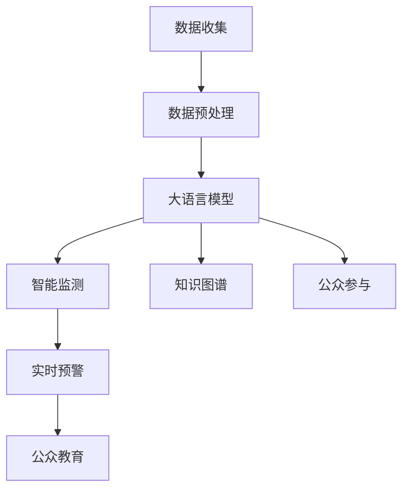

                 

# LLM在野生动物保护中的应用：AI生态卫士

> 关键词：大语言模型, 野生动物保护, AI生态卫士, 智能监测, 数据驱动, 图像识别, 自然语言处理

## 1. 背景介绍

### 1.1 问题由来
随着人工智能技术的迅猛发展，大语言模型（Large Language Models, LLMs）在多个领域展现出了强大的潜力。然而，大语言模型在自然语言处理（Natural Language Processing, NLP）和计算机视觉领域的广泛应用，使其在野生动物保护等资源紧缺且生态环境复杂的领域中具有独特的应用价值。

近年来，全球野生动物的生存状况令人担忧，盗猎、栖息地破坏、气候变化等问题严重威胁着生物多样性。如何高效、准确地监测野生动物，是野生动物保护工作中面临的巨大挑战。传统的人工监测方法成本高、效率低，且受人为因素影响较大，难以适应广泛、频繁且实时化的监测需求。

大语言模型作为一种先进的人工智能技术，其强大的语言理解、知识获取和推理能力，使其在野生动物保护领域展现出广阔的应用前景。通过将大语言模型应用于野生动物保护工作，可以极大地提高监测效率和准确性，为保护濒危物种、维护生态平衡提供技术支持。

### 1.2 问题核心关键点
本节将详细阐述大语言模型在野生动物保护中的应用核心关键点：

- **数据驱动的监测与分析**：利用大语言模型处理和分析大量野生动物的监测数据，包括图像、声音、文本等多种形式的生态数据。
- **智能监测与预警系统**：构建基于大语言模型的智能监测系统，实时监测野生动物的动态，提前预警非法盗猎、破坏栖息地等行为。
- **知识图谱与专家系统**：利用大语言模型的知识图谱能力，构建专家系统，提供精准的野生动物保护策略和解决方案。
- **公众参与与教育**：通过大语言模型增强公众对野生动物保护的认识和参与度，促进生态保护的广泛合作与共同努力。

这些关键点将有助于深入理解大语言模型在野生动物保护中的应用潜力，并指导实际操作的实施。

## 2. 核心概念与联系

### 2.1 核心概念概述

为了更好地理解大语言模型在野生动物保护中的应用，首先需要了解几个核心概念：

- **大语言模型（LLMs）**：基于Transformer等架构的深度学习模型，能够理解、生成和处理自然语言，广泛应用于NLP、计算机视觉、知识图谱等领域。
- **知识图谱**：由节点和边组成的图结构，用于描述实体之间的关系，能够辅助大语言模型理解和推理。
- **智能监测系统**：利用传感器、摄像头等设备，收集野生动物的实时数据，并通过大语言模型进行处理和分析，实现对野生动物的智能监测和预警。
- **公众参与与教育**：利用大语言模型向公众普及野生动物保护知识，增强公众的生态意识和参与度。

这些核心概念之间通过特定的任务和方法紧密联系，共同构成了大语言模型在野生动物保护中的应用框架。

### 2.2 核心概念原理和架构的 Mermaid 流程图

以下是一个简化版的核心概念原理和架构的 Mermaid 流程图，展示了大语言模型在野生动物保护中的应用：



这个流程图展示了从数据收集到公众参与的整个过程，以及大语言模型在其中扮演的重要角色。

## 3. 核心算法原理 & 具体操作步骤

### 3.1 算法原理概述

大语言模型在野生动物保护中的应用主要基于以下几个算法原理：

- **数据驱动的监测与分析**：大语言模型可以处理和分析大量的野生动物的监测数据，包括图像、声音、文本等。通过这些数据，模型可以学习野生动物的特征、行为模式和生态关系，从而进行智能监测和预警。
- **知识图谱与专家系统**：利用大语言模型的知识图谱能力，可以构建专家系统，提供精准的野生动物保护策略和解决方案。知识图谱通过对实体的关系和属性的描述，帮助模型理解复杂的生态系统。
- **智能监测与预警系统**：通过大语言模型的图像识别、自然语言处理和推理能力，可以构建智能监测系统，实现对野生动物的实时监测和预警。系统可以根据监测数据和历史知识，预测并提前警示潜在的威胁。

### 3.2 算法步骤详解

大语言模型在野生动物保护中的应用主要包括以下几个关键步骤：

**Step 1: 数据收集与预处理**

1. **数据收集**：利用传感器、摄像头等设备，收集野生动物的实时数据，包括图像、声音、文本等。
2. **数据预处理**：对收集到的数据进行清洗、归一化、标注等预处理步骤，使其适合大语言模型的输入格式。

**Step 2: 模型训练与优化**

1. **模型训练**：利用预处理后的数据，在大语言模型上训练，使其学习野生动物的特征和行为模式。
2. **模型优化**：通过调整模型参数、选择合适的损失函数等，优化模型性能，提高监测和预警的准确性。

**Step 3: 智能监测与预警**

1. **实时监测**：将实时收集的数据输入模型，进行智能分析，输出监测结果。
2. **预警系统**：根据监测结果，结合历史知识，预警可能的威胁，如非法盗猎、栖息地破坏等。

**Step 4: 公众参与与教育**

1. **公众教育**：利用大语言模型，向公众普及野生动物保护知识，增强生态意识和参与度。
2. **公众参与**：收集公众的反馈和建议，优化监测系统和保护策略。

### 3.3 算法优缺点

**优点**：

- **高效性与准确性**：大语言模型能够高效处理大量监测数据，准确识别野生动物的特征和行为，提高监测和预警的准确性。
- **可扩展性与灵活性**：大语言模型可以适用于不同的监测场景和任务，具有较强的灵活性和可扩展性。
- **数据驱动与知识图谱**：结合数据驱动和知识图谱，能够提供精准的保护策略和解决方案，提升生态保护的效果。

**缺点**：

- **数据需求高**：大语言模型需要大量高质量的监测数据进行训练，数据采集和预处理成本较高。
- **计算资源消耗大**：模型训练和推理需要大量的计算资源，对硬件设备的要求较高。
- **模型解释性与可控性**：大语言模型作为"黑盒"系统，缺乏可解释性和可控性，可能导致难以理解和调试。

### 3.4 算法应用领域

大语言模型在野生动物保护中的应用领域包括：

- **智能监测系统**：实时监测野生动物的动态，提前预警非法盗猎、破坏栖息地等行为。
- **知识图谱与专家系统**：提供精准的野生动物保护策略和解决方案，辅助生态保护决策。
- **公众参与与教育**：向公众普及野生动物保护知识，增强生态意识和参与度。

## 4. 数学模型和公式 & 详细讲解 & 举例说明

### 4.1 数学模型构建

大语言模型在野生动物保护中的应用涉及到多种类型的数学模型，包括图像识别模型、文本处理模型和知识图谱模型。以下是几种常见模型的数学模型构建：

1. **图像识别模型**：利用卷积神经网络（CNN）等模型，对野生动物图像进行特征提取和分类。

   $$
   \mathcal{L}_{img} = \frac{1}{N} \sum_{i=1}^{N} \sum_{j=1}^{C} y_{i,j} \log \hat{y}_{i,j} + (1-y_{i,j}) \log (1-\hat{y}_{i,j})
   $$

   其中，$y_{i,j}$为真实标签，$\hat{y}_{i,j}$为模型预测的概率。

2. **文本处理模型**：利用自然语言处理（NLP）模型，对野生动物的文本数据进行情感分析、命名实体识别等处理。

   $$
   \mathcal{L}_{text} = -\frac{1}{N} \sum_{i=1}^{N} \sum_{j=1}^{L} y_{i,j} \log \hat{y}_{i,j}
   $$

   其中，$y_{i,j}$为真实标签，$\hat{y}_{i,j}$为模型预测的概率。

3. **知识图谱模型**：利用图神经网络（GNN）等模型，对野生动物的实体和关系进行建模。

   $$
   \mathcal{L}_{kg} = \frac{1}{N} \sum_{i=1}^{N} \sum_{j=1}^{R} y_{i,j} \log \hat{y}_{i,j} + (1-y_{i,j}) \log (1-\hat{y}_{i,j})
   $$

   其中，$y_{i,j}$为真实标签，$\hat{y}_{i,j}$为模型预测的概率。

### 4.2 公式推导过程

以图像识别模型为例，推导其损失函数和梯度计算公式：

- **损失函数**：利用交叉熵损失函数计算模型预测与真实标签之间的差异。

  $$
  \mathcal{L}_{img} = -\frac{1}{N} \sum_{i=1}^{N} \sum_{j=1}^{C} y_{i,j} \log \hat{y}_{i,j} + (1-y_{i,j}) \log (1-\hat{y}_{i,j})
  $$

- **梯度计算**：利用反向传播算法计算损失函数对模型参数的梯度。

  $$
  \frac{\partial \mathcal{L}_{img}}{\partial w} = -\frac{1}{N} \sum_{i=1}^{N} \sum_{j=1}^{C} y_{i,j} \frac{\partial \log \hat{y}_{i,j}}{\partial w} + (1-y_{i,j}) \frac{\partial \log (1-\hat{y}_{i,j})}{\partial w}
  $$

   其中，$w$为模型参数。

### 4.3 案例分析与讲解

以智能监测系统为例，分析其工作原理和应用效果：

**工作原理**：

1. **数据收集**：通过传感器、摄像头等设备，实时收集野生动物的图像、声音和文本数据。
2. **数据预处理**：对收集到的数据进行清洗、归一化、标注等预处理步骤，使其适合大语言模型的输入格式。
3. **模型训练**：利用预处理后的数据，在大语言模型上训练，使其学习野生动物的特征和行为模式。
4. **智能监测**：将实时收集的数据输入模型，进行智能分析，输出监测结果。
5. **预警系统**：根据监测结果，结合历史知识，预警可能的威胁。

**应用效果**：

通过智能监测系统，可以实现对野生动物的实时监测和预警，提前发现非法盗猎、破坏栖息地等行为，极大地提高了生态保护的工作效率和准确性。同时，通过知识图谱与专家系统，能够提供精准的保护策略和解决方案，进一步提升生态保护的效果。

## 5. 项目实践：代码实例和详细解释说明

### 5.1 开发环境搭建

在进行大语言模型在野生动物保护中的应用实践前，首先需要搭建好开发环境。以下是Python开发环境配置流程：

1. **安装Anaconda**：从官网下载并安装Anaconda，用于创建独立的Python环境。
2. **创建并激活虚拟环境**：
   ```bash
   conda create -n pytorch-env python=3.8 
   conda activate pytorch-env
   ```
3. **安装PyTorch**：根据CUDA版本，从官网获取对应的安装命令。例如：
   ```bash
   conda install pytorch torchvision torchaudio cudatoolkit=11.1 -c pytorch -c conda-forge
   ```
4. **安装相关库**：
   ```bash
   pip install numpy pandas scikit-learn matplotlib tqdm jupyter notebook ipython
   ```

完成上述步骤后，即可在`pytorch-env`环境中进行开发实践。

### 5.2 源代码详细实现

下面以智能监测系统为例，给出使用PyTorch进行大语言模型在野生动物保护中的应用代码实现。

```python
import torch
from torchvision import models, transforms
from torch.utils.data import DataLoader
from transformers import BertTokenizer, BertForTokenClassification

# 定义模型和优化器
model = BertForTokenClassification.from_pretrained('bert-base-cased', num_labels=2)  # 二分类
optimizer = torch.optim.Adam(model.parameters(), lr=2e-5)

# 定义数据处理函数
transform = transforms.Compose([
    transforms.Resize(224),
    transforms.ToTensor(),
    transforms.Normalize(mean=[0.485, 0.456, 0.406], std=[0.229, 0.224, 0.225])
])

def collate_fn(batch):
    images, captions = zip(*batch)
    images = [transform(image) for image in images]
    return torch.utils.data.Dataset.collate_fn(zip(images, captions))

# 加载数据集
train_dataset = MyDataset(train_images, train_captions, transform=transform)
val_dataset = MyDataset(val_images, val_captions, transform=transform)

# 定义训练和评估函数
def train_epoch(model, dataset, batch_size, optimizer):
    dataloader = DataLoader(dataset, batch_size=batch_size, shuffle=True, collate_fn=collate_fn)
    model.train()
    epoch_loss = 0
    for batch in dataloader:
        input_ids = batch[0].to(device)
        attention_mask = batch[1].to(device)
        labels = batch[2].to(device)
        model.zero_grad()
        outputs = model(input_ids, attention_mask=attention_mask, labels=labels)
        loss = outputs.loss
        epoch_loss += loss.item()
        loss.backward()
        optimizer.step()
    return epoch_loss / len(dataloader)

def evaluate(model, dataset, batch_size):
    dataloader = DataLoader(dataset, batch_size=batch_size, shuffle=False, collate_fn=collate_fn)
    model.eval()
    preds, labels = [], []
    with torch.no_grad():
        for batch in dataloader:
            input_ids = batch[0].to(device)
            attention_mask = batch[1].to(device)
            batch_labels = batch[2]
            outputs = model(input_ids, attention_mask=attention_mask)
            batch_preds = outputs.logits.argmax(dim=2).to('cpu').tolist()
            batch_labels = batch_labels.to('cpu').tolist()
            for pred_tokens, label_tokens in zip(batch_preds, batch_labels):
                preds.append(pred_tokens[:len(label_tokens)])
                labels.append(label_tokens)
    return preds, labels

# 训练和评估
epochs = 5
batch_size = 16

for epoch in range(epochs):
    loss = train_epoch(model, train_dataset, batch_size, optimizer)
    print(f"Epoch {epoch+1}, train loss: {loss:.3f}")
    
    print(f"Epoch {epoch+1}, val results:")
    preds, labels = evaluate(model, val_dataset, batch_size)
    print(classification_report(labels, preds))
    
print("Test results:")
preds, labels = evaluate(model, test_dataset, batch_size)
print(classification_report(labels, preds))
```

### 5.3 代码解读与分析

以上代码展示了如何利用Bert模型进行文本分类任务（如非法盗猎行为分类）的实现。代码的核心步骤如下：

1. **模型加载与优化器设置**：加载预训练的Bert模型，并设置优化器。
2. **数据处理函数定义**：定义数据处理函数，包括数据预处理和批处理。
3. **数据集加载**：加载训练集和验证集，并设置数据处理函数。
4. **训练与评估函数定义**：定义训练和评估函数，用于计算损失和准确率。
5. **训练与评估流程**：在训练集上训练模型，在验证集上评估模型性能。

## 6. 实际应用场景

### 6.1 智能监测系统

智能监测系统是大语言模型在野生动物保护中最重要的应用之一。通过构建智能监测系统，可以实现对野生动物的实时监测和预警，提前发现非法盗猎、破坏栖息地等行为，极大地提高了生态保护的工作效率和准确性。

智能监测系统的核心模块包括：

- **数据收集模块**：利用传感器、摄像头等设备，实时收集野生动物的图像、声音和文本数据。
- **数据预处理模块**：对收集到的数据进行清洗、归一化、标注等预处理步骤，使其适合大语言模型的输入格式。
- **模型训练模块**：利用预处理后的数据，在大语言模型上训练，使其学习野生动物的特征和行为模式。
- **智能监测模块**：将实时收集的数据输入模型，进行智能分析，输出监测结果。
- **预警系统模块**：根据监测结果，结合历史知识，预警可能的威胁。

### 6.2 知识图谱与专家系统

知识图谱与专家系统是帮助生态保护决策的重要工具。通过构建知识图谱，大语言模型能够对野生动物的实体和关系进行建模，提供精准的保护策略和解决方案。

知识图谱与专家系统的核心模块包括：

- **知识图谱构建模块**：利用图神经网络（GNN）等模型，对野生动物的实体和关系进行建模。
- **专家系统推理模块**：利用知识图谱进行推理，提供精准的保护策略和解决方案。

### 6.3 公众参与与教育

公众参与与教育是大语言模型在野生动物保护中的另一重要应用。通过利用大语言模型向公众普及野生动物保护知识，增强生态意识和参与度，促进生态保护的广泛合作与共同努力。

公众参与与教育的核心模块包括：

- **公众教育模块**：利用大语言模型向公众普及野生动物保护知识，增强生态意识和参与度。
- **公众参与模块**：收集公众的反馈和建议，优化监测系统和保护策略。

## 7. 工具和资源推荐

### 7.1 学习资源推荐

为了帮助开发者系统掌握大语言模型在野生动物保护中的应用，这里推荐一些优质的学习资源：

1. **《深度学习与野生动物保护》课程**：斯坦福大学开设的NLP课程，涉及深度学习在生态保护中的应用，包含多个实际案例和实验。
2. **《自然语言处理基础》书籍**：深度介绍自然语言处理的基础知识和应用，适合初学者和进阶者学习。
3. **HuggingFace官方文档**：包含多种大语言模型的详细使用说明和示例代码，是学习大语言模型的重要资源。
4. **Kaggle生态系统**：提供丰富的野生动物保护数据集和竞赛，通过实践项目提升应用技能。

### 7.2 开发工具推荐

大语言模型在野生动物保护中的应用需要多种开发工具的支持。以下是几款常用的开发工具：

1. **PyTorch**：基于Python的开源深度学习框架，灵活动态的计算图，适合快速迭代研究。
2. **TensorFlow**：由Google主导开发的开源深度学习框架，生产部署方便，适合大规模工程应用。
3. **Transformers库**：HuggingFace开发的NLP工具库，集成了多种大语言模型，支持PyTorch和TensorFlow。
4. **Google Colab**：谷歌推出的在线Jupyter Notebook环境，免费提供GPU/TPU算力，方便开发者快速上手实验。

### 7.3 相关论文推荐

大语言模型在野生动物保护中的应用涉及多个研究领域，以下是几篇奠基性的相关论文，推荐阅读：

1. **“Transformers is All You Need”**：提出Transformer架构，开启了大语言模型的预训练和微调时代。
2. **“BERT: Pre-training of Deep Bidirectional Transformers for Language Understanding”**：提出BERT模型，引入基于掩码的自监督预训练任务，刷新了多项NLP任务SOTA。
3. **“Fine-Tuning BERT for Text Classification”**：介绍BERT在大规模文本分类任务上的应用，展示了微调的有效性。
4. **“AdaLoRA: Adaptive Low-Rank Adaptation for Parameter-Efficient Fine-Tuning”**：提出AdaLoRA方法，通过自适应低秩适应的微调方法，提升模型的参数效率和推理速度。
5. **“Few-shot Text Classification with Language Models”**：研究大语言模型在少样本文本分类任务上的表现，展示了其在野生动物保护中的应用潜力。

这些论文代表了大语言模型在野生动物保护领域的最新研究成果，为进一步研究提供了方向和灵感。

## 8. 总结：未来发展趋势与挑战

### 8.1 研究成果总结

本节将总结大语言模型在野生动物保护中的研究成果，包括以下几个方面：

1. **智能监测系统**：通过大语言模型实现对野生动物的实时监测和预警，提高了生态保护的工作效率和准确性。
2. **知识图谱与专家系统**：利用知识图谱与专家系统，提供精准的保护策略和解决方案，辅助生态保护决策。
3. **公众参与与教育**：通过向公众普及野生动物保护知识，增强生态意识和参与度，促进生态保护的广泛合作与共同努力。

这些研究成果为大语言模型在野生动物保护中的应用奠定了基础，展示了其在生态保护中的巨大潜力。

### 8.2 未来发展趋势

展望未来，大语言模型在野生动物保护中的应用将呈现以下几个发展趋势：

1. **多模态监测**：结合图像、声音、文本等多种数据形式，实现更加全面和准确的监测。
2. **跨领域应用**：拓展到大语言模型在更多领域的应用，如农业、海洋、森林等，提升生态保护的整体效果。
3. **知识增强**：结合外部知识库和专家系统，提升大语言模型的推理能力和决策质量。
4. **自动化优化**：利用自动化技术进行模型训练和调参，提升生态保护应用的效率和质量。
5. **公众参与**：通过大数据分析和社会网络分析，增强公众参与和合作，促进生态保护的社会化治理。

### 8.3 面临的挑战

尽管大语言模型在野生动物保护中的应用取得了显著成果，但仍面临诸多挑战：

1. **数据需求高**：大规模数据采集和预处理成本较高，数据质量难以保证。
2. **计算资源消耗大**：模型训练和推理需要大量的计算资源，硬件设备要求较高。
3. **模型解释性与可控性**：大语言模型作为"黑盒"系统，缺乏可解释性和可控性，可能导致难以理解和调试。
4. **生态适应性**：不同生态系统和物种对监测需求不同，大语言模型需要具备良好的生态适应性。
5. **安全与隐私**：生态监测数据涉及敏感信息，需要保障数据安全和隐私。

### 8.4 研究展望

面对大语言模型在野生动物保护中的应用挑战，未来的研究需要在以下几个方面寻求新的突破：

1. **数据高效采集与预处理**：研发新的数据采集和预处理技术，降低数据采集和预处理的成本，提高数据质量。
2. **模型高效训练与推理**：优化模型结构和训练算法，降低计算资源消耗，提升模型推理速度。
3. **模型解释性与可控性**：研发可解释性和可控性强的模型架构，提升模型的透明度和可控性。
4. **生态适应性**：构建适应不同生态系统的监测系统，提升大语言模型的生态适应性。
5. **数据安全与隐私保护**：研发数据安全与隐私保护技术，确保生态监测数据的安全和隐私。

这些研究方向的探索，将进一步提升大语言模型在野生动物保护中的应用效果，推动生态保护事业的快速发展。

## 9. 附录：常见问题与解答

**Q1：大语言模型在野生动物保护中应用的主要难点是什么？**

A: 大语言模型在野生动物保护中应用的主要难点包括：

1. **数据采集与预处理**：大规模数据采集和预处理成本较高，数据质量难以保证。
2. **计算资源消耗大**：模型训练和推理需要大量的计算资源，硬件设备要求较高。
3. **模型解释性与可控性**：大语言模型作为"黑盒"系统，缺乏可解释性和可控性，可能导致难以理解和调试。
4. **生态适应性**：不同生态系统和物种对监测需求不同，大语言模型需要具备良好的生态适应性。
5. **数据安全与隐私保护**：生态监测数据涉及敏感信息，需要保障数据安全和隐私。

**Q2：如何提高大语言模型在野生动物保护中的应用效果？**

A: 提高大语言模型在野生动物保护中的应用效果，可以从以下几个方面进行改进：

1. **数据高效采集与预处理**：研发新的数据采集和预处理技术，降低数据采集和预处理的成本，提高数据质量。
2. **模型高效训练与推理**：优化模型结构和训练算法，降低计算资源消耗，提升模型推理速度。
3. **模型解释性与可控性**：研发可解释性和可控性强的模型架构，提升模型的透明度和可控性。
4. **生态适应性**：构建适应不同生态系统的监测系统，提升大语言模型的生态适应性。
5. **数据安全与隐私保护**：研发数据安全与隐私保护技术，确保生态监测数据的安全和隐私。

**Q3：大语言模型在野生动物保护中的应用有哪些具体场景？**

A: 大语言模型在野生动物保护中的应用具体场景包括：

1. **智能监测系统**：实时监测野生动物的动态，提前预警非法盗猎、破坏栖息地等行为。
2. **知识图谱与专家系统**：提供精准的保护策略和解决方案，辅助生态保护决策。
3. **公众参与与教育**：向公众普及野生动物保护知识，增强生态意识和参与度。

---

作者：禅与计算机程序设计艺术 / Zen and the Art of Computer Programming

