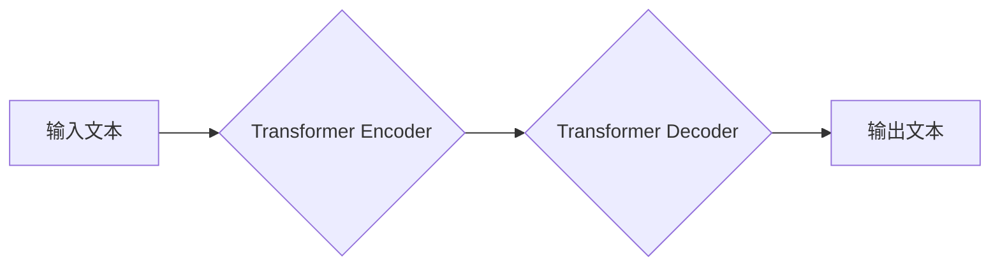

> Large Language Model (LLM), 自然语言处理 (NLP), 应用程序场景, 创新应用, 跨行业应用

## 1. 背景介绍

近年来，人工智能（AI）技术取得了飞速发展，其中，大型语言模型（LLM）作为AI领域的一颗璀璨明珠，凭借其强大的文本理解和生成能力，掀起了AI应用的全新浪潮。LLM能够理解和生成人类语言，并具备广泛的知识储备，使其在各个领域都展现出巨大的应用潜力。

从ChatGPT的爆火到各行各业的积极探索，LLM已经不再是学术研究的孤岛，而是正在深刻地改变着我们的生活和工作方式。

## 2. 核心概念与联系

**2.1  LLM概述**

大型语言模型（LLM）是一种基于深度学习的强大人工智能模型，其核心是训练在海量文本数据上的Transformer网络架构。通过学习语言的模式和结构，LLM能够理解和生成人类语言，并完成各种自然语言处理（NLP）任务，例如：

* 文本分类
* 文本摘要
* 机器翻译
* 问答系统
* 代码生成

**2.2  LLM与NLP的关系**

LLM是NLP领域的重要发展成果，其强大的文本处理能力为NLP任务的自动化和智能化提供了强有力的支撑。

**2.3  LLM应用场景**

LLM的应用场景广泛，涵盖各个行业和领域，例如：

* **教育:** 智能辅导、自动批改、个性化学习
* **医疗:** 疾病诊断、药物研发、患者咨询
* **金融:** 风险评估、欺诈检测、客户服务
* **科技:** 代码生成、文档自动化、数据分析
* **娱乐:** 内容创作、游戏开发、虚拟助手

**2.4  LLM架构图**

## 3. 核心算法原理 & 具体操作步骤

**3.1  算法原理概述**

LLM的核心算法是Transformer网络，它是一种基于注意力机制的深度神经网络架构。Transformer网络能够有效地捕捉文本序列中的长距离依赖关系，从而实现更准确的文本理解和生成。

**3.2  算法步骤详解**

1. **词嵌入:** 将输入文本中的每个单词转换为向量表示，以便模型能够理解单词的语义信息。
2. **编码器:** 使用多层Transformer编码器对输入文本进行编码，提取文本的语义特征。
3. **解码器:** 使用多层Transformer解码器对编码后的文本进行解码，生成目标文本。
4. **注意力机制:** Transformer网络中广泛应用注意力机制，能够帮助模型关注文本序列中重要的信息，提高文本理解和生成能力。

**3.3  算法优缺点**

**优点:**

* 能够捕捉长距离依赖关系
* 训练效率高
* 表现出色

**缺点:**

* 参数量大，需要大量计算资源
* 训练数据量大，需要海量文本数据
* 容易受到训练数据偏差的影响

**3.4  算法应用领域**

Transformer网络及其变体在NLP领域广泛应用，例如：

* 机器翻译
* 文本摘要
* 问答系统
* 代码生成

## 4. 数学模型和公式 & 详细讲解 & 举例说明

**4.1  数学模型构建**

LLM的数学模型主要基于Transformer网络架构，其核心是注意力机制和多头注意力机制。

**4.2  公式推导过程**

注意力机制的公式如下：

$$
Attention(Q, K, V) = softmax(\frac{QK^T}{\sqrt{d_k}})V
$$

其中：

* $Q$：查询矩阵
* $K$：键矩阵
* $V$：值矩阵
* $d_k$：键向量的维度
* $softmax$：softmax函数

**4.3  案例分析与讲解**

例如，在机器翻译任务中，LLM会将源语言文本编码为一个向量表示，然后使用注意力机制来计算目标语言文本的每个单词与源语言文本的每个单词之间的相关性。

## 5. 项目实践：代码实例和详细解释说明

**5.1  开发环境搭建**

使用Python语言和深度学习框架TensorFlow或PyTorch搭建开发环境。

**5.2  源代码详细实现**

使用预训练的LLM模型，例如BERT或GPT-3，并进行微调以适应特定任务。

**5.3  代码解读与分析**

解释代码中使用的函数和模块，以及模型训练和预测过程。

**5.4  运行结果展示**

展示模型在特定任务上的性能指标，例如准确率、召回率和F1-score。

## 6. 实际应用场景

**6.1  教育领域**

* 智能辅导系统：根据学生的学习情况提供个性化的辅导和练习。
* 自动批改系统：自动批改学生的作业和考试，节省教师的时间和精力。
* 个性化学习平台：根据学生的学习进度和兴趣，推荐个性化的学习内容。

**6.2  医疗领域**

* 疾病诊断辅助系统：根据患者的症状和病史，辅助医生进行疾病诊断。
* 药物研发：利用LLM分析大量的医学文献，加速药物研发过程。
* 患者咨询系统：提供24小时在线咨询服务，解答患者的健康问题。

**6.3  金融领域**

* 风险评估系统：分析金融数据的风险，帮助金融机构做出更明智的决策。
* 欺诈检测系统：识别金融交易中的欺诈行为，保护用户资产安全。
* 客户服务机器人：提供智能化的客户服务，提高客户体验。

**6.4  未来应用展望**

LLM的应用场景还在不断扩展，未来将有更多创新应用涌现，例如：

* 个性化新闻推荐
* 智能写作助手
* 虚拟助手
* 代码生成工具

## 7. 工具和资源推荐

**7.1  学习资源推荐**

* **书籍:**
    * 《深度学习》
    * 《自然语言处理》
* **在线课程:**
    * Coursera
    * edX
    * fast.ai

**7.2  开发工具推荐**

* **深度学习框架:** TensorFlow, PyTorch
* **自然语言处理库:** NLTK, spaCy
* **云平台:** AWS, Azure, Google Cloud

**7.3  相关论文推荐**

* 《Attention Is All You Need》
* 《BERT: Pre-training of Deep Bidirectional Transformers for Language Understanding》
* 《GPT-3: Language Models are Few-Shot Learners》

## 8. 总结：未来发展趋势与挑战

**8.1  研究成果总结**

LLM技术取得了显著进展，在文本理解和生成方面展现出强大的能力，并已在各个领域得到广泛应用。

**8.2  未来发展趋势**

* 模型规模进一步扩大
* 训练数据质量提升
* 多模态LLM的开发
* 伦理和安全问题研究

**8.3  面临的挑战**

* 计算资源需求高
* 训练数据偏差问题
* 伦理和安全风险

**8.4  研究展望**

未来LLM研究将更加注重模型的可解释性、鲁棒性和安全性，并探索其在更多领域的新应用场景。

## 9. 附录：常见问题与解答

**9.1  LLM模型训练需要多少数据？**

LLM模型训练需要海量文本数据，通常需要数十亿甚至数千亿个单词。

**9.2  LLM模型训练需要多少计算资源？**

LLM模型训练需要大量的计算资源，通常需要使用高性能计算集群。

**9.3  LLM模型容易受到训练数据偏差的影响吗？**

是的，LLM模型容易受到训练数据偏差的影响，因此需要使用高质量、多样化的训练数据。

作者：禅与计算机程序设计艺术 / Zen and the Art of Computer Programming 
<end_of_turn>