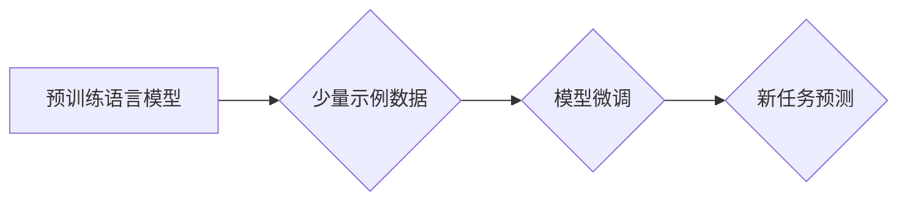

> Few-Shot学习, LLM, 大语言模型, 迁移学习, 泛化能力, 性能评估

## 1. 背景介绍

近年来，大语言模型（LLM）在自然语言处理领域取得了显著的进展，展现出强大的文本生成、翻译、问答等能力。然而，传统的训练方法通常需要海量标注数据，这在实际应用中往往难以实现。Few-Shot学习作为一种新兴的学习范式，能够有效缓解数据稀缺问题，让模型在少量示例数据下也能学习新的任务。

Few-Shot学习的核心思想是利用模型已有的知识和理解能力，通过少量示例数据进行微调，从而快速适应新的任务。这种能力对于LLM来说尤为重要，因为它可以降低模型训练的门槛，并使其能够更灵活地应对各种新兴任务。

## 2. 核心概念与联系

### 2.1 Few-Shot学习

Few-Shot学习是指在极少样本数据的情况下，模型能够学习新的任务的能力。与传统的监督学习相比，Few-Shot学习不需要大量的标注数据，只需要提供少量示例数据，模型就能学习到任务的规律并进行预测。

### 2.2 迁移学习

迁移学习是一种机器学习范式，它利用预训练模型在源任务上的知识，迁移到目标任务中进行学习。Few-Shot学习可以看作是一种特殊的迁移学习，它利用预训练语言模型在大量文本数据上的知识，迁移到新的、特定任务中。

### 2.3 LLM的优势

LLM拥有强大的文本理解和生成能力，其庞大的参数量和丰富的训练数据使其能够捕捉语言的复杂结构和语义关系。这些优势使得LLM成为Few-Shot学习的理想选择。

**Mermaid 流程图**



## 3. 核心算法原理 & 具体操作步骤

### 3.1  算法原理概述

Few-Shot学习的核心算法通常基于**元学习**的思想，它旨在学习如何学习。元学习算法通过训练一个“学习者”，这个学习者能够从少量示例数据中学习到新的任务的学习策略。

常见的Few-Shot学习算法包括：

* **匹配网络 (Matching Network)**: 通过计算输入样本与支持集样本之间的相似度，进行分类或回归任务。
* **原型网络 (Prototypical Network)**: 将每个类别的样本聚类成一个原型，然后将新样本与每个原型的距离进行比较，进行分类任务。
* **关系网络 (Relation Network)**: 学习输入样本之间的关系，并根据关系进行预测。

### 3.2  算法步骤详解

以匹配网络为例，其具体操作步骤如下：

1. **输入数据**: 包含支持集和查询集。支持集包含多个类别样本，每个类别有少量样本。查询集包含一个待分类的样本。
2. **特征提取**: 使用预训练语言模型提取每个样本的特征向量。
3. **相似度计算**: 计算查询样本与每个支持集样本之间的相似度，可以使用余弦相似度等度量。
4. **分类预测**: 根据相似度得分，预测查询样本所属的类别。

### 3.3  算法优缺点

**优点**:

* 数据效率高，能够在少量示例数据下学习新任务。
* 泛化能力强，能够推广到新的、未见过的任务。

**缺点**:

* 仍然依赖于预训练语言模型的性能，如果预训练模型质量不高，Few-Shot学习效果也会受到影响。
* 对于复杂的任务，可能需要更多的示例数据才能达到理想的性能。

### 3.4  算法应用领域

Few-Shot学习在许多领域都有广泛的应用，例如：

* **自然语言理解**: 文本分类、情感分析、问答系统等。
* **计算机视觉**: 图像分类、目标检测、图像分割等。
* **语音识别**: 语音分类、语音识别等。

## 4. 数学模型和公式 & 详细讲解 & 举例说明

### 4.1  数学模型构建

匹配网络的数学模型可以概括为以下公式：

$$
\mathbf{s} = \mathbf{f}(\mathbf{x})
$$

其中：

* $\mathbf{x}$ 是输入样本的特征向量。
* $\mathbf{f}$ 是预训练语言模型提取特征的函数。
* $\mathbf{s}$ 是样本的特征表示。

### 4.2  公式推导过程

匹配网络的目标是计算查询样本与每个支持集样本之间的相似度，可以使用余弦相似度进行计算：

$$
\mathbf{sim}(\mathbf{s_q}, \mathbf{s_i}) = \frac{\mathbf{s_q} \cdot \mathbf{s_i}}{\|\mathbf{s_q}\| \|\mathbf{s_i}\| }
$$

其中：

* $\mathbf{s_q}$ 是查询样本的特征向量。
* $\mathbf{s_i}$ 是支持集样本的特征向量。

### 4.3  案例分析与讲解

假设我们有一个文本分类任务，需要将文本分类为“正面”或“负面”。

* 支持集包含两个类别样本，每个类别有5个样本。
* 查询集包含一个待分类的文本。

匹配网络会首先使用预训练语言模型提取每个样本的特征向量，然后计算查询样本与每个支持集样本之间的相似度。最后，根据相似度得分，预测查询样本所属的类别。

## 5. 项目实践：代码实例和详细解释说明

### 5.1  开发环境搭建

* Python 3.7+
* PyTorch 1.7+
* Transformers 4.0+

### 5.2  源代码详细实现

```python
import torch
from transformers import AutoModel

# 加载预训练语言模型
model = AutoModel.from_pretrained("bert-base-uncased")

# 定义匹配网络
class MatchingNetwork(torch.nn.Module):
    def __init__(self):
        super(MatchingNetwork, self).__init__()
        # ...

    def forward(self, support_set, query_set):
        # ...

# 训练和评估模型
# ...
```

### 5.3  代码解读与分析

* 代码首先加载预训练语言模型，例如BERT。
* 然后定义匹配网络的结构，包括特征提取层、相似度计算层等。
* 最后，使用训练和评估数据训练和评估模型。

### 5.4  运行结果展示

* 训练完成后，可以评估模型在测试集上的性能，例如准确率、F1-score等。
* 可以使用可视化工具展示模型的学习过程和预测结果。

## 6. 实际应用场景

Few-Shot学习在许多实际应用场景中发挥着重要作用，例如：

### 6.1  医疗诊断

利用少量病历数据，训练模型进行疾病诊断。

### 6.2  客户服务

利用少量对话数据，训练模型进行智能客服。

### 6.3  个性化推荐

利用少量用户行为数据，训练模型进行个性化推荐。

### 6.4  未来应用展望

随着Few-Shot学习技术的不断发展，其应用场景将会更加广泛，例如：

* **自动代码生成**: 利用少量代码示例，训练模型自动生成代码。
* **自动机器学习**: 利用少量数据，训练模型自动进行机器学习模型的搜索和优化。
* **跨模态学习**: 利用少量跨模态数据，训练模型进行跨模态理解和生成。

## 7. 工具和资源推荐

### 7.1  学习资源推荐

* **论文**:
    * Matching Networks for One Shot Learning
    * Prototypical Networks for Few-Shot Learning
    * Relation Networks for Few-Shot Learning
* **博客**:
    * Few-Shot Learning with PyTorch
    * A Gentle Introduction to Few-Shot Learning

### 7.2  开发工具推荐

* **PyTorch**: 深度学习框架
* **Transformers**: 预训练语言模型库
* **HuggingFace**: 预训练模型和数据集平台

### 7.3  相关论文推荐

* **Few-Shot Learning with Meta-Learning**: https://arxiv.org/abs/1703.03467
* **Prototypical Networks for Few-Shot Learning**: https://arxiv.org/abs/1703.05175
* **Matching Networks for One Shot Learning**: https://arxiv.org/abs/1606.04080

## 8. 总结：未来发展趋势与挑战

### 8.1  研究成果总结

Few-Shot学习取得了显著的进展，能够有效缓解数据稀缺问题，并提高模型的泛化能力。

### 8.2  未来发展趋势

* **更强大的预训练模型**: 预训练模型的规模和能力不断提升，将进一步推动Few-Shot学习的发展。
* **更有效的Few-Shot学习算法**: 研究者将继续探索新的Few-Shot学习算法，提高模型的效率和性能。
* **跨模态Few-Shot学习**: 将Few-Shot学习应用于跨模态任务，例如图像文本对齐、视频字幕生成等。

### 8.3  面临的挑战

* **数据质量**: Few-Shot学习仍然依赖于高质量的示例数据，数据质量的提升至关重要。
* **模型解释性**: Few-Shot学习模型的决策过程往往难以解释，需要进一步研究模型的解释性。
* **安全性和鲁棒性**: Few-Shot学习模型可能存在安全性和鲁棒性问题，需要进一步研究如何提高模型的安全性。

### 8.4  研究展望

未来，Few-Shot学习将继续是一个重要的研究方向，其应用场景将会更加广泛，并对人工智能的发展产生深远的影响。

## 9. 附录：常见问题与解答

### 9.1  什么是Few-Shot学习？

Few-Shot学习是指在极少样本数据的情况下，模型能够学习新的任务的能力。

### 9.2  Few-Shot学习有哪些算法？

常见的Few-Shot学习算法包括匹配网络、原型网络和关系网络等。

### 9.3  Few-Shot学习的应用场景有哪些？

Few-Shot学习在自然语言理解、计算机视觉、语音识别等领域都有广泛的应用。

### 9.4  Few-Shot学习的优势和劣势是什么？

Few-Shot学习的优势是数据效率高，泛化能力强；劣势是仍然依赖于预训练语言模型的性能，对于复杂的任务可能需要更多的示例数据。


作者：禅与计算机程序设计艺术 / Zen and the Art of Computer Programming 
<end_of_turn>