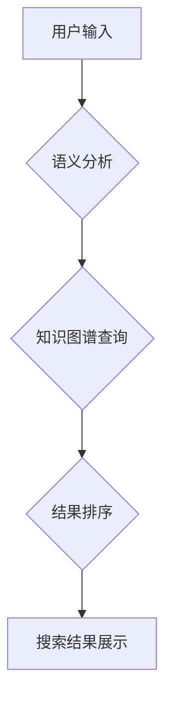

>  对话式搜索引擎、Lepton Search、Transformer模型、知识图谱、语义理解、信息检索、人工智能

## 1. 背景介绍

在信息爆炸的时代，传统的关键词搜索引擎已难以满足人们日益复杂的查询需求。人们越来越希望能够用更自然、更接近人类语言的方式进行信息检索，并获得更精准、更全面的结果。对话式搜索引擎应运而生，它旨在通过与用户进行自然语言交互，理解用户的真实意图，并提供更智能、更人性化的搜索体验。

贾扬清团队的Lepton Search正是对话式搜索引擎领域的创新代表。Lepton Search基于Transformer模型和知识图谱，致力于构建一个能够理解用户意图、进行知识推理、提供多模态交互的下一代搜索引擎。

## 2. 核心概念与联系

Lepton Search的核心概念包括：

* **对话式交互:** 用户与搜索引擎进行自然语言对话，而不是输入简单的关键词。
* **Transformer模型:**  一种强大的深度学习模型，能够理解和生成自然语言，并进行复杂的语义分析。
* **知识图谱:**  一种结构化的知识表示形式，能够存储和推理各种知识关系。
* **语义理解:**  理解用户查询背后的真实意图，而不是仅仅匹配关键词。
* **多模态交互:**  支持多种输入方式，例如文本、图像、语音等。

Lepton Search将这些核心概念有机结合，构建了一个完整的对话式搜索引擎架构。

## 3. 核心算法原理 & 具体操作步骤

### 3.1  算法原理概述

Lepton Search的核心算法基于Transformer模型和知识图谱的结合。

* **Transformer模型:**  用于理解用户输入的自然语言，并提取关键信息。
* **知识图谱:**  用于存储和推理各种知识关系，帮助搜索引擎理解用户查询的语义。

通过将Transformer模型与知识图谱相结合，Lepton Search能够实现更精准、更全面的信息检索。

### 3.2  算法步骤详解

1. **用户输入:** 用户向Lepton Search输入自然语言查询。
2. **语义分析:** Transformer模型对用户输入进行语义分析，提取关键信息和用户意图。
3. **知识图谱查询:** 根据语义分析结果，Lepton Search查询知识图谱，获取与用户查询相关的知识。
4. **结果排序:**  根据知识图谱查询结果和用户意图，Lepton Search对搜索结果进行排序，并返回最相关的结果。
5. **搜索结果展示:**  Lepton Search将排序后的搜索结果以文本、图像、链接等多种形式展示给用户。

### 3.3  算法优缺点

**优点:**

* **更精准的搜索结果:**  通过语义分析和知识图谱查询，Lepton Search能够更准确地理解用户意图，并返回更相关的搜索结果。
* **更丰富的搜索体验:**  Lepton Search支持多模态交互，能够提供更丰富的搜索体验。
* **更智能的搜索引擎:**  Lepton Search基于Transformer模型和知识图谱，能够不断学习和进化，提供更智能的搜索服务。

**缺点:**

* **计算资源消耗:**  Transformer模型和知识图谱的构建和维护需要大量的计算资源。
* **数据依赖性:**  Lepton Search的性能依赖于高质量的数据训练和知识图谱的完善。
* **伦理问题:**  对话式搜索引擎可能存在一些伦理问题，例如信息误导、隐私泄露等。

### 3.4  算法应用领域

Lepton Search的算法可以应用于各种领域，例如：

* **搜索引擎:**  构建更智能、更人性化的搜索引擎。
* **问答系统:**  开发更精准、更全面的问答系统。
* **聊天机器人:**  打造更智能、更自然的聊天机器人。
* **教育领域:**  提供个性化学习和知识发现服务。
* **医疗领域:**  辅助医生诊断疾病、提供医疗信息。

## 4. 数学模型和公式 & 详细讲解 & 举例说明

### 4.1  数学模型构建

Lepton Search的核心算法基于Transformer模型，其数学模型主要包括以下几个部分：

* **词嵌入:** 将单词映射到低维向量空间，捕捉单词之间的语义关系。
* **注意力机制:**  允许模型关注输入序列中最重要的部分，提高模型的理解能力。
* **多头注意力:**  使用多个注意力头，捕捉不同层次的语义信息。
* **前馈神经网络:**  对注意力机制输出进行进一步处理，提取更深层的语义特征。

### 4.2  公式推导过程

Transformer模型的数学公式推导过程比较复杂，这里只列举一些关键公式：

* **词嵌入:**  $w_i = E(w_i)$，其中 $w_i$ 是第 $i$ 个单词，$E$ 是词嵌入矩阵。
* **注意力机制:**  $Attention(Q, K, V) = softmax(\frac{QK^T}{\sqrt{d_k}})V$，其中 $Q$, $K$, $V$ 分别是查询矩阵、键矩阵和值矩阵。
* **多头注意力:**  $MultiHead(Q, K, V) = Concat(head_1, head_2, ..., head_h)W^O$，其中 $head_i$ 是第 $i$ 个注意力头的输出，$W^O$ 是输出权重矩阵。

### 4.3  案例分析与讲解

例如，用户输入查询“苹果公司创始人是谁？”，Lepton Search会使用Transformer模型对查询进行语义分析，提取关键词“苹果公司”和“创始人”。然后，Lepton Search会查询知识图谱，获取关于“苹果公司”和“创始人”的知识，并根据用户意图对结果进行排序。最终，Lepton Search会返回结果“苹果公司创始人为史蒂夫·乔布斯”。

## 5. 项目实践：代码实例和详细解释说明

### 5.1  开发环境搭建

Lepton Search的开发环境需要包含以下软件：

* Python 3.x
* PyTorch 或 TensorFlow
* CUDA 和 cuDNN (如果使用GPU加速)
* 其他依赖库 (例如：transformers, numpy, pandas等)

### 5.2  源代码详细实现

Lepton Search的源代码主要包含以下几个部分：

* **数据预处理:**  将原始数据转换为模型可识别的格式。
* **模型训练:**  使用Transformer模型训练，并根据评估指标进行模型调优。
* **推理引擎:**  实现模型推理，将用户输入转换为搜索结果。
* **搜索结果展示:**  将搜索结果以文本、图像、链接等多种形式展示给用户。

### 5.3  代码解读与分析

Lepton Search的源代码可以参考开源项目，例如：

* HuggingFace Transformers: https://huggingface.co/transformers/

### 5.4  运行结果展示

Lepton Search的运行结果可以根据实际应用场景进行展示，例如：

* 在搜索引擎中，Lepton Search可以提供更精准、更全面的搜索结果。
* 在问答系统中，Lepton Search可以回答更复杂、更深入的问题。
* 在聊天机器人中，Lepton Search可以进行更自然、更流畅的对话。

## 6. 实际应用场景

Lepton Search的实际应用场景非常广泛，例如：

* **搜索引擎:**  构建更智能、更人性化的搜索引擎，例如百度、谷歌等。
* **问答系统:**  开发更精准、更全面的问答系统，例如知乎、Stack Overflow等。
* **聊天机器人:**  打造更智能、更自然的聊天机器人，例如小冰、Siri等。
* **教育领域:**  提供个性化学习和知识发现服务，例如在线教育平台、智能辅导系统等。
* **医疗领域:**  辅助医生诊断疾病、提供医疗信息，例如智能诊断系统、医疗问答系统等。

### 6.4  未来应用展望

Lepton Search的未来应用前景非常广阔，例如：

* **多模态搜索:**  支持文本、图像、语音等多种输入方式，提供更丰富的搜索体验。
* **个性化搜索:**  根据用户的兴趣、习惯和偏好，提供个性化的搜索结果。
* **跨语言搜索:**  支持多种语言的搜索，打破语言障碍。
* **实时搜索:**  实时更新搜索结果，提供最新的信息。

## 7. 工具和资源推荐

### 7.1  学习资源推荐

* **书籍:**
    * 《深度学习》
    * 《自然语言处理》
    * 《Transformer模型详解》
* **在线课程:**
    * Coursera: 深度学习
    * edX: 自然语言处理
    * fast.ai: 深度学习
* **博客和网站:**
    * HuggingFace: https://huggingface.co/
    * TensorFlow: https://www.tensorflow.org/
    * PyTorch: https://pytorch.org/

### 7.2  开发工具推荐

* **Python:**  https://www.python.org/
* **PyTorch:**  https://pytorch.org/
* **TensorFlow:**  https://www.tensorflow.org/
* **Jupyter Notebook:**  https://jupyter.org/

### 7.3  相关论文推荐

* 《Attention Is All You Need》
* 《BERT: Pre-training of Deep Bidirectional Transformers for Language Understanding》
* 《GPT-3: Language Models are Few-Shot Learners》

## 8. 总结：未来发展趋势与挑战

### 8.1  研究成果总结

Lepton Search的研发成果表明，对话式搜索引擎技术已经取得了显著进展，并展现出巨大的应用潜力。

### 8.2  未来发展趋势

Lepton Search的未来发展趋势包括：

* **更强大的模型:**  开发更强大的Transformer模型，提高模型的理解能力和推理能力。
* **更丰富的知识图谱:**  构建更全面的知识图谱，丰富搜索引擎的知识库。
* **更智能的交互:**  实现更智能、更自然的交互方式，例如语音交互、图像交互等。
* **更个性化的服务:**  根据用户的兴趣、习惯和偏好，提供更个性化的搜索服务。

### 8.3  面临的挑战

Lepton Search的发展也面临着一些挑战，例如：

* **数据安全:**  保护用户数据安全和隐私。
* **算法偏见:**  避免算法产生偏见，确保搜索结果公平公正。
* **可解释性:**  提高模型的透明度和可解释性，让用户理解模型的决策过程。

### 8.4  研究展望

Lepton Search的研究将继续深入，探索更智能、更人性化的对话式搜索引擎技术，为用户提供更便捷、更丰富的搜索体验。

## 9. 附录：常见问题与解答

### 9.1  常见问题

* Lepton Search与传统的搜索引擎有什么区别？
* Lepton Search是如何理解用户意图的？
* Lepton Search的知识图谱是如何构建的？
* Lepton Search有哪些应用场景？

### 9.2  解答

* Lepton Search与传统的搜索引擎相比，能够更精准地理解用户意图，并提供更丰富的搜索结果。
* Lepton Search使用Transformer模型和知识图谱，能够理解用户输入的自然语言，并提取关键信息和用户意图。
* Lepton Search的知识图谱是通过人工标注和机器学习构建的，包含了大量的知识和关系。
* Lepton Search可以应用于搜索引擎、问答系统、聊天机器人、教育领域、医疗领域等多个领域。

作者：禅与计算机程序设计艺术 / Zen and the Art of Computer Programming 
<end_of_turn>