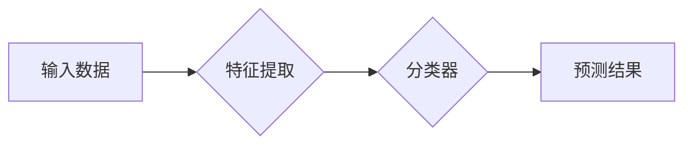

> One-Shot Learning, 元学习, 迁移学习, 知识蒸馏, 计算机视觉, 深度学习

## 1. 背景介绍

在机器学习领域，传统的监督学习方法通常需要大量的标记数据来训练模型。然而，在现实世界中，获取大量标记数据的成本往往很高，并且某些任务可能难以获得足够的标记数据。为了解决这个问题，**One-Shot Learning**（一次性学习）应运而生。

One-Shot Learning是一种新兴的机器学习范式，它允许模型在仅看到少量或甚至单个样本的情况下学习新的概念或类别。这种能力对于许多现实世界应用具有重要意义，例如：

* **图像识别:**  识别罕见物体或新出现的物体类别。
* **自然语言处理:**  理解新的词汇或语法结构。
* **机器人学习:**  快速学习新的任务或环境。

## 2. 核心概念与联系

One-Shot Learning的核心思想是利用模型的**泛化能力**，通过学习少量样本的特征表示，推断出新的样本所属的类别。

**核心概念:**

* **支持集 (Support Set):**  包含少量样本的集合，用于训练模型。
* **查询集 (Query Set):**  包含待分类样本的集合。
* **元学习 (Meta-Learning):**  One-Shot Learning通常基于元学习的框架，通过学习如何学习，提高模型在新的任务上的泛化能力。

**架构流程:**



## 3. 核心算法原理 & 具体操作步骤

### 3.1  算法原理概述

常见的One-Shot Learning算法包括：

* **Siamese Network:** 使用两个相同的网络结构，分别对支持集和查询集中的样本进行特征提取，然后计算两个特征向量的相似度，进行分类。
* **Matching Network:**  使用注意力机制，学习支持集和查询集之间的匹配关系，并根据匹配度进行分类。
* **Prototypical Networks:**  将每个类别视为一个原型向量，计算查询集样本与每个原型向量的距离，选择距离最近的类别作为预测结果。

### 3.2  算法步骤详解

以Prototypical Networks为例，其具体操作步骤如下：

1. **特征提取:**  将支持集和查询集中的样本分别输入到一个预训练好的卷积神经网络中，提取特征向量。
2. **原型向量计算:**  对于每个类别，计算其支持集样本的平均值作为该类别的原型向量。
3. **距离计算:**  计算查询集样本与每个类别原型向量的距离，可以使用欧氏距离或马氏距离。
4. **分类:**  选择距离最近的类别作为查询集样本的预测结果。

### 3.3  算法优缺点

**优点:**

* 能够在少量样本的情况下进行学习。
* 泛化能力强，能够对新的类别进行有效分类。

**缺点:**

* 训练数据量仍然需要满足一定的规模。
* 对模型结构和超参数的设置较为敏感。

### 3.4  算法应用领域

One-Shot Learning在以下领域具有广泛的应用前景:

* **图像识别:**  识别罕见物体、新出现的物体类别、人脸识别、物体跟踪。
* **自然语言处理:**  情感分析、文本分类、机器翻译、问答系统。
* **语音识别:**  语音命令识别、语音转文本。
* **机器人学习:**  快速学习新的任务、环境导航、物体抓取。

## 4. 数学模型和公式 & 详细讲解 & 举例说明

### 4.1  数学模型构建

假设我们有 $N$ 个类别，每个类别有 $K$ 个样本。支持集包含 $M$ 个样本，查询集包含 $Q$ 个样本。

* $x_i$ 表示第 $i$ 个样本的特征向量。
* $y_i$ 表示第 $i$ 个样本所属的类别标签。
* $C_j$ 表示第 $j$ 个类别的原型向量。

### 4.2  公式推导过程

Prototypical Networks的目标函数是最小化查询集样本与对应类别原型向量的距离。

$$
L = \sum_{i=1}^{Q} \min_{j=1}^{N} ||x_i - C_j||^2
$$

其中，$||x_i - C_j||^2$ 表示查询集样本 $x_i$ 与类别 $j$ 原型向量 $C_j$ 之间的欧氏距离平方。

### 4.3  案例分析与讲解

假设我们有一个包含 5 个类别的图像数据集，每个类别有 10 个样本。我们使用 Prototypical Networks 进行 One-Shot 学习，支持集包含 5 个样本，查询集包含 1 个样本。

在训练过程中，模型会学习每个类别的原型向量。当我们输入一个新的查询样本时，模型会计算该样本与每个类别原型向量的距离，并选择距离最近的类别作为预测结果。

## 5. 项目实践：代码实例和详细解释说明

### 5.1  开发环境搭建

* Python 3.6+
* TensorFlow 2.0+
* PyTorch 1.0+

### 5.2  源代码详细实现

```python
import tensorflow as tf

# 定义 Prototypical Networks 模型
class PrototypicalNetwork(tf.keras.Model):
    def __init__(self, embedding_dim):
        super(PrototypicalNetwork, self).__init__()
        self.embedding = tf.keras.Sequential([
            tf.keras.layers.Conv2D(32, (3, 3), activation='relu'),
            tf.keras.layers.MaxPooling2D((2, 2)),
            tf.keras.layers.Flatten(),
            tf.keras.layers.Dense(embedding_dim)
        ])

    def call(self, x):
        return self.embedding(x)

# 定义损失函数
def prototypical_loss(y_true, y_pred):
    return tf.reduce_mean(tf.reduce_min(tf.square(y_true - y_pred), axis=1))

# 定义训练步骤
def train_step(images, labels):
    with tf.GradientTape() as tape:
        embeddings = model(images)
        loss = prototypical_loss(labels, embeddings)
    gradients = tape.gradient(loss, model.trainable_variables)
    optimizer.apply_gradients(zip(gradients, model.trainable_variables))
    return loss

# ... 训练模型 ...
```

### 5.3  代码解读与分析

* **模型定义:**  PrototypicalNetwork 模型包含一个卷积神经网络用于提取特征，以及一个全连接层用于将特征映射到嵌入空间。
* **损失函数:**  Prototypical loss 函数计算查询集样本与对应类别原型向量的距离，并最小化该距离。
* **训练步骤:**  训练步骤包括计算损失，反向传播梯度，更新模型参数。

### 5.4  运行结果展示

训练完成后，我们可以使用模型对新的图像进行分类。

## 6. 实际应用场景

One-Shot Learning在以下实际应用场景中具有重要意义:

* **医疗诊断:**  根据少量病历数据，识别新的疾病类型。
* **金融风险评估:**  根据少量交易数据，评估新的投资项目的风险。
* **个性化推荐:**  根据用户的少量行为数据，推荐个性化的商品或服务。

### 6.4  未来应用展望

随着深度学习技术的不断发展，One-Shot Learning的应用场景将会更加广泛。未来，One-Shot Learning可能被应用于以下领域:

* **自动驾驶:**  快速学习新的道路规则和交通场景。
* **智能家居:**  根据用户的少量指令，学习用户的习惯和偏好。
* **人机交互:**  开发更加自然和智能的人机交互方式。

## 7. 工具和资源推荐

### 7.1  学习资源推荐

* **论文:**  
    * "Matching Networks for One Shot Learning"
    * "Prototypical Networks for Few-Shot Learning"
    * "Siamese Networks for One-Shot Image Recognition"
* **博客:**  
    * https://blog.openai.com/one-shot-learning/
    * https://towardsdatascience.com/one-shot-learning-with-prototypical-networks-a-practical-guide-a7999999999a

### 7.2  开发工具推荐

* **TensorFlow:**  https://www.tensorflow.org/
* **PyTorch:**  https://pytorch.org/

### 7.3  相关论文推荐

* **Few-Shot Learning with Meta-Learning:**  https://arxiv.org/abs/1703.03467
* **Meta-Learning with Differentiable Convex Optimization:**  https://arxiv.org/abs/1705.01677

## 8. 总结：未来发展趋势与挑战

### 8.1  研究成果总结

One-Shot Learning在过去几年取得了显著的进展，能够在少量样本的情况下有效地学习新的概念或类别。

### 8.2  未来发展趋势

未来，One-Shot Learning的研究方向将包括:

* **更有效的学习算法:**  开发更有效的One-Shot Learning算法，提高模型的泛化能力和效率。
* **跨模态学习:**  研究跨模态One-Shot Learning，例如将图像和文本数据结合起来进行学习。
* **无监督学习:**  探索无监督One-Shot Learning的方法，减少对标记数据的依赖。

### 8.3  面临的挑战

One-Shot Learning仍然面临一些挑战:

* **数据效率:**  即使在少量样本的情况下，One-Shot Learning模型仍然需要大量的训练数据。
* **泛化能力:**  One-Shot Learning模型的泛化能力仍然有限，在新的任务或环境中可能表现不佳。
* **解释性:**  One-Shot Learning模型的决策过程难以解释，这可能会阻碍其在一些应用场景中的应用。

### 8.4  研究展望

One-Shot Learning是一个充满挑战和机遇的领域，未来将会有更多的研究成果涌现，推动人工智能技术的发展。

## 9. 附录：常见问题与解答

* **什么是One-Shot Learning?**

One-Shot Learning是一种机器学习范式，它允许模型在仅看到少量或甚至单个样本的情况下学习新的概念或类别。

* **One-Shot Learning与迁移学习有什么区别?**

迁移学习是指利用预训练模型在新的任务上进行学习，而One-Shot Learning则侧重于在少量样本的情况下学习新的概念。

* **One-Shot Learning有哪些应用场景?**

One-Shot Learning在图像识别、自然语言处理、机器人学习等领域具有广泛的应用前景。

作者：禅与计算机程序设计艺术 / Zen and the Art of Computer Programming


<end_of_turn>