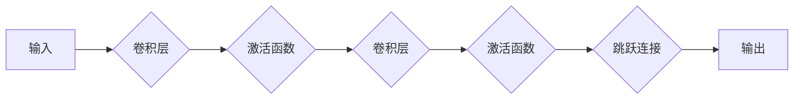

> ResNet, 深度残差网络, 
> 梯度消失, 
> 跨层连接, 
> 
> 

## 1. 背景介绍

随着深度学习的蓬勃发展，卷积神经网络（CNN）在图像识别、目标检测、语义分割等领域取得了显著的成就。然而，随着网络深度的增加，训练过程会遇到“梯度消失”问题，导致网络难以学习深层特征。为了解决这个问题，微软研究院于2015年提出了残差网络（ResNet），该网络通过引入“跳跃连接”（shortcut connections）来缓解梯度消失问题，并取得了令人瞩目的效果。

ResNet的提出标志着深度学习领域迈向一个新的阶段，它不仅解决了梯度消失问题，还为构建更深、更强大的神经网络提供了新的思路。

## 2. 核心概念与联系

ResNet的核心思想是通过残差学习来训练更深的网络。残差学习是指学习网络输入到输出之间的残差，而不是直接学习原始输入到输出的映射关系。

**残差块（Residual Block）**是ResNet的基本构建单元，它包含两部分：

* **卷积层：**用于提取特征。
* **跳跃连接：**将输入直接传递到输出，并与卷积层的输出相加。

跳跃连接的作用是：

* **缓解梯度消失问题：**通过跳跃连接，梯度可以直接传递到更深层的网络，从而缓解梯度消失问题。
* **加速训练速度：**由于跳跃连接的存在，网络的训练速度可以得到加速。
* **提高网络表达能力：**跳跃连接可以帮助网络学习更丰富的特征表示。

**Mermaid 流程图**



## 3. 核心算法原理 & 具体操作步骤

### 3.1  算法原理概述

ResNet的核心算法原理是残差学习。残差学习是指学习网络输入到输出之间的残差，而不是直接学习原始输入到输出的映射关系。

ResNet通过引入跳跃连接，将输入直接传递到输出，并与卷积层的输出相加。这样，网络可以学习到输入到输出之间的残差，从而更容易学习深层特征。

### 3.2  算法步骤详解

1. **输入数据：**将图像数据作为输入，输入到ResNet网络中。
2. **卷积层：**使用多个卷积层提取图像特征。
3. **激活函数：**使用激活函数（例如ReLU）引入非线性，提高网络的表达能力。
4. **跳跃连接：**将输入直接传递到输出，并与卷积层的输出相加。
5. **输出结果：**将最终的输出结果作为图像分类或其他任务的结果。

### 3.3  算法优缺点

**优点：**

* **缓解梯度消失问题：**跳跃连接可以使梯度直接传递到更深层的网络，从而缓解梯度消失问题。
* **加速训练速度：**由于跳跃连接的存在，网络的训练速度可以得到加速。
* **提高网络表达能力：**跳跃连接可以帮助网络学习更丰富的特征表示。

**缺点：**

* **参数量增加：**跳跃连接会增加网络的参数量。
* **计算复杂度增加：**跳跃连接会增加网络的计算复杂度。

### 3.4  算法应用领域

ResNet在图像识别、目标检测、语义分割等领域取得了广泛应用。

## 4. 数学模型和公式 & 详细讲解 & 举例说明

### 4.1  数学模型构建

ResNet的数学模型可以表示为：

$$
F(x) = H(x) + x
$$

其中：

* $F(x)$ 是网络的输出。
* $H(x)$ 是卷积层和激活函数的组合。
* $x$ 是网络的输入。

### 4.2  公式推导过程

残差块的数学模型可以表示为：

$$
F(x) = \sigma(W_2 \cdot \sigma(W_1 \cdot x + b_1) + b_2) + x
$$

其中：

* $W_1$ 和 $W_2$ 是卷积核。
* $b_1$ 和 $b_2$ 是偏置项。
* $\sigma$ 是激活函数。

### 4.3  案例分析与讲解

假设输入图像大小为 $28 \times 28$，卷积核大小为 $3 \times 3$，步长为 $1$，则卷积层输出大小为 $26 \times 26$。

在残差块中，输入 $x$ 的大小为 $26 \times 26$，卷积层输出大小为 $26 \times 26$，跳跃连接将输入直接传递到输出，因此输出 $F(x)$ 的大小也为 $26 \times 26$。

## 5. 项目实践：代码实例和详细解释说明

### 5.1  开发环境搭建

* Python 3.6+
* TensorFlow 2.0+
* CUDA 10.0+ (可选)

### 5.2  源代码详细实现

```python
import tensorflow as tf

def residual_block(input_tensor, filters):
    """
    定义残差块
    """
    x = tf.keras.layers.Conv2D(filters, kernel_size=3, padding='same')(input_tensor)
    x = tf.keras.layers.BatchNormalization()(x)
    x = tf.keras.layers.ReLU()(x)
    x = tf.keras.layers.Conv2D(filters, kernel_size=3, padding='same')(x)
    x = tf.keras.layers.BatchNormalization()(x)
    x = tf.keras.layers.add([x, input_tensor])
    return x

def resnet(input_shape, num_classes):
    """
    构建 ResNet 网络
    """
    inputs = tf.keras.Input(shape=input_shape)
    x = tf.keras.layers.Conv2D(64, kernel_size=7, strides=2, padding='same')(inputs)
    x = tf.keras.layers.BatchNormalization()(x)
    x = tf.keras.layers.ReLU()(x)
    x = tf.keras.layers.MaxPooling2D(pool_size=3, strides=2)(x)

    # 添加多个残差块
    for i in range(10):
        x = residual_block(x, 64)

    # 全连接层
    x = tf.keras.layers.Flatten()(x)
    outputs = tf.keras.layers.Dense(num_classes, activation='softmax')(x)

    model = tf.keras.Model(inputs=inputs, outputs=outputs)
    return model

# 实例化模型
model = resnet(input_shape=(28, 28, 1), num_classes=10)

# 打印模型结构
model.summary()
```

### 5.3  代码解读与分析

* `residual_block()` 函数定义了残差块的结构，包含两个卷积层、两个 BatchNormalization 层和一个 ReLU 激活函数。
* `resnet()` 函数构建了 ResNet 网络，包含一个卷积层、一个最大池化层和多个残差块。
* `model.summary()` 函数打印了模型的结构信息。

### 5.4  运行结果展示

运行代码后，可以得到 ResNet 模型的结构信息，并进行训练和测试。

## 6. 实际应用场景

ResNet在图像识别、目标检测、语义分割等领域取得了广泛应用。

* **图像识别：**ResNet可以用于识别图像中的物体、场景和人物。
* **目标检测：**ResNet可以用于检测图像中的多个目标，并识别目标的类别和位置。
* **语义分割：**ResNet可以用于将图像分割成不同的语义区域，例如天空、地面和建筑物。

### 6.4  未来应用展望

ResNet的未来应用前景广阔，例如：

* **医疗图像分析：**ResNet可以用于分析医学图像，例如 X 光片、CT 扫描和 MRI 图像，以辅助医生诊断疾病。
* **自动驾驶：**ResNet可以用于识别道路上的物体，例如车辆、行人、交通信号灯，以辅助自动驾驶系统。
* **视频分析：**ResNet可以用于分析视频，例如识别视频中的动作、人物和事件。

## 7. 工具和资源推荐

### 7.1  学习资源推荐

* **论文：**
    * Deep Residual Learning for Image Recognition
* **博客：**
    * https://blog.csdn.net/u014309008/article/details/78997947
* **课程：**
    * 深度学习 Specialization (Coursera)

### 7.2  开发工具推荐

* **TensorFlow:** https://www.tensorflow.org/
* **PyTorch:** https://pytorch.org/

### 7.3  相关论文推荐

* **ResNet:** https://arxiv.org/abs/1512.03385
* **DenseNet:** https://arxiv.org/abs/1608.06993
* **Inception:** https://arxiv.org/abs/1409.4842

## 8. 总结：未来发展趋势与挑战

### 8.1  研究成果总结

ResNet的提出为深度学习领域带来了革命性的变化，它不仅解决了梯度消失问题，还为构建更深、更强大的神经网络提供了新的思路。ResNet及其变种网络在图像识别、目标检测、语义分割等领域取得了显著的成果。

### 8.2  未来发展趋势

ResNet的未来发展趋势包括：

* **更深的网络：**随着硬件性能的提升，ResNet可以构建更深的网络，从而学习更丰富的特征表示。
* **新的架构设计：**研究人员将继续探索新的网络架构，以提高网络的性能和效率。
* **新的应用场景：**ResNet可以应用于更多新的领域，例如医疗图像分析、自动驾驶和视频分析。

### 8.3  面临的挑战

ResNet也面临一些挑战，例如：

* **计算复杂度：**ResNet的计算复杂度较高，需要强大的硬件支持。
* **参数量：**ResNet的参数量较大，需要大量的训练数据才能达到最佳性能。
* **可解释性：**ResNet的决策过程难以解释，这限制了其在一些应用场景中的使用。

### 8.4  研究展望

未来，研究人员将继续探索ResNet的潜力，以解决上述挑战，并将其应用于更多新的领域。

## 9. 附录：常见问题与解答

**Q1：ResNet的优势是什么？**

**A1：**ResNet的优势在于：

* 缓解梯度消失问题
* 加速训练速度
* 提高网络表达能力

**Q2：ResNet的应用场景有哪些？**

**A2：**ResNet的应用场景包括：

* 图像识别
* 目标检测
* 语义分割
* 医疗图像分析
* 自动驾驶
* 视频分析

**Q3：如何搭建ResNet的开发环境？**

**A3：**ResNet的开发环境需要以下软件：

* Python 3.6+
* TensorFlow 2.0+
* CUDA 10.0+ (可选)

**Q4：ResNet的代码实现示例在哪里可以找到？**

**A4：**本文提供了ResNet的代码实现示例，可以参考代码进行学习和实践。


作者：禅与计算机程序设计艺术 / Zen and the Art of Computer Programming 
<end_of_turn>