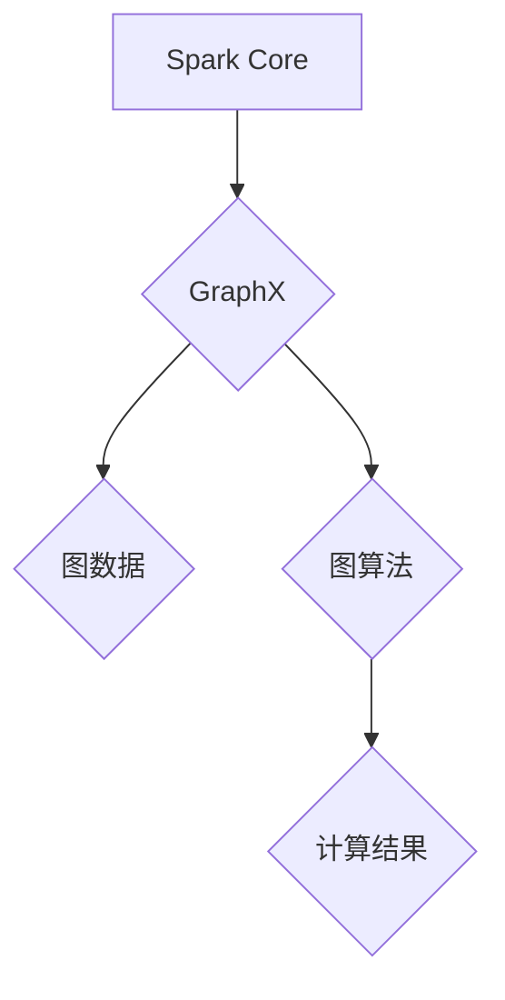

> Spark GraphX, 图计算, 算法原理, 代码实例, 应用场景, 未来趋势

## 1. 背景介绍

随着大数据时代的到来，海量数据的处理和分析成为越来越重要的课题。而图数据作为一种特殊的结构化数据，在社交网络、推荐系统、知识图谱等领域有着广泛的应用。传统的图计算方法难以应对海量图数据的处理需求，因此，基于分布式计算框架的图计算技术应运而生。

Spark GraphX 是 Apache Spark 上构建的图计算框架，它提供了一套完整的图计算 API，支持各种图算法的实现和执行。Spark GraphX 结合了 Spark 的高性能和易用性，能够高效地处理海量图数据，并支持多种编程语言，如 Scala、Java 和 Python。

## 2. 核心概念与联系

Spark GraphX 的核心概念包括：

* **图 (Graph):** 图由节点 (Vertex) 和边 (Edge) 组成，节点代表图中的实体，边代表实体之间的关系。
* **顶点 (Vertex):** 图中的数据点，每个顶点都有一个唯一的 ID 和一些属性。
* **边 (Edge):** 连接两个顶点的关系，边也可能带有属性。
* **图类型 (GraphType):** Spark GraphX 支持两种主要的图类型：
    * **Directed Graph (有向图):** 边有方向，表示从一个顶点到另一个顶点的单向关系。
    * **Undirected Graph (无向图):** 边没有方向，表示两个顶点之间双向关系。

**Spark GraphX 架构图:**



## 3. 核心算法原理 & 具体操作步骤

### 3.1  算法原理概述

Spark GraphX 提供了一系列常用的图算法，例如：

* **PageRank 算法:** 用于计算节点的重要性，广泛应用于搜索引擎排名和社交网络分析。
* **Shortest Path 算法:** 用于找到两个节点之间的最短路径，应用于导航系统和物流优化。
* **Connected Components 算法:** 用于找到图中所有相互连接的节点组，应用于社交网络分析和网络拓扑分析。

### 3.2  算法步骤详解

以 PageRank 算法为例，其基本步骤如下：

1. **初始化:** 为每个节点赋予初始 PageRank 值，通常设置为 1/N，其中 N 是图中节点总数。
2. **迭代计算:** 迭代计算每个节点的 PageRank 值，公式如下:

$$PR(v) = (1-d) + d \sum_{u \in \text{in}(v)} \frac{PR(u)}{|\text{out}(u)|}$$

其中:

* $PR(v)$ 是节点 v 的 PageRank 值。
* $d$ 是阻尼因子，通常设置为 0.85。
* $\text{in}(v)$ 是指向节点 v 的所有边。
* $\text{out}(u)$ 是从节点 u 出发的所有边。

3. **收敛判断:** 当 PageRank 值不再发生明显变化时，停止迭代，得到最终的 PageRank 值。

### 3.3  算法优缺点

**优点:**

* 能够有效地计算节点的重要性。
* 算法原理简单易懂。

**缺点:**

* 对于大型图数据，计算量较大。
* 算法对图结构的敏感度较高。

### 3.4  算法应用领域

PageRank 算法广泛应用于以下领域:

* **搜索引擎排名:** Google 使用 PageRank 算法来计算网页的重要性，并将其作为搜索结果排序的重要因素。
* **社交网络分析:** PageRank 算法可以用来识别社交网络中的重要用户和影响者。
* **推荐系统:** PageRank 算法可以用来推荐用户可能感兴趣的内容。

## 4. 数学模型和公式 & 详细讲解 & 举例说明

### 4.1  数学模型构建

PageRank 算法的数学模型可以表示为一个线性方程组，其中每个节点的 PageRank 值是所有指向该节点的边的 PageRank 值的加权平均值。

### 4.2  公式推导过程

PageRank 算法的公式推导过程如下:

1. 假设图中节点总数为 N，每个节点的 PageRank 值为一个向量 PR = (PR(1), PR(2), ..., PR(N))。
2. 每个节点的 PageRank 值可以表示为所有指向该节点的边的 PageRank 值的加权平均值。
3. 对于节点 v，其 PageRank 值可以表示为:

$$PR(v) = (1-d) + d \sum_{u \in \text{in}(v)} \frac{PR(u)}{|\text{out}(u)|}$$

其中:

* $PR(v)$ 是节点 v 的 PageRank 值。
* $d$ 是阻尼因子，通常设置为 0.85。
* $\text{in}(v)$ 是指向节点 v 的所有边。
* $\text{out}(u)$ 是从节点 u 出发的所有边。

4. 将所有节点的 PageRank 值表示为一个线性方程组，可以得到:

$$PR = (I - dL^T)PR$$

其中:

* $I$ 是单位矩阵。
* $L$ 是图的邻接矩阵。

### 4.3  案例分析与讲解

假设有一个简单的图，包含三个节点 A、B 和 C，以及以下边:

* A -> B
* B -> C

我们可以使用 PageRank 算法计算每个节点的 PageRank 值。

* 首先，假设每个节点的初始 PageRank 值为 1/3。
* 然后，根据 PageRank 算法的公式，计算每个节点的 PageRank 值。
* 经过迭代计算，最终得到每个节点的 PageRank 值。

## 5. 项目实践：代码实例和详细解释说明

### 5.1  开发环境搭建

为了使用 Spark GraphX，需要先搭建开发环境。

* 安装 Java 和 Scala。
* 安装 Spark。
* 配置 Spark 环境变量。

### 5.2  源代码详细实现

以下是一个简单的 Spark GraphX 代码实例，用于计算图中节点的 PageRank 值:

```scala
import org.apache.spark.graphx._
import org.apache.spark.SparkContext

object PageRankExample {
  def main(args: Array[String]): Unit = {
    val sc = new SparkContext("local", "PageRankExample")

    // 定义图数据
    val graph = Graph(
      sc.parallelize(List((1, "A"), (2, "B"), (3, "C"))),
      sc.parallelize(List((1, 2), (2, 3)))
    )

    // 计算 PageRank 值
    val pagerank = graph.pageRank(0.85).vertices

    // 打印结果
    pagerank.collect().foreach(println)

    sc.stop()
  }
}
```

### 5.3  代码解读与分析

* `Graph` 对象表示图数据，包含顶点和边信息。
* `pageRank(0.85)` 方法计算图中节点的 PageRank 值，阻尼因子设置为 0.85。
* `vertices` 属性返回每个节点的 PageRank 值。

### 5.4  运行结果展示

运行上述代码，将输出每个节点的 PageRank 值。

## 6. 实际应用场景

Spark GraphX 在以下实际应用场景中发挥着重要作用:

* **社交网络分析:** 识别社交网络中的重要用户和影响者，分析用户之间的关系和传播路径。
* **推荐系统:** 基于用户行为和关系数据，推荐用户可能感兴趣的内容。
* **知识图谱构建:** 建立知识图谱，表示知识之间的关系，并进行知识推理和查询。
* **生物信息学:** 分析基因网络和蛋白质相互作用关系。

### 6.4  未来应用展望

随着大数据和人工智能技术的不断发展，Spark GraphX 的应用场景将更加广泛。

* **图神经网络:** 将 Spark GraphX 与图神经网络结合，实现更智能的图数据分析和预测。
* **联邦学习:** 将 Spark GraphX 应用于联邦学习，实现隐私保护下的图数据分析。
* **边缘计算:** 将 Spark GraphX 部署到边缘设备，实现实时图数据分析。

## 7. 工具和资源推荐

### 7.1  学习资源推荐

* **Spark GraphX 官方文档:** https://spark.apache.org/docs/latest/graphx-programming-guide.html
* **Spark GraphX 中文教程:** https://spark.apache.org/docs/latest/zh-cn/graphx-programming-guide.html
* **图计算书籍:** 《图计算导论》、《图算法》

### 7.2  开发工具推荐

* **Spark:** https://spark.apache.org/
* **Scala:** https://www.scala-lang.org/
* **Java:** https://www.oracle.com/java/technologies/javase-downloads.html

### 7.3  相关论文推荐

* **PageRank: The Anatomy of a Web Page Rank**
* **GraphX: A Graph Processing Framework on Spark**

## 8. 总结：未来发展趋势与挑战

### 8.1  研究成果总结

Spark GraphX 作为一款强大的图计算框架，为大规模图数据分析提供了高效的解决方案。

### 8.2  未来发展趋势

未来，Spark GraphX 将朝着以下方向发展:

* **性能优化:** 进一步提升 Spark GraphX 的性能，支持更大型的图数据处理。
* **算法扩展:** 开发更多新的图算法，满足更广泛的应用需求。
* **易用性提升:** 简化 Spark GraphX 的使用流程，降低用户学习门槛。

### 8.3  面临的挑战

Spark GraphX 还面临一些挑战:

* **内存限制:** 处理大型图数据时，内存限制可能成为瓶颈。
* **算法复杂度:** 一些图算法的复杂度较高，需要进一步优化。
* **生态系统建设:** 需要进一步完善 Spark GraphX 的生态系统，提供更多工具和资源。

### 8.4  研究展望

未来，我们将继续研究 Spark GraphX 的性能优化、算法扩展和易用性提升，推动图计算技术的发展。

## 9. 附录：常见问题与解答

### 9.1  常见问题

* **Spark GraphX 和 Neo4j 的区别是什么？**
* **如何使用 Spark GraphX 处理稀疏图数据？**
* **如何将 Spark GraphX 与其他机器学习框架集成？**

### 9.2  解答

* **Spark GraphX 和 Neo4j 的区别:** Spark GraphX 是一个基于分布式计算框架的图计算框架，而 Neo4j 是一个关系型数据库，专门用于存储和查询图数据。
* **如何使用 Spark GraphX 处理稀疏图数据？**
* **如何将 Spark GraphX 与其他机器学习框架集成？**


作者：禅与计算机程序设计艺术 / Zen and the Art of Computer Programming 
<end_of_turn>