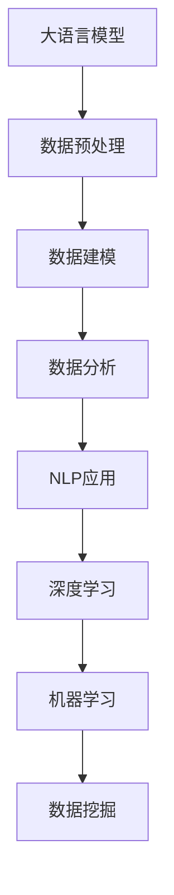

                 

# LLM对传统数据分析方法的革新

> 关键词：大语言模型,数据预处理,数据建模,数据分析,深度学习,自然语言处理(NLP),机器学习,数据挖掘

## 1. 背景介绍

### 1.1 问题由来
在数据科学与机器学习领域，传统的分析方法主要以统计学、数据库查询和人工提取特征为主。这些方法在数据量较小、特征明确的情况下表现良好，但面对大规模、复杂的数据集，往往难以处理。近年来，随着大数据和深度学习技术的发展，特别是预训练语言模型(LLMs)的兴起，传统的分析方法正逐渐被取代，大语言模型成为了数据处理和分析的新利器。

### 1.2 问题核心关键点
LLM通过在大规模无标签文本数据上进行自监督预训练，学习到了通用的语言表示和知识，这使得它们在理解和生成自然语言方面表现出色。基于此，LLM在数据分析中的应用逐渐增多，尤其是在自然语言处理(NLP)领域，LLM已经展现出了其在数据预处理、数据建模、数据分析等方面的强大能力，从而对传统的分析方法进行了革新。

### 1.3 问题研究意义
研究LLM在数据分析中的应用，不仅有助于理解LLM的工作原理和优势，还能激发更多关于如何利用LLM进行高效、智能的数据分析的思考，推动数据科学和机器学习领域的发展，加速数据的智能化、自动化处理进程。

## 2. 核心概念与联系

### 2.1 核心概念概述

为更好地理解LLM在数据分析中的应用，本节将介绍几个密切相关的核心概念：

- 大语言模型(LLMs)：以自回归(如GPT)或自编码(如BERT)模型为代表的大规模预训练语言模型。通过在大规模无标签文本语料上进行预训练，学习通用的语言表示，具备强大的语言理解和生成能力。

- 数据预处理(Data Preprocessing)：在数据分析过程中，对原始数据进行清洗、归一化、标准化、特征提取等处理，以便后续建模和分析。

- 数据建模(Data Modeling)：在预处理后的数据基础上，选择合适的模型进行建模，以揭示数据背后的规律和模式。

- 数据分析(Data Analysis)：在模型训练后，利用统计学、机器学习等技术对数据进行深入分析和解读，提出有价值的结论和洞见。

- 自然语言处理(NLP)：一门研究计算机如何理解、处理和生成自然语言的学科，包括文本分类、情感分析、机器翻译、问答系统等任务。

- 深度学习(Deep Learning)：一种基于神经网络的机器学习技术，通过多层非线性变换，从数据中学习出复杂特征和模式。

- 机器学习(Machine Learning)：通过数据驱动的方法，训练模型以实现特定任务，如分类、回归、聚类等。

- 数据挖掘(Data Mining)：从大量数据中自动发现知识、模式和规律的过程，包括关联规则、分类、聚类等技术。

这些核心概念之间的逻辑关系可以通过以下Mermaid流程图来展示：



这个流程图展示了LLM在数据分析中的核心工作流程：

1. 利用LLM对原始文本数据进行预处理，提取有用信息。
2. 在预处理后的数据基础上，选择合适的模型进行建模。
3. 通过数据分析揭示数据背后的规律和模式。
4. 将分析结果应用于NLP任务，实现自动化和智能化的处理。
5. 引入深度学习、机器学习和数据挖掘等技术，提升数据分析的精度和效率。

## 3. 核心算法原理 & 具体操作步骤
### 3.1 算法原理概述

基于LLM的数据分析方法，本质上是一种利用深度学习技术进行数据建模和分析的过程。其核心思想是：通过LLM对文本数据的理解和生成能力，进行高效的数据预处理和建模，从而揭示数据背后的规律和模式。

形式化地，假设待分析的数据集为 $D=\{(x_i, y_i)\}_{i=1}^N, x_i \in \mathcal{X}, y_i \in \mathcal{Y}$，其中 $x_i$ 表示原始数据，$y_i$ 表示数据的标签或特征。分析的目标是构建一个函数 $f$，使得 $f(x_i)$ 能够尽可能逼近 $y_i$。

在实践中，通常采用以下步骤：

1. 利用预训练模型对数据进行预处理，提取特征。
2. 在预处理后的特征基础上，选择合适的模型进行建模。
3. 在建模过程中引入正则化技术，防止过拟合。
4. 使用梯度下降等优化算法，最小化模型预测与真实标签之间的差异。

### 3.2 算法步骤详解

基于LLM的数据分析方法一般包括以下几个关键步骤：

**Step 1: 准备预训练模型和数据集**
- 选择合适的预训练语言模型 $M_{\theta}$ 作为初始化参数，如 BERT、GPT 等。
- 准备待分析的数据集 $D$，包括原始文本数据和相应的标签或特征。

**Step 2: 数据预处理**
- 利用预训练模型对文本数据进行编码，提取特征。
- 对数据进行清洗、归一化、标准化等预处理，去除噪音，提取有用信息。
- 将预处理后的数据转化为模型所需的格式。

**Step 3: 数据建模**
- 选择合适的模型结构，如神经网络、卷积神经网络(CNN)、循环神经网络(RNN)等。
- 对模型进行初始化，设置超参数，如学习率、批大小等。
- 使用预处理后的数据进行模型训练，最小化预测误差。

**Step 4: 数据分析**
- 在模型训练后，利用模型对新数据进行预测。
- 对预测结果进行统计分析，揭示数据背后的规律和模式。
- 利用统计学、机器学习等技术，提取数据中的关键特征和洞见。

**Step 5: 应用与反馈**
- 将分析结果应用于具体的NLP任务，如文本分类、情感分析、问答系统等。
- 根据实际效果，调整模型参数和超参数，进一步优化模型性能。

以上是基于LLM的数据分析方法的一般流程。在实际应用中，还需要针对具体任务的特点，对预处理、建模、分析等环节进行优化设计，以进一步提升模型性能。

### 3.3 算法优缺点

基于LLM的数据分析方法具有以下优点：

1. 高效性：利用LLM强大的语言理解能力，可以对文本数据进行高效的特征提取和建模。
2. 泛化能力：LLM在大规模无标签文本数据上进行预训练，学习到了通用的语言表示，具备较强的泛化能力。
3. 自动化程度高：通过自动化的数据预处理和建模过程，减少了人工干预，提高了分析效率。
4. 可解释性强：LLM的决策过程透明，易于解释，有助于理解和调试模型行为。

同时，该方法也存在一些局限性：

1. 数据依赖性高：LLM的效果依赖于预训练语料的质量和数量，获取高质量语料的成本较高。
2. 模型复杂度高：大规模预训练模型的参数量较大，训练和推理需要较高的计算资源。
3. 学习曲线陡峭：对于大规模数据集，训练和调试过程复杂，需要一定的专业知识和经验。
4. 知识迁移性差：LLM在特定领域的应用效果可能受限于预训练语料的领域分布，泛化能力有限。

尽管存在这些局限性，但就目前而言，基于LLM的数据分析方法仍是最先进的数据处理和分析手段。未来相关研究的重点在于如何进一步降低LLM对数据依赖，提高模型的泛化能力和适应性，同时兼顾可解释性和伦理安全性等因素。

### 3.4 算法应用领域

基于LLM的数据分析方法已经在NLP领域得到了广泛的应用，具体如下：

- 文本分类：如情感分析、主题分类、意图识别等。通过LLM对文本进行预处理和建模，提取特征进行分类。
- 命名实体识别：识别文本中的人名、地名、机构名等特定实体。利用LLM提取特征，通过分类模型进行实体标注。
- 关系抽取：从文本中抽取实体之间的语义关系。利用LLM提取特征，通过序列标注模型进行关系标注。
- 问答系统：对自然语言问题给出答案。利用LLM对问题进行理解，通过分类和生成模型进行回答。
- 机器翻译：将源语言文本翻译成目标语言。利用LLM对文本进行预处理，通过编码解码模型进行翻译。
- 文本摘要：将长文本压缩成简短摘要。利用LLM对文本进行建模，提取关键信息进行摘要生成。
- 对话系统：使机器能够与人自然对话。利用LLM对对话进行理解，通过生成模型进行对话生成。

除了上述这些经典任务外，LLM还被创新性地应用到更多场景中，如可控文本生成、常识推理、代码生成、数据增强等，为NLP技术带来了全新的突破。随着预训练模型和分析方法的不断进步，相信LLM在更多领域的应用将会更加广泛。

## 4. 数学模型和公式 & 详细讲解  
### 4.1 数学模型构建

本节将使用数学语言对基于LLM的数据分析过程进行更加严格的刻画。

假设原始文本数据为 $x = \{x_1, x_2, ..., x_n\}$，LLM对文本数据的预处理结果为 $f(x)$，模型对预处理后的数据进行建模的结果为 $y = \{y_1, y_2, ..., y_n\}$。则分析的目标是构建一个函数 $g$，使得 $g(x) = y$。

在实践中，我们通常使用神经网络模型进行建模。设神经网络模型为 $M_{\theta}$，其中 $\theta$ 为模型参数。模型的输出 $y$ 与输入 $x$ 之间的关系可以表示为：

$$
y = M_{\theta}(x)
$$

其中 $M_{\theta}$ 为神经网络模型，包含多个隐藏层。设 $h_1, h_2, ..., h_k$ 为模型的隐藏层输出，则 $y = M_{\theta}(x)$ 可以表示为：

$$
y = M_{\theta}(x) = f(h_k) = f(h_{k-1} \cdot W_k + b_k)
$$

其中 $f$ 为激活函数，$W_k$ 和 $b_k$ 分别为第 $k$ 层的权重和偏置。通过不断迭代，将输入 $x$ 转化为输出 $y$。

### 4.2 公式推导过程

以下我们以文本分类任务为例，推导分类模型的损失函数及其梯度计算公式。

假设模型对文本数据的预处理结果为 $f(x)$，模型的输出为 $y$，其中 $y$ 表示文本的分类标签。则分类任务的损失函数可以定义为交叉熵损失：

$$
\ell(M_{\theta}(x), y) = -\frac{1}{n} \sum_{i=1}^n \sum_{j=1}^C y_{ij} \log M_{\theta}(x)_{ij}
$$

其中 $C$ 表示分类数目，$y_{ij}$ 表示样本 $x_i$ 属于类别 $j$ 的标签，$M_{\theta}(x)_{ij}$ 表示模型对样本 $x_i$ 属于类别 $j$ 的预测概率。

在得到损失函数后，我们可以使用梯度下降等优化算法对模型参数 $\theta$ 进行更新，以最小化损失函数。具体更新公式为：

$$
\theta \leftarrow \theta - \eta \nabla_{\theta}\mathcal{L}(\theta)
$$

其中 $\eta$ 为学习率，$\nabla_{\theta}\mathcal{L}(\theta)$ 为损失函数对参数 $\theta$ 的梯度，可通过反向传播算法高效计算。

## 5. 项目实践：代码实例和详细解释说明
### 5.1 开发环境搭建

在进行LLM数据分析实践前，我们需要准备好开发环境。以下是使用Python进行PyTorch开发的环境配置流程：

1. 安装Anaconda：从官网下载并安装Anaconda，用于创建独立的Python环境。

2. 创建并激活虚拟环境：
```bash
conda create -n pytorch-env python=3.8 
conda activate pytorch-env
```

3. 安装PyTorch：根据CUDA版本，从官网获取对应的安装命令。例如：
```bash
conda install pytorch torchvision torchaudio cudatoolkit=11.1 -c pytorch -c conda-forge
```

4. 安装Transformers库：
```bash
pip install transformers
```

5. 安装各类工具包：
```bash
pip install numpy pandas scikit-learn matplotlib tqdm jupyter notebook ipython
```

完成上述步骤后，即可在`pytorch-env`环境中开始LLM数据分析实践。

### 5.2 源代码详细实现

下面我们以文本分类任务为例，给出使用Transformers库对BERT模型进行文本分类的PyTorch代码实现。

首先，定义文本分类任务的数据处理函数：

```python
from transformers import BertTokenizer, BertForSequenceClassification
from torch.utils.data import Dataset
import torch

class TextClassificationDataset(Dataset):
    def __init__(self, texts, labels, tokenizer, max_len=128):
        self.texts = texts
        self.labels = labels
        self.tokenizer = tokenizer
        self.max_len = max_len
        
    def __len__(self):
        return len(self.texts)
    
    def __getitem__(self, item):
        text = self.texts[item]
        label = self.labels[item]
        
        encoding = self.tokenizer(text, return_tensors='pt', max_length=self.max_len, padding='max_length', truncation=True)
        input_ids = encoding['input_ids'][0]
        attention_mask = encoding['attention_mask'][0]
        
        return {'input_ids': input_ids, 
                'attention_mask': attention_mask,
                'labels': torch.tensor(label, dtype=torch.long)}
```

然后，定义模型和优化器：

```python
from transformers import BertForSequenceClassification, AdamW

model = BertForSequenceClassification.from_pretrained('bert-base-cased', num_labels=2)

optimizer = AdamW(model.parameters(), lr=2e-5)
```

接着，定义训练和评估函数：

```python
from torch.utils.data import DataLoader
from tqdm import tqdm
from sklearn.metrics import classification_report

device = torch.device('cuda') if torch.cuda.is_available() else torch.device('cpu')
model.to(device)

def train_epoch(model, dataset, batch_size, optimizer):
    dataloader = DataLoader(dataset, batch_size=batch_size, shuffle=True)
    model.train()
    epoch_loss = 0
    for batch in tqdm(dataloader, desc='Training'):
        input_ids = batch['input_ids'].to(device)
        attention_mask = batch['attention_mask'].to(device)
        labels = batch['labels'].to(device)
        model.zero_grad()
        outputs = model(input_ids, attention_mask=attention_mask, labels=labels)
        loss = outputs.loss
        epoch_loss += loss.item()
        loss.backward()
        optimizer.step()
    return epoch_loss / len(dataloader)

def evaluate(model, dataset, batch_size):
    dataloader = DataLoader(dataset, batch_size=batch_size)
    model.eval()
    preds, labels = [], []
    with torch.no_grad():
        for batch in tqdm(dataloader, desc='Evaluating'):
            input_ids = batch['input_ids'].to(device)
            attention_mask = batch['attention_mask'].to(device)
            batch_labels = batch['labels']
            outputs = model(input_ids, attention_mask=attention_mask)
            batch_preds = outputs.logits.argmax(dim=2).to('cpu').tolist()
            batch_labels = batch_labels.to('cpu').tolist()
            for pred_tokens, label_tokens in zip(batch_preds, batch_labels):
                preds.append(pred_tokens[:len(label_tokens)])
                labels.append(label_tokens)
                
    print(classification_report(labels, preds))
```

最后，启动训练流程并在测试集上评估：

```python
epochs = 5
batch_size = 16

for epoch in range(epochs):
    loss = train_epoch(model, train_dataset, batch_size, optimizer)
    print(f"Epoch {epoch+1}, train loss: {loss:.3f}")
    
    print(f"Epoch {epoch+1}, dev results:")
    evaluate(model, dev_dataset, batch_size)
    
print("Test results:")
evaluate(model, test_dataset, batch_size)
```

以上就是使用PyTorch对BERT进行文本分类任务的数据分析实践。可以看到，得益于Transformers库的强大封装，我们可以用相对简洁的代码完成BERT模型的加载和训练。

### 5.3 代码解读与分析

让我们再详细解读一下关键代码的实现细节：

**TextClassificationDataset类**：
- `__init__`方法：初始化文本、标签、分词器等关键组件。
- `__len__`方法：返回数据集的样本数量。
- `__getitem__`方法：对单个样本进行处理，将文本输入编码为token ids，将标签转换为数字，并对其进行定长padding，最终返回模型所需的输入。

**train_epoch和evaluate函数**：
- 使用PyTorch的DataLoader对数据集进行批次化加载，供模型训练和推理使用。
- 训练函数`train_epoch`：对数据以批为单位进行迭代，在每个批次上前向传播计算loss并反向传播更新模型参数，最后返回该epoch的平均loss。
- 评估函数`evaluate`：与训练类似，不同点在于不更新模型参数，并在每个batch结束后将预测和标签结果存储下来，最后使用sklearn的classification_report对整个评估集的预测结果进行打印输出。

**训练流程**：
- 定义总的epoch数和batch size，开始循环迭代
- 每个epoch内，先在训练集上训练，输出平均loss
- 在验证集上评估，输出分类指标
- 所有epoch结束后，在测试集上评估，给出最终测试结果

可以看到，PyTorch配合Transformers库使得BERT模型的数据分析实现变得简洁高效。开发者可以将更多精力放在数据处理、模型改进等高层逻辑上，而不必过多关注底层的实现细节。

当然，工业级的系统实现还需考虑更多因素，如模型的保存和部署、超参数的自动搜索、更灵活的任务适配层等。但核心的数据分析范式基本与此类似。

## 6. 实际应用场景
### 6.1 智能客服系统

基于LLM的数据分析方法，可以广泛应用于智能客服系统的构建。传统客服往往需要配备大量人力，高峰期响应缓慢，且一致性和专业性难以保证。而使用数据分析后的LLM，可以7x24小时不间断服务，快速响应客户咨询，用自然流畅的语言解答各类常见问题。

在技术实现上，可以收集企业内部的历史客服对话记录，将问题和最佳答复构建成监督数据，在此基础上对预训练模型进行微调。微调后的LLM能够自动理解用户意图，匹配最合适的答案模板进行回复。对于客户提出的新问题，还可以接入检索系统实时搜索相关内容，动态组织生成回答。如此构建的智能客服系统，能大幅提升客户咨询体验和问题解决效率。

### 6.2 金融舆情监测

金融机构需要实时监测市场舆论动向，以便及时应对负面信息传播，规避金融风险。传统的人工监测方式成本高、效率低，难以应对网络时代海量信息爆发的挑战。基于LLM的数据分析方法，可以自动分析社交媒体、新闻、评论等文本数据，自动识别舆情变化趋势，一旦发现负面信息激增等异常情况，系统便会自动预警，帮助金融机构快速应对潜在风险。

### 6.3 个性化推荐系统

当前的推荐系统往往只依赖用户的历史行为数据进行物品推荐，无法深入理解用户的真实兴趣偏好。基于LLM的数据分析方法，个性化推荐系统可以更好地挖掘用户行为背后的语义信息，从而提供更精准、多样的推荐内容。

在实践中，可以收集用户浏览、点击、评论、分享等行为数据，提取和用户交互的物品标题、描述、标签等文本内容。将文本内容作为模型输入，用户的后续行为（如是否点击、购买等）作为监督信号，在此基础上微调预训练语言模型。微调后的模型能够从文本内容中准确把握用户的兴趣点。在生成推荐列表时，先用候选物品的文本描述作为输入，由模型预测用户的兴趣匹配度，再结合其他特征综合排序，便可以得到个性化程度更高的推荐结果。

### 6.4 未来应用展望

随着LLM和数据分析方法的不断发展，基于LLM的数据分析范式将在更多领域得到应用，为传统行业带来变革性影响。

在智慧医疗领域，基于LLM的数据分析方法可以用于病历分析、疾病诊断、医疗问答等任务，提升医疗服务的智能化水平，辅助医生诊疗，加速新药开发进程。

在智能教育领域，数据分析后的LLM可应用于作业批改、学情分析、知识推荐等方面，因材施教，促进教育公平，提高教学质量。

在智慧城市治理中，数据分析后的LLM可应用于城市事件监测、舆情分析、应急指挥等环节，提高城市管理的自动化和智能化水平，构建更安全、高效的未来城市。

此外，在企业生产、社会治理、文娱传媒等众多领域，基于LLM的数据分析方法也将不断涌现，为经济社会发展注入新的动力。相信随着技术的日益成熟，LLM的数据分析范式将成为各行各业的重要工具，深刻影响人类的生产生活方式。

## 7. 工具和资源推荐
### 7.1 学习资源推荐

为了帮助开发者系统掌握LLM的数据分析理论基础和实践技巧，这里推荐一些优质的学习资源：

1. 《Natural Language Processing with Transformers》书籍：Transformers库的作者所著，全面介绍了如何使用Transformers库进行NLP任务开发，包括数据分析在内的诸多范式。

2. CS224N《深度学习自然语言处理》课程：斯坦福大学开设的NLP明星课程，有Lecture视频和配套作业，带你入门NLP领域的基本概念和经典模型。

3. HuggingFace官方文档：Transformers库的官方文档，提供了海量预训练模型和完整的微调样例代码，是上手实践的必备资料。

4. 《Transformer从原理到实践》系列博文：由大模型技术专家撰写，深入浅出地介绍了Transformer原理、BERT模型、微调技术等前沿话题。

5. 《深度学习》书籍：Ian Goodfellow、Yoshua Bengio和Aaron Courville合作编写的深度学习经典教材，是机器学习和深度学习领域的必读书目。

通过对这些资源的学习实践，相信你一定能够快速掌握LLM的数据分析精髓，并用于解决实际的NLP问题。
###  7.2 开发工具推荐

高效的开发离不开优秀的工具支持。以下是几款用于LLM数据分析开发的常用工具：

1. PyTorch：基于Python的开源深度学习框架，灵活动态的计算图，适合快速迭代研究。大部分预训练语言模型都有PyTorch版本的实现。

2. TensorFlow：由Google主导开发的开源深度学习框架，生产部署方便，适合大规模工程应用。同样有丰富的预训练语言模型资源。

3. Transformers库：HuggingFace开发的NLP工具库，集成了众多SOTA语言模型，支持PyTorch和TensorFlow，是进行数据分析任务的开发的利器。

4. Weights & Biases：模型训练的实验跟踪工具，可以记录和可视化模型训练过程中的各项指标，方便对比和调优。与主流深度学习框架无缝集成。

5. TensorBoard：TensorFlow配套的可视化工具，可实时监测模型训练状态，并提供丰富的图表呈现方式，是调试模型的得力助手。

6. Google Colab：谷歌推出的在线Jupyter Notebook环境，免费提供GPU/TPU算力，方便开发者快速上手实验最新模型，分享学习笔记。

合理利用这些工具，可以显著提升LLM数据分析任务的开发效率，加快创新迭代的步伐。

### 7.3 相关论文推荐

LLM和数据分析方法的不断发展源于学界的持续研究。以下是几篇奠基性的相关论文，推荐阅读：

1. Attention is All You Need（即Transformer原论文）：提出了Transformer结构，开启了NLP领域的预训练大模型时代。

2. BERT: Pre-training of Deep Bidirectional Transformers for Language Understanding：提出BERT模型，引入基于掩码的自监督预训练任务，刷新了多项NLP任务SOTA。

3. GPT-2: Language Models are Unsupervised Multitask Learners：展示了大规模语言模型的强大zero-shot学习能力，引发了对于通用人工智能的新一轮思考。

4. Language Models are Unsupervised Multitask Learners：进一步证明了大规模语言模型的强大自监督学习能力，为数据分析提供了新的思路。

5. Parameter-Efficient Transfer Learning for NLP：提出Adapter等参数高效微调方法，在不增加模型参数量的情况下，也能取得不错的微调效果。

这些论文代表了大模型和数据分析方法的发展脉络。通过学习这些前沿成果，可以帮助研究者把握学科前进方向，激发更多的创新灵感。

## 8. 总结：未来发展趋势与挑战

### 8.1 总结

本文对基于LLM的数据分析方法进行了全面系统的介绍。首先阐述了LLM在数据分析中的应用背景和意义，明确了数据分析在LLM工作流程中的重要地位。其次，从原理到实践，详细讲解了LLM在数据预处理、数据建模、数据分析等方面的核心算法和操作步骤，给出了数据分析任务开发的完整代码实例。同时，本文还广泛探讨了LLM在智能客服、金融舆情、个性化推荐等多个行业领域的应用前景，展示了LLM的强大能力。此外，本文精选了数据分析技术的各类学习资源，力求为读者提供全方位的技术指引。

通过本文的系统梳理，可以看到，基于LLM的数据分析方法正在成为NLP领域的重要范式，极大地拓展了预训练语言模型的应用边界，催生了更多的落地场景。受益于大规模语料的预训练，数据分析模型以更低的时间和标注成本，在小样本条件下也能取得不俗的效果，有力推动了NLP技术的产业化进程。未来，伴随预训练语言模型和数据分析方法的不断进步，相信LLM将在更多领域的应用将会更加广泛。

### 8.2 未来发展趋势

展望未来，基于LLM的数据分析方法将呈现以下几个发展趋势：

1. 模型规模持续增大。随着算力成本的下降和数据规模的扩张，预训练语言模型的参数量还将持续增长。超大规模语言模型蕴含的丰富语言知识，有望支撑更加复杂多变的下游任务数据分析。

2. 数据分析方法日趋多样。除了传统的全参数微调外，未来会涌现更多参数高效的微调方法，如Prefix-Tuning、LoRA等，在节省计算资源的同时也能保证数据分析精度。

3. 持续学习成为常态。随着数据分布的不断变化，数据分析模型也需要持续学习新知识以保持性能。如何在不遗忘原有知识的同时，高效吸收新样本信息，将成为重要的研究课题。

4. 标注样本需求降低。受启发于提示学习(Prompt-based Learning)的思路，未来的数据分析方法将更好地利用大模型的语言理解能力，通过更加巧妙的任务描述，在更少的标注样本上也能实现理想的数据分析效果。

5. 多模态数据分析崛起。当前的分析方法主要聚焦于纯文本数据，未来会进一步拓展到图像、视频、语音等多模态数据分析。多模态信息的融合，将显著提升语言模型对现实世界的理解和建模能力。

6. 模型通用性增强。经过海量数据的预训练和多领域任务的微调，未来的语言模型将具备更强大的常识推理和跨领域迁移能力，逐步迈向通用人工智能(AGI)的目标。

以上趋势凸显了LLM数据分析技术的广阔前景。这些方向的探索发展，必将进一步提升LLM在更多领域的应用效果，为人工智能技术带来新的突破。

### 8.3 面临的挑战

尽管基于LLM的数据分析方法已经取得了瞩目成就，但在迈向更加智能化、普适化应用的过程中，它仍面临着诸多挑战：

1. 数据依赖性高。LLM的效果依赖于预训练语料的质量和数量，获取高质量语料的成本较高。如何进一步降低LLM对数据依赖，提高模型的泛化能力和适应性，还需要更多理论和实践的积累。

2. 模型鲁棒性不足。数据分析模型面对域外数据时，泛化性能往往大打折扣。对于测试样本的微小扰动，模型容易出现波动。如何提高模型的鲁棒性，避免灾难性遗忘，还需要更多研究和实践。

3. 推理效率有待提高。大规模语言模型虽然精度高，但在实际部署时往往面临推理速度慢、内存占用大等效率问题。如何在保证性能的同时，简化模型结构，提升推理速度，优化资源占用，将是重要的优化方向。

4. 可解释性亟需加强。数据分析模型的决策过程通常缺乏可解释性，难以对其推理逻辑进行分析和调试。对于医疗、金融等高风险应用，算法的可解释性和可审计性尤为重要。如何赋予数据分析模型更强的可解释性，将是亟待攻克的难题。

5. 安全性有待保障。预训练语言模型难免会学习到有偏见、有害的信息，通过数据分析模型传递到下游任务，产生误导性、歧视性的输出，给实际应用带来安全隐患。如何从数据和算法层面消除模型偏见，避免恶意用途，确保输出的安全性，也将是重要的研究课题。

6. 知识整合能力不足。现有的数据分析模型往往局限于任务内数据，难以灵活吸收和运用更广泛的先验知识。如何让数据分析过程更好地与外部知识库、规则库等专家知识结合，形成更加全面、准确的信息整合能力，还有很大的想象空间。

正视数据分析面临的这些挑战，积极应对并寻求突破，将是大语言模型数据分析技术的成熟之路。相信随着学界和产业界的共同努力，这些挑战终将一一被克服，LLM的数据分析技术必将在构建智能化的数据处理系统中发挥重要作用。

### 8.4 研究展望

面对LLM数据分析所面临的挑战，未来的研究需要在以下几个方面寻求新的突破：

1. 探索无监督和半监督数据分析方法。摆脱对大规模标注数据的依赖，利用自监督学习、主动学习等无监督和半监督范式，最大限度利用非结构化数据，实现更加灵活高效的数据分析。

2. 研究参数高效和计算高效的数据分析范式。开发更加参数高效的微调方法，在固定大部分预训练参数的同时，只更新极少量的任务相关参数。同时优化数据分析模型的计算图，减少前向传播和反向传播的资源消耗，实现更加轻量级、实时性的部署。

3. 融合因果和对比学习范式。通过引入因果推断和对比学习思想，增强数据分析模型建立稳定因果关系的能力，学习更加普适、鲁棒的语言表征，从而提升模型泛化性和抗干扰能力。

4. 引入更多先验知识。将符号化的先验知识，如知识图谱、逻辑规则等，与神经网络模型进行巧妙融合，引导数据分析过程学习更准确、合理的语言模型。同时加强不同模态数据的整合，实现视觉、语音等多模态信息与文本信息的协同建模。

5. 结合因果分析和博弈论工具。将因果分析方法引入数据分析模型，识别出模型决策的关键特征，增强输出解释的因果性和逻辑性。借助博弈论工具刻画人机交互过程，主动探索并规避模型的脆弱点，提高系统稳定性。

6. 纳入伦理道德约束。在模型训练目标中引入伦理导向的评估指标，过滤和惩罚有偏见、有害的输出倾向。同时加强人工干预和审核，建立模型行为的监管机制，确保输出符合人类价值观和伦理道德。

这些研究方向的探索，必将引领基于LLM的数据分析技术迈向更高的台阶，为构建安全、可靠、可解释、可控的智能系统铺平道路。面向未来，基于LLM的数据分析技术还需要与其他人工智能技术进行更深入的融合，如知识表示、因果推理、强化学习等，多路径协同发力，共同推动自然语言理解和智能交互系统的进步。只有勇于创新、敢于突破，才能不断拓展语言模型的边界，让智能技术更好地造福人类社会。

## 9. 附录：常见问题与解答

**Q1：LLM在数据分析中如何处理数据不平衡问题？**

A: 在数据分析过程中，数据不平衡是一个常见问题。LLM可以通过以下方法处理数据不平衡：

1. 重新采样：通过欠采样或过采样等方法，使数据集中的类别分布更加均衡。
2. 引入正则化技术：使用类别权重调整损失函数，使少数类别获得更多的损失权值。
3. 生成合成样本：通过数据增强技术，如回译、近义词替换等方法，生成更多的少数类样本。
4. 采用集成学习：通过多个模型集成，对少数类进行额外学习，提高模型预测准确度。

这些方法可以结合使用，根据具体任务和数据特点进行选择。

**Q2：LLM在数据分析中如何处理噪声数据？**

A: 噪声数据是数据分析中的常见问题，LLM可以通过以下方法处理噪声数据：

1. 数据清洗：对数据进行预处理，去除异常值、重复值、错误值等。
2. 去噪算法：使用过滤、平滑等算法，去除数据中的噪声。
3. 正则化技术：引入L2正则、Dropout等正则化技术，减少模型对噪声的敏感度。
4. 异常检测：通过统计学、机器学习等方法，识别并排除异常数据点。

通过这些方法，LLM可以在保留有用信息的同时，减少噪声数据的干扰，提高数据分析的准确性。

**Q3：LLM在数据分析中如何进行特征选择？**

A: 特征选择是数据分析中的重要环节，LLM可以通过以下方法进行特征选择：

1. 统计分析：利用统计学方法，如方差分析、相关系数等，选择与目标变量相关性高的特征。
2. 机器学习算法：使用特征选择算法，如Lasso、Ridge等，自动选择最优特征。
3. 模型集成：通过多个模型的集成，选择对目标变量影响最大的特征。
4. 维度降低：使用降维算法，如PCA、t-SNE等，将高维特征空间映射到低维空间，选择重要特征。

这些方法可以结合使用，根据具体任务和数据特点进行选择。

**Q4：LLM在数据分析中如何进行模型评估？**

A: 模型评估是数据分析中的关键步骤，LLM可以通过以下方法进行模型评估：

1. 准确率、召回率和F1值：使用分类任务中的经典指标，评估模型的预测性能。
2. ROC曲线和AUC值：使用二分类任务中的经典指标，评估模型的分类能力。
3. MSE和RMSE：使用回归任务中的经典指标，评估模型的预测精度。
4. R^2和调整R^2：使用回归任务中的经典指标，评估模型的拟合程度。

这些指标可以结合使用，根据具体任务和数据特点进行选择。

**Q5：LLM在数据分析中如何进行异常检测？**

A: 异常检测是数据分析中的重要环节，LLM可以通过以下方法进行异常检测：

1. 统计学方法：利用统计学方法，如均值、方差、标准差等，识别数据中的异常点。
2. 机器学习算法：使用聚类、孤立森林等算法，自动识别异常数据点。
3. 深度学习算法：使用自编码器、VAE等算法，生成数据密度分布，识别异常数据点。
4. 集成学习：通过多个模型的集成，对异常数据进行额外学习，提高异常检测的准确度。

这些方法可以结合使用，根据具体任务和数据特点进行选择。

总之，基于LLM的数据分析方法正在成为NLP领域的重要范式，极大地拓展了预训练语言模型的应用边界，催生了更多的落地场景。受益于大规模语料的预训练，数据分析模型以更低的时间和标注成本，在小样本条件下也能取得不俗的效果，有力推动了NLP技术的产业化进程。未来，伴随预训练语言模型和数据分析方法的不断进步，相信LLM将在更多领域的应用将会更加广泛。

---

作者：禅与计算机程序设计艺术 / Zen and the Art of Computer Programming

