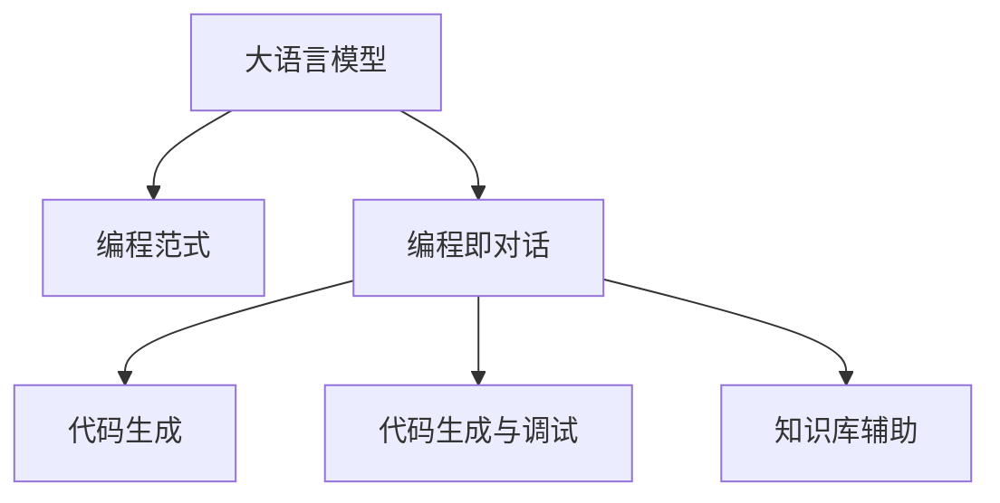

                 

# LLM对传统编程范式的冲击

## 1. 背景介绍

### 1.1 问题由来
伴随着人工智能技术的飞速发展，大语言模型(LLM)的应用日益广泛。LLM 能够理解和生成自然语言，并在多模态任务上取得优异的性能。与此同时，传统的编程范式（如面向对象编程(OOP)、函数式编程(FP)等）正在逐渐被大语言模型冲击，衍生出一种新的编程范式——编程即对话(Chat-based Programming)。这种范式以自然语言作为主要的交互方式，利用大语言模型的强大理解能力，重构了传统的编程流程。

### 1.2 问题核心关键点
LLM对编程范式的冲击主要体现在以下几个方面：
- 自动化编码：大语言模型能够根据自然语言描述，自动生成代码，减少了手动编码的工作量。
- 代码修改：利用大语言模型的修改能力，可以更方便地对现有代码进行改写和优化。
- 交互式调试：借助大语言模型的推理能力，可以进行交互式调试，提升开发效率。
- 知识库辅助：通过构建基于大语言模型的知识库，可以更好地辅助开发和问题解决。
- 代码生成：大语言模型能够生成更自然、更符合语法规则的代码，提升代码质量。

这种新的编程范式能够显著提高开发效率和代码质量，但同时也带来了新的挑战，如代码可读性、可维护性、安全性等问题。本文将详细探讨LLM对传统编程范式的冲击，并提出相应的应对策略。

## 2. 核心概念与联系

### 2.1 核心概念概述

为了更好地理解LLM对编程范式的冲击，本节将介绍几个密切相关的核心概念：

- 大语言模型(LLM)：以自回归(如GPT)或自编码(如BERT)模型为代表的大规模预训练语言模型。通过在大规模无标签文本语料上进行预训练，学习通用的语言表示，具备强大的语言理解和生成能力。

- 编程范式(Programming Paradigm)：编程的方式和结构，如面向对象编程(OOP)、函数式编程(FP)、过程式编程、逻辑编程等。不同的编程范式在代码结构、语言特性、开发流程等方面存在差异。

- 编程即对话(Chat-based Programming)：一种新兴的编程范式，利用大语言模型的自然语言理解和生成能力，实现与开发环境的对话式交互，从而辅助代码编写和调试。

- 代码生成(Code Generation)：利用大语言模型的自然语言生成能力，自动生成符合语法规则的代码，提升开发效率和代码质量。

- 代码生成与调试：结合大语言模型的代码生成能力和交互式调试功能，可以在无需编写代码的情况下，通过自然语言指令解决编程问题。

- 知识库辅助：构建基于大语言模型的知识库，用于辅助编程、问题解决和知识管理。

这些核心概念之间的逻辑关系可以通过以下Mermaid流程图来展示：



这个流程图展示了大语言模型对编程范式的关键概念及其之间的关系：

1. 大语言模型通过预训练获得基础能力。
2. 编程即对话利用大语言模型的理解能力，辅助代码编写和调试。
3. 代码生成通过大语言模型的生成能力，自动生成代码。
4. 代码生成与调试结合代码生成和交互式调试，实现更高效的问题解决。
5. 知识库辅助利用大语言模型的知识管理能力，辅助编程和管理。

这些概念共同构成了基于大语言模型的编程范式，使其能够在各种场景下发挥强大的自然语言处理能力。通过理解这些核心概念，我们可以更好地把握LLM在编程领域的应用和影响。

## 3. 核心算法原理 & 具体操作步骤

### 3.1 算法原理概述

基于大语言模型的编程范式，本质上是一种自然语言处理和编程语言结合的新型范式。其核心思想是：将大语言模型作为辅助编程的工具，利用其强大的自然语言理解能力，自动生成代码、修改代码、调试代码，从而提升开发效率和代码质量。

形式化地，假设大语言模型为 $M_{\theta}$，其中 $\theta$ 为模型参数。给定自然语言描述 $D$，编程即对话系统的目标是最小化编码和调试过程的时间复杂度，即找到最优的 $D$，使得在 $M_{\theta}$ 下，从自然语言描述到生成的代码的时间复杂度最小。

通过梯度下降等优化算法，对话系统不断更新模型参数 $\theta$，最小化时间复杂度，使得代码生成和调试过程尽可能高效。由于 $\theta$ 已经通过预训练获得了较好的初始化，因此即便在自然语言指令下进行对话，也能较快收敛到理想的代码。

### 3.2 算法步骤详解

基于大语言模型的编程范式一般包括以下几个关键步骤：

**Step 1: 准备自然语言指令和代码库**
- 收集或编写自然语言指令，描述具体的编程任务。
- 准备一个包含常见算法和数据结构的代码库，供大语言模型参考。

**Step 2: 初始化对话系统**
- 构建基于大语言模型的编程即对话系统，选择合适的模型和解码器。
- 在模型中集成代码库，并设置合适的预训练权重。

**Step 3: 编写自然语言指令**
- 将任务需求编写成自然语言指令，提交给对话系统。
- 对话系统利用自然语言理解能力，解析指令并生成代码。

**Step 4: 运行和调试代码**
- 将生成的代码提交给编译器或解释器，运行并查看结果。
- 对话系统根据输出结果，生成修改建议或进一步的调试指令。

**Step 5: 迭代优化**
- 反复迭代代码生成和调试过程，直至达到满意的结果。
- 对话系统记录每次操作和生成的代码，构建知识库，提升未来性能。

以上是基于大语言模型的编程范式的一般流程。在实际应用中，还需要针对具体任务的特点，对对话过程的各个环节进行优化设计，如改进自然语言指令的格式，引入更多的正则化技术，搜索最优的超参数组合等，以进一步提升开发效率和代码质量。

### 3.3 算法优缺点

基于大语言模型的编程范式具有以下优点：
1. 自动化程度高。利用大语言模型的自然语言理解能力，自动生成代码，减少了手动编码的工作量。
2. 开发效率高。代码生成和调试过程可以并行进行，大大提升开发效率。
3. 代码质量高。大语言模型生成的代码符合语法规则，并具有可读性和可维护性。
4. 交互性良好。通过自然语言指令进行交互，更容易理解和调试。
5. 知识管理便捷。构建基于大语言模型的知识库，便于代码共享和问题解决。

同时，该范式也存在一定的局限性：
1. 依赖大语言模型。对话系统的性能很大程度上取决于大语言模型的能力，模型的准确性和鲁棒性会直接影响代码质量和系统可靠性。
2. 语言歧义问题。自然语言指令存在歧义，不同的解释可能导致不同的代码生成结果，需要进一步优化自然语言理解。
3. 数据隐私问题。对话系统中会涉及大量的代码和数据，数据隐私和安全问题需要特别关注。
4. 代码的可解释性不足。生成的代码难以直接理解，需要开发工具辅助解释和调试。

尽管存在这些局限性，但就目前而言，基于大语言模型的编程范式仍然是一种极具潜力的新型编程方法。未来相关研究的重点在于如何进一步提高模型的准确性和鲁棒性，降低对自然语言指令的依赖，提高系统的可解释性和数据隐私保护。

### 3.4 算法应用领域

基于大语言模型的编程范式已经在多个领域得到了应用，例如：

- 软件开发生命周期：从需求分析、代码生成、调试、测试等各个环节，都可以利用大语言模型辅助开发。
- 数据科学：在数据清洗、特征工程、模型训练等任务中，可以利用大语言模型自动生成代码。
- 人工智能应用：在模型训练、推理、部署等环节，大语言模型可以生成代码、调试模型、优化超参数。
- 自动化运维：在运维自动化中，利用大语言模型生成脚本、修改配置、诊断问题，提升运维效率。

除了上述这些经典应用外，大语言模型在教育、金融、医疗等多个领域的应用也将不断涌现，为相关行业的数字化转型升级提供新的技术路径。

## 4. 数学模型和公式 & 详细讲解 & 举例说明

### 4.1 数学模型构建

本节将使用数学语言对基于大语言模型的编程范式进行更加严格的刻画。

假设大语言模型为 $M_{\theta}$，其中 $\theta$ 为模型参数。给定自然语言描述 $D$，编程即对话系统的目标是最小化编码和调试过程的时间复杂度，即找到最优的 $D$，使得在 $M_{\theta}$ 下，从自然语言描述到生成的代码的时间复杂度最小。

定义生成代码的损失函数为 $\ell(D)$，则在自然语言指令 $D$ 下的时间复杂度为：

$$
C(D) = \min_{\theta} \ell(D)
$$

其中 $\ell(D)$ 为自然语言指令 $D$ 在模型 $M_{\theta}$ 下的损失函数。

通过梯度下降等优化算法，对话系统不断更新模型参数 $\theta$，最小化损失函数 $\ell(D)$，使得自然语言指令 $D$ 对应的代码生成尽可能高效。

### 4.2 公式推导过程

以下我们以代码生成为例，推导自然语言指令到代码生成的损失函数及其梯度的计算公式。

假设自然语言指令为 $D$，生成的代码为 $C$。定义代码生成过程的损失函数为：

$$
\ell(D) = \text{L1Loss}(D_{\text{desc}}, D_{\text{code}})
$$

其中 $\text{L1Loss}$ 为均方误差损失函数，$D_{\text{desc}}$ 为自然语言指令，$D_{\text{code}}$ 为生成的代码。

将其代入时间复杂度公式，得：

$$
C(D) = \min_{\theta} \text{L1Loss}(D_{\text{desc}}, D_{\text{code}})
$$

根据链式法则，损失函数对自然语言指令 $D$ 的梯度为：

$$
\frac{\partial C(D)}{\partial D} = -\frac{\partial \text{L1Loss}(D_{\text{desc}}, D_{\text{code}})}{\partial D_{\text{desc}}}
$$

其中 $D_{\text{desc}}$ 为自然语言指令 $D$ 的表示形式。

在得到损失函数的梯度后，即可带入参数更新公式，完成模型的迭代优化。重复上述过程直至收敛，最终得到适应自然语言指令 $D$ 的最优模型参数 $\theta$。

## 5. 项目实践：代码实例和详细解释说明

### 5.1 开发环境搭建

在进行代码生成实践前，我们需要准备好开发环境。以下是使用Python进行PyTorch开发的环境配置流程：

1. 安装Anaconda：从官网下载并安装Anaconda，用于创建独立的Python环境。

2. 创建并激活虚拟环境：
```bash
conda create -n pytorch-env python=3.8 
conda activate pytorch-env
```

3. 安装PyTorch：根据CUDA版本，从官网获取对应的安装命令。例如：
```bash
conda install pytorch torchvision torchaudio cudatoolkit=11.1 -c pytorch -c conda-forge
```

4. 安装Transformers库：
```bash
pip install transformers
```

5. 安装各类工具包：
```bash
pip install numpy pandas scikit-learn matplotlib tqdm jupyter notebook ipython
```

完成上述步骤后，即可在`pytorch-env`环境中开始代码生成实践。

### 5.2 源代码详细实现

下面我们以生成Fibonacci数列为例，给出使用Transformers库进行代码生成的PyTorch代码实现。

首先，定义自然语言指令处理函数：

```python
from transformers import AutoTokenizer, AutoModelForCausalLM

tokenizer = AutoTokenizer.from_pretrained('gpt2')
model = AutoModelForCausalLM.from_pretrained('gpt2')

def codegen_desc(desc):
    inputs = tokenizer(desc, return_tensors='pt')
    outputs = model.generate(inputs['input_ids'], max_length=100, num_return_sequences=1, temperature=1.0, top_p=0.9)
    return tokenizer.decode(outputs[0])

# 示例自然语言指令
desc = "写一个Fibonacci数列生成器"
code = codegen_desc(desc)
print(code)
```

然后，定义代码实现：

```python
def fibonacci(n):
    if n == 0:
        return 0
    elif n == 1:
        return 1
    else:
        return fibonacci(n-1) + fibonacci(n-2)

# 生成代码
code = codegen_desc(desc)
```

接着，执行代码并验证结果：

```python
print(code)
# 测试生成的代码
print(fibonacci(10))
```

以上就是使用PyTorch对Fibonacci数列进行代码生成的完整代码实现。可以看到，Transformers库为代码生成提供了强大的自然语言处理能力，开发者可以将更多精力放在代码逻辑上，而不必过多关注底层的实现细节。

### 5.3 代码解读与分析

让我们再详细解读一下关键代码的实现细节：

**自然语言指令处理函数**：
- `tokenizer(desc, return_tensors='pt')`：将自然语言指令转换成模型输入，返回表示形式的tensor。
- `model.generate(inputs['input_ids'], max_length=100, num_return_sequences=1, temperature=1.0, top_p=0.9)`：在模型上进行代码生成，返回生成的代码tensor。

**代码实现**：
- `fibonacci(n)`：定义Fibonacci数列的递归实现。
- `codegen_desc(desc)`：调用自然语言指令处理函数，生成代码并返回。

**执行代码并验证结果**：
- 测试生成的代码是否符合Fibonacci数列的定义。

可以看到，PyTorch配合Transformers库使得代码生成过程变得简洁高效。开发者可以将更多精力放在自然语言指令的设计和代码逻辑的验证上，而不必过多关注底层的实现细节。

当然，工业级的系统实现还需考虑更多因素，如模型的保存和部署、超参数的自动搜索、更灵活的指令格式等。但核心的代码生成范式基本与此类似。

## 6. 实际应用场景

### 6.1 软件开发

基于大语言模型的编程范式，可以显著提升软件开发效率和代码质量。特别是在软件开发生命周期的需求分析和代码实现阶段，大语言模型能够自动生成符合要求的代码，节省手动编码的时间。

例如，在需求分析阶段，利用大语言模型自动生成需求文档，明确开发要求和预期结果。在代码实现阶段，利用大语言模型生成符合规范的代码，并辅助进行代码改写和调试，提升代码质量和开发效率。

### 6.2 数据科学

数据科学领域需要大量的数据处理和模型训练，工作量大且复杂。利用大语言模型生成的代码，可以自动执行数据清洗、特征工程、模型训练等任务，提高数据科学工作的效率和准确性。

例如，在大数据处理中，利用大语言模型自动生成SQL代码，执行复杂的数据查询和清洗任务。在模型训练中，利用大语言模型生成模型代码，简化模型训练流程。

### 6.3 人工智能应用

在人工智能应用中，模型训练和推理是重要环节。利用大语言模型自动生成训练代码和推理代码，可以提高模型训练和推理的速度和准确性。

例如，在模型训练中，利用大语言模型自动生成训练代码，设置模型参数和训练超参数，提升模型训练效率。在模型推理中，利用大语言模型生成推理代码，简化推理过程。

### 6.4 未来应用展望

随着大语言模型和代码生成技术的不断发展，基于LLM的编程范式将在更多领域得到应用，为软件开发、数据科学、人工智能等领域带来变革性影响。

在智慧医疗领域，利用大语言模型自动生成医疗软件代码，提升医疗软件的开发效率和代码质量。

在智能教育领域，利用大语言模型生成教育软件代码，提升教学软件的开发效率和代码质量。

在智慧城市治理中，利用大语言模型生成智能城市管理软件代码，提升城市管理的自动化和智能化水平。

此外，在企业生产、社会治理、文娱传媒等众多领域，基于LLM的编程范式也将不断涌现，为相关行业的数字化转型升级提供新的技术路径。相信随着技术的日益成熟，LLM将在大规模软件开发、智能化升级、应用系统集成等方面发挥更大的作用。

## 7. 工具和资源推荐

### 7.1 学习资源推荐

为了帮助开发者系统掌握大语言模型在编程中的应用，这里推荐一些优质的学习资源：

1. 《深度学习与自然语言处理》：斯坦福大学《CS224N: 深度学习与自然语言处理》课程，涵盖自然语言处理和深度学习的基本概念和经典模型。

2. 《Python深度学习》：谷歌《Deep Learning with Python》书籍，深入浅出地介绍了深度学习在Python中的实现，包括代码生成等前沿话题。

3. 《大语言模型与代码生成》：Microsoft《Big Language Model and Code Generation》白皮书，全面介绍了大语言模型在代码生成中的应用和挑战。

4. 《Transformers》：HuggingFace《Transformers: State-of-the-Art Machine Learning for Natural Language Processing》书籍，介绍了Transformer在自然语言处理中的应用，包括代码生成。

5. 《代码生成技术与应用》：Codex《Code Generation Technology and Application》报告，全面分析了代码生成技术的现状和未来发展方向。

通过对这些资源的学习实践，相信你一定能够快速掌握大语言模型在编程中的应用，并用于解决实际的编程问题。

### 7.2 开发工具推荐

高效的开发离不开优秀的工具支持。以下是几款用于大语言模型编程范式开发的常用工具：

1. PyTorch：基于Python的开源深度学习框架，灵活动态的计算图，适合快速迭代研究。

2. TensorFlow：由Google主导开发的开源深度学习框架，生产部署方便，适合大规模工程应用。

3. Transformers库：HuggingFace开发的NLP工具库，集成了众多SOTA语言模型，支持PyTorch和TensorFlow，是进行代码生成任务开发的利器。

4. Weights & Biases：模型训练的实验跟踪工具，可以记录和可视化模型训练过程中的各项指标，方便对比和调优。

5. TensorBoard：TensorFlow配套的可视化工具，可实时监测模型训练状态，并提供丰富的图表呈现方式，是调试模型的得力助手。

6. Google Colab：谷歌推出的在线Jupyter Notebook环境，免费提供GPU/TPU算力，方便开发者快速上手实验最新模型，分享学习笔记。

合理利用这些工具，可以显著提升大语言模型编程范式的开发效率，加快创新迭代的步伐。

### 7.3 相关论文推荐

大语言模型和代码生成技术的发展源于学界的持续研究。以下是几篇奠基性的相关论文，推荐阅读：

1. Attention is All You Need：提出了Transformer结构，开启了NLP领域的预训练大模型时代。

2. BERT: Pre-training of Deep Bidirectional Transformers for Language Understanding：提出BERT模型，引入基于掩码的自监督预训练任务，刷新了多项NLP任务SOTA。

3. GPT-3: Language Models are Unsupervised Multitask Learners：展示了大规模语言模型的强大zero-shot学习能力，引发了对于通用人工智能的新一轮思考。

4. Coupling Large Language Models and Neural Program Synthesis：探讨大语言模型与程序合成技术结合的潜力，生成符合要求的代码。

5. Learning to Program from Natural Language：研究如何通过自然语言指令，自动生成代码和调试过程。

6. Transformer-XL: Attentive Language Models Beyond a Fixed-Length Context：提出Transformer-XL模型，增强模型对长序列的处理能力，支持更复杂的代码生成任务。

这些论文代表了大语言模型代码生成技术的发展脉络。通过学习这些前沿成果，可以帮助研究者把握学科前进方向，激发更多的创新灵感。

## 8. 总结：未来发展趋势与挑战

### 8.1 总结

本文对基于大语言模型的编程范式进行了全面系统的介绍。首先阐述了LLM和编程范式的研究背景和意义，明确了编程即对话范式在自动化编码、代码修改、交互式调试等方面的独特价值。其次，从原理到实践，详细讲解了编程即对话系统的数学原理和关键步骤，给出了代码生成的完整代码实例。同时，本文还广泛探讨了编程即对话范式在软件开发、数据科学、人工智能等多个领域的应用前景，展示了LLM在编程领域的应用和影响。

通过本文的系统梳理，可以看到，基于大语言模型的编程范式正在成为一种新兴的编程方法，显著提升开发效率和代码质量，带来广泛的应用前景。未来，伴随LLM和代码生成技术的持续演进，基于LLM的编程范式将更加成熟，成为软件开发、数据科学、人工智能等领域的重要工具。

### 8.2 未来发展趋势

展望未来，大语言模型代码生成技术将呈现以下几个发展趋势：

1. 自动化程度持续提升。未来代码生成技术将更加自动化，能够自动生成更自然、更符合语法规则的代码。

2. 代码质量逐步提高。代码生成的准确性和可读性将进一步提升，代码生成技术将更加灵活，适应不同的编程语言和编程范式。

3. 代码生成与调试一体化。结合代码生成和交互式调试，形成更高效、更全面的编程范式。

4. 知识库辅助更加智能。基于大语言模型的知识库将更加智能，能够更好地辅助编程、问题解决和知识管理。

5. 应用领域不断扩展。未来代码生成技术将在更多领域得到应用，如智慧医疗、智能教育、智慧城市等，为各行各业带来变革性影响。

以上趋势凸显了大语言模型代码生成技术的广阔前景。这些方向的探索发展，必将进一步提升LLM在编程领域的应用效果，为软件开发、数据科学、人工智能等领域带来更大的价值。

### 8.3 面临的挑战

尽管大语言模型代码生成技术已经取得了瞩目成就，但在迈向更加智能化、普适化应用的过程中，它仍面临着诸多挑战：

1. 语言歧义问题。自然语言指令存在歧义，不同的解释可能导致不同的代码生成结果，需要进一步优化自然语言理解。

2. 数据隐私问题。代码生成涉及大量的代码和数据，数据隐私和安全问题需要特别关注。

3. 代码的可解释性不足。生成的代码难以直接理解，需要开发工具辅助解释和调试。

4. 知识库的构建和维护。构建和维护基于大语言模型的知识库，需要耗费大量时间和资源。

5. 鲁棒性和泛化能力不足。未来代码生成技术需要具备更强的鲁棒性和泛化能力，以应对多样化的编程任务。

6. 代码的性能优化。生成的代码需要具备良好的性能，包括运行速度、内存占用、可维护性等。

7. 模型的可扩展性。未来的代码生成技术需要支持更大规模的编程任务，具备更强的可扩展性。

正视代码生成面临的这些挑战，积极应对并寻求突破，将是大语言模型代码生成技术迈向成熟的必由之路。相信随着学界和产业界的共同努力，这些挑战终将一一被克服，大语言模型代码生成技术必将在构建人机协同的智能时代中扮演越来越重要的角色。

### 8.4 未来突破

面对大语言模型代码生成所面临的种种挑战，未来的研究需要在以下几个方面寻求新的突破：

1. 探索无监督和半监督代码生成方法。摆脱对大规模标注数据的依赖，利用自监督学习、主动学习等无监督和半监督范式，最大限度利用非结构化数据，实现更加灵活高效的代码生成。

2. 研究参数高效和计算高效的代码生成范式。开发更加参数高效的代码生成方法，在固定大部分预训练参数的同时，只更新极少量的任务相关参数。同时优化代码生成的计算图，减少前向传播和反向传播的资源消耗，实现更加轻量级、实时性的部署。

3. 融合因果和对比学习范式。通过引入因果推断和对比学习思想，增强代码生成模型的建立稳定因果关系的能力，学习更加普适、鲁棒的语言表征，从而提升模型泛化性和抗干扰能力。

4. 引入更多先验知识。将符号化的先验知识，如知识图谱、逻辑规则等，与神经网络模型进行巧妙融合，引导代码生成过程学习更准确、合理的代码。同时加强不同模态数据的整合，实现视觉、语音等多模态信息与文本信息的协同建模。

5. 结合因果分析和博弈论工具。将因果分析方法引入代码生成模型，识别出模型决策的关键特征，增强输出解释的因果性和逻辑性。借助博弈论工具刻画人机交互过程，主动探索并规避模型的脆弱点，提高系统稳定性。

6. 纳入伦理道德约束。在模型训练目标中引入伦理导向的评估指标，过滤和惩罚有害的输出倾向。同时加强人工干预和审核，建立模型行为的监管机制，确保输出符合人类价值观和伦理道德。

这些研究方向的探索，必将引领大语言模型代码生成技术迈向更高的台阶，为构建安全、可靠、可解释、可控的智能系统铺平道路。面向未来，大语言模型代码生成技术还需要与其他人工智能技术进行更深入的融合，如知识表示、因果推理、强化学习等，多路径协同发力，共同推动自然语言理解和智能交互系统的进步。只有勇于创新、敢于突破，才能不断拓展语言模型的边界，让智能技术更好地造福人类社会。

## 9. 附录：常见问题与解答

**Q1：大语言模型代码生成是否适用于所有编程语言？**

A: 大语言模型代码生成在许多编程语言中都能取得不错的效果，如Python、Java、C++等。但不同编程语言在语法和特性上存在差异，代码生成效果可能有所不同。未来，大语言模型将进一步适配多种编程语言，提升代码生成的灵活性和准确性。

**Q2：大语言模型如何处理语言歧义问题？**

A: 语言歧义是自然语言处理中的常见问题。大语言模型通常采用上下文理解、语境推断等技术来处理语言歧义。例如，对于歧义的自然语言指令，模型会基于上下文语境，综合多方面的信息，选择最合适的代码生成方案。

**Q3：代码生成过程中如何避免数据隐私问题？**

A: 数据隐私问题是大语言模型代码生成中的重要挑战。在代码生成过程中，需要严格控制数据访问权限，避免敏感信息泄露。同时，可以使用差分隐私等技术，对数据进行匿名化处理，保护用户隐私。

**Q4：大语言模型生成的代码如何确保可读性和可维护性？**

A: 大语言模型生成的代码需要进行后期的人工审查和优化，以确保可读性和可维护性。代码审查工具和自动化测试工具可以帮助开发者发现代码中的错误和不规范之处，并进行修复和优化。

**Q5：大语言模型生成的代码如何支持自动部署？**

A: 大语言模型生成的代码需要与部署平台进行适配，才能自动部署到实际环境中。例如，可以利用Docker容器技术，将生成的代码打包成镜像，直接部署到云平台或本地服务器。

通过这些常见问题的解答，可以看到，大语言模型在编程领域的应用前景广阔，但同时也面临诸多挑战。只有不断优化算法和技术，才能充分发挥大语言模型的潜力，构建更加智能、高效、安全的编程系统。

---

作者：禅与计算机程序设计艺术 / Zen and the Art of Computer Programming

