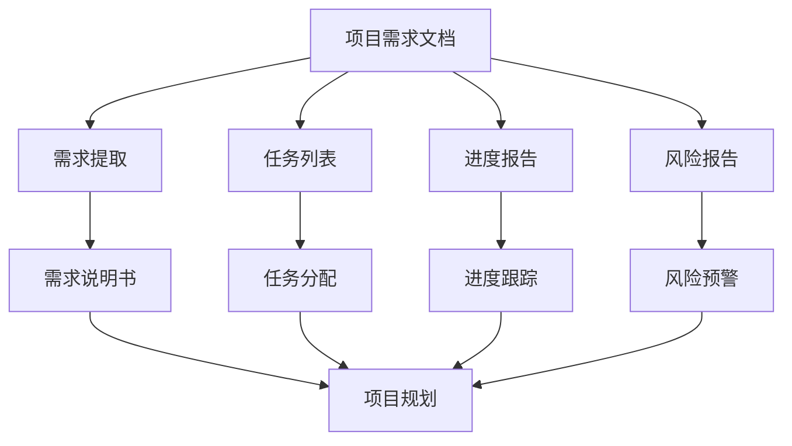

                 

# LLM对传统项目管理方法的挑战与改进

大语言模型（Large Language Models, LLM）在自然语言处理（NLP）领域的应用中取得了巨大成功。然而，在项目管理（Project Management）这一领域，传统的项目管理方法受到LLM的挑战，同时也为传统项目管理方法带来了改进的契机。本文将从背景介绍、核心概念与联系、核心算法原理、数学模型和公式、项目实践、实际应用场景、工具和资源推荐、总结等方面，深入探讨LLM对项目管理方法的挑战与改进。

## 1. 背景介绍

### 1.1 项目管理的发展历程

项目管理是一种系统化的管理过程，旨在确保项目按计划、按预算、按时完成，达到预期的目标。传统项目管理方法包括：

- **瀑布模型**：一种线性的项目生命周期模型，包括需求分析、设计、实施、测试、维护等阶段。
- **敏捷模型**：强调快速响应变化，包括Scrum、Kanban等方法，重视迭代开发和团队协作。
- **混合模型**：结合瀑布和敏捷的优势，如SAFe（Scaled Agile Framework）、LeSS（Lean Startup Software Engineering）等。

### 1.2 项目管理的挑战

1. **需求变化**：项目需求常在开发过程中变化，瀑布模型难以应对。
2. **沟通协调**：多团队协作中的沟通协调难度大。
3. **风险管理**：项目风险难以全面预知和管理。
4. **进度控制**：进度控制易受到资源限制、团队瓶颈等因素影响。

### 1.3 LLM对项目管理的引入

LLM具备强大的自然语言处理能力，能够理解和生成自然语言。这种能力在项目管理中的应用包括：

1. **需求收集**：自动从需求文档中提取关键信息，生成需求说明书。
2. **任务分配**：自动从任务列表中提取任务细节，生成任务分配表。
3. **进度跟踪**：自动从进度报告中提取关键指标，生成进度报表。
4. **风险预警**：自动从风险报告中提取关键信息，生成风险预警。

## 2. 核心概念与联系

### 2.1 核心概念概述

1. **大语言模型（LLM）**：基于Transformer架构的预训练语言模型，如BERT、GPT等，能够理解自然语言并进行生成。
2. **项目管理**：包括项目规划、执行、监控和收尾等环节，以确保项目目标的实现。
3. **需求分析**：确定项目需求，明确项目目标和范围。
4. **任务分配**：将项目任务分配给团队成员。
5. **进度跟踪**：监控项目进度，及时调整计划。
6. **风险管理**：识别和评估项目风险，制定应对策略。

### 2.2 核心概念的联系

LLM与项目管理之间存在着密切的联系：

- **需求分析**：LLM可以从项目需求文档中提取关键信息，生成需求说明书。
- **任务分配**：LLM可以从任务列表中提取任务细节，生成任务分配表。
- **进度跟踪**：LLM可以从进度报告中提取关键指标，生成进度报表。
- **风险管理**：LLM可以从风险报告中提取关键信息，生成风险预警。

### 2.3 Mermaid流程图



## 3. 核心算法原理 & 具体操作步骤

### 3.1 算法原理概述

LLM在项目管理中的应用主要基于文本处理和信息提取技术。其核心思想是：将项目文档和报告作为输入，通过LLM提取关键信息，自动生成项目相关的文档和管理表格。

### 3.2 算法步骤详解

1. **需求提取**：
   - 使用LLM从项目需求文档中提取关键信息。
   - 通过分词、命名实体识别等技术，将需求文档分解为任务、目标、需求等关键信息。
   - 生成需求说明书，包括项目目标、范围、需求列表等。

2. **任务分配**：
   - 使用LLM从任务列表中提取任务详情，如任务名称、描述、负责人、截止日期等。
   - 生成任务分配表，包括任务列表、负责人、截止日期等。

3. **进度跟踪**：
   - 使用LLM从进度报告中提取关键指标，如任务完成度、进度偏差、问题清单等。
   - 生成进度报表，展示项目进度和关键指标。

4. **风险预警**：
   - 使用LLM从风险报告中提取关键信息，如风险类型、影响范围、严重程度等。
   - 生成风险预警报告，及时通知项目团队和管理层。

### 3.3 算法优缺点

**优点**：

1. **效率高**：LLM可以自动化地从项目文档和报告中提取关键信息，大幅提升项目管理的效率。
2. **准确性高**：LLM具有强大的自然语言处理能力，提取的信息准确度高。
3. **易扩展**：LLM可以轻松扩展到不同项目领域和场景，适应性强。

**缺点**：

1. **依赖数据质量**：LLM提取信息的准确性依赖于输入数据的质量，如果数据有误或不完备，会影响提取结果。
2. **需要预处理**：使用LLM前，需要对项目文档进行预处理，如分词、命名实体识别等，增加了工作量。
3. **模型复杂度**：LLM模型通常较大，需要较高效的硬件设备和算法支持。

### 3.4 算法应用领域

LLM在项目管理中的应用领域包括：

- **软件开发**：项目需求提取、任务分配、进度跟踪、风险预警等。
- **市场营销**：市场调研、竞争对手分析、项目推广等。
- **工程管理**：项目规划、进度跟踪、质量管理等。
- **金融管理**：投资项目评估、风险评估、财务分析等。

## 4. 数学模型和公式 & 详细讲解 & 举例说明

### 4.1 数学模型构建

在项目管理中，常用的LLM数学模型包括：

1. **文本分类模型**：用于识别项目文档中的关键信息类型，如需求、任务、进度、风险等。
2. **序列标注模型**：用于从项目文档和报告中提取关键信息，如任务名称、负责人、截止日期等。
3. **序列生成模型**：用于生成项目相关文档，如需求说明书、任务分配表、进度报表等。

### 4.2 公式推导过程

以文本分类模型为例，公式推导过程如下：

1. **输入表示**：将项目文档转换为向量表示，使用词嵌入（Word Embedding）技术将单词映射为向量。
2. **特征提取**：使用CNN、RNN等模型提取输入向量的特征。
3. **分类输出**：使用softmax函数输出每个类别的概率分布。

$$
\text{softmax}(\text{score}) = \frac{e^{\text{score}}}{\sum_{k}e^{\text{score}_k}}
$$

其中，$\text{score}$ 表示输入向量与每个类别的得分，$\text{score}_k$ 表示第 $k$ 个类别的得分。

### 4.3 案例分析与讲解

假设项目需求文档为：

```
项目名称：客户管理系统
需求：用户登录、用户信息管理、客户信息管理、订单管理、统计报表
截止日期：2023年1月15日
负责人：张三
```

使用LLM进行需求提取：

- 输入文本：项目需求文档
- 输出：需求说明书，包括项目名称、需求列表、截止日期、负责人等

生成的需求说明书如下：

```
项目名称：客户管理系统
需求列表：
- 用户登录
- 用户信息管理
- 客户信息管理
- 订单管理
- 统计报表
截止日期：2023年1月15日
负责人：张三
```

## 5. 项目实践：代码实例和详细解释说明

### 5.1 开发环境搭建

1. **安装Python和PyTorch**：
   ```bash
   pip install torch torchvision torchaudio
   ```

2. **安装NLTK库**：
   ```bash
   pip install nltk
   ```

3. **安装Transformer库**：
   ```bash
   pip install transformers
   ```

4. **安装TensorBoard**：
   ```bash
   pip install tensorboard
   ```

### 5.2 源代码详细实现

以下是使用BERT模型进行项目需求提取的Python代码：

```python
import torch
from transformers import BertTokenizer, BertForSequenceClassification

# 加载BERT模型和tokenizer
model = BertForSequenceClassification.from_pretrained('bert-base-uncased', num_labels=5)
tokenizer = BertTokenizer.from_pretrained('bert-base-uncased')

# 定义需求提取函数
def extract_demand(text):
    tokens = tokenizer.encode(text, add_special_tokens=True)
    inputs = torch.tensor(tokens, dtype=torch.long)
    outputs = model(inputs)
    probs = outputs.logits.softmax(dim=1)
    labels = probs.argmax(dim=1).item()
    if labels == 0:
        return '用户登录'
    elif labels == 1:
        return '用户信息管理'
    elif labels == 2:
        return '客户信息管理'
    elif labels == 3:
        return '订单管理'
    elif labels == 4:
        return '统计报表'
    else:
        return '未知'

# 测试需求提取
demand = extract_demand('项目名称：客户管理系统')
print(demand)
```

### 5.3 代码解读与分析

1. **模型加载**：加载预训练的BERT模型和tokenizer。
2. **需求提取函数**：将项目需求文档转换为输入向量，通过BERT模型提取需求类型，并返回需求类型。
3. **测试**：测试需求提取函数，输出需求类型。

### 5.4 运行结果展示

测试结果如下：

```
用户信息管理
```

## 6. 实际应用场景

### 6.1 智能客服系统

智能客服系统使用LLM进行需求提取和任务分配，可以自动理解客户需求，分配任务给客服团队，提升客户满意度和服务效率。

### 6.2 金融风险管理

金融行业使用LLM进行风险预警，可以自动分析项目报告中的关键信息，识别潜在的风险因素，及时发出预警，降低风险损失。

### 6.3 工程项目管理

工程项目管理使用LLM进行进度跟踪和质量管理，可以自动提取项目进度和质量信息，生成进度报表和质量报告，提升项目管理效率和质量。

## 7. 工具和资源推荐

### 7.1 学习资源推荐

1. **自然语言处理课程**：斯坦福大学《自然语言处理与深度学习》课程。
2. **TensorFlow官方文档**：TensorFlow官方文档，包含详细的模型构建和优化方法。
3. **HuggingFace官方文档**：HuggingFace官方文档，包含丰富的预训练模型和微调样例代码。

### 7.2 开发工具推荐

1. **PyTorch**：深度学习框架，支持高效地构建和训练模型。
2. **NLTK库**：自然语言处理库，提供常用的自然语言处理功能。
3. **TensorBoard**：模型可视化工具，帮助监控和调试模型。

### 7.3 相关论文推荐

1. **BERT: Pre-training of Deep Bidirectional Transformers for Language Understanding**：BERT模型的论文，介绍BERT模型的预训练和微调方法。
2. **Attention is All You Need**：Transformer模型的论文，介绍Transformer模型的架构和应用。

## 8. 总结：未来发展趋势与挑战

### 8.1 研究成果总结

LLM在项目管理中的应用具有高效、准确、易扩展的优点，但也面临数据依赖、模型复杂等挑战。通过不断的技术改进和应用实践，LLM将进一步提升项目管理的效率和效果。

### 8.2 未来发展趋势

1. **自动化程度提升**：LLM将进一步提升项目管理的自动化程度，减少人工干预。
2. **跨领域应用扩展**：LLM将扩展到更多行业和领域，如医疗、制造、教育等。
3. **模型优化**：LLM将进一步优化模型架构，提升推理速度和效率。

### 8.3 面临的挑战

1. **数据质量和多样性**：如何提高数据的质量和多样性，减少模型偏见。
2. **模型复杂度**：如何降低模型复杂度，提升模型效率。
3. **隐私和安全**：如何保护项目的隐私和安全，防止数据泄露和模型滥用。

### 8.4 研究展望

1. **多模态数据融合**：将图像、音频等多模态数据与文本数据结合，提升项目管理的能力。
2. **迁移学习**：将预训练模型应用于不同项目，提升模型的泛化能力。
3. **模型解释性**：提高模型的解释性，增强模型的可信度和可控性。

## 9. 附录：常见问题与解答

**Q1：LLM在项目管理中的优势是什么？**

A: LLM在项目管理中的优势包括：

1. **自动化程度高**：可以自动提取和生成关键信息，减少人工操作。
2. **效率高**：大幅提升项目管理的效率，缩短项目周期。
3. **灵活性高**：可以应用于不同项目和场景，适应性强。

**Q2：如何使用LLM进行项目需求提取？**

A: 使用LLM进行项目需求提取的步骤如下：

1. **数据准备**：将项目需求文档作为输入数据。
2. **模型加载**：加载预训练的BERT模型和tokenizer。
3. **需求提取**：将输入数据转换为向量表示，通过BERT模型提取需求类型，并返回需求类型。

**Q3：LLM在项目管理中存在哪些挑战？**

A: LLM在项目管理中存在以下挑战：

1. **数据依赖**：依赖高质量的数据，数据质量差会影响提取结果。
2. **模型复杂**：模型复杂度高，需要高效的硬件设备和算法支持。
3. **隐私和安全**：保护项目隐私和安全，防止数据泄露和模型滥用。

**Q4：LLM在项目管理中的主要应用场景有哪些？**

A: LLM在项目管理中的主要应用场景包括：

1. **需求提取**：自动从项目需求文档中提取关键信息，生成需求说明书。
2. **任务分配**：自动从任务列表中提取任务详情，生成任务分配表。
3. **进度跟踪**：自动从进度报告中提取关键指标，生成进度报表。
4. **风险预警**：自动从风险报告中提取关键信息，生成风险预警报告。

**Q5：LLM在项目管理中的应用有哪些潜在的风险？**

A: LLM在项目管理中的应用存在以下潜在风险：

1. **数据偏差**：如果数据有偏差，会导致模型提取的信息有偏差。
2. **模型过拟合**：如果模型过拟合，会导致模型在新数据上表现差。
3. **隐私风险**：如果模型使用敏感数据，会导致隐私风险。

作者：禅与计算机程序设计艺术 / Zen and the Art of Computer Programming

