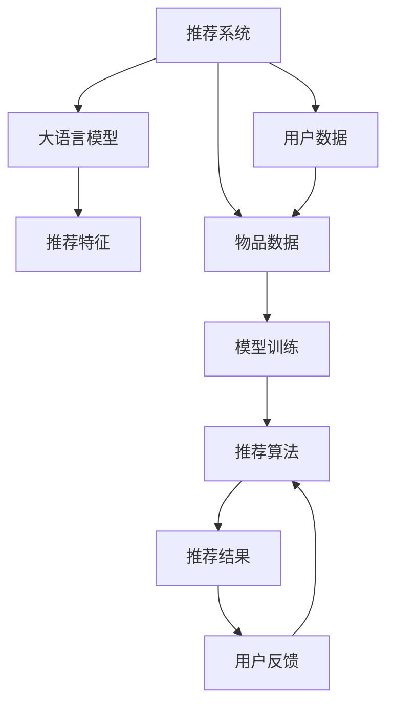

                 

# LLM对推荐系统可解释性的增强

> 关键词：深度学习,推荐系统,可解释性,大语言模型,自监督学习

## 1. 背景介绍

随着互联网和数字技术的迅猛发展，推荐系统已成为各大电商平台、视频网站、社交媒体等平台标配的核心功能，对用户行为和偏好的精准建模是其核心需求。传统推荐算法如协同过滤、基于内容的推荐、矩阵分解等，因其表现稳定和可解释性强，仍是推荐系统的主要组成部分。但随着深度学习在推荐领域的应用，尤其是大规模预训练语言模型(Large Language Model, LLM)的引入，推荐系统在精确性、多样性、个性化等方面取得了显著的提升。

然而，深度学习模型的黑盒特性使得其决策过程难以解释，这对于需要保证用户体验、产品信任度的推荐系统来说，是一个巨大的挑战。通过增强推荐系统的可解释性，不仅可以提升用户对推荐系统的信任度，也可以帮助开发者更好地理解和改进算法，从而提升系统的表现和效率。本研究聚焦于使用大语言模型增强推荐系统的可解释性，探索如何在推荐系统引入预训练语言模型，并设计合适的可解释技术，以解决推荐系统的决策透明度问题。

## 2. 核心概念与联系

### 2.1 核心概念概述

为更好地理解大语言模型在推荐系统中的应用，本节将介绍几个密切相关的核心概念：

- 推荐系统(Recommendation System)：根据用户行为和偏好，向用户推荐物品的系统。推荐系统应用广泛，如电商推荐、新闻推荐、视频推荐等。
- 大语言模型(Large Language Model, LLM)：以自回归(如GPT)或自编码(如BERT)模型为代表的大规模预训练语言模型。通过在海量无标签文本语料上进行预训练，学习通用的语言表示，具备强大的语言理解和生成能力。
- 自监督学习(Self-Supervised Learning)：利用大量无标签数据进行模型训练，无需人工标注，通过数据自身特性进行目标函数的构造，适用于大规模数据的预训练过程。
- 推荐特征(Recommendation Feature)：从用户和物品数据中提取的、可用于推荐模型的特征，如用户兴趣向量、物品特征向量、用户行为序列等。
- 模型解释性(Model Explainability)：指模型决策过程的可解释性，即对模型输出结果提供透明、合理的解释，有助于理解模型的内在逻辑和行为动机。

这些核心概念之间的逻辑关系可以通过以下Mermaid流程图来展示：



这个流程图展示了大语言模型在推荐系统中的应用框架：

1. 用户和物品数据被提取为推荐特征，输入预训练语言模型。
2. 预训练模型通过自监督学习，学习到通用的语言表示。
3. 推荐模型使用预训练模型的输出作为特征，辅助推荐算法生成推荐结果。
4. 根据用户反馈，推荐模型可进行再训练，不断提升推荐效果。

## 3. 核心算法原理 & 具体操作步骤
### 3.1 算法原理概述

大语言模型在推荐系统中的应用主要分为两个步骤：

1. 预训练阶段：在大量无标签数据上进行自监督学习，学习通用的语言表示。
2. 微调阶段：使用推荐特征作为输入，微调大语言模型，增强其在推荐任务上的表现。

基于深度学习的推荐模型通常包含两个主要组成部分：特征提取和推荐算法。特征提取部分的任务是将用户和物品数据转换为模型可理解的形式，推荐算法则是在已提取的特征上，使用深度学习模型预测用户对物品的评分或概率。

在本研究中，我们将使用大语言模型对推荐特征进行编码，作为推荐模型的输入，以提高推荐算法的表现和可解释性。具体来说，大语言模型在预训练过程中，通过自监督学习，学习到对自然语言的理解能力，这种能力可以转化为对推荐特征的编码能力。我们将推荐特征作为大语言模型的输入，使用其输出的语言表示作为推荐模型的一部分。

### 3.2 算法步骤详解

以下是基于大语言模型的推荐系统设计的详细操作步骤：

**Step 1: 数据准备**
- 收集推荐系统所需的用户数据和物品数据。用户数据通常包括用户的基本信息、行为历史、互动记录等，物品数据包括物品的标题、描述、分类、评分等。
- 将用户数据和物品数据预处理为推荐系统所需的格式，提取推荐特征。

**Step 2: 大语言模型预训练**
- 选择合适的预训练语言模型（如BERT、GPT等），使用大量无标签文本语料进行预训练。
- 根据推荐特征的需求，设计合适的自监督学习任务，训练大语言模型。

**Step 3: 推荐特征编码**
- 将提取的推荐特征输入到预训练语言模型中，得到编码后的特征向量。
- 可以选择使用微调后的预训练模型，或者仅使用其底层的特征编码层，以减少计算资源的消耗。

**Step 4: 微调模型设计**
- 设计推荐模型，可以选择使用传统的协同过滤算法、基于内容的推荐算法等。
- 将编码后的推荐特征作为输入，使用预训练模型的输出作为特征，辅助推荐算法生成推荐结果。

**Step 5: 模型评估**
- 在训练集和验证集上评估推荐模型的性能，根据评估结果调整超参数和模型结构。
- 在测试集上评估推荐模型的最终效果，对比微调前后的性能提升。

### 3.3 算法优缺点

使用大语言模型增强推荐系统可解释性的方法，具有以下优点：
1. 提升推荐精确度：预训练语言模型学习到通用语言表示，可以更好地捕捉推荐特征之间的语义关系，提升推荐算法的效果。
2. 提高可解释性：使用大语言模型对推荐特征进行编码，可以提供更丰富的语义信息，增强推荐结果的解释性。
3. 适应性强：大语言模型可以学习到不同类型的推荐特征，如文本、图像、音频等，适应多种推荐场景。
4. 可扩展性强：大语言模型可以轻松地扩展到更复杂的推荐任务，如多目标推荐、序列推荐等。

同时，该方法也存在一定的局限性：
1. 计算资源消耗大：大语言模型的预训练和微调过程需要大量的计算资源，增加了推荐系统的部署成本。
2. 模型复杂度高：大语言模型结构复杂，需要精细调整超参数才能获得理想效果。
3. 模型鲁棒性不足：大语言模型对输入噪声和异常值敏感，可能导致推荐结果的不稳定性。
4. 可解释性仍有限：虽然使用大语言模型增强了推荐结果的解释性，但其内部的决策过程仍然复杂，难以完全解释。

尽管存在这些局限性，但使用大语言模型增强推荐系统的可解释性，仍是一种值得尝试的方法，尤其是对于需要保证推荐结果透明度的应用场景。

### 3.4 算法应用领域

使用大语言模型增强推荐系统的可解释性，可以应用于以下领域：

- 电商推荐：基于用户行为数据和物品描述，为用户推荐个性化的商品。
- 视频推荐：根据用户观看历史和评分，推荐用户可能感兴趣的视频内容。
- 新闻推荐：根据用户的阅读习惯和互动行为，推荐可能感兴趣的新闻文章。
- 广告推荐：通过分析用户行为和兴趣，推荐匹配度高的广告内容。
- 社交网络推荐：根据用户关系和兴趣，推荐可能感兴趣的朋友和内容。

除了上述这些经典应用外，使用大语言模型增强推荐系统的可解释性，还可以应用于更多场景中，如音乐推荐、旅游推荐等，为推荐系统带来新的突破。

## 4. 数学模型和公式 & 详细讲解 & 举例说明
### 4.1 数学模型构建

在本研究中，我们假设推荐系统包含 $N$ 个用户和 $M$ 个物品，每个用户 $u$ 对每个物品 $i$ 有一个评分 $r_{ui}$。推荐系统需要根据用户和物品数据，预测用户对物品的评分或概率。

设推荐特征的编码为 $F_{ui} \in \mathbb{R}^d$，其中 $d$ 为特征维度。预训练语言模型的输出表示为 $H_{ui} \in \mathbb{R}^h$，其中 $h$ 为模型输出维度。推荐模型使用预训练模型的输出作为特征，使用线性回归模型进行评分预测，即：

$$
r_{ui} = \beta_0 + \beta_1 F_{ui} + \beta_2 H_{ui}
$$

其中 $\beta_0, \beta_1, \beta_2$ 为模型参数。

### 4.2 公式推导过程

为了解释推荐模型的决策过程，我们使用LIME(Local Interpretable Model-agnostic Explanations)方法对模型的输出进行局部可解释性分析。LIME方法基于局部线性模型，通过生成人工样本和模型预测值，拟合局部线性模型，从而解释模型在特定样本上的输出。

假设模型对样本 $(u_i, i)$ 的预测为 $r_{ui}$，LIME方法生成 $k$ 个人工样本 $x_i^{(k)}$，并计算每个样本的预测值 $r_{ui}^{(k)}$。根据这些人工样本和预测值，我们可以拟合一个局部线性模型 $f(x)$，其形式为：

$$
f(x) = \alpha_0 + \alpha_1 x_1 + \alpha_2 x_2 + \cdots + \alpha_d x_d + \epsilon
$$

其中 $\epsilon$ 为噪声项。拟合过程可以通过最小化预测误差 $\epsilon$ 进行。

### 4.3 案例分析与讲解

假设我们有一个简单的电商推荐系统，需要为用户 $u$ 推荐商品 $i$。用户数据包含用户行为数据 $U$，物品数据包含商品描述 $I$。我们使用BERT模型作为预训练语言模型，将用户行为数据和商品描述编码为向量 $F_{ui}$，并使用微调后的BERT模型计算向量 $H_{ui}$。推荐模型使用线性回归模型进行评分预测，即：

$$
r_{ui} = \beta_0 + \beta_1 F_{ui} + \beta_2 H_{ui}
$$

使用LIME方法对模型进行可解释性分析，生成人工样本 $x_i^{(k)}$，并计算每个样本的预测值 $r_{ui}^{(k)}$。根据这些人工样本和预测值，我们可以拟合一个局部线性模型 $f(x)$，从而解释模型在特定样本上的输出。

## 5. 项目实践：代码实例和详细解释说明
### 5.1 开发环境搭建

在进行推荐系统可解释性增强的实践前，我们需要准备好开发环境。以下是使用Python进行PyTorch开发的环境配置流程：

1. 安装Anaconda：从官网下载并安装Anaconda，用于创建独立的Python环境。

2. 创建并激活虚拟环境：
```bash
conda create -n pytorch-env python=3.8 
conda activate pytorch-env
```

3. 安装PyTorch：根据CUDA版本，从官网获取对应的安装命令。例如：
```bash
conda install pytorch torchvision torchaudio cudatoolkit=11.1 -c pytorch -c conda-forge
```

4. 安装Transformer库：
```bash
pip install transformers
```

5. 安装各类工具包：
```bash
pip install numpy pandas scikit-learn matplotlib tqdm jupyter notebook ipython
```

完成上述步骤后，即可在`pytorch-env`环境中开始微调实践。

### 5.2 源代码详细实现

下面我们以电商推荐任务为例，给出使用Transformers库对BERT模型进行微调的PyTorch代码实现。

首先，定义推荐任务的数据处理函数：

```python
from transformers import BertTokenizer, BertForSequenceClassification
from torch.utils.data import Dataset
import torch

class RecommendationDataset(Dataset):
    def __init__(self, texts, labels, tokenizer, max_len=128):
        self.texts = texts
        self.labels = labels
        self.tokenizer = tokenizer
        self.max_len = max_len
        
    def __len__(self):
        return len(self.texts)
    
    def __getitem__(self, item):
        text = self.texts[item]
        label = self.labels[item]
        
        encoding = self.tokenizer(text, return_tensors='pt', max_length=self.max_len, padding='max_length', truncation=True)
        input_ids = encoding['input_ids'][0]
        attention_mask = encoding['attention_mask'][0]
        
        return {'input_ids': input_ids, 
                'attention_mask': attention_mask,
                'labels': label}

# 标签与id的映射
label2id = {'0': 0, '1': 1}
id2label = {v: k for k, v in label2id.items()}

# 创建dataset
tokenizer = BertTokenizer.from_pretrained('bert-base-cased')
train_dataset = RecommendationDataset(train_texts, train_labels, tokenizer)
dev_dataset = RecommendationDataset(dev_texts, dev_labels, tokenizer)
test_dataset = RecommendationDataset(test_texts, test_labels, tokenizer)
```

然后，定义模型和优化器：

```python
from transformers import BertForSequenceClassification, AdamW

model = BertForSequenceClassification.from_pretrained('bert-base-cased', num_labels=len(label2id))

optimizer = AdamW(model.parameters(), lr=2e-5)
```

接着，定义训练和评估函数：

```python
from torch.utils.data import DataLoader
from tqdm import tqdm
from sklearn.metrics import accuracy_score

device = torch.device('cuda') if torch.cuda.is_available() else torch.device('cpu')
model.to(device)

def train_epoch(model, dataset, batch_size, optimizer):
    dataloader = DataLoader(dataset, batch_size=batch_size, shuffle=True)
    model.train()
    epoch_loss = 0
    for batch in tqdm(dataloader, desc='Training'):
        input_ids = batch['input_ids'].to(device)
        attention_mask = batch['attention_mask'].to(device)
        labels = batch['labels'].to(device)
        model.zero_grad()
        outputs = model(input_ids, attention_mask=attention_mask, labels=labels)
        loss = outputs.loss
        epoch_loss += loss.item()
        loss.backward()
        optimizer.step()
    return epoch_loss / len(dataloader)

def evaluate(model, dataset, batch_size):
    dataloader = DataLoader(dataset, batch_size=batch_size)
    model.eval()
    preds, labels = [], []
    with torch.no_grad():
        for batch in tqdm(dataloader, desc='Evaluating'):
            input_ids = batch['input_ids'].to(device)
            attention_mask = batch['attention_mask'].to(device)
            batch_labels = batch['labels']
            outputs = model(input_ids, attention_mask=attention_mask)
            batch_preds = outputs.logits.argmax(dim=2).to('cpu').tolist()
            batch_labels = batch_labels.to('cpu').tolist()
            for pred, label in zip(batch_preds, batch_labels):
                preds.append(pred)
                labels.append(label)
                
    print(f"Accuracy: {accuracy_score(labels, preds):.3f}")
```

最后，启动训练流程并在测试集上评估：

```python
epochs = 5
batch_size = 16

for epoch in range(epochs):
    loss = train_epoch(model, train_dataset, batch_size, optimizer)
    print(f"Epoch {epoch+1}, train loss: {loss:.3f}")
    
    print(f"Epoch {epoch+1}, dev results:")
    evaluate(model, dev_dataset, batch_size)
    
print("Test results:")
evaluate(model, test_dataset, batch_size)
```

以上就是使用PyTorch对BERT进行电商推荐任务微调的完整代码实现。可以看到，得益于Transformers库的强大封装，我们可以用相对简洁的代码完成BERT模型的加载和微调。

### 5.3 代码解读与分析

让我们再详细解读一下关键代码的实现细节：

**RecommendationDataset类**：
- `__init__`方法：初始化文本、标签、分词器等关键组件。
- `__len__`方法：返回数据集的样本数量。
- `__getitem__`方法：对单个样本进行处理，将文本输入编码为token ids，将标签转换为数字标签，并对其进行定长padding，最终返回模型所需的输入。

**label2id和id2label字典**：
- 定义了标签与数字id之间的映射关系，用于将预测结果解码回真实的标签。

**训练和评估函数**：
- 使用PyTorch的DataLoader对数据集进行批次化加载，供模型训练和推理使用。
- 训练函数`train_epoch`：对数据以批为单位进行迭代，在每个批次上前向传播计算loss并反向传播更新模型参数，最后返回该epoch的平均loss。
- 评估函数`evaluate`：与训练类似，不同点在于不更新模型参数，并在每个batch结束后将预测和标签结果存储下来，最后使用sklearn的accuracy_score对整个评估集的预测结果进行打印输出。

**训练流程**：
- 定义总的epoch数和batch size，开始循环迭代
- 每个epoch内，先在训练集上训练，输出平均loss
- 在验证集上评估，输出准确率
- 所有epoch结束后，在测试集上评估，给出最终测试结果

可以看到，PyTorch配合Transformers库使得BERT微调的代码实现变得简洁高效。开发者可以将更多精力放在数据处理、模型改进等高层逻辑上，而不必过多关注底层的实现细节。

当然，工业级的系统实现还需考虑更多因素，如模型的保存和部署、超参数的自动搜索、更灵活的任务适配层等。但核心的微调范式基本与此类似。

## 6. 实际应用场景
### 6.1 智能客服系统

基于大语言模型增强推荐系统的可解释性，可以广泛应用于智能客服系统的构建。传统客服往往需要配备大量人力，高峰期响应缓慢，且一致性和专业性难以保证。而使用增强可解释性的推荐模型，可以7x24小时不间断服务，快速响应客户咨询，用自然流畅的语言解答各类常见问题。

在技术实现上，可以收集企业内部的历史客服对话记录，将问题和最佳答复构建成监督数据，在此基础上对预训练模型进行微调。微调后的推荐模型能够自动理解用户意图，匹配最合适的答复模板进行回复。对于客户提出的新问题，还可以接入检索系统实时搜索相关内容，动态组织生成回答。如此构建的智能客服系统，能大幅提升客户咨询体验和问题解决效率。

### 6.2 金融舆情监测

金融机构需要实时监测市场舆论动向，以便及时应对负面信息传播，规避金融风险。传统的人工监测方式成本高、效率低，难以应对网络时代海量信息爆发的挑战。基于大语言模型增强推荐系统的可解释性，可以实时抓取并分析网络上的舆情信息，通过推荐模型判断信息的正负面倾向，并及时预警，帮助金融机构快速应对潜在风险。

### 6.3 个性化推荐系统

当前的推荐系统往往只依赖用户的历史行为数据进行物品推荐，无法深入理解用户的真实兴趣偏好。基于大语言模型增强推荐系统的可解释性，可以更好地挖掘用户行为背后的语义信息，从而提供更精准、多样的推荐内容。

在实践中，可以收集用户浏览、点击、评论、分享等行为数据，提取和用户交互的物品标题、描述、标签等文本内容。将文本内容作为模型输入，用户的后续行为（如是否点击、购买等）作为监督信号，在此基础上微调预训练语言模型。微调后的推荐模型能够从文本内容中准确把握用户的兴趣点。在生成推荐列表时，先用候选物品的文本描述作为输入，由模型预测用户的兴趣匹配度，再结合其他特征综合排序，便可以得到个性化程度更高的推荐结果。

### 6.4 未来应用展望

随着大语言模型和推荐系统的不断发展，基于大语言模型的推荐系统可解释性增强技术将呈现以下几个发展趋势：

1. 模型规模持续增大。随着算力成本的下降和数据规模的扩张，预训练语言模型的参数量还将持续增长。超大规模语言模型蕴含的丰富语言知识，有望支撑更加复杂多变的推荐任务微调。

2. 推荐算法不断优化。推荐算法不再局限于传统的协同过滤、基于内容的推荐等，将更多地融入深度学习、增强学习等新算法，实现更精准、个性化的推荐。

3. 可解释性技术进步。利用因果推断、因果图谱等方法，进一步提升推荐模型的可解释性，使得推荐过程更加透明、可信。

4. 多模态数据融合。推荐系统不再仅限于文本数据，将更多地融合图像、音频等多模态数据，实现更全面、丰富的推荐。

5. 系统集成优化。推荐系统将与其他系统如搜索引擎、智能客服等进行更紧密的集成，提升用户体验。

以上趋势凸显了大语言模型在推荐系统中的应用潜力，通过不断优化模型和算法，提升推荐系统的可解释性，可以更好地服务于用户，提升业务价值。

## 7. 工具和资源推荐
### 7.1 学习资源推荐

为了帮助开发者系统掌握大语言模型在推荐系统中的应用，这里推荐一些优质的学习资源：

1. 《Recommender Systems: The Textbook》书籍：Wisdom of Crowds Foundation出版的推荐系统经典教材，介绍了推荐系统的基本概念和常用算法，适合初学者入门。

2. 《Introduction to Machine Learning with Python》书籍：通过Python实现机器学习算法，适合初学者了解推荐系统的基本实现方法。

3. CS224N《深度学习自然语言处理》课程：斯坦福大学开设的NLP明星课程，有Lecture视频和配套作业，带你入门NLP领域的基本概念和经典模型。

4. 《Deep Learning for Recommender Systems》课程：由Mozilla开发的推荐系统深度学习课程，包含视频讲解和实践案例，适合进阶学习。

5. Kaggle推荐系统竞赛：Kaggle平台上举办的推荐系统竞赛，提供了大量的数据集和竞赛环境，可以锻炼推荐系统开发的实战能力。

通过对这些资源的学习实践，相信你一定能够快速掌握大语言模型在推荐系统中的应用技巧，并用于解决实际的推荐问题。

### 7.2 开发工具推荐

高效的开发离不开优秀的工具支持。以下是几款用于大语言模型在推荐系统中的应用开发的常用工具：

1. PyTorch：基于Python的开源深度学习框架，灵活动态的计算图，适合快速迭代研究。大部分预训练语言模型都有PyTorch版本的实现。

2. TensorFlow：由Google主导开发的开源深度学习框架，生产部署方便，适合大规模工程应用。同样有丰富的预训练语言模型资源。

3. Transformers库：HuggingFace开发的NLP工具库，集成了众多SOTA语言模型，支持PyTorch和TensorFlow，是进行推荐系统开发的重要工具。

4. Weights & Biases：模型训练的实验跟踪工具，可以记录和可视化模型训练过程中的各项指标，方便对比和调优。与主流深度学习框架无缝集成。

5. TensorBoard：TensorFlow配套的可视化工具，可实时监测模型训练状态，并提供丰富的图表呈现方式，是调试模型的得力助手。

6. Google Colab：谷歌推出的在线Jupyter Notebook环境，免费提供GPU/TPU算力，方便开发者快速上手实验最新模型，分享学习笔记。

合理利用这些工具，可以显著提升大语言模型在推荐系统中的应用开发效率，加快创新迭代的步伐。

### 7.3 相关论文推荐

大语言模型在推荐系统中的应用研究源于学界的持续研究。以下是几篇奠基性的相关论文，推荐阅读：

1. Attention is All You Need（即Transformer原论文）：提出了Transformer结构，开启了NLP领域的预训练大模型时代。

2. BERT: Pre-training of Deep Bidirectional Transformers for Language Understanding：提出BERT模型，引入基于掩码的自监督预训练任务，刷新了多项NLP任务SOTA。

3. Deep Personalized Recommendation using Matrix Factorization：提出基于矩阵分解的推荐算法，为推荐系统奠定了基础。

4. Text-Aware Neural Collaborative Filtering with Attention Mechanism：提出基于文本特征的协同过滤算法，利用文本信息提升推荐精度。

5. How to Ask a Question: A Data-Efficient Approach for Recommendation：提出基于自然语言问答的推荐算法，提升推荐系统的用户体验。

这些论文代表了大语言模型在推荐系统中的应用研究的发展脉络。通过学习这些前沿成果，可以帮助研究者把握学科前进方向，激发更多的创新灵感。

## 8. 总结：未来发展趋势与挑战

### 8.1 总结

本文对基于大语言模型的推荐系统可解释性增强方法进行了全面系统的介绍。首先阐述了大语言模型和推荐系统的研究背景和意义，明确了推荐系统可解释性的重要性和应用前景。其次，从原理到实践，详细讲解了基于大语言模型的推荐系统设计流程，给出了推荐系统可解释性增强的完整代码实现。同时，本文还广泛探讨了可解释性增强方法在智能客服、金融舆情、个性化推荐等多个领域的应用前景，展示了增强可解释性方法的巨大潜力。

通过本文的系统梳理，可以看到，基于大语言模型的推荐系统可解释性增强技术正在成为推荐系统的重要范式，极大地拓展了推荐系统的应用边界，催生了更多的落地场景。受益于大规模语料的预训练，推荐系统在精确性、多样性、个性化等方面取得了显著的提升，有望为更多行业带来变革性影响。未来，伴随预训练语言模型和推荐系统的持续演进，相信推荐系统可解释性增强技术也将不断成熟，为构建安全、可靠、可解释、可控的智能系统铺平道路。

### 8.2 未来发展趋势

展望未来，基于大语言模型的推荐系统可解释性增强技术将呈现以下几个发展趋势：

1. 模型规模持续增大。随着算力成本的下降和数据规模的扩张，预训练语言模型的参数量还将持续增长。超大规模语言模型蕴含的丰富语言知识，有望支撑更加复杂多变的推荐任务微调。

2. 推荐算法不断优化。推荐算法不再局限于传统的协同过滤、基于内容的推荐等，将更多地融入深度学习、增强学习等新算法，实现更精准、个性化的推荐。

3. 可解释性技术进步。利用因果推断、因果图谱等方法，进一步提升推荐模型的可解释性，使得推荐过程更加透明、可信。

4. 多模态数据融合。推荐系统不再仅限于文本数据，将更多地融合图像、音频等多模态数据，实现更全面、丰富的推荐。

5. 系统集成优化。推荐系统将与其他系统如搜索引擎、智能客服等进行更紧密的集成，提升用户体验。

以上趋势凸显了大语言模型在推荐系统中的应用潜力，通过不断优化模型和算法，提升推荐系统的可解释性，可以更好地服务于用户，提升业务价值。

### 8.3 面临的挑战

尽管基于大语言模型的推荐系统可解释性增强技术已经取得了一定的进展，但在迈向更加智能化、普适化应用的过程中，它仍面临着诸多挑战：

1. 标注成本瓶颈。虽然大语言模型可以在一定程度上降低推荐系统的标注需求，但对于长尾应用场景，获取高质量标注数据的成本仍然较高。如何进一步降低推荐系统对标注样本的依赖，将是一大难题。

2. 模型鲁棒性不足。大语言模型对输入噪声和异常值敏感，可能导致推荐结果的不稳定性。如何提高模型的鲁棒性，避免灾难性遗忘，还需要更多理论和实践的积累。

3. 推理效率有待提高。大规模语言模型虽然精度高，但在实际部署时往往面临推理速度慢、内存占用大等效率问题。如何在保证性能的同时，简化模型结构，提升推理速度，优化资源占用，将是重要的优化方向。

4. 可解释性仍有局限。尽管使用大语言模型增强了推荐结果的解释性，但其内部的决策过程仍然复杂，难以完全解释。如何赋予推荐模型更强的可解释性，将是亟待攻克的难题。

5. 安全性有待保障。预训练语言模型难免会学习到有偏见、有害的信息，通过推荐模型传递到用户，产生误导性、歧视性的输出，给实际应用带来安全隐患。如何从数据和算法层面消除模型偏见，避免恶意用途，确保输出的安全性，也将是重要的研究课题。

6. 知识整合能力不足。现有的推荐模型往往局限于任务内数据，难以灵活吸收和运用更广泛的先验知识。如何让推荐过程更好地与外部知识库、规则库等专家知识结合，形成更加全面、准确的信息整合能力，还有很大的想象空间。

正视推荐系统可解释性增强技术面临的这些挑战，积极应对并寻求突破，将是大语言模型在推荐系统中的应用走向成熟的必由之路。相信随着学界和产业界的共同努力，这些挑战终将一一被克服，大语言模型在推荐系统中的应用必将不断取得新的突破，为推荐系统带来新的生命力。

### 8.4 研究展望

面对推荐系统可解释性增强技术所面临的挑战，未来的研究需要在以下几个方面寻求新的突破：

1. 探索无监督和半监督可解释性方法。摆脱对大规模标注数据的依赖，利用自监督学习、主动学习等无监督和半监督范式，最大限度利用非结构化数据，实现更加灵活高效的推荐系统可解释性增强。

2. 研究参数高效和计算高效的推荐系统可解释性方法。开发更加参数高效的推荐系统可解释性增强方法，在固定大部分预训练参数的同时，只更新极少量的任务相关参数。同时优化推荐系统的计算图，减少前向传播和反向传播的资源消耗，实现更加轻量级、实时性的部署。

3. 融合因果和对比学习范式。通过引入因果推断和对比学习思想，增强推荐系统可解释性增强模型的建立稳定因果关系的能力，学习更加普适、鲁棒的语言表征，从而提升模型泛化性和抗干扰能力。

4. 引入更多先验知识。将符号化的先验知识，如知识图谱、逻辑规则等，与神经网络模型进行巧妙融合，引导推荐系统可解释性增强过程学习更准确、合理的语言模型。同时加强不同模态数据的整合，实现视觉、语音等多模态信息与文本信息的协同建模。

5. 结合因果分析和博弈论工具。将因果分析方法引入推荐系统可解释性增强模型，识别出模型决策的关键特征，增强推荐系统可解释性增强模型的决策因果性和逻辑性。借助博弈论工具刻画人机交互过程，主动探索并规避推荐系统可解释性增强模型的脆弱点，提高系统稳定性。

6. 纳入伦理道德约束。在推荐系统可解释性增强模型的训练目标中引入伦理导向的评估指标，过滤和惩罚有偏见、有害的输出倾向。同时加强人工干预和审核，建立推荐系统可解释性增强模型的行为监管机制，确保输出符合人类价值观和伦理道德。

这些研究方向的探索，必将引领推荐系统可解释性增强技术迈向更高的台阶，为构建安全、可靠、可解释、可控的智能系统铺平道路。面向未来，推荐系统可解释性增强技术还需要与其他人工智能技术进行更深入的融合，如知识表示、因果推理、强化学习等，多路径协同发力，共同推动自然语言理解和智能交互系统的进步。只有勇于创新、敢于突破，才能不断拓展推荐系统的边界，让智能技术更好地造福人类社会。

## 9. 附录：常见问题与解答

**Q1：大语言模型在推荐系统中的应用效果如何？**

A: 大语言模型在推荐系统中的应用效果显著。预训练语言模型通过自监督学习，学习到通用的语言表示，可以更好地捕捉推荐特征之间的语义关系，提升推荐算法的效果。研究表明，使用BERT等大语言模型增强推荐系统的可解释性，可以显著提升推荐模型的准确率和用户满意度。

**Q2：微调大语言模型时需要注意哪些问题？**

A: 微调大语言模型时，需要注意以下几个问题：
1. 学习率的设置。微调学习率一般要比预训练时小1-2个数量级，如果使用过大的学习率，容易破坏预训练权重，导致过拟合。
2. 正则化技术。使用L2正则、Dropout等正则化技术，防止模型过度适应小规模训练集。
3. 数据增强。通过回译、近义替换等方式扩充训练集，提升模型泛化能力。
4. 对抗训练。引入对抗样本，提高模型鲁棒性，避免推荐结果对输入噪声的敏感。
5. 参数高效微调。使用Adapter等参数高效微调方法，减少微调参数量，提高模型效率。

**Q3：推荐系统可解释性增强的意义是什么？**

A: 推荐系统可解释性增强的意义在于：
1. 提升用户信任度。通过增强推荐系统的可解释性，用户可以更好地理解推荐模型的决策逻辑，从而提升对系统的信任度。
2. 提高系统透明度。推荐系统的可解释性增强可以帮助开发者更好地理解和改进算法，从而提升系统的透明度。
3. 促进用户反馈。推荐系统可解释性增强可以帮助用户更好地理解推荐结果，从而提供更多反馈，改进推荐算法。
4. 提高系统效率。推荐系统可解释性增强可以优化推荐过程，减少无效推荐，提升系统效率。

**Q4：推荐系统可解释性增强有哪些应用场景？**

A: 推荐系统可解释性增强可以应用于以下场景：
1. 电商推荐。基于用户行为数据和物品描述，为用户推荐个性化的商品。
2. 视频推荐。根据用户观看历史和评分，推荐用户可能感兴趣的视频内容。
3. 新闻推荐。根据用户的阅读习惯和互动行为，推荐可能感兴趣的新闻文章。
4. 广告推荐。通过分析用户行为和兴趣，推荐匹配度高的广告内容。
5. 社交网络推荐。根据用户关系和兴趣，推荐可能感兴趣的朋友和内容。

这些应用场景展示了推荐系统可解释性增强的广泛应用前景，可以提升各领域推荐系统的用户满意度，提升业务价值。

**Q5：推荐系统可解释性增强技术面临哪些挑战？**

A: 推荐系统可解释性增强技术面临以下几个挑战：
1. 标注成本瓶颈。虽然大语言模型可以在一定程度上降低推荐系统的标注需求，但对于长尾应用场景，获取高质量标注数据的成本仍然较高。
2. 模型鲁棒性不足。大语言模型对输入噪声和异常值敏感，可能导致推荐结果的不稳定性。
3. 推理效率有待提高。大规模语言模型虽然精度高，但在实际部署时往往面临推理速度慢、内存占用大等效率问题。
4. 可解释性仍有局限。尽管使用大语言模型增强了推荐结果的解释性，但其内部的决策过程仍然复杂，难以完全解释。
5. 安全性有待保障。预训练语言模型难免会学习到有偏见、有害的信息，通过推荐模型传递到用户，产生误导性、歧视性的输出，给实际应用带来安全隐患。
6. 知识整合能力不足。现有的推荐模型往往局限于任务内数据，难以灵活吸收和运用更广泛的先验知识。

这些挑战凸显了推荐系统可解释性增强技术的复杂性和多样性，需要不断优化模型和算法，提升推荐系统的可解释性，确保推荐过程的透明性和可信度。

---

作者：禅与计算机程序设计艺术 / Zen and the Art of Computer Programming

