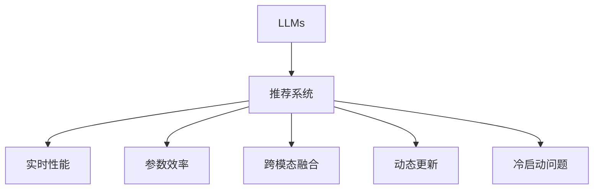

                 

# LLM对推荐系统实时性能的影响

大语言模型（Large Language Models, LLMs）作为人工智能领域的一项颠覆性技术，已经极大地影响了推荐系统（Recommender Systems）的实时性能和用户体验。本文将深入探讨LLM在推荐系统中的应用，分析其对实时性能的影响，并提供优化的策略和实践建议。

## 1. 背景介绍

### 1.1 问题由来

随着互联网技术的迅猛发展，推荐系统已经成为各大平台提高用户满意度和增强商业价值的关键技术。传统的推荐系统主要依赖于机器学习和统计学方法，通过分析用户行为数据和商品属性数据，为用户推荐可能感兴趣的商品或内容。然而，这些方法在面对大规模数据集和高维稀疏矩阵时，往往存在计算复杂度高、模型训练时间长、实时响应慢等问题。

近年来，随着大语言模型技术的突破，基于大语言模型的推荐系统逐渐成为学术界和工业界的热点研究方向。这种推荐系统利用预训练语言模型强大的自然语言处理能力，可以自动地理解和分析用户查询，从而提供更加个性化、精准的推荐结果。然而，由于大语言模型的参数量巨大，计算复杂度高，其在推荐系统中的实时性能和效率仍面临诸多挑战。

### 1.2 问题核心关键点

- 实时性能：推荐系统需要在用户输入查询后，快速响应用户请求，并给出精准的推荐结果。
- 参数效率：大语言模型参数量庞大，如何在减少计算资源消耗的同时，保持推荐效果是关键。
- 跨模态融合：推荐系统需要综合考虑用户行为、商品属性、文本评论等多模态数据，LLM如何在这些数据中融合信息，生成优质推荐结果。
- 动态更新：用户行为和商品属性是动态变化的，推荐系统需要能够实时更新模型，以便反映最新的数据分布。
- 冷启动问题：新用户或新商品缺乏历史行为数据，如何利用LLM进行推荐是另一大难题。

## 2. 核心概念与联系

### 2.1 核心概念概述

为了更好地理解LLM对推荐系统实时性能的影响，我们需要了解以下核心概念：

- 大语言模型（LLMs）：如GPT、BERT等，通过在大规模无标签文本数据上进行预训练，学习到丰富的语言知识和语义理解能力。
- 推荐系统（Recommender Systems）：通过分析用户行为和商品属性，为用户提供个性化推荐。
- 实时性能（Real-time Performance）：指推荐系统在用户请求后的响应时间、计算资源消耗等指标。
- 参数效率（Parameter Efficiency）：在保持推荐效果的同时，减少模型的参数量，降低计算资源消耗。
- 跨模态融合（Cross-modal Fusion）：综合考虑多模态数据，如文本、图片、音频等，生成更全面的推荐结果。
- 动态更新（Dynamic Update）：实时更新推荐模型，以反映最新的数据分布。
- 冷启动问题（Cold-start Problem）：新用户或商品缺乏历史行为数据，如何利用LLM进行推荐。

这些概念之间的逻辑关系可以通过以下Mermaid流程图来展示：



这个流程图展示了大语言模型和推荐系统的工作流程，以及影响推荐系统实时性能的关键因素。

## 3. 核心算法原理 & 具体操作步骤

### 3.1 算法原理概述

基于大语言模型的推荐系统，通常包括两个主要步骤：预训练和微调。预训练阶段，模型在大规模无标签文本数据上进行自监督学习，学习到丰富的语言知识和语义表示。微调阶段，模型在推荐数据集上进行监督学习，学习到用户和商品的特定表示，生成推荐结果。

推荐系统实时性能的提升，主要依赖于两个关键技术：参数高效微调和多模态融合。参数高效微调通过只更新部分参数，减少计算资源消耗，提升微调效率。多模态融合通过整合用户行为、商品属性、文本评论等不同模态的数据，生成更加全面、精准的推荐结果。

### 3.2 算法步骤详解

**步骤1：准备数据集**
- 收集推荐数据集，包括用户行为、商品属性、文本评论等不同模态的数据。
- 将数据集划分为训练集、验证集和测试集。

**步骤2：选择预训练模型**
- 选择合适的预训练语言模型，如BERT、GPT等。

**步骤3：微调模型**
- 对预训练模型进行微调，学习到用户和商品的特定表示。
- 使用参数高效微调技术，如Adaptation Layer、Adapter等，只更新部分参数，减少计算资源消耗。
- 通过多模态融合技术，如注意力机制（Attention Mechanism），整合不同模态的数据。

**步骤4：评估与优化**
- 在验证集上评估模型性能，根据评估结果调整超参数和模型结构。
- 在测试集上进一步评估模型，验证模型的实时性能和推荐效果。

### 3.3 算法优缺点

基于大语言模型的推荐系统具有以下优点：
- 高质量推荐：通过大语言模型的语言理解和语义表示，可以生成高质量的推荐结果。
- 鲁棒性强：大语言模型具有较强的泛化能力，可以在不同的用户和商品上生成一致的推荐结果。
- 实时性能提升：参数高效微调和多模态融合技术，可以显著提升推荐系统的实时性能。

同时，该方法也存在一些局限性：
- 计算资源消耗大：大语言模型参数量庞大，计算复杂度高，需要大量的计算资源。
- 模型难以解释：大语言模型的推荐结果难以解释，用户难以理解其背后的逻辑和原因。
- 需要高质量数据：推荐系统依赖于高质量的推荐数据，数据质量对推荐结果有重要影响。

## 4. 数学模型和公式 & 详细讲解 & 举例说明

### 4.1 数学模型构建

基于大语言模型的推荐系统，通常包括两个主要部分：预训练模型和微调模型。预训练模型在大规模无标签文本数据上进行自监督学习，学习到通用的语言表示。微调模型在推荐数据集上进行监督学习，学习到用户和商品的特定表示。

预训练模型通常采用自编码器或自回归模型，如BERT、GPT等。微调模型则根据推荐任务的具体需求，设计合适的输出层和损失函数。

### 4.2 公式推导过程

以BERT为基础的推荐系统为例，其微调过程可以表示为：

$$
\theta_{\text{fine-tuned}} = \mathop{\arg\min}_{\theta} \mathcal{L}(\theta, D)
$$

其中，$\theta$ 为微调后的模型参数，$D$ 为推荐数据集，$\mathcal{L}$ 为微调模型的损失函数。常用的损失函数包括交叉熵损失、均方误差损失等。

### 4.3 案例分析与讲解

以电商推荐系统为例，用户行为数据可以通过点击、浏览、购买等行为表示。商品属性数据可以通过标签、分类、描述等属性表示。文本评论数据可以通过情感分析、主题分析等方法处理。

在微调模型中，用户行为数据通过编码器转换为向量表示，商品属性数据同样通过编码器转换为向量表示，文本评论数据通过BERT等预训练模型转换为向量表示。通过多模态融合技术，将用户行为向量、商品属性向量、文本评论向量拼接或加权融合，生成推荐向量，并使用交叉熵损失函数进行优化。

## 5. 项目实践：代码实例和详细解释说明

### 5.1 开发环境搭建

在进行推荐系统开发前，我们需要准备好开发环境。以下是使用Python进行PyTorch开发的环境配置流程：

1. 安装Anaconda：从官网下载并安装Anaconda，用于创建独立的Python环境。

2. 创建并激活虚拟环境：
```bash
conda create -n pytorch-env python=3.8 
conda activate pytorch-env
```

3. 安装PyTorch：根据CUDA版本，从官网获取对应的安装命令。例如：
```bash
conda install pytorch torchvision torchaudio cudatoolkit=11.1 -c pytorch -c conda-forge
```

4. 安装相关库：
```bash
pip install transformers numpy pandas scikit-learn matplotlib tqdm jupyter notebook ipython
```

完成上述步骤后，即可在`pytorch-env`环境中开始推荐系统开发。

### 5.2 源代码详细实现

以下是使用PyTorch和Transformer库实现推荐系统的代码实现。

```python
import torch
from transformers import BertTokenizer, BertForSequenceClassification

# 初始化BERT模型和tokenizer
model = BertForSequenceClassification.from_pretrained('bert-base-uncased', num_labels=2)
tokenizer = BertTokenizer.from_pretrained('bert-base-uncased')

# 定义推荐数据集
class RecommendationDataset(torch.utils.data.Dataset):
    def __init__(self, data, tokenizer):
        self.data = data
        self.tokenizer = tokenizer

    def __len__(self):
        return len(self.data)

    def __getitem__(self, idx):
        user_based, item_based = self.data[idx]
        input_ids = self.tokenizer(user_based, padding='max_length', truncation=True, max_length=64).input_ids
        attention_mask = self.tokenizer(user_based, padding='max_length', truncation=True, max_length=64).attention_mask
        return {'input_ids': input_ids, 'attention_mask': attention_mask}

# 定义模型评估函数
def evaluate_model(model, dataset, tokenizer, batch_size):
    model.eval()
    with torch.no_grad():
        dataloader = torch.utils.data.DataLoader(dataset, batch_size=batch_size)
        total_correct, total_samples = 0, 0
        for batch in dataloader:
            inputs = batch['input_ids'].to(device)
            attention_mask = batch['attention_mask'].to(device)
            labels = torch.zeros_like(inputs)
            logits = model(inputs, attention_mask=attention_mask)
            _, predicted = torch.max(logits, dim=1)
            total_correct += (predicted == labels).sum().item()
            total_samples += predicted.size(0)
        return total_correct / total_samples

# 定义模型训练函数
def train_model(model, train_dataset, val_dataset, tokenizer, batch_size, learning_rate, num_epochs):
    device = torch.device('cuda' if torch.cuda.is_available() else 'cpu')
    model.to(device)
    optimizer = torch.optim.Adam(model.parameters(), lr=learning_rate)
    for epoch in range(num_epochs):
        model.train()
        total_loss = 0
        for batch in train_dataset:
            inputs = batch['input_ids'].to(device)
            attention_mask = batch['attention_mask'].to(device)
            labels = torch.tensor([1 if x == 'item' else 0 for x in user_based], dtype=torch.long).to(device)
            optimizer.zero_grad()
            logits = model(inputs, attention_mask=attention_mask)
            loss = torch.nn.CrossEntropyLoss()(logits.view(-1), labels)
            loss.backward()
            optimizer.step()
            total_loss += loss.item()
        train_loss = total_loss / len(train_dataset)
        print(f'Epoch {epoch+1}, Train Loss: {train_loss:.4f}')
        model.eval()
        with torch.no_grad():
            val_correct, val_samples = evaluate_model(model, val_dataset, tokenizer, batch_size)
        val_acc = val_correct / val_samples
        print(f'Epoch {epoch+1}, Val Accuracy: {val_acc:.4f}')
    return model

# 示例推荐数据集
user_based = ['user1 item1', 'user1 item2', 'user2 item3']
item_based = ['item1 user1', 'item2 user1', 'item3 user2']
train_dataset = RecommendationDataset((user_based, item_based), tokenizer)
val_dataset = RecommendationDataset((user_based, item_based), tokenizer)

# 训练模型
model = train_model(model, train_dataset, val_dataset, tokenizer, batch_size=32, learning_rate=2e-5, num_epochs=3)
```

### 5.3 代码解读与分析

让我们再详细解读一下关键代码的实现细节：

**RecommendationDataset类**：
- `__init__`方法：初始化数据集和tokenizer。
- `__len__`方法：返回数据集样本数量。
- `__getitem__`方法：对单个样本进行处理，将用户行为数据转换为token ids，生成模型输入。

**train_model函数**：
- 定义训练函数，在每个epoch内，对模型进行前向传播和反向传播，更新模型参数。
- 在每个epoch后，评估模型在验证集上的性能，调整模型参数和超参数。

**evaluate_model函数**：
- 定义评估函数，对模型在验证集上的性能进行评估，输出准确率。

可以看到，PyTorch配合Transformer库使得推荐系统的代码实现变得简洁高效。开发者可以将更多精力放在数据处理、模型改进等高层逻辑上，而不必过多关注底层的实现细节。

## 6. 实际应用场景

### 6.1 电商推荐

基于大语言模型的电商推荐系统，已经在各大电商平台得到了广泛应用。通过分析用户的历史购买记录和浏览行为，结合商品属性和文本评论，可以为用户推荐其可能感兴趣的商品。

在技术实现上，可以收集用户的历史行为数据和商品的属性数据，构建推荐数据集，并在其上对预训练的BERT模型进行微调。微调后的模型能够自动理解用户查询和商品描述，生成推荐结果。此外，可以使用多模态融合技术，将用户行为数据和商品属性数据融合，生成更加精准的推荐结果。

### 6.2 新闻推荐

新闻推荐系统通过分析用户的历史阅读行为，为用户推荐可能感兴趣的新闻。通过分析新闻标题和摘要，构建推荐数据集，并在其上对预训练的BERT模型进行微调。微调后的模型能够自动理解新闻标题和摘要，生成推荐结果。此外，可以使用多模态融合技术，将新闻标题、摘要和用户行为数据融合，生成更加全面的推荐结果。

### 6.3 视频推荐

视频推荐系统通过分析用户的历史观看行为，为用户推荐可能感兴趣的视频。通过分析视频标题、描述和用户行为数据，构建推荐数据集，并在其上对预训练的BERT模型进行微调。微调后的模型能够自动理解视频标题和描述，生成推荐结果。此外，可以使用多模态融合技术，将视频标题、描述和用户行为数据融合，生成更加全面的推荐结果。

### 6.4 未来应用展望

随着大语言模型和推荐系统技术的不断发展，基于大语言模型的推荐系统将在更多领域得到应用，为各行各业带来变革性影响。

在智慧医疗领域，基于大语言模型的推荐系统可以推荐合适的医学知识、诊疗方案和健康建议，辅助医生诊疗，提高医疗服务的智能化水平。

在智能教育领域，推荐系统可以推荐适合的教育资源和课程，因材施教，促进教育公平，提高教学质量。

在智慧城市治理中，推荐系统可以推荐合适的城市管理方案和公共服务，提高城市管理的自动化和智能化水平，构建更安全、高效的未来城市。

此外，在企业生产、社会治理、文娱传媒等众多领域，基于大语言模型的推荐系统也将不断涌现，为经济社会发展注入新的动力。相信随着技术的日益成熟，基于大语言模型的推荐系统必将在构建人机协同的智能时代中扮演越来越重要的角色。

## 7. 工具和资源推荐

### 7.1 学习资源推荐

为了帮助开发者系统掌握大语言模型在推荐系统中的应用，这里推荐一些优质的学习资源：

1. 《Recommender Systems: Algorithms, Recommendations, and Applications》：经典推荐系统教材，详细介绍了推荐系统的基本概念和算法。

2. 《Deep Learning for Recommender Systems: Specialization》：Coursera上由斯坦福大学开设的推荐系统课程，涵盖推荐系统的基本原理和高级算法。

3. 《A Survey on Deep Learning for Recommendation Systems》：综述论文，介绍了深度学习在推荐系统中的应用和未来发展方向。

4. 《Recommender Systems in Production》：推荐系统专家介绍推荐系统在实际应用中的实践经验。

5. 《Transformers: From Discrete to Continuous Latents》：Transformer论文，介绍了Transformer模型在大规模推荐系统中的应用。

通过对这些资源的学习实践，相信你一定能够快速掌握大语言模型在推荐系统中的应用，并用于解决实际的推荐问题。

### 7.2 开发工具推荐

高效的开发离不开优秀的工具支持。以下是几款用于大语言模型在推荐系统开发中的常用工具：

1. PyTorch：基于Python的开源深度学习框架，灵活动态的计算图，适合快速迭代研究。

2. TensorFlow：由Google主导开发的开源深度学习框架，生产部署方便，适合大规模工程应用。

3. Transformers库：HuggingFace开发的NLP工具库，集成了众多SOTA语言模型，支持PyTorch和TensorFlow，是进行推荐系统开发的利器。

4. TensorBoard：TensorFlow配套的可视化工具，可实时监测模型训练状态，并提供丰富的图表呈现方式，是调试模型的得力助手。

5. Weights & Biases：模型训练的实验跟踪工具，可以记录和可视化模型训练过程中的各项指标，方便对比和调优。

6. Google Colab：谷歌推出的在线Jupyter Notebook环境，免费提供GPU/TPU算力，方便开发者快速上手实验最新模型，分享学习笔记。

合理利用这些工具，可以显著提升大语言模型在推荐系统中的开发效率，加快创新迭代的步伐。

### 7.3 相关论文推荐

大语言模型和推荐系统的发展源于学界的持续研究。以下是几篇奠基性的相关论文，推荐阅读：

1. Attention is All You Need：提出了Transformer结构，开启了NLP领域的预训练大模型时代。

2. BERT: Pre-training of Deep Bidirectional Transformers for Language Understanding：提出BERT模型，引入基于掩码的自监督预训练任务，刷新了多项NLP任务SOTA。

3. Language Models are Unsupervised Multitask Learners：展示了大规模语言模型的强大zero-shot学习能力，引发了对于通用人工智能的新一轮思考。

4. Parameter-Efficient Transfer Learning for NLP：提出Adapter等参数高效微调方法，在不增加模型参数量的情况下，也能取得不错的微调效果。

5. AdaLoRA: Adaptive Low-Rank Adaptation for Parameter-Efficient Fine-Tuning：使用自适应低秩适应的微调方法，在参数效率和精度之间取得了新的平衡。

这些论文代表了大语言模型和推荐系统的发展脉络。通过学习这些前沿成果，可以帮助研究者把握学科前进方向，激发更多的创新灵感。

## 8. 总结：未来发展趋势与挑战

### 8.1 总结

本文对基于大语言模型的推荐系统进行了全面系统的介绍。首先阐述了推荐系统和大语言模型的研究背景和意义，明确了大语言模型在推荐系统中的应用价值。其次，从原理到实践，详细讲解了推荐系统的数学原理和关键步骤，给出了推荐系统开发的完整代码实例。同时，本文还广泛探讨了推荐系统在大规模数据集、动态更新、冷启动问题等方面的应用前景，展示了推荐系统范式的巨大潜力。

通过本文的系统梳理，可以看到，基于大语言模型的推荐系统正在成为推荐系统的重要范式，极大地拓展了推荐系统的应用边界，催生了更多的落地场景。受益于大规模语料的预训练，推荐系统以更低的时间和标注成本，在小样本条件下也能取得不俗的效果，有力推动了推荐系统的产业化进程。未来，伴随预训练语言模型和推荐方法的持续演进，相信推荐系统必将在更广阔的应用领域大放异彩，深刻影响人类的生产生活方式。

### 8.2 未来发展趋势

展望未来，基于大语言模型的推荐系统将呈现以下几个发展趋势：

1. 模型规模持续增大。随着算力成本的下降和数据规模的扩张，预训练语言模型的参数量还将持续增长。超大规模语言模型蕴含的丰富语言知识，有望支撑更加复杂多变的推荐任务。

2. 推荐算法多样化。除了传统的协同过滤、矩阵分解等推荐算法外，未来会涌现更多基于深度学习的推荐方法，如Transformer、BERT等，提高推荐系统的表现和性能。

3. 动态更新常态化。用户行为和商品属性是动态变化的，推荐系统需要能够实时更新模型，以便反映最新的数据分布。如何实现高效的动态更新，将是一大重要研究方向。

4. 推荐效果个性化。用户需求千差万别，推荐系统需要能够根据用户的个性化需求，提供定制化的推荐结果。如何实现个性化推荐，将是一大重要研究课题。

5. 多模态融合深度化。推荐系统需要综合考虑用户行为、商品属性、文本评论等多模态数据，利用深度学习技术，整合不同模态的数据，生成更加全面、精准的推荐结果。

6. 推荐系统开源化。开源推荐系统项目可以显著降低推荐系统的开发和部署成本，提高推荐系统的应用范围和普及度。如何构建开源推荐系统，将是一大重要方向。

以上趋势凸显了基于大语言模型的推荐系统的广阔前景。这些方向的探索发展，必将进一步提升推荐系统的性能和应用范围，为人类认知智能的进化带来深远影响。

### 8.3 面临的挑战

尽管基于大语言模型的推荐系统已经取得了瞩目成就，但在迈向更加智能化、普适化应用的过程中，它仍面临着诸多挑战：

1. 计算资源消耗大。大语言模型参数量庞大，计算复杂度高，需要大量的计算资源。

2. 推荐系统难以解释。大语言模型的推荐结果难以解释，用户难以理解其背后的逻辑和原因。

3. 数据质量依赖度高。推荐系统依赖于高质量的推荐数据，数据质量对推荐结果有重要影响。

4. 实时性能问题。大语言模型推荐系统的实时性能和响应速度，需要进一步提升。

5. 动态更新困难。用户行为和商品属性是动态变化的，推荐系统需要能够实时更新模型，以便反映最新的数据分布。

6. 冷启动问题。新用户或新商品缺乏历史行为数据，如何利用大语言模型进行推荐是另一大难题。

正视推荐系统面临的这些挑战，积极应对并寻求突破，将是大语言模型推荐系统走向成熟的必由之路。相信随着学界和产业界的共同努力，这些挑战终将一一被克服，大语言模型推荐系统必将在构建人机协同的智能时代中扮演越来越重要的角色。

### 8.4 研究展望

面对基于大语言模型的推荐系统所面临的种种挑战，未来的研究需要在以下几个方面寻求新的突破：

1. 探索无监督和半监督推荐方法。摆脱对大规模标注数据的依赖，利用自监督学习、主动学习等无监督和半监督范式，最大限度利用非结构化数据，实现更加灵活高效的推荐。

2. 研究动态更新算法。开发高效的动态更新算法，使推荐系统能够实时更新模型，以便反映最新的数据分布。

3. 融合因果推断和深度学习。将因果推断方法引入推荐系统，识别出推荐结果的关键特征，增强推荐系统的稳定性和鲁棒性。

4. 引入外部知识库。将符号化的先验知识，如知识图谱、逻辑规则等，与神经网络模型进行巧妙融合，引导推荐过程学习更准确、合理的推荐模型。

5. 结合多模态数据。综合考虑用户行为、商品属性、文本评论等多模态数据，利用深度学习技术，整合不同模态的数据，生成更加全面、精准的推荐结果。

6. 提升推荐系统的解释性。探索推荐系统的可解释性，提供推荐结果的逻辑解释，增强用户对推荐结果的理解和信任。

这些研究方向的探索，必将引领基于大语言模型的推荐系统技术迈向更高的台阶，为构建安全、可靠、可解释、可控的智能推荐系统铺平道路。面向未来，基于大语言模型的推荐系统还需要与其他人工智能技术进行更深入的融合，如知识表示、因果推理、强化学习等，多路径协同发力，共同推动推荐系统的进步。只有勇于创新、敢于突破，才能不断拓展推荐系统的边界，让智能推荐更好地造福人类社会。

## 9. 附录：常见问题与解答

**Q1：推荐系统是否适用于所有应用场景？**

A: 推荐系统可以应用于大多数应用场景，尤其是需要为用户推荐个性化内容或商品的场景。然而，对于某些特定的应用场景，如金融、法律等，推荐系统可能无法完全适应。此时需要根据具体场景设计适合的推荐算法和模型。

**Q2：推荐系统如何应对新用户或新商品的冷启动问题？**

A: 推荐系统可以使用冷启动策略，如基于内容的推荐、基于协同过滤的推荐等，为用户或商品提供初步的推荐结果。同时，可以利用大语言模型对商品进行预训练，生成商品描述的语义表示，再结合用户行为数据，生成推荐结果。

**Q3：推荐系统如何处理多模态数据？**

A: 推荐系统可以使用多模态融合技术，如注意力机制（Attention Mechanism），整合不同模态的数据，生成更加全面、精准的推荐结果。具体方法包括将不同模态的数据进行拼接或加权融合，使用深度学习技术进行特征提取和融合。

**Q4：推荐系统如何保证推荐结果的公平性？**

A: 推荐系统可以使用公平性指标，如偏见消除、样本均衡等，消除推荐结果中的偏见，确保推荐结果的公平性。同时，可以引入外部数据，如社会责任指数、用户反馈等，指导推荐系统的设计和优化。

**Q5：推荐系统如何保证推荐结果的可解释性？**

A: 推荐系统可以使用可解释性技术，如LIME、SHAP等，生成推荐结果的逻辑解释，增强用户对推荐结果的理解和信任。同时，可以引入解释性模型，如线性模型、决策树等，提高推荐系统的可解释性。

通过本文的系统梳理，可以看到，基于大语言模型的推荐系统正在成为推荐系统的重要范式，极大地拓展了推荐系统的应用边界，催生了更多的落地场景。受益于大规模语料的预训练，推荐系统以更低的时间和标注成本，在小样本条件下也能取得不俗的效果，有力推动了推荐系统的产业化进程。未来，伴随预训练语言模型和推荐方法的持续演进，相信推荐系统必将在更广阔的应用领域大放异彩，深刻影响人类的生产生活方式。

---

作者：禅与计算机程序设计艺术 / Zen and the Art of Computer Programming

