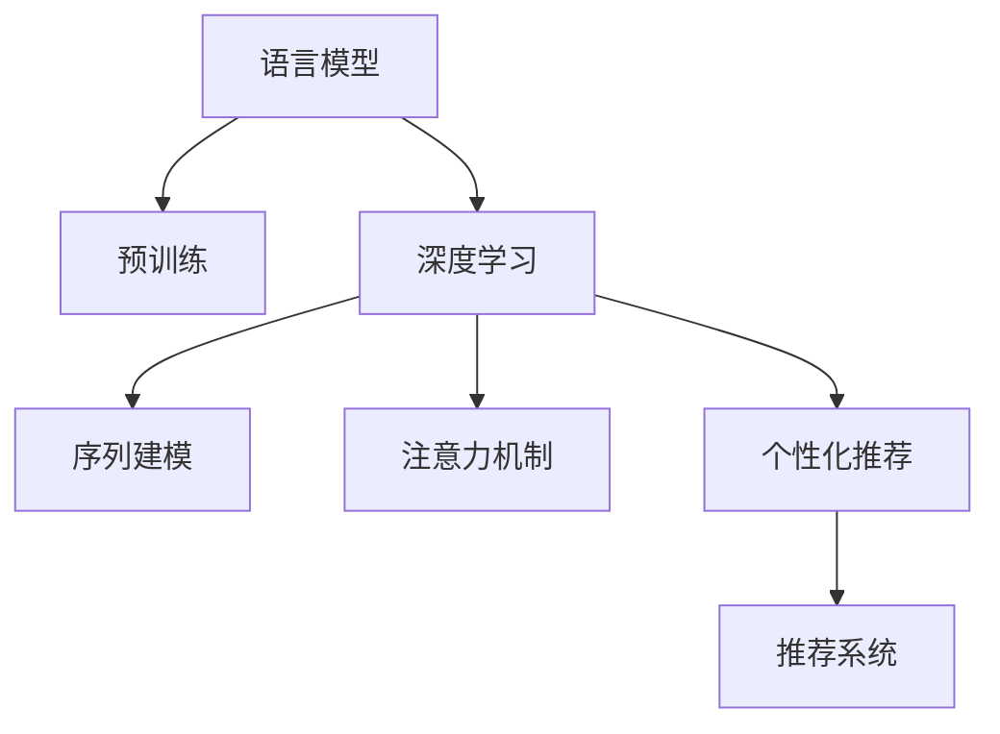

                 

# LLM对推荐系统的改进方向

## 1. 背景介绍

### 1.1 问题由来
推荐系统是互联网时代重要的技术应用之一，广泛应用于电商、社交、内容分发等场景。传统的推荐算法主要基于用户历史行为数据，难以捕捉用户潜在的兴趣变化，存在冷启动问题和推荐多样性不足等问题。近年来，自然语言处理（NLP）技术在推荐系统中的应用逐渐增多，基于语言模型的推荐算法表现出了极大的潜力。

### 1.2 问题核心关键点
1. **用户意图抽取**：如何准确理解用户通过文本表达的兴趣和需求。
2. **推荐内容生成**：如何利用语言模型生成与用户兴趣高度相关的推荐内容。
3. **实时性要求**：推荐系统需要能够实时响应用户输入，生成个性化推荐。
4. **鲁棒性要求**：推荐系统需要在对抗样本和噪声数据中保持稳定性和鲁棒性。
5. **可解释性**：推荐系统需要能够提供推荐理由，增强用户信任和满意度。

### 1.3 问题研究意义
研究基于语言模型的推荐系统，对于提升推荐系统的效果，解决传统推荐系统中的问题，具有重要意义：

1. **提升推荐效果**：利用语言模型的语义理解能力，可以从文本中挖掘出更深层次的兴趣信息，生成更加精准的推荐结果。
2. **解决冷启动问题**：语言模型可以通过预训练学习到广泛的常识和语义知识，在用户没有历史行为数据的情况下，依然能够生成个性化的推荐。
3. **增强推荐多样性**：语言模型可以生成更多样化的内容，避免推荐结果的单一性和重复性。
4. **提升用户体验**：通过提供推荐理由，增强了用户对推荐结果的理解和信任，提升了推荐系统的满意度。
5. **推动推荐系统应用**：语言模型的应用为推荐系统拓展了新的技术路径，加速了推荐系统在更多场景下的落地。

## 2. 核心概念与联系

### 2.1 核心概念概述

为更好地理解基于语言模型的推荐系统方法，本节将介绍几个密切相关的核心概念：

- **语言模型**：基于神经网络的语言模型，能够通过大规模文本数据进行预训练，学习语言的分布和语义知识。
- **推荐系统**：根据用户的历史行为数据和当前输入，为用户推荐相关物品的系统。
- **深度学习**：通过神经网络模型，利用大量数据进行训练，提取特征，完成推荐任务。
- **序列建模**：利用RNN、LSTM、Transformer等模型，对用户输入的序列进行建模，提取时序信息。
- **注意力机制**：通过注意力机制，增强模型对重要信息的关注，提高推荐质量。
- **个性化推荐**：根据用户的历史行为和当前输入，生成个性化的推荐结果。

这些核心概念之间的逻辑关系可以通过以下Mermaid流程图来展示：



这个流程图展示了大语言模型对推荐系统的核心概念及其之间的关系：

1. 语言模型通过预训练获得语言表示能力。
2. 深度学习利用神经网络模型，对用户输入进行特征提取。
3. 序列建模对用户输入进行时序分析。
4. 注意力机制增强模型对重要信息的关注。
5. 个性化推荐根据用户历史行为和输入，生成推荐结果。
6. 推荐系统集成以上技术，为用户推荐相关物品。

## 3. 核心算法原理 & 具体操作步骤
### 3.1 算法原理概述

基于语言模型的推荐系统，其核心思想是通过语言模型学习用户输入的语义信息，进而生成个性化推荐结果。在用户输入文本时，将文本作为语言模型的输入，模型通过前向传播计算得到表示，再利用这些表示生成推荐结果。

具体而言，假设用户输入文本为 $x$，预训练语言模型为 $M$，输出层为 $H$，推荐模型为 $R$。则推荐过程分为以下几步：

1. 将用户输入文本 $x$ 输入语言模型 $M$，得到表示 $H = M(x)$。
2. 根据表示 $H$，通过推荐模型 $R$ 计算推荐结果 $y = R(H)$。
3. 将推荐结果 $y$ 作为最终输出，推荐给用户。

### 3.2 算法步骤详解

基于语言模型的推荐系统通常包括以下关键步骤：

**Step 1: 准备预训练模型和数据集**
- 选择合适的预训练语言模型 $M$ 作为输入表示的生成器。
- 准备推荐系统的训练数据集 $D$，通常包括用户的历史行为数据和输入文本数据。

**Step 2: 设计推荐模型**
- 设计推荐模型 $R$，通常为深度神经网络，如MLP、RNN、LSTM、Transformer等。
- 选择合适的损失函数，如均方误差、交叉熵等，衡量推荐结果与实际标签之间的差异。

**Step 3: 设置微调超参数**
- 选择合适的优化算法及其参数，如Adam、SGD等，设置学习率、批大小、迭代轮数等。
- 设置正则化技术及强度，包括权重衰减、Dropout等。
- 确定冻结预训练参数的策略，如仅微调底层，或全部参数都参与微调。

**Step 4: 执行梯度训练**
- 将训练集数据分批次输入模型，前向传播计算损失函数。
- 反向传播计算参数梯度，根据设定的优化算法和学习率更新模型参数。
- 周期性在验证集上评估模型性能，根据性能指标决定是否触发Early Stopping。
- 重复上述步骤直到满足预设的迭代轮数或Early Stopping条件。

**Step 5: 测试和部署**
- 在测试集上评估微调后模型 $M_{\hat{\theta}}$ 的性能，对比微调前后的推荐精度提升。
- 使用微调后的模型对新样本进行推理预测，集成到实际的应用系统中。
- 持续收集新的数据，定期重新微调模型，以适应数据分布的变化。

以上是基于语言模型的推荐系统的一般流程。在实际应用中，还需要针对具体任务的特点，对推荐模型和微调过程的各个环节进行优化设计，如改进训练目标函数，引入更多的正则化技术，搜索最优的超参数组合等，以进一步提升模型性能。

### 3.3 算法优缺点

基于语言模型的推荐系统具有以下优点：
1. **语义理解**：语言模型通过预训练学习到丰富的语义知识，可以从文本中挖掘出更深层次的兴趣信息，生成更加精准的推荐结果。
2. **冷启动问题解决**：语言模型可以通过预训练学习到广泛的常识和语义知识，在用户没有历史行为数据的情况下，依然能够生成个性化的推荐。
3. **推荐多样性**：语言模型可以生成更多样化的内容，避免推荐结果的单一性和重复性。
4. **实时性**：语言模型可以通过高效的前向传播计算，快速生成推荐结果，满足推荐系统的实时性要求。
5. **可解释性**：语言模型可以输出推荐理由，增强用户对推荐结果的理解和信任，提升推荐系统的满意度。

同时，该方法也存在一定的局限性：
1. **数据依赖**：推荐系统的性能很大程度上取决于输入文本的质量和数量，获取高质量输入数据的成本较高。
2. **过拟合风险**：微调过程容易受到输入文本的噪声影响，过拟合风险较高。
3. **对抗样本鲁棒性**：推荐系统需要在对抗样本和噪声数据中保持稳定性和鲁棒性。
4. **模型复杂度**：语言模型通常包含大量参数，模型训练和推理计算资源消耗较大。

尽管存在这些局限性，但就目前而言，基于语言模型的推荐系统仍是大语言模型应用的重要范式。未来相关研究的重点在于如何进一步降低推荐系统对输入数据的依赖，提高模型的少样本学习和跨领域迁移能力，同时兼顾可解释性和鲁棒性等因素。

### 3.4 算法应用领域

基于语言模型的推荐系统已经在多个领域得到了广泛的应用，例如：

- **电商推荐**：为用户推荐商品、搜索建议等。通过用户输入的文本描述，生成与用户兴趣高度相关的推荐商品。
- **内容推荐**：为用户推荐文章、视频、音乐等。根据用户输入的文本描述，生成与用户兴趣匹配的内容。
- **个性化广告**：为用户推荐广告内容。通过用户输入的文本描述，生成与用户兴趣匹配的广告。
- **智能客服**：为用户推荐常见问题解决方案。通过用户输入的文本描述，生成与用户问题相关的解决方案。
- **社交推荐**：为用户推荐好友、社群等。通过用户输入的文本描述，生成与用户兴趣匹配的社交对象。

除了上述这些经典应用外，基于语言模型的推荐系统还被创新性地应用到更多场景中，如医疗推荐、教育推荐等，为推荐系统拓展了新的应用场景。随着语言模型的不断进步，相信推荐系统将在更多领域得到应用，为用户的个性化需求提供更精准、多样化的推荐服务。

## 4. 数学模型和公式 & 详细讲解 & 举例说明

### 4.1 数学模型构建

本节将使用数学语言对基于语言模型的推荐系统过程进行更加严格的刻画。

假设推荐系统输入为文本 $x$，输出为物品列表 $y$。推荐系统的训练集为 $D=\{(x_i,y_i)\}_{i=1}^N$，其中 $x_i \in \mathcal{X}$，$y_i \in \mathcal{Y}$。

定义推荐模型 $R$ 在输入 $x$ 上的输出为 $\hat{y} = R(x)$，则推荐系统损失函数为：

$$
\mathcal{L}(R) = -\frac{1}{N}\sum_{i=1}^N \log P(y_i|\hat{y}_i)
$$

其中 $P(y_i|\hat{y}_i)$ 为模型在输入 $x_i$ 下生成物品 $y_i$ 的概率，$log$ 为自然对数。

在实践中，我们通常使用基于梯度的优化算法（如Adam、SGD等）来近似求解上述最优化问题。设 $\eta$ 为学习率，$\lambda$ 为正则化系数，则参数的更新公式为：

$$
\theta \leftarrow \theta - \eta \nabla_{\theta}\mathcal{L}(\theta) - \eta\lambda\theta
$$

其中 $\nabla_{\theta}\mathcal{L}(\theta)$ 为损失函数对参数 $\theta$ 的梯度，可通过反向传播算法高效计算。

### 4.2 公式推导过程

以下我们以电商推荐为例，推导推荐系统的交叉熵损失函数及其梯度的计算公式。

假设推荐系统输入为商品描述 $x$，输出为推荐商品列表 $y$。推荐系统训练集为 $\{(x_i,y_i)\}_{i=1}^N$。

定义推荐模型 $R$ 在输入 $x_i$ 上的输出为 $\hat{y}_i$，则推荐系统损失函数为：

$$
\mathcal{L}(R) = -\frac{1}{N}\sum_{i=1}^N \log P(y_i|\hat{y}_i)
$$

其中 $P(y_i|\hat{y}_i)$ 为模型在输入 $x_i$ 下生成物品 $y_i$ 的概率。

根据链式法则，损失函数对参数 $\theta_k$ 的梯度为：

$$
\frac{\partial \mathcal{L}(R)}{\partial \theta_k} = -\frac{1}{N}\sum_{i=1}^N \frac{\partial \log P(y_i|\hat{y}_i)}{\partial \theta_k}
$$

其中 $\frac{\partial \log P(y_i|\hat{y}_i)}{\partial \theta_k}$ 可进一步递归展开，利用自动微分技术完成计算。

在得到损失函数的梯度后，即可带入参数更新公式，完成模型的迭代优化。重复上述过程直至收敛，最终得到适应推荐任务的最优模型参数 $\theta^*$。

## 5. 项目实践：代码实例和详细解释说明

### 5.1 开发环境搭建

在进行推荐系统开发前，我们需要准备好开发环境。以下是使用Python进行TensorFlow开发的环境配置流程：

1. 安装Anaconda：从官网下载并安装Anaconda，用于创建独立的Python环境。

2. 创建并激活虚拟环境：
```bash
conda create -n tf-env python=3.8 
conda activate tf-env
```

3. 安装TensorFlow：根据CUDA版本，从官网获取对应的安装命令。例如：
```bash
conda install tensorflow==2.5.0 -c tf -c conda-forge
```

4. 安装TensorFlow Addons：包含一些高级的TensorFlow组件，如Transformer、Optimizers等。
```bash
conda install tensorflow-addons
```

5. 安装TensorBoard：TensorFlow配套的可视化工具，用于监控模型训练状态。
```bash
pip install tensorboard
```

完成上述步骤后，即可在`tf-env`环境中开始推荐系统开发。

### 5.2 源代码详细实现

下面我们以电商推荐为例，给出使用TensorFlow对BERT模型进行推荐系统微调的代码实现。

首先，定义推荐系统的数据处理函数：

```python
import tensorflow as tf
import tensorflow_addons as addons

def recommendation_dataset(dataset, tokenizer, max_seq_len):
    for text, label in dataset:
        encoding = tokenizer(text, max_length=max_seq_len, padding='max_length', truncation=True, return_tensors='tf')
        input_ids = encoding['input_ids']
        attention_mask = encoding['attention_mask']
        yield {
            'input_ids': input_ids,
            'attention_mask': attention_mask,
            'labels': tf.convert_to_tensor(label, dtype=tf.int32)
        }
```

然后，定义模型和优化器：

```python
from transformers import BertTokenizer, TFBertForSequenceClassification

tokenizer = BertTokenizer.from_pretrained('bert-base-cased')
model = TFBertForSequenceClassification.from_pretrained('bert-base-cased', num_labels=3)

optimizer = addons.optimizers.AdamW(model.parameters(), lr=2e-5)
```

接着，定义训练和评估函数：

```python
@tf.function
def train_step(inputs):
    with tf.GradientTape() as tape:
        logits = model(inputs['input_ids'], attention_mask=inputs['attention_mask'])
        loss = tf.keras.losses.SparseCategoricalCrossentropy()(inputs['labels'], logits, from_logits=True)
    grads = tape.gradient(loss, model.trainable_variables)
    optimizer.apply_gradients(zip(grads, model.trainable_variables))
    return loss

@tf.function
def evaluate_step(inputs):
    logits = model(inputs['input_ids'], attention_mask=inputs['attention_mask'])
    predictions = tf.argmax(logits, axis=1)
    return tf.metrics.mean(predictions == inputs['labels'])
```

最后，启动训练流程并在测试集上评估：

```python
dataset = recommendation_dataset(train_dataset, tokenizer, max_seq_len=128)

for epoch in range(10):
    total_loss = 0
    for batch in dataset:
        loss = train_step(batch)
        total_loss += loss
    print(f"Epoch {epoch+1}, train loss: {total_loss/n_samples:.3f}")
    
    dev_dataset = recommendation_dataset(dev_dataset, tokenizer, max_seq_len=128)
    dev_loss = evaluate_step(dev_dataset)
    print(f"Epoch {epoch+1}, dev loss: {dev_loss.numpy():.3f}")
    
    test_dataset = recommendation_dataset(test_dataset, tokenizer, max_seq_len=128)
    test_loss = evaluate_step(test_dataset)
    print(f"Epoch {epoch+1}, test loss: {test_loss.numpy():.3f}")
```

以上就是使用TensorFlow对BERT进行电商推荐系统微调的完整代码实现。可以看到，得益于TensorFlow的强大封装，我们可以用相对简洁的代码完成BERT模型的加载和微调。

### 5.3 代码解读与分析

让我们再详细解读一下关键代码的实现细节：

**recommendation_dataset函数**：
- 将输入的文本数据和标签数据转换为模型所需的tensorflow张量格式。
- 对文本进行分词、截断、填充等预处理操作，生成输入序列。
- 返回处理后的张量，用于模型的前向传播和训练。

**train_step函数**：
- 定义前向传播计算逻辑，将输入序列通过BERT模型得到logits。
- 定义损失函数，计算预测结果与真实标签之间的交叉熵损失。
- 使用梯度降算法计算参数梯度，并更新模型参数。

**evaluate_step函数**：
- 定义前向传播计算逻辑，将输入序列通过BERT模型得到logits。
- 计算预测结果与真实标签之间的交叉熵损失。
- 使用评估指标计算模型在验证集和测试集上的性能。

**训练流程**：
- 定义总的epoch数，开始循环迭代
- 每个epoch内，在训练集上训练，输出平均loss
- 在验证集上评估，输出交叉熵损失
- 在测试集上评估，输出交叉熵损失

可以看到，TensorFlow配合BERT等预训练模型的封装，使得推荐系统微调的代码实现变得简洁高效。开发者可以将更多精力放在数据处理、模型改进等高层逻辑上，而不必过多关注底层的实现细节。

当然，工业级的系统实现还需考虑更多因素，如模型的保存和部署、超参数的自动搜索、更灵活的任务适配层等。但核心的推荐范式基本与此类似。

## 6. 实际应用场景
### 6.1 电商推荐

基于大语言模型推荐系统，可以广泛应用于电商推荐场景中。传统的电商推荐系统主要依赖用户历史行为数据，难以捕捉用户潜在的兴趣变化。而利用语言模型，可以通过用户输入的文本描述，生成个性化的推荐商品，提升用户满意度。

在技术实现上，可以收集用户对商品的文字评价、评论等信息，作为输入文本数据。通过这些文本数据训练语言模型，并利用模型生成与用户兴趣匹配的推荐商品。对于新用户，可以通过简单的文本输入，生成个性化的推荐商品，解决冷启动问题。

### 6.2 内容推荐

内容推荐系统在视频、音乐、文章等推荐领域同样应用广泛。通过收集用户对内容的评价、评论等信息，作为输入文本数据。训练语言模型，并利用模型生成与用户兴趣匹配的内容，推荐给用户。内容推荐系统可以实时响应用户输入，生成个性化的推荐内容，提升用户的使用体验。

### 6.3 个性化广告

基于语言模型的推荐系统还可以应用于个性化广告推荐。通过收集用户的搜索记录、浏览记录等信息，作为输入文本数据。训练语言模型，并利用模型生成与用户兴趣匹配的广告，推荐给用户。个性化广告推荐可以提高广告的点击率和转化率，提升广告主的投放效果。

### 6.4 智能客服

智能客服系统可以结合基于语言模型的推荐系统，为用户提供更智能的客服体验。通过收集用户的询问内容，作为输入文本数据。训练语言模型，并利用模型生成与用户问题匹配的解决方案，推荐给用户。智能客服系统可以自动响应用户的查询，解决用户的常见问题，提升用户满意度。

### 6.5 未来应用展望

随着大语言模型推荐系统技术的不断进步，其应用范围将不断拓展，为更多行业带来变革性影响。

在智慧医疗领域，基于语言模型的推荐系统可以用于医生的辅助诊疗，帮助医生根据病人的描述，推荐合适的治疗方案。在教育领域，推荐系统可以用于推荐合适的学习资源，提升学习效果。在金融领域，推荐系统可以用于推荐合适的投资建议，帮助用户做出更好的投资决策。在城市管理领域，推荐系统可以用于推荐合适的城市服务，提升城市居民的生活质量。

## 7. 工具和资源推荐
### 7.1 学习资源推荐

为了帮助开发者系统掌握基于语言模型的推荐系统理论基础和实践技巧，这里推荐一些优质的学习资源：

1. 《深度学习框架TensorFlow 2.0实战》系列博文：由TensorFlow开发者撰写，详细介绍了TensorFlow的各项功能和应用。

2. 《TensorFlow教程》官方文档：TensorFlow的官方文档，提供了详细的API说明和代码示例，适合开发者快速上手TensorFlow。

3. 《推荐系统：基于Python的实践》书籍：推荐系统专家所著，详细介绍了推荐系统的理论和实践，包括基于语言模型的推荐系统。

4. 《自然语言处理（第二版）》书籍：斯坦福大学自然语言处理课程，介绍了NLP的基本概念和经典模型，适合初学者入门。

5. Kaggle推荐系统竞赛：Kaggle平台上的推荐系统竞赛，提供大量数据和代码，适合开发者实践和研究推荐系统。

通过对这些资源的学习实践，相信你一定能够快速掌握基于语言模型的推荐系统的精髓，并用于解决实际的推荐问题。

### 7.2 开发工具推荐

高效的开发离不开优秀的工具支持。以下是几款用于推荐系统开发的常用工具：

1. TensorFlow：由Google主导开发的开源深度学习框架，生产部署方便，适合大规模工程应用。

2. PyTorch：基于Python的开源深度学习框架，灵活动态的计算图，适合快速迭代研究。

3. TensorFlow Addons：包含一些高级的TensorFlow组件，如Transformer、Optimizers等。

4. Weights & Biases：模型训练的实验跟踪工具，可以记录和可视化模型训练过程中的各项指标，方便对比和调优。

5. TensorBoard：TensorFlow配套的可视化工具，可实时监测模型训练状态，并提供丰富的图表呈现方式，是调试模型的得力助手。

6. Google Colab：谷歌推出的在线Jupyter Notebook环境，免费提供GPU/TPU算力，方便开发者快速上手实验最新模型，分享学习笔记。

合理利用这些工具，可以显著提升推荐系统的开发效率，加快创新迭代的步伐。

### 7.3 相关论文推荐

基于语言模型的推荐系统的发展源于学界的持续研究。以下是几篇奠基性的相关论文，推荐阅读：

1. Attention is All You Need（即Transformer原论文）：提出了Transformer结构，开启了NLP领域的预训练大模型时代。

2. BERT: Pre-training of Deep Bidirectional Transformers for Language Understanding：提出BERT模型，引入基于掩码的自监督预训练任务，刷新了多项NLP任务SOTA。

3. Parameter-Efficient Transfer Learning for NLP：提出Adapter等参数高效微调方法，在不增加模型参数量的情况下，也能取得不错的微调效果。

4. Recommendation Systems with Attention-based Embeddings：提出基于注意力机制的推荐模型，增强了模型对重要信息的关注，提高推荐质量。

5. Fast Parallelization of Recurrent Models：提出并行化的训练方法，显著提高模型训练速度。

这些论文代表了大语言模型推荐系统的发展脉络。通过学习这些前沿成果，可以帮助研究者把握学科前进方向，激发更多的创新灵感。

## 8. 总结：未来发展趋势与挑战

### 8.1 总结

本文对基于语言模型的推荐系统方法进行了全面系统的介绍。首先阐述了推荐系统和大语言模型的研究背景和意义，明确了推荐系统在大语言模型应用中的重要性。其次，从原理到实践，详细讲解了基于语言模型的推荐系统过程，给出了推荐系统开发的完整代码实例。同时，本文还广泛探讨了推荐系统在电商、内容、广告等多个行业领域的应用前景，展示了语言模型的巨大潜力。

通过本文的系统梳理，可以看到，基于语言模型的推荐系统在大规模文本数据的预训练和微调过程中，可以提升推荐系统的性能，解决传统推荐系统中的冷启动问题，增强推荐多样性，提升用户体验，推动推荐系统的应用发展。

### 8.2 未来发展趋势

展望未来，基于语言模型的推荐系统将呈现以下几个发展趋势：

1. **模型规模持续增大**：随着算力成本的下降和数据规模的扩张，推荐系统中的预训练语言模型参数量还将持续增长。超大规模语言模型蕴含的丰富语言知识，有望支撑更加复杂多变的推荐任务。

2. **推荐多样化**：语言模型可以生成更多样化的内容，避免推荐结果的单一性和重复性。未来的推荐系统将更加注重内容的多样性，提供更加个性化的推荐服务。

3. **实时性要求提升**：推荐系统需要在用户输入文本后，快速响应生成推荐结果。未来的推荐系统将更加注重实时性，通过高效的前向传播计算，快速生成推荐结果。

4. **可解释性增强**：推荐系统需要提供推荐理由，增强用户对推荐结果的理解和信任，提升推荐系统的满意度。未来的推荐系统将更加注重可解释性，提供推荐理由和解释。

5. **跨领域迁移能力提升**：未来的推荐系统将更加注重跨领域迁移能力，利用语言模型的语义理解能力，在不同领域之间实现知识的迁移和融合。

6. **对抗鲁棒性提升**：推荐系统需要在对抗样本和噪声数据中保持稳定性和鲁棒性。未来的推荐系统将更加注重对抗鲁棒性，通过对抗训练等方法，提高模型在对抗样本中的表现。

以上趋势凸显了大语言模型推荐系统的广阔前景。这些方向的探索发展，必将进一步提升推荐系统的性能和应用范围，为推荐系统带来新的突破。

### 8.3 面临的挑战

尽管基于语言模型的推荐系统已经取得了瞩目成就，但在迈向更加智能化、普适化应用的过程中，它仍面临着诸多挑战：

1. **数据依赖**：推荐系统的性能很大程度上取决于输入文本的质量和数量，获取高质量输入数据的成本较高。

2. **过拟合风险**：微调过程容易受到输入文本的噪声影响，过拟合风险较高。

3. **对抗样本鲁棒性不足**：推荐系统需要在对抗样本和噪声数据中保持稳定性和鲁棒性。

4. **模型复杂度**：语言模型通常包含大量参数，模型训练和推理计算资源消耗较大。

5. **推荐质量提升**：如何进一步提升推荐系统的推荐质量，尤其是在多样性、公平性、隐私性等方面。

6. **实时性要求**：推荐系统需要在用户输入文本后，快速响应生成推荐结果，这对系统的实时性要求较高。

7. **可解释性不足**：推荐系统需要提供推荐理由，增强用户对推荐结果的理解和信任，提升推荐系统的满意度。

8. **跨领域迁移能力不足**：推荐系统需要能够跨领域迁移，利用语言模型的语义理解能力，在不同领域之间实现知识的迁移和融合。

这些挑战需要通过技术创新和算法优化，逐步克服，才能将大语言模型推荐系统推向更高的台阶。

### 8.4 研究展望

面向未来，基于大语言模型的推荐系统需要在这几个方面寻求新的突破：

1. **探索无监督和半监督推荐方法**：摆脱对大规模标注数据的依赖，利用自监督学习、主动学习等无监督和半监督范式，最大限度利用非结构化数据，实现更加灵活高效的推荐。

2. **研究参数高效和计算高效的推荐方法**：开发更加参数高效的推荐方法，在固定大部分预训练参数的情况下，只更新极少量的任务相关参数。同时优化推荐模型的计算图，减少前向传播和反向传播的资源消耗，实现更加轻量级、实时性的部署。

3. **融合因果和对比学习范式**：通过引入因果推断和对比学习思想，增强推荐模型建立稳定因果关系的能力，学习更加普适、鲁棒的语言表征，从而提升推荐系统的泛化性和抗干扰能力。

4. **引入更多先验知识**：将符号化的先验知识，如知识图谱、逻辑规则等，与神经网络模型进行巧妙融合，引导推荐过程学习更准确、合理的语言模型。同时加强不同模态数据的整合，实现视觉、语音等多模态信息与文本信息的协同建模。

5. **结合因果分析和博弈论工具**：将因果分析方法引入推荐模型，识别出模型决策的关键特征，增强推荐结果的因果性和逻辑性。借助博弈论工具刻画人机交互过程，主动探索并规避模型的脆弱点，提高系统稳定性。

6. **纳入伦理道德约束**：在模型训练目标中引入伦理导向的评估指标，过滤和惩罚有偏见、有害的输出倾向。同时加强人工干预和审核，建立模型行为的监管机制，确保输出符合人类价值观和伦理道德。

这些研究方向将引领基于大语言模型的推荐系统迈向更高的台阶，为构建安全、可靠、可解释、可控的智能系统铺平道路。面向未来，基于大语言模型的推荐系统还需要与其他人工智能技术进行更深入的融合，如知识表示、因果推理、强化学习等，多路径协同发力，共同推动推荐系统技术的进步。

## 9. 附录：常见问题与解答

**Q1：大语言模型在推荐系统中具体应用场景是什么？**

A: 大语言模型在推荐系统中可以应用于多种场景，如电商推荐、内容推荐、广告推荐等。通过输入用户的文字评价、评论、搜索记录等信息，训练语言模型，并利用模型生成与用户兴趣匹配的推荐结果。对于新用户，可以通过简单的文本输入，生成个性化的推荐商品或内容，解决冷启动问题。

**Q2：大语言模型在推荐系统中的性能主要取决于什么因素？**

A: 大语言模型在推荐系统中的性能主要取决于输入文本的质量和数量，模型结构和参数设置，以及训练和微调过程中的超参数优化。输入文本的质量越高，模型的语义理解能力越强，推荐效果越好。模型结构越复杂，参数越多，模型的表现力越强。训练和微调过程中的超参数设置和优化，对模型的性能提升也有重要影响。

**Q3：大语言模型在推荐系统中的推荐质量如何提升？**

A: 大语言模型在推荐系统中的推荐质量可以通过以下几个方面提升：

1. **数据增强**：通过回译、近义替换等方式扩充训练集，提高模型的泛化能力。
2. **对抗训练**：引入对抗样本，提高模型在对抗样本中的表现。
3. **参数高效微调**：只调整少量参数，减小过拟合风险。
4. **多模型集成**：训练多个推荐模型，取平均输出，抑制过拟合。
5. **可解释性增强**：提供推荐理由，增强用户对推荐结果的理解和信任。

这些方法可以通过优化模型结构、训练过程和超参数设置，进一步提升推荐系统的性能。

**Q4：大语言模型在推荐系统中的实时性要求如何满足？**

A: 大语言模型在推荐系统中的实时性要求可以通过以下几个方面满足：

1. **高效的前向传播计算**：利用TensorFlow等高效框架，优化模型计算图，提高前向传播速度。
2. **并行化训练**：采用并行化的训练方法，如数据并行、模型并行等，提高训练速度。
3. **模型压缩**：采用模型压缩技术，如知识蒸馏、量化加速等，减少模型尺寸，提高推理速度。
4. **在线学习**：利用在线学习算法，动态更新模型参数，提升实时性。

这些方法可以通过优化模型结构、计算图和训练过程，满足推荐系统的实时性要求。

**Q5：大语言模型在推荐系统中的可解释性如何增强？**

A: 大语言模型在推荐系统中的可解释性可以通过以下几个方面增强：

1. **输出解释**：提供推荐理由，解释推荐结果的生成过程和依据。
2. **特征可视化**：可视化模型的特征，帮助理解模型对输入数据的关注点。
3. **交互式解释**：利用交互式界面，用户可以实时查看模型的输出和解释。
4. **人工干预**：引入人工干预机制，对模型的输出进行审核和修改。

这些方法可以通过优化模型输出和解释机制，增强推荐系统的可解释性。

---

作者：禅与计算机程序设计艺术 / Zen and the Art of Computer Programming

