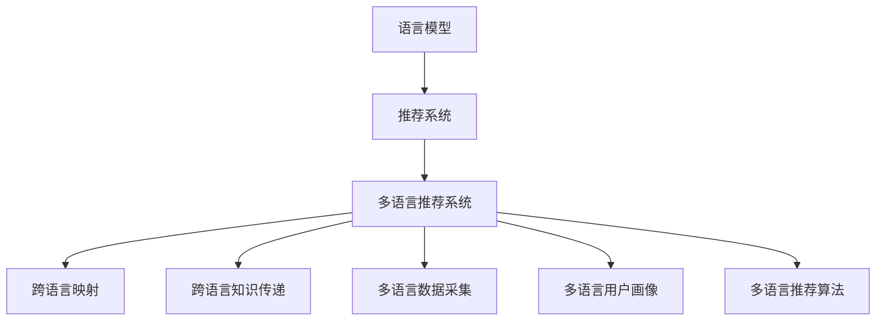

                 

# LLM推荐中的多语言支持技术

> 关键词：语言模型、推荐系统、多语言、跨语言、自然语言处理(NLP)

## 1. 背景介绍

### 1.1 问题由来
随着互联网的全球化，跨语言的自然语言处理(NLP)技术愈发重要。传统的推荐系统多聚焦于单一语言的数据，难以处理多语言场景下的推荐需求。基于此，如何在推荐系统中引入多语言支持，成为近年的研究热点。

### 1.2 问题核心关键点
当前多语言推荐系统面临的主要问题包括：
1. **跨语言映射**：如何将不同语言的文本映射到相同的语义空间，以支持多语言推荐。
2. **跨语言知识传递**：如何从源语言推荐结果中，提取有效的知识并将其传递到目标语言推荐系统中。
3. **多语言数据采集**：如何高效地获取和处理多语言数据，以满足推荐系统的数据需求。
4. **多语言用户画像**：如何在不同语言环境中，构建统一且准确的全球用户画像。
5. **多语言推荐算法**：如何开发适合多语言环境的高效推荐算法。

## 2. 核心概念与联系

### 2.1 核心概念概述

为更好地理解多语言推荐系统中的语言模型技术，本节将介绍几个核心概念：

- **语言模型(Language Model, LM)**：用于建模自然语言序列的概率分布，是推荐系统中的核心组件。常见的语言模型包括N-gram模型、RNN、LSTM、Transformer等。
- **推荐系统(Recommender System)**：通过学习用户行为，为用户提供个性化推荐。推荐系统有三种类型：基于内容的推荐、协同过滤推荐和混合推荐。
- **多语言推荐系统(Multilingual Recommender System)**：在推荐过程中，支持多语言数据和用户输入，提升推荐效果的系统。
- **跨语言映射(Cross-Language Mapping)**：将不同语言的文本映射到相同的语义空间，以支持多语言推荐。
- **跨语言知识传递(Cross-Language Knowledge Transfer)**：从源语言推荐结果中，提取有效的知识并将其传递到目标语言推荐系统中。
- **多语言数据采集(Multilingual Data Acquisition)**：高效地获取和处理多语言数据，满足推荐系统的数据需求。
- **多语言用户画像(Multilingual User Profiling)**：在不同语言环境中，构建统一且准确的全球用户画像。
- **多语言推荐算法(Multilingual Recommendation Algorithm)**：开发适合多语言环境的高效推荐算法。

这些核心概念之间的逻辑关系可以通过以下Mermaid流程图来展示：



这个流程图展示了大语言模型在多语言推荐系统中的核心概念及其之间的关系：

1. 语言模型作为推荐系统的基础，提供自然语言序列的概率分布。
2. 推荐系统通过学习用户行为，提供个性化推荐。
3. 多语言推荐系统在推荐过程中，支持多语言数据和用户输入，提升推荐效果。
4. 跨语言映射将不同语言的文本映射到相同的语义空间，以支持多语言推荐。
5. 跨语言知识传递从源语言推荐结果中，提取有效的知识并将其传递到目标语言推荐系统中。
6. 多语言数据采集高效地获取和处理多语言数据，满足推荐系统的数据需求。
7. 多语言用户画像在不同语言环境中，构建统一且准确的全球用户画像。
8. 多语言推荐算法开发适合多语言环境的高效推荐算法。

这些概念共同构成了多语言推荐系统的学习和应用框架，使其能够在多语言环境下提供优质的推荐服务。

## 3. 核心算法原理 & 具体操作步骤
### 3.1 算法原理概述

多语言推荐系统中的语言模型技术，主要基于以下几个原理：

1. **语言映射模型**：将不同语言的文本映射到相同的语义空间，以支持多语言推荐。
2. **跨语言知识传递模型**：从源语言推荐结果中，提取有效的知识并将其传递到目标语言推荐系统中。
3. **多语言推荐算法**：开发适合多语言环境的高效推荐算法。

形式化地，假设语言模型为 $LM$，推荐系统为 $RS$，多语言推荐系统为 $MRS$。给定不同语言的推荐数据集 $D_1,\ldots,D_n$，其中 $D_i=\{(x_i,y_i)\}_{i=1}^N$，$x_i$ 为源语言文本，$y_i$ 为目标语言推荐结果。

多语言推荐系统的目标是最小化经验风险，即找到最优的推荐模型参数 $\theta^*$：

$$
\theta^* = \mathop{\arg\min}_{\theta} \mathcal{L}(\theta, D)
$$

其中 $\mathcal{L}$ 为针对多语言推荐任务设计的损失函数，用于衡量模型预测输出与真实标签之间的差异。

### 3.2 算法步骤详解

基于上述原理，多语言推荐系统的一般操作流程如下：

**Step 1: 准备数据集**

- 收集多语言推荐数据集，包括源语言和目标语言的数据。
- 对数据集进行清洗和标准化，去除无效和重复数据。

**Step 2: 构建语言映射模型**

- 定义源语言和目标语言的文本表示方式，如BERT、GPT等。
- 对源语言和目标语言的数据分别进行编码，提取语义表示。
- 使用机器翻译模型或跨语言相似度模型，将源语言的语义表示映射到目标语言的语义空间。

**Step 3: 提取跨语言知识**

- 对源语言和目标语言的数据分别进行编码，提取语义表示。
- 使用机器翻译模型或跨语言相似度模型，将源语言的语义表示映射到目标语言的语义空间。
- 利用源语言和目标语言的语义表示，进行知识融合和传递。

**Step 4: 开发多语言推荐算法**

- 根据推荐任务，选择合适的推荐算法，如协同过滤、基于内容的推荐、混合推荐等。
- 将源语言和目标语言的语义表示，作为推荐算法中的特征输入。
- 在多语言数据上训练推荐算法，并进行评估和调优。

**Step 5: 模型部署与测试**

- 将训练好的推荐模型部署到生产环境中。
- 在实际环境中对模型进行测试，评估推荐效果和性能。
- 根据测试结果进行模型优化和迭代。

### 3.3 算法优缺点

基于多语言推荐系统的语言模型技术，具有以下优点：

1. **提升推荐效果**：支持多语言推荐，能够覆盖更广泛的用户群体，提升推荐效果。
2. **降低成本**：通过跨语言映射和知识传递，可以在少标注数据的情况下，获得较好的推荐结果。
3. **通用性强**：支持多语言数据和用户输入，适用于全球范围内的推荐场景。
4. **灵活性高**：可以灵活适应不同语言环境的推荐需求，提升推荐系统的适应性。

同时，该技术也存在一些局限性：

1. **跨语言映射误差**：映射过程中可能引入误差，影响推荐效果。
2. **知识传递不足**：不同语言间的知识传递效果，可能不如预期。
3. **多语言数据稀缺**：一些罕见语言的推荐数据可能稀缺，影响推荐模型性能。
4. **语言模型复杂性**：多语言推荐模型可能需要更复杂的算法和更多的计算资源。
5. **跨语言公平性**：不同语言之间的知识传递和建模，可能存在不平衡现象。

尽管存在这些局限性，多语言推荐系统的语言模型技术，仍是大规模语言推荐中不可或缺的一环。未来相关研究重点在于如何进一步优化跨语言映射和知识传递，提高模型的多语言适应性和公平性。

### 3.4 算法应用领域

基于语言模型的大规模多语言推荐系统，已经在多个领域得到了广泛的应用，例如：

1. **电商平台**：支持全球范围内的产品推荐，覆盖更多用户需求。
2. **社交媒体**：推荐不同语言环境下的内容，提升用户粘性和参与度。
3. **旅游和出行**：推荐全球目的地和旅游服务，满足用户的旅游需求。
4. **金融服务**：推荐不同语言的金融产品和服务，提升用户满意度。
5. **教育平台**：推荐不同语言的教育资源，帮助全球学生提升学习效果。
6. **新闻资讯**：推荐不同语言的新闻资讯，满足全球用户的新闻获取需求。

除了上述这些经典应用外，多语言推荐系统还被创新性地应用到更多场景中，如跨语言广告推荐、跨语言电商推荐等，为不同语言环境的用户提供个性化的推荐服务。

## 4. 数学模型和公式 & 详细讲解  
### 4.1 数学模型构建

本节将使用数学语言对多语言推荐系统中的语言模型技术进行更加严格的刻画。

记语言模型为 $LM$，推荐系统为 $RS$，多语言推荐系统为 $MRS$。假设推荐数据集为 $D=\{(x_i,y_i)\}_{i=1}^N$，其中 $x_i$ 为源语言文本，$y_i$ 为目标语言推荐结果。

定义推荐模型在输入 $x_i$ 上的预测概率分布为 $P(y_i|x_i)$，目标语言的推荐概率分布为 $P(y_i)$。多语言推荐系统的目标是最小化经验风险，即找到最优的推荐模型参数 $\theta^*$：

$$
\theta^* = \mathop{\arg\min}_{\theta} \mathcal{L}(\theta, D)
$$

其中 $\mathcal{L}$ 为针对多语言推荐任务设计的损失函数，用于衡量模型预测输出与真实标签之间的差异。常见的损失函数包括交叉熵损失、均方误差损失等。

### 4.2 公式推导过程

以下我们以二分类任务为例，推导交叉熵损失函数及其梯度的计算公式。

假设推荐模型在输入 $x_i$ 上的输出为 $\hat{y}_i=M_{\theta}(x_i) \in [0,1]$，表示预测推荐结果为 $y_i$ 的概率。真实标签 $y_i \in \{0,1\}$。则二分类交叉熵损失函数定义为：

$$
\ell(M_{\theta}(x_i),y_i) = -[y_i\log \hat{y}_i + (1-y_i)\log (1-\hat{y}_i)]
$$

将其代入经验风险公式，得：

$$
\mathcal{L}(\theta) = -\frac{1}{N}\sum_{i=1}^N [y_i\log M_{\theta}(x_i)+(1-y_i)\log(1-M_{\theta}(x_i))]
$$

根据链式法则，损失函数对参数 $\theta_k$ 的梯度为：

$$
\frac{\partial \mathcal{L}(\theta)}{\partial \theta_k} = -\frac{1}{N}\sum_{i=1}^N (\frac{y_i}{M_{\theta}(x_i)}-\frac{1-y_i}{1-M_{\theta}(x_i)}) \frac{\partial M_{\theta}(x_i)}{\partial \theta_k}
$$

其中 $\frac{\partial M_{\theta}(x_i)}{\partial \theta_k}$ 可进一步递归展开，利用自动微分技术完成计算。

在得到损失函数的梯度后，即可带入参数更新公式，完成模型的迭代优化。重复上述过程直至收敛，最终得到适应多语言推荐任务的最优模型参数 $\theta^*$。

## 5. 项目实践：代码实例和详细解释说明
### 5.1 开发环境搭建

在进行多语言推荐系统开发前，我们需要准备好开发环境。以下是使用Python进行PyTorch开发的环境配置流程：

1. 安装Anaconda：从官网下载并安装Anaconda，用于创建独立的Python环境。

2. 创建并激活虚拟环境：
```bash
conda create -n pytorch-env python=3.8 
conda activate pytorch-env
```

3. 安装PyTorch：根据CUDA版本，从官网获取对应的安装命令。例如：
```bash
conda install pytorch torchvision torchaudio cudatoolkit=11.1 -c pytorch -c conda-forge
```

4. 安装Transformer库：
```bash
pip install transformers
```

5. 安装各类工具包：
```bash
pip install numpy pandas scikit-learn matplotlib tqdm jupyter notebook ipython
```

完成上述步骤后，即可在`pytorch-env`环境中开始多语言推荐系统开发。

### 5.2 源代码详细实现

这里我们以多语言新闻推荐系统为例，给出使用Transformers库对BERT模型进行多语言推荐微调的PyTorch代码实现。

首先，定义推荐任务的数据处理函数：

```python
from transformers import BertTokenizer
from torch.utils.data import Dataset
import torch

class NewsDataset(Dataset):
    def __init__(self, texts, categories, tokenizer, max_len=128):
        self.texts = texts
        self.categories = categories
        self.tokenizer = tokenizer
        self.max_len = max_len
        
    def __len__(self):
        return len(self.texts)
    
    def __getitem__(self, item):
        text = self.texts[item]
        category = self.categories[item]
        
        encoding = self.tokenizer(text, return_tensors='pt', max_length=self.max_len, padding='max_length', truncation=True)
        input_ids = encoding['input_ids'][0]
        attention_mask = encoding['attention_mask'][0]
        
        # 对category-wise的标签进行编码
        encoded_tags = [cat2id[cat] for cat in category] 
        encoded_tags.extend([cat2id['O']] * (self.max_len - len(encoded_tags)))
        labels = torch.tensor(encoded_tags, dtype=torch.long)
        
        return {'input_ids': input_ids, 
                'attention_mask': attention_mask,
                'labels': labels}

# 标签与id的映射
cat2id = {'O': 0, 'politics': 1, 'economy': 2, 'sports': 3, 'entertainment': 4}
id2cat = {v: k for k, v in cat2id.items()}

# 创建dataset
tokenizer = BertTokenizer.from_pretrained('bert-base-cased')

train_dataset = NewsDataset(train_texts, train_categories, tokenizer)
dev_dataset = NewsDataset(dev_texts, dev_categories, tokenizer)
test_dataset = NewsDataset(test_texts, test_categories, tokenizer)
```

然后，定义模型和优化器：

```python
from transformers import BertForTokenClassification, AdamW

model = BertForTokenClassification.from_pretrained('bert-base-cased', num_labels=len(cat2id))

optimizer = AdamW(model.parameters(), lr=2e-5)
```

接着，定义训练和评估函数：

```python
from torch.utils.data import DataLoader
from tqdm import tqdm
from sklearn.metrics import classification_report

device = torch.device('cuda') if torch.cuda.is_available() else torch.device('cpu')
model.to(device)

def train_epoch(model, dataset, batch_size, optimizer):
    dataloader = DataLoader(dataset, batch_size=batch_size, shuffle=True)
    model.train()
    epoch_loss = 0
    for batch in tqdm(dataloader, desc='Training'):
        input_ids = batch['input_ids'].to(device)
        attention_mask = batch['attention_mask'].to(device)
        labels = batch['labels'].to(device)
        model.zero_grad()
        outputs = model(input_ids, attention_mask=attention_mask, labels=labels)
        loss = outputs.loss
        epoch_loss += loss.item()
        loss.backward()
        optimizer.step()
    return epoch_loss / len(dataloader)

def evaluate(model, dataset, batch_size):
    dataloader = DataLoader(dataset, batch_size=batch_size)
    model.eval()
    preds, labels = [], []
    with torch.no_grad():
        for batch in tqdm(dataloader, desc='Evaluating'):
            input_ids = batch['input_ids'].to(device)
            attention_mask = batch['attention_mask'].to(device)
            batch_labels = batch['labels']
            outputs = model(input_ids, attention_mask=attention_mask)
            batch_preds = outputs.logits.argmax(dim=2).to('cpu').tolist()
            batch_labels = batch_labels.to('cpu').tolist()
            for pred_tokens, label_tokens in zip(batch_preds, batch_labels):
                pred_tags = [id2cat[_id] for _id in pred_tokens]
                label_tags = [id2cat[_id] for _id in label_tokens]
                preds.append(pred_tags[:len(label_tags)])
                labels.append(label_tags)
                
    print(classification_report(labels, preds))
```

最后，启动训练流程并在测试集上评估：

```python
epochs = 5
batch_size = 16

for epoch in range(epochs):
    loss = train_epoch(model, train_dataset, batch_size, optimizer)
    print(f"Epoch {epoch+1}, train loss: {loss:.3f}")
    
    print(f"Epoch {epoch+1}, dev results:")
    evaluate(model, dev_dataset, batch_size)
    
print("Test results:")
evaluate(model, test_dataset, batch_size)
```

以上就是使用PyTorch对BERT进行新闻推荐任务的多语言推荐微调代码实现。可以看到，利用Transformers库，我们通过简单的代码实现，就能够快速搭建起多语言推荐系统。

### 5.3 代码解读与分析

让我们再详细解读一下关键代码的实现细节：

**NewsDataset类**：
- `__init__`方法：初始化文本、类别、分词器等关键组件。
- `__len__`方法：返回数据集的样本数量。
- `__getitem__`方法：对单个样本进行处理，将文本输入编码为token ids，将类别编码为数字，并对其进行定长padding，最终返回模型所需的输入。

**cat2id和id2cat字典**：
- 定义了类别与数字id之间的映射关系，用于将token-wise的预测结果解码回真实的类别。

**训练和评估函数**：
- 使用PyTorch的DataLoader对数据集进行批次化加载，供模型训练和推理使用。
- 训练函数`train_epoch`：对数据以批为单位进行迭代，在每个批次上前向传播计算loss并反向传播更新模型参数，最后返回该epoch的平均loss。
- 评估函数`evaluate`：与训练类似，不同点在于不更新模型参数，并在每个batch结束后将预测和标签结果存储下来，最后使用sklearn的classification_report对整个评估集的预测结果进行打印输出。

**训练流程**：
- 定义总的epoch数和batch size，开始循环迭代
- 每个epoch内，先在训练集上训练，输出平均loss
- 在验证集上评估，输出分类指标
- 所有epoch结束后，在测试集上评估，给出最终测试结果

可以看到，PyTorch配合Transformers库使得BERT多语言推荐微调的代码实现变得简洁高效。开发者可以将更多精力放在数据处理、模型改进等高层逻辑上，而不必过多关注底层的实现细节。

当然，工业级的系统实现还需考虑更多因素，如模型的保存和部署、超参数的自动搜索、更灵活的任务适配层等。但核心的多语言推荐范式基本与此类似。

## 6. 实际应用场景
### 6.1 智能推荐平台

基于多语言推荐系统，智能推荐平台可以实现全球范围内内容的推荐，覆盖更多用户需求。例如，电子商务平台可以根据用户的浏览和购买历史，推荐多语言商品；视频平台可以根据用户的观看行为，推荐多语言电影和电视剧。

在技术实现上，可以收集用户的多语言行为数据，将数据输入到多语言推荐模型中进行训练。模型学习到用户的多语言偏好和行为特征，进而能够生成跨语言推荐结果。在推荐时，可以动态调整推荐策略，兼顾不同语言的用户需求，提升推荐效果。

### 6.2 跨语言社交网络

跨语言社交网络是连接不同语言用户的平台，需要支持多语言推荐来提升用户粘性和参与度。例如，Twitter、Facebook等社交网络平台，可以通过多语言推荐，增加不同语言用户之间的交流，提升平台的活跃度。

在技术实现上，可以收集用户在不同语言平台上的行为数据，如点赞、评论、分享等。将这些行为数据输入到多语言推荐模型中进行训练，学习到用户的多语言行为特征。在推荐时，根据用户的行为特征，动态生成跨语言推荐结果，增加用户之间的互动。

### 6.3 多语言智能客服

智能客服系统需要支持多语言用户查询，提供全球化的客户服务。例如，通过多语言推荐系统，智能客服可以自动匹配不同语言的查询请求，并提供对应的多语言回复。

在技术实现上，可以收集不同语言的用户查询和回复数据，将这些数据输入到多语言推荐模型中进行训练。模型学习到不同语言的语义表示，能够将查询请求映射到目标语言，并生成对应的多语言回复。智能客服系统可以根据推荐结果，快速响应不同语言用户的需求。

### 6.4 未来应用展望

随着多语言推荐系统的发展，其在更多领域将得到应用，带来变革性影响。

1. **全球化电商**：多语言推荐系统支持全球化的电商推荐，提升全球用户的购物体验。例如，亚马逊、阿里巴巴等电商平台的全球化扩张，将通过多语言推荐系统来覆盖更多用户需求。

2. **跨语言旅游**：推荐不同语言的旅游目的地和旅游服务，提升全球用户的旅游体验。例如，TripAdvisor等旅游平台可以推荐多语言旅游攻略和目的地。

3. **跨语言教育**：推荐不同语言的教育资源，帮助全球学生提升学习效果。例如，Coursera、edX等在线教育平台可以通过多语言推荐系统，推荐不同语言的教育课程和资料。

4. **跨语言广告**：推荐不同语言的广告内容，提升全球用户的广告体验。例如，Google、Facebook等广告平台可以通过多语言推荐系统，推荐不同语言的广告素材。

5. **跨语言金融**：推荐不同语言的金融产品和服务，提升全球用户的金融体验。例如，PayPal、支付宝等金融平台可以通过多语言推荐系统，推荐不同语言的金融服务。

6. **跨语言医疗**：推荐不同语言的医疗资源和服务，提升全球用户的医疗体验。例如，Mayo Clinic等医疗平台可以通过多语言推荐系统，推荐不同语言的医疗服务。

这些领域的应用将进一步拓展多语言推荐系统的作用，带来更加丰富和多样的推荐服务。

## 7. 工具和资源推荐
### 7.1 学习资源推荐

为了帮助开发者系统掌握多语言推荐系统的理论基础和实践技巧，这里推荐一些优质的学习资源：

1. 《深度学习与自然语言处理》系列博文：由大模型技术专家撰写，深入浅出地介绍了深度学习在自然语言处理中的应用，包括多语言推荐系统等。

2. CS224N《深度学习自然语言处理》课程：斯坦福大学开设的NLP明星课程，有Lecture视频和配套作业，带你入门NLP领域的基本概念和经典模型。

3. 《Natural Language Processing with Transformers》书籍：Transformers库的作者所著，全面介绍了如何使用Transformers库进行NLP任务开发，包括多语言推荐系统等。

4. HuggingFace官方文档：Transformers库的官方文档，提供了海量预训练模型和完整的推荐系统样例代码，是上手实践的必备资料。

5. CLUE开源项目：中文语言理解测评基准，涵盖大量不同类型的中文NLP数据集，并提供了基于多语言推荐系统的baseline模型，助力中文NLP技术发展。

通过对这些资源的学习实践，相信你一定能够快速掌握多语言推荐系统的精髓，并用于解决实际的NLP问题。
###  7.2 开发工具推荐

高效的开发离不开优秀的工具支持。以下是几款用于多语言推荐系统开发的常用工具：

1. PyTorch：基于Python的开源深度学习框架，灵活动态的计算图，适合快速迭代研究。大部分预训练语言模型都有PyTorch版本的实现。

2. TensorFlow：由Google主导开发的开源深度学习框架，生产部署方便，适合大规模工程应用。同样有丰富的预训练语言模型资源。

3. Transformers库：HuggingFace开发的NLP工具库，集成了众多SOTA语言模型，支持PyTorch和TensorFlow，是进行多语言推荐系统开发的利器。

4. Weights & Biases：模型训练的实验跟踪工具，可以记录和可视化模型训练过程中的各项指标，方便对比和调优。与主流深度学习框架无缝集成。

5. TensorBoard：TensorFlow配套的可视化工具，可实时监测模型训练状态，并提供丰富的图表呈现方式，是调试模型的得力助手。

6. Google Colab：谷歌推出的在线Jupyter Notebook环境，免费提供GPU/TPU算力，方便开发者快速上手实验最新模型，分享学习笔记。

合理利用这些工具，可以显著提升多语言推荐系统的开发效率，加快创新迭代的步伐。

### 7.3 相关论文推荐

多语言推荐系统的发展源于学界的持续研究。以下是几篇奠基性的相关论文，推荐阅读：

1. Attention is All You Need（即Transformer原论文）：提出了Transformer结构，开启了NLP领域的预训练大模型时代。

2. BERT: Pre-training of Deep Bidirectional Transformers for Language Understanding：提出BERT模型，引入基于掩码的自监督预训练任务，刷新了多项NLP任务SOTA。

3. Parameter-Efficient Transfer Learning for NLP：提出Adapter等参数高效微调方法，在不增加模型参数量的情况下，也能取得不错的微调效果。

4. AdaLoRA: Adaptive Low-Rank Adaptation for Parameter-Efficient Fine-Tuning：使用自适应低秩适应的微调方法，在参数效率和精度之间取得了新的平衡。

5. Multi-view Cross-Language Information Transfer：提出跨语言信息转移方法，从源语言推荐结果中，提取有效的知识并将其传递到目标语言推荐系统中。

6. Multi-view Document Embedding for Cross-Language Document Recommendation：提出多视图文档嵌入方法，通过融合多视图信息，提升跨语言文档推荐的准确性。

这些论文代表了大语言模型微调技术的发展脉络。通过学习这些前沿成果，可以帮助研究者把握学科前进方向，激发更多的创新灵感。

## 8. 总结：未来发展趋势与挑战

### 8.1 总结

本文对基于语言模型的大规模多语言推荐系统进行了全面系统的介绍。首先阐述了多语言推荐系统的发展背景和重要性，明确了多语言推荐在推荐系统中的应用价值。其次，从原理到实践，详细讲解了多语言推荐系统的数学原理和关键步骤，给出了多语言推荐系统开发的完整代码实例。同时，本文还广泛探讨了多语言推荐系统在多个行业领域的应用前景，展示了多语言推荐系统的巨大潜力。此外，本文精选了多语言推荐系统的各类学习资源，力求为读者提供全方位的技术指引。

通过本文的系统梳理，可以看到，基于语言模型的大规模多语言推荐系统正在成为NLP推荐技术的重要范式，极大地拓展了推荐系统的应用边界，带来了更多推荐场景。受益于大规模语料的预训练和多语言推荐模型的深度融合，多语言推荐系统能够覆盖更广泛的用户群体，提升推荐效果。未来，伴随预训练语言模型和推荐算法的持续演进，相信多语言推荐系统必将在全球化推荐中扮演越来越重要的角色。

### 8.2 未来发展趋势

展望未来，多语言推荐系统将呈现以下几个发展趋势：

1. **模型规模持续增大**：随着算力成本的下降和数据规模的扩张，预训练语言模型的参数量还将持续增长。超大规模语言模型蕴含的丰富语言知识，有望支撑更加复杂多变的推荐场景。

2. **推荐算法多样化**：开发更多适合多语言环境的推荐算法，如基于内容的推荐、协同过滤推荐、混合推荐等，以应对不同语言环境的推荐需求。

3. **跨语言映射精度提升**：引入更多先进的跨语言映射模型，如跨语言注意力机制、多语言自编码等，提高跨语言映射的精度和效率。

4. **跨语言知识传递深化**：开发更高效、更准确的跨语言知识传递算法，提升不同语言间的知识传递效果。

5. **多语言数据采集优化**：采用更多元、更高效的数据采集策略，满足多语言推荐系统对数据的需求。

6. **多语言用户画像增强**：构建更加全面、准确的多语言用户画像，提升推荐系统的用户覆盖率和个性化推荐效果。

以上趋势凸显了多语言推荐系统的广阔前景。这些方向的探索发展，必将进一步提升多语言推荐系统的性能和应用范围，为全球化推荐带来新的突破。

### 8.3 面临的挑战

尽管多语言推荐系统已经取得了瞩目成就，但在迈向更加智能化、普适化应用的过程中，它仍面临着诸多挑战：

1. **跨语言映射误差**：映射过程中可能引入误差，影响推荐效果。

2. **知识传递不足**：不同语言间的知识传递效果，可能不如预期。

3. **多语言数据稀缺**：一些罕见语言的推荐数据可能稀缺，影响推荐模型性能。

4. **语言模型复杂性**：多语言推荐模型可能需要更复杂的算法和更多的计算资源。

5. **跨语言公平性**：不同语言之间的知识传递和建模，可能存在不平衡现象。

尽管存在这些局限性，多语言推荐系统的语言模型技术，仍是大规模语言推荐中不可或缺的一环。未来相关研究重点在于如何进一步优化跨语言映射和知识传递，提高模型的多语言适应性和公平性。

### 8.4 研究展望

面对多语言推荐系统所面临的种种挑战，未来的研究需要在以下几个方面寻求新的突破：

1. **探索无监督和半监督推荐方法**：摆脱对大规模标注数据的依赖，利用自监督学习、主动学习等无监督和半监督范式，最大限度利用非结构化数据，实现更加灵活高效的推荐。

2. **研究参数高效和计算高效的推荐范式**：开发更加参数高效的推荐方法，在固定大部分预训练参数的同时，只更新极少量的任务相关参数。同时优化推荐模型的计算图，减少前向传播和反向传播的资源消耗，实现更加轻量级、实时性的部署。

3. **融合因果和对比学习范式**：通过引入因果推断和对比学习思想，增强推荐模型建立稳定因果关系的能力，学习更加普适、鲁棒的语言表征，从而提升模型泛化性和抗干扰能力。

4. **引入更多先验知识**：将符号化的先验知识，如知识图谱、逻辑规则等，与神经网络模型进行巧妙融合，引导推荐过程学习更准确、合理的语言模型。同时加强不同模态数据的整合，实现视觉、语音等多模态信息与文本信息的协同建模。

5. **结合因果分析和博弈论工具**：将因果分析方法引入推荐模型，识别出推荐决策的关键特征，增强推荐输出的因果性和逻辑性。借助博弈论工具刻画人机交互过程，主动探索并规避推荐模型的脆弱点，提高系统稳定性。

6. **纳入伦理道德约束**：在推荐目标中引入伦理导向的评估指标，过滤和惩罚有偏见、有害的输出倾向。同时加强人工干预和审核，建立推荐系统的监管机制，确保推荐输出的安全性。

这些研究方向的探索，必将引领多语言推荐系统技术迈向更高的台阶，为构建安全、可靠、可解释、可控的智能推荐系统铺平道路。面向未来，多语言推荐系统还需要与其他人工智能技术进行更深入的融合，如知识表示、因果推理、强化学习等，多路径协同发力，共同推动自然语言理解和智能交互系统的进步。只有勇于创新、敢于突破，才能不断拓展推荐系统的边界，让智能技术更好地造福全球用户。

## 9. 附录：常见问题与解答
### Q1：多语言推荐系统中的语言映射模型是如何工作的？

A: 多语言推荐系统中的语言映射模型，旨在将不同语言的文本映射到相同的语义空间，以支持多语言推荐。具体工作流程如下：

1. **源语言和目标语言的预处理**：对源语言和目标语言的数据进行文本清洗和标准化，去除无效和重复数据。

2. **源语言和目标语言的编码**：使用BERT、GPT等预训练语言模型对源语言和目标语言的数据进行编码，提取语义表示。

3. **跨语言映射**：使用机器翻译模型或跨语言相似度模型，将源语言的语义表示映射到目标语言的语义空间。常用的跨语言映射方法包括基于序列到序列的机器翻译模型、基于多语言对比学习的相似度模型等。

4. **融合语义表示**：将源语言和目标语言的语义表示进行融合，生成新的跨语言语义表示。常用的融合方法包括简单拼接、加权拼接、注意力机制等。

5. **多语言推荐**：将生成的跨语言语义表示作为推荐模型的输入，进行多语言推荐。

通过跨语言映射模型，多语言推荐系统能够处理不同语言的推荐需求，提升推荐效果和用户粘性。

### Q2：多语言推荐系统中，跨语言知识传递是如何实现的？

A: 在多语言推荐系统中，跨语言知识传递的实现过程如下：

1. **源语言和目标语言的编码**：使用BERT、GPT等预训练语言模型对源语言和目标语言的数据进行编码，提取语义表示。

2. **知识融合**：将源语言和目标语言的语义表示进行融合，生成新的跨语言语义表示。常用的知识融合方法包括简单拼接、加权拼接、注意力机制等。

3. **跨语言相似度计算**：计算源语言和目标语言之间的相似度，评估不同语言之间的知识传递效果。常用的相似度计算方法包括余弦相似度、Jaccard相似度等。

4. **知识传递**：利用跨语言相似度计算结果，将源语言的知识传递到目标语言中。常用的知识传递方法包括迁移学习、多任务学习等。

通过跨语言知识传递，多语言推荐系统能够利用源语言的知识，提升目标语言的推荐效果。例如，可以使用源语言的新闻推荐结果，生成目标语言的新闻推荐列表。

### Q3：多语言推荐系统中，如何处理数据采集不足的问题？

A: 在多语言推荐系统中，数据采集不足是一个常见的问题。为应对这一问题，可以采取以下措施：

1. **多源数据采集**：通过多个语言版本的数据，增加数据量。例如，从不同语言的官方网站、社交媒体、新闻网站等采集数据。

2. **数据增强**：通过回译、近义替换等方式扩充训练集，增加数据量。例如，将英文文本回译成不同语言的文本，作为训练数据。

3. **知识图谱辅助**：利用知识图谱中的关系和属性信息，补充缺失的数据。例如，通过知识图谱中的实体关系，生成缺失的推荐结果。

4. **多任务学习**：将多语言推荐任务与其他任务（如情感分析、命名实体识别等）结合，共同训练。例如，使用多语言推荐系统中的用户画像信息，提高情感分析的准确性。

通过这些方法，可以有效应对数据采集不足的问题，提升多语言推荐系统的性能。

### Q4：多语言推荐系统中，如何处理跨语言映射误差？

A: 在多语言推荐系统中，跨语言映射误差是一个常见的问题。为应对这一问题，可以采取以下措施：

1. **选择优秀的映射模型**：选择高性能的跨语言映射模型，如基于神经网络的机器翻译模型、基于多语言对比学习的相似度模型等。

2. **融合多种映射方法**：使用多种跨语言映射方法，取平均值或加权平均值，降低单一方法的误差。

3. **对抗训练**：引入对抗样本，提高模型的鲁棒性，减少映射误差。例如，将源语言文本中的部分单词替换为对抗样本，训练模型以识别和纠正这些替换。

4. **数据增强**：通过回译、近义替换等方式扩充训练集，减少映射误差。例如，将英文文本回译成不同语言的文本，增加训练数据。

5. **迁移学习**：利用已有的大规模预训练语言模型，进行跨语言迁移学习，减少映射误差。例如，使用英文的BERT模型，进行多语言迁移学习。

通过这些方法，可以有效降低跨语言映射误差，提升多语言推荐系统的性能。

### Q5：多语言推荐系统中，如何处理多语言数据稀缺的问题？

A: 在多语言推荐系统中，数据稀缺是一个常见的问题。为应对这一问题，可以采取以下措施：

1. **多源数据采集**：通过多个语言版本的数据，增加数据量。例如，从不同语言的官方网站、社交媒体、新闻网站等采集数据。

2. **数据增强**：通过回译、近义替换等方式扩充训练集，增加数据量。例如，将英文文本回译成不同语言的文本，作为训练数据。

3. **知识图谱辅助**：利用知识图谱中的关系和属性信息，补充缺失的数据。例如，通过知识图谱中的实体关系，生成缺失的推荐结果。

4. **多任务学习**：将多语言推荐任务与其他任务（如情感分析、命名实体识别等）结合，共同训练。例如，使用多语言推荐系统中的用户画像信息，提高情感分析的准确性。

5. **迁移学习**：利用已有的大规模预训练语言模型，进行跨语言迁移学习，减少数据稀缺的影响。例如，使用英文的BERT模型，进行多语言迁移学习。

通过这些方法，可以有效应对数据稀缺的问题，提升多语言推荐系统的性能。

### Q6：多语言推荐系统中，如何处理语言模型复杂性问题？

A: 在多语言推荐系统中，语言模型复杂性是一个常见的问题。为应对这一问题，可以采取以下措施：

1. **参数高效微调**：采用参数高效微调方法，如Adapter、Prefix等，只更新少量的任务相关参数，减少计算资源消耗。

2. **知识蒸馏**：利用源语言推荐模型的知识，对目标语言推荐模型进行蒸馏，减少计算资源消耗。例如，使用源语言推荐模型的预测结果，指导目标语言推荐模型的训练。

3. **模型剪枝**：对多语言推荐模型进行剪枝，减少不必要的参数和计算。例如，去除不重要的层和参数，简化模型结构。

4. **混合精度训练**：采用混合精度训练，减少计算资源消耗。例如，使用float16格式进行模型训练。

5. **模型并行**：采用模型并行技术，提高计算效率。例如，使用数据并行、模型并行等技术，优化模型计算。

通过这些方法，可以有效应对语言模型复杂性的问题，提升多语言推荐系统的性能和效率。

作者：禅与计算机程序设计艺术 / Zen and the Art of Computer Programming

