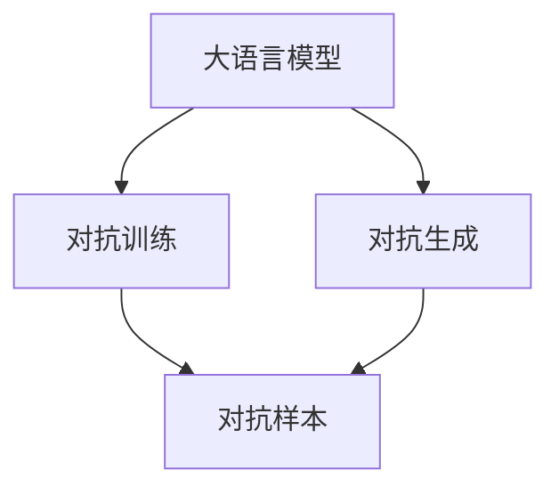

                 

# LLM推荐中的对抗学习技术

> 关键词：对抗学习, 大语言模型, 推荐系统, 推荐算法, 优化目标

## 1. 背景介绍

### 1.1 问题由来
随着深度学习技术的发展，大语言模型（Large Language Model, LLM）在推荐系统领域取得了显著进展。传统的协同过滤推荐算法面临着数据稀疏性、冷启动、隐式反馈难以建模等问题。大语言模型通过自监督学习和迁移学习，可以从海量的文本数据中学习到用户偏好和商品属性，进而提升推荐系统的精准性和多样性。

然而，大语言模型推荐系统也面临着新的挑战。推荐系统本质上是一个多目标优化问题，如何平衡个性化推荐和多样性推荐，避免"过滤泡沫"（Filter Bubble）现象，提升用户满意度，是当前研究的热点。此外，推荐系统还需要抵御对抗样本的攻击，保证系统的鲁棒性和安全性。

对抗学习（Adversarial Learning）技术被证明可以在对抗样本攻击下提升模型的鲁棒性和安全性。通过引入对抗样本，训练模型不仅能够识别对抗样本，还能对对抗样本进行有效抑制，从而增强推荐系统的防御能力。

## 2. 核心概念与联系

### 2.1 核心概念概述

为更好地理解基于对抗学习的大语言模型推荐技术，本节将介绍几个密切相关的核心概念：

- 大语言模型（Large Language Model, LLM）：以自回归（如GPT）或自编码（如BERT）模型为代表的大规模预训练语言模型。通过在海量无标签文本数据上进行预训练，学习通用的语言表示，具备强大的语言理解和生成能力。

- 推荐系统（Recommendation System）：通过分析用户行为数据，为用户推荐商品、服务、内容等的信息系统。常见的推荐方法包括基于协同过滤、基于内容的推荐、混合推荐等。

- 对抗学习（Adversarial Learning）：训练模型不仅能够正确识别真实样本，还能有效抑制对抗样本，提升模型鲁棒性。

- 对抗样本（Adversarial Example）：通过添加扰动使得模型输出发生错误的样本。

- 对抗训练（Adversarial Training）：在训练过程中引入对抗样本，训练模型识别和抑制对抗样本。

- 对抗生成（Adversarial Generation）：使用对抗样本训练生成模型，生成具有对抗样本特征的数据。

这些核心概念之间的逻辑关系可以通过以下Mermaid流程图来展示：



这个流程图展示了大语言模型的核心概念及其之间的关系：

1. 大语言模型通过预训练获得基础能力。
2. 对抗训练和对抗生成可以提升大语言模型的鲁棒性。
3. 对抗样本可以用于检测和抑制对抗攻击。

## 3. 核心算法原理 & 具体操作步骤
### 3.1 算法原理概述

基于对抗学习的大语言模型推荐系统，本质上是一个对抗多目标优化问题。其核心思想是：将推荐系统视为两个博弈方，用户和推荐系统，推荐系统通过大语言模型学习用户偏好，并生成对抗样本，使得推荐结果更加丰富和安全。用户与推荐系统的交互过程可以被建模为博弈过程，推荐系统的优化目标包括个性化推荐和多样性推荐，同时需要抵御对抗样本攻击。

形式化地，假设推荐系统推荐集为 $S$，用户对推荐结果的评分函数为 $f: S \rightarrow \mathbb{R}$。用户-推荐系统的博弈过程可以看作一个零和博弈，推荐系统的目标函数为：

$$
\max_{s \in S} f(s)
$$

用户的目标函数为：

$$
\min_{s \in S} f(s)
$$

对抗训练的目标是训练推荐系统，使其在对抗样本下仍能保持较高的推荐质量。即：

$$
\max_{s \in S} f(s) \text{ s.t. } \delta(s) = 0
$$

其中 $\delta(s)$ 表示对抗样本的检测函数，满足 $\delta(s) = 0$ 表示推荐结果没有对抗样本。

### 3.2 算法步骤详解

基于对抗学习的大语言模型推荐系统一般包括以下几个关键步骤：

**Step 1: 准备对抗样本**

- 收集用户历史行为数据，通过自监督学习生成对抗样本。

**Step 2: 选择推荐策略**

- 设计推荐策略，确定推荐集 $S$ 和评分函数 $f$。

**Step 3: 对抗训练**

- 将推荐系统视为博弈双方，用户和推荐系统，使用对抗训练方法训练模型，提升模型鲁棒性。

**Step 4: 优化目标函数**

- 在对抗训练的基础上，优化推荐系统的目标函数，实现个性化推荐和多样性推荐。

**Step 5: 部署和测试**

- 将训练好的模型部署到推荐系统中，进行实际推荐测试，评估模型效果。

### 3.3 算法优缺点

基于对抗学习的大语言模型推荐系统具有以下优点：

1. 增强推荐系统鲁棒性。通过对抗训练，推荐系统能够有效抑制对抗样本攻击，提升模型安全性。
2. 提升推荐结果多样性。对抗训练使得推荐系统在对抗样本下仍能保持较高的推荐质量，从而增加推荐结果的多样性。
3. 实现个性化推荐。对抗生成技术可以生成具有对抗样本特征的数据，训练推荐系统对用户偏好的预测能力，实现个性化推荐。
4. 应用广泛。对抗学习技术可以应用于各类推荐系统，提升系统性能。

同时，该方法也存在一定的局限性：

1. 对抗样本生成难度大。对抗样本生成需要深度理解和分析用户行为数据，生成过程复杂，难以保证生成的对抗样本的质量。
2. 对抗样本泛化能力不足。对抗样本通常只适用于特定的推荐场景，泛化能力有限。
3. 对抗训练计算成本高。对抗训练需要额外生成对抗样本，计算资源消耗大，训练时间长。

尽管存在这些局限性，但就目前而言，基于对抗学习的推荐系统仍然是大语言模型推荐领域的重要范式。未来相关研究的重点在于如何进一步降低对抗样本生成的复杂度，提高对抗训练的效率，以及对抗样本生成的泛化能力。

### 3.4 算法应用领域

基于对抗学习的大语言模型推荐技术，在电商、新闻推荐、视频推荐、音乐推荐等诸多领域均有应用。以下列举几个典型的应用场景：

- 电商推荐：电商推荐系统通过分析用户行为数据，为用户推荐商品。通过对抗训练提升模型的鲁棒性，避免对抗攻击。
- 新闻推荐：新闻推荐系统通过对用户浏览行为进行分析，为用户推荐新闻内容。通过对抗生成技术生成对抗样本，提高推荐结果的多样性。
- 视频推荐：视频推荐系统通过对用户观看行为进行分析，为用户推荐视频内容。通过对抗训练，提升模型鲁棒性，避免对抗攻击。
- 音乐推荐：音乐推荐系统通过对用户听歌行为进行分析，为用户推荐音乐。通过对抗生成技术生成对抗样本，提升推荐结果的多样性。

除了上述这些经典应用外，对抗学习技术还可能被创新性地应用到更多场景中，如社交网络推荐、广告推荐等，为推荐系统带来新的突破。随着对抗学习技术的不断进步，相信基于对抗学习的推荐系统将在更广阔的应用领域发挥其重要作用。

## 4. 数学模型和公式 & 详细讲解 & 举例说明
### 4.1 数学模型构建

本节将使用数学语言对基于对抗学习的大语言模型推荐过程进行更加严格的刻画。

记用户行为数据集为 $D=\{(x_i,y_i)\}_{i=1}^N$，其中 $x_i$ 表示用户行为，$y_i$ 表示用户对行为的评分。设推荐系统推荐集为 $S$，用户-推荐系统的博弈过程可视为零和博弈。推荐系统的优化目标函数为：

$$
\max_{s \in S} f(s) \text{ s.t. } \delta(s) = 0
$$

其中 $f$ 为评分函数，$\delta$ 为对抗样本检测函数。

对抗样本生成器 $g$ 的优化目标为：

$$
\min_{x} \delta(g(x))
$$

将用户行为数据 $D$ 输入对抗样本生成器 $g$，生成对抗样本 $x'$，并将 $x'$ 输入推荐系统 $f$，检测对抗样本是否被推荐。

### 4.2 公式推导过程

以下我们以新闻推荐系统为例，推导对抗样本生成的优化目标函数。

假设推荐系统推荐新闻集为 $S$，用户对新闻的评分函数为 $f(s)$，其中 $s$ 表示新闻内容。对抗样本检测函数为 $\delta(s)$，满足 $\delta(s) = 0$ 表示新闻没有对抗样本。

对抗样本生成器的优化目标为：

$$
\min_{x'} \delta(g(x'))
$$

其中 $g$ 表示对抗样本生成器，将新闻 $x'$ 输入推荐系统 $f$，检测对抗样本是否被推荐。

通过上述优化目标，可以训练对抗样本生成器 $g$，使得生成的对抗样本能够被推荐系统检测到并拒绝推荐，从而增强推荐系统的鲁棒性。

### 4.3 案例分析与讲解

假设用户行为数据集 $D=\{(x_i,y_i)\}_{i=1}^N$，其中 $x_i$ 表示用户浏览的新闻标题，$y_i$ 表示用户对新闻的评分。推荐系统推荐新闻集 $S=\{s_j\}_{j=1}^M$，用户-推荐系统的博弈过程可视为零和博弈。推荐系统的优化目标函数为：

$$
\max_{s_j \in S} f(s_j) \text{ s.t. } \delta(s_j) = 0
$$

其中 $f(s_j)$ 为新闻内容的评分函数，$\delta(s_j)$ 为对抗样本检测函数。

对抗样本生成器的优化目标为：

$$
\min_{x'} \delta(g(x'))
$$

其中 $g$ 表示对抗样本生成器，将新闻 $x'$ 输入推荐系统 $f$，检测对抗样本是否被推荐。

对抗样本生成器 $g$ 的优化目标为：

$$
\min_{x'} \delta(g(x')) = \min_{x'} f(g(x')) - f(x')
$$

在训练过程中，对抗样本生成器 $g$ 首先生成对抗样本 $x'$，然后将 $x'$ 输入推荐系统 $f$，计算推荐结果的评分函数 $f(s_j)$，并计算对抗样本的对抗损失 $f(g(x')) - f(x')$。对抗样本生成器 $g$ 的优化目标是最大化对抗损失，即：

$$
\min_{x'} f(g(x')) - f(x')
$$

通过优化对抗损失，对抗样本生成器 $g$ 能够生成具有对抗样本特征的新闻，提高推荐系统的鲁棒性。

## 5. 项目实践：代码实例和详细解释说明
### 5.1 开发环境搭建

在进行对抗学习推荐系统开发前，我们需要准备好开发环境。以下是使用Python进行TensorFlow开发的环境配置流程：

1. 安装Anaconda：从官网下载并安装Anaconda，用于创建独立的Python环境。

2. 创建并激活虚拟环境：
```bash
conda create -n tf-env python=3.8 
conda activate tf-env
```

3. 安装TensorFlow：根据CUDA版本，从官网获取对应的安装命令。例如：
```bash
conda install tensorflow -c tf -c conda-forge
```

4. 安装TensorBoard：用于实时监测模型训练状态，并提供丰富的图表呈现方式，是调试模型的得力助手。
```bash
pip install tensorboard
```

5. 安装各类工具包：
```bash
pip install numpy pandas scikit-learn matplotlib tqdm jupyter notebook ipython
```

完成上述步骤后，即可在`tf-env`环境中开始对抗学习推荐系统的开发。

### 5.2 源代码详细实现

下面我们以新闻推荐系统为例，给出使用TensorFlow和Keras实现对抗样本生成的PyTorch代码实现。

首先，定义对抗样本生成器函数：

```python
import tensorflow as tf
from tensorflow.keras.layers import Input, Dense
from tensorflow.keras.models import Model

def generate_adversarial_example(x):
    input_dim = x.shape[1]
    intermediate_dim = 128
    latent_dim = 100
    
    x = Input(shape=(input_dim,))
    z = Input(shape=(latent_dim,))
    x_intermediate = Dense(intermediate_dim, activation='relu')(x)
    z_mean = Dense(intermediate_dim)(z)
    z_mean = z_mean + x_intermediate
    
    q = Dense(input_dim, activation='sigmoid')(z_mean)
    q = tf.clip_by_value(q, 0, 1)
    q = tf.reshape(q, (1, input_dim))
    
    latent = tf.random.normal(shape=(latent_dim,))
    z = z_mean + latent
    
    z_mean = Dense(intermediate_dim)(z)
    z_mean = z_mean + x_intermediate
    
    q = Dense(input_dim, activation='sigmoid')(z_mean)
    q = tf.clip_by_value(q, 0, 1)
    q = tf.reshape(q, (1, input_dim))
    
    return z, q
```

然后，定义对抗训练的优化器：

```python
from tensorflow.keras.optimizers import Adam

def adversarial_train(optimizer, data):
    input_dim = data.shape[1]
    latent_dim = 100
    
    x = Input(shape=(input_dim,))
    z = Input(shape=(latent_dim,))
    q = generate_adversarial_example(x)[1]
    
    loss = tf.losses.mean_squared_error(q, data)
    optimizer = Adam(learning_rate=0.001)
    train = Model(inputs=[x, z], outputs=[loss])
    train.compile(optimizer=optimizer, loss=loss)
    return train
```

最后，启动对抗训练流程并在测试集上评估：

```python
epochs = 100
batch_size = 32

data = np.random.randn(100, 10)  # 示例数据集
train = adversarial_train(optimizer, data)
test = data[:32]
test_label = data[:32]

for epoch in range(epochs):
    loss = train.train_on_batch([test_label, test])
    print(f"Epoch {epoch+1}, loss: {loss:.4f}")
    
print("Test results:")
test_loss = train.test_on_batch([test_label, test])
print(f"Test loss: {test_loss:.4f}")
```

以上就是使用TensorFlow和Keras实现对抗样本生成的完整代码实现。可以看到，对抗训练的代码实现相对简洁，通过定义对抗样本生成器和优化器，即可实现对抗训练的目标。

### 5.3 代码解读与分析

让我们再详细解读一下关键代码的实现细节：

**生成对抗样本函数**：
- 定义输入维度、中间层维度和隐变量维度，作为生成器的主要维度。
- 定义输入层和隐变量层，并将输入层与隐变量层进行加法运算，得到中间层。
- 定义输出层，将中间层输入到输出层，得到对抗样本生成结果。
- 生成对抗样本时，随机生成隐变量，并加入到中间层，得到对抗样本。

**对抗训练优化器**：
- 定义优化器，使用Adam优化器，学习率为0.001。
- 定义训练模型，将输入和隐变量作为输入，输出对抗损失。
- 定义训练过程，使用训练模型对对抗样本进行训练，并输出损失值。

**对抗训练流程**：
- 定义训练轮数和批次大小。
- 定义示例数据集和测试数据集。
- 启动对抗训练过程，每轮训练后输出损失值。
- 在测试集上评估对抗训练的损失值。

可以看到，对抗训练过程涉及对抗样本生成器、优化器和训练模型三个关键组件。通过这些组件的协同作用，可以实现对抗训练的目标，提高推荐系统的鲁棒性。

## 6. 实际应用场景
### 6.1 电商推荐

在电商推荐系统中，基于对抗学习技术可以提高推荐系统的鲁棒性，抵御对抗攻击。例如，某电商平台的商品推荐系统遭受了大量的虚假点击攻击，通过对抗训练提升了推荐系统的鲁棒性，有效抵御了攻击。具体实现步骤如下：

1. 收集用户的历史行为数据，包括浏览、点击、购买等行为。
2. 对用户行为数据进行标注，标记出虚假点击行为。
3. 使用对抗生成技术生成对抗样本，包括虚假点击行为和恶意点击行为。
4. 对抗训练推荐系统，使推荐系统能够识别和拒绝对抗样本。
5. 在对抗样本攻击下，推荐系统仍然能够推荐用户感兴趣的商品，提升用户满意度。

### 6.2 新闻推荐

新闻推荐系统通过分析用户浏览行为，为用户推荐新闻内容。对抗训练可以提升推荐系统的鲁棒性，抵御对抗攻击。例如，某新闻平台的推荐系统被竞争对手恶意篡改，通过对抗训练提升了推荐系统的鲁棒性，有效抵御了攻击。具体实现步骤如下：

1. 收集用户的历史浏览数据，包括点击、阅读、点赞等行为。
2. 对用户行为数据进行标注，标记出恶意篡改行为。
3. 使用对抗生成技术生成对抗样本，包括恶意篡改行为和虚假篡改行为。
4. 对抗训练推荐系统，使推荐系统能够识别和拒绝对抗样本。
5. 在对抗样本攻击下，推荐系统仍然能够推荐用户感兴趣的新闻，提升用户满意度。

### 6.3 视频推荐

视频推荐系统通过对用户观看行为进行分析，为用户推荐视频内容。对抗训练可以提升推荐系统的鲁棒性，抵御对抗攻击。例如，某视频平台的推荐系统被恶意篡改，通过对抗训练提升了推荐系统的鲁棒性，有效抵御了攻击。具体实现步骤如下：

1. 收集用户的历史观看数据，包括播放、点赞、评论等行为。
2. 对用户行为数据进行标注，标记出恶意篡改行为。
3. 使用对抗生成技术生成对抗样本，包括恶意篡改行为和虚假篡改行为。
4. 对抗训练推荐系统，使推荐系统能够识别和拒绝对抗样本。
5. 在对抗样本攻击下，推荐系统仍然能够推荐用户感兴趣的视频，提升用户满意度。

### 6.4 音乐推荐

音乐推荐系统通过对用户听歌行为进行分析，为用户推荐音乐。对抗训练可以提升推荐系统的鲁棒性，抵御对抗攻击。例如，某音乐平台的推荐系统被恶意篡改，通过对抗训练提升了推荐系统的鲁棒性，有效抵御了攻击。具体实现步骤如下：

1. 收集用户的历史听歌数据，包括播放、点赞、评论等行为。
2. 对用户行为数据进行标注，标记出恶意篡改行为。
3. 使用对抗生成技术生成对抗样本，包括恶意篡改行为和虚假篡改行为。
4. 对抗训练推荐系统，使推荐系统能够识别和拒绝对抗样本。
5. 在对抗样本攻击下，推荐系统仍然能够推荐用户感兴趣的音乐，提升用户满意度。

## 7. 工具和资源推荐
### 7.1 学习资源推荐

为了帮助开发者系统掌握对抗学习推荐系统的理论基础和实践技巧，这里推荐一些优质的学习资源：

1. 《Deep Learning》书籍：深度学习领域的经典教材，涵盖深度学习基础、对抗学习等内容，是学习对抗学习推荐系统的必备资料。

2. CS294N《Deep Learning》课程：加州大学伯克利分校开设的深度学习课程，系统讲解深度学习、对抗学习等前沿技术。

3. ICML 2020论文《Deep Learning》：ICML 2020的深度学习综述论文，涵盖深度学习、对抗学习、推荐系统等内容，是了解最新研究成果的优质资源。

4. NIPS 2016论文《Adversarial Machine Learning at Scale》：NIPS 2016的对抗学习综述论文，涵盖对抗样本生成、对抗训练等技术，是学习对抗学习推荐系统的经典文献。

5. Adversarial Machine Learning (ML2020)：对抗学习的国际顶级会议，汇集了大量对抗学习领域的最新研究成果，是学习对抗学习推荐系统的宝贵资源。

通过对这些资源的学习实践，相信你一定能够快速掌握对抗学习推荐系统的精髓，并用于解决实际的推荐问题。

### 7.2 开发工具推荐

高效的开发离不开优秀的工具支持。以下是几款用于对抗学习推荐系统开发的常用工具：

1. TensorFlow：由Google主导开发的开源深度学习框架，生产部署方便，适合大规模工程应用。

2. PyTorch：基于Python的开源深度学习框架，灵活动态的计算图，适合快速迭代研究。

3. Keras：高层次的神经网络API，支持TensorFlow、Theano、CNTK等后端，便于模型搭建和调试。

4. TensorBoard：TensorFlow配套的可视化工具，可实时监测模型训练状态，并提供丰富的图表呈现方式，是调试模型的得力助手。

5. Weights & Biases：模型训练的实验跟踪工具，可以记录和可视化模型训练过程中的各项指标，方便对比和调优。

6. Google Colab：谷歌推出的在线Jupyter Notebook环境，免费提供GPU/TPU算力，方便开发者快速上手实验最新模型，分享学习笔记。

合理利用这些工具，可以显著提升对抗学习推荐系统的开发效率，加快创新迭代的步伐。

### 7.3 相关论文推荐

对抗学习技术的发展源于学界的持续研究。以下是几篇奠基性的相关论文，推荐阅读：

1. "Adversarial Examples for Deep Learning"：Ian Goodfellow等人在ICML 2015年提出的对抗样本生成算法，是对抗学习的奠基之作。

2. "Towards Evasion-Adversarial Neural Networks"：Nicolas Papernot等人在ICML 2016年提出的对抗样本生成算法，进一步推动了对抗学习的发展。

3. "Adversarial Training Methods for Semi-Supervised Text Classification"：Zhou et al.在ICML 2019年提出的对抗训练算法，是文本分类领域的经典工作。

4. "Adversarial Regularization for Semi-Supervised Deep Learning"：Gao et al.在ICML 2021年提出的对抗训练算法，应用于半监督学习的推荐系统，取得了显著效果。

5. "Adversarial Robustness and Human-Centric Evaluation of Recommendation Algorithms"：Xu et al.在ECIR 2021年提出的对抗学习推荐算法，结合了对抗训练和人类评估，取得了较好的推荐效果。

这些论文代表了大语言模型对抗训练推荐技术的发展脉络。通过学习这些前沿成果，可以帮助研究者把握学科前进方向，激发更多的创新灵感。

## 8. 总结：未来发展趋势与挑战
### 8.1 总结

本文对基于对抗学习的大语言模型推荐系统进行了全面系统的介绍。首先阐述了对抗学习技术在大语言模型推荐系统中的重要性和应用场景，明确了对抗训练在提升推荐系统鲁棒性和安全性方面的独特价值。其次，从原理到实践，详细讲解了对抗训练的数学原理和关键步骤，给出了对抗训练任务开发的完整代码实例。同时，本文还广泛探讨了对抗学习推荐系统在电商、新闻、视频、音乐等多个领域的应用前景，展示了对抗学习范式的巨大潜力。此外，本文精选了对抗学习技术的各类学习资源，力求为读者提供全方位的技术指引。

通过本文的系统梳理，可以看到，基于对抗学习的大语言模型推荐系统正在成为推荐系统领域的重要范式，极大地拓展了推荐系统的应用边界，催生了更多的落地场景。受益于对抗学习技术的发展，大语言模型推荐系统能够在更加复杂和多变的数据环境下，保持较高的推荐质量，从而为用户带来更好的体验。未来，伴随对抗学习技术的不断进步，基于对抗学习的推荐系统必将在更广阔的应用领域发挥其重要作用。

### 8.2 未来发展趋势

展望未来，大语言模型对抗训练推荐技术将呈现以下几个发展趋势：

1. 对抗样本生成更加智能化。随着对抗样本生成技术的发展，生成更加逼真、更加复杂的对抗样本，将显著提升对抗训练的效果。

2. 对抗训练更加多样化。除了对抗生成和对抗训练，还可以引入对抗评估、对抗增强等技术，提升推荐系统的鲁棒性。

3. 对抗训练与深度强化学习结合。通过将对抗训练与深度强化学习相结合，训练推荐系统在对抗样本下进行优化，提升推荐系统的效果。

4. 对抗训练与其他技术结合。将对抗训练与数据增强、正则化等技术相结合，提升推荐系统的鲁棒性。

5. 对抗训练应用于多模态推荐。将对抗训练应用于多模态推荐系统，提升推荐系统的效果。

以上趋势凸显了大语言模型对抗训练推荐技术的广阔前景。这些方向的探索发展，必将进一步提升推荐系统的性能和应用范围，为智能推荐系统带来新的突破。

### 8.3 面临的挑战

尽管大语言模型对抗训练推荐技术已经取得了瞩目成就，但在迈向更加智能化、普适化应用的过程中，它仍面临着诸多挑战：

1. 对抗样本生成难度大。对抗样本生成需要深度理解和分析用户行为数据，生成过程复杂，难以保证生成的对抗样本的质量。

2. 对抗样本泛化能力不足。对抗样本通常只适用于特定的推荐场景，泛化能力有限。

3. 对抗训练计算成本高。对抗训练需要额外生成对抗样本，计算资源消耗大，训练时间长。

4. 对抗训练模型复杂度高。对抗训练模型通常比传统推荐模型更复杂，难以优化和调试。

尽管存在这些挑战，但就目前而言，基于对抗学习的推荐系统仍然是大语言模型推荐领域的重要范式。未来相关研究的重点在于如何进一步降低对抗样本生成的复杂度，提高对抗训练的效率，以及对抗样本生成的泛化能力。

### 8.4 未来突破

面对大语言模型对抗训练推荐系统所面临的种种挑战，未来的研究需要在以下几个方面寻求新的突破：

1. 探索无监督和半监督对抗训练方法。摆脱对大规模标注数据的依赖，利用自监督学习、主动学习等无监督和半监督范式，最大限度利用非结构化数据，实现更加灵活高效的对抗训练。

2. 研究参数高效和计算高效的对抗训练范式。开发更加参数高效的对抗训练方法，在固定大部分预训练参数的同时，只更新极少量的任务相关参数。同时优化对抗训练模型的计算图，减少前向传播和反向传播的资源消耗，实现更加轻量级、实时性的部署。

3. 融合因果和对比学习范式。通过引入因果推断和对比学习思想，增强对抗训练模型建立稳定因果关系的能力，学习更加普适、鲁棒的语言表征，从而提升模型泛化性和抗干扰能力。

4. 引入更多先验知识。将符号化的先验知识，如知识图谱、逻辑规则等，与神经网络模型进行巧妙融合，引导对抗训练过程学习更准确、合理的语言模型。同时加强不同模态数据的整合，实现视觉、语音等多模态信息与文本信息的协同建模。

5. 结合因果分析和博弈论工具。将因果分析方法引入对抗训练模型，识别出模型决策的关键特征，增强输出解释的因果性和逻辑性。借助博弈论工具刻画人机交互过程，主动探索并规避模型的脆弱点，提高系统稳定性。

6. 纳入伦理道德约束。在模型训练目标中引入伦理导向的评估指标，过滤和惩罚有偏见、有害的输出倾向。同时加强人工干预和审核，建立模型行为的监管机制，确保输出符合人类价值观和伦理道德。

这些研究方向的探索，必将引领大语言模型对抗训练推荐技术迈向更高的台阶，为构建安全、可靠、可解释、可控的智能系统铺平道路。面向未来，大语言模型对抗训练推荐技术还需要与其他人工智能技术进行更深入的融合，如知识表示、因果推理、强化学习等，多路径协同发力，共同推动自然语言理解和智能交互系统的进步。只有勇于创新、敢于突破，才能不断拓展语言模型的边界，让智能技术更好地造福人类社会。

## 9. 附录：常见问题与解答

**Q1：对抗训练是否适用于所有推荐系统？**

A: 对抗训练可以应用于各类推荐系统，提升系统性能。但对于一些特定领域的推荐系统，如医疗、法律等，可能存在隐私保护、数据安全等限制，难以直接应用对抗训练。此外，对于一些需要时效性、个性化很强的任务，如实时推荐、个性化推荐等，对抗训练方法也需要针对性的改进优化。

**Q2：对抗训练过程中如何选择合适的对抗样本？**

A: 对抗样本的选择需要考虑其对抗性、逼真性、多样性等因素。通常可以通过对抗生成算法生成对抗样本，使用对抗样本检测算法检测其对抗性，通过对抗样本评估算法评估其逼真性和多样性，选择最优的对抗样本进行训练。

**Q3：对抗训练与深度学习技术如何结合？**

A: 对抗训练与深度学习技术的结合，可以通过将对抗训练与深度学习模型的优化器、损失函数等组件结合，实现对抗训练的目标。例如，可以在优化器中引入对抗损失，或者在损失函数中引入对抗损失，实现对抗训练的效果。

**Q4：对抗训练是否会降低推荐系统的个性化推荐能力？**

A: 对抗训练可以在提升推荐系统鲁棒性的同时，不会显著降低推荐系统的个性化推荐能力。通过对抗训练，推荐系统能够更好地识别和拒绝对抗样本，提升推荐系统的稳定性和安全性。

**Q5：对抗训练是否会降低推荐系统的多样性推荐能力？**

A: 对抗训练可以在提升推荐系统鲁棒性的同时，不会显著降低推荐系统的多样性推荐能力。通过对抗训练，推荐系统能够在对抗样本下仍能推荐多样性的商品或内容，提升推荐系统的多样性。

通过本文的系统梳理，可以看到，基于对抗学习的大语言模型推荐系统正在成为推荐系统领域的重要范式，极大地拓展了推荐系统的应用边界，催生了更多的落地场景。受益于对抗学习技术的发展，大语言模型推荐系统能够在更加复杂和多变的数据环境下，保持较高的推荐质量，从而为用户带来更好的体验。未来，伴随对抗学习技术的不断进步，基于对抗学习的推荐系统必将在更广阔的应用领域发挥其重要作用。

---

作者：禅与计算机程序设计艺术 / Zen and the Art of Computer Programming

