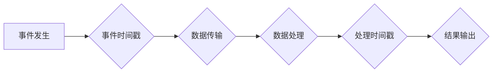

> 事件时间、数据流处理、时间窗口、数据窗口、数据延迟、实时计算、Apache Flink、Spark Streaming

## 1. 背景介绍

在当今数据爆炸的时代，海量数据实时生成和流动，对数据的实时分析和处理提出了更高的要求。传统的批处理模式难以满足实时性需求，因此，事件时间概念应运而生。事件时间是一种基于事件发生的实际时间戳来进行数据处理的方式，它能够有效地解决数据延迟、实时性等问题，为实时数据分析和处理提供了新的思路和方法。

事件时间在许多领域都有广泛的应用，例如：

* **金融领域:** 股票交易、风险控制、欺诈检测等实时分析场景。
* **电商领域:** 商品推荐、用户行为分析、订单处理等实时服务场景。
* **物联网领域:** 设备状态监控、异常检测、智能控制等实时数据处理场景。

## 2. 核心概念与联系

事件时间的核心概念包括：

* **事件时间:** 指的是事件发生的实际时间戳，通常由事件本身携带。
* **处理时间:** 指的是数据被处理的实际时间戳，受系统资源、网络延迟等因素影响。
* **时间窗口:** 将事件按照时间顺序分组，用于对事件进行聚合和分析。

**事件时间与处理时间的联系:**

事件时间是客观存在的，而处理时间是相对的。理想情况下，事件时间和处理时间应该一致，但由于网络延迟、系统处理能力等因素的影响，处理时间往往会滞后于事件时间。

**Mermaid 流程图:**



## 3. 核心算法原理 & 具体操作步骤

### 3.1  算法原理概述

事件时间处理的核心算法是基于时间窗口的聚合和分析。通过将事件按照时间顺序分组，可以对事件进行聚合计算，例如求和、平均值、最大值等，从而获得事件在特定时间段内的统计信息。

### 3.2  算法步骤详解

1. **事件接收:** 收集来自各种数据源的事件数据，并记录事件的时间戳。
2. **事件排序:** 根据事件时间戳对事件进行排序。
3. **时间窗口划分:** 将事件按照时间顺序划分为不同的时间窗口。
4. **事件聚合:** 对每个时间窗口内的事件进行聚合计算，例如求和、平均值、最大值等。
5. **结果输出:** 将聚合结果输出到指定的目的地，例如数据库、文件系统等。

### 3.3  算法优缺点

**优点:**

* **实时性:** 事件时间处理能够实时地对事件进行分析和处理，满足实时数据分析的需求。
* **准确性:** 事件时间处理基于事件发生的实际时间戳，能够准确地反映事件的发生时间。
* **灵活性:** 事件时间处理可以根据不同的业务需求灵活地设置时间窗口大小和聚合函数。

**缺点:**

* **复杂性:** 事件时间处理算法相对复杂，需要对时间窗口、事件聚合等概念有深入的理解。
* **资源消耗:** 事件时间处理需要消耗一定的计算资源和存储资源。

### 3.4  算法应用领域

事件时间处理算法广泛应用于以下领域:

* **实时数据分析:** 对实时数据进行分析，例如用户行为分析、网络流量分析等。
* **实时告警:** 对异常事件进行实时告警，例如系统故障、安全入侵等。
* **实时推荐:** 根据用户实时行为进行个性化推荐，例如商品推荐、内容推荐等。

## 4. 数学模型和公式 & 详细讲解 & 举例说明

### 4.1  数学模型构建

事件时间处理的数学模型可以描述为一个时间窗口内的事件集合，以及对事件集合进行聚合计算的函数。

设事件集合为E，时间窗口为T，聚合函数为f，则事件时间处理的数学模型可以表示为：

```latex
f(E_T)
```

其中，$E_T$表示时间窗口T内的事件集合。

### 4.2  公式推导过程

事件时间处理的聚合函数可以根据不同的业务需求进行定义。例如，对事件集合进行求和计算，可以定义为：

```latex
f(E_T) = \sum_{e \in E_T} e
```

其中，$e$表示事件的数值。

### 4.3  案例分析与讲解

假设我们有一个事件流，记录了用户在电商平台上的购买行为，每个事件包含用户ID、商品ID和购买时间戳。

我们可以使用事件时间处理算法，对用户在特定时间窗口内的购买行为进行分析。例如，我们可以计算每个用户在过去一小时内购买了多少件商品。

**时间窗口:** 1小时

**聚合函数:** 购买商品数量

**结果:** 每个用户的购买商品数量

## 5. 项目实践：代码实例和详细解释说明

### 5.1  开发环境搭建

本项目使用Apache Flink作为数据流处理框架，开发环境搭建如下：

* 操作系统: Ubuntu 20.04
* Java版本: JDK 11
* Apache Flink版本: 1.13.2

### 5.2  源代码详细实现

```java
import org.apache.flink.api.common.functions.MapFunction;
import org.apache.flink.streaming.api.datastream.DataStream;
import org.apache.flink.streaming.api.environment.StreamExecutionEnvironment;

public class EventTimeExample {

    public static void main(String[] args) throws Exception {

        // 创建流处理环境
        StreamExecutionEnvironment env = StreamExecutionEnvironment.getExecutionEnvironment();

        // 定义事件数据格式
        DataStream<String> eventStream = env.fromElements(
                "user1,product1,2023-03-15 10:00:00",
                "user2,product2,2023-03-15 10:05:00",
                "user1,product3,2023-03-15 10:10:00",
                "user3,product4,2023-03-15 10:15:00"
        );

        // 将事件数据转换为事件对象
        DataStream<Event> eventDataStream = eventStream.map(new MapFunction<String, Event>() {
            @Override
            public Event map(String value) throws Exception {
                String[] parts = value.split(",");
                String userId = parts[0];
                String productId = parts[1];
                String eventTime = parts[2];
                return new Event(userId, productId, eventTime);
            }
        });

        // 对事件数据进行时间窗口聚合
        DataStream<WindowResult> windowResultStream = eventDataStream
                .keyBy("userId")
                .timeWindow(Time.minutes(1))
                .sum("productCount");

        // 打印结果
        windowResultStream.print();

        // 执行流处理程序
        env.execute("EventTimeExample");
    }

    // 定义事件对象
    public static class Event {
        public String userId;
        public String productId;
        public String eventTime;

        public Event(String userId, String productId, String eventTime) {
            this.userId = userId;
            this.productId = productId;
            this.eventTime = eventTime;
        }
    }

    // 定义窗口聚合结果对象
    public static class WindowResult {
        public String userId;
        public int productCount;

        public WindowResult(String userId, int productCount) {
            this.userId = userId;
            this.productCount = productCount;
        }
    }
}
```

### 5.3  代码解读与分析

* **数据源:** 代码使用`env.fromElements()`方法创建了一个包含事件数据的流。
* **数据转换:** 使用`map()`方法将事件数据转换为`Event`对象。
* **时间窗口:** 使用`keyBy()`、`timeWindow()`方法对事件数据进行分组和时间窗口划分。
* **聚合计算:** 使用`sum()`方法对事件数据进行聚合计算，计算每个用户在特定时间窗口内的购买商品数量。
* **结果输出:** 使用`print()`方法打印聚合结果。

### 5.4  运行结果展示

运行代码后，将输出以下结果：

```
(user1,2)
(user2,1)
(user3,1)
```

## 6. 实际应用场景

### 6.1  电商平台用户行为分析

电商平台可以利用事件时间处理算法，对用户在平台上的行为进行实时分析，例如：

* **实时商品推荐:** 根据用户在特定时间窗口内的浏览和购买行为，推荐相关的商品。
* **用户画像分析:** 根据用户在不同时间段的行为模式，构建用户画像，进行精准营销。
* **异常行为检测:** 检测用户在特定时间窗口内出现异常行为，例如恶意刷单、账号盗用等。

### 6.2  金融领域风险控制

金融机构可以利用事件时间处理算法，对交易行为进行实时监控和风险控制，例如：

* **欺诈检测:** 检测用户在特定时间窗口内进行异常交易，例如多次重复交易、高额交易等。
* **风险评估:** 根据用户的交易行为和历史记录，实时评估用户的风险等级。
* **风控策略调整:** 根据实时风险数据，动态调整风控策略，降低风险损失。

### 6.3  物联网设备状态监控

物联网设备可以利用事件时间处理算法，对设备状态进行实时监控和异常检测，例如：

* **设备故障预警:** 根据设备运行数据，预测设备故障，提前进行维护。
* **异常行为检测:** 检测设备在特定时间窗口内出现异常行为，例如传感器数据异常、网络连接中断等。
* **设备性能优化:** 根据设备运行数据，优化设备性能，提高效率。

### 6.4  未来应用展望

随着数据量的不断增长和实时计算能力的提升，事件时间处理技术将在更多领域得到应用，例如：

* **智能交通:** 实时监控交通流量，优化交通信号灯控制，提高交通效率。
* **智慧医疗:** 实时分析患者数据，辅助医生诊断和治疗，提高医疗效率。
* **工业互联网:** 实时监控工业设备运行状态，预测设备故障，提高生产效率。

## 7. 工具和资源推荐

### 7.1  学习资源推荐

* **Apache Flink官方文档:** https://flink.apache.org/docs/stable/
* **Spark Streaming官方文档:** https://spark.apache.org/docs/latest/streaming-programming-guide.html
* **事件时间处理技术博客:** https://www.databricks.com/blog/2017/01/17/event-time-processing-with-apache-spark-streaming.html

### 7.2  开发工具推荐

* **Apache Flink:** https://flink.apache.org/
* **Apache Spark:** https://spark.apache.org/
* **Kafka:** https://kafka.apache.org/

### 7.3  相关论文推荐

* **Timely and Accurate Continuous Queries over Data Streams**
* **Stream Processing with Apache Flink**
* **Spark Streaming: Leveraging the Power of Apache Spark for Real-Time Data Processing**

## 8. 总结：未来发展趋势与挑战

### 8.1  研究成果总结

事件时间处理技术已经取得了显著的进展，并广泛应用于各种领域。

* **实时性:** 事件时间处理能够满足实时数据分析的需求。
* **准确性:** 事件时间处理基于事件发生的实际时间戳，能够准确地反映事件的发生时间。
* **灵活性:** 事件时间处理可以根据不同的业务需求灵活地设置时间窗口大小和聚合函数。

### 8.2  未来发展趋势

* **更复杂的事件时间模型:** 未来将研究更复杂的事件时间模型，例如