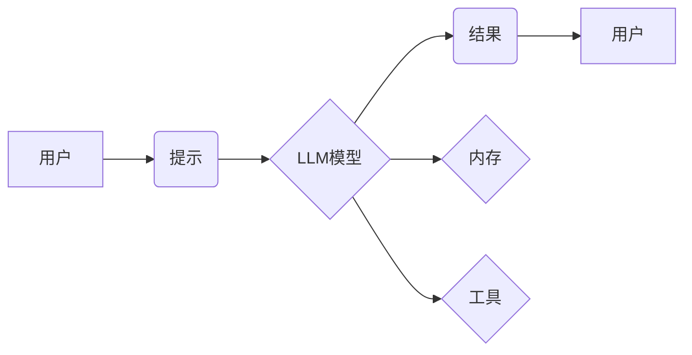

> LangChain, 语言模型, 应用开发, 编程框架, AI, 自然语言处理, 聊天机器人

## 1. 背景介绍

近年来，大型语言模型（LLM）的快速发展，如GPT-3、LaMDA等，为自然语言处理（NLP）领域带来了革命性的变革。这些模型展现出惊人的文本生成、翻译、摘要等能力，为我们提供了无限的可能性。然而，直接使用LLM往往需要复杂的代码编写和模型调优，对于普通开发者来说门槛较高。

为了降低LLM应用的门槛，并更好地帮助开发者利用LLM构建更强大的应用，LangChain应运而生。LangChain是一个开源的框架，旨在简化LLM的开发和部署，提供了一套完整的工具和组件，帮助开发者构建各种基于LLM的应用，例如聊天机器人、问答系统、文本摘要工具等。

## 2. 核心概念与联系

LangChain的核心概念围绕着“链式调用”展开，它将LLM与其他工具和数据源连接起来，形成一个完整的应用流程。

**核心组件：**

* **模型（Model）：** LangChain支持多种LLM模型，包括OpenAI的GPT系列、HuggingFace的各种模型等。
* **提示（Prompt）：** 这是与LLM交互的关键，通过精心设计的提示，可以引导LLM生成更准确、更有针对性的结果。LangChain提供了一系列提示模板和工具，帮助开发者构建有效的提示。
* **链（Chain）：** 这是LangChain的核心概念，它将多个组件连接起来，形成一个完整的应用流程。例如，一个聊天机器人可以由一个LLM模型、一个提示模板、一个对话管理组件等组成。
* **内存（Memory）：** 为了让LLM能够记住之前的对话内容，LangChain提供了内存组件，可以存储对话历史，并将其传递给LLM，从而实现更自然的对话体验。
* **工具（Tool）：** LangChain支持连接外部工具，例如搜索引擎、数据库等，让LLM能够访问更多信息，并完成更复杂的任务。

**架构图：**



## 3. 核心算法原理 & 具体操作步骤

### 3.1  算法原理概述

LangChain的核心算法原理是基于**链式调用**和**提示工程**。

* **链式调用:** 将多个组件连接起来，形成一个完整的应用流程。每个组件负责特定的任务，例如获取用户输入、生成提示、调用LLM模型、处理结果等。
* **提示工程:** 通过精心设计提示，引导LLM生成更准确、更有针对性的结果。提示工程是一个迭代的过程，需要不断测试和优化提示，才能获得最佳效果。

### 3.2  算法步骤详解

1. **定义应用场景:** 首先需要明确应用场景，例如聊天机器人、问答系统、文本摘要工具等。
2. **选择合适的LLM模型:** 根据应用场景选择合适的LLM模型，例如GPT-3、LaMDA等。
3. **设计提示模板:** 根据应用场景设计合适的提示模板，引导LLM生成期望的结果。
4. **构建链式调用流程:** 将LLM模型、提示模板、内存组件、工具等组件连接起来，形成一个完整的应用流程。
5. **测试和优化:** 测试应用效果，并根据实际情况优化提示模板、链式调用流程等。

### 3.3  算法优缺点

**优点:**

* **降低开发门槛:** LangChain提供了一套完整的工具和组件，简化了LLM的开发和部署。
* **灵活性和可扩展性:** LangChain支持多种LLM模型和工具，可以根据实际需求灵活配置和扩展。
* **社区支持:** LangChain是一个开源项目，拥有活跃的社区支持，可以获得丰富的学习资源和技术帮助。

**缺点:**

* **性能瓶颈:** 由于LLM模型本身的计算量较大，在实际应用中可能会遇到性能瓶颈。
* **数据安全问题:** 使用LLM模型需要处理大量用户数据，需要做好数据安全方面的防护措施。

### 3.4  算法应用领域

LangChain的应用领域非常广泛，例如：

* **聊天机器人:** 开发更智能、更自然的聊天机器人。
* **问答系统:** 建立知识问答系统，提供更准确、更全面的信息查询。
* **文本摘要:** 自动生成文本摘要，提高信息获取效率。
* **代码生成:** 根据自然语言描述生成代码，提高开发效率。
* **内容创作:** 辅助内容创作，例如生成文章、故事、诗歌等。

## 4. 数学模型和公式 & 详细讲解 & 举例说明

LangChain的核心算法原理虽然并不依赖复杂的数学模型，但它在设计提示模板和优化链式调用流程时，会用到一些数学和统计学知识。

### 4.1  数学模型构建

LangChain在设计提示模板时，会利用**信息论**和**语言模型概率**等概念，构建一个数学模型来评估提示的有效性。

例如，在设计一个问答系统的提示模板时，可以利用信息论中的**互信息**来衡量提示和答案之间的相关性。

### 4.2  公式推导过程

假设我们有一个问答系统，用户输入一个问题，LLM模型需要生成一个答案。

* **提示:**  "根据以下信息，回答问题： [问题上下文] [问题]"
* **答案:**  [LLM生成的答案]

我们可以用互信息来衡量提示和答案之间的相关性：

$$I(P;A) = \sum_{p \in P} \sum_{a \in A} p(p,a) \log \frac{p(p,a)}{p(p)p(a)}$$

其中：

* $P$ 是提示集合
* $A$ 是答案集合
* $p(p,a)$ 是提示 $p$ 和答案 $a$ 同时出现的概率
* $p(p)$ 是提示 $p$ 出现的概率
* $p(a)$ 是答案 $a$ 出现的概率

互信息越大，提示和答案之间的相关性就越强。

### 4.3  案例分析与讲解

在实际应用中，我们可以通过调整提示模板，并计算互信息来优化提示的有效性。例如，我们可以尝试添加更多上下文信息到提示中，或者改变提示的语气和风格，来提高LLM模型生成答案的准确率。

## 5. 项目实践：代码实例和详细解释说明

### 5.1  开发环境搭建

为了使用LangChain，我们需要先搭建开发环境。

1. 安装Python：确保你的系统安装了Python 3.7 或更高版本。
2. 安装LangChain：使用pip安装LangChain：

```bash
pip install langchain
```

3. 安装其他依赖：根据你的应用场景，可能需要安装其他依赖，例如OpenAI API库、HuggingFace Transformers库等。

### 5.2  源代码详细实现

以下是一个简单的LangChain代码示例，演示如何使用GPT-3模型生成文本：

```python
from langchain.llms import OpenAI
from langchain.prompts import PromptTemplate

# 初始化OpenAI模型
llm = OpenAI(temperature=0.7)

# 定义提示模板
template = """
根据以下信息，写一篇关于[主题]的文章：

[上下文信息]

"""

# 创建PromptTemplate对象
prompt = PromptTemplate(
    input_variables=["主题", "上下文信息"],
    template=template,
)

# 设置主题和上下文信息
topic = "人工智能"
context = "人工智能是一种利用计算机模拟人类智能的学科。"

# 生成文本
response = llm(prompt.format(主题=topic, 上下文信息=context))

# 打印结果
print(response)
```

### 5.3  代码解读与分析

* **初始化LLM模型:** 使用OpenAI类初始化GPT-3模型，并设置温度参数来控制模型的随机性。
* **定义提示模板:** 使用PromptTemplate类定义一个提示模板，包含主题和上下文信息变量。
* **创建PromptTemplate对象:** 将提示模板对象传递给PromptTemplate类，创建PromptTemplate对象。
* **设置主题和上下文信息:** 设置主题和上下文信息变量，并将其传递给PromptTemplate对象。
* **生成文本:** 使用LLM模型调用PromptTemplate对象，生成关于主题的文章。
* **打印结果:** 打印生成的文本。

### 5.4  运行结果展示

运行以上代码，将会生成一篇关于人工智能的文章，内容包含主题和上下文信息。

## 6. 实际应用场景

LangChain在实际应用场景中展现出强大的潜力，例如：

### 6.1  聊天机器人

使用LangChain可以构建更智能、更自然的聊天机器人，例如客服机器人、陪伴机器人等。

### 6.2  问答系统

LangChain可以帮助构建知识问答系统，例如FAQ系统、搜索引擎等。

### 6.3  文本摘要

LangChain可以自动生成文本摘要，提高信息获取效率。

### 6.4  未来应用展望

随着LLM技术的不断发展，LangChain的应用场景将会更加广泛，例如：

* **代码生成:** 根据自然语言描述生成代码，提高开发效率。
* **内容创作:** 辅助内容创作，例如生成文章、故事、诗歌等。
* **个性化学习:** 根据用户的学习风格和需求，提供个性化的学习内容和辅导。

## 7. 工具和资源推荐

### 7.1  学习资源推荐

* **LangChain官方文档:** https://python.langchain.com/docs/
* **LangChain GitHub仓库:** https://github.com/langchain-org/langchain
* **HuggingFace Transformers库:** https://huggingface.co/docs/transformers/index

### 7.2  开发工具推荐

* **VS Code:** https://code.visualstudio.com/
* **PyCharm:** https://www.jetbrains.com/pycharm/

### 7.3  相关论文推荐

* **Attention Is All You Need:** https://arxiv.org/abs/1706.03762
* **BERT: Pre-training of Deep Bidirectional Transformers for Language Understanding:** https://arxiv.org/abs/1810.04805

## 8. 总结：未来发展趋势与挑战

### 8.1  研究成果总结

LangChain为LLM的应用开发提供了强大的工具和框架，降低了开发门槛，并促进了LLM技术的普及和应用。

### 8.2  未来发展趋势

未来，LangChain将会朝着以下方向发展：

* **更强大的模型支持:** 支持更多类型的LLM模型，例如多模态模型、代码生成模型等。
* **更丰富的组件库:** 提供更多类型的组件，例如数据库连接器、搜索引擎连接器等。
* **更易于使用的API:** 提供更易于使用的API，方便开发者快速集成LangChain到自己的应用中。

### 8.3  面临的挑战

LangChain也面临着一些挑战，例如：

* **模型性能瓶颈:** 由于LLM模型本身的计算量较大，在实际应用中可能会遇到性能瓶颈。
* **数据安全问题:** 使用LLM模型需要处理大量用户数据，需要做好数据安全方面的防护措施。
* **伦理问题:** LLM模型可能会生成带有偏见或不准确的信息，需要关注LLM模型的伦理问题。

### 8.4  研究展望

未来，我们需要继续研究如何提高LLM模型的性能、安全性、可靠性和伦理性，并将其应用于更多领域，为人类社会带来更多价值。

## 9. 附录：常见问题与解答

**Q1: 如何选择合适的LLM模型？**

A1: 选择合适的LLM模型取决于你的应用场景和需求。例如，如果需要生成高质量的文本，可以选择GPT-3等强大的文本生成模型；如果需要进行代码生成，可以选择Codex等专门的代码生成模型。

**Q2: 如何优化提示模板？**

A2: 可以通过以下方法优化提示模板：

* 添加更多上下文信息
* 改变