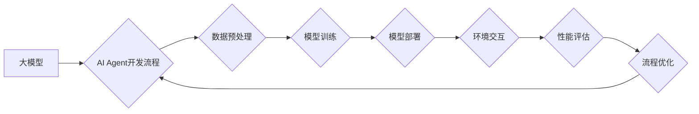

> 大模型、AI Agent、流程自动化、资源优化、开发实践、数学模型、代码实例

## 1. 背景介绍

近年来，大模型技术蓬勃发展，其强大的泛化能力和知识表示能力为人工智能领域带来了革命性的变革。大模型的应用场景日益广泛，涵盖自然语言处理、计算机视觉、语音识别等多个领域。其中，AI Agent作为大模型的应用场景之一，展现出巨大的潜力。

AI Agent是指能够感知环境、做出决策并与环境交互的智能体。它可以自动执行任务、学习和适应环境变化，从而提高效率和智能化水平。大模型的应用为AI Agent的开发提供了强大的技术支撑。

然而，大模型应用开发也面临着一些挑战，例如：

* **流程复杂性:** AI Agent的开发流程通常比较复杂，涉及多个环节，例如数据预处理、模型训练、模型部署等。
* **资源消耗:** 大模型训练和推理需要消耗大量的计算资源和时间。
* **可维护性:** 大模型的复杂性也导致其维护和更新难度较大。

为了解决这些挑战，我们需要探索大模型应用开发的自动化和资源优化方法。

## 2. 核心概念与联系

### 2.1 AI Agent

AI Agent是一种能够感知环境、做出决策并与环境交互的智能体。它可以自动执行任务、学习和适应环境变化，从而提高效率和智能化水平。

### 2.2 大模型

大模型是指参数量庞大、训练数据海量的人工智能模型。它具有强大的泛化能力和知识表示能力，能够在多个领域进行应用。

### 2.3 流程自动化

流程自动化是指通过自动化工具和技术，将人工重复性操作转化为自动执行的过程。

### 2.4 资源优化

资源优化是指在满足需求的前提下，尽可能有效地利用资源，提高资源利用率。

**核心概念与联系的Mermaid流程图:**



## 3. 核心算法原理 & 具体操作步骤

### 3.1 算法原理概述

大模型应用开发的自动化和资源优化主要基于以下核心算法原理：

* **机器学习算法:** 用于模型训练和性能评估。
* **深度学习算法:** 用于构建大模型，提高模型性能。
* **强化学习算法:** 用于训练AI Agent，使其能够自主学习和决策。
* **自动化工具和技术:** 用于自动化流程，提高开发效率。
* **资源管理技术:** 用于优化资源分配，提高资源利用率。

### 3.2 算法步骤详解

**大模型应用开发的自动化流程:**

1. **数据收集和预处理:** 收集相关数据，进行清洗、转换和特征工程等预处理操作。
2. **模型选择和训练:** 选择合适的模型架构，并利用机器学习和深度学习算法进行模型训练。
3. **模型评估和优化:** 对模型进行评估，并根据评估结果进行模型优化，例如调整超参数、增加训练数据等。
4. **模型部署和监控:** 将训练好的模型部署到生产环境，并进行持续监控，及时发现和解决问题。

**资源优化流程:**

1. **资源监控和分析:** 监控资源使用情况，分析资源利用率和瓶颈。
2. **资源调度和分配:** 根据资源需求和可用资源，进行资源调度和分配，优化资源利用率。
3. **资源回收和释放:** 释放不再使用的资源，提高资源利用效率。

### 3.3 算法优缺点

**优点:**

* **提高开发效率:** 自动化流程可以减少人工重复性操作，提高开发效率。
* **降低开发成本:** 资源优化可以降低资源消耗，降低开发成本。
* **提高模型性能:** 模型训练和优化可以提高模型性能。

**缺点:**

* **自动化工具和技术的局限性:** 目前自动化工具和技术还存在一些局限性，无法完全自动化所有流程。
* **资源管理的复杂性:** 资源管理需要考虑多种因素，例如资源类型、资源可用性、资源需求等，因此比较复杂。

### 3.4 算法应用领域

大模型应用开发的自动化和资源优化方法可以应用于多个领域，例如：

* **自然语言处理:** 文本分类、情感分析、机器翻译等。
* **计算机视觉:** 图像识别、目标检测、图像分割等。
* **语音识别:** 语音转文本、语音合成等。
* **推荐系统:** 商品推荐、内容推荐等。

## 4. 数学模型和公式 & 详细讲解 & 举例说明

### 4.1 数学模型构建

在AI Agent开发中，可以使用数学模型来描述Agent的行为和决策过程。例如，可以使用马尔可夫决策过程（MDP）来建模Agent与环境的交互。

**MDP模型的数学定义:**

* **状态空间:** 环境可能存在的各种状态。
* **动作空间:** Agent可以执行的各种动作。
* **转移概率:** 从一个状态执行一个动作后，转移到另一个状态的概率。
* **奖励函数:** Agent在某个状态执行某个动作后获得的奖励。

### 4.2 公式推导过程

在MDP模型中，可以使用Bellman方程来计算Agent在每个状态下采取最佳策略的期望回报。

**Bellman方程:**

$$
V^*(s) = \max_a \sum_{s'} P(s'|s,a) [R(s,a,s') + \gamma V^*(s')]
$$

其中:

* $V^*(s)$ 是状态 $s$ 下的最佳期望回报。
* $a$ 是Agent可以执行的动作。
* $s'$ 是状态 $s$ 执行动作 $a$ 后可能转移到的状态。
* $P(s'|s,a)$ 是从状态 $s$ 执行动作 $a$ 后转移到状态 $s'$ 的概率。
* $R(s,a,s')$ 是在状态 $s$ 执行动作 $a$ 后转移到状态 $s'$ 获得的奖励。
* $\gamma$ 是折扣因子，表示未来回报的权重。

### 4.3 案例分析与讲解

例如，我们可以使用MDP模型来训练一个AI Agent玩游戏。游戏环境可以看作是状态空间，Agent可以执行的动作可以是移动、攻击等，转移概率可以根据游戏规则计算，奖励函数可以根据游戏得分计算。通过训练，AI Agent可以学习到在不同状态下采取最佳动作，从而提高游戏得分。

## 5. 项目实践：代码实例和详细解释说明

### 5.1 开发环境搭建

为了方便读者理解，我们以Python语言为例，介绍大模型应用开发的代码实例。

**开发环境搭建:**

* Python 3.7+
* TensorFlow 2.0+
* PyTorch 1.0+
* CUDA Toolkit 10.2+

### 5.2 源代码详细实现

```python
# 导入必要的库
import tensorflow as tf

# 定义模型结构
model = tf.keras.models.Sequential([
    tf.keras.layers.Dense(128, activation='relu', input_shape=(10,)),
    tf.keras.layers.Dense(64, activation='relu'),
    tf.keras.layers.Dense(10, activation='softmax')
])

# 编译模型
model.compile(optimizer='adam',
              loss='sparse_categorical_crossentropy',
              metrics=['accuracy'])

# 训练模型
model.fit(x_train, y_train, epochs=10)

# 评估模型
loss, accuracy = model.evaluate(x_test, y_test)
print('Loss:', loss)
print('Accuracy:', accuracy)
```

**代码解读与分析:**

* 首先，我们导入必要的库，例如TensorFlow。
* 然后，我们定义模型结构，例如一个多层感知机。
* 接着，我们编译模型，选择优化器、损失函数和评价指标。
* 接下来，我们训练模型，使用训练数据进行模型训练。
* 最后，我们评估模型，使用测试数据评估模型性能。

### 5.3 运行结果展示

训练完成后，我们可以查看模型的训练过程和最终的性能指标，例如损失函数值和准确率。

## 6. 实际应用场景

### 6.1 智能客服

大模型可以用于构建智能客服系统，自动回答用户问题，提供24小时在线服务。

### 6.2 个性化推荐

大模型可以分析用户的行为数据，提供个性化的商品或内容推荐。

### 6.3 自动化办公

大模型可以自动化办公流程，例如自动生成文档、安排会议等。

### 6.4 未来应用展望

随着大模型技术的不断发展，其应用场景将更加广泛，例如：

* **医疗诊断:** 大模型可以辅助医生进行疾病诊断，提高诊断准确率。
* **教育教学:** 大模型可以个性化教学，提高学习效率。
* **科学研究:** 大模型可以加速科学研究，例如药物研发、材料设计等。

## 7. 工具和资源推荐

### 7.1 学习资源推荐

* **书籍:**
    * 《深度学习》
    * 《机器学习》
    * 《自然语言处理》
* **在线课程:**
    * Coursera
    * edX
    * Udacity

### 7.2 开发工具推荐

* **TensorFlow:** 开源深度学习框架。
* **PyTorch:** 开源深度学习框架。
* **HuggingFace:** 提供预训练大模型和开发工具。

### 7.3 相关论文推荐

* **Attention Is All You Need:** https://arxiv.org/abs/1706.03762
* **BERT: Pre-training of Deep Bidirectional Transformers for Language Understanding:** https://arxiv.org/abs/1810.04805
* **GPT-3: Language Models are Few-Shot Learners:** https://arxiv.org/abs/2005.14165

## 8. 总结：未来发展趋势与挑战

### 8.1 研究成果总结

大模型应用开发的自动化和资源优化取得了显著进展，例如：

* 自动化工具和技术的不断发展，提高了开发效率。
* 资源管理技术的不断优化，降低了资源消耗。
* 大模型的性能不断提升，应用场景不断扩展。

### 8.2 未来发展趋势

未来，大模型应用开发将朝着以下方向发展：

* **更强大的模型:** 模型参数量将继续增加，模型性能将进一步提升。
* **更广泛的应用场景:** 大模型将应用于更多领域，例如医疗、教育、科学研究等。
* **更智能的AI Agent:** AI Agent将更加智能，能够自主学习和决策。

### 8.3 面临的挑战

大模型应用开发也面临一些挑战：

* **模型训练成本:** 大模型训练需要消耗大量的计算资源和时间。
* **模型可解释性:** 大模型的决策过程难以解释，缺乏透明度。
* **数据安全和隐私:** 大模型训练需要大量数据，如何保证数据安全和隐私是一个重要问题。

### 8.4 研究展望

未来，我们需要继续研究大模型的自动化和资源优化方法，解决上述挑战，推动大模型技术的发展和应用。

## 9. 附录：常见问题与解答

**常见问题:**

* **如何选择合适的模型架构？**

**解答:** 选择合适的模型架构需要根据具体应用场景和数据特点进行选择。

* **如何优化模型性能？**

**解答:** 可以通过调整超参数、增加训练数据、使用迁移学习等方法优化模型性能。

* **如何保证模型的安全性？**

**解答:** 可以通过数据加密、模型审计等方法保证模型的安全性。


作者：禅与计算机程序设计艺术 / Zen and the Art of Computer Programming 
<end_of_turn>