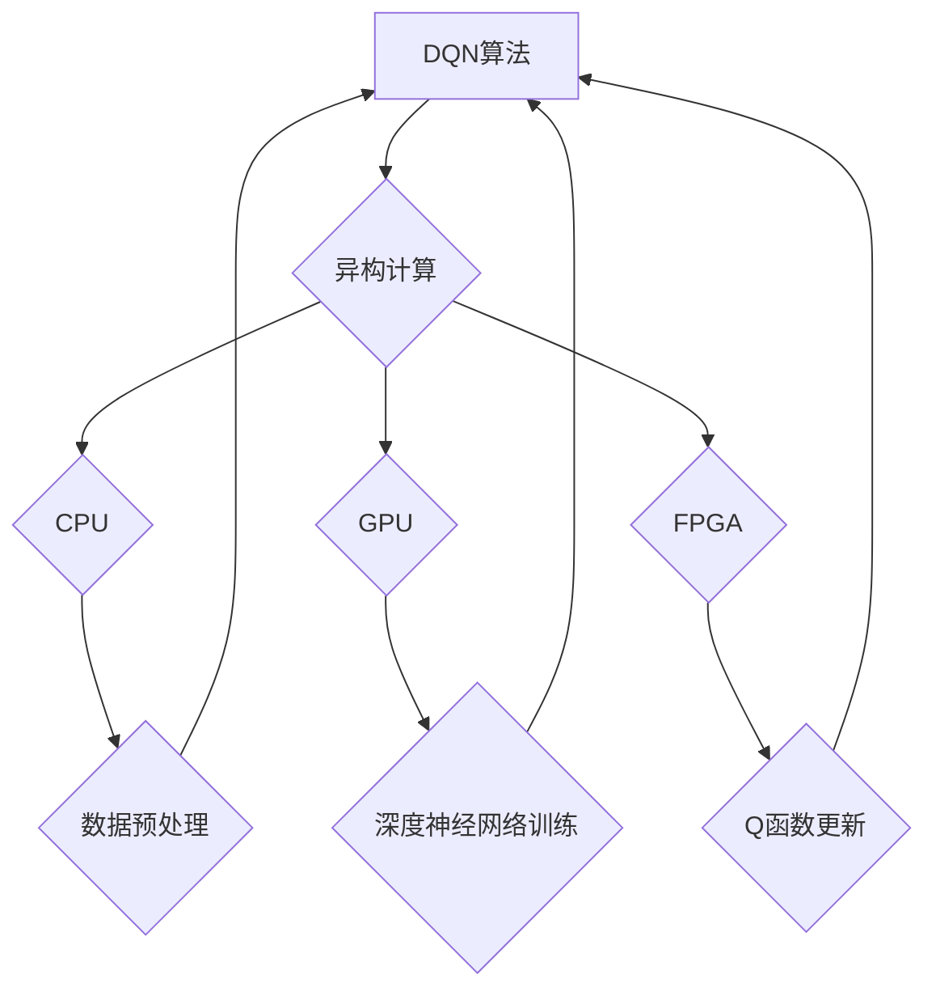

> 深度Q网络 (DQN)，异构计算，优化实践，强化学习，深度学习，GPU加速，CPU加速，FPGA加速

## 1. 背景介绍

在人工智能领域，深度强化学习 (Deep Reinforcement Learning，DRL) 作为一种强大的学习范式，在解决复杂决策问题方面展现出巨大的潜力。其中，深度Q网络 (Deep Q-Network，DQN) 作为DRL领域的重要算法之一，凭借其能够学习策略并取得优异性能的特点，在游戏、机器人控制、自动驾驶等领域取得了显著的成果。

然而，DQN算法的训练过程通常需要大量的计算资源，特别是对于复杂的环境和高维的行动空间，训练时间和资源消耗都将变得非常高昂。为了解决这一问题，异构计算 (Heterogeneous Computing) 应运而生。异构计算是指利用不同类型的计算资源，例如CPU、GPU、FPGA等，协同工作以提高计算效率。

## 2. 核心概念与联系

**2.1 深度Q网络 (DQN)**

DQN是一种基于深度神经网络的强化学习算法，它通过学习一个Q函数来估计在给定状态下采取特定动作的期望回报。Q函数可以表示为：

$$Q(s, a) = E[R_{t+1} + \gamma \max_{a'} Q(s', a') | s_t = s, a_t = a]$$

其中：

* $s$ 表示当前状态
* $a$ 表示采取的动作
* $R_{t+1}$ 表示下一个时间步的奖励
* $\gamma$ 表示折扣因子，控制未来奖励的权重
* $s'$ 表示下一个状态
* $a'$ 表示下一个时间步采取的动作

DQN通过训练这个Q函数来学习最优的策略，即在每个状态下选择能够获得最大期望回报的动作。

**2.2 异构计算**

异构计算是指利用不同类型的计算资源，例如CPU、GPU、FPGA等，协同工作以提高计算效率。

* **CPU (Central Processing Unit)**：通用处理器，擅长处理各种类型的计算任务，但计算速度相对较慢。
* **GPU (Graphics Processing Unit)**：图形处理器，擅长并行计算，在处理大量数据和矩阵运算方面具有优势。
* **FPGA (Field-Programmable Gate Array)**：可编程逻辑门阵列，可以根据需要定制硬件电路，实现特定功能，具有高性能和低功耗的特点。

**2.3 异构计算与DQN的结合**

将异构计算与DQN结合可以有效提高DQN的训练效率。例如，可以利用GPU加速DQN的深度神经网络训练，利用FPGA加速DQN的Q函数更新和策略评估等操作。

**2.4 Mermaid 流程图**



## 3. 核心算法原理 & 具体操作步骤

### 3.1 算法原理概述

DQN算法的核心思想是利用深度神经网络来逼近Q函数，并通过强化学习的原理来更新Q函数的值。

DQN算法的主要步骤如下：

1. 初始化深度神经网络，并设置学习率和折扣因子等超参数。
2. 在环境中进行交互，收集状态、动作和奖励的数据。
3. 将收集到的数据用于训练深度神经网络，更新Q函数的值。
4. 根据更新后的Q函数，选择最优的动作，并执行该动作。
5. 重复步骤2-4，直到达到预设的训练目标。

### 3.2 算法步骤详解

1. **初始化网络:** 首先，需要创建一个深度神经网络，该网络的输入是环境的状态，输出是每个动作对应的Q值。网络的结构可以根据具体任务进行调整。

2. **经验回放:** 为了避免训练过程中的样本相关性问题，DQN算法采用经验回放技术。经验回放是指将收集到的状态、动作、奖励和下一个状态等信息存储在一个经验池中，然后从经验池中随机采样数据进行训练。

3. **目标网络:** 为了稳定训练过程，DQN算法引入了目标网络的概念。目标网络是一个与主网络结构相同的网络，但其权重是根据主网络权重进行更新的。目标网络用于计算目标Q值，避免主网络权重更新过快导致的震荡。

4. **Q值更新:** 使用梯度下降算法更新主网络的权重，目标是使Q值预测与实际奖励的差值最小化。

5. **策略选择:** 根据更新后的Q值，选择最优的动作，即Q值最大的动作。

### 3.3 算法优缺点

**优点:**

* 可以学习复杂决策问题
* 能够处理高维状态和动作空间
* 训练过程相对稳定

**缺点:**

* 训练过程需要大量的计算资源
* 训练时间较长
* 算法参数需要进行仔细调优

### 3.4 算法应用领域

DQN算法在以下领域具有广泛的应用前景:

* **游戏:** 训练游戏AI，例如AlphaGo、AlphaStar等。
* **机器人控制:** 训练机器人进行自主导航、抓取等任务。
* **自动驾驶:** 训练自动驾驶系统进行决策和控制。
* **推荐系统:** 训练推荐系统，根据用户的历史行为推荐感兴趣的内容。

## 4. 数学模型和公式 & 详细讲解 & 举例说明

### 4.1 数学模型构建

DQN算法的核心是Q函数，它是一个映射函数，将状态-动作对映射到期望回报。

$$Q(s, a) = E[R_{t+1} + \gamma \max_{a'} Q(s', a') | s_t = s, a_t = a]$$

其中：

* $s$：当前状态
* $a$：采取的动作
* $R_{t+1}$：下一个时间步的奖励
* $\gamma$：折扣因子，控制未来奖励的权重
* $s'$：下一个状态
* $a'$：下一个时间步采取的动作

### 4.2 公式推导过程

DQN算法的目标是学习一个能够最大化期望回报的策略。策略可以表示为一个映射函数，将状态映射到动作。

$$ \pi(s) = \arg\max_a Q(s, a)$$

其中：

* $\pi(s)$：在状态 $s$ 下采取的动作

为了学习这个策略，DQN算法使用贝尔曼方程来更新Q函数的值。贝尔曼方程表示的是状态-动作对的期望回报与下一个状态的期望回报之间的关系。

$$Q(s, a) = R(s, a) + \gamma \max_{a'} Q(s', a')$$

其中：

* $R(s, a)$：在状态 $s$ 下采取动作 $a$ 的奖励

### 4.3 案例分析与讲解

假设有一个简单的环境，其中有一个机器人需要在两个位置之间移动。机器人可以采取“向前”或“向后”两种动作。

* 状态：机器人当前的位置
* 动作：向前或向后
* 奖励：到达目标位置获得奖励，否则获得惩罚

DQN算法可以学习一个策略，使得机器人能够在最短时间内到达目标位置。

## 5. 项目实践：代码实例和详细解释说明

### 5.1 开发环境搭建

* 操作系统：Ubuntu 20.04
* Python 版本：3.8
* 深度学习框架：TensorFlow 2.x
* GPU：NVIDIA GeForce RTX 3080

### 5.2 源代码详细实现

```python
import tensorflow as tf

# 定义DQN网络
class DQN(tf.keras.Model):
    def __init__(self, state_size, action_size):
        super(DQN, self).__init__()
        self.dense1 = tf.keras.layers.Dense(64, activation='relu')
        self.dense2 = tf.keras.layers.Dense(64, activation='relu')
        self.output = tf.keras.layers.Dense(action_size)

    def call(self, state):
        x = self.dense1(state)
        x = self.dense2(x)
        return self.output(x)

# 定义DQN算法
class DQNAgent:
    def __init__(self, state_size, action_size, learning_rate=0.001, gamma=0.99):
        self.state_size = state_size
        self.action_size = action_size
        self.learning_rate = learning_rate
        self.gamma = gamma
        self.model = DQN(state_size, action_size)
        self.optimizer = tf.keras.optimizers.Adam(learning_rate=self.learning_rate)

    def train(self, states, actions, rewards, next_states, dones):
        with tf.GradientTape() as tape:
            q_values = self.model(states)
            target_q_values = rewards + self.gamma * tf.reduce_max(self.model(next_states), axis=1) * (1 - dones)
            loss = tf.keras.losses.MeanSquaredError()(target_q_values, q_values[tf.range(len(states)), actions])
        gradients = tape.gradient(loss, self.model.trainable_variables)
        self.optimizer.apply_gradients(zip(gradients, self.model.trainable_variables))

# ... 其他代码 ...
```

### 5.3 代码解读与分析

* **DQN网络:** 代码中定义了一个DQN网络，该网络包含两层全连接层和一层输出层。
* **DQN算法:** 代码中定义了一个DQN算法类，该类包含了DQN网络、优化器和超参数等成员变量。
* **训练方法:** 代码中实现了DQN算法的训练方法，该方法使用经验回放和目标网络来稳定训练过程。

### 5.4 运行结果展示

训练完成后，可以将DQN模型应用于实际环境中，观察其学习到的策略是否能够有效地解决问题。

## 6. 实际应用场景

### 6.1 游戏AI

DQN算法在游戏AI领域取得了显著的成果，例如AlphaGo和AlphaStar等。这些游戏AI能够通过学习DQN算法来掌握复杂的策略，并战胜人类玩家。

### 6.2 机器人控制

DQN算法可以用于训练机器人进行自主导航、抓取等任务。例如，可以训练一个机器人使用DQN算法来学习在复杂环境中导航，或者学习如何抓取特定物体。

### 6.3 自动驾驶

DQN算法可以用于训练自动驾驶系统进行决策和控制。例如，可以训练一个自动驾驶系统使用DQN算法来学习如何识别交通信号灯、避开障碍物和做出安全驾驶决策。

### 6.4 未来应用展望

DQN算法在未来将有更广泛的应用前景，例如：

* **医疗诊断:** 训练DQN算法来辅助医生诊断疾病。
* **金融交易:** 训练DQN算法来进行股票交易和风险管理。
* **个性化推荐:** 训练DQN算法来提供个性化的商品推荐和内容推荐。

## 7. 工具和资源推荐

### 7.1 学习资源推荐

* **书籍:**
    * Deep Reinforcement Learning Hands-On by Maxim Lapan
    * Reinforcement Learning: An Introduction by Richard S. Sutton and Andrew G. Barto
* **在线课程:**
    * Deep Reinforcement Learning Specialization by DeepLearning.AI
    * Reinforcement Learning by David Silver (University of DeepMind)

### 7.2 开发工具推荐

* **深度学习框架:** TensorFlow, PyTorch
* **环境模拟器:** OpenAI Gym, Unity ML-Agents

### 7.3 相关论文推荐

* Deep Q-Network (DQN) by Volodymyr Mnih et al.