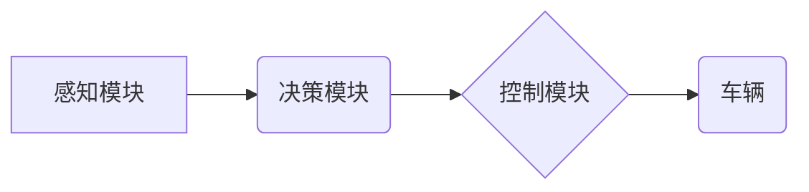

> 深度学习，无人驾驶，计算机视觉，感知模块，决策模块，控制模块，强化学习，数据标注，安全保障

## 1. 背景介绍

无人驾驶技术作为未来交通运输的重要发展方向，近年来取得了显著进展。深度学习作为机器学习领域的重要分支，凭借其强大的数据处理能力和模式识别能力，在无人驾驶技术中扮演着越来越重要的角色。从感知环境到决策规划，再到控制车辆，深度学习算法在各个环节发挥着关键作用。

传统的无人驾驶系统主要依赖于规则-基于的控制方法，需要人工设计大量的规则来应对各种复杂场景。然而，现实世界充满了不确定性和复杂性，规则-基于的方法难以应对所有情况，导致系统鲁棒性差，安全性难以保证。

深度学习的出现为无人驾驶技术带来了新的机遇。深度学习算法能够从海量数据中自动学习特征，并建立复杂的映射关系，从而实现对环境的感知、理解和决策。

## 2. 核心概念与联系

**2.1 深度学习在无人驾驶中的应用**

深度学习在无人驾驶技术中的应用主要集中在以下几个方面：

* **感知模块:** 利用深度学习算法对图像、视频、雷达数据等进行处理，识别道路、车辆、行人等目标，并估计其位置、速度等信息。
* **决策模块:** 基于感知模块获取的信息，利用深度学习算法进行决策规划，例如选择行驶路线、控制车速、进行避障等。
* **控制模块:** 根据决策模块的指令，利用深度学习算法控制车辆的转向、加速、制动等动作。

**2.2 架构图**



**2.3 核心概念**

* **深度神经网络:** 深度学习的核心算法，由多层神经元组成，能够学习复杂的非线性映射关系。
* **卷积神经网络 (CNN):** 特别适用于图像处理任务，能够自动学习图像特征。
* **循环神经网络 (RNN):** 擅长处理序列数据，例如视频和语音。
* **强化学习:** 通过奖励机制训练模型，使其在特定环境中做出最优决策。

## 3. 核心算法原理 & 具体操作步骤

### 3.1 算法原理概述

深度学习算法的核心原理是通过多层神经网络学习数据之间的映射关系。每个神经元接收来自前一层神经元的输入，并对其进行处理，然后将处理后的结果传递给下一层神经元。通过不断调整神经元的权重，深度学习算法能够学习到数据中的复杂模式和特征。

### 3.2 算法步骤详解

1. **数据预处理:** 将原始数据进行清洗、转换和归一化，使其适合深度学习算法的训练。
2. **模型构建:** 根据任务需求选择合适的深度学习模型，例如CNN、RNN等。
3. **模型训练:** 使用训练数据训练深度学习模型，通过调整模型参数，使其能够准确地预测目标输出。
4. **模型评估:** 使用测试数据评估模型的性能，例如准确率、召回率等。
5. **模型部署:** 将训练好的模型部署到实际应用场景中，例如无人驾驶车辆。

### 3.3 算法优缺点

**优点:**

* 能够自动学习数据特征，无需人工设计特征。
* 能够处理复杂、高维数据。
* 性能优于传统机器学习算法。

**缺点:**

* 训练数据量大，需要大量的计算资源。
* 模型解释性差，难以理解模型的决策过程。
* 对数据质量要求高，数据噪声会影响模型性能。

### 3.4 算法应用领域

深度学习算法在无人驾驶技术之外，还广泛应用于其他领域，例如：

* **图像识别:** 人脸识别、物体检测、图像分类等。
* **自然语言处理:** 机器翻译、文本摘要、情感分析等。
* **语音识别:** 语音转文本、语音合成等。
* **医疗诊断:** 疾病预测、图像分析等。

## 4. 数学模型和公式 & 详细讲解 & 举例说明

### 4.1 数学模型构建

深度学习模型通常由多个神经层组成，每个神经层包含多个神经元。每个神经元接收来自前一层神经元的输入，并对其进行线性变换和非线性激活函数处理。

**4.1.1 线性变换:**

$$
y = Wx + b
$$

其中：

* $y$ 是神经元的输出
* $x$ 是前一层神经元的输出
* $W$ 是权重矩阵
* $b$ 是偏置项

**4.1.2 非线性激活函数:**

常用的激活函数包括 sigmoid 函数、ReLU 函数、tanh 函数等。激活函数的作用是引入非线性，使神经网络能够学习复杂的映射关系。

**4.1.3 多层神经网络:**

多个神经层通过连接形成多层神经网络。每个神经层都包含多个神经元，并进行线性变换和非线性激活函数处理。

### 4.2 公式推导过程

深度学习模型的训练过程是通过反向传播算法来进行的。反向传播算法的核心思想是通过计算损失函数对模型参数的梯度，并利用梯度下降法更新模型参数，从而使模型的预测结果越来越接近真实值。

**4.2.1 损失函数:**

损失函数用于衡量模型预测结果与真实值的差距。常用的损失函数包括均方误差 (MSE)、交叉熵损失 (Cross-Entropy Loss) 等。

**4.2.2 梯度下降法:**

梯度下降法是一种迭代优化算法，用于更新模型参数。其核心思想是沿着梯度方向更新参数，从而使损失函数的值不断减小。

### 4.3 案例分析与讲解

**4.3.1 图像分类:**

假设我们有一个图像分类任务，目标是将图像分类为不同的类别，例如猫、狗、鸟等。我们可以使用 CNN 模型进行图像分类。CNN 模型能够自动学习图像特征，并将其映射到不同的类别。

**4.3.2 语音识别:**

假设我们有一个语音识别任务，目标是将语音转换为文本。我们可以使用 RNN 模型进行语音识别。RNN 模型能够处理序列数据，例如语音信号，并将其映射到对应的文本。

## 5. 项目实践：代码实例和详细解释说明

### 5.1 开发环境搭建

* **操作系统:** Ubuntu 18.04
* **编程语言:** Python 3.6
* **深度学习框架:** TensorFlow 2.0
* **其他工具:** Jupyter Notebook、Git

### 5.2 源代码详细实现

```python
import tensorflow as tf

# 定义模型结构
model = tf.keras.models.Sequential([
    tf.keras.layers.Conv2D(32, (3, 3), activation='relu', input_shape=(28, 28, 1)),
    tf.keras.layers.MaxPooling2D((2, 2)),
    tf.keras.layers.Conv2D(64, (3, 3), activation='relu'),
    tf.keras.layers.MaxPooling2D((2, 2)),
    tf.keras.layers.Flatten(),
    tf.keras.layers.Dense(10, activation='softmax')
])

# 编译模型
model.compile(optimizer='adam',
              loss='sparse_categorical_crossentropy',
              metrics=['accuracy'])

# 训练模型
model.fit(x_train, y_train, epochs=5)

# 评估模型
loss, accuracy = model.evaluate(x_test, y_test)
print('Test loss:', loss)
print('Test accuracy:', accuracy)
```

### 5.3 代码解读与分析

* **模型结构:** 代码定义了一个简单的 CNN 模型，包含两个卷积层、两个最大池化层、一个全连接层和一个输出层。
* **激活函数:** 使用 ReLU 激活函数，能够提高模型的训练效率。
* **损失函数:** 使用交叉熵损失函数，适合多分类任务。
* **优化器:** 使用 Adam 优化器，能够快速收敛。
* **训练过程:** 使用训练数据训练模型，并设置训练轮数 (epochs)。
* **评估过程:** 使用测试数据评估模型的性能，并打印测试损失和准确率。

### 5.4 运行结果展示

训练完成后，可以将模型保存下来，并在实际应用场景中使用。

## 6. 实际应用场景

### 6.1 自动驾驶汽车

深度学习算法在自动驾驶汽车中应用广泛，例如：

* **环境感知:** 利用摄像头、雷达、激光雷达等传感器获取环境信息，识别道路、车辆、行人等目标。
* **路径规划:** 根据环境信息，规划行驶路线，避开障碍物，并安全到达目的地。
* **车辆控制:** 控制车辆的转向、加速、制动等动作，实现自动驾驶。

### 6.2 无人机

深度学习算法在无人机中应用于：

* **图像识别:** 识别目标物体，例如人、动物、建筑物等。
* **航线规划:** 根据地图和环境信息，规划无人机的飞行路线。
* **避障:** 识别障碍物，并自动避开。

### 6.3 机器人

深度学习算法在机器人中应用于：

* **视觉导航:** 利用摄像头获取环境信息，引导机器人自主导航。
* **物体抓取:** 学习物体形状和特征，实现物体抓取。
* **人机交互:** 理解人类语言和指令，实现人机交互。

### 6.4 未来应用展望

深度学习技术还在不断发展，未来将在更多领域得到应用，例如：

* **医疗诊断:** 辅助医生诊断疾病，提高诊断准确率。
* **金融风险控制:** 识别金融风险，降低金融损失。
* **个性化教育:** 根据学生的学习情况，提供个性化的学习方案。

## 7. 工具和资源推荐

### 7.1 学习资源推荐

* **书籍:**
    * 深度学习 (Deep Learning) - Ian Goodfellow, Yoshua Bengio, Aaron Courville
    * 深度学习实战 (Deep Learning with Python) - Francois Chollet
* **在线课程:**
    * Coursera: 深度学习 Specialization
    * Udacity: 深度学习 Nanodegree
    * fast.ai: 深度学习课程

### 7.2 开发工具推荐

* **深度学习框架:** TensorFlow, PyTorch, Keras
* **编程语言:** Python
* **数据处理工具:** Pandas, NumPy
* **可视化工具:** Matplotlib, Seaborn

### 7.3 相关论文推荐

* **AlexNet:** ImageNet Classification with Deep Convolutional Neural Networks
* **VGGNet:** Very Deep Convolutional Networks for Large-Scale Image Recognition
* **ResNet:** Deep Residual Learning for Image Recognition

## 8. 总结：未来发展趋势与挑战

### 8.1 研究成果总结

深度学习在无人驾驶技术中取得了显著进展，例如：

* **感知模块:** CNN 模型能够实现高精度目标识别和定位。
* **决策模块:** 强化学习算法能够训练模型做出最优决策。
* **控制模块:** 深度学习算法能够实现车辆的精确控制。

### 8.2 未来发展趋势

* **模型更深更复杂:** 研究更深更复杂的深度学习模型，提高模型的性能和鲁棒性。
* **数据量更大更丰富:** 收集更多数据，并进行数据增强，提高模型的泛化能力。
* **算法更智能更安全:** 研究更智能、更安全的深度学习算法，例如联邦学习、对抗训练等。

### 8.3 面临的挑战

* **数据标注成本高:** 深度学习模型需要大量的标注数据，数据标注成本高昂。
* **模型解释性差:** 深度学习模型的决策过程难以解释，难以保证模型的安全性。
* **计算资源需求大:** 训练深度学习模型需要大量的计算资源，成本高。

### 8.4 研究展望

未来，深度学习技术将继续推动无人驾驶技术的发展，并应用于更多领域。

## 9. 附录：常见问题与解答

**