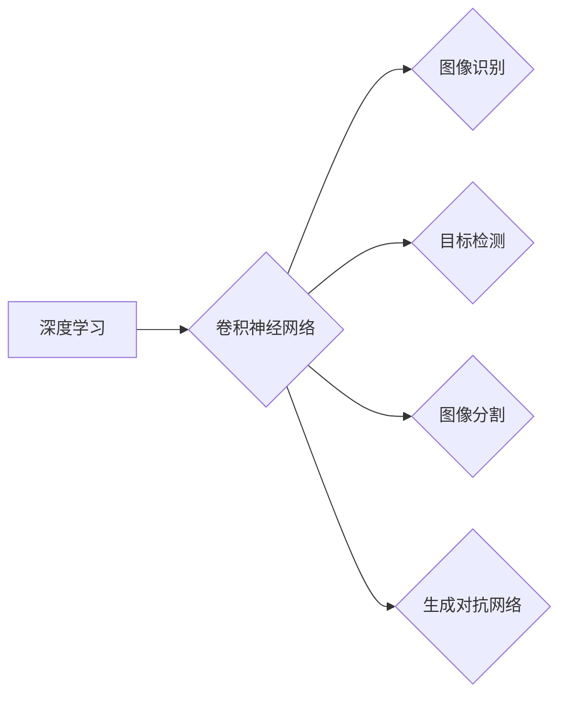

> 深度学习，计算机视觉，卷积神经网络，图像识别，目标检测，图像分割，生成对抗网络

## 1. 背景介绍

计算机视觉作为人工智能领域的重要分支，旨在赋予计算机“看”的能力，使其能够理解和解释图像和视频信息。近年来，深度学习技术的飞速发展为计算机视觉领域带来了革命性的变革。深度学习算法能够自动从海量数据中学习特征，并构建复杂的视觉模型，从而实现更精准、更智能的图像理解和处理。

传统的计算机视觉方法主要依赖于人工设计的特征提取方法，需要领域专家耗费大量时间和精力进行特征工程。而深度学习算法则能够自动学习图像中的特征，无需人工干预，大大提高了算法的效率和准确性。

## 2. 核心概念与联系

**2.1 深度学习**

深度学习是一种机器学习的子领域，它利用多层神经网络来模拟人类大脑的学习过程。深度神经网络由多个相互连接的神经元组成，每个神经元接收来自前一层神经元的输入，并对其进行处理，最终输出到下一层神经元。通过训练大量的样本数据，深度神经网络能够自动学习图像中的特征，并构建复杂的视觉模型。

**2.2 卷积神经网络 (CNN)**

卷积神经网络 (CNN) 是深度学习中专门用于处理图像数据的网络结构。CNN 利用卷积操作和池化操作来提取图像特征。卷积操作能够从图像中提取局部特征，而池化操作能够降低图像的维度，提高计算效率。

**2.3 图像识别**

图像识别是指让计算机能够识别图像中所包含的物体或场景。深度学习算法能够通过学习大量的图像数据，识别出图像中的不同物体，并将其分类。

**2.4 目标检测**

目标检测是指在图像中定位和识别特定物体的任务。深度学习算法能够在图像中检测出多个物体，并为每个物体标注出边界框和类别标签。

**2.5 图像分割**

图像分割是指将图像分割成多个区域，每个区域代表不同的物体或场景。深度学习算法能够将图像分割成多个像素级别的区域，并为每个区域分配类别标签。

**2.6 生成对抗网络 (GAN)**

生成对抗网络 (GAN) 是一种由两个神经网络组成的生成模型。其中一个网络 (生成器) 负责生成新的图像数据，而另一个网络 (判别器) 负责判断图像是否为真实数据或生成数据。通过对抗训练，生成器能够生成越来越逼真的图像数据。

**Mermaid 流程图**

## 3. 核心算法原理 & 具体操作步骤

### 3.1 算法原理概述

卷积神经网络 (CNN) 是深度学习中专门用于处理图像数据的网络结构。CNN 利用卷积操作和池化操作来提取图像特征。卷积操作能够从图像中提取局部特征，而池化操作能够降低图像的维度，提高计算效率。

### 3.2 算法步骤详解

1. **输入层:** 将图像数据作为输入，每个像素点对应一个神经元。
2. **卷积层:** 使用多个卷积核对图像进行卷积操作，提取图像的局部特征。每个卷积核对应一个特征图。
3. **池化层:** 对卷积层的输出进行池化操作，例如最大池化或平均池化，降低图像的维度，提高计算效率。
4. **全连接层:** 将池化层的输出连接到全连接层，进行分类或回归。
5. **输出层:** 输出分类结果或回归值。

### 3.3 算法优缺点

**优点:**

* 自动学习图像特征，无需人工特征工程。
* 能够处理高维图像数据。
* 性能优于传统计算机视觉方法。

**缺点:**

* 训练数据量大，需要大量的标注数据。
* 计算量大，训练时间长。
* 对超参数设置敏感。

### 3.4 算法应用领域

* **图像识别:** 人脸识别、物体识别、场景识别等。
* **目标检测:** 自动驾驶、安防监控、医疗影像分析等。
* **图像分割:** 医学影像分割、图像编辑、自动驾驶等。
* **图像生成:** 生成逼真的图像、视频、音频等。

## 4. 数学模型和公式 & 详细讲解 & 举例说明

### 4.1 数学模型构建

卷积神经网络的数学模型主要包括卷积操作、池化操作和激活函数。

**4.1.1 卷积操作**

卷积操作是指将一个卷积核滑动在图像上，计算卷积核与图像局部区域的内积。卷积核的尺寸通常为3x3或5x5。

**公式:**

$$
y_{i,j} = \sum_{m=0}^{M-1} \sum_{n=0}^{N-1} x_{i+m,j+n} * w_{m,n}
$$

其中:

* $y_{i,j}$ 是卷积输出的像素值。
* $x_{i+m,j+n}$ 是输入图像的像素值。
* $w_{m,n}$ 是卷积核的权重值。
* $M$ 和 $N$ 是卷积核的尺寸。

**4.1.2 池化操作**

池化操作是指对卷积层的输出进行降维操作，例如最大池化或平均池化。

**公式:**

**最大池化:**

$$
y_{i,j} = \max_{m=0}^{M-1} \max_{n=0}^{N-1} x_{i*s+m,j*s+n}
$$

其中:

* $s$ 是池化窗口的大小。

**平均池化:**

$$
y_{i,j} = \frac{1}{M*N} \sum_{m=0}^{M-1} \sum_{n=0}^{N-1} x_{i*s+m,j*s+n}
$$

**4.1.3 激活函数**

激活函数用于引入非线性，使神经网络能够学习更复杂的特征。常用的激活函数包括ReLU、Sigmoid和Tanh。

**公式:**

**ReLU:**

$$
f(x) = \max(0,x)
$$

**Sigmoid:**

$$
f(x) = \frac{1}{1+e^{-x}}
$$

**Tanh:**

$$
f(x) = \frac{e^x - e^{-x}}{e^x + e^{-x}}
$$

### 4.2 公式推导过程

卷积神经网络的训练过程是通过反向传播算法来更新网络参数的。反向传播算法的核心思想是通过计算损失函数对网络参数的梯度，并利用梯度下降法更新网络参数。

### 4.3 案例分析与讲解

**4.3.1 图像识别案例**

使用CNN模型进行图像识别，例如识别猫和狗的图片。

**4.3.2 目标检测案例**

使用目标检测模型检测图像中的物体，例如检测汽车、行人、自行车等。

## 5. 项目实践：代码实例和详细解释说明

### 5.1 开发环境搭建

使用Python语言和深度学习框架TensorFlow或PyTorch搭建开发环境。

### 5.2 源代码详细实现

使用TensorFlow或PyTorch框架实现CNN模型，并进行训练和测试。

### 5.3 代码解读与分析

解释CNN模型的代码结构，包括卷积层、池化层、全连接层等。

### 5.4 运行结果展示

展示CNN模型在图像识别、目标检测等任务上的运行结果。

## 6. 实际应用场景

### 6.1 自动驾驶

使用计算机视觉技术进行自动驾驶，例如识别道路、交通信号灯、行人等。

### 6.2 医疗影像分析

使用计算机视觉技术进行医疗影像分析，例如识别肿瘤、骨折等。

### 6.3 安防监控

使用计算机视觉技术进行安防监控，例如人脸识别、行为分析等。

### 6.4 未来应用展望

* **增强现实 (AR) 和虚拟现实 (VR):** 使用计算机视觉技术增强现实和虚拟现实体验。
* **机器人视觉:** 使机器人能够感知和理解周围环境。
* **智能家居:** 使用计算机视觉技术实现智能家居功能。

## 7. 工具和资源推荐

### 7.1 学习资源推荐

* **书籍:**
    * 深度学习
    * 计算机视觉
* **在线课程:**
    * Coursera
    * edX
    * Udacity

### 7.2 开发工具推荐

* **深度学习框架:** TensorFlow, PyTorch
* **图像处理库:** OpenCV

### 7.3 相关论文推荐

* **AlexNet:** ImageNet Classification with Deep Convolutional Neural Networks
* **VGGNet:** Very Deep Convolutional Networks for Large-Scale Image Recognition
* **ResNet:** Deep Residual Learning for Image Recognition

## 8. 总结：未来发展趋势与挑战

### 8.1 研究成果总结

深度学习在计算机视觉领域取得了显著的成果，例如图像识别、目标检测、图像分割等任务的性能大幅提升。

### 8.2 未来发展趋势

* **更深更广的网络结构:** 研究更深、更广的网络结构，提高模型的表达能力。
* **自监督学习:** 利用无标签数据进行自监督学习，降低对标注数据的依赖。
* **跨模态学习:** 研究跨模态学习，例如图像与文本的联合学习。

### 8.3 面临的挑战

* **数据效率:** 深度学习模型对数据量要求高，如何提高模型的数据效率是一个挑战。
* **可解释性:** 深度学习模型的决策过程难以解释，如何提高模型的可解释性是一个重要问题。
* **安全性和鲁棒性:** 深度学习模型容易受到攻击，如何提高模型的安全性和鲁棒性是一个关键挑战。

### 8.4 研究展望

未来，计算机视觉领域将继续朝着更智能、更安全、更可靠的方向发展。

## 9. 附录：常见问题与解答

**9.1 如何选择合适的深度学习框架？**

TensorFlow 和 PyTorch 是两个流行的深度学习框架，选择哪个框架取决于个人喜好和项目需求。

**9.2 如何处理图像数据？**

图像数据需要进行预处理，例如归一化、裁剪、增强等。

**9.3 如何评估模型性能？**

可以使用准确率、召回率、F1-score等指标来评估模型性能。

作者：禅与计算机程序设计艺术 / Zen and the Art of Computer Programming 
<end_of_turn>