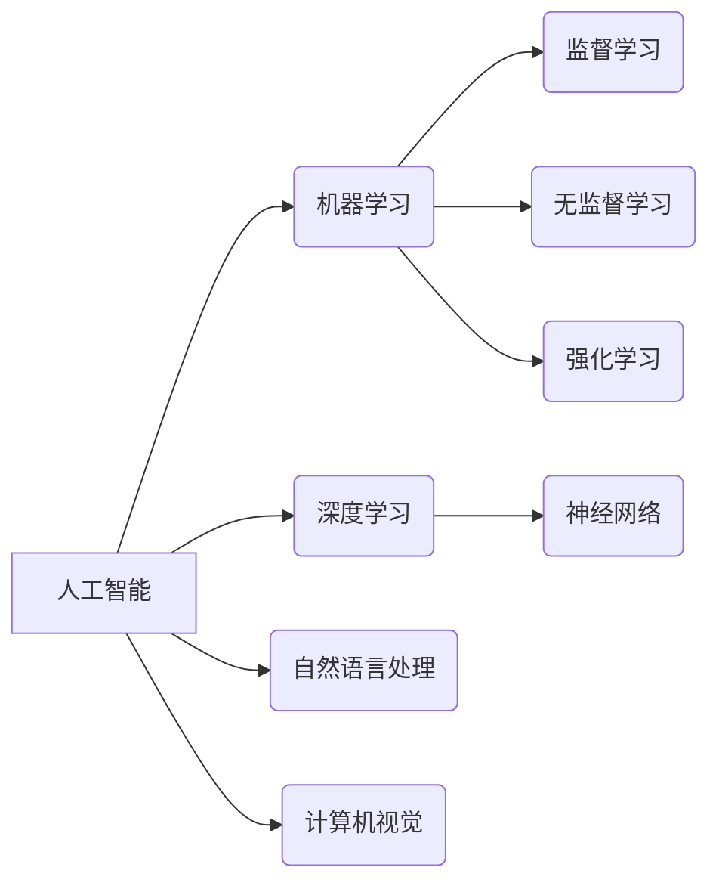

> 人工智能、机器学习、深度学习、神经网络、自然语言处理、计算机视觉、算法、模型、应用

## 1. 背景介绍

人工智能 (Artificial Intelligence，简称 AI) 作为一项前沿科技，近年来发展迅速，并已渗透到各个领域，深刻地改变着我们的生活方式和工作模式。从智能手机的语音助手到自动驾驶汽车，从医疗诊断到金融风险评估，AI技术的应用日益广泛。

人工智能的本质是模拟人类智能，使其能够像人类一样学习、思考、解决问题和做出决策。它涵盖了多个学科，包括计算机科学、数学、统计学、心理学和神经科学等。

## 2. 核心概念与联系

**2.1  机器学习 (Machine Learning)**

机器学习是人工智能的核心技术之一，它通过算法训练模型，使模型能够从数据中学习，并根据学习到的知识进行预测或决策。机器学习可以分为监督学习、无监督学习和强化学习三大类。

* **监督学习:**  利用标记数据训练模型，例如图像分类、文本分类等。
* **无监督学习:**  利用未标记数据发现数据中的模式和结构，例如聚类、降维等。
* **强化学习:**  通过试错学习，使模型在特定环境中获得最大奖励，例如游戏 AI、机器人控制等。

**2.2  深度学习 (Deep Learning)**

深度学习是机器学习的一个子领域，它利用多层神经网络来模拟人类大脑的学习过程。深度学习模型具有强大的学习能力，能够处理复杂的数据，并取得了在图像识别、语音识别、自然语言处理等领域的突破性进展。

**2.3  神经网络 (Neural Network)**

神经网络是深度学习的基础，它由多个相互连接的神经元组成，每个神经元接收输入信号，进行处理，并输出信号。神经网络通过调整连接权重来学习数据，从而实现对数据的理解和预测。

**2.4  自然语言处理 (Natural Language Processing)**

自然语言处理 (NLP) 是人工智能的一个重要分支，它致力于使计算机能够理解和处理人类语言。NLP技术应用广泛，例如机器翻译、文本摘要、情感分析等。

**2.5  计算机视觉 (Computer Vision)**

计算机视觉 (CV) 是人工智能的另一个重要分支，它致力于使计算机能够“看”和理解图像和视频。计算机视觉技术应用广泛，例如图像识别、物体检测、人脸识别等。

**2.6  核心概念关系图**



## 3. 核心算法原理 & 具体操作步骤

### 3.1  算法原理概述

**3.1.1  线性回归 (Linear Regression)**

线性回归是一种监督学习算法，用于预测连续变量。它假设数据之间存在线性关系，并通过最小化误差来找到最佳拟合直线。

**3.1.2  逻辑回归 (Logistic Regression)**

逻辑回归是一种用于分类问题的监督学习算法。它将线性回归的结果映射到0到1之间的概率，从而预测样本属于某个类别的概率。

**3.1.3  决策树 (Decision Tree)**

决策树是一种树形结构的分类算法，它通过一系列的决策规则来对数据进行分类。决策树易于理解和解释，但容易过拟合。

**3.1.4  支持向量机 (Support Vector Machine)**

支持向量机是一种用于分类和回归的监督学习算法。它通过寻找最佳的分隔超平面来将数据点分类。支持向量机具有良好的泛化能力，但训练时间较长。

### 3.2  算法步骤详解

**3.2.1  线性回归步骤**

1.  收集数据并进行预处理，例如特征缩放、缺失值处理等。
2.  构建线性回归模型，即找到最佳拟合直线。
3.  使用训练数据训练模型，并计算模型的误差。
4.  使用测试数据评估模型的性能，例如计算准确率、召回率等。

**3.2.2  逻辑回归步骤**

1.  收集数据并进行预处理。
2.  构建逻辑回归模型，即找到最佳的分隔超平面。
3.  使用训练数据训练模型，并计算模型的误差。
4.  使用测试数据评估模型的性能，例如计算准确率、召回率等。

**3.2.3  决策树步骤**

1.  收集数据并进行预处理。
2.  选择最优特征作为决策节点，并划分数据。
3.  递归地重复步骤2，直到达到停止条件，例如最大深度、最小样本数等。
4.  使用测试数据评估模型的性能。

**3.2.4  支持向量机步骤**

1.  收集数据并进行预处理。
2.  选择核函数，例如线性核、径向基核等。
3.  使用训练数据训练模型，并找到最佳的分隔超平面。
4.  使用测试数据评估模型的性能。

### 3.3  算法优缺点

| 算法 | 优点 | 缺点 |
|---|---|---|
| 线性回归 | 易于理解和实现，计算速度快 | 容易过拟合，只能处理线性关系 |
| 逻辑回归 | 易于理解和实现，计算速度快 | 只能处理二分类问题，容易过拟合 |
| 决策树 | 易于理解和解释，可以处理非线性关系 | 容易过拟合，对数据噪声敏感 |
| 支持向量机 | 泛化能力强，可以处理高维数据 | 训练时间较长，参数选择较复杂 |

### 3.4  算法应用领域

* **线性回归:** 房价预测、股票价格预测、销售预测等。
* **逻辑回归:** 垃圾邮件分类、欺诈检测、客户流失预测等。
* **决策树:** 医疗诊断、信用评分、产品推荐等。
* **支持向量机:** 手写数字识别、图像分类、文本分类等。

## 4. 数学模型和公式 & 详细讲解 & 举例说明

### 4.1  数学模型构建

**4.1.1  线性回归模型**

线性回归模型假设数据之间存在线性关系，可以用以下公式表示：

$$y = w_0 + w_1x_1 + w_2x_2 + ... + w_nx_n + \epsilon$$

其中：

* $y$ 是目标变量
* $x_1, x_2, ..., x_n$ 是特征变量
* $w_0, w_1, w_2, ..., w_n$ 是模型参数
* $\epsilon$ 是误差项

**4.1.2  逻辑回归模型**

逻辑回归模型将线性回归的结果映射到0到1之间的概率，可以用以下公式表示：

$$p(y=1|x) = \frac{1}{1 + e^{-(w_0 + w_1x_1 + w_2x_2 + ... + w_nx_n)}}$$

其中：

* $p(y=1|x)$ 是样本属于类别1的概率
* $x_1, x_2, ..., x_n$ 是特征变量
* $w_0, w_1, w_2, ..., w_n$ 是模型参数

### 4.2  公式推导过程

**4.2.1  线性回归模型参数估计**

线性回归模型的参数估计可以使用最小二乘法，即最小化模型误差的平方和。

**4.2.2  逻辑回归模型参数估计**

逻辑回归模型的参数估计可以使用最大似然估计，即找到使模型似然函数最大的参数值。

### 4.3  案例分析与讲解

**4.3.1  线性回归案例**

假设我们想要预测房屋价格，已知房屋面积和房间数量等特征变量。我们可以使用线性回归模型来建立房屋价格预测模型。

**4.3.2  逻辑回归案例**

假设我们想要判断电子邮件是否为垃圾邮件，已知电子邮件内容等特征变量。我们可以使用逻辑回归模型来建立垃圾邮件分类模型。

## 5. 项目实践：代码实例和详细解释说明

### 5.1  开发环境搭建

*   操作系统：Windows/macOS/Linux
*   编程语言：Python
*   库依赖：scikit-learn、numpy、pandas

### 5.2  源代码详细实现

```python
# 导入必要的库
import pandas as pd
from sklearn.linear_model import LinearRegression
from sklearn.model_selection import train_test_split

# 加载数据
data = pd.read_csv('house_price.csv')

# 选择特征变量和目标变量
X = data[['area', 'rooms']]
y = data['price']

# 将数据划分为训练集和测试集
X_train, X_test, y_train, y_test = train_test_split(X, y, test_size=0.2, random_state=42)

# 创建线性回归模型
model = LinearRegression()

# 训练模型
model.fit(X_train, y_train)

# 使用模型预测测试集数据
y_pred = model.predict(X_test)

# 评估模型性能
from sklearn.metrics import mean_squared_error
mse = mean_squared_error(y_test, y_pred)
print(f'Mean Squared Error: {mse}')
```

### 5.3  代码解读与分析

*   代码首先导入必要的库，然后加载数据。
*   接下来选择特征变量和目标变量，并将数据划分为训练集和测试集。
*   然后创建线性回归模型，并使用训练集训练模型。
*   最后使用模型预测测试集数据，并评估模型性能。

### 5.4  运行结果展示

运行代码后，会输出模型的均方误差 (MSE) 值，该值越小，模型的预测精度越高。

## 6. 实际应用场景

### 6.1  医疗诊断

人工智能可以辅助医生进行疾病诊断，例如通过分析患者的影像数据、病历记录和基因信息来预测疾病风险和诊断结果。

### 6.2  金融风险评估

人工智能可以用于评估金融风险，例如识别欺诈交易、预测客户流失和管理投资组合。

### 6.3  自动驾驶

人工智能是自动驾驶汽车的核心技术，它可以帮助汽车感知周围环境、做出决策并控制车辆。

### 6.4  未来应用展望

人工智能技术的应用前景广阔，未来将应用于更多领域，例如教育、娱乐、制造业等。

## 7. 工具和资源推荐

### 7.1  学习资源推荐

*   **在线课程:** Coursera、edX、Udacity
*   **书籍:** 《深度学习》、《人工智能：一个现代方法》
*   **博客:** Towards Data Science、Machine Learning Mastery

### 7.2  开发工具推荐

*   **Python:** 广泛用于人工智能开发
*   **TensorFlow:** 深度学习框架
*   **PyTorch:** 深度学习框架
*   **scikit-learn:** 机器学习库

### 7.3  相关论文推荐

*   《ImageNet Classification with Deep Convolutional Neural Networks》
*   《Attention Is All You Need》
*   《BERT: Pre-training of Deep Bidirectional Transformers for Language Understanding》

## 8. 总结：未来发展趋势与挑战

### 8.1  研究成果总结

近年来，人工智能取得了显著进展，特别是深度学习技术的突破，使得人工智能在多个领域取得了突破性进展。

### 8.2  未来发展趋势

*   **模型规模和复杂度提升:** 未来人工智能模型将更加庞大、复杂，能够处理更复杂的数据和任务。
*   **跨模态学习:** 未来人工智能将能够处理多种模态数据，例如文本、图像、音频等，实现跨模态理解