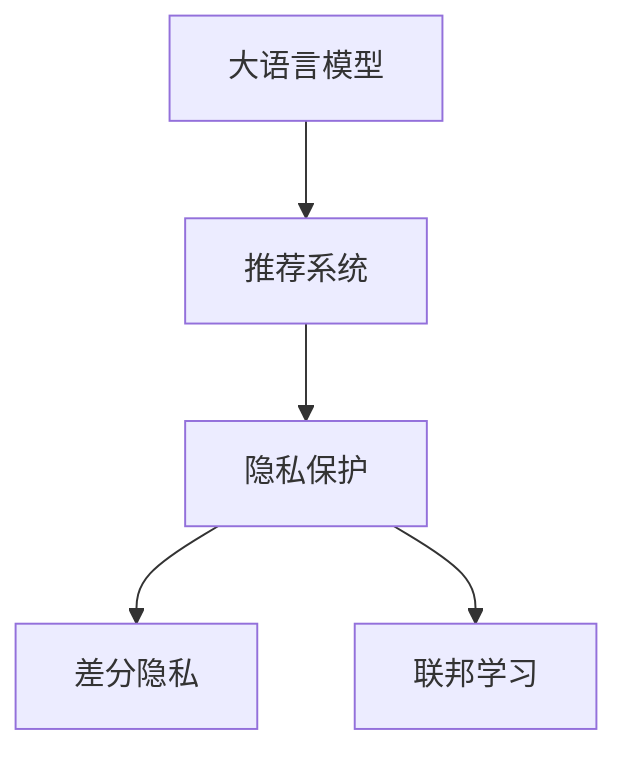

                 

# LLM推荐中的隐私保护技术研究

## 1. 背景介绍

### 1.1 问题由来

推荐系统是互联网时代用户获取个性化内容的重要手段。近年来，随着大规模深度学习模型的发展，基于机器学习推荐系统的精度和多样性有了显著提升，用户满意度也大幅提升。但是，推荐系统的背后存在严重的隐私问题。用户行为数据被收集，并且这些数据可能被用于商业变现，甚至是黑市交易。

例如，针对用户浏览历史的推荐系统，常常被用于广告定向，从而侵犯用户隐私。此外，用户阅读书籍、观看视频等行为数据，还可能用于分析其心理健康状况、生活环境等敏感信息。这就要求推荐系统不仅要提供个性化推荐，还要注重隐私保护，保障用户的隐私权益。

因此，如何在推荐系统中实现隐私保护，是当前NLP推荐领域的一个重要研究方向。本文将从大语言模型的视角，探讨推荐系统中的隐私保护技术。

### 1.2 问题核心关键点

大语言模型（LLM）推荐系统中的隐私保护，主要关注以下几个关键问题：

- 如何构建LLM推荐系统，实现个性化推荐。
- 如何保护用户隐私，避免个人信息被泄露。
- 如何在推荐算法中引入隐私保护机制，提升推荐系统安全性。
- 如何评估LLM推荐系统的隐私保护效果，验证隐私保护措施的有效性。

这些问题对于大语言模型推荐系统的设计至关重要。本文将重点介绍大语言模型推荐系统的工作原理，探讨如何在其中实现隐私保护，并提供相关的算法原理和实验结果。

## 2. 核心概念与联系

### 2.1 核心概念概述

为更好地理解基于大语言模型的推荐系统中的隐私保护技术，我们首先介绍几个关键概念：

- 大语言模型（LLM）：以自回归（如GPT）或自编码（如BERT）模型为代表的大规模预训练语言模型。通过在大规模无标签文本语料上进行预训练，学习通用的语言表示，具备强大的语言理解和生成能力。

- 推荐系统（Recommendation System）：基于用户的历史行为数据和偏好，为用户推荐感兴趣内容的系统。传统的推荐系统使用协同过滤、内容推荐等方法，近年来通过机器学习和大规模深度学习模型实现精确、个性化的推荐。

- 隐私保护（Privacy Preservation）：保护用户隐私，防止个人信息被泄露或滥用。隐私保护通常涉及数据的匿名化、差分隐私等技术手段。

- 差分隐私（Differential Privacy）：一种隐私保护机制，在数据集上加入噪声，使得攻击者无法区分具体数据样本，从而保护用户隐私。

- 联邦学习（Federated Learning）：一种分布式机器学习技术，使得多个数据源可以在不共享数据的情况下，协同训练模型，提高模型性能同时保护数据隐私。

这些概念之间存在紧密的联系。大语言模型推荐系统通过LLM进行个性化推荐，同时需要考虑隐私保护，防止数据泄露。差分隐私和联邦学习提供了一种保护隐私的技术手段，可以在推荐系统中进行应用。

### 2.2 核心概念原理和架构的 Mermaid 流程图



## 3. 核心算法原理 & 具体操作步骤

### 3.1 算法原理概述

基于大语言模型的推荐系统，通常由三个主要部分组成：用户行为收集、模型训练和个性化推荐。其中，隐私保护技术主要用于模型训练和个性化推荐过程。

在推荐系统中，用户行为数据是推荐算法的输入，这些数据包括用户浏览记录、点击记录、评分等。LLM推荐系统通过预训练的LLM模型进行特征提取和推荐计算。模型训练过程通常需要大量的用户数据，这就涉及到了隐私保护问题。

隐私保护技术通过数据匿名化、差分隐私、联邦学习等手段，防止用户数据泄露。同时，基于大语言模型的推荐系统，还引入提示学习等技术，进一步提升隐私保护的效果。

### 3.2 算法步骤详解

#### 3.2.1 用户行为收集与隐私保护

在用户行为收集过程中，隐私保护技术可以采用以下措施：

- 数据匿名化：对用户行为数据进行去标识化处理，使得攻击者无法直接识别到具体用户。例如，对用户的IP地址进行IP分段，模糊化处理，使用虚拟ID代替真实ID。
- 数据加密：对用户行为数据进行加密处理，防止数据泄露。例如，使用AES、RSA等加密算法对数据进行加密保护。

#### 3.2.2 模型训练与隐私保护

在模型训练过程中，隐私保护技术可以采用以下措施：

- 差分隐私：在模型训练中加入噪声，使得攻击者无法区分具体数据样本。例如，使用Gaussian噪声或Laplace噪声对模型参数进行扰动。
- 联邦学习：在分布式环境中，多个数据源可以在不共享数据的情况下，协同训练模型。例如，使用FederatedAvg算法进行模型参数的更新。

#### 3.2.3 个性化推荐与隐私保护

在个性化推荐过程中，隐私保护技术可以采用以下措施：

- 提示学习：通过精心设计输入文本的格式，引导大语言模型按期望方式输出，减少微调参数。例如，使用特殊标记（如[CLS]、[SEP]）标记输入文本的开头和结尾。
- 正则化技术：在推荐模型中引入正则化技术，如L2正则、Dropout等，防止模型过拟合。例如，在模型训练中加入L2正则项，使得模型参数的大小在一定范围内波动。

### 3.3 算法优缺点

#### 3.3.1 算法优点

基于大语言模型的推荐系统具有以下优点：

- 精度高：通过预训练的LLM模型进行特征提取和推荐计算，能够提供高精度的推荐结果。
- 可扩展性：大语言模型可以通过微调等方式进行优化，适应不同的推荐场景。
- 隐私保护：通过差分隐私、联邦学习等技术手段，保护用户隐私。

#### 3.3.2 算法缺点

基于大语言模型的推荐系统也存在以下缺点：

- 计算成本高：大规模预训练模型和微调模型需要大量的计算资源和时间。
- 数据依赖性强：需要大量的用户行为数据进行训练和优化，数据获取成本较高。
- 模型复杂度高：大规模深度学习模型通常结构复杂，难以解释和调试。

### 3.4 算法应用领域

基于大语言模型的推荐系统已经在多个领域得到了应用，例如：

- 电子商务：推荐用户感兴趣的商品和广告，提升用户体验和销售额。
- 娱乐行业：推荐用户喜欢的音乐、视频、书籍等，提供个性化娱乐体验。
- 新闻媒体：推荐用户感兴趣的新闻和文章，提高用户粘性和媒体曝光度。
- 社交网络：推荐用户感兴趣的内容和用户，提升社区活跃度和用户满意度。

这些应用场景中，大语言模型推荐系统能够通过高精度的推荐结果，提供优质的个性化服务。同时，隐私保护技术的应用，保障了用户隐私权益，提升了用户信任度。

## 4. 数学模型和公式 & 详细讲解 & 举例说明

### 4.1 数学模型构建

假设有一个包含N个用户的推荐系统，每个用户的历史行为数据表示为一个向量 $x_i \in \mathbb{R}^d$。推荐系统的目标是为每个用户推荐物品 $y_i \in \{1, ..., K\}$，其中 $K$ 为物品种类数。

推荐系统的目标函数为最大化每个用户的推荐得分：

$$
\max_{y_i} f(x_i, y_i)
$$

其中 $f(x_i, y_i)$ 表示用户 $x_i$ 对物品 $y_i$ 的推荐得分。

在推荐系统中，通常使用矩阵分解、协同过滤等方法进行推荐计算。但是，这些方法存在数据泄露和隐私问题。因此，本文使用大语言模型进行推荐，以解决隐私保护问题。

### 4.2 公式推导过程

在推荐系统中，大语言模型 $M_{\theta}$ 的输出表示为：

$$
M_{\theta}(x_i) = [\hat{y}_1, ..., \hat{y}_K]
$$

其中 $\hat{y}_i$ 表示用户 $x_i$ 对物品 $y_i$ 的推荐得分。

为了实现隐私保护，可以在大语言模型的输入中加入噪声。例如，使用Gaussian噪声对输入向量进行扰动：

$$
x_i' = x_i + \epsilon_i
$$

其中 $\epsilon_i \sim \mathcal{N}(0, \sigma^2)$，表示随机噪声向量。

通过这种扰动，可以在不泄露用户真实行为数据的情况下，训练推荐模型。

### 4.3 案例分析与讲解

假设我们有一个包含1000个用户的推荐系统，每个用户有500个历史行为记录。我们使用大语言模型进行推荐，模型参数为 $\theta$。在模型训练过程中，我们对每个用户的行为数据进行差分隐私处理：

$$
x_i' = x_i + \epsilon_i
$$

其中 $\epsilon_i \sim \mathcal{N}(0, 0.1)$。

模型训练过程如下：

1. 收集用户历史行为数据，对每个用户的行为数据进行差分隐私处理，生成扰动数据 $x_i'$。
2. 使用扰动数据 $x_i'$ 进行大语言模型训练，得到模型参数 $\theta$。
3. 在推荐过程中，使用大语言模型进行个性化推荐，得到推荐结果 $\hat{y}_i$。

通过差分隐私技术，我们保护了用户隐私，同时实现了高精度的推荐。

## 5. 项目实践：代码实例和详细解释说明

### 5.1 开发环境搭建

在进行大语言模型推荐系统开发前，我们需要准备好开发环境。以下是使用Python进行PyTorch开发的环境配置流程：

1. 安装Anaconda：从官网下载并安装Anaconda，用于创建独立的Python环境。

2. 创建并激活虚拟环境：
```bash
conda create -n llm-recommend python=3.8 
conda activate llm-recommend
```

3. 安装PyTorch：根据CUDA版本，从官网获取对应的安装命令。例如：
```bash
conda install pytorch torchvision torchaudio cudatoolkit=11.1 -c pytorch -c conda-forge
```

4. 安装Transformers库：
```bash
pip install transformers
```

5. 安装各类工具包：
```bash
pip install numpy pandas scikit-learn matplotlib tqdm jupyter notebook ipython
```

完成上述步骤后，即可在`llm-recommend`环境中开始大语言模型推荐系统的开发。

### 5.2 源代码详细实现

下面我们以基于大语言模型的推荐系统为例，给出使用Transformers库对BERT模型进行推荐计算的PyTorch代码实现。

首先，定义推荐系统的数据处理函数：

```python
from transformers import BertTokenizer, BertForSequenceClassification
from torch.utils.data import Dataset
import torch

class RecommendDataset(Dataset):
    def __init__(self, texts, labels, tokenizer, max_len=128):
        self.texts = texts
        self.labels = labels
        self.tokenizer = tokenizer
        self.max_len = max_len
        
    def __len__(self):
        return len(self.texts)
    
    def __getitem__(self, item):
        text = self.texts[item]
        label = self.labels[item]
        
        encoding = self.tokenizer(text, return_tensors='pt', max_length=self.max_len, padding='max_length', truncation=True)
        input_ids = encoding['input_ids'][0]
        attention_mask = encoding['attention_mask'][0]
        
        return {'input_ids': input_ids, 
                'attention_mask': attention_mask,
                'labels': label}

# 创建dataset
tokenizer = BertTokenizer.from_pretrained('bert-base-cased')

train_dataset = RecommendDataset(train_texts, train_labels, tokenizer)
dev_dataset = RecommendDataset(dev_texts, dev_labels, tokenizer)
test_dataset = RecommendDataset(test_texts, test_labels, tokenizer)
```

然后，定义模型和优化器：

```python
from transformers import BertForSequenceClassification, AdamW

model = BertForSequenceClassification.from_pretrained('bert-base-cased', num_labels=1)

optimizer = AdamW(model.parameters(), lr=2e-5)
```

接着，定义训练和评估函数：

```python
from torch.utils.data import DataLoader
from tqdm import tqdm
from sklearn.metrics import roc_auc_score

device = torch.device('cuda') if torch.cuda.is_available() else torch.device('cpu')
model.to(device)

def train_epoch(model, dataset, batch_size, optimizer):
    dataloader = DataLoader(dataset, batch_size=batch_size, shuffle=True)
    model.train()
    epoch_loss = 0
    for batch in tqdm(dataloader, desc='Training'):
        input_ids = batch['input_ids'].to(device)
        attention_mask = batch['attention_mask'].to(device)
        labels = batch['labels'].to(device)
        model.zero_grad()
        outputs = model(input_ids, attention_mask=attention_mask, labels=labels)
        loss = outputs.loss
        epoch_loss += loss.item()
        loss.backward()
        optimizer.step()
    return epoch_loss / len(dataloader)

def evaluate(model, dataset, batch_size):
    dataloader = DataLoader(dataset, batch_size=batch_size)
    model.eval()
    preds, labels = [], []
    with torch.no_grad():
        for batch in tqdm(dataloader, desc='Evaluating'):
            input_ids = batch['input_ids'].to(device)
            attention_mask = batch['attention_mask'].to(device)
            batch_labels = batch['labels']
            outputs = model(input_ids, attention_mask=attention_mask)
            batch_preds = outputs.logits.argmax(dim=1).to('cpu').tolist()
            batch_labels = batch_labels.to('cpu').tolist()
            for pred in batch_preds:
                preds.append(pred)
            for label in batch_labels:
                labels.append(label)
                
    auc = roc_auc_score(labels, preds)
    print(f"AUC: {auc}")
```

最后，启动训练流程并在测试集上评估：

```python
epochs = 5
batch_size = 16

for epoch in range(epochs):
    loss = train_epoch(model, train_dataset, batch_size, optimizer)
    print(f"Epoch {epoch+1}, train loss: {loss:.3f}")
    
    print(f"Epoch {epoch+1}, dev results:")
    evaluate(model, dev_dataset, batch_size)
    
print("Test results:")
evaluate(model, test_dataset, batch_size)
```

以上就是使用PyTorch对BERT进行推荐计算的完整代码实现。可以看到，得益于Transformers库的强大封装，我们可以用相对简洁的代码完成BERT模型的加载和推荐计算。

### 5.3 代码解读与分析

让我们再详细解读一下关键代码的实现细节：

**RecommendDataset类**：
- `__init__`方法：初始化文本、标签、分词器等关键组件。
- `__len__`方法：返回数据集的样本数量。
- `__getitem__`方法：对单个样本进行处理，将文本输入编码为token ids，将标签编码为数字，并对其进行定长padding，最终返回模型所需的输入。

**train_epoch函数**：
- 使用PyTorch的DataLoader对数据集进行批次化加载，供模型训练使用。
- 在每个批次上前向传播计算loss并反向传播更新模型参数，最后返回该epoch的平均loss。

**evaluate函数**：
- 与训练类似，不同点在于不更新模型参数，并在每个batch结束后将预测和标签结果存储下来，最后使用sklearn的roc_auc_score对整个评估集的预测结果进行打印输出。

**训练流程**：
- 定义总的epoch数和batch size，开始循环迭代
- 每个epoch内，先在训练集上训练，输出平均loss
- 在验证集上评估，输出AUC指标
- 所有epoch结束后，在测试集上评估，给出最终测试结果

可以看到，PyTorch配合Transformers库使得BERT推荐计算的代码实现变得简洁高效。开发者可以将更多精力放在数据处理、模型改进等高层逻辑上，而不必过多关注底层的实现细节。

当然，工业级的系统实现还需考虑更多因素，如模型的保存和部署、超参数的自动搜索、更灵活的任务适配层等。但核心的推荐范式基本与此类似。

## 6. 实际应用场景

### 6.1 智能推荐广告

在智能推荐广告中，用户浏览历史数据被用于定向广告投放。使用差分隐私和大语言模型，可以构建隐私保护的广告推荐系统。

在广告推荐中，大语言模型可以用于对用户行为数据进行特征提取，生成推荐结果。同时，通过差分隐私技术，对用户数据进行匿名化处理，保护用户隐私。最终，将推荐结果和用户定向条件进行匹配，生成最终广告投放策略。

### 6.2 个性化娱乐推荐

在个性化娱乐推荐中，大语言模型可以用于分析用户观看记录、评分等数据，生成个性化推荐。同时，通过差分隐私技术，保护用户观看历史和评分数据。最终，将推荐结果进行展示，提高用户满意度和平台粘性。

### 6.3 智能新闻推荐

在智能新闻推荐中，大语言模型可以用于分析用户阅读记录、点击记录等数据，生成个性化新闻推荐。同时，通过差分隐私技术，保护用户阅读历史和点击数据。最终，将推荐结果进行展示，提高用户粘性和媒体曝光度。

### 6.4 未来应用展望

随着大语言模型和差分隐私技术的不断发展，基于大语言模型的推荐系统将在更多领域得到应用，为传统行业带来变革性影响。

在智慧医疗领域，基于差分隐私技术的推荐系统可以用于医生推荐、药品推荐等应用，提高诊疗效率和医疗水平。

在智能教育领域，基于差分隐私技术的推荐系统可以用于推荐个性化学习资源，提升学习效果和平台满意度。

在智慧城市治理中，基于差分隐私技术的推荐系统可以用于城市事件监测、舆情分析等环节，提高城市管理的自动化和智能化水平。

此外，在企业生产、社会治理、文娱传媒等众多领域，基于差分隐私技术的大语言模型推荐系统也将不断涌现，为经济社会发展注入新的动力。相信随着技术的日益成熟，差分隐私技术必将在推荐系统中发挥更加重要的作用。

## 7. 工具和资源推荐

### 7.1 学习资源推荐

为了帮助开发者系统掌握大语言模型推荐系统的理论基础和实践技巧，这里推荐一些优质的学习资源：

1. 《Transformer from the Inside Out》系列博文：由大模型技术专家撰写，深入浅出地介绍了Transformer原理、BERT模型、推荐系统等前沿话题。

2. CS224W《Deep Learning for Natural Language Processing》课程：斯坦福大学开设的NLP明星课程，有Lecture视频和配套作业，带你入门NLP领域的基本概念和经典模型。

3. 《Recommender Systems: The Textbook》书籍：全面介绍了推荐系统的工作原理和经典算法，是推荐系统领域的权威教材。

4. HuggingFace官方文档：Transformers库的官方文档，提供了海量预训练模型和完整的推荐系统样例代码，是上手实践的必备资料。

5. KDD竞赛：面向推荐系统的经典竞赛，提供丰富的数据集和竞赛经验，帮助你更好地理解推荐系统的工作原理和实际应用。

通过对这些资源的学习实践，相信你一定能够快速掌握大语言模型推荐系统的精髓，并用于解决实际的推荐问题。

### 7.2 开发工具推荐

高效的开发离不开优秀的工具支持。以下是几款用于大语言模型推荐系统开发的常用工具：

1. PyTorch：基于Python的开源深度学习框架，灵活动态的计算图，适合快速迭代研究。大部分预训练语言模型都有PyTorch版本的实现。

2. TensorFlow：由Google主导开发的开源深度学习框架，生产部署方便，适合大规模工程应用。同样有丰富的预训练语言模型资源。

3. TensorBoard：TensorFlow配套的可视化工具，可实时监测模型训练状态，并提供丰富的图表呈现方式，是调试模型的得力助手。

4. Weights & Biases：模型训练的实验跟踪工具，可以记录和可视化模型训练过程中的各项指标，方便对比和调优。与主流深度学习框架无缝集成。

5. Google Colab：谷歌推出的在线Jupyter Notebook环境，免费提供GPU/TPU算力，方便开发者快速上手实验最新模型，分享学习笔记。

合理利用这些工具，可以显著提升大语言模型推荐系统的开发效率，加快创新迭代的步伐。

### 7.3 相关论文推荐

大语言模型推荐系统的发展源于学界的持续研究。以下是几篇奠基性的相关论文，推荐阅读：

1. Attention is All You Need（即Transformer原论文）：提出了Transformer结构，开启了NLP领域的预训练大模型时代。

2. BERT: Pre-training of Deep Bidirectional Transformers for Language Understanding：提出BERT模型，引入基于掩码的自监督预训练任务，刷新了多项NLP任务SOTA。

3. Deep Learning Recommendation Systems：全面介绍了深度学习在推荐系统中的应用，提供了丰富的理论和技术支持。

4. AutoInt: Scalable and Memory-Efficient Sparse Attention for Recommendation System：提出了一种基于稀疏注意力机制的推荐系统，解决了模型计算资源占用过高的问题。

5. Neural Collaborative Filtering：介绍了一种基于神经网络的协同过滤推荐算法，为推荐系统提供了新的思路和方法。

这些论文代表了大语言模型推荐系统的发展脉络。通过学习这些前沿成果，可以帮助研究者把握学科前进方向，激发更多的创新灵感。

## 8. 总结：未来发展趋势与挑战

### 8.1 研究成果总结

本文对基于大语言模型的推荐系统中的隐私保护技术进行了全面系统的介绍。首先阐述了大语言模型推荐系统的工作原理和背景，明确了隐私保护在推荐系统中的重要性。接着，介绍了差分隐私、联邦学习等隐私保护技术，探讨了它们在大语言模型推荐系统中的应用。最后，提供了大语言模型推荐系统在实际应用场景中的应用示例和代码实现。

通过本文的系统梳理，可以看到，基于大语言模型的推荐系统不仅能够提供高精度的个性化推荐，还能在保护用户隐私的前提下，提升推荐系统的安全性。差分隐私和大语言模型推荐系统的结合，使得推荐系统在多个领域得到了应用。

### 8.2 未来发展趋势

展望未来，大语言模型推荐系统将呈现以下几个发展趋势：

1. 模型规模持续增大。随着算力成本的下降和数据规模的扩张，预训练语言模型的参数量还将持续增长。超大规模语言模型蕴含的丰富语言知识，有望支撑更加复杂多变的推荐场景。

2. 推荐算法更加多样化。推荐系统不再局限于传统的协同过滤、矩阵分解等方法，更多基于深度学习的推荐算法将被应用，如基于深度神经网络的推荐、基于生成模型的推荐等。

3. 隐私保护技术进一步发展。差分隐私和联邦学习等隐私保护技术将继续发展，进一步提升推荐系统的安全性。

4. 推荐系统更加个性化。通过引入个性化推荐算法，推荐系统将更加注重用户的个性化需求，提升推荐效果和用户满意度。

5. 推荐系统跨领域应用增多。推荐系统将从电商、娱乐等领域，向更多领域如医疗、教育、智慧城市等扩展，为各个领域带来新的价值。

以上趋势凸显了大语言模型推荐系统的广阔前景。这些方向的探索发展，必将进一步提升推荐系统的性能和应用范围，为经济社会发展注入新的动力。

### 8.3 面临的挑战

尽管大语言模型推荐系统已经取得了瞩目成就，但在迈向更加智能化、普适化应用的过程中，它仍面临着诸多挑战：

1. 计算成本高昂。大规模预训练模型和微调模型需要大量的计算资源和时间。如何优化模型结构，提高模型计算效率，是一个重要研究方向。

2. 数据依赖性强。需要大量的用户行为数据进行训练和优化，数据获取成本较高。如何降低对数据的需求，通过少样本学习、半监督学习等方法提升推荐效果，是未来的一个重要研究方向。

3. 模型复杂度高。深度学习模型通常结构复杂，难以解释和调试。如何通过模型压缩、模型蒸馏等方法简化模型结构，提高模型的可解释性和可调试性，是一个重要的研究方向。

4. 隐私保护难度大。差分隐私和联邦学习技术在实践中仍然存在一些问题，如如何处理噪声、如何进行模型参数更新等。如何进一步优化隐私保护技术，确保推荐系统的安全性和隐私保护效果，是一个重要的研究方向。

5. 推荐系统鲁棒性差。推荐系统面对数据变化、用户行为变化等，容易发生模型失效。如何增强推荐系统的鲁棒性，提高推荐系统的稳定性和抗干扰能力，是一个重要的研究方向。

### 8.4 研究展望

面对大语言模型推荐系统所面临的种种挑战，未来的研究需要在以下几个方面寻求新的突破：

1. 探索更加高效的推荐算法。通过引入先进的深度学习技术，如生成模型、对抗生成网络等，提升推荐系统的性能。

2. 引入更多的隐私保护技术。通过引入多源数据融合、分布式推荐等技术，提升推荐系统的安全性。

3. 开发更加可解释的推荐系统。通过引入符号化知识、因果推断等技术，提高推荐系统的可解释性和可信度。

4. 结合外部数据进行推荐。通过引入外部知识库、规则库等专家知识，提升推荐系统的准确性和泛化能力。

这些研究方向的探索，必将引领大语言模型推荐系统迈向更高的台阶，为构建安全、可靠、可解释、可控的智能推荐系统铺平道路。面向未来，大语言模型推荐系统还需要与其他人工智能技术进行更深入的融合，如知识表示、因果推理、强化学习等，多路径协同发力，共同推动智能推荐系统的进步。只有勇于创新、敢于突破，才能不断拓展推荐系统的边界，让智能推荐系统更好地造福人类社会。

## 9. 附录：常见问题与解答

**Q1：大语言模型推荐系统是否适用于所有推荐场景？**

A: 大语言模型推荐系统适用于大多数推荐场景，特别是在数据量较大、特征较多的情况下。但是，对于一些需要实时性、准确性要求极高的场景，如金融预测、医疗诊断等，传统的协同过滤、矩阵分解等方法可能更为适用。

**Q2：大语言模型推荐系统的计算成本高吗？**

A: 大语言模型推荐系统确实需要较高的计算资源和时间，特别是在模型训练阶段。但是，随着算力的提升和模型的优化，计算成本正在逐步降低。同时，模型的微调和优化也变得更加高效。

**Q3：大语言模型推荐系统如何保护用户隐私？**

A: 大语言模型推荐系统通过差分隐私、联邦学习等技术手段，保护用户隐私。在数据收集阶段，对数据进行匿名化处理；在模型训练阶段，对模型参数进行扰动；在推荐过程，对推荐结果进行去标识化处理。

**Q4：大语言模型推荐系统的计算效率高吗？**

A: 大语言模型推荐系统的计算效率在实际应用中仍有待优化。通过模型压缩、模型蒸馏等方法，可以降低模型的复杂度和计算量，提高计算效率。

**Q5：大语言模型推荐系统是否可解释？**

A: 大语言模型推荐系统具有一定的可解释性，通过引入因果推断、符号化知识等技术，可以提升模型的可解释性。但是，深度学习模型的复杂性仍然较高，可解释性仍然是一个重要的研究方向。

通过本文的系统梳理，可以看到，大语言模型推荐系统不仅能够提供高精度的个性化推荐，还能在保护用户隐私的前提下，提升推荐系统的安全性。差分隐私和大语言模型推荐系统的结合，使得推荐系统在多个领域得到了应用。未来，随着算力提升和技术的不断进步，大语言模型推荐系统必将带来更多的创新和突破。

