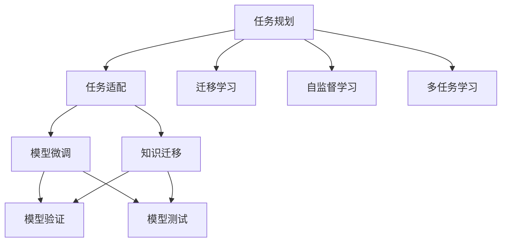

                 

# LLM的任务规划：AI智能的核心机制

> 关键词：

## 1. 背景介绍

### 1.1 问题由来
在人工智能技术日新月异的今天，大型语言模型（Large Language Models, LLMs）已经成为推动AI发展的重要力量。从语言生成到自然语言理解，再到跨领域迁移学习，LLMs在NLP等领域的突破性应用，极大地推动了人工智能技术的进步。然而，仅仅依靠预训练和微调，并不能充分发挥LLMs的潜力。任务规划作为LLMs的核心机制，是使其能够真正应用于实际问题，并持续迭代优化、提升性能的关键。

### 1.2 问题核心关键点
任务规划本质上是一种引导LLMs在特定任务下高效执行的方法。它通过设置合理、具体的目标和路径，使LLMs能够在有限的时间和资源下，针对性地提升任务执行的准确性和效率。具体而言，任务规划涉及以下几个核心要素：

1. **任务定义**：清晰地界定问题的目标和需求，以确保模型能够专注于解决特定问题。
2. **数据选择**：选择和整理最适合特定任务的数据集，以提供模型足够的训练样本。
3. **模型选择**：选择合适的LLM模型，并考虑其在新任务上的适应性。
4. **训练策略**：制定合适的训练方法，确保模型能够充分学习任务相关的特征。
5. **评价指标**：设定合理的评价指标，以评估模型在不同阶段的表现和最终效果。

### 1.3 问题研究意义
任务规划对于LLMs的应用具有重要意义：

1. **提高模型性能**：通过合理的任务规划，LLMs可以在特定任务上取得更好的性能。
2. **加速任务完成**：任务规划可以指导模型更高效地处理任务，减少不必要的工作，提高任务完成速度。
3. **提升资源利用率**：合理的任务规划可以优化资源分配，降低计算和存储成本。
4. **增强泛化能力**：任务规划有助于LLMs在特定领域内更好地泛化，提升对新任务的适应能力。
5. **促进知识积累**：任务规划可以帮助LLMs在执行任务的过程中积累更多知识，提升模型的长期学习能力。

## 2. 核心概念与联系

### 2.1 核心概念概述

为更好地理解LLMs的任务规划机制，本节将介绍几个关键概念及其相互联系：

- **任务规划(Task Planning)**：指根据任务需求，设计合适的训练策略和评价指标，以指导模型在特定任务下高效执行的过程。
- **任务适配(Task Adaptation)**：指通过微调或其他方式，使LLMs能够适应特定任务需求，提升任务执行效果的过程。
- **迁移学习(Transfer Learning)**：指将预训练模型的知识迁移到新任务上的过程，通常通过微调实现。
- **自监督学习(Self-Supervised Learning)**：指利用无标签数据，通过预测任务自我指导学习的过程。
- **多任务学习(Multi-Task Learning)**：指在同一数据集上训练多个相关任务，以提升模型在不同任务上的泛化能力。

这些核心概念通过任务导向的训练和评估，共同构成LLMs高效执行任务的机制。

### 2.2 核心概念原理和架构的 Mermaid 流程图



这个流程图展示了任务规划与任务适配、迁移学习、自监督学习、多任务学习等核心概念之间的联系。任务规划通过合理的训练策略和评价指标，引导模型进行任务适配，提升模型在特定任务上的表现。迁移学习、自监督学习、多任务学习等方法，则通过丰富模型知识，增强其泛化能力和泛化能力，进一步提升任务规划的效果。

## 3. 核心算法原理 & 具体操作步骤

### 3.1 算法原理概述

任务规划的算法原理可以概括为：根据任务需求，设计合适的训练目标和评价指标，选择合适的数据集和模型，并制定具体的训练策略，以指导模型在特定任务下高效执行。

### 3.2 算法步骤详解

#### 3.2.1 任务定义与需求分析

任务规划的第一步是对任务进行定义和需求分析。这包括：

1. **任务目标**：明确任务的目标和预期效果，例如，文本分类任务的目标是准确预测文本所属的类别。
2. **输入输出**：确定任务的输入和输出格式，例如，分类任务输入是文本，输出是类别标签。
3. **任务难度**：评估任务的难度和复杂度，例如，分类任务的难度取决于数据集的类别分布和文本表达的多样性。
4. **性能指标**：设定合适的评价指标，例如，准确率、召回率、F1-score等。

#### 3.2.2 数据选择与预处理

选择合适的数据集是任务规划的关键步骤之一。数据集应具备以下特点：

1. **代表性**：数据集应涵盖任务的所有可能情况，包括正常情况和异常情况。
2. **多样性**：数据集应包括不同来源、不同风格和不同难度的样本，以提升模型的泛化能力。
3. **质量**：数据集应保证数据标注的准确性和一致性，避免噪声数据对模型的影响。

数据预处理包括：

1. **数据清洗**：去除数据集中的噪声、缺失值和异常值。
2. **数据标注**：对数据进行标注，确保标注的一致性和准确性。
3. **数据增强**：通过回译、近义词替换等方式，扩充数据集，增加数据的多样性。

#### 3.2.3 模型选择与适配

选择合适的模型是任务规划的重要步骤之一。模型应具备以下特点：

1. **预训练效果**：模型应在预训练任务上表现良好，例如，BERT在语言模型和掩码语言模型上表现优异。
2. **适应性**：模型应具有较强的迁移学习能力，能够在特定任务上快速适应和优化。
3. **资源消耗**：模型应在计算和存储资源消耗上平衡，以适应实际应用需求。

模型适配包括：

1. **微调**：通过有监督学习，调整模型参数，以适应特定任务需求。
2. **迁移学习**：通过利用预训练模型知识，提升模型在新任务上的泛化能力。
3. **自监督学习**：通过利用无标签数据，提升模型的自我指导学习能力。

#### 3.2.4 训练策略与参数调优

制定合适的训练策略是任务规划的关键步骤之一。训练策略应包括：

1. **学习率**：选择合适的学习率，以避免过拟合或欠拟合。
2. **批次大小**：选择合适的批次大小，以平衡计算效率和模型更新效果。
3. **优化器**：选择合适的优化器，例如，Adam、SGD等。
4. **正则化**：使用L2正则、Dropout等方法，防止过拟合。

参数调优包括：

1. **超参数搜索**：使用网格搜索、随机搜索等方法，寻找最优超参数组合。
2. **早停法**：在验证集上监测模型性能，当性能不再提升时，停止训练，避免过拟合。
3. **学习率衰减**：随着训练进行，逐渐减小学习率，以防止模型过早收敛。

#### 3.2.5 模型验证与测试

模型验证与测试是任务规划的重要步骤之一。验证与测试应包括：

1. **验证集**：使用验证集评估模型性能，避免过拟合。
2. **测试集**：使用测试集评估模型性能，评估模型泛化能力。
3. **对比实验**：与其他模型进行对比实验，评估模型性能。

#### 3.2.6 结果分析和反馈迭代

结果分析和反馈迭代是任务规划的最后一个步骤。这包括：

1. **结果分析**：分析模型在不同数据集和不同训练策略下的性能表现，找出改进点。
2. **反馈迭代**：根据分析结果，调整任务规划策略，进行下一次任务规划。

### 3.3 算法优缺点

任务规划的算法具有以下优点：

1. **提升性能**：通过合理的任务规划，模型能够在特定任务上取得更好的性能。
2. **加速任务完成**：任务规划可以指导模型更高效地处理任务，减少不必要的工作，提高任务完成速度。
3. **提升资源利用率**：合理的任务规划可以优化资源分配，降低计算和存储成本。
4. **增强泛化能力**：任务规划有助于模型在特定领域内更好地泛化，提升对新任务的适应能力。

任务规划的算法也存在以下缺点：

1. **数据依赖**：任务规划高度依赖数据质量，低质量的数据可能导致模型性能不佳。
2. **模型适配复杂**：模型适配过程复杂，需要多次调参和实验。
3. **资源消耗**：任务规划需要消耗大量计算和存储资源，特别是在大规模数据集和模型上。
4. **时间成本**：任务规划需要耗费大量时间，特别是在多次迭代优化时。

尽管存在这些缺点，但任务规划作为LLMs的核心机制，是其在特定任务上高效执行的关键。通过合理的任务规划，LLMs可以在有限的时间和资源下，针对性地提升任务执行的准确性和效率。

### 3.4 算法应用领域

任务规划在NLP领域已经得到了广泛应用，涵盖以下多个方向：

1. **文本分类**：例如，情感分析、主题分类、意图识别等。通过任务规划，模型能够准确预测文本所属的类别。
2. **命名实体识别**：例如，识别文本中的人名、地名、机构名等特定实体。通过任务规划，模型能够准确标注实体的边界和类型。
3. **关系抽取**：例如，从文本中抽取实体之间的语义关系。通过任务规划，模型能够准确预测实体之间的关系类型。
4. **问答系统**：例如，对自然语言问题给出答案。通过任务规划，模型能够准确匹配问题和答案，生成合理回答。
5. **机器翻译**：例如，将源语言文本翻译成目标语言。通过任务规划，模型能够准确转换语言。
6. **文本摘要**：例如，将长文本压缩成简短摘要。通过任务规划，模型能够准确提取文本要点。
7. **对话系统**：例如，使机器能够与人自然对话。通过任务规划，模型能够准确理解用户意图，生成合理回复。

除了上述这些经典任务外，任务规划还被创新性地应用于更多场景中，如可控文本生成、常识推理、代码生成、数据增强等，为NLP技术带来了全新的突破。随着预训练模型和任务规划方法的不断进步，相信NLP技术将在更广阔的应用领域大放异彩。

## 4. 数学模型和公式 & 详细讲解 & 举例说明

### 4.1 数学模型构建

本节将使用数学语言对LLMs的任务规划过程进行更加严格的刻画。

记任务规划模型为 $M_{\theta}$，其中 $\theta$ 为模型参数。假设任务为 $T$，任务数据集为 $D=\{(x_i,y_i)\}_{i=1}^N, x_i \in \mathcal{X}, y_i \in \mathcal{Y}$。

定义模型 $M_{\theta}$ 在数据样本 $(x,y)$ 上的损失函数为 $\ell(M_{\theta}(x),y)$，则在数据集 $D$ 上的经验风险为：

$$
\mathcal{L}(\theta) = \frac{1}{N} \sum_{i=1}^N \ell(M_{\theta}(x_i),y_i)
$$

其中 $\mathcal{L}$ 为针对任务 $T$ 设计的损失函数，用于衡量模型预测输出与真实标签之间的差异。常见的损失函数包括交叉熵损失、均方误差损失等。

### 4.2 公式推导过程

以下我们以二分类任务为例，推导交叉熵损失函数及其梯度的计算公式。

假设模型 $M_{\theta}$ 在输入 $x$ 上的输出为 $\hat{y}=M_{\theta}(x) \in [0,1]$，表示样本属于正类的概率。真实标签 $y \in \{0,1\}$。则二分类交叉熵损失函数定义为：

$$
\ell(M_{\theta}(x),y) = -[y\log \hat{y} + (1-y)\log (1-\hat{y})]
$$

将其代入经验风险公式，得：

$$
\mathcal{L}(\theta) = -\frac{1}{N}\sum_{i=1}^N [y_i\log M_{\theta}(x_i)+(1-y_i)\log(1-M_{\theta}(x_i))]
$$

根据链式法则，损失函数对参数 $\theta_k$ 的梯度为：

$$
\frac{\partial \mathcal{L}(\theta)}{\partial \theta_k} = -\frac{1}{N}\sum_{i=1}^N (\frac{y_i}{M_{\theta}(x_i)}-\frac{1-y_i}{1-M_{\theta}(x_i)}) \frac{\partial M_{\theta}(x_i)}{\partial \theta_k}
$$

其中 $\frac{\partial M_{\theta}(x_i)}{\partial \theta_k}$ 可进一步递归展开，利用自动微分技术完成计算。

在得到损失函数的梯度后，即可带入参数更新公式，完成模型的迭代优化。重复上述过程直至收敛，最终得到适应特定任务的最优模型参数 $\theta^*$。

### 4.3 案例分析与讲解

#### 4.3.1 文本分类任务

以情感分类为例，展示如何通过任务规划进行模型训练和优化。

首先，定义任务和数据集：

1. **任务定义**：情感分类任务的目标是预测文本情感极性，分为正面和负面两类。
2. **输入输出**：输入是文本，输出是情感极性标签。
3. **性能指标**：准确率、召回率和F1-score。

其次，选择和预处理数据集：

1. **数据集选择**：选择包含正面和负面情感的文本数据集，例如，IMDB影评数据集。
2. **数据预处理**：清洗数据集，去除噪声和缺失值，对数据进行标注，并扩充数据集，例如，通过近义词替换增加多样性。

然后，选择模型和适配：

1. **模型选择**：选择预训练的BERT模型。
2. **模型适配**：微调BERT模型，使其能够预测情感极性。

接着，制定训练策略和调优：

1. **学习率**：选择合适的学习率，例如，2e-5。
2. **批次大小**：选择合适的批次大小，例如，16。
3. **优化器**：选择AdamW优化器。
4. **正则化**：使用L2正则和Dropout。

最后，进行模型验证和测试：

1. **验证集**：使用验证集评估模型性能，例如，使用准确率和F1-score。
2. **测试集**：使用测试集评估模型性能，例如，使用准确率和F1-score。

通过任务规划，模型能够准确预测情感极性，提升情感分类任务的效果。

## 5. 项目实践：代码实例和详细解释说明

### 5.1 开发环境搭建

在进行任务规划实践前，我们需要准备好开发环境。以下是使用Python进行PyTorch开发的环境配置流程：

1. 安装Anaconda：从官网下载并安装Anaconda，用于创建独立的Python环境。

2. 创建并激活虚拟环境：
```bash
conda create -n pytorch-env python=3.8 
conda activate pytorch-env
```

3. 安装PyTorch：根据CUDA版本，从官网获取对应的安装命令。例如：
```bash
conda install pytorch torchvision torchaudio cudatoolkit=11.1 -c pytorch -c conda-forge
```

4. 安装Transformers库：
```bash
pip install transformers
```

5. 安装各类工具包：
```bash
pip install numpy pandas scikit-learn matplotlib tqdm jupyter notebook ipython
```

完成上述步骤后，即可在`pytorch-env`环境中开始任务规划实践。

### 5.2 源代码详细实现

这里我们以文本分类任务为例，给出使用Transformers库进行任务规划的PyTorch代码实现。

首先，定义任务数据集和模型：

```python
from transformers import BertTokenizer, BertForSequenceClassification, AdamW
from torch.utils.data import Dataset, DataLoader
import torch

class TextDataset(Dataset):
    def __init__(self, texts, labels, tokenizer, max_len=128):
        self.texts = texts
        self.labels = labels
        self.tokenizer = tokenizer
        self.max_len = max_len
        
    def __len__(self):
        return len(self.texts)
    
    def __getitem__(self, item):
        text = self.texts[item]
        label = self.labels[item]
        
        encoding = self.tokenizer(text, return_tensors='pt', max_length=self.max_len, padding='max_length', truncation=True)
        input_ids = encoding['input_ids'][0]
        attention_mask = encoding['attention_mask'][0]
        
        # 将标签转化为id
        label_id = label2id[label]
        return {'input_ids': input_ids, 
                'attention_mask': attention_mask,
                'labels': torch.tensor(label_id, dtype=torch.long)}
    
# 标签与id的映射
label2id = {'positive': 1, 'negative': 0}

# 创建dataset
tokenizer = BertTokenizer.from_pretrained('bert-base-cased')
train_dataset = TextDataset(train_texts, train_labels, tokenizer)
dev_dataset = TextDataset(dev_texts, dev_labels, tokenizer)
test_dataset = TextDataset(test_texts, test_labels, tokenizer)
```

然后，定义模型和优化器：

```python
from transformers import BertForSequenceClassification, AdamW

model = BertForSequenceClassification.from_pretrained('bert-base-cased', num_labels=len(label2id))

optimizer = AdamW(model.parameters(), lr=2e-5)
```

接着，定义训练和评估函数：

```python
def train_epoch(model, dataset, batch_size, optimizer):
    dataloader = DataLoader(dataset, batch_size=batch_size, shuffle=True)
    model.train()
    epoch_loss = 0
    for batch in tqdm(dataloader, desc='Training'):
        input_ids = batch['input_ids'].to(device)
        attention_mask = batch['attention_mask'].to(device)
        labels = batch['labels'].to(device)
        model.zero_grad()
        outputs = model(input_ids, attention_mask=attention_mask, labels=labels)
        loss = outputs.loss
        epoch_loss += loss.item()
        loss.backward()
        optimizer.step()
    return epoch_loss / len(dataloader)

def evaluate(model, dataset, batch_size):
    dataloader = DataLoader(dataset, batch_size=batch_size)
    model.eval()
    preds, labels = [], []
    with torch.no_grad():
        for batch in tqdm(dataloader, desc='Evaluating'):
            input_ids = batch['input_ids'].to(device)
            attention_mask = batch['attention_mask'].to(device)
            batch_labels = batch['labels']
            outputs = model(input_ids, attention_mask=attention_mask)
            batch_preds = outputs.logits.argmax(dim=2).to('cpu').tolist()
            batch_labels = batch_labels.to('cpu').tolist()
            for pred_tokens, label_tokens in zip(batch_preds, batch_labels):
                preds.append(pred_tokens)
                labels.append(label_tokens)
                
    print(classification_report(labels, preds))
```

最后，启动训练流程并在测试集上评估：

```python
epochs = 5
batch_size = 16

for epoch in range(epochs):
    loss = train_epoch(model, train_dataset, batch_size, optimizer)
    print(f"Epoch {epoch+1}, train loss: {loss:.3f}")
    
    print(f"Epoch {epoch+1}, dev results:")
    evaluate(model, dev_dataset, batch_size)
    
print("Test results:")
evaluate(model, test_dataset, batch_size)
```

以上就是使用PyTorch进行文本分类任务规划的完整代码实现。可以看到，得益于Transformers库的强大封装，我们可以用相对简洁的代码完成BERT模型的任务规划和微调。

### 5.3 代码解读与分析

让我们再详细解读一下关键代码的实现细节：

**TextDataset类**：
- `__init__`方法：初始化文本、标签、分词器等关键组件。
- `__len__`方法：返回数据集的样本数量。
- `__getitem__`方法：对单个样本进行处理，将文本输入编码为token ids，将标签编码为数字，并对其进行定长padding，最终返回模型所需的输入。

**label2id字典**：
- 定义了标签与数字id之间的映射关系，用于将预测结果解码回真实的标签。

**训练和评估函数**：
- 使用PyTorch的DataLoader对数据集进行批次化加载，供模型训练和推理使用。
- 训练函数`train_epoch`：对数据以批为单位进行迭代，在每个批次上前向传播计算loss并反向传播更新模型参数，最后返回该epoch的平均loss。
- 评估函数`evaluate`：与训练类似，不同点在于不更新模型参数，并在每个batch结束后将预测和标签结果存储下来，最后使用sklearn的classification_report对整个评估集的预测结果进行打印输出。

**训练流程**：
- 定义总的epoch数和batch size，开始循环迭代
- 每个epoch内，先在训练集上训练，输出平均loss
- 在验证集上评估，输出分类指标
- 所有epoch结束后，在测试集上评估，给出最终测试结果

可以看到，PyTorch配合Transformers库使得任务规划和微调的代码实现变得简洁高效。开发者可以将更多精力放在数据处理、模型改进等高层逻辑上，而不必过多关注底层的实现细节。

当然，工业级的系统实现还需考虑更多因素，如模型的保存和部署、超参数的自动搜索、更灵活的任务适配层等。但核心的任务规划和微调范式基本与此类似。

## 6. 实际应用场景
### 6.1 智能客服系统

基于任务规划的对话技术，可以广泛应用于智能客服系统的构建。传统客服往往需要配备大量人力，高峰期响应缓慢，且一致性和专业性难以保证。而使用任务规划后的对话模型，可以7x24小时不间断服务，快速响应客户咨询，用自然流畅的语言解答各类常见问题。

在技术实现上，可以收集企业内部的历史客服对话记录，将问题和最佳答复构建成监督数据，在此基础上对预训练对话模型进行任务规划。任务规划后的对话模型能够自动理解用户意图，匹配最合适的答案模板进行回复。对于客户提出的新问题，还可以接入检索系统实时搜索相关内容，动态组织生成回答。如此构建的智能客服系统，能大幅提升客户咨询体验和问题解决效率。

### 6.2 金融舆情监测

金融机构需要实时监测市场舆论动向，以便及时应对负面信息传播，规避金融风险。传统的人工监测方式成本高、效率低，难以应对网络时代海量信息爆发的挑战。基于任务规划的文本分类和情感分析技术，为金融舆情监测提供了新的解决方案。

具体而言，可以收集金融领域相关的新闻、报道、评论等文本数据，并对其进行主题标注和情感标注。在此基础上对预训练语言模型进行任务规划，使其能够自动判断文本属于何种主题，情感倾向是正面、中性还是负面。将任务规划后的模型应用到实时抓取的网络文本数据，就能够自动监测不同主题下的情感变化趋势，一旦发现负面信息激增等异常情况，系统便会自动预警，帮助金融机构快速应对潜在风险。

### 6.3 个性化推荐系统

当前的推荐系统往往只依赖用户的历史行为数据进行物品推荐，无法深入理解用户的真实兴趣偏好。基于任务规划的个性化推荐系统可以更好地挖掘用户行为背后的语义信息，从而提供更精准、多样的推荐内容。

在实践中，可以收集用户浏览、点击、评论、分享等行为数据，提取和用户交互的物品标题、描述、标签等文本内容。将文本内容作为模型输入，用户的后续行为（如是否点击、购买等）作为监督信号，在此基础上进行任务规划和微调。任务规划后的模型能够从文本内容中准确把握用户的兴趣点。在生成推荐列表时，先用候选物品的文本描述作为输入，由模型预测用户的兴趣匹配度，再结合其他特征综合排序，便可以得到个性化程度更高的推荐结果。

### 6.4 未来应用展望

随着任务规划方法的发展，基于大语言模型的应用场景将更加广泛，为各行各业带来变革性影响。

在智慧医疗领域，基于任务规划的医疗问答、病历分析、药物研发等应用将提升医疗服务的智能化水平，辅助医生诊疗，加速新药开发进程。

在智能教育领域，任务规划技术可应用于作业批改、学情分析、知识推荐等方面，因材施教，促进教育公平，提高教学质量。

在智慧城市治理中，任务规划模型可应用于城市事件监测、舆情分析、应急指挥等环节，提高城市管理的自动化和智能化水平，构建更安全、高效的未来城市。

此外，在企业生产、社会治理、文娱传媒等众多领域，基于大模型任务规划的人工智能应用也将不断涌现，为经济社会发展注入新的动力。相信随着技术的日益成熟，任务规划方法将成为人工智能落地应用的重要范式，推动人工智能技术在垂直行业的规模化落地。

## 7. 工具和资源推荐
### 7.1 学习资源推荐

为了帮助开发者系统掌握任务规划的理论基础和实践技巧，这里推荐一些优质的学习资源：

1. 《Transformer从原理到实践》系列博文：由大模型技术专家撰写，深入浅出地介绍了Transformer原理、BERT模型、任务规划技术等前沿话题。

2. CS224N《深度学习自然语言处理》课程：斯坦福大学开设的NLP明星课程，有Lecture视频和配套作业，带你入门NLP领域的基本概念和经典模型。

3. 《Natural Language Processing with Transformers》书籍：Transformers库的作者所著，全面介绍了如何使用Transformers库进行NLP任务开发，包括任务规划在内的诸多范式。

4. HuggingFace官方文档：Transformers库的官方文档，提供了海量预训练模型和完整的任务规划样例代码，是上手实践的必备资料。

5. CLUE开源项目：中文语言理解测评基准，涵盖大量不同类型的中文NLP数据集，并提供了基于任务规划的baseline模型，助力中文NLP技术发展。

通过对这些资源的学习实践，相信你一定能够快速掌握任务规划的精髓，并用于解决实际的NLP问题。
###  7.2 开发工具推荐

高效的开发离不开优秀的工具支持。以下是几款用于任务规划开发的常用工具：

1. PyTorch：基于Python的开源深度学习框架，灵活动态的计算图，适合快速迭代研究。大部分预训练语言模型都有PyTorch版本的实现。

2. TensorFlow：由Google主导开发的开源深度学习框架，生产部署方便，适合大规模工程应用。同样有丰富的预训练语言模型资源。

3. Transformers库：HuggingFace开发的NLP工具库，集成了众多SOTA语言模型，支持PyTorch和TensorFlow，是进行任务规划开发的利器。

4. Weights & Biases：模型训练的实验跟踪工具，可以记录和可视化模型训练过程中的各项指标，方便对比和调优。与主流深度学习框架无缝集成。

5. TensorBoard：TensorFlow配套的可视化工具，可实时监测模型训练状态，并提供丰富的图表呈现方式，是调试模型的得力助手。

6. Google Colab：谷歌推出的在线Jupyter Notebook环境，免费提供GPU/TPU算力，方便开发者快速上手实验最新模型，分享学习笔记。

合理利用这些工具，可以显著提升任务规划任务的开发效率，加快创新迭代的步伐。

### 7.3 相关论文推荐

任务规划技术的发展源于学界的持续研究。以下是几篇奠基性的相关论文，推荐阅读：

1. Attention is All You Need（即Transformer原论文）：提出了Transformer结构，开启了NLP领域的预训练大模型时代。

2. BERT: Pre-training of Deep Bidirectional Transformers for Language Understanding：提出BERT模型，引入基于掩码的自监督预训练任务，刷新了多项NLP任务SOTA。

3. Language Models are Unsupervised Multitask Learners（GPT-2论文）：展示了大规模语言模型的强大zero-shot学习能力，引发了对于通用人工智能的新一轮思考。

4. Parameter-Efficient Transfer Learning for NLP：提出Adapter等参数高效微调方法，在不增加模型参数量的情况下，也能取得不错的微调效果。

5. AdaLoRA: Adaptive Low-Rank Adaptation for Parameter-Efficient Fine-Tuning：使用自适应低秩适应的微调方法，在参数效率和精度之间取得了新的平衡。

这些论文代表了大语言模型任务规划技术的发展脉络。通过学习这些前沿成果，可以帮助研究者把握学科前进方向，激发更多的创新灵感。

## 8. 总结：未来发展趋势与挑战

### 8.1 总结

本文对基于任务规划的大语言模型应用进行了全面系统的介绍。首先阐述了任务规划的定义、核心要素和应用意义，明确了任务规划在提升模型性能、加速任务完成、优化资源利用率等方面的价值。其次，从原理到实践，详细讲解了任务规划的数学原理和关键步骤，给出了任务规划任务开发的完整代码实例。同时，本文还广泛探讨了任务规划在智能客服、金融舆情、个性化推荐等多个行业领域的应用前景，展示了任务规划范式的巨大潜力。此外，本文精选了任务规划技术的各类学习资源，力求为读者提供全方位的技术指引。

通过本文的系统梳理，可以看到，基于大语言模型的任务规划方法正在成为NLP领域的重要范式，极大地拓展了预训练语言模型的应用边界，催生了更多的落地场景。受益于大规模语料的预训练和任务规划的优化，任务规划后的模型能够在特定任务上取得更好的性能，提升模型执行的准确性和效率。未来，伴随任务规划方法的不断进步，基于大语言模型的应用场景将更加广泛，为各行各业带来变革性影响。

### 8.2 未来发展趋势

展望未来，大语言模型的任务规划技术将呈现以下几个发展趋势：

1. **任务规划自动化**：任务规划将逐步实现自动化，自动选择最优数据集、模型和训练策略，提升任务规划的效率和效果。
2. **多任务联合规划**：多任务联合规划技术将进一步发展，实现任务之间的知识迁移和协同学习，提升模型的泛化能力和任务规划效果。
3. **迁移学习与自监督学习结合**：迁移学习与自监督学习将更加紧密结合，通过多源数据和预训练知识的综合利用，提升任务规划的效果。
4. **持续学习与任务规划结合**：持续学习技术与任务规划技术的结合，使模型能够在数据分布变化时，自动更新任务规划策略，保持模型的长期适应能力。
5. **可解释性增强**：任务规划过程中的决策过程将更加透明，模型的解释性将得到增强，提升用户对模型的信任度。
6. **跨领域任务规划**：任务规划技术将进一步扩展到跨领域任务规划，使模型能够更好地适应不同领域的任务需求。

以上趋势凸显了大语言模型任务规划技术的广阔前景。这些方向的探索发展，必将进一步提升任务规划的效果，使得大语言模型在更多领域内实现更好的性能和更广泛的应用。

### 8.3 面临的挑战

尽管大语言模型任务规划技术已经取得了瞩目成就，但在迈向更加智能化、普适化应用的过程中，它仍面临诸多挑战：

1. **数据依赖**：任务规划高度依赖数据质量，低质量的数据可能导致模型性能不佳。如何构建高质量的数据集，提升数据的多样性和代表性，是任务规划的重要挑战。
2. **模型适配复杂**：模型适配过程复杂，需要多次调参和实验。如何提高模型适配的效率和效果，是任务规划面临的重要问题。
3. **资源消耗**：任务规划需要消耗大量计算和存储资源，特别是在大规模数据集和模型上。如何在保证性能的同时，优化资源使用，降低计算成本，是任务规划的重要挑战。
4. **时间成本**：任务规划需要耗费大量时间，特别是在多次迭代优化时。如何提高任务规划的效率，缩短任务规划时间，是任务规划的重要目标。
5. **可解释性不足**：任务规划过程中的决策过程缺乏可解释性，难以对其推理逻辑进行分析和调试。如何提高模型的可解释性，是任务规划的重要方向。
6. **安全性问题**：任务规划后的模型在实际应用中，可能会引入有偏见、有害的信息，导致安全问题。如何保证模型的安全性，是任务规划的重要挑战。

尽管存在这些挑战，但任务规划作为大语言模型的核心机制，是其在特定任务上高效执行的关键。通过合理的任务规划，大语言模型可以在有限的时间和资源下，针对性地提升任务执行的准确性和效率。未来，随着技术的不断进步，这些挑战有望逐步得到解决，任务规划方法将在构建智能系统时发挥更大的作用。

### 8.4 研究展望

面对任务规划所面临的种种挑战，未来的研究需要在以下几个方面寻求新的突破：

1. **无监督和半监督任务规划**：探索无监督和半监督任务规划方法，摆脱对大规模标注数据的依赖，利用自监督学习、主动学习等无监督和半监督范式，最大限度利用非结构化数据，实现更加灵活高效的任务规划。
2. **多模态任务规划**：引入更多先验知识，将符号化的先验知识与神经网络模型进行融合，提升任务规划的效果。同时加强不同模态数据的整合，实现视觉、语音等多模态信息与文本信息的协同建模。
3. **因果分析和博弈论工具结合**：将因果分析方法引入任务规划，识别出任务规划过程中的关键特征，增强任务规划的因果性和逻辑性。借助博弈论工具刻画人机交互过程，主动探索并规避任务规划过程中的脆弱点，提高系统稳定性。
4. **模型集成与协同优化**：研究多模型集成和协同优化方法，提高任务规划的效率和效果。
5. **知识图谱与任务规划结合**：将知识图谱与任务规划结合，增强任务规划过程中的知识迁移和推理能力。

这些研究方向的探索，必将引领任务规划技术迈向更高的台阶，为构建安全、可靠、可解释、可控的智能系统铺平道路。面向未来，大语言模型任务规划技术还需要与其他人工智能技术进行更深入的融合，如知识表示、因果推理、强化学习等，多路径协同发力，共同推动自然语言理解和智能交互系统的进步。只有勇于创新、敢于突破，才能不断拓展语言模型的边界，让智能技术更好地造福人类社会。

## 9. 附录：常见问题与解答

**Q1：任务规划是否适用于所有NLP任务？**

A: 任务规划在大多数NLP任务上都能取得不错的效果，特别是对于数据量较小的任务。但对于一些特定领域的任务，如医学、法律等，仅仅依靠通用语料预训练的模型可能难以很好地适应。此时需要在特定领域语料上进一步预训练，再进行任务规划，才能获得理想效果。此外，对于一些需要时效性、个性化很强的任务，如对话、推荐等，任务规划方法也需要针对性的改进优化。

**Q2：任务规划过程中如何选择合适的数据集？**

A: 选择合适的数据集是任务规划的关键步骤之一。数据集应具备以下特点：

1. **代表性**：数据集应涵盖任务的所有可能情况，包括正常情况和异常情况。
2. **多样性**：数据集应包括不同来源、不同风格和不同难度的样本，以提升模型的泛化能力。
3. **质量**：数据集应保证数据标注的准确性和一致性，避免噪声数据对模型的影响。

**Q3：任务规划中的超参数如何选择？**

A: 任务规划中的超参数选择是任务规划的重要步骤之一。超参数选择应考虑以下因素：

1. **学习率**：选择合适的学习率，以避免过拟合或欠拟合。
2. **批次大小**：选择合适的批次大小，以平衡计算效率和模型更新效果。
3. **优化器**：选择合适的优化器，例如，Adam、SGD等。
4. **正则化**：使用L2正则、Dropout等方法，防止过拟合。

**Q4：任务规划后的模型在实际应用中需要注意哪些问题？**

A: 将任务规划后的模型转化为实际应用，还需要考虑以下因素：

1. **模型裁剪**：去除不必要的层和参数，减小模型尺寸，加快推理速度。
2. **量化加速**：将浮点模型转为定点模型，压缩存储空间，提高计算效率。
3. **服务化封装**：将模型封装为标准化服务接口，便于集成调用。
4. **弹性伸缩**：根据请求流量动态调整资源配置，平衡服务质量和成本。
5. **监控告警**：实时采集系统指标，设置异常告警阈值，确保服务稳定性。

大语言模型任务规划为NLP应用开启了广阔的想象空间，但如何将强大的性能转化为稳定、高效、安全的业务价值，还需要工程实践的不断打磨。唯有从数据、算法、工程、业务等多个维度协同发力，才能真正实现人工智能技术在垂直行业的规模化落地。总之，任务规划需要开发者根据具体任务，不断迭代和优化模型、数据和算法，方能得到理想的效果。

---

作者：禅与计算机程序设计艺术 / Zen and the Art of Computer Programming

