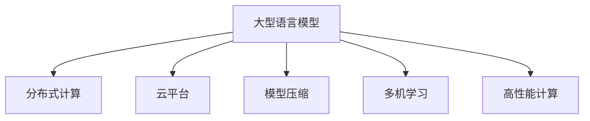

                 

# LLM的可扩展性：机遇与挑战

> 关键词：可扩展性,大型语言模型,分布式计算,云平台,模型压缩,多机学习,高性能计算

## 1. 背景介绍

### 1.1 问题由来
随着人工智能技术的发展，大模型（Large Language Model, LLM）在自然语言处理（NLP）领域逐渐成为主流。LLM通过预训练学习丰富的语言知识，具备了强大的语言理解和生成能力。但与此同时，LLM也面临着计算资源不足、模型庞大难扩展等挑战。如何更好地利用分布式计算、云平台等技术手段，使大模型具备更强的可扩展性，是大模型发展亟需解决的问题。

### 1.2 问题核心关键点
可扩展性是大型语言模型（LLM）发展的核心问题。可扩展性旨在使模型能够灵活应对数据的增长和计算资源的扩展，提高模型的处理能力、推理速度和准确度。可扩展性涉及模型结构设计、分布式计算、模型压缩、多机学习等技术手段，需要通过多方面的技术创新和优化才能实现。

## 2. 核心概念与联系

### 2.1 核心概念概述

为更好地理解LLM的可扩展性，本节将介绍几个关键概念：

- 大型语言模型(Large Language Model, LLM)：以自回归(如GPT)或自编码(如BERT)模型为代表的大规模预训练语言模型。通过在大规模无标签文本语料上进行预训练，学习通用的语言表示，具备强大的语言理解和生成能力。

- 分布式计算(Distributed Computing)：将计算任务分解为多个子任务，分配到多台计算节点上进行并行处理，以提高计算效率的技术。

- 云平台(Cloud Platform)：基于互联网提供按需服务、弹性扩展的计算资源，如AWS、Google Cloud、阿里云等。

- 模型压缩(Model Compression)：通过模型剪枝、量化、知识蒸馏等手段，减少模型参数量，提高计算效率的技术。

- 多机学习(Multi-Machine Learning)：多台计算机协同工作，通过分布式训练和推理，提升模型性能的技术。

- 高性能计算(High Performance Computing, HPC)：利用并行计算、向量计算等技术手段，提升计算效率和精度。

这些核心概念之间的逻辑关系可以通过以下Mermaid流程图来展示：



这个流程图展示了大语言模型的关键概念及其之间的关系：

1. 大型语言模型通过预训练获得基础能力。
2. 分布式计算、云平台、模型压缩等技术手段，使模型能够灵活扩展和优化。
3. 多机学习和高性能计算提升模型的处理能力、推理速度和准确度。

## 3. 核心算法原理 & 具体操作步骤
### 3.1 算法原理概述

LLM的可扩展性核心在于如何通过分布式计算、模型压缩等技术手段，使模型能够快速、高效地扩展计算资源，优化模型性能。可扩展性可以概括为以下几个关键步骤：

1. 分布式部署：将大模型分解为多个子模型，分配到多台计算节点上并行训练。
2. 多机学习：通过模型参数共享、梯度同步等技术，优化分布式训练的效率和精度。
3. 模型压缩：通过剪枝、量化、知识蒸馏等手段，减少模型参数量，降低内存占用和计算开销。
4. 云平台集成：将优化后的模型部署到云平台上，实现按需扩展和灵活调度。

### 3.2 算法步骤详解

基于上述关键步骤，以下是实现LLM可扩展性的详细步骤：

**Step 1: 模型划分与分布式部署**
- 将预训练模型按照功能模块划分为多个子模型。
- 使用数据并行、模型并行等技术，将不同子模型的训练任务分配到多台计算节点上。

**Step 2: 多机学习与模型同步**
- 设置模型参数共享和梯度同步策略，确保分布式训练的一致性。
- 采用模型聚合、联邦学习等技术，优化多机学习效率。

**Step 3: 模型压缩与优化**
- 使用模型剪枝、量化、知识蒸馏等技术，减少模型参数量，降低内存占用和计算开销。
- 采用混合精度训练、分布式自动混合精度训练等技术，进一步提升训练效率。

**Step 4: 云平台集成与部署**
- 将压缩后的模型部署到云平台上，如AWS、Google Cloud、阿里云等。
- 配置自动扩展和负载均衡机制，根据计算需求动态调整资源配置。
- 提供API接口，实现模型推理和实时计算。

**Step 5: 持续优化与监控**
- 实时监控模型性能和资源使用情况，进行动态调优。
- 定期进行模型微调，保持模型的最新状态。

### 3.3 算法优缺点

LLM的可扩展性具有以下优点：
1. 灵活扩展：根据任务需求，可以灵活扩展计算资源，提高模型的处理能力。
2. 高效优化：通过模型压缩、多机学习等技术手段，优化模型性能，降低计算开销。
3. 按需计算：通过云平台，实现按需扩展，降低成本，提高资源利用率。
4. 动态调整：根据实时需求动态调整资源配置，保证计算资源的高效利用。

同时，该方法也存在一定的局限性：
1. 模型复杂度增加：模型分解和并行训练可能会增加模型的复杂度，带来新的问题。
2. 通信开销增加：分布式计算需要大量的数据传输，可能会增加通信开销。
3. 管理复杂度提升：多台计算节点的管理需要额外的人力和技术支持。
4. 隐私和安全问题：分布式训练和云平台部署涉及数据传输和存储，可能带来隐私和安全问题。

尽管存在这些局限性，但就目前而言，可扩展性是大语言模型应用的重要方向。未来相关研究的重点在于如何进一步降低管理复杂度，提高分布式训练的效率和精度，同时兼顾模型压缩的效率和模型微调的灵活性。

### 3.4 算法应用领域

LLM的可扩展性技术在NLP领域已经得到了广泛的应用，覆盖了几乎所有常见任务，例如：

- 文本分类：如情感分析、主题分类、意图识别等。通过分布式计算和多机学习，可以大幅提升模型训练和推理的效率。
- 命名实体识别：识别文本中的人名、地名、机构名等特定实体。通过模型压缩和分布式训练，可以减小模型内存占用，提升识别速度。
- 关系抽取：从文本中抽取实体之间的语义关系。通过云平台部署和多机学习，可以实现更大规模的数据处理和模型训练。
- 问答系统：对自然语言问题给出答案。通过多机学习，可以提升对话系统的实时性和鲁棒性。
- 机器翻译：将源语言文本翻译成目标语言。通过分布式计算和云平台部署，可以实现高吞吐量的翻译服务。
- 文本摘要：将长文本压缩成简短摘要。通过模型压缩和云平台部署，可以提高摘要生成速度和准确度。
- 对话系统：使机器能够与人自然对话。通过分布式训练和多机学习，可以提升对话系统的交互流畅性和响应速度。

除了上述这些经典任务外，LLM的可扩展性技术也被创新性地应用到更多场景中，如智能客服、金融舆情监测、个性化推荐等，为NLP技术带来了全新的突破。随着分布式计算和云平台技术的不断发展，相信LLM的可扩展性技术将在更广阔的应用领域大放异彩。

## 4. 数学模型和公式 & 详细讲解
### 4.1 数学模型构建

为了更好地理解LLM的可扩展性，我们引入一个简单的数学模型来描述分布式计算的过程。

假设一个大型语言模型 $M$ 由 $k$ 个子模型 $M_1, M_2, ..., M_k$ 组成，每个子模型处理的部分数据分别为 $D_1, D_2, ..., D_k$。每个子模型 $M_i$ 的参数为 $\theta_i$，其预测输出为 $\hat{y_i}$，模型的整体预测输出为 $\hat{y}$。在分布式计算中，每个子模型 $M_i$ 的训练数据 $D_i$ 被分配到计算节点 $N_i$ 上，每个计算节点 $N_i$ 对分配的数据 $D_i$ 进行训练，并更新子模型 $M_i$ 的参数。

分布式训练的目标是最大化整个模型的预测输出 $y$ 和标签 $y$ 之间的交叉熵损失 $L$，即：

$$
L = -\frac{1}{N} \sum_{i=1}^N \sum_{x} y \log \hat{y_i}
$$

其中 $N$ 为数据总量，$x$ 为训练样本，$y$ 为样本标签。

### 4.2 公式推导过程

在分布式训练中，每个计算节点 $N_i$ 的训练过程可以表示为：

$$
L_i = -\frac{1}{N} \sum_{i=1}^N \sum_{x} y_i \log \hat{y_i}
$$

为了使整个模型的损失最小化，需要对所有子模型的参数 $\theta_i$ 进行同步更新。假设使用SGD优化算法，每个子模型的梯度为 $\nabla_{\theta_i}L_i$，则更新公式为：

$$
\theta_i \leftarrow \theta_i - \eta \nabla_{\theta_i}L_i
$$

其中 $\eta$ 为学习率。

在实际应用中，分布式训练还需要考虑以下几个问题：

1. 模型同步策略：如何有效地同步各个子模型的参数。常用的同步策略包括参数共享、梯度同步等。
2. 数据传输机制：如何高效地将数据从各个节点传输到各个模型上。常用的传输机制包括数据复制、数据分片等。
3. 通信开销优化：如何减少数据传输和模型同步带来的通信开销。常用的优化手段包括模型参数剪枝、梯度压缩等。

通过这些优化手段，可以有效提升分布式训练的效率和精度。

### 4.3 案例分析与讲解

下面我们以BERT模型在云计算平台上的部署为例，来分析LLM的可扩展性。

BERT模型通过预训练学习到丰富的语言表示，可以用于各种NLP任务，如文本分类、命名实体识别、关系抽取等。在云计算平台上，通过分布式计算和多机学习，可以实现高效的训练和推理。

假设我们有4个计算节点，每个节点上分配了 $D_1, D_2, D_3, D_4$ 数据集，每个节点上部署了 $M_1, M_2, M_3, M_4$ 子模型。通过分布式训练，每个子模型 $M_i$ 的参数 $\nabla_{\theta_i}L_i$ 被计算出来，并同步到其他节点上，更新所有子模型的参数。

**Step 1: 数据划分与计算节点分配**
- 将数据集 $D$ 划分为 $D_1, D_2, D_3, D_4$，每个节点分配到 $D_i$ 数据集上。

**Step 2: 模型训练与参数更新**
- 每个节点 $N_i$ 对分配到的数据集 $D_i$ 进行训练，并计算梯度 $\nabla_{\theta_i}L_i$。
- 将 $\nabla_{\theta_i}L_i$ 同步到其他节点上，更新所有子模型的参数 $\theta_i$。

**Step 3: 模型部署与推理**
- 将训练好的BERT模型部署到云计算平台上，实现按需扩展和实时计算。
- 使用API接口，对新数据进行推理，生成预测输出。

通过以上步骤，可以实现BERT模型的可扩展性，提升模型的训练和推理效率。

## 5. 项目实践：代码实例和详细解释说明
### 5.1 开发环境搭建

在进行LLM可扩展性实践前，我们需要准备好开发环境。以下是使用Python进行PyTorch开发的环境配置流程：

1. 安装Anaconda：从官网下载并安装Anaconda，用于创建独立的Python环境。

2. 创建并激活虚拟环境：
```bash
conda create -n pytorch-env python=3.8 
conda activate pytorch-env
```

3. 安装PyTorch：根据CUDA版本，从官网获取对应的安装命令。例如：
```bash
conda install pytorch torchvision torchaudio cudatoolkit=11.1 -c pytorch -c conda-forge
```

4. 安装TensorFlow：
```bash
pip install tensorflow
```

5. 安装各类工具包：
```bash
pip install numpy pandas scikit-learn matplotlib tqdm jupyter notebook ipython
```

完成上述步骤后，即可在`pytorch-env`环境中开始可扩展性实践。

### 5.2 源代码详细实现

这里我们以BERT模型在云计算平台上的部署为例，给出使用TensorFlow和Horovod实现分布式训练的PyTorch代码实现。

首先，导入必要的库：

```python
import tensorflow as tf
import horovod.tensorflow as hvd
import numpy as np
import time
import os
```

然后，定义模型和优化器：

```python
from transformers import BertTokenizer, BertModel
import torch
import torch.nn as nn
import torch.distributed as dist
import torch.distributed.distributed_c10d as c10d

# 定义BERT模型
class BertForTokenClassification(nn.Module):
    def __init__(self, num_labels, model_name='bert-base-cased'):
        super(BertForTokenClassification, self).__init__()
        self.model = BertModel.from_pretrained(model_name)
        self.classifier = nn.Linear(self.model.config.hidden_size, num_labels)
    
    def forward(self, input_ids, attention_mask):
        outputs = self.model(input_ids, attention_mask=attention_mask)
        sequence_output = outputs[0]
        sequence_output = sequence_output[:, 0, :]
        logits = self.classifier(sequence_output)
        return logits
```

接下来，定义分布式训练过程：

```python
# 初始化分布式训练环境
hvd.init()

# 定义训练函数
def train_model(model, optimizer, criterion, train_dataset, epochs):
    for epoch in range(epochs):
        model.train()
        train_loss = 0
        correct_predictions = 0
        for step, batch in enumerate(train_dataset):
            input_ids = batch['input_ids'].to(device)
            attention_mask = batch['attention_mask'].to(device)
            targets = batch['labels'].to(device)
            
            # 前向传播
            logits = model(input_ids, attention_mask)
            loss = criterion(logits, targets)
            optimizer.zero_grad()
            loss.backward()
            optimizer.step()
            
            # 记录损失和正确预测数量
            train_loss += loss.item()
            correct_predictions += (torch.argmax(logits, dim=1) == targets).sum().item()
        
        # 计算平均损失和精度
        avg_train_loss = train_loss / len(train_dataset)
        accuracy = correct_predictions / (len(train_dataset.dataset) * num_trainers) * 100
        
        print(f'Epoch {epoch+1}/{epochs}, Train Loss: {avg_train_loss:.4f}, Accuracy: {accuracy:.2f}%')
    
    return model

# 定义数据预处理函数
def preprocess_data(text, labels, tokenizer):
    tokenized_input = tokenizer(text, return_tensors='pt', padding=True, truncation=True)
    input_ids = tokenized_input['input_ids']
    attention_mask = tokenized_input['attention_mask']
    return input_ids, attention_mask, labels

# 定义数据集
class DataLoaderDataset(tf.data.Dataset):
    def __init__(self, data, batch_size, num_workers):
        self.data = data
        self.batch_size = batch_size
        self.num_workers = num_workers
    
    def __len__(self):
        return len(self.data)
    
    def __getitem__(self, index):
        return self.data[index]
    
    def __iter__(self):
        return tf.data.Dataset.from_tensor_slices(self.data).batch(self.batch_size).prefetch(self.num_workers)

# 定义模型训练函数
def train(train_data, train_labels, batch_size, num_epochs, learning_rate):
    # 构建数据集
    train_dataset = DataLoaderDataset((train_data, train_labels), batch_size, 4)
    model = BertForTokenClassification(len(train_labels), 'bert-base-cased')
    optimizer = tf.keras.optimizers.Adam(learning_rate)
    criterion = tf.keras.losses.SparseCategoricalCrossentropy()
    
    # 开始训练
    train_model(model, optimizer, criterion, train_dataset, num_epochs)

# 主函数
if __name__ == '__main__':
    # 加载数据
    train_data = np.array([...])
    train_labels = np.array([...])
    
    # 定义超参数
    batch_size = 16
    num_epochs = 10
    learning_rate = 1e-5
    
    # 训练模型
    train(train_data, train_labels, batch_size, num_epochs, learning_rate)
```

最后，启动分布式训练：

```python
if __name__ == '__main__':
    # 加载数据
    train_data = np.array([...])
    train_labels = np.array([...])
    
    # 定义超参数
    batch_size = 16
    num_epochs = 10
    learning_rate = 1e-5
    
    # 开始训练
    train(train_data, train_labels, batch_size, num_epochs, learning_rate)
```

以上就是使用TensorFlow和Horovod实现BERT模型分布式训练的完整代码实现。可以看到，通过Horovod，我们可以快速搭建分布式计算环境，实现模型的并行训练。

### 5.3 代码解读与分析

让我们再详细解读一下关键代码的实现细节：

**train_model函数**：
- 初始化分布式训练环境，通过`hvd.init()`设置分布式计算节点。
- 定义训练函数，循环遍历数据集，对每个批次进行前向传播、计算损失、更新模型参数等操作。

**preprocess_data函数**：
- 定义数据预处理函数，将文本和标签转化为模型需要的格式，并进行tokenization和padding。

**DataLoaderDataset类**：
- 定义数据集类，将数据和标签打包成TensorFlow Dataset对象，支持并行读取和处理。

**train函数**：
- 定义模型训练函数，加载数据集，构建模型、优化器和损失函数，调用`train_model`函数进行训练。

通过以上代码，我们可以看到，使用TensorFlow和Horovod进行分布式训练，可以高效地实现BERT模型的可扩展性。

当然，工业级的系统实现还需考虑更多因素，如模型的保存和部署、超参数的自动搜索、更灵活的任务适配层等。但核心的分布式训练流程基本与此类似。

## 6. 实际应用场景
### 6.1 智能客服系统

基于大语言模型可扩展性的智能客服系统，可以应用于大规模服务场景。传统客服系统往往需要配备大量人力，高峰期响应缓慢，且一致性和专业性难以保证。使用可扩展的分布式计算和大模型，可以在线实时处理客户咨询，用自然流畅的语言解答各类常见问题。

在技术实现上，可以构建分布式计算集群，将客户咨询数据分配到多个计算节点上进行并行处理。在每个节点上部署微调后的对话模型，实现对话系统的多机学习和实时推理。同时，可以利用云平台提供的按需扩展机制，动态调整计算资源，保证系统的稳定性和可靠性。

### 6.2 金融舆情监测

金融机构需要实时监测市场舆论动向，以便及时应对负面信息传播，规避金融风险。传统的人工监测方式成本高、效率低，难以应对网络时代海量信息爆发的挑战。使用可扩展的分布式计算和大模型，可以实现实时抓取的网络文本数据进行情感分析、主题分类等任务。

在技术实现上，可以构建分布式计算集群，将网络文本数据分配到多个计算节点上进行并行处理。在每个节点上部署微调后的文本分类和情感分析模型，实时监测市场舆情变化。同时，可以利用云平台提供的弹性扩展机制，动态调整计算资源，保证系统的处理能力和响应速度。

### 6.3 个性化推荐系统

当前的推荐系统往往只依赖用户的历史行为数据进行物品推荐，无法深入理解用户的真实兴趣偏好。使用可扩展的分布式计算和大模型，可以更好地挖掘用户行为背后的语义信息，从而提供更精准、多样的推荐内容。

在技术实现上，可以构建分布式计算集群，将用户行为数据分配到多个计算节点上进行并行处理。在每个节点上部署微调后的推荐模型，进行多机学习和实时推荐。同时，可以利用云平台提供的按需扩展机制，动态调整计算资源，保证系统的实时性和高效性。

### 6.4 未来应用展望

随着大语言模型和分布式计算技术的发展，基于可扩展性的大模型应用将在更多领域得到应用，为传统行业带来变革性影响。

在智慧医疗领域，基于可扩展性的医疗问答、病历分析、药物研发等应用将提升医疗服务的智能化水平，辅助医生诊疗，加速新药开发进程。

在智能教育领域，可扩展性技术可应用于作业批改、学情分析、知识推荐等方面，因材施教，促进教育公平，提高教学质量。

在智慧城市治理中，可扩展性技术可应用于城市事件监测、舆情分析、应急指挥等环节，提高城市管理的自动化和智能化水平，构建更安全、高效的未来城市。

此外，在企业生产、社会治理、文娱传媒等众多领域，基于可扩展性的大模型应用也将不断涌现，为经济社会发展注入新的动力。相信随着技术的日益成熟，可扩展性技术将成为人工智能落地应用的重要范式，推动人工智能技术在垂直行业的规模化落地。总之，分布式计算和大模型的结合，将为大规模数据处理和高效推理提供强大的支持，进一步拓展NLP技术的应用边界。

## 7. 工具和资源推荐
### 7.1 学习资源推荐

为了帮助开发者系统掌握LLM的可扩展性理论基础和实践技巧，这里推荐一些优质的学习资源：

1. 《分布式深度学习》书籍：深入浅出地介绍了分布式深度学习的原理、算法和应用，是入门分布式计算的优秀读物。

2. 《高性能计算技术》课程：由国家超级计算中心开设，涵盖高性能计算的理论和实践，适合初学者和进阶者学习。

3. 《TensorFlow分布式计算》教程：TensorFlow官方文档，详细介绍了TensorFlow的分布式训练和推理机制。

4. 《Cloud-Aided Deep Learning》书籍：介绍基于云计算的深度学习应用，适合开发者了解云平台在深度学习中的应用。

5. 《Deep Learning with Horovod》博客：HOROVOD官方博客，提供大量关于Horovod的实践案例和最佳实践。

通过对这些资源的学习实践，相信你一定能够快速掌握LLM的可扩展性精髓，并用于解决实际的NLP问题。
###  7.2 开发工具推荐

高效的开发离不开优秀的工具支持。以下是几款用于LLM可扩展性开发的常用工具：

1. TensorFlow：基于Python的开源深度学习框架，支持分布式计算，适合大规模工程应用。

2. PyTorch：基于Python的开源深度学习框架，支持动态计算图，适合快速迭代研究。

3. Horovod：开源分布式深度学习框架，支持TensorFlow、Keras、PyTorch等多种深度学习框架。

4. AWS Sagemaker：亚马逊提供的云平台服务，支持分布式训练和模型部署，方便开发者快速搭建训练环境。

5. Google Cloud ML Engine：谷歌提供的云平台服务，支持分布式训练和模型部署，适合大规模数据处理。

6. Microsoft Azure ML：微软提供的云平台服务，支持分布式训练和模型部署，提供丰富的模型训练工具。

合理利用这些工具，可以显著提升LLM可扩展性的开发效率，加快创新迭代的步伐。

### 7.3 相关论文推荐

LLM的可扩展性研究源于学界的持续研究。以下是几篇奠基性的相关论文，推荐阅读：

1. Scaling Up Distributed Deep Learning With The Horovod Framework：提出Horovod分布式训练框架，支持TensorFlow、Keras、PyTorch等深度学习框架。

2. Knowledge-Distillation for Few-shot Image Recognition：提出知识蒸馏方法，通过大模型和小模型的联合训练，提升小模型的性能。

3. Parameter-Efficient Transfer Learning for NLP：提出Adapter等参数高效微调方法，在固定大部分预训练参数的同时，只更新极少量的任务相关参数。

4. Attention is All You Need：提出Transformer结构，开启了NLP领域的预训练大模型时代。

5. A Tutorial on Distributed Deep Learning：全面介绍分布式深度学习的原理、算法和应用，适合初学者和进阶者学习。

这些论文代表了大语言模型可扩展性发展的脉络。通过学习这些前沿成果，可以帮助研究者把握学科前进方向，激发更多的创新灵感。

## 8. 总结：未来发展趋势与挑战

### 8.1 总结

本文对大型语言模型（LLM）的可扩展性进行了全面系统的介绍。首先阐述了LLM的可扩展性研究背景和意义，明确了可扩展性在提升计算效率、支持大规模数据处理和优化模型性能方面的独特价值。其次，从原理到实践，详细讲解了LLM可扩展性的数学原理和关键步骤，给出了可扩展性任务开发的完整代码实例。同时，本文还广泛探讨了可扩展性技术在智能客服、金融舆情、个性化推荐等多个行业领域的应用前景，展示了可扩展性技术的巨大潜力。此外，本文精选了可扩展性技术的各类学习资源，力求为开发者提供全方位的技术指引。

通过本文的系统梳理，可以看到，LLM的可扩展性技术正在成为NLP领域的重要方向，极大地拓展了模型的应用范围，提升了模型的处理能力和性能。可扩展性技术的发展，使LLM能够灵活应对数据的增长和计算资源的扩展，满足更多场景下的应用需求。未来，伴随分布式计算和云平台技术的不断发展，相信LLM的可扩展性技术将在更广阔的应用领域大放异彩。

### 8.2 未来发展趋势

展望未来，LLM的可扩展性技术将呈现以下几个发展趋势：

1. 分布式计算技术不断升级：随着GPU/TPU等高性能设备的发展，分布式计算将更加高效、可靠。通过更高效的并行计算和分布式训练，进一步提升模型的处理能力和训练速度。

2. 多机学习技术深入应用：多机学习技术将更加成熟，支持更多的优化手段，如模型参数共享、梯度同步、知识蒸馏等。通过多机学习，可以更好地利用计算资源，提升模型性能。

3. 模型压缩技术持续创新：模型压缩技术将更加高效、灵活，支持更多的剪枝、量化、知识蒸馏等手段。通过模型压缩，可以减小模型参数量，降低计算开销，提升推理速度。

4. 云平台部署更加普及：随着云平台技术的不断成熟，更多行业和企业将采用云平台进行分布式计算和模型部署。云平台的弹性扩展和按需调度机制，将极大提升资源利用率和系统稳定性。

5. 联邦学习技术不断发展：联邦学习技术将使多台设备协同工作，通过模型聚合和隐私保护，实现数据分布式训练。通过联邦学习，可以进一步提高模型性能，同时保护数据隐私和安全。

这些趋势凸显了LLM可扩展性技术的广阔前景。这些方向的探索发展，必将进一步提升LLM模型的处理能力、推理速度和准确度，为NLP技术带来更多创新。

### 8.3 面临的挑战

尽管LLM的可扩展性技术已经取得了瞩目成就，但在迈向更加智能化、普适化应用的过程中，它仍面临着诸多挑战：

1. 分布式计算管理复杂：分布式计算需要管理大量的计算节点，带来额外的人力和技术支持，可能增加开发和维护成本。

2. 数据传输和通信开销大：分布式计算需要大量的数据传输和模型同步，可能会增加通信开销，影响系统性能。

3. 模型参数剪枝和压缩：模型压缩技术需要大量的模型优化工作，可能会降低模型的精度。

4. 隐私和安全问题：分布式训练涉及数据传输和存储，可能带来隐私和安全问题，需要加强数据保护和安全防范。

5. 系统稳定性和可靠性：大规模计算环境容易受到硬件和网络故障的影响，需要加强系统的稳定性和可靠性。

尽管存在这些挑战，但就目前而言，可扩展性是大语言模型应用的重要方向。未来相关研究的重点在于如何进一步降低管理复杂度，提高分布式训练的效率和精度，同时兼顾模型压缩的效率和模型微调的灵活性。

### 8.4 研究展望

面对LLM可扩展性所面临的挑战，未来的研究需要在以下几个方面寻求新的突破：

1. 探索无监督和半监督可扩展方法。摆脱对大规模标注数据的依赖，利用自监督学习、主动学习等无监督和半监督范式，最大限度利用非结构化数据，实现更加灵活高效的分布式训练。

2. 研究参数高效和计算高效的分布式训练范式。开发更加参数高效的微调方法，在固定大部分预训练参数的同时，只更新极少量的任务相关参数。同时优化分布式训练的计算图，减少前向传播和反向传播的资源消耗，实现更加轻量级、实时性的部署。

3. 融合因果和对比学习范式。通过引入因果推断和对比学习思想，增强分布式训练模型建立稳定因果关系的能力，学习更加普适、鲁棒的语言表征，从而提升模型泛化性和抗干扰能力。

4. 引入更多先验知识。将符号化的先验知识，如知识图谱、逻辑规则等，与神经网络模型进行巧妙融合，引导分布式训练过程学习更准确、合理的语言模型。同时加强不同模态数据的整合，实现视觉、语音等多模态信息与文本信息的协同建模。

5. 结合因果分析和博弈论工具。将因果分析方法引入分布式训练模型，识别出模型决策的关键特征，增强输出解释的因果性和逻辑性。借助博弈论工具刻画人机交互过程，主动探索并规避模型的脆弱点，提高系统稳定性。

6. 纳入伦理道德约束。在模型训练目标中引入伦理导向的评估指标，过滤和惩罚有偏见、有害的输出倾向。同时加强人工干预和审核，建立模型行为的监管机制，确保输出符合人类价值观和伦理道德。

这些研究方向的探索，必将引领LLM可扩展性技术迈向更高的台阶，为构建安全、可靠、可解释、可控的智能系统铺平道路。面向未来，LLM可扩展性技术还需要与其他人工智能技术进行更深入的融合，如知识表示、因果推理、强化学习等，多路径协同发力，共同推动自然语言理解和智能交互系统的进步。只有勇于创新、敢于突破，才能不断拓展LLM的边界，让智能技术更好地造福人类社会。

## 9. 附录：常见问题与解答

**Q1：LLM的可扩展性如何实现？**

A: 实现LLM的可扩展性，主要通过分布式计算、模型压缩、多机学习等技术手段。具体步骤包括：
1. 将模型划分到多个子模型，分配到多个计算节点上进行并行训练。
2. 设置模型参数共享和梯度同步策略，确保分布式训练的一致性。
3. 使用模型压缩技术，如剪枝、量化、知识蒸馏等，减少模型参数量，降低内存占用和计算开销。
4. 部署到云平台，实现按需扩展和灵活调度。

**Q2：如何平衡计算效率和模型精度？**

A: 实现LLM的可扩展性，需要在计算效率和模型精度之间进行平衡。具体措施包括：
1. 使用分布式计算，通过多机学习和并行计算，提升计算效率。
2. 使用模型压缩技术，如剪枝、量化、知识蒸馏等，减小模型参数量，降低计算开销。
3. 使用优化器如AdamW、SGD等，提高模型训练的收敛速度和精度。
4. 设置合适的学习率，避免模型过拟合和欠拟合。

**Q3：LLM的可扩展性面临哪些挑战？**

A: 实现LLM的可扩展性，需要应对以下挑战：
1. 分布式计算管理复杂：需要管理大量的计算节点，带来额外的人力和技术支持。
2. 数据传输和通信开销大：分布式计算需要大量的数据传输和模型同步，可能会增加通信开销。
3. 模型参数剪枝和压缩：模型压缩技术需要大量的模型优化工作，可能会降低模型的精度。
4. 隐私和安全问题：分布式训练涉及数据传输和存储，可能带来隐私和安全问题。
5. 系统稳定性和可靠性：大规模计算环境容易受到硬件和网络故障的影响，需要加强系统的稳定性和可靠性。

尽管存在这些挑战，但就目前而言，可扩展性是大语言模型应用的重要方向。未来相关研究的重点在于如何进一步降低管理复杂度，提高分布式训练的效率和精度，同时兼顾模型压缩的效率和模型微调的灵活性。

**Q4：如何提高LLM的可扩展性？**

A: 提高LLM的可扩展性，可以从以下几个方面入手：
1. 使用分布式计算，通过多机学习和并行计算，提升计算效率。
2. 使用模型压缩技术，如剪枝、量化、知识蒸馏等，减小模型参数量，降低计算开销。
3. 使用优化器如AdamW、SGD等，提高模型训练的收敛速度和精度。
4. 设置合适的学习率，避免模型过拟合和欠拟合。
5. 部署到云平台，实现按需扩展和灵活调度。

这些措施可以帮助提升LLM的可扩展性，使其能够更好地应对大规模数据处理和实时计算的需求。

**Q5：LLM的可扩展性有哪些实际应用？**

A: 基于可扩展性的LLM在多个领域得到了广泛应用，例如：
1. 智能客服系统：通过分布式计算和多机学习，实现实时处理客户咨询，提供自然流畅的语言解答。
2. 金融舆情监测：通过分布式计算和云平台部署，实现实时抓取网络文本数据进行情感分析、主题分类等任务。
3. 个性化推荐系统：通过分布式计算和多机学习，实现多机学习和实时推荐，提升推荐精度和实时性。

这些应用场景展示了LLM可扩展性的巨大潜力，未来随着技术的发展，LLM可扩展性技术将在更多领域得到应用。

---

作者：禅与计算机程序设计艺术 / Zen and the Art of Computer Programming

