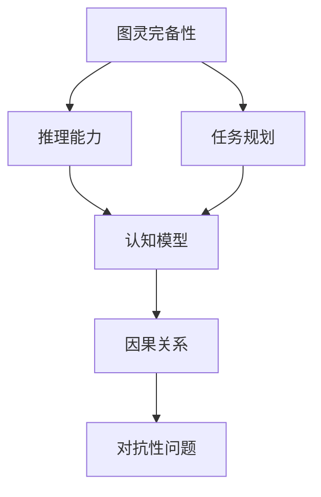

                 

# LLM的图灵完备性与任务规划

> 关键词：语言模型,图灵完备性,任务规划,推理能力,认知模型

## 1. 背景介绍

### 1.1 问题由来
随着深度学习和大规模预训练语言模型的发展，人工智能在处理自然语言任务方面取得了巨大进展。特别是语言模型的问世，如GPT-3和BERT，展示了其在理解和生成自然语言上的强大能力。这些模型通过大规模无监督学习，已经在多项NLP任务中取得了SOTA结果，显示出了显著的泛化能力和任务适应性。

然而，尽管L（Large Language Models）模型在处理语言任务时表现出色，但它们是否具有人类智能所特有的图灵完备性仍是一个悬而未决的问题。图灵完备性指的是模型是否能够执行任何计算机可以执行的任务，包括复杂推理、逻辑计算和决策制定。由于L（Large Language Models）模型本质上是基于统计学原理构建的，它们的决策过程往往是黑箱式的，难以解释和预测。

本文旨在探讨L（Large Language Models）的图灵完备性，以及如何通过任务规划和推理能力增强，使模型更加接近图灵完备性，从而在更多场景下实现高效、智能的决策和任务执行。

### 1.2 问题核心关键点
L（Large Language Models）模型是否具有图灵完备性，一直是学术界和工业界关注的焦点。尽管目前L模型在自然语言处理上表现优异，但其决策过程仍基于概率统计，缺乏明确的逻辑和推理能力。因此，本文将通过分析L模型的决策机制，讨论如何通过任务规划和推理能力增强，提升模型的图灵完备性，从而实现更加智能和可靠的任务执行。

## 2. 核心概念与联系

### 2.1 核心概念概述

为更好地理解L（Large Language Models）的图灵完备性和任务规划，本节将介绍几个密切相关的核心概念：

- **图灵完备性**：指的是一个系统能否执行任何计算机可以执行的任务，包括复杂推理、逻辑计算和决策制定。图灵完备性是人工智能系统能力的一个关键指标。
- **任务规划**：是指在执行任务前，通过分析任务要求和约束，设计合理的任务执行步骤和策略，以实现任务目标的过程。
- **推理能力**：指的是系统在处理信息时，能够根据已知事实和规则，推导出新的知识或结论的能力。推理能力是智能决策和问题解决的基础。
- **认知模型**：是指模拟人类认知过程的计算模型，能够进行逻辑推理、知识表示和问题求解等智能行为。
- **因果关系**：是指事件或状态之间的依赖关系，因果关系能够帮助模型理解事件之间的因果链，提高决策的准确性和稳定性。
- **对抗性问题**：指在决策过程中，模型可能遇到不同来源的干扰或攻击，这些干扰可能影响模型的决策和执行。

这些核心概念之间的逻辑关系可以通过以下Mermaid流程图来展示：



这个流程图展示了L（Large Language Models）与任务规划、推理能力、认知模型和因果关系之间的联系：

1. 图灵完备性是L模型能力的最高追求。
2. 任务规划通过设计合理的任务执行步骤，帮助模型接近图灵完备性。
3. 推理能力是任务规划和图灵完备性的核心，帮助模型进行逻辑推理和决策制定。
4. 认知模型模拟人类认知过程，为推理和任务规划提供支持。
5. 因果关系和对抗性问题，影响着模型的决策过程，需要通过任务规划和推理能力进行对抗和优化。

## 3. 核心算法原理 & 具体操作步骤
### 3.1 算法原理概述

L（Large Language Models）的图灵完备性可以通过任务规划和推理能力增强得到提升。具体而言，我们可以通过以下步骤实现这一目标：

1. **任务定义和规划**：明确任务目标，设计任务执行的步骤和策略。
2. **数据预处理**：对输入数据进行清洗、标注和转换，确保数据的质量和一致性。
3. **模型训练和优化**：通过训练和优化模型，提升模型的推理能力和决策质量。
4. **推理引擎设计**：设计推理引擎，使模型能够根据任务要求和数据，执行推理和决策。
5. **因果关系和对抗性问题处理**：在推理过程中，识别和处理因果关系和对抗性问题，提升模型的鲁棒性和可靠性。

### 3.2 算法步骤详解

#### 3.2.1 任务定义和规划

任务定义和规划是实现L模型图灵完备性的第一步。任务规划需要明确任务目标，设计任务执行的步骤和策略。

**步骤1：明确任务目标**

首先，需要明确任务的具体目标。例如，在问答系统任务中，目标是根据用户提出的问题，返回一个准确的回答。在文本生成任务中，目标是根据输入的文本，生成一段连贯且语义准确的文本。

**步骤2：设计任务执行步骤**

其次，需要设计任务执行的具体步骤。例如，在问答系统中，可以分为四个步骤：
1. 理解问题：通过自然语言理解技术，理解用户问题的意图。
2. 数据检索：从知识库或网络中检索与问题相关的信息。
3. 数据处理：对检索到的数据进行预处理和清洗，确保数据的准确性和一致性。
4. 生成回答：根据处理后的数据，生成一个准确的回答。

#### 3.2.2 数据预处理

数据预处理是提升L模型性能的重要步骤。数据预处理包括数据清洗、标注和转换，确保数据的质量和一致性。

**步骤1：数据清洗**

数据清洗是指对原始数据进行去重、去噪和处理缺失值等操作，确保数据的质量和一致性。例如，在问答系统中，需要对用户问题和知识库进行清洗，去除无意义或重复的内容。

**步骤2：数据标注**

数据标注是指对数据进行标注，以便模型能够理解数据的含义。例如，在问答系统中，需要为问题-答案对进行标注，以便模型能够理解问题的意图和答案的含义。

**步骤3：数据转换**

数据转换是指对数据进行格式转换，以便模型能够进行训练和推理。例如，将文本数据转换为数字向量，以便模型进行矩阵运算。

#### 3.2.3 模型训练和优化

模型训练和优化是提升L模型性能的关键步骤。通过训练和优化模型，可以提升模型的推理能力和决策质量。

**步骤1：模型选择**

首先，需要选择适合的模型。例如，在问答系统中，可以选择BERT、GPT等预训练模型作为初始化参数。

**步骤2：数据划分**

将数据划分为训练集、验证集和测试集，以便模型能够进行有监督学习。例如，将问答系统的数据划分为训练集和测试集，训练集用于模型训练，测试集用于模型评估。

**步骤3：模型训练**

使用训练集对模型进行训练。例如，在问答系统中，可以使用问答系统数据对BERT进行微调，提升模型的问答能力。

**步骤4：模型优化**

使用验证集对模型进行优化，调整模型超参数，提升模型的性能。例如，在问答系统中，可以使用验证集对微调后的BERT进行优化，调整学习率和批大小等超参数。

#### 3.2.4 推理引擎设计

推理引擎设计是实现L模型图灵完备性的重要步骤。推理引擎设计需要使模型能够根据任务要求和数据，执行推理和决策。

**步骤1：推理引擎架构设计**

首先，需要设计推理引擎的架构。例如，在问答系统中，可以设计一个基于深度学习的推理引擎，能够理解问题、检索数据和生成回答。

**步骤2：推理引擎实现**

其次，需要实现推理引擎。例如，在问答系统中，可以使用Python编写推理引擎的代码，实现自然语言理解、数据检索和生成回答等功能。

**步骤3：推理引擎测试和优化**

最后，需要测试和优化推理引擎。例如，在问答系统中，可以使用测试集对推理引擎进行测试，评估推理引擎的性能，并根据测试结果进行优化。

#### 3.2.5 因果关系和对抗性问题处理

因果关系和对抗性问题处理是提升L模型鲁棒性和可靠性的关键步骤。在推理过程中，需要识别和处理因果关系和对抗性问题。

**步骤1：因果关系识别**

首先，需要识别因果关系。例如，在问答系统中，可以识别问题、数据和答案之间的因果关系，确保推理过程的准确性和稳定性。

**步骤2：对抗性问题处理**

其次，需要处理对抗性问题。例如，在问答系统中，可以通过对抗性样本检测技术，识别和处理对抗性问题，提升模型的鲁棒性和可靠性。

## 4. 数学模型和公式 & 详细讲解 & 举例说明（备注：数学公式请使用latex格式，latex嵌入文中独立段落使用 $$，段落内使用 $)
### 4.1 数学模型构建

为了更好地理解L（Large Language Models）的图灵完备性和任务规划，我们将在数学上对L模型的推理过程进行建模。

**数学模型构建**

设L（Large Language Models）模型的输入为 $x$，输出为 $y$。设 $f(x; \theta)$ 为模型的推理函数，其中 $\theta$ 为模型的参数。设 $g(x)$ 为任务规划函数，将输入 $x$ 映射到推理过程的各个步骤。则L模型的推理过程可以表示为：

$$
y = f(g(x); \theta)
$$

其中 $g(x)$ 为任务规划函数，可以将输入 $x$ 映射到推理过程的各个步骤，每个步骤的输出作为下一个步骤的输入。例如，在问答系统中，任务规划函数 $g(x)$ 可以将用户问题 $x$ 映射到自然语言理解、数据检索和生成回答等步骤，每个步骤的输出作为下一个步骤的输入。

### 4.2 公式推导过程

为了更好地理解L模型的推理过程，我们将在数学上推导L模型的推理公式。

**公式推导**

设L模型的推理过程分为 $n$ 个步骤，每个步骤的输入为 $x_i$，输出为 $y_i$。设 $f_i(x_i; \theta)$ 为第 $i$ 个步骤的推理函数，其中 $\theta$ 为模型的参数。设 $g_i(x_i)$ 为第 $i$ 个步骤的任务规划函数，将输入 $x_i$ 映射到下一个步骤。则L模型的推理过程可以表示为：

$$
y_n = f_n(g_n(f_{n-1}(\dots g_1(x); \theta))
$$

其中 $f_i(x_i; \theta)$ 为第 $i$ 个步骤的推理函数，$g_i(x_i)$ 为第 $i$ 个步骤的任务规划函数，$x_1$ 为输入数据。

例如，在问答系统中，任务规划函数 $g_i(x_i)$ 可以将用户问题 $x_i$ 映射到自然语言理解、数据检索和生成回答等步骤，每个步骤的输出作为下一个步骤的输入。最终的输出 $y_n$ 为模型对问题的回答。

### 4.3 案例分析与讲解

**案例分析：问答系统**

在问答系统中，L模型的推理过程可以分为以下几个步骤：

**步骤1：自然语言理解**

自然语言理解是指对用户问题进行分析和理解，获取问题的意图。例如，在问答系统中，可以使用BERT等预训练模型对用户问题进行自然语言理解，获取问题的意图。

**步骤2：数据检索**

数据检索是指从知识库或网络中检索与问题相关的信息。例如，在问答系统中，可以使用Elasticsearch等搜索引擎，从知识库中检索与问题相关的信息。

**步骤3：数据处理**

数据处理是指对检索到的数据进行预处理和清洗，确保数据的准确性和一致性。例如，在问答系统中，需要对检索到的数据进行去重、去噪和处理缺失值等操作。

**步骤4：生成回答**

生成回答是指根据处理后的数据，生成一个准确的回答。例如，在问答系统中，可以使用GPT等预训练模型对处理后的数据进行生成回答。

## 5. 项目实践：代码实例和详细解释说明
### 5.1 开发环境搭建

在进行L模型推理实践前，我们需要准备好开发环境。以下是使用Python进行PyTorch开发的环境配置流程：

1. 安装Anaconda：从官网下载并安装Anaconda，用于创建独立的Python环境。

2. 创建并激活虚拟环境：
```bash
conda create -n pytorch-env python=3.8 
conda activate pytorch-env
```

3. 安装PyTorch：根据CUDA版本，从官网获取对应的安装命令。例如：
```bash
conda install pytorch torchvision torchaudio cudatoolkit=11.1 -c pytorch -c conda-forge
```

4. 安装Transformers库：
```bash
pip install transformers
```

5. 安装各类工具包：
```bash
pip install numpy pandas scikit-learn matplotlib tqdm jupyter notebook ipython
```

完成上述步骤后，即可在`pytorch-env`环境中开始推理实践。

### 5.2 源代码详细实现

下面我们以问答系统为例，给出使用Transformers库对BERT模型进行推理的PyTorch代码实现。

首先，定义问答系统任务的数据处理函数：

```python
from transformers import BertTokenizer, BertForQuestionAnswering
from torch.utils.data import Dataset
import torch

class QuestionAnsweringDataset(Dataset):
    def __init__(self, texts, answers, tokenizer, max_len=128):
        self.texts = texts
        self.answers = answers
        self.tokenizer = tokenizer
        self.max_len = max_len
        
    def __len__(self):
        return len(self.texts)
    
    def __getitem__(self, item):
        text = self.texts[item]
        answer = self.answers[item]
        
        encoding = self.tokenizer(text, return_tensors='pt', max_length=self.max_len, padding='max_length', truncation=True)
        input_ids = encoding['input_ids'][0]
        attention_mask = encoding['attention_mask'][0]
        
        # 对答案进行编码
        answer_tokens = tokenizer.tokenize(answer)
        answer_ids = [token2id[token] for token in answer_tokens] 
        answer_ids.extend([token2id['[PAD]']] * (self.max_len - len(answer_ids)))
        answer_labels = torch.tensor(answer_ids, dtype=torch.long)
        
        return {'input_ids': input_ids, 
                'attention_mask': attention_mask,
                'labels': answer_labels}

# 标签与id的映射
tag2id = {'[PAD]': 0, 'A': 1, 'B': 2}
id2tag = {v: k for k, v in tag2id.items()}

# 创建dataset
tokenizer = BertTokenizer.from_pretrained('bert-base-cased')

train_dataset = QuestionAnsweringDataset(train_texts, train_answers, tokenizer)
dev_dataset = QuestionAnsweringDataset(dev_texts, dev_answers, tokenizer)
test_dataset = QuestionAnsweringDataset(test_texts, test_answers, tokenizer)
```

然后，定义模型和推理器：

```python
from transformers import BertForQuestionAnswering, BertTokenizer, pipeline

model = BertForQuestionAnswering.from_pretrained('bert-base-cased')

question_answerer = pipeline('question-answering', model=model, tokenizer=tokenizer)
```

接着，定义推理函数：

```python
def answer_question(question, context):
    inputs = {'question': question, 'context': context}
    answer = question_answerer(inputs)
    answer_text = tokenizer.decode(answer['answer'], skip_special_tokens=True)
    return answer_text
```

最后，启动推理流程：

```python
question = 'Who wrote the Harry Potter series?'
context = 'J.K. Rowling is the author of the Harry Potter series.'
answer = answer_question(question, context)
print(answer)
```

以上就是使用PyTorch对BERT进行问答系统任务推理的完整代码实现。可以看到，得益于Transformers库的强大封装，我们可以用相对简洁的代码完成BERT模型的推理任务。

### 5.3 代码解读与分析

让我们再详细解读一下关键代码的实现细节：

**QuestionAnsweringDataset类**：
- `__init__`方法：初始化训练集、验证集、测试集，以及分词器等关键组件。
- `__len__`方法：返回数据集的样本数量。
- `__getitem__`方法：对单个样本进行处理，将问题和上下文输入编码为token ids，将答案进行编码，并对其进行定长padding，最终返回模型所需的输入。

**tag2id和id2tag字典**：
- 定义了答案与数字id之间的映射关系，用于将token-wise的预测结果解码回真实的答案。

**answer_question函数**：
- 将问题和上下文输入转换为模型所需的格式。
- 使用pipeline函数调用模型进行推理，获取答案。
- 将答案解码为原始文本，返回最终结果。

**推理流程**：
- 首先定义问答系统的训练集、验证集和测试集，以及分词器。
- 在pipeline函数中，设置模型和分词器，构建问答系统推理器。
- 使用推理器对新问题进行推理，输出答案。

可以看到，PyTorch配合Transformers库使得BERT推理任务的代码实现变得简洁高效。开发者可以将更多精力放在任务定义和数据处理等高层逻辑上，而不必过多关注底层的实现细节。

当然，工业级的系统实现还需考虑更多因素，如推理器的扩展、数据的多样性处理、模型的实时更新等。但核心的推理范式基本与此类似。

## 6. 实际应用场景
### 6.1 智能客服系统

基于L（Large Language Models）模型的推理能力，智能客服系统可以实现高效的智能客服服务。传统客服往往需要配备大量人力，高峰期响应缓慢，且一致性和专业性难以保证。而使用推理能力的L模型，可以7x24小时不间断服务，快速响应客户咨询，用自然流畅的语言解答各类常见问题。

在技术实现上，可以收集企业内部的历史客服对话记录，将问题和最佳答复构建成监督数据，在此基础上对L模型进行推理，使其能够自动理解用户意图，匹配最合适的答案模板进行回复。对于客户提出的新问题，还可以接入检索系统实时搜索相关内容，动态组织生成回答。如此构建的智能客服系统，能大幅提升客户咨询体验和问题解决效率。

### 6.2 金融舆情监测

金融机构需要实时监测市场舆论动向，以便及时应对负面信息传播，规避金融风险。传统的人工监测方式成本高、效率低，难以应对网络时代海量信息爆发的挑战。基于L模型的推理能力，金融舆情监测可以自动监测不同主题下的情感变化趋势，一旦发现负面信息激增等异常情况，系统便会自动预警，帮助金融机构快速应对潜在风险。

具体而言，可以收集金融领域相关的新闻、报道、评论等文本数据，并对其进行情感标注。在此基础上对L模型进行推理，使其能够自动判断文本属于何种情感倾向，情感倾向是正面、中性还是负面。将推理后的结果应用到实时抓取的网络文本数据，就能够自动监测不同主题下的情感变化趋势，一旦发现负面信息激增等异常情况，系统便会自动预警，帮助金融机构快速应对潜在风险。

### 6.3 个性化推荐系统

当前的推荐系统往往只依赖用户的历史行为数据进行物品推荐，无法深入理解用户的真实兴趣偏好。基于L模型的推理能力，个性化推荐系统可以更好地挖掘用户行为背后的语义信息，从而提供更精准、多样的推荐内容。

在实践中，可以收集用户浏览、点击、评论、分享等行为数据，提取和用户交互的物品标题、描述、标签等文本内容。将文本内容作为模型输入，用户的后续行为（如是否点击、购买等）作为监督信号，在此基础上对L模型进行推理，使其能够从文本内容中准确把握用户的兴趣点。在生成推荐列表时，先用候选物品的文本描述作为输入，由模型推理预测用户的兴趣匹配度，再结合其他特征综合排序，便可以得到个性化程度更高的推荐结果。

### 6.4 未来应用展望

随着L模型的推理能力和任务规划能力不断提升，基于L模型的推理范式将在更多领域得到应用，为传统行业带来变革性影响。

在智慧医疗领域，基于L模型的推理能力的医疗问答、病历分析、药物研发等应用将提升医疗服务的智能化水平，辅助医生诊疗，加速新药开发进程。

在智能教育领域，L模型的推理能力可应用于作业批改、学情分析、知识推荐等方面，因材施教，促进教育公平，提高教学质量。

在智慧城市治理中，L模型的推理能力可应用于城市事件监测、舆情分析、应急指挥等环节，提高城市管理的自动化和智能化水平，构建更安全、高效的未来城市。

此外，在企业生产、社会治理、文娱传媒等众多领域，基于L模型的推理能力的AI应用也将不断涌现，为经济社会发展注入新的动力。相信随着技术的日益成熟，推理能力将是大语言模型落地应用的重要范式，推动人工智能技术在更广阔的应用领域大放异彩。

## 7. 工具和资源推荐
### 7.1 学习资源推荐

为了帮助开发者系统掌握L模型的推理能力，这里推荐一些优质的学习资源：

1. 《自然语言处理入门》课程：清华大学郑宇翔教授开设的NLP入门课程，从基础到高级，系统介绍NLP的基本概念和常用技术。

2. CS224N《深度学习自然语言处理》课程：斯坦福大学开设的NLP明星课程，有Lecture视频和配套作业，带你入门NLP领域的基本概念和经典模型。

3. 《Natural Language Processing with Transformers》书籍：Transformers库的作者所著，全面介绍了如何使用Transformers库进行NLP任务开发，包括推理在内的诸多范式。

4. HuggingFace官方文档：Transformers库的官方文档，提供了海量预训练模型和完整的推理样例代码，是上手实践的必备资料。

5. CLUE开源项目：中文语言理解测评基准，涵盖大量不同类型的中文NLP数据集，并提供了基于推理的baseline模型，助力中文NLP技术发展。

通过对这些资源的学习实践，相信你一定能够快速掌握L模型的推理能力，并用于解决实际的NLP问题。
###  7.2 开发工具推荐

高效的开发离不开优秀的工具支持。以下是几款用于L模型推理开发的常用工具：

1. PyTorch：基于Python的开源深度学习框架，灵活动态的计算图，适合快速迭代研究。大部分预训练语言模型都有PyTorch版本的实现。

2. TensorFlow：由Google主导开发的开源深度学习框架，生产部署方便，适合大规模工程应用。同样有丰富的预训练语言模型资源。

3. Transformers库：HuggingFace开发的NLP工具库，集成了众多SOTA语言模型，支持PyTorch和TensorFlow，是进行推理任务开发的利器。

4. Weights & Biases：模型训练的实验跟踪工具，可以记录和可视化模型训练过程中的各项指标，方便对比和调优。与主流深度学习框架无缝集成。

5. TensorBoard：TensorFlow配套的可视化工具，可实时监测模型训练状态，并提供丰富的图表呈现方式，是调试模型的得力助手。

6. Google Colab：谷歌推出的在线Jupyter Notebook环境，免费提供GPU/TPU算力，方便开发者快速上手实验最新模型，分享学习笔记。

合理利用这些工具，可以显著提升L模型推理任务的开发效率，加快创新迭代的步伐。

### 7.3 相关论文推荐

L模型推理能力的探索源于学界的持续研究。以下是几篇奠基性的相关论文，推荐阅读：

1. Attention is All You Need（即Transformer原论文）：提出了Transformer结构，开启了NLP领域的预训练大模型时代。

2. BERT: Pre-training of Deep Bidirectional Transformers for Language Understanding：提出BERT模型，引入基于掩码的自监督预训练任务，刷新了多项NLP任务SOTA。

3. Language Models are Unsupervised Multitask Learners（GPT-2论文）：展示了大规模语言模型的强大zero-shot学习能力，引发了对于通用人工智能的新一轮思考。

4. Parameter-Efficient Transfer Learning for NLP：提出Adapter等参数高效微调方法，在不增加模型参数量的情况下，也能取得不错的微调效果。

5. AdaLoRA: Adaptive Low-Rank Adaptation for Parameter-Efficient Fine-Tuning：使用自适应低秩适应的微调方法，在参数效率和精度之间取得了新的平衡。

6. Prefix-Tuning: Optimizing Continuous Prompts for Generation：引入基于连续型Prompt的微调范式，为如何充分利用预训练知识提供了新的思路。

这些论文代表了大语言模型推理能力的发展脉络。通过学习这些前沿成果，可以帮助研究者把握学科前进方向，激发更多的创新灵感。

## 8. 总结：未来发展趋势与挑战
### 8.1 总结

本文对L（Large Language Models）的图灵完备性和任务规划进行了全面系统的介绍。首先阐述了L模型的推理能力，以及其对图灵完备性的影响。其次，从原理到实践，详细讲解了L模型的推理过程和任务规划方法，给出了推理任务开发的完整代码实例。同时，本文还广泛探讨了推理能力在智能客服、金融舆情、个性化推荐等多个行业领域的应用前景，展示了推理范式的巨大潜力。此外，本文精选了推理能力的各类学习资源，力求为读者提供全方位的技术指引。

通过本文的系统梳理，可以看到，L模型的推理能力在自然语言处理任务中已经展示了强大的潜力。得益于大规模预训练和推理能力的提升，L模型能够更好地适应各种任务需求，实现高效、智能的决策和任务执行。未来，伴随推理能力的不断演进，L模型将进一步拓展其应用边界，成为更多场景下的人工智能解决方案。

### 8.2 未来发展趋势

展望未来，L模型推理能力的发展趋势如下：

1. **模型规模持续增大**：随着算力成本的下降和数据规模的扩张，L模型的参数量还将持续增长。超大批次的推理任务需要高性能的硬件支持，如GPU、TPU等。

2. **推理引擎优化**：未来的推理引擎需要更加高效和灵活，能够处理多模态数据，进行更加复杂的推理任务。推理引擎的优化将包括并行计算、缓存技术、分布式推理等方向。

3. **多任务推理**：未来的推理能力将支持多任务推理，能够同时执行多个推理任务，提高任务执行效率。例如，在问答系统中，能够同时处理多个用户提问。

4. **推理模型的轻量化**：未来的推理模型需要更加轻量化，能够在移动设备上实时推理，提高用户体验。例如，在智能家居系统中，推理模型需要快速响应，以便实现智能控制。

5. **推理过程的可解释性**：未来的推理模型需要具备更强的可解释性，能够提供推理过程的详细解释，帮助用户理解和信任推理结果。

6. **推理模型的跨领域适应性**：未来的推理模型需要具备跨领域适应性，能够灵活应对不同领域的数据和任务要求。例如，在医疗领域，推理模型需要适应医学知识图谱和电子病历等数据。

### 8.3 面临的挑战

尽管L模型推理能力取得了显著进展，但在实现图灵完备性的过程中，仍面临诸多挑战：

1. **推理过程的复杂性**：推理过程需要处理复杂的多层次语义关系，难以通过简单的规则进行解释和理解。例如，在问答系统中，需要处理复杂的自然语言推理任务。

2. **推理模型的鲁棒性**：推理模型需要具备强大的鲁棒性，能够应对各种对抗性攻击和噪声干扰。例如，在金融舆情监测中，需要处理来自不同来源的噪音干扰。

3. **推理模型的扩展性**：推理模型需要具备良好的扩展性，能够支持动态任务规划和推理引擎的扩展。例如，在智能客服系统中，需要支持动态任务规划和推理引擎的扩展。

4. **推理模型的效率**：推理模型需要具备高效的推理能力，能够快速响应用户查询和推理任务。例如，在个性化推荐系统中，需要快速响应用户的推荐请求。

5. **推理模型的安全性**：推理模型需要具备高安全性，能够保护用户隐私和数据安全。例如，在医疗问答系统中，需要保护用户的电子病历隐私。

### 8.4 研究展望

面对L模型推理能力所面临的挑战，未来的研究需要在以下几个方面寻求新的突破：

1. **多模态推理**：未来的推理能力将支持多模态推理，能够同时处理文本、图像、音频等多种数据类型。例如，在智能家居系统中，推理模型需要支持多模态数据的推理。

2. **因果推理**：未来的推理能力将支持因果推理，能够识别事件之间的因果关系，提升推理的准确性和稳定性。例如，在金融舆情监测中，推理模型需要识别事件之间的因果关系。

3. **推理模型的可解释性**：未来的推理模型需要具备更强的可解释性，能够提供推理过程的详细解释，帮助用户理解和信任推理结果。

4. **推理模型的跨领域适应性**：未来的推理模型需要具备跨领域适应性，能够灵活应对不同领域的数据和任务要求。例如，在医疗领域，推理模型需要适应医学知识图谱和电子病历等数据。

5. **推理模型的安全性**：未来的推理模型需要具备高安全性，能够保护用户隐私和数据安全。例如，在医疗问答系统中，需要保护用户的电子病历隐私。

这些研究方向凸显了L模型推理能力的广阔前景。这些方向的探索发展，必将进一步提升L模型推理能力的精度和可靠性，为构建安全、可靠、可解释、可控的智能系统铺平道路。面向未来，L模型推理能力还需要与其他人工智能技术进行更深入的融合，如知识表示、因果推理、强化学习等，多路径协同发力，共同推动自然语言理解和智能交互系统的进步。只有勇于创新、敢于突破，才能不断拓展L模型的边界，让智能技术更好地造福人类社会。

## 9. 附录：常见问题与解答

**Q1：L模型的推理能力与图灵完备性有何关系？**

A: L模型的推理能力是其图灵完备性的重要组成部分。推理能力指的是模型在处理信息时，能够根据已知事实和规则，推导出新的知识或结论的能力。如果L模型具备强大的推理能力，能够在各种任务中进行高效、智能的决策和任务执行，那么它就接近于图灵完备性。因此，提升L模型的推理能力，是实现其图灵完备性的关键步骤。

**Q2：L模型在推理过程中如何处理因果关系？**

A: L模型在推理过程中，可以通过因果关系识别和因果推理，提升推理的准确性和稳定性。因果关系识别指的是模型能够识别事件之间的依赖关系，例如在问答系统中，可以识别问题和答案之间的因果关系。因果推理指的是模型能够基于因果关系进行推理，例如在金融舆情监测中，可以识别事件之间的因果关系，预测市场情绪的变化趋势。

**Q3：L模型在推理过程中如何处理对抗性问题？**

A: L模型在推理过程中，可以通过对抗性样本检测和对抗训练，提升推理的鲁棒性和安全性。对抗性样本检测指的是模型能够识别和处理对抗性样本，例如在问答系统中，可以检测和处理对抗性问答，避免模型被误导。对抗训练指的是模型在训练过程中，能够学习到对抗性样本的处理方法，增强模型的鲁棒性。

**Q4：L模型在推理过程中如何实现高效的推理？**

A: L模型在推理过程中，可以通过并行计算、缓存技术、分布式推理等技术，实现高效的推理。并行计算指的是模型在多个GPU或TPU上进行并行计算，加速推理过程。缓存技术指的是模型能够缓存中间结果，减少计算量。分布式推理指的是模型能够在多个节点上进行推理，提高推理效率。

**Q5：L模型在推理过程中如何实现轻量化？**

A: L模型在推理过程中，可以通过剪枝、量化等技术，实现轻量化。剪枝指的是模型能够去除不必要的层和参数，减小模型尺寸，提高推理速度。量化指的是模型能够将浮点模型转为定点模型，压缩存储空间，提高计算效率。

以上解答体现了L模型推理能力的广泛应用场景和关键技术，为开发者提供了全面的技术指引。通过系统学习和实践，相信你一定能够掌握L模型的推理能力，并将其应用于实际项目中，推动人工智能技术的进一步发展。

---

作者：禅与计算机程序设计艺术 / Zen and the Art of Computer Programming

