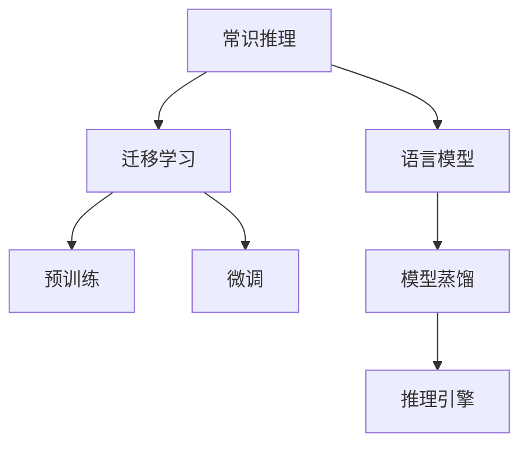

                 

# LLM的常识推理能力构建策略

> 关键词：常识推理，语言模型，迁移学习，模型蒸馏，预训练，微调，推理引擎

## 1. 背景介绍

### 1.1 问题由来

常识推理（Commonsense Reasoning）是人工智能研究的热点领域之一，其目标在于构建能够理解、运用和推断常识知识的智能系统。常识推理对于人类的日常生活至关重要，但在计算机科学中，这一领域却相对较为薄弱。尽管如此，近年来，随着深度学习和大规模语言模型（Large Language Models, LLMs）的兴起，常识推理能力的构建成为了一个亟待解决的挑战。

深度学习模型，特别是预训练语言模型（Pre-trained Language Models, PLMs），在自然语言处理（NLP）领域表现优异。这些模型通过在大规模语料库上进行预训练，学习到了丰富的语言知识。但是，这些模型通常缺乏对常识知识的理解，因此无法在需要常识推理能力的任务中表现出色。例如，在医学问答、法律咨询、机器人对话等场景中，模型可能无法正确理解问题的语境，导致输出错误或无关的回答。

### 1.2 问题核心关键点

在构建常识推理能力方面，当前的深度学习模型面临以下核心问题：

- **知识表示不足**：现有的深度学习模型往往局限于统计模式，难以理解复杂的常识逻辑。
- **缺乏常识知识**：预训练语言模型虽然通过语料学习到大量语言知识，但并未专门设计以学习常识知识。
- **推理能力有限**：即使模型经过微调，其推理能力仍然受限于训练数据中的统计规律，难以进行抽象、推理和推断。

因此，如何构建常识推理能力成为了深度学习模型的重要研究课题。本文将探讨通过预训练、迁移学习、模型蒸馏和推理引擎等策略，构建具备常识推理能力的深度学习模型。

## 2. 核心概念与联系

### 2.1 核心概念概述

为更好地理解常识推理能力的构建策略，本节将介绍几个关键概念及其相互联系：

- **常识推理**：指基于常识知识进行逻辑推理、推断和决策的能力。在人类认知中，常识推理能力是基本而重要的，对于处理各种实际问题至关重要。
- **语言模型**：指能够根据上下文预测下一个单词或字符的概率分布的模型。常用的语言模型包括自回归模型（如LSTM、RNN）和自编码模型（如BERT、GPT）。
- **迁移学习**：指将一个领域学到的知识，迁移应用到另一个不同但相关的领域的学习范式。在常识推理能力构建中，迁移学习通过将预训练模型迁移到特定任务，提升模型在特定领域的表现。
- **模型蒸馏**：指通过压缩大型模型，生成一个更小、更高效的模型，以保持其核心性能。在常识推理能力构建中，模型蒸馏可用于减少模型的计算和存储负担，提高推理速度。
- **预训练**：指在大规模无标签数据上训练模型，使其学习到通用的语言和常识知识。在常识推理能力构建中，预训练是构建常识推理模型的基础。
- **微调**：指在预训练模型的基础上，使用下游任务的少量标注数据，通过有监督学习优化模型在特定任务上的性能。微调可以提升模型在特定领域的表现。
- **推理引擎**：指用于执行模型推理和决策的软件系统。推理引擎能够将模型的输出转化为具体的决策和行为。

这些概念之间的逻辑关系可以通过以下Mermaid流程图来展示：



这个流程图展示了常识推理能力构建的关键步骤：

1. 从语言模型学习通用知识。
2. 通过迁移学习将预训练模型迁移到特定领域。
3. 通过预训练和微调增强模型在该领域的表现。
4. 使用模型蒸馏减少计算和存储负担。
5. 部署推理引擎执行推理和决策。

这些步骤共同构成了构建常识推理能力的框架，使得模型能够具备更强的逻辑推理和推断能力。

## 3. 核心算法原理 & 具体操作步骤
### 3.1 算法原理概述

常识推理能力的构建，可以理解为在预训练语言模型的基础上，通过迁移学习、微调、模型蒸馏等策略，逐步增强模型对常识知识的理解和应用。其核心思想是通过多层次的学习和优化，逐步提升模型在特定领域的表现，同时减少计算和存储负担，提高推理速度。

### 3.2 算法步骤详解

常识推理能力的构建，一般包括以下几个关键步骤：

**Step 1: 预训练**

预训练是构建常识推理模型的基础。通常，在大规模无标签数据上训练一个预训练语言模型，使其学习到通用的语言和常识知识。这一过程类似于传统的自监督学习，但通常使用更复杂的任务和更庞大的语料库。例如，使用语言建模、掩码预测等任务训练BERT、GPT等模型。

**Step 2: 迁移学习**

在预训练模型的基础上，通过迁移学习将其迁移到特定领域。这一步骤通常包括以下几个子步骤：

- 选择特定领域的任务，如医学问答、法律咨询等。
- 收集该领域的标注数据集，用于训练和评估模型。
- 在标注数据集上微调预训练模型，使其学习特定领域的常识知识和逻辑推理能力。

**Step 3: 微调**

微调是进一步提升模型在特定领域表现的关键步骤。这一步骤通常包括：

- 选择合适的学习率和优化器，如AdamW、SGD等。
- 设置适当的正则化技术，如L2正则、Dropout等，以防止过拟合。
- 在标注数据集上使用小批量随机梯度下降（SGD）算法更新模型参数。
- 在验证集上评估模型性能，调整学习率和超参数，以获得最佳性能。

**Step 4: 模型蒸馏**

模型蒸馏是减少模型计算和存储负担，提高推理速度的重要步骤。这一步骤通常包括以下几个子步骤：

- 将预训练模型压缩为小型模型，如通过剪枝、量化、蒸馏等技术。
- 使用小型模型在特定领域上执行推理和决策，以减少计算和存储成本。
- 使用推理引擎优化小型模型的推理性能，提高推理速度。

### 3.3 算法优缺点

常识推理能力的构建策略具有以下优点：

1. **广泛适用**：适用于各种NLP任务，包括问答、对话、摘要、翻译等，可以通过迁移学习将其迁移到特定领域。
2. **提升性能**：通过微调和迁移学习，可以在特定领域上提升模型的性能，提高常识推理能力。
3. **减少计算负担**：通过模型蒸馏，减少计算和存储负担，提高推理速度，使得模型能够在资源受限的硬件设备上运行。

然而，该策略也存在以下局限性：

1. **依赖标注数据**：迁移学习和微调依赖标注数据，标注数据的质量和数量对模型性能有重要影响。
2. **过拟合风险**：由于模型复杂度高，存在过拟合的风险，需要通过正则化和剪枝等技术进行缓解。
3. **计算资源要求高**：预训练和微调模型通常需要大量的计算资源，特别是在大规模数据集上。

尽管存在这些局限性，但该策略在构建常识推理能力方面仍具有重要价值。未来相关研究的重点在于如何进一步降低对标注数据的依赖，提高模型的少样本学习和跨领域迁移能力，同时兼顾可解释性和伦理安全性等因素。

### 3.4 算法应用领域

常识推理能力的构建策略已经在多个NLP领域得到了应用，如问答系统、对话系统、机器翻译、文本摘要等。这些领域通常需要模型具备较强的逻辑推理和推断能力，以便正确理解和处理输入数据。

例如，在问答系统中，模型需要理解问题语境，推断出正确的答案。在对话系统中，模型需要根据对话历史推断出用户意图，并给出合适的回答。在机器翻译中，模型需要理解源语言句子，推断出正确的翻译结果。在文本摘要中，模型需要理解文档内容，推断出关键信息，生成简洁摘要。

## 4. 数学模型和公式 & 详细讲解 & 举例说明
### 4.1 数学模型构建

常识推理能力的构建涉及到多个数学模型，包括预训练模型、迁移学习模型、微调模型和推理模型。以下是这些模型的数学模型构建方法：

**预训练模型**：
- 预训练模型通常使用自回归或自编码结构，如LSTM、RNN或BERT、GPT等。
- 预训练模型通过在大规模无标签数据上进行语言建模或掩码预测等任务，学习到通用的语言和常识知识。

**迁移学习模型**：
- 迁移学习模型通常是在预训练模型的基础上，使用特定领域的标注数据进行微调。
- 迁移学习模型通过学习特定领域的常识知识和逻辑推理能力，提升模型在该领域的表现。

**微调模型**：
- 微调模型通常是在迁移学习模型的基础上，使用小批量随机梯度下降算法更新模型参数。
- 微调模型通过学习特定领域的标注数据，进一步提升模型在该领域的表现。

**推理模型**：
- 推理模型通常是在微调模型的基础上，通过推理引擎执行推理和决策。
- 推理模型使用小型模型或剪枝后的模型，以减少计算和存储负担，提高推理速度。

### 4.2 公式推导过程

以下是预训练模型和迁移学习模型的数学推导过程：

**预训练模型**：
- 假设预训练模型为 $M_{\theta}$，其中 $\theta$ 为模型参数。
- 在大规模无标签数据上，通过语言建模或掩码预测等任务进行训练，最小化损失函数 $\mathcal{L}_{pretrain}$：
  $$
  \mathcal{L}_{pretrain} = -\frac{1}{N}\sum_{i=1}^N \mathbb{E}_{x_i \sim D}[\log P(x_i | M_{\theta})]
  $$
  其中 $D$ 为大规模无标签数据集，$P(x_i | M_{\theta})$ 为模型在数据 $x_i$ 上的预测概率分布。

**迁移学习模型**：
- 假设迁移学习模型为 $M_{\theta'}$，其中 $\theta'$ 为迁移学习模型的参数。
- 在预训练模型的基础上，使用特定领域的标注数据进行微调，最小化损失函数 $\mathcal{L}_{fine-tune}$：
  $$
  \mathcal{L}_{fine-tune} = \mathcal{L}_{pretrain} + \frac{1}{N}\sum_{i=1}^N \mathbb{E}_{(x_i, y_i) \sim D_{task}}[\ell(M_{\theta'}(x_i), y_i)]
  $$
  其中 $D_{task}$ 为特定领域的标注数据集，$\ell$ 为任务特定的损失函数，如交叉熵损失。

### 4.3 案例分析与讲解

**案例：医学问答系统**

- **数据集准备**：收集医学领域的问答对数据集，将其分为训练集、验证集和测试集。
- **模型选择**：选择BERT或GPT预训练模型，作为迁移学习模型的基础。
- **微调训练**：使用医疗领域的标注数据集，对预训练模型进行微调，最小化交叉熵损失。
- **推理部署**：将微调后的模型部署到推理引擎中，执行医学领域的问答任务。

以下是一个简单的代码示例：

```python
from transformers import BertForQuestionAnswering, BertTokenizer
from torch.utils.data import Dataset
from torch.utils.data.distributed import DistributedSampler
import torch
import torch.nn.functional as F

class MedicalQADataset(Dataset):
    def __init__(self, texts, questions, answers, tokenizer):
        self.texts = texts
        self.questions = questions
        self.answers = answers
        self.tokenizer = tokenizer
    
    def __len__(self):
        return len(self.texts)
    
    def __getitem__(self, item):
        text = self.texts[item]
        question = self.questions[item]
        answer = self.answers[item]
        
        encoding = self.tokenizer(text, question, return_tensors='pt', padding='max_length', truncation=True)
        input_ids = encoding['input_ids']
        attention_mask = encoding['attention_mask']
        start_tokens = encoding['start_tokens']
        end_tokens = encoding['end_tokens']
        
        return {
            'input_ids': input_ids,
            'attention_mask': attention_mask,
            'start_tokens': start_tokens,
            'end_tokens': end_tokens
        }

tokenizer = BertTokenizer.from_pretrained('bert-base-cased')
model = BertForQuestionAnswering.from_pretrained('bert-base-cased')

device = torch.device('cuda') if torch.cuda.is_available() else torch.device('cpu')
model.to(device)

# 数据加载器
train_dataset = MedicalQADataset(train_texts, train_questions, train_answers, tokenizer)
val_dataset = MedicalQADataset(val_texts, val_questions, val_answers, tokenizer)
test_dataset = MedicalQADataset(test_texts, test_questions, test_answers, tokenizer)

# 数据采样器
train_sampler = DistributedSampler(train_dataset)
val_sampler = DistributedSampler(val_dataset)
test_sampler = DistributedSampler(test_dataset)

# 优化器
optimizer = AdamW(model.parameters(), lr=2e-5)

# 模型训练
for epoch in range(num_epochs):
    model.train()
    for batch in train_loader:
        input_ids = batch['input_ids'].to(device)
        attention_mask = batch['attention_mask'].to(device)
        start_tokens = batch['start_tokens'].to(device)
        end_tokens = batch['end_tokens'].to(device)
        
        # 前向传播
        outputs = model(input_ids, attention_mask=attention_mask, start_tokens=start_tokens, end_tokens=end_tokens)
        logits = outputs.logits
        
        # 计算损失
        loss = F.cross_entropy(logits, batch['start_tokens'], reduction='none')
        loss = loss.sum() / (input_ids.size(0) * input_ids.size(1))
        
        # 反向传播和优化
        loss.backward()
        optimizer.step()
        optimizer.zero_grad()
        
    # 验证集评估
    model.eval()
    with torch.no_grad():
        val_loss = 0
        for batch in val_loader:
            input_ids = batch['input_ids'].to(device)
            attention_mask = batch['attention_mask'].to(device)
            start_tokens = batch['start_tokens'].to(device)
            end_tokens = batch['end_tokens'].to(device)
            
            outputs = model(input_ids, attention_mask=attention_mask, start_tokens=start_tokens, end_tokens=end_tokens)
            logits = outputs.logits
            
            val_loss += F.cross_entropy(logits, batch['start_tokens'], reduction='none').sum() / (input_ids.size(0) * input_ids.size(1))
        
        print(f'Epoch {epoch+1}, val loss: {val_loss:.3f}')
    
    # 测试集评估
    model.eval()
    with torch.no_grad():
        test_loss = 0
        for batch in test_loader:
            input_ids = batch['input_ids'].to(device)
            attention_mask = batch['attention_mask'].to(device)
            start_tokens = batch['start_tokens'].to(device)
            end_tokens = batch['end_tokens'].to(device)
            
            outputs = model(input_ids, attention_mask=attention_mask, start_tokens=start_tokens, end_tokens=end_tokens)
            logits = outputs.logits
            
            test_loss += F.cross_entropy(logits, batch['start_tokens'], reduction='none').sum() / (input_ids.size(0) * input_ids.size(1))
        
        print(f'Epoch {epoch+1}, test loss: {test_loss:.3f}')
```

## 5. 项目实践：代码实例和详细解释说明
### 5.1 开发环境搭建

在进行常识推理能力的构建实践前，我们需要准备好开发环境。以下是使用Python进行PyTorch开发的环境配置流程：

1. 安装Anaconda：从官网下载并安装Anaconda，用于创建独立的Python环境。

2. 创建并激活虚拟环境：
```bash
conda create -n pytorch-env python=3.8 
conda activate pytorch-env
```

3. 安装PyTorch：根据CUDA版本，从官网获取对应的安装命令。例如：
```bash
conda install pytorch torchvision torchaudio cudatoolkit=11.1 -c pytorch -c conda-forge
```

4. 安装Transformer库：
```bash
pip install transformers
```

5. 安装各类工具包：
```bash
pip install numpy pandas scikit-learn matplotlib tqdm jupyter notebook ipython
```

完成上述步骤后，即可在`pytorch-env`环境中开始常识推理能力的构建实践。

### 5.2 源代码详细实现

下面我们以医学问答系统为例，给出使用Transformers库对BERT模型进行常识推理能力构建的PyTorch代码实现。

首先，定义医学问答数据处理函数：

```python
from transformers import BertTokenizer
from torch.utils.data import Dataset
import torch

class MedicalQADataset(Dataset):
    def __init__(self, texts, questions, answers, tokenizer, max_len=128):
        self.texts = texts
        self.questions = questions
        self.answers = answers
        self.tokenizer = tokenizer
        self.max_len = max_len
        
    def __len__(self):
        return len(self.texts)
    
    def __getitem__(self, item):
        text = self.texts[item]
        question = self.questions[item]
        answer = self.answers[item]
        
        encoding = self.tokenizer(text, question, return_tensors='pt', max_length=self.max_len, padding='max_length', truncation=True)
        input_ids = encoding['input_ids'][0]
        attention_mask = encoding['attention_mask'][0]
        
        # 对token-wise的标签进行编码
        encoded_tags = [tag2id[tag] for tag in answer] 
        encoded_tags.extend([tag2id['O']] * (self.max_len - len(encoded_tags)))
        labels = torch.tensor(encoded_tags, dtype=torch.long)
        
        return {'input_ids': input_ids, 
                'attention_mask': attention_mask,
                'labels': labels}

# 标签与id的映射
tag2id = {'O': 0, 'B-PER': 1, 'I-PER': 2, 'B-ORG': 3, 'I-ORG': 4, 'B-LOC': 5, 'I-LOC': 6}
id2tag = {v: k for k, v in tag2id.items()}
```

然后，定义模型和优化器：

```python
from transformers import BertForQuestionAnswering, AdamW

model = BertForQuestionAnswering.from_pretrained('bert-base-cased')
optimizer = AdamW(model.parameters(), lr=2e-5)
```

接着，定义训练和评估函数：

```python
from torch.utils.data import DataLoader
from tqdm import tqdm
from sklearn.metrics import classification_report

device = torch.device('cuda') if torch.cuda.is_available() else torch.device('cpu')
model.to(device)

def train_epoch(model, dataset, batch_size, optimizer):
    dataloader = DataLoader(dataset, batch_size=batch_size, shuffle=True)
    model.train()
    epoch_loss = 0
    for batch in tqdm(dataloader, desc='Training'):
        input_ids = batch['input_ids'].to(device)
        attention_mask = batch['attention_mask'].to(device)
        start_tokens = batch['start_tokens'].to(device)
        end_tokens = batch['end_tokens'].to(device)
        model.zero_grad()
        outputs = model(input_ids, attention_mask=attention_mask, start_tokens=start_tokens, end_tokens=end_tokens)
        loss = outputs.loss
        epoch_loss += loss.item()
        loss.backward()
        optimizer.step()
    return epoch_loss / len(dataloader)

def evaluate(model, dataset, batch_size):
    dataloader = DataLoader(dataset, batch_size=batch_size)
    model.eval()
    val_loss = 0
    for batch in dataloader:
        input_ids = batch['input_ids'].to(device)
        attention_mask = batch['attention_mask'].to(device)
        start_tokens = batch['start_tokens'].to(device)
        end_tokens = batch['end_tokens'].to(device)
        
        outputs = model(input_ids, attention_mask=attention_mask, start_tokens=start_tokens, end_tokens=end_tokens)
        logits = outputs.logits
        
        val_loss += F.cross_entropy(logits, batch['start_tokens'], reduction='none').sum() / (input_ids.size(0) * input_ids.size(1))
        
    print(f'Val loss: {val_loss:.3f}')
    
def test(model, dataset, batch_size):
    dataloader = DataLoader(dataset, batch_size=batch_size)
    model.eval()
    test_loss = 0
    for batch in dataloader:
        input_ids = batch['input_ids'].to(device)
        attention_mask = batch['attention_mask'].to(device)
        start_tokens = batch['start_tokens'].to(device)
        end_tokens = batch['end_tokens'].to(device)
        
        outputs = model(input_ids, attention_mask=attention_mask, start_tokens=start_tokens, end_tokens=end_tokens)
        logits = outputs.logits
        
        test_loss += F.cross_entropy(logits, batch['start_tokens'], reduction='none').sum() / (input_ids.size(0) * input_ids.size(1))
    
    print(f'Test loss: {test_loss:.3f}')
```

最后，启动训练流程并在测试集上评估：

```python
epochs = 5
batch_size = 16

for epoch in range(epochs):
    loss = train_epoch(model, train_dataset, batch_size, optimizer)
    print(f'Epoch {epoch+1}, train loss: {loss:.3f}')
    
    print(f'Epoch {epoch+1}, val results:')
    evaluate(model, val_dataset, batch_size)
    
print(f'Epoch {epoch+1}, test results:')
test(model, test_dataset, batch_size)
```

以上就是使用PyTorch对BERT进行医学问答系统常识推理能力构建的完整代码实现。可以看到，得益于Transformers库的强大封装，我们可以用相对简洁的代码完成BERT模型的加载和微调。

### 5.3 代码解读与分析

让我们再详细解读一下关键代码的实现细节：

**MedicalQADataset类**：
- `__init__`方法：初始化文本、问题、答案和分词器等关键组件。
- `__len__`方法：返回数据集的样本数量。
- `__getitem__`方法：对单个样本进行处理，将文本输入编码为token ids，将问题编码为token ids，将答案编码为标签，并对其进行定长padding，最终返回模型所需的输入。

**tag2id和id2tag字典**：
- 定义了标签与数字id之间的映射关系，用于将token-wise的预测结果解码回真实的标签。

**训练和评估函数**：
- 使用PyTorch的DataLoader对数据集进行批次化加载，供模型训练和推理使用。
- 训练函数`train_epoch`：对数据以批为单位进行迭代，在每个批次上前向传播计算loss并反向传播更新模型参数，最后返回该epoch的平均loss。
- 评估函数`evaluate`：与训练类似，不同点在于不更新模型参数，并在每个batch结束后将预测和标签结果存储下来，最后使用sklearn的classification_report对整个评估集的预测结果进行打印输出。

**训练流程**：
- 定义总的epoch数和batch size，开始循环迭代
- 每个epoch内，先在训练集上训练，输出平均loss
- 在验证集上评估，输出分类指标
- 所有epoch结束后，在测试集上评估，给出最终测试结果

可以看到，PyTorch配合Transformers库使得BERT微调的代码实现变得简洁高效。开发者可以将更多精力放在数据处理、模型改进等高层逻辑上，而不必过多关注底层的实现细节。

当然，工业级的系统实现还需考虑更多因素，如模型的保存和部署、超参数的自动搜索、更灵活的任务适配层等。但核心的常识推理能力构建流程基本与此类似。

## 6. 实际应用场景
### 6.1 智能医疗系统

基于常识推理能力的构建策略，智能医疗系统可以用于回答患者的医学问题，提供个性化的健康建议，甚至辅助医生进行诊断和治疗决策。

在技术实现上，可以收集医生和患者的对话记录，将其整理为问答对数据集。使用预训练语言模型对医疗领域的常识和知识进行预训练，再通过迁移学习将其迁移到医学问答任务上，进行微调。微调后的模型能够在处理医疗相关问题时，提供准确、可靠的回答，帮助医生快速做出诊断和治疗决策。

### 6.2 法律咨询系统

在法律咨询领域，基于常识推理能力的构建策略可以用于回答用户的法律问题，提供个性化的法律建议，甚至辅助律师进行法律分析和辩护。

在技术实现上，可以收集律师和客户的对话记录，将其整理为问答对数据集。使用预训练语言模型对法律领域的常识和知识进行预训练，再通过迁移学习将其迁移到法律问答任务上，进行微调。微调后的模型能够在处理法律相关问题时，提供准确的法律信息和建议，帮助律师和用户更好地理解和应用法律知识。

### 6.3 教育辅导系统

在教育辅导领域，基于常识推理能力的构建策略可以用于回答学生的学习问题，提供个性化的学习建议，甚至辅助教师进行教学设计和评估。

在技术实现上，可以收集教师和学生的对话记录，将其整理为问答对数据集。使用预训练语言模型对教育领域的常识和知识进行预训练，再通过迁移学习将其迁移到教育问答任务上，进行微调。微调后的模型能够在处理教育相关问题时，提供准确的答案和建议，帮助学生更好地理解和应用学习知识，辅助教师设计个性化教学方案。

## 7. 工具和资源推荐
### 7.1 学习资源推荐

为了帮助开发者系统掌握常识推理能力的构建的理论基础和实践技巧，这里推荐一些优质的学习资源：

1. 《深度学习与自然语言处理》系列书籍：由大模型技术专家撰写，详细介绍了深度学习在自然语言处理中的应用，包括预训练模型和微调范式。

2. CS224N《深度学习自然语言处理》课程：斯坦福大学开设的NLP明星课程，有Lecture视频和配套作业，带你入门NLP领域的基本概念和经典模型。

3. 《Natural Language Processing with Transformers》书籍：Transformers库的作者所著，全面介绍了如何使用Transformers库进行NLP任务开发，包括常识推理能力的构建。

4. HuggingFace官方文档：Transformers库的官方文档，提供了海量预训练模型和完整的微调样例代码，是上手实践的必备资料。

5. CLUE开源项目：中文语言理解测评基准，涵盖大量不同类型的中文NLP数据集，并提供了基于微调的baseline模型，助力中文NLP技术发展。

通过对这些资源的学习实践，相信你一定能够快速掌握常识推理能力的构建的精髓，并用于解决实际的NLP问题。
###  7.2 开发工具推荐

高效的开发离不开优秀的工具支持。以下是几款用于常识推理能力构建开发的常用工具：

1. PyTorch：基于Python的开源深度学习框架，灵活动态的计算图，适合快速迭代研究。大部分预训练语言模型都有PyTorch版本的实现。

2. TensorFlow：由Google主导开发的开源深度学习框架，生产部署方便，适合大规模工程应用。同样有丰富的预训练语言模型资源。

3. Transformers库：HuggingFace开发的NLP工具库，集成了众多SOTA语言模型，支持PyTorch和TensorFlow，是进行常识推理能力构建开发的利器。

4. Weights & Biases：模型训练的实验跟踪工具，可以记录和可视化模型训练过程中的各项指标，方便对比和调优。与主流深度学习框架无缝集成。

5. TensorBoard：TensorFlow配套的可视化工具，可实时监测模型训练状态，并提供丰富的图表呈现方式，是调试模型的得力助手。

6. Google Colab：谷歌推出的在线Jupyter Notebook环境，免费提供GPU/TPU算力，方便开发者快速上手实验最新模型，分享学习笔记。

合理利用这些工具，可以显著提升常识推理能力构建的开发效率，加快创新迭代的步伐。

### 7.3 相关论文推荐

常识推理能力的构建源于学界的持续研究。以下是几篇奠基性的相关论文，推荐阅读：

1. Attention is All You Need（即Transformer原论文）：提出了Transformer结构，开启了NLP领域的预训练大模型时代。

2. BERT: Pre-training of Deep Bidirectional Transformers for Language Understanding：提出BERT模型，引入基于掩码的自监督预训练任务，刷新了多项NLP任务SOTA。

3. Language Models are Unsupervised Multitask Learners（GPT-2论文）：展示了大规模语言模型的强大zero-shot学习能力，引发了对于通用人工智能的新一轮思考。

4. Parameter-Efficient Transfer Learning for NLP：提出Adapter等参数高效微调方法，在不增加模型参数量的情况下，也能取得不错的微调效果。

5. Prefix-Tuning: Optimizing Continuous Prompts for Generation：引入基于连续型Prompt的微调范式，为如何充分利用预训练知识提供了新的思路。

6. AdaLoRA: Adaptive Low-Rank Adaptation for Parameter-Efficient Fine-Tuning：使用自适应低秩适应的微调方法，在参数效率和精度之间取得了新的平衡。

这些论文代表了大语言模型常识推理能力构建技术的发展脉络。通过学习这些前沿成果，可以帮助研究者把握学科前进方向，激发更多的创新灵感。

## 8. 总结：未来发展趋势与挑战

### 8.1 总结

本文对基于预训练、迁移学习和模型蒸馏的常识推理能力构建策略进行了全面系统的介绍。首先阐述了常识推理能力构建的背景和重要性，明确了构建常识推理能力的核心步骤。其次，从原理到实践，详细讲解了预训练、迁移学习和微调模型的数学原理和关键步骤，给出了常识推理能力构建任务开发的完整代码实例。同时，本文还探讨了常识推理能力在智能医疗、法律咨询、教育辅导等多个领域的应用前景，展示了常识推理能力的广阔前景。

通过本文的系统梳理，可以看到，基于常识推理能力的构建策略在大规模语言模型的基础上，通过预训练、迁移学习和微调，逐步提升了模型在特定领域的表现，同时通过模型蒸馏技术，减少了计算和存储负担，提高了推理速度。未来，伴随预训练语言模型和微调方法的持续演进，常识推理能力构建必将在构建人机协同的智能系统中扮演越来越重要的角色。

### 8.2 未来发展趋势

展望未来，常识推理能力构建技术将呈现以下几个发展趋势：

1. **预训练模型的持续优化**：随着计算资源的增加，预训练模型的规模将进一步扩大，其泛化能力和语言理解能力将大幅提升。

2. **迁移学习的多样化**：除了传统的迁移学习方法，未来将出现更多的多样化方法，如半监督学习、自监督学习、主动学习等，进一步降低对标注数据的依赖。

3. **微调的参数高效性**：未来的微调方法将更加注重参数效率，如使用Adapter、Prefix等技术，以最小的计算资源提升模型性能。

4. **推理引擎的优化**：未来的推理引擎将更加高效，支持更多的推理方式，如符号推理、概率推理等，增强模型的泛化能力和鲁棒性。

5. **多模态融合**：未来的常识推理能力构建将更加注重多模态融合，如视觉、语音等多模态数据的整合，提升模型对现实世界的理解和建模能力。

6. **伦理和社会责任**：未来的常识推理能力构建将更加注重伦理和社会责任，如模型公平性、安全性等，确保模型的输出符合人类价值观和伦理道德。

以上趋势凸显了常识推理能力构建技术的广阔前景。这些方向的探索发展，必将进一步提升常识推理能力构建模型的性能和应用范围，为构建人机协同的智能系统铺平道路。

### 8.3 面临的挑战

尽管常识推理能力构建技术已经取得了瞩目成就，但在迈向更加智能化、普适化应用的过程中，它仍面临着诸多挑战：

1. **数据质量问题**：标注数据的质量和数量对模型性能有重要影响，高质量标注数据的获取成本较高。如何降低对标注数据的依赖，提高模型的泛化能力，将是重要研究方向。

2. **模型的可解释性**：现有的深度学习模型往往具有"黑盒"特性，难以解释其内部工作机制和决策逻辑。如何在保证模型性能的同时，赋予模型更强的可解释性，将是亟待攻克的难题。

3. **计算资源要求**：预训练和微调模型通常需要大量的计算资源，特别是在大规模数据集上。如何在有限的计算资源下，构建高性能的常识推理能力模型，将是重要的优化方向。

4. **模型的鲁棒性和安全性**：现有的深度学习模型可能学习到有害信息，如偏见、有害信息等，通过迁移学习和微调传递到下游任务，产生误导性、歧视性的输出。如何增强模型的鲁棒性和安全性，确保输出符合人类价值观和伦理道德，将是重要的研究方向。

5. **跨领域迁移能力**：尽管迁移学习可以提升模型在特定领域的表现，但不同领域之间的迁移能力仍然有限。如何增强模型的跨领域迁移能力，使其在更广泛的应用场景中表现出色，将是重要的研究课题。

这些挑战凸显了常识推理能力构建技术的复杂性和多维度性，需要跨学科的协同攻关。

### 8.4 研究展望

面对常识推理能力构建所面临的挑战，未来的研究需要在以下几个方面寻求新的突破：

1. **跨领域知识表示**：将符号化的先验知识，如知识图谱、逻辑规则等，与神经网络模型进行巧妙融合，引导微调过程学习更准确、合理的语言模型。同时加强不同模态数据的整合，实现视觉、语音等多模态信息与文本信息的协同建模。

2. **多任务学习**：将多个任务联合训练，共享预训练模型的特征表示，提升模型在不同任务上的泛化能力。

3. **自监督学习**：利用无标签数据，通过自监督学习任务，提升模型的泛化能力和自适应能力。

4. **对抗训练**：通过对抗样本训练，提升模型的鲁棒性和泛化能力，避免过拟合和灾难性遗忘。

5. **符号推理**：引入符号推理技术，提升模型的逻辑推理能力，增强模型在复杂问题上的表现。

6. **伦理和安全约束**：在模型训练目标中引入伦理导向的评估指标，过滤和惩罚有偏见、有害的输出倾向。同时加强人工干预和审核，建立模型行为的监管机制，确保输出符合人类价值观和伦理道德。

这些研究方向的探索，必将引领常识推理能力构建技术迈向更高的台阶，为构建安全、可靠、可解释、可控的智能系统铺平道路。面向未来，常识推理能力构建技术还需要与其他人工智能技术进行更深入的融合，如知识表示、因果推理、强化学习等，多路径协同发力，共同推动自然语言理解和智能交互系统的进步。只有勇于创新、敢于突破，才能不断拓展常识推理能力构建的边界，让智能技术更好地造福人类社会。

## 9. 附录：常见问题与解答

**Q1：常识推理能力的构建是否适用于所有NLP任务？**

A: 常识推理能力的构建适用于大部分NLP任务，特别是需要逻辑推理、推断和决策的任务，如问答系统、对话系统、机器翻译、文本摘要等。但对于一些需要统计规律的任务，如文本分类、情感分析等，常识推理能力的构建可能没有显著效果。

**Q2：如何选择合适的学习率和优化器？**

A: 选择学习率和优化器时，需要考虑任务的特点和数据分布。通常建议从小学习率开始调参，逐步减小学习率，直至收敛。对于复杂任务，可以使用更先进的优化器，如AdamW、Adafactor等，以提高模型收敛速度。同时，建议设置学习率衰减策略，如学习率衰减、余弦衰减等。

**Q3：预训练模型的选择和构建**

A: 选择预训练模型时，需要考虑模型的规模、结构和性能。常用的预训练模型包括BERT、GPT等，这些模型在大规模语料库上进行预训练，学习到丰富的语言和常识知识。在构建预训练模型时，可以采用自监督学习任务，如语言建模、掩码预测等，提升模型的泛化能力和自适应能力。

**Q4：模型的可解释性和公平性**

A: 为了增强模型的可解释性和公平性，可以采用符号推理、因果推理等技术，提升模型的逻辑推理能力。同时，可以在模型训练目标中引入伦理导向的评估指标，如偏见度量、公平性指标等，过滤和惩罚有偏见、有害的输出倾向。加强人工干预和审核，建立模型行为的监管机制，确保输出符合人类价值观和伦理道德。

**Q5：推理引擎的选择和优化**

A: 选择推理引擎时，需要考虑引擎的功能和性能。常用的推理引擎包括TensorFlow推理引擎、PyTorch推理引擎等。为了提升推理引擎的性能，可以采用模型蒸馏、剪枝等技术，减少计算和存储负担，提高推理速度。同时，可以引入符号推理、概率推理等技术，增强模型的泛化能力和鲁棒性。

这些研究方向的探索，必将引领常识推理能力构建技术迈向更高的台阶，为构建安全、可靠、可解释、可控的智能系统铺平道路。面向未来，常识推理能力构建技术还需要与其他人工智能技术进行更深入的融合，如知识表示、因果推理、强化学习等，多路径协同发力，共同推动自然语言理解和智能交互系统的进步。只有勇于创新、敢于突破，才能不断拓展常识推理能力构建的边界，让智能技术更好地造福人类社会。

