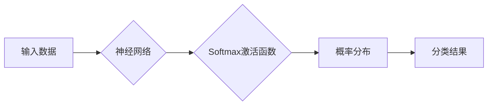

> 大模型开发, 微调, Softmax激活函数, 激活函数, 神经网络, 概率分布, 分类任务

## 1. 背景介绍

近年来，深度学习在计算机视觉、自然语言处理等领域取得了突破性进展，其核心驱动力是大型语言模型（LLM）的快速发展。这些模型拥有数十亿甚至数千亿的参数，能够处理海量数据，学习复杂的模式，并生成高质量的文本、图像和代码。然而，训练和部署大型模型需要大量的计算资源和专业知识，这使得许多研究者和开发者望而却步。

为了降低模型开发的门槛，微调技术应运而生。微调是指在预训练模型的基础上，针对特定任务进行少量数据训练，从而提升模型在该任务上的性能。与从头训练相比，微调可以显著减少训练时间和资源消耗，同时也能获得较好的性能。

激活函数是神经网络中不可或缺的组成部分，它决定了神经元的输出是否被激活，从而影响了网络的学习能力。Softmax激活函数是分类任务中常用的激活函数，它将神经元的输出映射到一个概率分布，从而预测输入属于各个类别的概率。

## 2. 核心概念与联系

**2.1  神经网络**

神经网络是一种模仿人脑结构和功能的计算模型。它由多个层级的神经元组成，每个神经元接收来自上一层的输入，并通过权重进行加权求和，然后经过激活函数处理，输出到下一层。

**2.2  激活函数**

激活函数是神经网络中引入非线性性的关键组件。它将神经元的输入映射到输出，并决定了神经元是否被激活。常见的激活函数包括ReLU、Sigmoid、Tanh和Softmax等。

**2.3  Softmax激活函数**

Softmax激活函数是一种常用的分类任务激活函数。它将神经元的输出映射到一个概率分布，每个输出值代表输入属于各个类别的概率。

**2.4  概率分布**

概率分布描述了随机事件发生的可能性。在分类任务中，Softmax激活函数将神经元的输出映射到一个概率分布，每个输出值代表输入属于各个类别的概率。

**2.5  分类任务**

分类任务是指将输入数据划分为不同的类别。例如，图像分类、文本分类和语音识别等都是分类任务。

**Mermaid 流程图**



## 3. 核心算法原理 & 具体操作步骤

### 3.1  算法原理概述

Softmax激活函数的原理是将神经元的输出映射到一个概率分布，每个输出值代表输入属于各个类别的概率。具体来说，对于一个包含n个类别的分类任务，Softmax激活函数的计算公式如下：

$$
\text{Softmax}(z_i) = \frac{e^{z_i}}{\sum_{j=1}^{n} e^{z_j}}
$$

其中，$z_i$是神经元i的输出，$n$是类别总数。

### 3.2  算法步骤详解

1. 计算神经网络的输出：将输入数据通过神经网络进行前向传播，得到每个类别的输出值$z_i$。

2. 计算指数：对每个输出值$z_i$计算指数函数$e^{z_i}$。

3. 求和：对所有类别的指数值求和，得到分母。

4. 归一化：将每个类别的指数值除以分母，得到每个类别的概率值。

### 3.3  算法优缺点

**优点：**

* 将神经元的输出映射到概率分布，方便进行分类任务。
* 计算简单，易于实现。

**缺点：**

* 当类别数很多时，计算量较大。
* 对输出值范围敏感，当输出值差距很大时，可能会导致概率分布过于集中。

### 3.4  算法应用领域

Softmax激活函数广泛应用于各种分类任务，例如：

* 图像分类
* 文本分类
* 语音识别
* 对象检测

## 4. 数学模型和公式 & 详细讲解 & 举例说明

### 4.1  数学模型构建

Softmax激活函数的数学模型可以表示为一个函数，该函数将神经元的输出映射到一个概率分布。

$$
f(z) = \text{Softmax}(z) = \left( \frac{e^{z_1}}{\sum_{j=1}^{n} e^{z_j}}, \frac{e^{z_2}}{\sum_{j=1}^{n} e^{z_j}}, ..., \frac{e^{z_n}}{\sum_{j=1}^{n} e^{z_j}} \right)
$$

其中，$z = (z_1, z_2, ..., z_n)$是神经网络的输出向量，$n$是类别总数。

### 4.2  公式推导过程

Softmax激活函数的公式推导过程如下：

1. 首先，我们需要将神经元的输出映射到一个非负的实数域。

2. 然后，我们需要将这些非负实数归一化，使其构成一个概率分布。

3. 为了实现这两个目标，我们使用指数函数和归一化因子。

### 4.3  案例分析与讲解

假设我们有一个包含三个类别的分类任务，神经网络的输出为：

$$
z = (2, 1, -1)
$$

使用Softmax激活函数计算每个类别的概率：

$$
\text{Softmax}(z) = \left( \frac{e^{2}}{\sum_{j=1}^{3} e^{z_j}}, \frac{e^{1}}{\sum_{j=1}^{3} e^{z_j}}, \frac{e^{-1}}{\sum_{j=1}^{3} e^{z_j}} \right)
$$

计算结果为：

$$
\text{Softmax}(z) = (0.88, 0.11, 0.01)
$$

这表明输入属于类别1的概率为0.88，属于类别2的概率为0.11，属于类别3的概率为0.01。

## 5. 项目实践：代码实例和详细解释说明

### 5.1  开发环境搭建

本项目使用Python语言和TensorFlow框架进行开发。

**依赖库:**

```
pip install tensorflow
```

### 5.2  源代码详细实现

```python
import tensorflow as tf

# 定义Softmax激活函数
def softmax(x):
  return tf.nn.softmax(x)

# 定义一个简单的分类模型
model = tf.keras.models.Sequential([
  tf.keras.layers.Dense(10, activation='relu', input_shape=(784,)),
  tf.keras.layers.Dense(10, activation=softmax)
])

# 编译模型
model.compile(optimizer='adam',
              loss='sparse_categorical_crossentropy',
              metrics=['accuracy'])

# 加载MNIST数据集
(x_train, y_train), (x_test, y_test) = tf.keras.datasets.mnist.load_data()

# 数据预处理
x_train = x_train.reshape(-1, 784).astype('float32') / 255
x_test = x_test.reshape(-1, 784).astype('float32') / 255

# 训练模型
model.fit(x_train, y_train, epochs=5)

# 评估模型
loss, accuracy = model.evaluate(x_test, y_test)
print('Test loss:', loss)
print('Test accuracy:', accuracy)
```

### 5.3  代码解读与分析

* **定义Softmax激活函数:** 使用`tf.nn.softmax()`函数定义Softmax激活函数。
* **定义分类模型:** 使用`tf.keras.models.Sequential()`构建一个简单的分类模型，包含两层全连接层。第一层使用ReLU激活函数，第二层使用Softmax激活函数。
* **编译模型:** 使用`model.compile()`函数编译模型，指定优化器、损失函数和评估指标。
* **加载数据集:** 使用`tf.keras.datasets.mnist.load_data()`函数加载MNIST数据集。
* **数据预处理:** 将数据转换为合适的格式，并进行归一化处理。
* **训练模型:** 使用`model.fit()`函数训练模型。
* **评估模型:** 使用`model.evaluate()`函数评估模型在测试集上的性能。

### 5.4  运行结果展示

运行代码后，会输出模型在测试集上的损失值和准确率。

## 6. 实际应用场景

Softmax激活函数在各种实际应用场景中发挥着重要作用，例如：

* **图像分类:** 将图像分类为不同的类别，例如猫、狗、车等。
* **文本分类:** 将文本分类为不同的类别，例如情感分析、主题分类等。
* **语音识别:** 将语音识别为不同的单词或句子。
* **自然语言处理:** 在机器翻译、文本摘要等任务中使用。

### 6.4  未来应用展望

随着深度学习技术的不断发展，Softmax激活函数在未来将有更广泛的应用场景，例如：

* **医疗诊断:** 将医学图像分类为不同的疾病类型。
* **金融预测:** 对股票价格、汇率等进行预测。
* **自动驾驶:** 对周围环境进行识别和分类，帮助车辆做出决策。

## 7. 工具和资源推荐

### 7.1  学习资源推荐

* **书籍:**
    * 深度学习
    * 构建深度学习模型
* **在线课程:**
    * Coursera深度学习课程
    * Udacity深度学习课程

### 7.2  开发工具推荐

* **TensorFlow:** 开源深度学习框架
* **PyTorch:** 开源深度学习框架
* **Keras:** 高级深度学习API

### 7.3  相关论文推荐

* **Softmax Regression**
* **Deep Learning**

## 8. 总结：未来发展趋势与挑战

### 8.1  研究成果总结

Softmax激活函数是深度学习中常用的激活函数之一，它在分类任务中发挥着重要作用。

### 8.2  未来发展趋势

未来，Softmax激活函数可能会朝着以下方向发展：

* **更有效的计算方法:** 为了提高计算效率，可能会开发出更有效的计算Softmax激活函数的方法。
* **更鲁棒的模型:** 为了提高模型的鲁棒性，可能会研究新的Softmax变体，使其对噪声和异常值更具抵抗力。
* **应用于新的领域:** Softmax激活函数可能会应用于新的领域，例如医疗诊断、金融预测等。

### 8.3  面临的挑战

Softmax激活函数也面临一些挑战：

* **类别数限制:** 当类别数很多时，Softmax激活函数的计算量会很大。
* **输出值敏感性:** Softmax激活函数对输出值范围敏感，当输出值差距很大时，可能会导致概率分布过于集中。

### 8.4  研究展望

未来，研究者将继续探索Softmax激活函数的改进方法，使其更加高效、鲁棒和通用。

## 9. 附录：常见问题与解答

**问题1:** Softmax激活函数的输出值范围是多少？

**答案:** Softmax激活函数的输出值范围是[0, 1]。

**问题2:** Softmax激活函数的计算量是多少？

**答案:** Softmax激活函数的计算量与类别数成正比。当类别数很多时，计算量会很大。

**问题3:** Softmax激活函数对输出值范围敏感吗？

**答案:** 是的，Softmax激活函数对输出值范围敏感。当输出值差距很大时，可能会导致概率分布过于集中。


作者：禅与计算机程序设计艺术 / Zen and the Art of Computer Programming 
<end_of_turn>