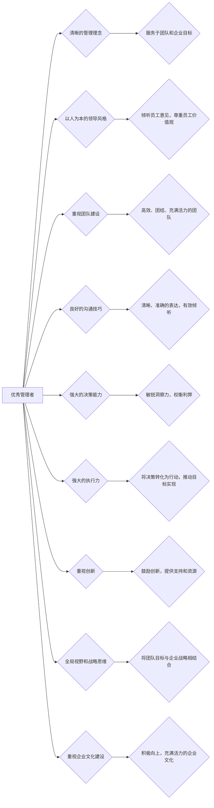

> 优秀管理者,普通管理者,领导力,团队建设,沟通技巧,决策能力,执行力,创新能力,战略思维,文化建设

## 1. 背景介绍

在当今瞬息万变的商业环境中，管理者扮演着至关重要的角色。他们不仅需要带领团队完成既定的目标，更需要洞察市场趋势，引领团队不断创新和发展。然而，优秀的管理者与普通管理者之间存在着显著的差异，这决定着团队的成败与企业的发展前景。

## 2. 核心概念与联系

优秀的管理者与普通管理者之间的差异，并非仅仅体现在个人能力上，更在于他们对管理理念、领导风格、团队建设等方面的理解和实践。

**2.1 管理理念**

优秀的管理者拥有清晰的管理理念，他们相信管理的本质是服务于团队和企业的目标，而不是单纯地控制和指挥。他们注重员工的成长和发展，并为员工提供充分的自主权和空间，激发员工的积极性和创造力。

**2.2 领导风格**

优秀的管理者往往采用以人为本的领导风格，他们善于倾听员工的意见，尊重员工的个性和价值观，并根据团队成员的特点，灵活调整领导方式。他们能够激励和鼓舞团队成员，并为团队成员提供支持和帮助。

**2.3 团队建设**

优秀的管理者重视团队建设，他们能够打造高效、团结、充满活力的团队。他们注重团队成员之间的沟通和协作，并建立良好的团队文化，营造积极向上的工作氛围。

**2.4 沟通技巧**

优秀的管理者拥有良好的沟通技巧，他们能够清晰、准确地表达自己的想法，并有效地倾听他人的意见。他们善于处理人际关系，并能够在团队成员之间建立良好的沟通渠道。

**2.5 决策能力**

优秀的管理者拥有敏锐的洞察力和强大的决策能力，他们能够在复杂的环境中做出正确的判断，并制定有效的行动计划。他们善于分析问题，并能够权衡利弊，做出最优的决策。

**2.6 执行力**

优秀的管理者拥有强大的执行力，他们能够将决策转化为行动，并有效地推动团队目标的实现。他们注重细节，并能够严格执行计划，确保目标的顺利完成。

**2.7 创新能力**

优秀的管理者重视创新，他们鼓励团队成员提出新想法，并为创新提供支持和资源。他们能够洞察市场趋势，并引领团队不断探索新的领域。

**2.8 战略思维**

优秀的管理者拥有全局视野和战略思维，他们能够将团队目标与企业战略相结合，并制定相应的行动计划。他们能够预判未来趋势，并为企业的发展做好准备。

**2.9 文化建设**

优秀的管理者重视企业文化建设，他们能够打造积极向上、充满活力的企业文化，并以此凝聚团队力量，推动企业发展。

**Mermaid 流程图**



## 3. 核心算法原理 & 具体操作步骤

**3.1 算法原理概述**

优秀的管理者与普通管理者之间的差异，可以看作是一个复杂的决策和执行过程，其中涉及到大量的算法和模型。这些算法和模型帮助管理者分析数据、预测趋势、制定策略、评估结果等。

**3.2 算法步骤详解**

1. **数据收集和分析:** 优秀的管理者会收集各种数据，例如员工绩效、市场趋势、竞争对手情况等，并通过数据分析工具进行分析，以获得对团队和企业的深入了解。

2. **目标设定和策略制定:** 基于数据分析的结果，优秀的管理者会设定明确的目标，并制定相应的策略，以实现目标。

3. **任务分配和资源配置:** 优秀的管理者会根据团队成员的技能和经验，合理分配任务，并配置必要的资源，以确保任务的顺利完成。

4. **过程监控和反馈:** 优秀的管理者会持续监控任务的执行进度，并及时收集反馈信息，以便及时调整策略和方案。

5. **结果评估和改进:** 优秀的管理者会定期评估结果，并根据评估结果进行改进，以不断提升管理效率和团队绩效。

**3.3 算法优缺点**

* **优点:** 

    * 数据驱动决策，提高决策的准确性和有效性。
    * 提高团队协作效率，优化资源配置。
    * 持续改进管理流程，提升管理水平。

* **缺点:** 

    * 数据质量和分析能力直接影响决策结果。
    * 算法模型需要不断更新和完善，以适应不断变化的环境。
    * 过度依赖算法可能会忽略人的主观判断和创造力。

**3.4 算法应用领域**

* **人力资源管理:** 人才招聘、绩效评估、培训计划等。
* **项目管理:** 任务分配、进度监控、风险控制等。
* **市场营销:** 市场调研、客户分析、广告投放等。
* **财务管理:** 预算编制、成本控制、风险管理等。

## 4. 数学模型和公式 & 详细讲解 & 举例说明

**4.1 数学模型构建**

优秀的管理者可以利用数学模型来分析和预测团队和企业的未来发展趋势。例如，可以使用线性回归模型来预测员工的绩效，可以使用预测分析模型来预测市场需求，可以使用游戏理论来分析竞争对手的行为。

**4.2 公式推导过程**

例如，线性回归模型的公式如下：

$$y = mx + b$$

其中：

* $y$ 是预测值
* $x$ 是自变量
* $m$ 是回归系数
* $b$ 是截距

通过对历史数据进行拟合，可以求出回归系数 $m$ 和截距 $b$，从而得到预测模型。

**4.3 案例分析与讲解**

假设一家公司想要预测员工的绩效，可以使用线性回归模型。

* 自变量：员工的工作经验
* 预测值：员工的绩效评分

通过对历史数据进行分析，可以发现员工的工作经验与绩效评分之间存在正相关关系，即工作经验越多，绩效评分越高。

根据线性回归模型的公式，可以建立预测模型，并预测新员工的绩效评分。

## 5. 项目实践：代码实例和详细解释说明

**5.1 开发环境搭建**

优秀的管理者需要了解基本的编程知识，以便能够使用代码工具来实现管理目标。例如，可以使用Python语言来编写数据分析脚本，可以使用JavaScript语言来开发管理系统。

**5.2 源代码详细实现**

以下是一个使用Python语言编写的数据分析脚本的示例代码：

```python
import pandas as pd

# 读取数据
data = pd.read_csv("employee_data.csv")

# 计算平均绩效评分
average_score = data["绩效评分"].mean()

# 打印结果
print("平均绩效评分:", average_score)
```

**5.3 代码解读与分析**

这段代码首先使用Pandas库读取数据文件，然后计算员工绩效评分的平均值，最后打印结果。

**5.4 运行结果展示**

运行这段代码后，会输出员工绩效评分的平均值。

## 6. 实际应用场景

优秀的管理者可以将算法和代码工具应用于各种实际场景，例如：

* **员工绩效管理:** 使用算法模型预测员工的绩效，并制定个性化的培训计划。
* **项目风险管理:** 使用算法模型识别项目风险，并制定相应的风险控制措施。
* **市场营销分析:** 使用算法模型分析市场数据，并制定精准的营销策略。

**6.4 未来应用展望**

随着人工智能技术的不断发展，优秀的管理者将能够利用更先进的算法和工具，更好地管理团队和企业。例如，可以使用机器学习模型来预测员工流失风险，可以使用自然语言处理技术来分析员工反馈意见，可以使用虚拟助手来协助管理者完成日常工作。

## 7. 工具和资源推荐

**7.1 学习资源推荐**

* **书籍:** 《管理学原理》、《领导力》、《数据驱动决策》
* **在线课程:** Coursera、edX、Udemy等平台提供各种管理和数据分析课程。
* **博客和论坛:** 关注行业知名博客和论坛，学习最新的管理理念和实践经验。

**7.2 开发工具推荐**

* **Python:** 数据分析、机器学习、自动化脚本等。
* **R:** 数据可视化、统计分析等。
* **Tableau:** 数据可视化和报表工具。

**7.3 相关论文推荐**

* **《数据驱动决策》**
* **《人工智能在管理中的应用》**
* **《领导力与团队绩效》**

## 8. 总结：未来发展趋势与挑战

**8.1 研究成果总结**

优秀的管理者与普通管理者的差异，可以归结为管理理念、领导风格、团队建设、沟通技巧、决策能力、执行力、创新能力、战略思维和文化建设等方面的差异。

**8.2 未来发展趋势**

未来，优秀的管理者将更加注重数据驱动决策、人工智能应用、跨文化管理、持续学习等方面。

**8.3 面临的挑战**

优秀的管理者将面临着快速变化的市场环境、激烈的竞争压力、人才短缺等挑战。

**8.4 研究展望**

未来，需要进一步研究优秀的管理者的人格特质、领导风格、团队建设模式等方面的规律，并探索如何培养和提升优秀的管理者。

## 9. 附录：常见问题与解答

**9.1 如何培养优秀的管理者？**

培养优秀的管理者需要从以下几个方面入手：

* **加强管理理念教育:** 让管理者了解最新的管理理念和实践经验。
* **提升领导能力培训:** 帮助管理者掌握有效的领导风格和沟通技巧。
* **注重团队建设:** 鼓励管理者打造高效、团结、充满活力的团队。
* **提供学习和成长机会:** 给予管理者学习新知识、提升技能的机会。

**9.2 如何评估管理者的绩效？**

评估管理者的绩效需要从多个方面进行，例如：

* **团队绩效:** 团队目标完成情况、员工满意度等。
* **个人能力:** 领导能力、沟通能力、决策能力等。
* **职业道德:** 诚信、责任心、团队合作精神等。


作者：禅与计算机程序设计艺术 / Zen and the Art of Computer Programming 
<end_of_turn>