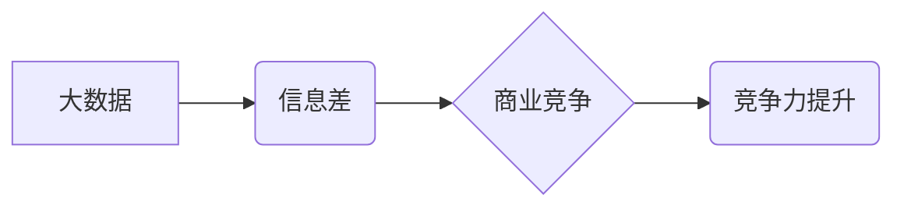

> 大数据，信息差，商业竞争，数据分析，机器学习，人工智能，商业模式创新

## 1. 背景介绍

在当今信息爆炸的时代，数据已成为企业最重要的资产。企业通过收集、分析和利用数据，可以洞察市场趋势、了解客户需求、优化运营效率，从而获得竞争优势。然而，仅仅拥有大量数据并不能带来成功，关键在于如何有效地利用数据，转化为有价值的商业洞察和行动。

信息差一直是商业竞争的核心驱动力。拥有更丰富、更准确、更及时信息的企业，能够更有效地做出决策，抢占市场先机。而大数据技术的出现，为企业获取和利用信息提供了强大的工具。通过大数据分析，企业可以从海量数据中挖掘出隐藏的模式和趋势，获得对市场、客户和自身运营的更深入的理解。

## 2. 核心概念与联系

**2.1 大数据**

大数据是指规模庞大、结构复杂、速度快、多样化的数据。其特点是：

* **海量**: 数据量巨大，难以用传统方法处理。
* **高速**: 数据生成和更新速度快，需要实时处理。
* **多样化**: 数据类型多种多样，包括结构化数据、非结构化数据和半结构化数据。
* **复杂性**: 数据关系复杂，需要复杂的分析方法进行处理。

**2.2 信息差**

信息差是指不同主体之间对信息的掌握程度和利用程度的差异。在商业竞争中，信息差可以带来以下优势：

* **决策优势**: 拥有更多信息，可以做出更明智的决策。
* **市场优势**: 了解市场趋势和客户需求，可以抢占市场先机。
* **运营优势**: 优化运营流程，提高效率和效益。

**2.3 数据驱动的竞争力提升**

通过大数据分析，企业可以缩小信息差，提升竞争力。具体来说，大数据可以帮助企业：

* **洞察市场趋势**: 分析市场数据，了解消费者需求和行为模式，预测市场变化。
* **精准营销**: 根据客户数据，进行精准的营销推广，提高营销效果。
* **优化运营**: 分析运营数据，识别瓶颈和改进点，提高运营效率。
* **创新产品**: 通过数据分析，了解客户需求，开发更符合市场需求的产品。

**2.4  核心概念关系图**



## 3. 核心算法原理 & 具体操作步骤

**3.1 算法原理概述**

大数据分析中常用的算法包括：

* **机器学习**: 通过算法训练，让计算机从数据中学习，并做出预测或分类。
* **深度学习**: 一种更高级的机器学习算法，利用多层神经网络，可以处理更复杂的数据。
* **数据挖掘**: 从数据中发现隐藏的模式和规律。
* **统计分析**: 使用统计方法对数据进行分析，得出结论。

**3.2 算法步骤详解**

以机器学习为例，其基本步骤包括：

1. **数据收集**: 收集相关数据，并进行清洗和预处理。
2. **数据特征提取**: 从数据中提取特征，用于训练模型。
3. **模型选择**: 选择合适的机器学习算法，根据具体任务需求。
4. **模型训练**: 使用训练数据，训练机器学习模型。
5. **模型评估**: 使用测试数据，评估模型的性能。
6. **模型部署**: 将训练好的模型部署到生产环境中，用于预测或分类。

**3.3 算法优缺点**

不同的算法有不同的优缺点，需要根据具体任务需求选择合适的算法。

* **机器学习**: 优点：可以自动学习数据模式，无需人工特征工程；缺点：需要大量数据进行训练，训练时间较长。
* **深度学习**: 优点：可以处理更复杂的数据，性能更优；缺点：需要更多计算资源，训练时间更长。
* **数据挖掘**: 优点：可以发现隐藏的模式和规律；缺点：需要专业知识进行分析。
* **统计分析**: 优点：方法成熟，易于理解；缺点：对数据类型和分布有要求。

**3.4 算法应用领域**

大数据分析算法广泛应用于各个领域，例如：

* **电商**: 商品推荐、用户画像、精准营销。
* **金融**: 风险评估、欺诈检测、投资决策。
* **医疗**: 疾病诊断、药物研发、个性化医疗。
* **交通**: 交通流量预测、路线规划、智能驾驶。

## 4. 数学模型和公式 & 详细讲解 & 举例说明

**4.1 数学模型构建**

在数据分析中，数学模型可以用来描述数据之间的关系，并进行预测或分类。常见的数学模型包括：

* **线性回归**: 用于预测连续变量。
* **逻辑回归**: 用于预测分类变量。
* **支持向量机**: 用于分类和回归。
* **决策树**: 用于分类和回归。

**4.2 公式推导过程**

以线性回归为例，其目标是找到一条直线，使得预测值与实际值之间的误差最小。

线性回归模型的公式为：

$$y = mx + c$$

其中：

* $y$ 是预测值。
* $x$ 是输入变量。
* $m$ 是斜率。
* $c$ 是截距。

为了找到最佳的 $m$ 和 $c$ 值，可以使用最小二乘法。最小二乘法的目标是使预测值与实际值之间的平方误差最小。

**4.3 案例分析与讲解**

假设我们有一组数据，记录了房屋面积和房屋价格。我们可以使用线性回归模型来预测房屋价格。

* 数据集：
    * 房屋面积 (x): 100, 150, 200, 250, 300
    * 房屋价格 (y): 500, 750, 1000, 1250, 1500

* 使用线性回归模型训练数据，得到最佳的 $m$ 和 $c$ 值。
* 使用训练好的模型，预测新的房屋价格。

## 5. 项目实践：代码实例和详细解释说明

**5.1 开发环境搭建**

* 操作系统: Ubuntu 20.04 LTS
* Python 版本: 3.8.10
* 必要的库: pandas, numpy, scikit-learn

**5.2 源代码详细实现**

```python
import pandas as pd
from sklearn.linear_model import LinearRegression
from sklearn.model_selection import train_test_split

# 加载数据
data = pd.read_csv('house_data.csv')

# 分割数据
X = data[['面积']]
y = data['价格']
X_train, X_test, y_train, y_test = train_test_split(X, y, test_size=0.2, random_state=42)

# 创建线性回归模型
model = LinearRegression()

# 训练模型
model.fit(X_train, y_train)

# 预测测试数据
y_pred = model.predict(X_test)

# 评估模型性能
from sklearn.metrics import mean_squared_error
mse = mean_squared_error(y_test, y_pred)
print(f'均方误差: {mse}')
```

**5.3 代码解读与分析**

* 首先，我们加载数据，并将其分割成训练集和测试集。
* 然后，我们创建线性回归模型，并使用训练集训练模型。
* 接下来，我们使用训练好的模型预测测试数据，并评估模型性能。

**5.4 运行结果展示**

运行代码后，会输出模型的均方误差值。均方误差值越小，模型的预测性能越好。

## 6. 实际应用场景

**6.1 商业模式创新**

大数据分析可以帮助企业发现新的商业模式，例如：

* **个性化推荐**: 根据用户的行为数据，推荐个性化的产品或服务。
* **订阅服务**: 根据用户的消费习惯，提供订阅服务。
* **数据共享**: 将数据与其他企业共享，创造新的价值。

**6.2 市场营销优化**

大数据分析可以帮助企业优化市场营销策略，例如：

* **精准营销**: 根据客户数据，进行精准的营销推广，提高营销效果。
* **价格优化**: 根据市场数据，优化产品价格，提高利润。
* **渠道优化**: 根据销售数据，优化销售渠道，提高销售效率。

**6.3 运营效率提升**

大数据分析可以帮助企业提高运营效率，例如：

* **库存管理**: 根据销售数据，优化库存管理，减少库存成本。
* **物流优化**: 根据物流数据，优化物流路线，提高物流效率。
* **客户服务**: 根据客户数据，提供更优质的客户服务。

**6.4 未来应用展望**

随着大数据技术的不断发展，其应用场景将更加广泛，例如：

* **人工智能**: 大数据是人工智能发展的基础，人工智能将进一步推动大数据分析的发展。
* **物联网**: 物联网数据将为大数据分析提供新的数据源。
* **区块链**: 区块链技术可以保障数据安全和可信，为大数据分析提供新的保障。

## 7. 工具和资源推荐

**7.1 学习资源推荐**

* **书籍**:
    * 《大数据时代》
    * 《数据科学实战》
    * 《机器学习》
* **在线课程**:
    * Coursera: 数据科学
    * edX: 大数据分析
    * Udacity: 机器学习工程师

**7.2 开发工具推荐**

* **Python**: 广泛应用于大数据分析，拥有丰富的库和工具。
* **Spark**: 用于大规模数据处理的开源框架。
* **Hadoop**: 用于分布式存储和处理大数据的开源框架。

**7.3 相关论文推荐**

* 《大数据分析的挑战与机遇》
* 《机器学习算法在商业应用中的研究》
* 《大数据驱动的商业模式创新》

## 8. 总结：未来发展趋势与挑战

**8.1 研究成果总结**

大数据分析技术已经取得了显著的成果，在各个领域都有广泛的应用。

**8.2 未来发展趋势**

* **人工智能**: 人工智能将进一步推动大数据分析的发展，例如，自动数据分析、智能决策支持。
* **云计算**: 云计算将为大数据分析提供更强大的计算资源和存储空间。
* **边缘计算**: 边缘计算将使大数据分析更加实时和高效。

**8.3 面临的挑战**

* **数据质量**: 数据质量问题是影响大数据分析效果的关键因素。
* **数据安全**: 数据安全问题是需要重视的挑战。
* **人才缺口**: 大数据分析人才缺口较大。

**8.4 研究展望**

未来，大数据分析技术将继续发展，并应用于更多领域。我们需要关注以下研究方向：

* **数据质量提升**: 研究更有效的解决数据质量问题的技术。
* **数据安全保障**: 研究更完善的数据安全保障机制。
* **人才培养**: 加强大数据分析人才的培养。


## 9. 附录：常见问题与解答

**9.1 如何处理缺失数据？**

缺失数据处理方法包括：删除缺失数据、用平均值或中位数填充缺失数据、使用机器学习算法进行预测。

**9.2 如何选择合适的机器学习算法？**

选择合适的机器学习算法需要考虑数据的类型、任务目标、模型复杂度等因素。

**9.3 如何评估机器学习模型的性能？**

常用的机器学习模型性能评估指标包括准确率、召回率、F1-score、AUC等。

**9.4 如何防止数据泄露？**

数据泄露预防措施包括：数据加密、访问控制、安全审计等。


作者：禅与计算机程序设计艺术 / Zen and the Art of Computer Programming 
<end_of_turn>