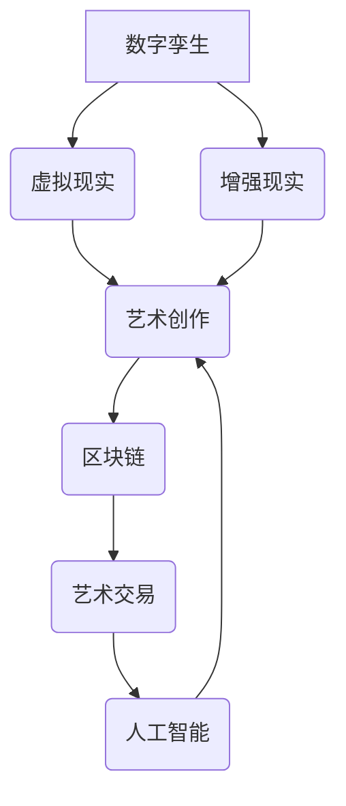

> 元宇宙、艺术创作、人工智能、数字孪生、NFT、区块链、虚拟现实、增强现实

## 1. 背景介绍

艺术创作一直是人类文明的重要组成部分，它反映了人类对世界和自身的理解，并激发了人们的想象力和创造力。随着科技的进步，特别是数字技术的飞速发展，艺术创作的形式和内容也发生了深刻的变化。元宇宙作为一种新兴的虚拟世界，为艺术创作提供了全新的平台和可能性。

元宇宙的概念最早出现在科幻小说中，后来被广泛应用于游戏、社交媒体等领域。它是一个由虚拟现实、增强现实、区块链等技术构建的沉浸式虚拟世界，用户可以在其中创建、分享和体验虚拟内容。元宇宙的出现为艺术创作带来了以下几个方面的变革：

* **打破物理限制:** 元宇宙的虚拟空间不受物理空间的限制，艺术家可以自由地创作出任何形式的艺术作品，不受材料、尺寸、地理位置等因素的限制。
* **增强交互体验:** 元宇宙中的艺术作品可以与用户进行互动，用户可以参与到创作过程中，甚至可以改变艺术作品的形态和内容。
* **赋予作品新的价值:** 元宇宙中的艺术作品可以以数字资产的形式存在，并通过区块链技术进行交易和管理，赋予作品新的价值和流通性。

## 2. 核心概念与联系

元宇宙艺术创作的核心概念包括：

* **数字孪生:** 元宇宙中的虚拟世界与现实世界存在着映射关系，每个实体都有其对应的数字孪生，包括艺术作品、用户、场景等。
* **虚拟现实 (VR) 和增强现实 (AR):** VR 和 AR 技术可以为用户提供沉浸式的体验，让用户身临其境地感受艺术作品。
* **区块链技术:** 区块链技术可以确保艺术作品的唯一性和不可篡改性，并为艺术交易提供安全可靠的平台。
* **人工智能 (AI):** AI 技术可以辅助艺术家创作艺术作品，例如生成图像、音乐、文本等。

**核心概念架构图:**



## 3. 核心算法原理 & 具体操作步骤

### 3.1  算法原理概述

元宇宙艺术创作涉及到多种算法，例如图像生成算法、音乐生成算法、文本生成算法等。这些算法通常基于深度学习技术，通过训练大量的样本数据，学习到艺术创作的规律和模式。

### 3.2  算法步骤详解

以图像生成算法为例，其具体操作步骤如下：

1. **数据收集和预处理:** 收集大量的艺术图像数据，并进行预处理，例如裁剪、缩放、格式转换等。
2. **模型训练:** 使用深度学习框架，例如TensorFlow或PyTorch，训练图像生成模型。训练过程中，模型会学习到图像的特征和结构。
3. **参数调整:** 根据训练结果，调整模型的参数，例如学习率、批处理大小等，以提高模型的性能。
4. **图像生成:** 将训练好的模型应用于新的输入数据，例如文字描述、草图等，生成新的艺术图像。

### 3.3  算法优缺点

**优点:**

* 可以生成逼真的艺术图像。
* 可以根据用户的需求生成个性化的艺术作品。
* 可以加速艺术创作流程。

**缺点:**

* 需要大量的训练数据。
* 模型训练需要消耗大量的计算资源。
* 生成的艺术作品可能缺乏原创性和情感表达。

### 3.4  算法应用领域

图像生成算法在元宇宙艺术创作中具有广泛的应用领域，例如：

* **虚拟艺术展览:** 生成虚拟艺术作品，展示在虚拟展览馆中。
* **个性化艺术品定制:** 根据用户的需求生成个性化的艺术品。
* **虚拟艺术创作工具:** 提供艺术家创作虚拟艺术作品的工具。

## 4. 数学模型和公式 & 详细讲解 & 举例说明

### 4.1  数学模型构建

元宇宙艺术创作涉及到多种数学模型，例如：

* **图像处理模型:** 用于处理和生成图像数据，例如卷积神经网络 (CNN)。
* **几何模型:** 用于描述虚拟空间中的物体和场景，例如三维模型。
* **物理模型:** 用于模拟虚拟世界中的物理现象，例如碰撞、重力等。

### 4.2  公式推导过程

以卷积神经网络 (CNN) 为例，其核心公式包括：

* **卷积操作:** $$y_{i,j} = \sum_{m=0}^{M-1} \sum_{n=0}^{N-1} x_{i+m,j+n} * w_{m,n}$$

其中，$x_{i,j}$ 表示输入图像的像素值，$w_{m,n}$ 表示卷积核的权重，$y_{i,j}$ 表示卷积后的输出值。

* **激活函数:** $$f(z) = \frac{1}{1 + e^{-z}}$$

激活函数用于引入非线性，使网络能够学习更复杂的特征。

### 4.3  案例分析与讲解

以生成艺术图像为例，CNN 可以学习到图像的特征和结构，并根据这些特征生成新的图像。例如，训练一个 CNN 模型，使其能够生成风格化的艺术图像，可以将模型输入一张普通照片，并通过模型生成一张具有特定艺术风格的图像。

## 5. 项目实践：代码实例和详细解释说明

### 5.1  开发环境搭建

元宇宙艺术创作项目可以使用 Python 语言和深度学习框架进行开发，例如 TensorFlow 或 PyTorch。需要安装 Python、深度学习框架和相关的库，例如 NumPy、Matplotlib 等。

### 5.2  源代码详细实现

以下是一个简单的图像生成代码示例，使用 TensorFlow 和 Keras 库：

```python
from tensorflow import keras
from tensorflow.keras import layers

# 定义模型结构
model = keras.Sequential(
    [
        layers.Input(shape=(28, 28, 1)),
        layers.Conv2D(32, kernel_size=(3, 3), activation="relu"),
        layers.MaxPooling2D(pool_size=(2, 2)),
        layers.Conv2D(64, kernel_size=(3, 3), activation="relu"),
        layers.MaxPooling2D(pool_size=(2, 2)),
        layers.Flatten(),
        layers.Dense(10, activation="softmax"),
    ]
)

# 编译模型
model.compile(optimizer="adam", loss="sparse_categorical_crossentropy", metrics=["accuracy"])

# 训练模型
model.fit(x_train, y_train, epochs=10)

# 生成图像
generated_image = model.predict(x_test)
```

### 5.3  代码解读与分析

这段代码定义了一个简单的卷积神经网络模型，用于图像分类。模型包含两个卷积层、两个最大池化层、一个全连接层和一个输出层。模型使用 Adam 优化器、交叉熵损失函数和准确率作为评估指标。

### 5.4  运行结果展示

训练完成后，模型可以用于预测新的图像类别。

## 6. 实际应用场景

### 6.1  虚拟艺术展览

元宇宙艺术创作可以用于创建虚拟艺术展览，让用户身临其境地体验艺术作品。例如，艺术家可以将自己的绘画、雕塑、音乐等作品上传到元宇宙平台，并为其创建虚拟展厅。用户可以通过 VR 或 AR 设备进入虚拟展厅，欣赏艺术作品，并与其他用户互动。

### 6.2  个性化艺术品定制

元宇宙艺术创作可以为用户提供个性化艺术品定制服务。用户可以根据自己的喜好，选择艺术风格、主题、颜色等参数，生成独一无二的艺术作品。例如，用户可以生成带有自己肖像的艺术画，或者生成以自己喜欢的音乐为主题的艺术作品。

### 6.3  虚拟艺术创作工具

元宇宙艺术创作可以提供艺术家创作虚拟艺术作品的工具。例如，可以提供虚拟画笔、虚拟雕塑工具、虚拟音乐制作软件等，让艺术家在虚拟空间中自由创作。

### 6.4  未来应用展望

元宇宙艺术创作的应用场景还在不断扩展，未来可能会有更多新的应用场景出现，例如：

* **元宇宙游戏中的艺术创作:** 游戏玩家可以创作游戏中的虚拟物品、场景等。
* **元宇宙教育中的艺术教育:** 学生可以通过元宇宙平台学习艺术知识，并进行虚拟艺术创作。
* **元宇宙商业中的艺术营销:** 商家可以利用元宇宙平台进行艺术营销，例如举办虚拟艺术展览、销售虚拟艺术品等。

## 7. 工具和资源推荐

### 7.1  学习资源推荐

* **书籍:**
    * 《深度学习》
    * 《生成对抗网络》
* **在线课程:**
    * Coursera: 深度学习
    * Udacity: 计算机视觉
* **博客和论坛:**
    * TensorFlow Blog
    * PyTorch Forum

### 7.2  开发工具推荐

* **深度学习框架:** TensorFlow, PyTorch
* **图像处理库:** OpenCV, Pillow
* **3D建模软件:** Blender, Maya

### 7.3  相关论文推荐

* **Generative Adversarial Networks**
* **Deep Convolutional Generative Adversarial Networks for Image Synthesis**
* **StyleGAN2-ADA: Adapting StyleGAN2 for High-Resolution Image Synthesis**

## 8. 总结：未来发展趋势与挑战

### 8.1  研究成果总结

元宇宙艺术创作是一个新兴的领域，近年来取得了显著的进展。深度学习技术的发展使得艺术创作更加智能化和个性化。元宇宙平台为艺术创作提供了全新的空间和可能性。

### 8.2  未来发展趋势

未来，元宇宙艺术创作将朝着以下几个方向发展：

* **更逼真的艺术作品:** 随着深度学习技术的不断发展，生成的艺术作品将更加逼真、更加具有艺术价值。
* **更丰富的交互体验:** 元宇宙平台将提供更丰富的交互体验，让用户能够更加深入地参与到艺术创作中。
* **更广泛的应用场景:** 元宇宙艺术创作将应用于更多领域，例如游戏、教育、商业等。

### 8.3  面临的挑战

元宇宙艺术创作也面临着一些挑战，例如：

* **伦理问题:** 如何避免人工智能生成的艺术作品侵犯版权？如何确保艺术作品的原创性和价值？
* **技术难题:** 如何生成更加逼真、更加具有艺术价值的艺术作品？如何提高元宇宙平台的交互体验？
* **市场问题:** 如何建立元宇宙艺术作品的交易市场？如何让元宇宙艺术作品获得商业价值？

### 8.4  研究展望

未来，我们需要继续研究元宇宙艺术创作的伦理、技术和市场问题，推动元宇宙艺术创作的发展，让艺术创作更加智能化、更加个性化、更加丰富多彩。

## 9. 附录：常见问题与解答

**常见问题:**

* 元宇宙艺术作品的版权归属如何？
* 元宇宙艺术作品的价值如何评估？
* 如何参与元宇宙艺术创作？

**解答:**

* 元宇宙艺术作品的版权归属问题目前尚无统一的标准，需要根据具体情况进行判断。
* 元宇宙艺术作品的价值评估需要考虑多种因素，例如艺术价值、稀缺性、市场需求等。
* 想要参与元宇宙艺术创作，可以学习相关技术，使用元宇宙平台提供的工具，或者加入艺术创作社区。


作者：禅与计算机程序设计艺术 / Zen and the Art of Computer Programming 
<end_of_turn>