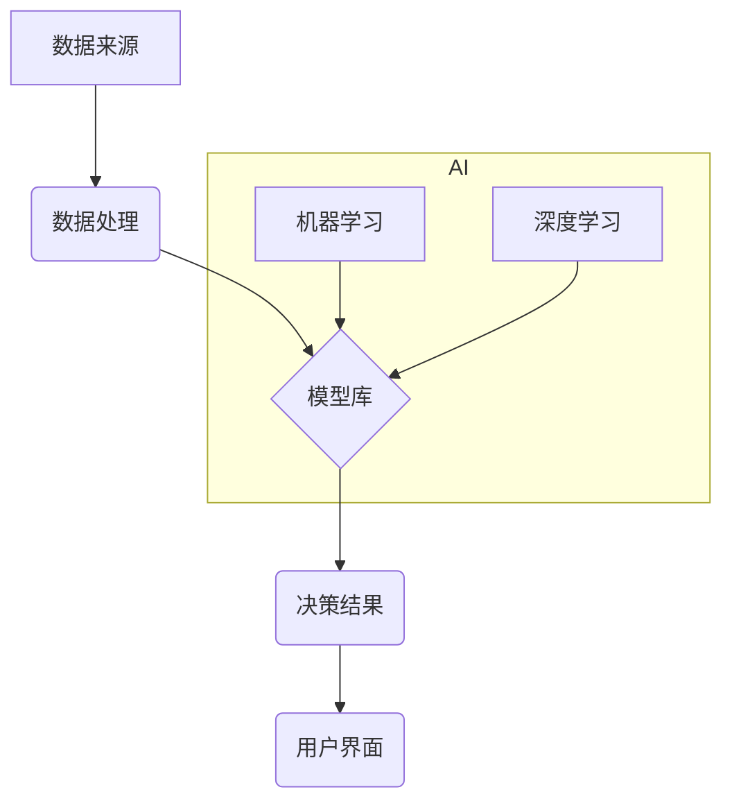

> 决策支持系统，人工智能，机器学习，深度学习，数据分析，预测建模，商业智能

## 1. 背景介绍

在当今数据爆炸的时代，企业面临着海量数据的挑战。如何从海量数据中提取有价值的洞察，并将其转化为明智的决策，成为企业发展的关键。决策支持系统 (DSS) 应运而生，旨在帮助企业用户利用数据分析和建模技术，支持决策过程。

传统的 DSS 主要依赖于专家经验和规则引擎，但随着人工智能 (AI) 技术的快速发展，DSS 迎来了新的变革。AI 算法，特别是机器学习 (ML) 和深度学习 (DL)，能够从数据中自动学习模式和关系，为决策提供更准确、更深入的洞察。

## 2. 核心概念与联系

**2.1 决策支持系统 (DSS)**

决策支持系统 (DSS) 是指利用计算机技术，帮助用户进行决策分析和支持的软件系统。它通常包含以下核心组件：

* **数据来源:** DSS 需要从各种数据源获取数据，例如数据库、电子表格、传感器数据等。
* **数据处理:** DSS 需要对获取的数据进行清洗、转换和分析，以提取有价值的信息。
* **模型库:** DSS 通常包含各种决策模型，例如预测模型、优化模型、模拟模型等。
* **用户界面:** DSS 提供用户友好的界面，方便用户输入数据、选择模型、查看结果和进行决策。

**2.2 人工智能 (AI)**

人工智能 (AI) 是指模拟人类智能的计算机系统。AI 算法能够学习、推理、解决问题和做出决策。常见的 AI 算法包括：

* **机器学习 (ML):** 机器学习算法能够从数据中学习模式和关系，并根据学习到的知识进行预测或分类。
* **深度学习 (DL):** 深度学习是机器学习的一个子集，它使用多层神经网络来模拟人类大脑的学习过程。

**2.3 核心概念联系**

AI 技术的融入，使得 DSS 能够从传统的规则驱动型决策向数据驱动型决策转变。AI 算法能够自动学习数据中的模式和关系，为决策提供更准确、更深入的洞察。



## 3. 核心算法原理 & 具体操作步骤

**3.1 算法原理概述**

决策树算法是一种常用的机器学习算法，它用于分类和回归问题。决策树算法通过构建一棵树状结构来表示决策规则，每个节点代表一个特征，每个分支代表一个特征的取值，叶子节点代表决策结果。

**3.2 算法步骤详解**

1. **选择特征:** 从所有特征中选择最优特征作为根节点。
2. **划分数据集:** 根据选择的特征将数据集划分成多个子集。
3. **递归构建树:** 对每个子集重复步骤 1 和 2，直到满足停止条件。
4. **剪枝:** 对构建好的决策树进行剪枝，以避免过拟合。

**3.3 算法优缺点**

* **优点:** 
    * 易于理解和解释。
    * 可以处理分类和回归问题。
    * 对缺失值和异常值有一定的鲁棒性。
* **缺点:** 
    * 容易过拟合。
    * 对数据特征的顺序敏感。
    * 对于高维数据，构建的决策树可能过于复杂。

**3.4 算法应用领域**

决策树算法广泛应用于各个领域，例如：

* **金融:** 贷款审批、信用风险评估
* **医疗:** 疾病诊断、患者风险预测
* **营销:** 客户分群、精准营销
* **电商:** 商品推荐、用户画像

## 4. 数学模型和公式 & 详细讲解 & 举例说明

**4.1 数学模型构建**

决策树算法的构建过程可以看作是一个贪婪算法，它在每个节点选择最优特征，以最大化信息增益或最小化信息熵。

**4.2 公式推导过程**

* **信息增益:**

$$
Gain(S,A) = Entropy(S) - \sum_{v \in Values(A)} \frac{|S_v|}{|S|} Entropy(S_v)
$$

其中：

* $S$ 是数据集
* $A$ 是特征
* $Values(A)$ 是特征 $A$ 的所有取值
* $S_v$ 是特征 $A$ 取值为 $v$ 的子集
* $Entropy(S)$ 是数据集 $S$ 的信息熵

* **信息熵:**

$$
Entropy(S) = - \sum_{i=1}^{|C|} p_i \log_2 p_i
$$

其中：

* $C$ 是类别集合
* $p_i$ 是类别 $i$ 在数据集 $S$ 中的比例

**4.3 案例分析与讲解**

假设我们有一个数据集，用于预测客户是否会购买产品。数据集包含以下特征：年龄、收入、性别、购买历史等。

我们可以使用决策树算法构建一个预测模型。首先，我们选择最优特征作为根节点，例如年龄。然后，我们将数据集根据年龄划分成两个子集：年龄小于 30 岁和年龄大于等于 30 岁。

对于每个子集，我们重复选择最优特征，并构建子树。最终，我们得到一个完整的决策树模型。

## 5. 项目实践：代码实例和详细解释说明

**5.1 开发环境搭建**

* Python 3.x
* scikit-learn 库

**5.2 源代码详细实现**

```python
from sklearn.tree import DecisionTreeClassifier
from sklearn.model_selection import train_test_split
from sklearn.metrics import accuracy_score

# 加载数据
# ...

# 将数据分为训练集和测试集
X_train, X_test, y_train, y_test = train_test_split(X, y, test_size=0.2, random_state=42)

# 创建决策树模型
model = DecisionTreeClassifier()

# 训练模型
model.fit(X_train, y_train)

# 预测测试集结果
y_pred = model.predict(X_test)

# 计算准确率
accuracy = accuracy_score(y_test, y_pred)
print(f"准确率: {accuracy}")
```

**5.3 代码解读与分析**

* `DecisionTreeClassifier()` 创建决策树分类器模型。
* `train_test_split()` 将数据分为训练集和测试集。
* `fit()` 方法训练模型。
* `predict()` 方法预测测试集结果。
* `accuracy_score()` 计算模型的准确率。

**5.4 运行结果展示**

运行代码后，会输出模型的准确率。

## 6. 实际应用场景

**6.1 金融领域**

* 贷款审批: 使用决策树模型分析客户的信用评分、收入、资产等信息，判断是否批准贷款。
* 风险评估: 评估客户的信用风险，制定相应的风险控制措施。

**6.2 医疗领域**

* 疾病诊断: 根据患者的症状、病史、检查结果等信息，预测患者患病的可能性。
* 患者风险预测: 预测患者的住院风险、并发症风险等。

**6.3 营销领域**

* 客户分群: 将客户根据他们的购买行为、兴趣爱好等特征进行分群，制定针对性的营销策略。
* 精准营销: 根据客户的个人特征和行为，推荐他们感兴趣的产品或服务。

**6.4 未来应用展望**

随着 AI 技术的不断发展，决策支持系统将更加智能化、自动化和个性化。未来，决策支持系统将能够：

* 自动学习和更新决策模型。
* 提供更个性化的决策建议。
* 与其他系统进行集成，形成更完整的决策支持生态系统。

## 7. 工具和资源推荐

**7.1 学习资源推荐**

* **书籍:**
    * 《机器学习》 - 周志华
    * 《Python机器学习实战》 - 塞缪尔·阿布拉姆斯
* **在线课程:**
    * Coursera: 机器学习
    * edX: 深度学习

**7.2 开发工具推荐**

* **Python:** 
    * scikit-learn
    * TensorFlow
    * PyTorch

**7.3 相关论文推荐**

* **决策树算法:**
    * Quinlan, J. R. (1986). Induction of decision trees. Machine learning, 1(1), 81-106.
* **机器学习:**
    * Bishop, C. M. (2006). Pattern recognition and machine learning. Springer.

## 8. 总结：未来发展趋势与挑战

**8.1 研究成果总结**

AI 技术的融入，使得决策支持系统能够从传统的规则驱动型决策向数据驱动型决策转变。AI 算法能够自动学习数据中的模式和关系，为决策提供更准确、更深入的洞察。

**8.2 未来发展趋势**

* **更智能化的决策支持系统:** 未来，决策支持系统将更加智能化，能够自动学习和更新决策模型，并提供更个性化的决策建议。
* **更广泛的应用场景:** 决策支持系统将应用于更多领域，例如教育、医疗、法律等。
* **更强大的计算能力:** 随着计算能力的提升，决策支持系统将能够处理更大规模的数据，并构建更复杂的决策模型。

**8.3 面临的挑战**

* **数据质量问题:** 决策支持系统的准确性依赖于数据的质量。如何保证数据的准确性、完整性和一致性是一个重要的挑战。
* **算法解释性问题:** 许多 AI 算法是黑箱模型，难以解释其决策过程。如何提高算法的解释性，增强用户对决策的信任是一个重要的研究方向。
* **伦理问题:** AI 算法可能会产生偏见，导致不公平的决策结果。如何确保 AI 算法的公平性和伦理性是一个重要的挑战。

**8.4 研究展望**

未来，决策支持系统将朝着更智能化、更自动化、更个性化的方向发展。研究者将继续探索新的 AI 算法和技术，以解决决策支持系统面临的挑战，并将其应用于更多领域，为人类社会带来更大的价值。

## 9. 附录：常见问题与解答

**9.1 如何选择最优特征？**

可以使用信息增益或信息熵等指标来选择最优特征。

**9.2 如何避免决策树过拟合？**

可以使用剪枝技术来避免决策树过拟合。

**9.3 如何评估决策树模型的性能？**

可以使用准确率、召回率、F1-score等指标来评估决策树模型的性能。


作者：禅与计算机程序设计艺术 / Zen and the Art of Computer Programming 
<end_of_turn>