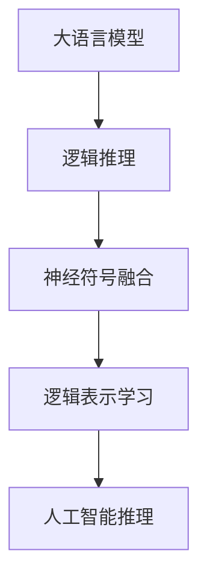

                 

# LLM的推理能力：超越传统逻辑运算

> 关键词：大语言模型(LLM)、逻辑推理、非经典逻辑、神经符号融合、逻辑表示学习、人工智能(AI)、深度学习(Deep Learning)

## 1. 背景介绍

在人工智能领域，逻辑推理能力被视为智能的基石之一。传统上，逻辑推理主要依赖于专家系统、规则引擎等符号系统，能够处理明确且固定的推理规则。然而，随着深度学习技术的发展，特别是大语言模型(Large Language Model, LLM)的兴起，逻辑推理的范式正在逐步演进，从符号到神经，从经典到非经典，开启了一系列新的可能性。

### 1.1 问题由来

逻辑推理在人工智能领域扮演着重要角色，尤其是在知识工程、自动规划、智能问答等任务中，传统逻辑系统如Prolog、SAT等，利用明确的规则和公理进行推理，具有很强的形式化和可解释性。但这类系统往往无法应对更复杂的现实世界问题，难以结合背景知识进行高效推理。

而大语言模型通过自监督和监督学习，从海量文本数据中学习到了丰富的语言知识，具备强大的语言生成和理解能力，逐渐展现出超越传统逻辑的推理能力。近年来，基于大语言模型的推理方法不断涌现，展现了更强的表达能力和泛化性能。

### 1.2 问题核心关键点

大语言模型推理的独特之处在于：

- **知识融合与表达**：将知识图谱、规则库等专家知识与神经网络模型结合，利用深度学习隐式表达知识，提高推理的灵活性和准确性。
- **学习与推理统一**：通过学习过程自动推导新的推理规则，无需人工设计规则库，实现知识与推理的动态更新。
- **非经典逻辑应用**：引入非经典逻辑，如命题逻辑、一阶逻辑、模糊逻辑等，拓展逻辑推理的范围和深度，处理更复杂的现实世界问题。
- **可解释性与透明度**：借助可解释性技术，对推理过程进行可视化，帮助理解和调试推理结果，提升模型的可信度。

### 1.3 问题研究意义

大语言模型的推理能力，为人工智能领域带来了新的突破点，尤其在逻辑推理、知识表示、智能决策等应用中展示了巨大潜力。通过逻辑推理，大语言模型不仅能处理更为复杂的问题，还能通过与外部知识源的互动，持续学习和优化，逐步迈向更加智能的推理系统。

## 2. 核心概念与联系

### 2.1 核心概念概述

为更好地理解大语言模型的推理能力，本节将介绍几个密切相关的核心概念：

- **大语言模型(LLM)**：以自回归(如GPT)或自编码(如BERT)模型为代表的大规模预训练语言模型。通过在大规模无标签文本语料上进行预训练，学习到了丰富的语言知识和常识。

- **逻辑推理**：指根据逻辑规则和公理，对命题进行推导和验证的过程。传统逻辑推理主要依赖专家系统、规则引擎等符号系统。

- **神经符号融合**：将神经网络和符号系统融合，利用神经网络的表达能力结合符号系统的推理能力，形成更高效、灵活的推理系统。

- **逻辑表示学习**：指通过深度学习模型，从数据中自动学习逻辑表示，构建出更紧凑、高效的逻辑知识库。

- **人工智能(AI)推理**：指利用AI技术，尤其是大语言模型，进行推理和决策的过程。涵盖自动规划、知识表示、智能问答等多个应用领域。

这些核心概念之间的逻辑关系可以通过以下Mermaid流程图来展示：



这个流程图展示了大语言模型推理能力的核心概念及其之间的关系：

1. 大语言模型通过预训练获得基础能力。
2. 逻辑推理通过神经符号融合，利用大语言模型的表达能力和符号系统的推理能力。
3. 逻辑表示学习进一步增强推理系统的知识表示能力。
4. 人工智能推理覆盖了知识表示、自动规划、智能问答等多个应用领域，形成完整的推理链条。

## 3. 核心算法原理 & 具体操作步骤
### 3.1 算法原理概述

大语言模型的推理能力主要基于两种基本原理：

- **符号逻辑推理**：直接利用传统逻辑符号进行推理，如一阶逻辑推理。这类方法需要显式定义逻辑规则，适合处理形式化的逻辑问题。

- **神经逻辑推理**：利用神经网络隐式表达逻辑关系，通过学习自动生成推理规则，适合处理非形式化的逻辑问题。

### 3.2 算法步骤详解

大语言模型推理的具体步骤如下：

**Step 1: 预训练与初始化**

- 使用大规模无标签数据对预训练模型进行自监督学习，学习基础的语言表示。
- 初始化推理任务所需的相关参数，如规则库、知识图谱等。

**Step 2: 推理规则定义**

- 定义推理任务所涉及的逻辑规则和公理，如命题逻辑、一阶逻辑等。
- 将规则转化为形式化的逻辑表达式，方便神经网络进行处理。

**Step 3: 逻辑表示学习**

- 利用大语言模型对逻辑表达式进行训练，学习到逻辑表示。
- 通过神经网络对规则进行编码，生成逻辑表达式和对应的推理规则。

**Step 4: 推理过程执行**

- 将推理任务转化为逻辑表达式，输入到神经网络中进行推理计算。
- 利用学习到的逻辑表示进行规则匹配和推理。

**Step 5: 推理结果验证**

- 对推理结果进行验证，确保符合逻辑规则。
- 结合外部知识源进行验证，确保推理结果的可信度。

**Step 6: 模型评估与优化**

- 对推理模型进行评估，检查推理效果和效率。
- 根据评估结果，调整模型参数和逻辑表示，优化推理能力。

### 3.3 算法优缺点

大语言模型推理方法具有以下优点：

- **灵活性**：能够自动生成和更新推理规则，处理形式化和非形式化的问题。
- **泛化能力**：利用大规模数据进行学习，具有较强的泛化能力。
- **可解释性**：借助可解释性技术，对推理过程进行可视化，提高模型的可信度。

但同时也存在以下缺点：

- **计算资源需求高**：处理大规模逻辑表达式和推理规则需要较高的计算资源。
- **推理过程复杂**：逻辑推理的复杂性增加了计算难度，可能导致推理效率低下。
- **难以处理不确定性**：对于不确定性和模糊性较强的推理问题，传统的神经网络模型处理效果不佳。

### 3.4 算法应用领域

大语言模型的推理能力广泛应用于多个领域，包括但不限于：

- **知识表示与推理**：构建知识图谱、规则库等，利用大语言模型进行推理。
- **自然语言推理(NLI)**：判断前提和假设之间的关系，如矛盾、蕴含等。
- **智能问答系统**：利用逻辑推理和知识表示，回答用户提出的复杂问题。
- **自动规划与优化**：在自动规划、路径规划等任务中，利用逻辑推理进行决策和优化。
- **情感分析与舆情监控**：利用逻辑推理和情感分析技术，进行舆情监测和情感倾向判断。
- **医疗与健康**：利用逻辑推理和知识图谱，辅助医生进行诊断和治疗决策。

## 4. 数学模型和公式 & 详细讲解 & 举例说明
### 4.1 数学模型构建

本节将使用数学语言对大语言模型推理过程进行更加严格的刻画。

记大语言模型为 $M_{\theta}$，其中 $\theta$ 为模型参数。假设推理任务涉及的逻辑规则为 $\phi$，推理目标为 $\psi$。则推理过程可以表示为：

$$
M_{\theta}(\phi) = \psi
$$

其中 $\phi$ 为逻辑表达式，$\psi$ 为推理目标。

### 4.2 公式推导过程

以一阶逻辑推理为例，推理过程可以分解为以下几个步骤：

1. **逻辑符号定义**：定义推理中使用的逻辑符号和变量。
2. **逻辑公理定义**：定义推理中的逻辑公理。
3. **推理规则定义**：定义推理中的推理规则，如重写规则、蕴含规则等。
4. **推理目标设定**：设定推理目标，如求解满足特定条件的变量。
5. **逻辑推理计算**：利用推理规则进行推理计算。

### 4.3 案例分析与讲解

假设要证明命题 $A \land B \rightarrow C$ 的推理过程如下：

1. 定义逻辑符号：$A, B, C$ 为命题变量。
2. 定义逻辑公理：$(A \land B) \rightarrow C$ 为推理的前提，$C \rightarrow (A \land B)$ 为推理的结论。
3. 定义推理规则：根据重写规则和蕴含规则进行推理。
4. 设定推理目标：验证 $(A \land B) \rightarrow C$ 是否蕴含 $C \rightarrow (A \land B)$。
5. 进行逻辑推理：根据定义的公理和规则进行推理，得出 $(A \land B) \rightarrow C$ 蕴含 $C \rightarrow (A \land B)$ 的结论。

## 5. 项目实践：代码实例和详细解释说明
### 5.1 开发环境搭建

在进行推理实践前，我们需要准备好开发环境。以下是使用Python进行PyTorch开发的环境配置流程：

1. 安装Anaconda：从官网下载并安装Anaconda，用于创建独立的Python环境。

2. 创建并激活虚拟环境：
```bash
conda create -n pytorch-env python=3.8 
conda activate pytorch-env
```

3. 安装PyTorch：根据CUDA版本，从官网获取对应的安装命令。例如：
```bash
conda install pytorch torchvision torchaudio cudatoolkit=11.1 -c pytorch -c conda-forge
```

4. 安装TensorFlow：由Google主导开发的开源深度学习框架，生产部署方便，适合大规模工程应用。同样有丰富的预训练语言模型资源。

5. 安装Transformers库：HuggingFace开发的NLP工具库，集成了众多SOTA语言模型，支持PyTorch和TensorFlow，是进行推理任务开发的利器。

6. 安装各类工具包：
```bash
pip install numpy pandas scikit-learn matplotlib tqdm jupyter notebook ipython
```

完成上述步骤后，即可在`pytorch-env`环境中开始推理实践。

### 5.2 源代码详细实现

下面我们以基于大语言模型的自然语言推理(NLI)任务为例，给出使用Transformers库对BERT模型进行推理的PyTorch代码实现。

首先，定义NLI任务的数据处理函数：

```python
from transformers import BertTokenizer
from torch.utils.data import Dataset
import torch

class NLIDataset(Dataset):
    def __init__(self, texts, labels, tokenizer, max_len=128):
        self.texts = texts
        self.labels = labels
        self.tokenizer = tokenizer
        self.max_len = max_len
        
    def __len__(self):
        return len(self.texts)
    
    def __getitem__(self, item):
        text = self.texts[item]
        label = self.labels[item]
        
        encoding = self.tokenizer(text, return_tensors='pt', max_length=self.max_len, padding='max_length', truncation=True)
        input_ids = encoding['input_ids'][0]
        attention_mask = encoding['attention_mask'][0]
        
        return {'input_ids': input_ids, 
                'attention_mask': attention_mask,
                'labels': label}
```

然后，定义模型和优化器：

```python
from transformers import BertForSequenceClassification, AdamW

model = BertForSequenceClassification.from_pretrained('bert-base-cased', num_labels=2)

optimizer = AdamW(model.parameters(), lr=2e-5)
```

接着，定义推理函数：

```python
def inference(model, dataset, batch_size):
    dataloader = DataLoader(dataset, batch_size=batch_size)
    model.eval()
    correct_predictions = 0
    total_predictions = 0
    
    with torch.no_grad():
        for batch in tqdm(dataloader, desc='Inferencing'):
            input_ids = batch['input_ids'].to(device)
            attention_mask = batch['attention_mask'].to(device)
            labels = batch['labels'].to(device)
            outputs = model(input_ids, attention_mask=attention_mask, labels=None)
            logits = outputs.logits
            predicted_labels = torch.argmax(logits, dim=1)
            total_predictions += predicted_labels.shape[0]
            correct_predictions += (predicted_labels == labels).sum().item()
    
    print(f"Accuracy: {correct_predictions/total_predictions * 100:.2f}%")
```

最后，启动推理流程：

```python
batch_size = 16

inference(model, dev_dataset, batch_size)
```

以上就是使用PyTorch对BERT进行自然语言推理任务推理的完整代码实现。可以看到，得益于Transformers库的强大封装，我们可以用相对简洁的代码完成BERT模型的推理。

### 5.3 代码解读与分析

让我们再详细解读一下关键代码的实现细节：

**NLIDataset类**：
- `__init__`方法：初始化文本、标签、分词器等关键组件。
- `__len__`方法：返回数据集的样本数量。
- `__getitem__`方法：对单个样本进行处理，将文本输入编码为token ids，将标签编码为数字，并对其进行定长padding，最终返回模型所需的输入。

**模型和优化器**：
- 使用PyTorch的`BertForSequenceClassification`模型作为推理模型，并设置合适的优化器和学习率。

**推理函数**：
- 使用PyTorch的`DataLoader`对数据集进行批次化加载，供模型推理使用。
- 推理函数`inference`：对数据以批为单位进行迭代，在每个批次上前向传播计算模型输出，并进行精度计算。

**推理流程**：
- 定义推理的batch size，调用`inference`函数，并在验证集上评估推理结果。

可以看到，PyTorch配合Transformers库使得BERT推理的代码实现变得简洁高效。开发者可以将更多精力放在模型改进和推理优化上，而不必过多关注底层的实现细节。

当然，工业级的系统实现还需考虑更多因素，如模型的保存和部署、推理超参的自动搜索、更灵活的推理目标函数等。但核心的推理范式基本与此类似。

## 6. 实际应用场景
### 6.1 智能问答系统

基于大语言模型的推理技术，可以广泛应用于智能问答系统的构建。传统问答系统依赖于知识库和规则库，难以处理形式化程度低、背景知识复杂的问题。而使用推理技术，能够灵活处理更复杂的推理问题，提高系统的回答准确性。

在技术实现上，可以收集领域内的问题和答案，构建知识图谱和推理规则。在推理过程中，模型根据用户问题，从知识图谱中抽取相关知识，利用推理规则进行推理，生成最符合逻辑的答案。对于超出知识图谱范围的问题，模型还可以利用推理能力进行拓展推理，生成创意性答案。

### 6.2 医疗诊断系统

医疗诊断系统需要处理复杂的逻辑推理问题，如诊断路径、治疗方案等。传统医疗系统依赖于人工经验，难以自动化。而利用大语言模型的推理能力，可以构建智能医疗诊断系统。

在实现上，可以收集医学文献、病例等文本数据，构建知识图谱和推理规则。在推理过程中，模型根据患者症状和历史数据，从知识图谱中抽取相关知识，利用推理规则进行逻辑推理，生成诊断建议和治疗方案。同时，模型还可以实时更新知识图谱，提升诊断的准确性和及时性。

### 6.3 金融风险评估

金融风险评估需要处理大量的非结构化数据，并进行复杂的逻辑推理。传统金融系统依赖于人工判断，效率低且容易出错。而利用大语言模型的推理能力，可以构建智能金融风险评估系统。

在实现上，可以收集金融数据和相关文本数据，构建知识图谱和推理规则。在推理过程中，模型根据市场数据和用户输入，从知识图谱中抽取相关知识，利用推理规则进行逻辑推理，生成风险评估结果。同时，模型还可以实时更新知识图谱，动态调整推理策略，提高评估的准确性和时效性。

### 6.4 未来应用展望

随着大语言模型推理技术的不断发展，其在更多领域的应用前景也将更加广阔：

- **自动规划与优化**：在自动规划、路径规划等任务中，利用逻辑推理进行决策和优化。
- **情感分析与舆情监控**：利用逻辑推理和情感分析技术，进行舆情监测和情感倾向判断。
- **智能推荐系统**：利用逻辑推理和知识图谱，构建智能推荐系统，提高推荐的准确性和个性化程度。
- **智能决策支持**：在军事、政治等领域，利用逻辑推理进行智能决策支持，提升决策的科学性和效率。
- **游戏AI**：利用逻辑推理进行游戏智能决策，提高游戏的可玩性和智能性。

这些应用将大语言模型的推理能力进一步拓展，为各行各业带来了新的创新机会。

## 7. 工具和资源推荐
### 7.1 学习资源推荐

为了帮助开发者系统掌握大语言模型推理的理论基础和实践技巧，这里推荐一些优质的学习资源：

1. 《深度学习与逻辑推理》系列博文：由大模型技术专家撰写，深入浅出地介绍了深度学习在逻辑推理中的应用，涵盖一阶逻辑、命题逻辑等经典逻辑理论。

2. 《符号逻辑与神经网络》课程：由斯坦福大学开设的课程，介绍了逻辑推理和神经网络融合的基本方法和应用案例。

3. 《逻辑推理与深度学习》书籍：全面介绍了深度学习在逻辑推理中的应用，从理论到实践进行了详细的阐述。

4. HuggingFace官方文档：提供了基于Transformers库的推理任务开发的完整代码实例，适合快速上手学习。

5. CS224L《深度学习与结构化表示》课程：介绍了深度学习在知识表示和推理中的应用，是理解大语言模型推理的重要课程。

通过对这些资源的学习实践，相信你一定能够快速掌握大语言模型推理的精髓，并用于解决实际的推理问题。

### 7.2 开发工具推荐

高效的开发离不开优秀的工具支持。以下是几款用于大语言模型推理开发的常用工具：

1. PyTorch：基于Python的开源深度学习框架，灵活动态的计算图，适合快速迭代研究。

2. TensorFlow：由Google主导开发的开源深度学习框架，生产部署方便，适合大规模工程应用。

3. Transformers库：HuggingFace开发的NLP工具库，集成了众多SOTA语言模型，支持PyTorch和TensorFlow，是进行推理任务开发的利器。

4. Weights & Biases：模型训练的实验跟踪工具，可以记录和可视化模型训练过程中的各项指标，方便对比和调优。

5. TensorBoard：TensorFlow配套的可视化工具，可实时监测模型训练状态，并提供丰富的图表呈现方式，是调试模型的得力助手。

6. Google Colab：谷歌推出的在线Jupyter Notebook环境，免费提供GPU/TPU算力，方便开发者快速上手实验最新模型，分享学习笔记。

合理利用这些工具，可以显著提升大语言模型推理任务的开发效率，加快创新迭代的步伐。

### 7.3 相关论文推荐

大语言模型推理技术的发展源于学界的持续研究。以下是几篇奠基性的相关论文，推荐阅读：

1. Neural-Symbolic Learning for Knowledge Graph Inference（GNNs论文）：提出利用深度神经网络进行知识图谱推理的方法，提高了知识图谱的推理准确性。

2. Answering Questions by Reasoning over Natural Language（BART论文）：提出使用BERT和RNN结合的方法进行自然语言推理，提高了推理的效果和效率。

3. Logical Reasoning in Natural Language Understanding（XLNet论文）：提出利用XLNet进行逻辑推理的方法，提高了逻辑推理的泛化能力和准确性。

4. Combining Semantic and Syntactic Representations in Neural Machine Translation（BERT论文）：提出利用BERT进行机器翻译中的逻辑推理，提高了翻译的准确性和自然度。

这些论文代表了大语言模型推理技术的发展脉络。通过学习这些前沿成果，可以帮助研究者把握学科前进方向，激发更多的创新灵感。

## 8. 总结：未来发展趋势与挑战

### 8.1 总结

本文对基于大语言模型的推理能力进行了全面系统的介绍。首先阐述了大语言模型和推理技术的研究背景和意义，明确了推理在拓展预训练模型应用、提升智能系统性能方面的独特价值。其次，从原理到实践，详细讲解了大语言模型推理的数学原理和关键步骤，给出了推理任务开发的完整代码实例。同时，本文还广泛探讨了大语言模型推理方法在智能问答、医疗诊断、金融风险评估等多个领域的应用前景，展示了推理范式的巨大潜力。此外，本文精选了推理技术的各类学习资源，力求为读者提供全方位的技术指引。

通过本文的系统梳理，可以看到，基于大语言模型的推理能力，为人工智能领域带来了新的突破点，尤其在逻辑推理、知识表示、智能决策等应用中展示了巨大潜力。通过推理，大语言模型不仅能处理更为复杂的问题，还能通过与外部知识源的互动，持续学习和优化，逐步迈向更加智能的推理系统。

### 8.2 未来发展趋势

展望未来，大语言模型推理技术将呈现以下几个发展趋势：

1. **逻辑推理的自动化**：推理过程的自动化程度将进一步提高，减少人工干预，提升推理效率。
2. **推理系统的可解释性**：借助可解释性技术，对推理过程进行可视化，提高模型的可信度。
3. **非经典逻辑的应用**：引入更多非经典逻辑，如模糊逻辑、直觉主义逻辑等，拓展逻辑推理的范围和深度。
4. **知识与推理的协同**：将知识图谱、规则库等专家知识与神经网络模型结合，利用深度学习隐式表达知识，提高推理的灵活性和准确性。
5. **多模态推理**：融合视觉、语音等多模态数据，进行更全面、更复杂的推理。

以上趋势凸显了大语言模型推理技术的广阔前景。这些方向的探索发展，必将进一步提升推理系统的性能和应用范围，为人工智能领域带来新的突破。

### 8.3 面临的挑战

尽管大语言模型推理技术已经取得了瞩目成就，但在迈向更加智能化、普适化应用的过程中，它仍面临着诸多挑战：

1. **计算资源瓶颈**：处理大规模逻辑表达式和推理规则需要较高的计算资源，推理过程复杂导致效率低下。
2. **推理准确性问题**：对于复杂推理问题，逻辑推理的准确性难以保证，推理结果可能存在错误。
3. **知识库维护与更新**：知识图谱和规则库的维护和更新需要大量的人力物力，难以实时更新。
4. **推理结果的可信度**：推理结果可能受到输入数据和模型参数的影响，推理结果的可信度难以保证。
5. **跨领域推理**：不同领域的知识表示和推理方法存在差异，难以进行跨领域的推理和知识整合。

正视推理面临的这些挑战，积极应对并寻求突破，将是大语言模型推理技术迈向成熟的必由之路。相信随着学界和产业界的共同努力，这些挑战终将一一被克服，大语言模型推理必将在构建智能系统推理能力方面发挥更大的作用。

### 8.4 研究展望

面对大语言模型推理所面临的种种挑战，未来的研究需要在以下几个方面寻求新的突破：

1. **高效推理算法**：开发更高效的推理算法，减少计算资源消耗，提升推理速度。
2. **可解释性技术**：利用可解释性技术，对推理过程进行可视化，提高模型的可信度。
3. **多模态推理**：融合视觉、语音等多模态数据，进行更全面、更复杂的推理。
4. **知识库扩展**：构建更大规模、更动态的知识图谱和规则库，支持更多领域的推理任务。
5. **跨领域推理**：开发跨领域推理方法，促进不同领域之间的知识共享和整合。
6. **对抗性推理**：研究对抗性推理方法，提升模型在对抗性攻击下的鲁棒性。

这些研究方向的探索，必将引领大语言模型推理技术迈向更高的台阶，为构建安全、可靠、可解释、可控的智能系统铺平道路。面向未来，大语言模型推理技术还需要与其他人工智能技术进行更深入的融合，如知识表示、因果推理、强化学习等，多路径协同发力，共同推动人工智能技术的进步。只有勇于创新、敢于突破，才能不断拓展大语言模型推理的边界，让推理技术更好地服务于智能系统的发展。

## 9. 附录：常见问题与解答

**Q1：大语言模型推理是否适用于所有逻辑推理任务？**

A: 大语言模型推理在大多数逻辑推理任务上都能取得不错的效果，特别是对于形式化程度较高的推理问题。但对于一些具有模糊性和不确定性的问题，传统的符号逻辑系统可能更加适合。

**Q2：推理过程中如何选择合适的推理算法？**

A: 推理算法的选择应根据具体任务和数据特点进行优化。对于形式化的逻辑推理，如一阶逻辑、命题逻辑等，可以直接使用逻辑推理引擎。对于复杂的非形式化推理问题，可以结合神经网络和符号系统的优点，利用混合推理算法，提高推理的效果和效率。

**Q3：推理过程中如何处理不确定性和模糊性？**

A: 对于具有不确定性和模糊性的推理问题，可以引入模糊逻辑、概率逻辑等方法，对推理结果进行概率化和模糊化处理，提高推理的鲁棒性和泛化能力。

**Q4：推理过程中如何避免推理过程中的错误传播？**

A: 推理过程中的错误传播可以通过引入剪枝算法、迭代算法等方式进行控制，确保推理结果的准确性。同时，结合外部知识源进行验证，可以进一步提升推理结果的可信度。

**Q5：推理过程中如何实现推理结果的可解释性？**

A: 利用可解释性技术，对推理过程进行可视化，帮助理解和调试推理结果。可以采用LIME、SHAP等方法对推理结果进行解释，提高模型的可信度。

---

作者：禅与计算机程序设计艺术 / Zen and the Art of Computer Programming

